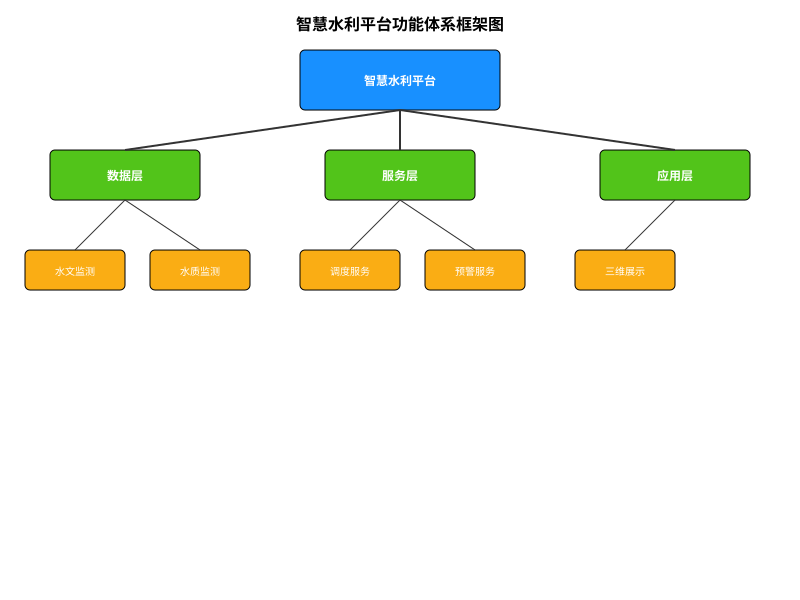

# 第三节 平台主要功能介绍

## 1.10 智慧水利平台功能体系

智慧水利平台的功能体系是根据水利业务需求设计的，覆盖水利工作的各个方面。从功能定位上，可以将平台功能分为四大类：监测预警、调度决策、工程管理和信息服务。

### 1.10.1 功能体系框架

智慧水利平台的功能体系框架如下：

**监测预警功能**：实现对水利要素的全面感知和预警  
**调度决策功能**：支持水利工程的科学调度和决策  
**工程管理功能**：实现水利工程全生命周期管理  
**信息服务功能**：提供面向各类用户的信息服务  

这四类功能相互关联、相互支撑，共同构成完整的智慧水利平台功能体系。

### 1.10.2 功能设计原则

智慧水利平台的功能设计应遵循以下原则：

**业务驱动原则**：
- 功能设计以水利业务需求为出发点
- 充分考虑水利工作实际流程和习惯
- 注重解决实际业务问题和痛点

**用户体验原则**：
- 界面设计简洁明了，符合用户使用习惯
- 操作流程简单高效，降低使用门槛
- 提供个性化配置，适应不同用户需求

**技术先进原则**：
- 采用先进成熟的技术，确保系统稳定可靠
- 运用新技术提升系统智能化水平
- 保持技术架构开放性，支持未来扩展

**安全可靠原则**：
- 功能设计充分考虑安全性要求
- 关键功能提供备份和容错机制
- 确保系统在各种条件下稳定运行

## 1.11 监测预警功能

监测预警功能是智慧水利平台的基础功能，通过各类监测设备和技术手段，实现对水利要素的全面感知和预警。

### 1.11.1 水文气象监测

水文气象监测功能负责收集和处理水文气象数据，包括：

**降雨监测**：
- 雨量站实时监测：接入各类雨量站数据，实时监测降雨情况
- 雨量分布分析：基于监测数据和雷达数据，分析降雨空间分布
- 累计雨量统计：计算不同时段的累计雨量，支持自定义统计区间

**水位流量监测**：
- 水位实时监测：接入水位站数据，实时监测河湖水位变化
- 流量计算分析：基于水位数据和率定关系，计算河道流量
- 水位流量过程线：展示水位和流量的时间变化过程

**气象要素监测**：
- 温度湿度监测：监测气温和湿度的变化
- 风向风速监测：监测风向和风速的变化
- 气压蒸发监测：监测气压和蒸发量的变化

### 1.11.2 水利工程监测

水利工程监测功能负责监测水利工程的运行状态，包括：

**大坝安全监测**：
- 变形监测：监测大坝位移、沉降等变形情况
- 渗流监测：监测大坝渗流量和渗流压力
- 应力应变监测：监测大坝内部应力和应变状态

**水库运行监测**：
- 水位监测：监测水库水位变化
- 库容计算：根据水位计算水库蓄水量
- 出入库流量监测：监测水库入库和出库流量

**闸门运行监测**：
- 开度监测：监测闸门开启高度
- 启闭状态监测：监测闸门启闭状态
- 机电设备状态监测：监测启闭机等设备运行状态

### 1.11.3 水资源监测

水资源监测功能负责监测水资源状况，包括：

**水量监测**：
- 地表水监测：监测河湖水量变化
- 地下水监测：监测地下水位和储量变化
- 用水计量监测：监测各类用水户的取水量

**水质监测**：
- 常规指标监测：监测pH、溶解氧、电导率等常规指标
- 污染物指标监测：监测COD、氨氮、重金属等污染物指标
- 生物指标监测：监测藻类、细菌等生物指标

**水生态监测**：
- 水温监测：监测水体温度变化
- 透明度监测：监测水体透明度变化
- 生物多样性监测：监测水生生物多样性状况

### 1.11.4 预警预报功能

预警预报功能负责基于监测数据进行分析预测和预警，包括：

**洪水预报**：
- 降雨预报：基于气象数据预报未来降雨
- 洪水预报：预报河道洪峰流量和到达时间
- 水库调度预报：预报水库调度后的下游河道水情

**干旱预警**：
- 干旱监测：监测土壤墒情和地表水缺乏程度
- 干旱预警：基于监测数据和气象预报发布干旱预警
- 供水保障分析：分析干旱条件下的供水保障能力

**水质预警**：
- 水质异常监测：监测水质参数的异常变化
- 水质预警：发现水质异常时发出预警
- 污染溯源分析：分析水质污染的可能来源

**工程安全预警**：
- 监测数据分析：分析工程监测数据的变化趋势
- 安全状态评价：评价工程的安全状态
- 异常预警：发现异常状态时发出预警

## 1.12 调度决策功能

调度决策功能是智慧水利平台的核心功能，通过数据分析和模型计算，支持水利工程的科学调度和决策。

### 1.12.1 防洪调度

防洪调度功能支持洪水期间的科学调度决策，包括：

**洪水调度方案生成**：
- 情景模拟：模拟不同降雨和调度情景下的洪水演进
- 方案优化：根据防洪目标优化调度方案
- 调度过程管理：管理调度方案的制定和执行过程

**梯级水库联合调度**：
- 梯级水库信息整合：整合梯级水库的水情和工情信息
- 联合调度模型：建立梯级水库联合调度模型
- 优化调度计算：计算最优的联合调度方案

**风险分析与评估**：
- 洪水风险评估：评估洪水风险等级和影响范围
- 调度风险评估：评估不同调度方案的风险
- 风险预警：对高风险区域和情况进行预警

### 1.12.2 水资源调度

水资源调度功能支持水资源的优化配置和利用，包括：

**供水调度**：
- 需水分析：分析不同用户的需水量
- 可供水分析：分析可供水资源量
- 供水方案生成：生成最优的供水调度方案

**灌溉调度**：
- 灌区需水计算：计算灌区需水量
- 灌溉制度优化：优化灌溉用水时间和数量
- 节水灌溉控制：实现精准灌溉和节水控制

**水电调度**：
- 发电效益分析：分析水电站发电效益
- 发电调度优化：优化水电站的发电调度
- 电力系统协调：与电力系统协调优化调度

### 1.12.3 应急调度

应急调度功能支持突发事件下的应急处置，包括：

**应急预案管理**：
- 预案制定：制定各类突发事件的应急预案
- 预案演练：开展应急预案的演练
- 预案评估：评估应急预案的有效性

**应急响应**：
- 事件监测：监测突发事件的发生和发展
- 影响评估：评估突发事件的影响范围和程度
- 应急指挥：协调各方力量开展应急处置

**应急调度决策**：
- 情景模拟：模拟突发事件下的不同处置情景
- 应急措施生成：生成应急处置措施
- 决策支持：为应急指挥提供决策支持

### 1.12.4 决策支持系统

决策支持系统为水利调度决策提供全面支持，包括：

**数据分析**：
- 多源数据融合：整合多源数据进行综合分析
- 趋势分析：分析数据变化趋势
- 关联分析：分析不同要素间的关联关系

**模型计算**：
- 水文模型：降雨-径流模型、洪水演进模型等
- 水力模型：河道水力学模型、水库调度模型等
- 优化模型：多目标优化模型、决策树模型等

**方案评估**：
- 效益评估：评估调度方案的经济效益
- 风险评估：评估调度方案的风险
- 综合评价：对调度方案进行综合评价

## 1.13 工程管理功能

工程管理功能支持水利工程全生命周期的科学管理，包括建设管理、运行管理和维护管理。

### 1.13.1 工程建设管理

工程建设管理功能支持水利工程建设过程的管理，包括：

**项目管理**：
- 计划管理：制定和管理工程建设计划
- 进度管理：监控和管理工程建设进度
- 质量管理：监控和管理工程建设质量

**设计管理**：
- 设计文档管理：管理工程设计文档
- 设计审查：支持设计方案的审查
- 设计变更：管理设计变更过程

**施工管理**：
- 施工监控：实时监控施工现场
- 工程量管理：管理工程量的计量和结算
- 验收管理：支持工程验收过程管理

### 1.13.2 工程运行管理

工程运行管理功能支持水利工程的日常运行管理，包括：

**运行监控**：
- 实时监控：实时监控工程运行状态
- 运行参数管理：管理工程运行参数
- 运行记录：记录工程运行情况

**调度管理**：
- 调度计划管理：管理工程调度计划
- 调度指令下达：下达工程调度指令
- 调度执行监控：监控调度指令的执行情况

**运行评价**：
- 运行效率评价：评价工程运行效率
- 运行成本分析：分析工程运行成本
- 运行绩效评价：评价工程运行绩效

### 1.13.3 工程维护管理

工程维护管理功能支持水利工程的维护管理，包括：

**维修养护管理**：
- 养护计划管理：制定和管理养护计划
- 维修工单管理：管理维修工单的创建和处理
- 养护记录管理：记录维修养护活动

**设备管理**：
- 设备台账管理：管理设备的基本信息
- 设备状态监控：监控设备的运行状态
- 设备维护管理：管理设备的维护活动

**安全评价**：
- 安全检查：支持工程安全检查
- 隐患管理：管理工程安全隐患
- 安全评估：评估工程的安全状况

### 1.13.4 资产管理

资产管理功能支持水利工程资产的全生命周期管理，包括：

**资产台账管理**：
- 基础信息管理：管理资产的基本信息
- 资产分类管理：按类型管理资产
- 资产变动管理：管理资产的增减变动

**资产评估**：
- 资产价值评估：评估资产的价值
- 资产状况评估：评估资产的使用状况
- 资产效益评估：评估资产的使用效益

**资产决策支持**：
- 资产规划：支持资产配置规划
- 投资决策：支持资产投资决策
- 处置决策：支持资产处置决策

## 1.14 信息服务功能

信息服务功能负责向各类用户提供水利信息服务，包括管理决策服务、政务服务和公众服务。

### 1.14.1 管理决策服务

管理决策服务面向水利管理者和决策者，提供决策支持服务，包括：

**综合分析**：
- 数据可视化：直观展示各类水利数据
- 统计分析：对水利数据进行统计分析
- 专题分析：针对特定主题进行深入分析

**形势研判**：
- 水情分析：分析当前水情状况
- 发展趋势：预测水情发展趋势
- 风险预警：对潜在风险进行预警

**辅助决策**：
- 情景模拟：模拟不同决策情景的效果
- 方案比较：比较不同决策方案的优劣
- 建议生成：生成决策建议

### 1.14.2 政务服务

政务服务面向政府部门和企事业单位，提供水利政务服务，包括：

**在线办事**：
- 取水许可：提供取水许可申请和审批服务
- 工程审批：提供水利工程审批服务
- 水土保持：提供水土保持方案审批服务

**信息公开**：
- 政策法规：公开水利政策法规信息
- 规划计划：公开水利规划和计划信息
- 统计数据：公开水利统计数据

**互动交流**：
- 意见征集：征集公众对水利工作的意见
- 投诉举报：处理水利相关投诉和举报
- 咨询答复：回答水利相关咨询

### 1.14.3 公众服务

公众服务面向社会公众，提供水利信息和服务，包括：

**水情信息**：
- 实时水情：提供实时水情信息
- 水质信息：提供水质信息
- 预警信息：提供洪水、干旱等预警信息

**科普宣传**：
- 水利知识：普及水利科学知识
- 防灾避险：宣传防灾减灾知识
- 节水护水：宣传节水和水环境保护知识

**互动服务**：
- 信息查询：提供水利信息查询服务
- 问题反馈：接收公众问题反馈
- 智能问答：提供智能问答服务

### 1.14.4 移动应用服务

移动应用服务通过移动终端提供随时随地的水利信息服务，包括：

**移动监测**：
- 现场数据采集：支持现场巡查和数据采集
- 移动监控：随时查看监测数据和视频
- 异常上报：及时上报发现的异常情况

**移动办公**：
- 移动审批：随时处理审批事项
- 移动会议：支持远程视频会议
- 消息通知：实时接收重要消息通知

**移动服务**：
- 位置服务：提供基于位置的水利信息
- 实时查询：随时查询水利信息
- 互动交流：便捷参与水利工作互动

## 习题与思考

1. 分析智慧水利平台的功能体系框架，说明各类功能之间的关系。
2. 监测预警是智慧水利平台的基础功能，请详细描述水文气象监测的主要内容和技术手段。
3. 调度决策是智慧水利平台的核心功能，请分析防洪调度功能的主要内容和实现方式。
4. 工程管理功能如何支持水利工程的全生命周期管理？请结合实例进行说明。
5. 针对不同类型的用户，智慧水利平台应该提供哪些信息服务？请设计一套合理的信息服务方案。

## 参考文献

1. 水利部. 水利信息化标准体系[Z]. 2020.
2. 王浩, 王建华, 等. 智慧水利理论体系与技术路线[J]. 水利学报, 2021, 52(3): 1-10.
3. 陈守煜, 张国新, 等. 智慧水利信息服务关键技术研究[J]. 水利信息化, 2019(4): 10-16.
4. 刘昌明, 王中根, 等. 水文水资源管理信息系统[M]. 北京：科学出版社, 2017.
5. 尚松浩, 李致家, 等. 大数据环境下水利决策支持系统构建[J]. 中国水利, 2020(11): 15-19. 