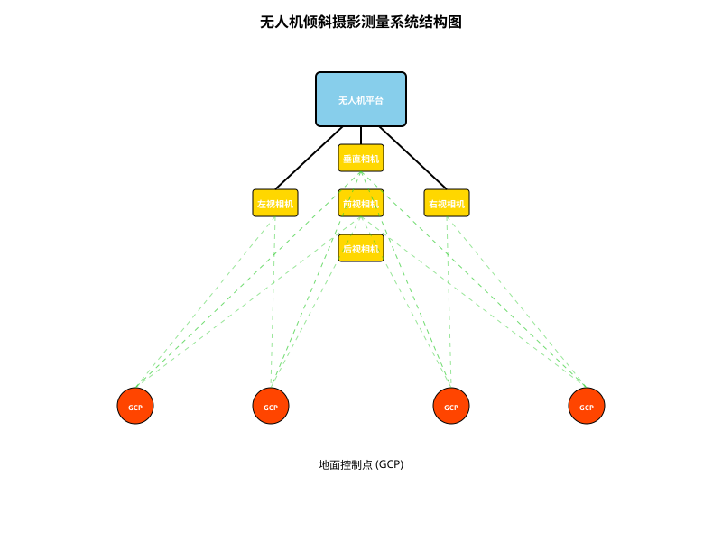
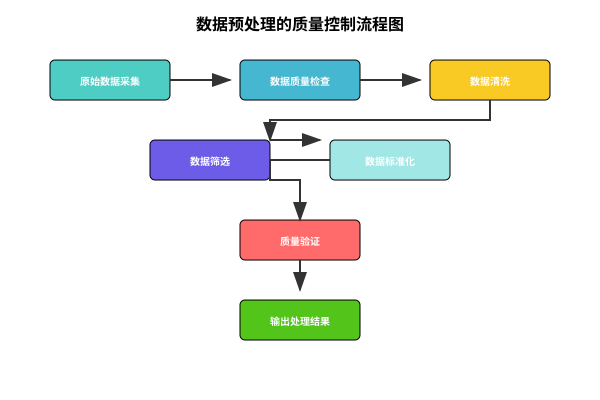

# 第四节 倾斜摄影技术应用

无人机倾斜摄影测量技术包括无人机和倾斜摄影测量技术两部分。其中，无人机起到搭载倾斜摄影测量设备的作用，而摄影测量任务则由倾斜航空相机完成。目前应用较多的是五镜头航空相机，分别从正摄、前视、后视、左视和右视五个方位进行数据采集，配合实时差分定位系统获取地物高精度的位置和姿态信息。

## 6.4.1 无人机倾斜摄影测量系统构成

无人机倾斜摄影测量系统主要由四部分组成，分别是无人机飞行器、航摄仪、地面控制器和内业数据处理软件。如图6.4.1所示。

### （1）无人机飞行器

无人机即无人驾驶飞行器，可通过无线电遥控设备或程序控制装置进行操控。无人机的种类丰富多样，根据动力结构的不同，可分为油动和电动两种；按照外形结构可分为固定翼、多旋翼无人机和无人直升机，其中多旋翼无人机又包含四旋翼、八旋翼等；从用途方面来看，又可分为军用、民用和专业级无人机。

### （2）航摄仪

航摄仪指的是搭载在飞行器平台上的进行航空摄影的仪器，它能够从不同角度采集地物影像，包括倾斜角度、垂直角度等，能够对地物的信息进行相对完整地获取，并且航摄仪可以根据飞行器的载荷限制来确定搭载的镜头数量，目前所使用的镜头以单镜头和五镜头居多。在飞行器飞行过程中，多个相机系统通过同步曝光对地物不同角度的影像信息进行采集，同时借助高精度定位系统获取曝光影像对应位置及姿态信息，从而获得地物位置姿态文件以及实景三维影像用于实景三维模型构建。

### （3）地面控制器

地面控制器是控制无人机的部分，主要包括三种控制方式：一是操控人员利用遥控器在地面对无人机的飞行过程进行控制；二是操控人员利用内置的航线规划软件进行飞行航线的设计，让无人机按照所设计的航线飞行，操控人员仅对起飞、降落以及紧急情况进行人为干预；三是飞行全过程均由航线规划软件设计程序控制飞行。地面控制系统发挥着监控无人机飞行过程和确保飞行器安全等重要作用，通过该系统可以明确飞行器的各项飞行参数，同时可以实现对其飞行姿态进行控制。

### （4）内业数据处理软件

近年来，倾斜摄影测量技术在航空测绘行业飞速发展，它利用倾斜影像进行三维重建而成为一项关键性的技术。对于倾斜摄影所采集的数据，后期处理方式分为三维建模和修模两部分。目前市场上有很多倾斜摄影三维建模软件，较主流的包括Smart 3D、大疆智图、Pix4D Mapper、Photoscan、Photomesh、街景工厂等；而后期修模软件一般使用天际航公司的DP-Modeler。

## 6.4.2 无人机倾斜摄影测量特点与应用

随着国际测绘领域技术的发展，测绘需求与日俱增，倾斜摄影测量技术应运而生。传统的摄影测量技术只能从垂直角度进行拍摄，从而只能采集地物顶部的信息；倾斜摄影测量能从前、后、左、右以及上方五个角度采集地物影像信息，打破了垂直摄影只能从地物顶部获取影像的局限，在一定程度上对垂直摄影所存在的不足进行了弥补，但倾斜影像也存在一系列问题，如影像中出现的几何畸变、数据缺失、地物遮挡等。

### 倾斜摄影测量技术特点

无人机倾斜摄影可以在同一飞行平台上搭载多台传感器，不仅能够满足倾斜摄影测量从五个角度获取地物信息的技术特点，而且能够更加真实、直观地反映地物情况，结合当前先进的定位技术，在采集的航空影像中嵌入高精度的地理信息，极大扩展了遥感影像的应用领域，同时基于快速成图及建模软件自动纹理映射的特点，提高了影像采集和建模的效率，大大降低了三维建模的成本。本文总结无人机倾斜摄影测量特点如下：

**（1）高效灵活的数据采集**
利用无人机搭载航摄仪进行航空摄影，不仅能够灵活、高效地采集地面影像，而且可以根据无人机航高的不同，采集不同分辨率的地面影像，从而满足各种数据采集需求。除此之外，无人机设备携带较为方便，还能够有效提高测绘作业的机动性。

**（2）自动化建模能力**
无人机倾斜摄影测量采集数据的高效性能够减少测绘作业的时间成本，通过建模软件可以对大量的倾斜摄影数据进行处理，无需人工干预即能进行自动空中三角测量运算，并且重建后能够自动建立实景三维模型，从而减少人力资源的消耗，降低人工成本。

**（3）纹理映射质量优越**
基于无人机倾斜摄影所采集的大量倾斜影像数据，专业自动化建模软件能够进行纹理提取并在构建模型时进行自动纹理映射，不仅能够提高实景三维模型的生产效率，还能在一定程度上优化三维模型的质量，在保证快速建模的同时还能获取高质量的模型。

### 应用领域

无人机倾斜摄影测量的突出优势，使其不仅深度应用于测绘领域，在公安、应急、救援、旅游、农业等行业都得到了广泛应用，并获得了各行业用户的肯定和好评，同时也取得了显著的经济效益。本文所了解的无人机倾斜摄影测量应用如下：

**（1）三维实景模型应用**
在三维实景模型应用方面，无人机倾斜摄影测量饰演着重要的角色。对于实景三维城市建设而言，通过无人机倾斜摄影测量能够快速建立城市现状的三维实景模型，并能对模型进行及时更新，更好地为数字城市管理提供服务；在工程施工、竣工方面，无人机倾斜摄影测量能够从空中快速采集建筑物的影像数据，然后导入专业软件进行三维模型构建，为施工规划决策提供辅助，为工程竣工提供依据。

**（2）土方量计算**
利用无人机倾斜摄影测量可以将采集的地形地貌影像及高精度地理信息导入建模软件，生成3D地形，并可进行土方量计算，快速精准测量土方的高度、长度、面积、角度、坡度等。

**（3）多领域专业应用**
无人机倾斜摄影测量还广泛应用于林业、矿区勘察，输电线巡检，行政执法等多个方面。近年来更广泛应用在救灾抢险勘察以及人员搜救等方面，其在各行各业的应用中有着出色的表现，发挥着不可小觑的力量。

## 6.4.3 三维模型具体构建流程

倾斜摄影测量技术由于作业效率高、成本低、模型效果良好等优势，常被用于获取大场景三维模型。不仅可以快速生成摄影测量数字产品如DEM、TDOM，且生产的实景三维模型可用于绘制大比例尺地图等。倾斜摄影构建三维模型的流程如下：

1）无人机采集测区大量的倾斜影像，对影像进行匀光匀色以及畸变处理，对影像数据以及POS数据检查，保证相对应。

2）影像匹配环节，对影像间同名点进行匹配，经过空中三角测量计算后，恢复相机曝光瞬时位置和姿态。

3）多视影像密集匹配生成密集匹配点云，构建不规则三角网，在此基础上生成白膜模型。

4）建模影像数据对白膜模型进行纹理映射，最终生成与现实相符的实景三维模型。

### 6.4.3.1 无人机倾斜摄影测量模型数据预处理

航摄飞行获取的原始影像数据使用与相机镜头配套的专业软件进行图像预处理。对每架次飞行获取的影像数据进行及时、认真地检查和预处理，严格按照匀光、匀色要求对航摄影像进行调整，最后获得最佳成像效果的影像数据。

影像预处理是航摄影像从不可见到可见，实现其色彩还原的重要步骤。在无人机航摄中，影像预处理对后期成果的影响在于处理速度和匀光匀色的调校。为了获得符合要求的数据，大坝工程影像数据按照以下要求进行预处理。

**预处理要求：**

1）采取分布式不间断的方法进行数据的预处理，提高数据预处理的速度和反馈效率。

2）影像预处理原则是使影像的色阶直方图尽可能布满0～255色阶的区间，并接近正态分布。确保真彩影像色调丰富，颜色饱和，彩色平衡良好，彩色还原正常。

3）在光线明暗差距不大的航摄状况时，对同一条航线使用同一调色模板。若明暗差距大，大气透明度不高时，对一幅或几幅影像进行逐个调色，以达到最佳的真实色彩。

在影像质量检查阶段和Mosaic阶段对影像颜色进行调整，改善摄区局部因为天气影响导致的有雾、反差较大等颜色问题，以消除因为雾气、反差等因素的影像。数据预处理的质量控制流程见图6.4.2。

### 6.4.3.2 ContextCapture平台

ContextCapture实景三维建模软件，前身是较为知名的Smart3D Capture。Context Capture软件支持多种数据格式，是目前较为常用的倾斜影像数据处理软件模型，且成果是较为常用的格式，可在多种平台上浏览。该软件可以实现集群运算，即多台计算机同时为同一测区工程作业。Context Capture主要包括：Center Master、Settings、Center Engine、Viewer。

**软件组成：**

- **Master**：负责创建工程、查看任务进度
- **Settings**：负责为Engine设置路径
- **Engine**：引擎端，提交空三和重建任务后，开启引擎，可单独打开运行调动机器作业
- **Viewer**：可加载三维模型浏览以及量测模型相关信息

目前，市面上应用最广的是ContextCapture软件，ContextCapture具有高性能、品质稳健、兼容性好、可扩展、可移植性强等特点。ContextCapture软件支持多种数据源，兼容各种航摄相机系统（Pictometry、Midas、AMC、A3等），同时能够输出OBJ、OSGB、DAE、XML等通用兼容格式，且能方便自由地导入各种主流GIS平台及三维编辑软件。

## 6.4.4 工程三维模型构建流程

为了提高建模效率，大坝数字化建模可以采用工作站并行GPU框架架构和专用硬盘存储数据，保证数据快速读取及高效计算。除此以外，为了保证建模精度和效果，还要选择一款性能强大的建模软件，倾斜摄影三维建模软件众多，如Bentley公司的ContextCapture、Skyline公司的PhotoMesh、Astrium公司的街景工厂等。

以采用ContextCapture作为建模软件为例，介绍建模流程。ContextCapture三维建模是利用空中三角测量算法，空中三角加密提取5个视角的影像特征点，将特征点与同名点进行匹配，通过反向结算确定影像之间的相对关系。

### 特征点选取原则

特征点选取主要原则为：

（1）特征点应选刺在航向及旁向六片（或五片）重叠范围内，使布设的特征点能尽量公用。

（2）特征点尽量布设在旁向重叠的中线附近。旁向重叠过小，相邻航线像控点不能公用时，应分别布点。当旁向重叠过大使相邻航线的点不能公用时，亦应分别布点。

（3）当特征点为平高点时，实地选点时选择影像清晰的明显地物点，如接近线状地物的交点，地物拐角点等实地辨认误差小于图上0.1mm的地物点，当像控点为高程点时，要优选局部高程变化不大的地物目标点，不可在弧形地物及高程变化较大的斜坡处选刺像控点。

### ContextCapture建模过程

ContextCapture通过空中三角加密计算出大量的连接点，利用这些连接点构建不规则三角网TIN，生成三维模型的基本框架，将三维模型白模和表面的纹理信息进行自动映射，从而获取具有真实、自然纹理的高分辨率实景三维模型。

ContextCapture整个建模过程如下：

**（1）新建工程**
双击打开Context Capture Center Master，点击New project，会生成相应的文件夹，以及文件后缀为ccm的文件。

**（2）导入数据**
导入倾斜影像数据，并导入相应五视镜头的相机参数以及POS数据。

**（3）空三加密**
导入数据之后，在surveys界面下标记少许几个像控点的位置，即刺点工作，完成后提交空三任务。经过首次空三计算之后，可以使像控点与影像大致关联，方便作业人员继续完成控制点刺点工作。一般在标记两到三张影像之后，会更加精确的关联到其他影像。

在影像上刺点时，要根据现场照片以及结合影像中周围地物仔细确认像控点位置，避免刺点错误，否则可能会导致空三结果质量变差甚至导致空三任务失败。为提高空三任务的精度，刺点作业时要尽可能的多的标记像控点相关联的影像。

**（4）用户连接点优化方案**
空三任务结束后，空三成果质量除了查看空三质量报告外，3D view下的密集匹配点云的状态也是重要的参考。在部分场景纹理偏弱，计算机不能识别，匹配难度增加时，就会出现部分升起以及下降的影像，这些影像没有参与计算或计算结果存在着错误。

针对上述情况，通过添加用户连接点进行调节。采用人机交互的方式，人工判读标记明显的地物特征，引导计算机去识别，进而让这些影像重新参与计算，并恢复其正确的姿态和位置。

**（5）三维重建**
空三任务完成，满足建模条件后，建立新的三维重建任务，设置参数，选择坐标系，此时默认建模区域是一个整块，软件会给出预计最大内存使用值，需要结合自身计算机内存情况，对建模区域进行划分，一般选取Regular planar grid进行划分，设定瓦片大小的值，确定划分的瓦片个数。

产品格式一般设置为Open Scene Graph binary (OSGB)格式，选择目标坐标系统，定义生产模型范围，最后选择模型输出位置。

## 6.4.5 模型成果分析

### 6.4.5.1 模型复杂度分析

模型成果格式主要为OSGB格式以及S3C格式，OSGB格式模型与相对应的OBJ格式模型导入第三方平台进行模型修饰。S3C文件是分块模型的索引，可以全场景加载三维模型。将S3C格式的成果文件加载到Viewer模型浏览平台上，通过旋转浏览可以看出重建区域的三维实景模型中地物相对位置的正确与否。根据《三维地理信息模型数据产品规范》所规定，可以进一步评价模型达到的构建级别要求。

### 6.4.5.2 模型几何精度分析

为验证倾斜摄影测量技术生产的三维模型精度能否满足一些测绘应用如立面测绘、大比例尺地形图绘制、地籍测量等等，需要对模型几何精度进行分析。Context Capture生产的三维模型，加载到Viewer浏览平台上可以进行三维坐标量测、距离量测、高差计算及其他分析功能。

在测区内选取20个显著特征点，选点时要在现场和模型中可以清晰找到，利用RTK进行实测其三维坐标并将其作为真值，通过模型浏览平台采集相对应位置三维坐标，计算两者之间差值并进行统计。按照如下中误差公式可以计算面中误差及高程中误差，并进行模型几何精度评定。

$$m_p = \sqrt{\frac{\sum_{i=1}^{n}((\Delta x_i)^2 + (\Delta y_i)^2)}{n}}$$  (6.4.1)

$$m_x = \sqrt{\frac{\sum_{i=1}^{n}(\Delta x_i)^2}{n}}$$  (6.4.2)

$$m_h = \sqrt{\frac{\sum_{i=1}^{n}(\Delta h_i)^2}{n}}$$  (6.4.3)

通过计算构建的三维模型点位中误差、平面最小误差、最大误差值、高程中误差、高程最小误差、最大误差值，根据《三维地理信息模型数据产品规范》规定，即可评价模型满足的等级要求。

## 6.4.6 小结

本节介绍了无人机倾斜摄影技术在三维场景模型构建中的应用。随着遥感与航空摄影技术的不断发展，无人机（UAV）成为获取地表空间数据的重要平台，其灵活、低成本、高分辨率的特点使其在城市建模、灾害评估、农业监测、水利工程等多个领域广泛应用。

尤其在三维场景建模方面，传统的正射影像由于只能从垂直角度进行拍摄，难以全面反映建筑物或地形的立体结构。而倾斜摄影技术通过在无人机平台上搭载多镜头相机，从多个不同角度同时拍摄地面及建筑物，弥补了正射影像在侧面信息获取上的不足。

该技术在水利工程三维场景构建中的应用尤为突出。例如在大坝、水库、河道、闸门等重点区域，通过无人机倾斜摄影获取其完整的空间影像信息，再结合后期建模软件如ContextCapture、Pix4D、3DF Zephyr等进行处理，可生成精细化的真实感三维模型。这些模型不仅可用于视觉展示，更能够与GIS数据、BIM模型、传感器信息等集成，形成多维度、多场景的虚拟仿真平台。

倾斜摄影技术的优势不仅在于其建模精度和真实性，更在于其高效性和灵活性。传统的地面测绘需耗费大量人力物力，且在复杂地形或灾害区域难以实施；而无人机倾斜摄影可快速响应现场需求，进行高频次、定期或突发性的航拍任务，在应急响应和运维监测中具有明显优势。

在未来，随着计算机视觉、人工智能与大数据技术的进一步融合，无人机倾斜摄影将不仅局限于模型构建，更将在自动目标识别、变化检测、施工进度对比、结构健康诊断等方面发挥重要作用。通过与BIM、CIM（城市信息模型）以及物联网系统的深度结合，可实现三维场景的智能化感知与运维，推动智慧水利、智慧城市等新型基础设施体系的发展。

