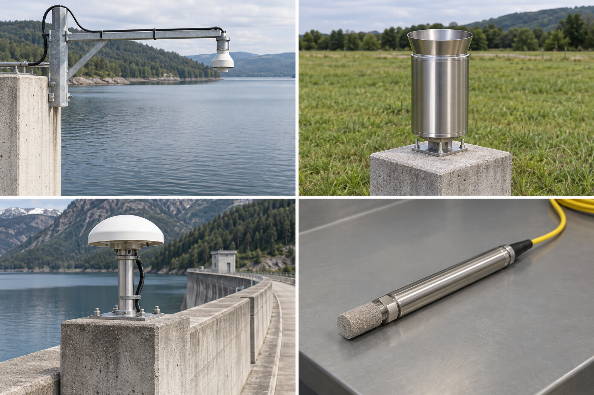
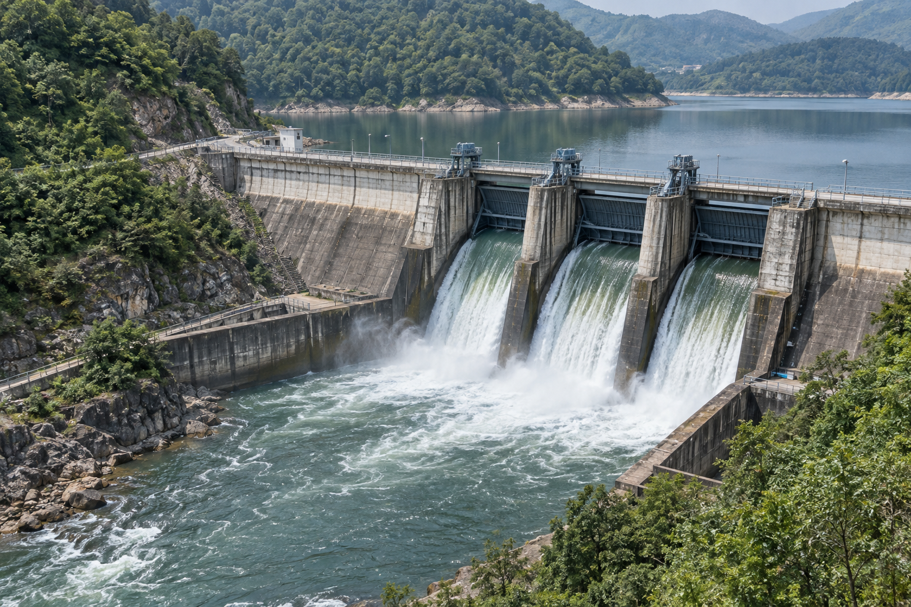
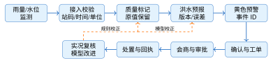
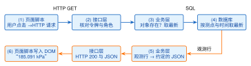
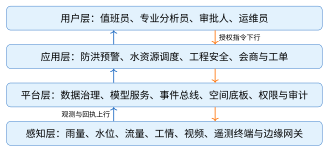
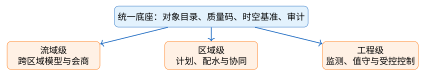

# 第1章 智慧水利概述与平台架构基础

**学习目标**

学完本章，读者应能够：

1.  说明智慧水利的业务目标、能力边界及其与一般信息化系统的区别；

2.  解释感知、平台、应用和用户四层之间的数据上行与控制下行关系；

3.  区分测站通信规约、消息传输协议和数据交换标准的用途；

4.  不写代码地追踪一次“查询某测点最新观测”的请求，说出页面无数据时先去哪个环节找证据；

5.  沿一次洪水预警链路识别数据、模型、人员和审计证据，并说明为什么水利平台的建设需要软件工程方法。

**引言**

智慧水利平台围绕防洪、供水和工程安全等任务，连接监测感知、通信、数据治理、模型计算、业务协同和运行管理。以洪水预警为例，页面上的水位和预警等级分别来自测站观测与规则判定；判定结果还要经过值班确认、专业复核和处置反馈。理解这些环节之间的数据联系与岗位职责，是设计平台的起点。本章先说明智慧水利是什么、平台由什么组成，再用一次真实的查询请求把“平台”落到可以观察的环节上；这次请求是配套工程 S0 阶段的内容，第4、5章会亲手把它实现出来。

## 1.1 智慧水利的概念与发展

**本节层次**

核心：1.1.1、1.1.2、1.1.3、1.1.5；拓展：1.1.4。

**进入本节所需知识**

从已学水文与水工知识出发，能举出一项需要持续监测的工程任务。

### 1.1.1 定义、边界与基本特征

智慧水利是以水利对象和治理活动为服务对象，以可信数据为基础，以模型和知识为支撑，通过数字化场景、智慧化模拟和精准化决策提升预报、预警、预演、预案能力的业务与技术体系。它包含软件平台，也包含测站、网络、制度、人员和工程运行边界。

智慧水利平台的基本特征见表1.1。表中的“含义”说明建设目标，“可核验表现”说明验收时看什么：指标要能追溯到具体测点与处理规则，模型输出要附带适用范围和误差说明，预警事件要保留责任人、时限和回执。本书后面各章做出来的每一个功能，都可以对着这张表的右列检查。

**表 1.1  智慧水利平台的基本特征**

| 特征     | 含义                                   | 可核验表现                       |
|:---------|:---------------------------------------|:---------------------------------|
| 业务牵引 | 从防洪、供水、工程安全等任务反推能力   | 每项功能对应角色、场景和验收问题 |
| 数据可信 | 统一对象编码、时间、单位、质量码和来源 | 任一指标可追溯到测点与处理过程   |
| 模型支撑 | 模型有版本、适用范围和误差说明         | 结果能复现，越界或失败时明确提示 |
| 协同闭环 | 预警进入确认、处置、复核和归档         | 责任、时限、回执和审计记录完整   |
| 安全运行 | 数据、控制和平台权限按风险分级         | 高风险动作受审批约束且可回滚     |

!!! warning "注意"

    **常见概念误用：防洪标准与洪灾风险。**

    防洪标准的“30年一遇”或“100年一遇”描述的是工程针对致灾因子所采用的重现期目标；建设方案因此应写成“防洪标准由30年一遇提高到100年一遇”。洪灾风险则是致灾因子、暴露度、脆弱性和应对能力共同作用的结果，还会受到调度能力、预警提前量以及极端事件尾部影响。风险评估需要同时说明危险性、承灾体和防灾减灾能力，不能把一个重现期数字直接当作风险下降幅度。

### 1.1.2 政策主线与发展脉络

进入“十四五”时期，水利部把智慧水利建设纳入推动水利高质量发展的实施路径，提出“需求牵引、应用至上、数字赋能、提升能力”，并以数字孪生流域为核心建设预报、预警、预演、预案（简称“四预”）能力[[2]](../../references.md#ref2)。《关于大力推进智慧水利建设的指导意见》提出到2025年建成七大江河数字孪生流域，配套的《“十四五”期间推进智慧水利建设实施方案》将其细化为94项具体措施[[2]](../../references.md#ref2)。随后，《数字中国建设整体布局规划》《国家水网建设规划纲要》与数字孪生水利工程相关文件进一步把流域、水网和工程联系起来[[3]](../../references.md#ref3)[[1]](../../references.md#ref1)[[4]](../../references.md#ref4)。

政策目标不等于项目验收指标。项目要把“四预”分解为可测试的问题：输入场景是否完整、模型是否可复现、预警是否按权限流转、预演是否保留方案版本、预案是否能关联责任与资源。表1.2按依据层级列出每类文件主要回答的问题，以及平台一侧能拿出来核验的证据。读政策文件时按发布年份、文件标题和适用范围分别建立时间线，二手转载页不能当作唯一来源。

**表 1.2  智慧水利政策与建设依据的阅读和落地映射**

| 依据层级             | 主要回答的问题                       | 平台侧可核验的落地证据                                                                                  |
|:---------------------|:-------------------------------------|:--------------------------------------------------------------------------------------------------------|
| 国家数字化与水网规划 | 治理目标、基础设施协同和公共数据方向 | 对象编码范围、数据共享边界、跨区域协同场景与责任清单[[3]](../../references.md#ref3)[[1]](../../references.md#ref1) |
| 智慧水利指导意见     | 建设原则、业务牵引和能力重点         | “四预”能力分解表、需求优先级、模型适用范围和闭环时延指标[[2]](../../references.md#ref2)                |
| 数字孪生工程指导文件 | 工程对象、运行管理和数字映射要求     | 工程对象目录、空间关系、状态同步规则、预演方案版本和回放记录[[4]](../../references.md#ref4)                   |
| 行业标准与规约       | 数据如何采集、交换、校验和追责       | 报文样例、字段字典、质量规则、兼容性测试和异常重传记录[[5]](../../references.md#ref5)                              |

“能力存在”和“能力有效”要分开。系统菜单里有预警模块，只能证明功能入口存在；要证明预警能力有效，还要抽查输入数据的完整性、模型计算的版本、阈值的审批记录、消息的送达情况和处置回执。预演模块能打开场景，不代表预演结果经过了专业分析员复核；预案能导出文件，不代表资源、联系人和时限在演练中可用。把这些证据写进需求和测试用例，政策语言才变成可重复的工程检查，这正是第2章要练习的事。

智慧水利不是一次建成的。图1.1把它的发展分成四个阶段，每个阶段解决一个问题，并留下一类证据。信息化阶段解决“有没有数据、能不能查到”：单位工程建立数据库和报表系统，把纸质台账转换为可检索记录；数据常按部门分散保存，跨系统关联靠人工整理。数字化阶段把“记录”推进为“可计算的对象”：测点、河段、闸门、泵站有稳定编码，观测记录带有时间、单位、质量状态和来源，地图与业务表可以通过接口关联；如果对象编码不一致、缺测没有标记，模型再复杂也只会放大数据问题，所以验收重点从页面数量转向数据目录、接口契约和质量规则。智慧化阶段回答“如何根据证据行动”：实时数据、历史序列、规则、模型和岗位流程组合成预报、预警、预演、预案的连续业务链，模型可以提出候选方案，审批人仍依据工程规程和权限边界作出决定，系统记录输入快照、模型版本、阈值版本和处置回执，复盘时才能解释“当时为什么这样做”。数字孪生阶段强调物理对象与数字模型的持续映射：对象状态、空间关系、时间序列、机理模型和业务服务通过统一标识关联，随现场观测和业务操作协同更新，运行中的偏差反过来推动数据质量和模型参数复核[[6]](../../references.md#ref6)[[4]](../../references.md#ref4)。四个阶段逐层积累：没有可靠的记录就没有可治理的数据，没有一致的数据底板智慧化模型就无法稳定运行，没有持续的对象映射数字孪生只能停留在一次性展示。分析一个建设方案时，先核查它已有的台账、接口、模型与运行记录，再判断该补哪一层。

<figure markdown>

<figcaption>图 1.1  智慧水利从信息化到数字孪生的能力演进</figcaption>
</figure>

### 1.1.3 感知、通信与数据交换

监测链路通常包含传感器、遥测终端或边缘网关、通信网络、接入服务和数据平台。三类规范分别约束不同层次的行为，见表1.3：通信规约约束测站与中心站之间报文如何编码、重传和应答，消息协议约束设备或网关的消息在网络中如何承载与订阅，数据交换标准约束一段观测时间序列如何被另一个系统正确读懂。一条完整链路可以组合使用这些规范，例如按水利通信规约接入测站报文，再按WaterML 2.0向其他系统交换观测序列。该规约原发布号为 SL 651-2014，按水利行业推荐性标准代号调整，现行编号写作 SL/T 651-2014，二者是同一标准。

**表 1.3  监测链路中三类规范的不同职责**

| 类别         | 例子                                  | 用途                                                                     |
|:-------------|:--------------------------------------|:-------------------------------------------------------------------------|
| 水利通信规约 | SL/T 651-2014《水文监测数据通信规约》 | 规定智能传感器与遥测终端、测站与中心站之间的数据通信[[5]](../../references.md#ref5) |
| 通用消息协议 | MQTT、HTTP                            | 在满足安全与可靠性约束时承载设备或网关消息                               |
| 数据交换标准 | WaterML 2.0                           | 描述和交换水文观测时间序列，不等同于测站上报通信协议                     |

图1.2从左上起按行排列雷达水位计、雨量计、GNSS监测天线和渗压计。水位计朝向水面，雨量计保持承雨口无遮挡；GNSS通过不同时刻的位置比较分析位移；渗压计探头埋设在待测部位，图中展示的是器件外观。识别仪器后，还需核对测点编码、观测量与单位：把渗压读数当作水位输入，数值即使能够显示，也失去了正确的物理含义。

<figure markdown>

<figcaption>图 1.2  四类监测仪器的外观识读（AI生成的教学渲染）</figcaption>
</figure>

### 1.1.4 智能能力的技术选型与安全边界

感知链路确定了数据进入平台的方式，智能模型则决定数据如何被解释和用于决策。技术选型取决于现场网络、功耗、时延、安全域和运维责任。涉及成本变化和性能提升时必须给出可核验基线；在线服务的可用性记录也不能直接证明具备离线部署能力。需要本地推理时，先验证模型许可、算力、更新机制、数据隔离和安全评测，再决定是否采用开源权重或专用模型，并为模型版本、训练数据摘要和人工复核责任建立登记表。模型输出只能作为预警研判的证据之一，不能绕过阈值审批和现场核验。第9章9.2.3节给出判断一项新技术是否值得投入的方法。

### 1.1.5 贯穿场景：一次洪水预警如何形成闭环

水利工程安全监测平台是本书的贯穿教学案例，载体为虚构的案例水库，案例分工见前言“贯穿案例卡”。平台接入雨量、水位和闸门状态，案例水库设溢洪道弧形闸门3孔（详细参数见8.1节）；以下预警过程用于分析数据链路与岗位职责，实际工程的判定需依据现场数据和批准规则。

图1.3展示混凝土坝、上游库面、三孔泄洪设施及下游河道的位置关系。读图时先沿水流方向辨认上下游，再找出坝顶、闸墩和闸门。平台中的工程对象需与这些实体对应：水位属于具体断面的观测，闸门开度属于指定孔口的状态；对象位置混淆时，显示正确的数值也可能指向错误的处置地点。

<figure markdown>

<figcaption>图 1.3  混凝土坝与泄洪设施的工程识读（AI生成的虚构案例教学渲染）</figcaption>
</figure>

汛期某时刻，库区雨量站上报分钟雨量。遥测终端按通信规约编码，接入服务校验站码、时间和单位；质量服务标记缺测、突变或回补，质量码为 suspect 或 missing 的观测照常入库，但不参加预警评估；洪水预报模型读取同一输入快照并输出过程线；规则服务结合批准的阈值生成黄色预警。黄色及以上预警由值班员人工确认，确认后才创建工单；专业分析员复核模型与现场情况，审批人决定是否启动预案；模型给出的闸门调度方案在本书案例里止于“模拟建议”，不驱动真实闸门。处置结果再与后续实况比较。图1.4把这条链路画成闭环：上半行是数据从监测、接入校验、质量标记到模型计算与预警生成的路径，下半行是人的确认、会商、处置与复核，虚线表示复核结论反过来校正质量规则与模型参数。读图时要留意，链路既没有在“预警发出”处结束，也没有在“处置完成”处结束。第8章会用渗压计 PZ-07 的一次异常观测，在配套工程上把这条链的“质量检查、预警定级、人工确认、工单处置、回查证据”五步真正跑一遍。

<figure markdown>

<figcaption>图 1.4  一次洪水预警从监测到复核的闭环</figcaption>
</figure>

这个案例揭示了四条边界。第一，传感器读数经过质检后才成为可用数据；第二，模型输出是带适用范围的证据，不是自动决策；第三，平台建议不能绕过人工审批和工程规程；第四，处置完成不等于流程结束，还要用实况复核并归档。

## 1.2 智慧水利平台架构体系

**本节层次**

核心：1.2.1、1.2.2、1.2.3、1.2.4、1.2.5。

**进入本节所需知识**

先读1.1节核心内容，能区分业务目标与数据来源；本节追踪一次查询。

### 1.2.1 一次查询的完整过程：从浏览器到数据库再回来

**业务问题**

值班员在监测页面点开渗压计 DAM-A-PZ-07，页面上出现“185.091 kPa，2026-07-01 23:55，质量 valid”。这一行数字从哪里来、经过了哪些环节、每个环节各负责什么——这是理解本书全部内容的起点，也是第4、5章要亲手实现的东西。本小节只追踪，不写代码。

**过程追踪**

图1.5把这次查询拆成六步。浏览器里运行的是页面脚本，它把用户动作翻译成一条 HTTP 请求：方法`GET`，路径`/api/assets/DAM-A-PZ-07/readings/latest`，头部带着登录时取得的令牌。请求到达服务端后，先由接口层核对令牌与角色，再交给业务层检查对象是否存在，业务层向数据库发出一条 SQL 查询，数据库按测点编码和观测时间检索，返回最新一条观测。业务层把数据库行整理成约定好的 JSON（字段名、时间格式、质量码都在第8章的接口契约里规定），接口层加上状态码 200 发回浏览器，页面脚本把 JSON 写进 DOM（浏览器里的页面对象树，第4章讲），用户看到那一行数字。

<figure markdown>

<figcaption>图 1.5  “查看某测点最新观测”的一次完整请求过程</figcaption>
</figure>

这次请求在配套工程里有一份实录：`companion/water-platform-demo/S0-demo-record.md`由教学接口实际运行生成，记录了登录、取对象列表、取最新观测、取一段历史和查预警状态五次请求的原文与应答，第三次就是上面这条路径，应答正是那七个字段的 JSON。实录只能看到 HTTP 两端的证据，也就是图中(1)和(2)、(5)和(6)之间的往来；(3)(4)发生在服务端内部，第3章的表3.12按同一个任务把服务端拆成三层再走一遍，第5章则亲手写出这三层。

**六个环节各自会怎么坏**

这张图的价值不在“成功时怎么走”，而在“页面没有数据时该去哪里找”。表1.4按环节列出最常见的失败原因和你能看到的证据：同样是“页面空白”，令牌过期、对象编码写错、数据库里确实没有观测、脚本把 204 当成错误，四种原因分别落在不同环节，排查顺序也不同。实录的后半部分把其中四种当场制造了一遍：不带令牌得到 401，编码打成`DAM-A-XX-99`得到 404，查询还没有上报过数据的位移测点`DAM-A-D-01`得到 204，时间窗写反得到 400 并在错误体里指出是`from`字段。第4章会教你用浏览器开发者工具看到(1)(2)(5)(6)的证据，第5章会教你用日志和 SQL 看到(3)(4)的证据。

**表 1.4  页面无数据时，各环节的常见原因与可见证据**

| 环节           | 常见原因                                | 你能看到的证据                                        |
|:---------------|:----------------------------------------|:------------------------------------------------------|
| \(1\) 页面脚本 | 路径拼错；请求根本没发出                | 开发者工具“网络”面板里找不到这条请求，或路径不对      |
| \(2\) 接口层   | 未登录、令牌过期、角色无权              | 状态码 401 或 403，响应体给出错误码                   |
| \(3\) 业务层   | 对象编码不存在；参数非法                | 状态码 404 或 400，错误体指出字段                     |
| \(4\) 数据库   | 该对象确实没有观测；数据库连不上        | 前者状态码 204（正常的“没有”）；后者 5xx 与服务端日志 |
| \(5\) 序列化   | 字段名、时间格式与契约不一致            | 状态码 200 但页面脚本读到 undefined                   |
| \(6\) 写入 DOM | 脚本把 204 当作失败，或把旧响应写了进去 | 状态码正常而页面仍空白或显示错对象                    |

**验收**

不要求写代码。能对着图1.5和实录说出：页面显示“暂无观测”时最可能在哪个环节、需要看什么证据；令牌过期与对象编码写错在页面上的表现有什么区别。做到这两点，第4章的“数据请求与页面状态”和第5章的“第一个 HTTP 接口”就都有了落点。

### 1.2.2 四层架构与双向链路

为便于学习，本书把平台划分为感知层、平台层、应用层和用户层。分层是职责边界，不代表必须部署为四套系统。1.2.1节那次查询只经过了平台层和用户层之间的一小段；图1.6把视野放宽到整个平台，左右两组箭头分别表示观测与回执上行、授权指令下行。两条链路穿过的是同样四层，安全要求却并不对等。

<figure markdown>

<figcaption>图 1.6  智慧水利平台四层架构及数据、控制双向链路</figcaption>
</figure>

观测数据与设备回执自下而上进入业务应用；经授权的调度或控制意图自上而下传递。下行链路必须比一般查询具备更严格的身份、审批、有效期、设备状态校验和回滚条件：一次查询出错，值班员看到的是空页面；一次错误的闸门指令，后果发生在现场。三维动画只能模拟闸门启闭与水流变化，不能替代真实控制反馈。

### 1.2.3 平台形态与能力边界

“平台”首先是服务范围和责任边界，其次才是部署规模。流域级平台面向跨行政区、跨工程的水资源配置、防洪会商和信息共享，重点是统一对象目录、汇聚多源观测、支撑跨区域模型和协同调度；工程级平台面向水库、水闸、泵站或堤防等单项工程，重点是设备接入、工程安全监测、运行值守、工单和控制审批；区域级平台位于二者之间，服务一个灌区、城市或管理局，重点是把辖区内多个工程和业务部门组织成可执行的日常管理流程。选型时先问“谁需要在什么空间尺度上作出什么决定”：上游来水与多工程联合调度是流域级问题，某座水库的变形监测和闸门状态核验是工程级问题，灌区配水与管理站协同是区域级问题。同一套软件可以通过租户、数据域和权限策略服务多个尺度，但每个尺度都要明确数据可见范围、模型适用范围和审批边界。

表1.5把三种形态的服务对象、核心能力和不宜承担的任务放在一起。最后一列用于在立项阶段识别“能力越界”：流域级平台不直接下发未经工程审批的控制指令，工程级系统不承诺跨区域的资源统筹。本书的案例水库平台是工程级平台。

**表 1.5  流域级、区域级与工程级平台形态对比**

| 平台形态 | 主要服务对象                         | 典型能力与选型场景                                                                       | 能力边界提醒                                                     |
|:---------|:-------------------------------------|:-----------------------------------------------------------------------------------------|:-----------------------------------------------------------------|
| 流域级   | 流域机构、跨区域会商和调度部门       | 多源数据汇聚、跨工程模型、联合调度、公共信息共享；适合需要统一时空基准和跨区域协同的任务 | 输出调度建议，不替代工程现场的设备确认和分级审批                 |
| 区域级   | 灌区、城市或管理局及其下属单位       | 用水计划、配水执行、辖区预警、工单协同和统计分析；适合连接多个工程与岗位流程的日常管理   | 需明确与上级流域平台的数据交换频率、责任人和冲突处理规则         |
| 工程级   | 水库、水闸、泵站、堤防等工程运维团队 | 测点接入、质量检查、安全监测、巡检、设备状态和受控控制；适合低时延、强责任和现场闭环     | 不单独承诺跨工程资源配置或公共数据治理，控制动作必须保留回退路径 |

三种形态的共同底座包括对象与空间目录、身份与权限、数据接入和质量服务、时序与业务存储、模型与规则服务、事件与工单、审计与运维、接口与消息总线，差别在于优先级：流域级更关注跨域数据交换和会商证据，区域级更关注业务流程与统计，工程级更关注设备状态、数据龄期和现场处置。图1.7画出从公共底座向三种形态分流的逻辑结构：同一条水位观测可以被流域模型读取、被区域报表统计，也被工程值班页面展示，但每个消费者都要声明用途、时效和质量门槛。一个平台同时服务多种形态时的租户隔离与分形态抽查见附录C的C.14节。

<figure markdown>

<figcaption>图 1.7  同一数据底座支撑三种平台形态</figcaption>
</figure>

### 1.2.4 典型子系统与业务实例

以水利工程安全监测平台为例，工程级平台至少包含八类相互协作的子系统：接入服务负责测点、视频和设备回执；数据质量服务负责格式、单位、范围、时序和重复校验；对象与空间服务负责工程、测点、断面和坐标关系；时序数据服务保存带质量状态的观测；模型服务执行预报、趋势和安全分析；预警与规则服务把结果转换为告警事件和岗位任务；会商与工单服务组织确认、审批、处置和复核；权限、审计与运维服务记录谁在何时以什么版本执行了什么动作。子系统的划分依据是稳定职责和数据边界，不是页面菜单数量。第3章3.1.3节会用同一个案例，从需求条目出发把动作归并成模块，得到的模块表比这里的八类更具体。

把1.1.5节图1.4的洪水预警链路对到这八类子系统上，可以看清它们的边界：模型服务不负责审批，工单服务不篡改原始观测，设备接入不决定业务预警等级，审计服务也不替代专业复核。边界清楚，才能在局部故障时降级并定位责任。

在区域级灌区场景中，同一底座可以复用对象目录、质量码和权限体系，但业务链路改为“用水户申报—管理站复核—渠道能力校核—配水计划审批—执行回执—偏差复盘”，第2章的需求分析练习用的就是这条链。流域级平台则可能消费区域级汇总数据，运行联合调度模型并向多个区域发布建议。三个尺度之间通过版本化接口交换最小必要数据，交换记录包含来源、时间、质量和责任域；任一跨域接口失败，都要给出数据龄期和降级提示，下游才不会把旧数据误当成实时状态。

### 1.2.5 架构设计原则

前面的子系统划分和业务实例背后有五条原则。每条原则都对应案例水库里一个会真实发生的问题，下面按“它解决什么问题、做对了是什么样、做错了是什么样”来说明。

**业务与数据一致**

它解决的问题是“页面上的数字能不能被相信”。对象编码、单位、时间基准和质量码贯通各层，页面中的指标能够追溯到原始数据和处理规则。案例水库的“当前水位”必须说明测点、采集时间、质量状态和聚合方法，模型输入与页面展示不能各自取一份未标版本的数据。正例是水位回放、预警事件和处置工单使用同一对象编码，并能从事件反查输入快照；反例是报表把厘米值当成米值，或把补传的旧记录显示成实时值，却没有在界面和日志中提示。1.2.1节应答里的七个字段，就是这条原则在一次查询上的样子。

**模块边界清楚**

它解决的问题是“换一个部件要不要重写全部业务”。接入、质量、存储、模型、预警和工单各自承担稳定职责，通过版本化接口协作；某个模型或三维引擎替换时，其余模块不改。正例是质量服务只输出带状态的观测，模型服务声明所需质量门槛，预警服务只消费模型结果和批准规则；反例是页面组件直接拼接设备报文并自行判断预警等级，同一测点在不同页面得到不同结论。第3章3.4节讨论怎样划分边界才算合理。

**高风险操作受控**

它解决的问题是“智能建议会不会直接变成现场动作”。查询、模拟、建议、审批和执行是不同权限，平台不能因“智能”而越过工程规程和责任制度。案例水库的模型可以给出闸门调度建议，但真实控制前还要核对设备状态、联锁条件、有效期和审批记录；正例是建议生成待审批任务，反例是把浏览器按钮直接映射为控制指令。表1.6把四个角色对六类操作的权限列成矩阵。矩阵中的“建议”表示可以提交方案但不能改变设备状态，“审批”表示可以批准业务任务但仍需执行岗位核对设备回执；运维员拥有服务和配置维护职责，也不因此自动获得业务审批权。第5章5.6节把这类矩阵写成代码里的方法级权限。

**表 1.6  案例水库高风险操作权限矩阵**

| 操作           | 值班员     | 专业分析员 | 审批人   | 运维员       |
|:---------------|:-----------|:-----------|:---------|:-------------|
| 查询观测与事件 | 允许       | 允许       | 允许     | 允许         |
| 运行模型模拟   | 允许       | 允许       | 查看结果 | 维护运行环境 |
| 提交调度建议   | 起草上报   | 允许       | 查看     | 禁止         |
| 批准处置任务   | 禁止       | 禁止       | 审批     | 禁止         |
| 执行受控指令   | 按授权执行 | 禁止       | 禁止     | 设备技术维护 |
| 修改阈值与规则 | 禁止       | 提议并复核 | 审批变更 | 实施后留痕   |

**失败可见并可降级**

它解决的问题是“某个部件坏了，值班员还能不能工作，会不会被旧数据误导”。网络中断时缓存并标记数据龄期；模型失败时保留实时监测；三维失败时退化为二维地图、图表和表格。降级期间，界面标明数据来源、最后更新时间、仍可使用的功能和恢复条件。正例是边缘节点暂存观测并标记待补传，页面显示“数据陈旧”且暂停自动预警；反例是连接断开后继续用上一小时的水位计算风险，却仍显示“实时”。表1.7把触发条件、可见提示和恢复证据对应起来；第4章页面的“过期”状态和第8章的“未评估”口径，都是这张表在具体功能上的落实。

**表 1.7  网络与计算异常下的可见降级状态**

| 状态       | 触发条件                         | 页面与服务行为                                           | 恢复证据                         |
|:-----------|:---------------------------------|:---------------------------------------------------------|:---------------------------------|
| 正常       | 数据在时效窗口内且质量为valid    | 允许查询、模型计算和预警流程按规则运行                   | 最新采集时间、质量检查记录       |
| 网络中断   | 接入连接失败或心跳超时           | 边缘暂存；显示数据龄期；暂停依赖实时性的自动动作         | 重连时间、补传顺序、重复校验结果 |
| 数据陈旧   | 记录超过业务时效或仍待补传       | 保留历史曲线但标注陈旧，禁止把旧值当实时输入             | 补传记录、时间对齐和质量复核     |
| 模型失败   | 输入不足、服务异常或版本校验失败 | 保留监测与人工研判入口，输出失败原因，不生成新的模型预警 | 服务日志、输入快照、重算结果     |
| 三维不可用 | 场景或瓦片加载失败               | 切换二维地图、图表和表格，保留对象编码与空间查询         | 加载日志、降级时段、恢复检查     |

**全过程可观测**

它解决的问题是“事后能不能说清一条预警为什么产生、谁批准了动作”。日志、指标、追踪和审计共同回答系统是否可用、数据是否可信、模型是否运行、业务是否闭环。每一次模型调用都要关联输入快照、模型版本、规则版本和耗时，每一次高风险操作都要关联操作者、审批人、设备回执和失败原因。正例是从一条预警事件追到测点原值、模型输出、确认意见和处置结果；反例是只保留最终页面截图，无法说明告警为何产生。可观测性因此既服务运维，也服务水利业务复盘。

五条原则要在同一个故障场景下一起检验。以“网络中断时仍要完成值班复核”为例：只在前端缓存最后一条水位的方案看似可用，却既没有记录采集时间，也没有限制模型和控制操作，同时违反了业务与数据一致、高风险操作受控和全过程可观测三条；改进方案先在边缘侧保存带采集时间和质量状态的原始记录，服务端依据数据龄期决定是否允许模型计算，页面显示陈旧标识，值班员可以查看和补录现场信息，但不能在缺少实时回执时直接执行控制。这样的取舍应当写成一份简短的架构决策记录，第3章3.6节给出写法，按“正例—反例—证据”三栏组织评审的做法见附录C的C.14节；第3章通过模块职责和接口设计落实这些原则，第4、5章讨论前后端协作，第6、7章讨论三维场景和观测数据展示。

## 1.3 为什么水利平台需要软件工程

**本节层次**

核心。

**进入本节所需知识**

先读1.2节，能按请求顺序说出感知、数据、服务与页面的职责。

软件不仅是源代码，还包括配置、数据结构、接口、脚本和运行文档。它有几个和水工建筑物很不一样的地方：软件是逻辑产品，质量只能通过行为和证据间接验证；它不会物理磨损，却会因需求、依赖、数据和环境变化而失效；一处修改容易开始，却可能沿接口、数据和部署关系扩散；它的复杂度来自大量状态、组合和异常路径，测试不可能穷尽所有输入。

这些特点在水利平台上会以具体的方式出现。汛期规则、测点、工程状态、模型和安全要求持续变化，增加一个雨量测点会牵动哪些环节，第2章2.1节有一个完整的例子。1.2.1节那条只有六个环节的查询，就已经有六种不同的失败方式；第8章的处置链更长，参与的角色更多。没有一套办法记录“谁提出了什么需求、为什么这样设计、改动影响了哪些地方、怎样证明它按要求工作”，团队就无法判断一个问题出在需求、设计、代码、环境还是运行操作。

软件工程提供的就是这套办法：需求阶段明确“谁在什么场景下解决什么问题”，设计阶段确定对象、数据流和权限边界，实现阶段按接口契约协作，验证阶段覆盖正常、异常和降级路径，运行阶段用监控、工单和复盘持续改进。对水利平台，这套办法还要多管一件事：模型结果由专业人员复核，页面标明测值来源与质量状态，控制指令经过审批和设备状态校验，这些要求同样写进需求、测试和运行记录。第2章从生命周期讲起，用案例灌区练习需求获取、结构化分析和需求规格说明；第3章为案例水库划分模块、约定接口并记录架构决策。

## 1.4 小结

信息化、数字化、智慧化和数字孪生分别积累记录、关联、研判和映射能力。没有可检索的台账就没有可治理的数据；没有一致的对象编码和质量标记，模型再复杂也只会放大数据问题。分析建设方案时，可依次检查台账与报表、数据目录与接口契约、模型与处置流程、可回放的对象状态映射。已有材料反映现有能力，缺失的材料则指出后续建设和验证的重点。

监测链路上的三类规范各有职责。通信规约（如 SL/T 651-2014）约束测站与中心站之间报文怎么编码、重传和应答；通用消息协议（如 MQTT、HTTP）约束设备或网关的消息在网络中怎么承载与订阅；数据交换标准（如 WaterML 2.0）约束一段观测时间序列如何被另一个系统正确读懂。三类规范可以在同一系统内配合使用，选型时分别核对设备报文、网络传输和跨系统交换的要求。

一次“查看某测点最新观测”的请求经过页面脚本、接口层、业务层、数据库、序列化和写入 DOM 六个环节，页面无数据时先按环节找证据：401/403 在接口层，404/400 在业务层，204 是正常的“没有”。四层架构中，观测与回执上行、授权指令下行穿过的是同样四层，安全要求却并不对等。下行链路要额外校验身份、审批、有效期、设备状态和回滚条件；三维场景可以模拟闸门启闭与水流变化，但模拟不等于控制反馈。第8章的工单与审批流程将这些校验落实为角色权限、状态转换和操作记录。

## 1.5 核心术语表

| 术语     | 本书含义                                                                            |
|:---------|:------------------------------------------------------------------------------------|
| 智慧水利 | 以数字化、网络化、智能化手段提升水利治理和工程运行能力的业务与技术体系。            |
| 四预     | 预报、预警、预演、预案，详见第8章数字孪生案例。                                     |
| 数字孪生 | 物理对象、数字模型、数据和服务持续关联的系统方法，详见6.4节。                       |
| 三维场景 | 在统一坐标与对象编码下表达工程和环境的交互空间，详见第6章。                         |
| 感知层   | 获取雨量、水位、流量、工情等观测及设备回执的设备与边缘资源。                        |
| 平台层   | 提供数据、模型、事件、空间、权限和审计等共享能力的层次。                            |
| 应用层   | 面向防洪、供水、工程安全等任务组织业务流程与界面的层次。                            |
| 质量码   | 表示观测数据有效、缺测、异常等状态的受控代码；本书取 valid、suspect、missing 三值。 |
| 人在回路 | 把专业判断、审批和复核嵌入模型与自动化流程的机制。                                  |

## 1.6 章末交付物

完成本章后，学习小组应提交：一张带数据上行和控制下行的四层架构图；一份洪水预警链路说明；一张监测通信规约、消息协议和数据交换标准的对照表；对照`S0-demo-record.md`写出的一份说明，指出页面无数据的四种情形分别对应图1.5的哪个环节、凭什么证据判断。

## 1.7 思考题与练习题

1.  为什么智慧水利平台不能等同于三维可视化大屏？

2.  说明“防洪标准提高”与“洪灾风险降低”的区别。

3.  以图1.6为依据，分别举出一条数据上行和控制下行链路。

4.  为什么WaterML 2.0不能直接表述为测站上报通信协议？

5.  案例水库有28个测点，每分钟每点上报1条200字节记录。忽略协议开销，计算每日原始数据量，并说明工程估算还应加入哪些开销。

6.  在“雨量上报—洪水预报—黄色预警—工单处置”链路中，列出至少四项必须保存的审计证据。

7.  选择网络中断、模型失败或三维加载失败之一，设计一个降级方案。

8.  为一个闸门启闭模拟页面说明“模拟建议”与“真实控制”之间必须设置的边界。

9.  值班员反映“点开某个测点后页面一片空白”。按表1.4写出你会依次查看的三处证据，并说明看到“状态码 204”“状态码 401”“状态码 200 但页面仍空白”三种情况时各自的结论。

10. 对照`S0-demo-record.md`中“时间窗写反”的那次请求，说明错误体里的`field`字段对页面有什么用；如果服务端只返回状态码 400 而没有错误体，页面能做什么、不能做什么。
