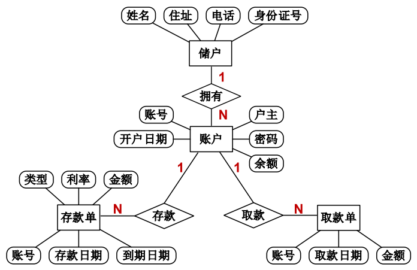

## 2.3 需求分析

需求分析是软件开发生命周期中的关键阶段，旨在通过系统化的方法准确捕捉和理解用户需求，为后续设计和开发奠定基础。这一阶段的核心任务是将用户的非正式需求陈述转化为完整、准确的需求定义，明确系统必须完成的功能和性能要求。需求分析不仅涉及功能的界定，还包括系统的性能、可靠性、用户体验等多方面要求。通过功能分解、结构化分析、信息建模和面向对象分析等方法，开发团队可以逐步细化需求，确保系统设计能够满足用户的实际需求。需求分析的结果通常以需求规格说明书、用户手册和测试计划等形式呈现，为后续的开发、测试和维护提供明确的指导。

### 2.3.1 需求分析的特点

需求分析是软件开发生命周期中的关键阶段，标志着从可行性研究向实际开发工作的过渡。在这个阶段，开发团队的核心任务是明确系统必须完成的工作，准确理解和转化用户需求，将用户的非正式需求陈述转化为完整、准确的需求定义。这一过程不仅关乎功能的界定，更涉及到系统的性能、可靠性、用户体验等多方面要求。需求分析阶段为系统设计和实现奠定了基础，其质量直接影响到整个系统的开发进度、成本以及最终的成功与否。

尽管在可行性研究阶段已经对用户需求有了初步了解，但需求分析阶段需要更加细致和全面地明确系统的具体功能和性能要求。此时，需求的变动和复杂性往往会带来挑战，且不同背景的团队成员之间的沟通障碍也是常见问题。因此，如何进行有效的需求收集、分析、验证和管理，成为了确保软件项目成功的关键。

**1.需求易变性**

用户的需求往往会随着对系统的深入了解而发生变化。最初提出的需求可能会在后续的开发过程中不断调整和增补，甚至某些需求的变化会影响到整个系统的设计和功能实现。需求的这种易变性是需求分析过程中常见的挑战之一，开发人员必须灵活应对这些变动。

**2.问题的复杂性**

用户需求往往涉及多个复杂的因素，如运行环境、系统功能、性能要求等。同时，随着计算机技术的不断发展，应用领域变得越来越广泛，所解决的问题也变得愈加复杂。需求分析必须充分考虑这些复杂性，确保系统设计能够满足多种需求，并具备良好的扩展性和适应性。

**3.交流障碍**

需求分析通常涉及多个角色，如用户、系统分析员、问题领域专家、需求工程师以及项目经理等。这些人具有不同的背景知识、观点和目标，导致相互之间存在沟通障碍。需求分析人员需要善于协调各方，确保各方的需求能够得到充分的理解和表达。

**4.不完备性和不一致性**

由于各类人员对于系统的需求可能有不同的视角，需求描述往往存在不完备或不一致的情况。需求分析的工作之一就是要消除这些不一致性，确保需求的完备性和一致性。只有通过不断的讨论、澄清和验证，才能确保最终的需求定义是准确的、没有冲突的。

### 2.3.2 需求分析的原则

需求分析是软件开发过程中至关重要的阶段，其核心目标是通过系统化的方法准确捕捉和理解用户需求，为后续设计和开发奠定基础。以下是需求分析过程中需要遵循的几项基本原则：

**（1）分解与细化原则**

复杂问题通常难以直接理解和解决，因此需求分析的首要原则是将复杂系统分解为更小、更易管理的部分。通过功能分解和逐层细化，可以将系统的整体需求划分为多个模块或子功能，并明确它们之间的接口和交互关系。这种方法不仅降低了问题的复杂度，还便于团队分工协作，确保每个部分的功能清晰且可验证。

**（2）数据域与功能域分离原则**

需求分析需要同时关注系统的数据域和功能域。数据域包括数据流、数据内容和数据结构，描述了数据在系统中的流动方式和组织形式；功能域则关注系统如何处理数据，包括对数据的操作、转换和控制逻辑。通过明确区分数据域和功能域，可以更全面地理解系统的需求，避免遗漏关键细节。

**（3）模型驱动原则**

模型是需求分析的核心工具，用于抽象和表达系统的信息、功能和行为。通过建立数据流图、用例图、状态图等模型，分析人员可以更直观地理解系统的运行机制，并与用户和开发团队进行有效沟通。模型不仅是需求分析的成果，也是后续设计和开发的重要输入。

**（4）用户中心原则**

需求分析的最终目标是满足用户需求，因此用户参与是需求分析过程中不可或缺的环节。通过与用户密切合作，分析人员可以更准确地捕捉用户的真实需求，避免因误解或沟通不畅导致的偏差。用户反馈应贯穿需求分析的始终，确保最终需求文档能够真实反映用户的期望。

**（5）可验证性原则**

需求分析的结果必须是明确、具体且可验证的。每项需求都应具备清晰的描述和验收标准，以便在开发完成后进行验证。避免使用模糊或歧义的语言，确保需求文档能够为设计和测试提供明确的指导。

**（6）可追溯性原则**

需求分析应建立需求与设计、开发、测试之间的追溯关系。通过需求跟踪矩阵等工具，确保每项需求都能在后续阶段得到实现和验证。这种追溯性不仅有助于项目管理，还能在需求变更时快速定位影响范围。

**（7）灵活性与适应性原则**

需求分析需要具备一定的灵活性，以应对需求变更和不确定性。通过迭代和原型设计等方法，分析人员可以在早期阶段验证需求的可行性，并根据用户反馈及时调整需求文档。这种适应性能够有效降低项目风险，提高最终产品的用户满意度。

### 2.3.3 需求分析的重要性

软件需求是决定软件开发是否成功的一个关键因素。

（1）需求分析可以帮助开发人员真正理解业务问题

（2）需求分析是估算成本和进度的基础

（3）需求分析可以避免建造错误的系统，从而减少不必要的浪费

（4）软件规格说明有助于开发人员与客户在“系统应该做什么”问题上达成正式契约

（5）需求分析形成了软件开发的基线，有助于管理软件的演化和变更

（6）软件需求是软件质量的基础，为系统验收测试提供了标准

### 2.3.4 需求分析的任务

在软件工程中，需求分析的任务是确保开发的系统能够完全符合用户需求的关键步骤。其基本任务是准确理解现有系统，并定义新系统的目标，明确系统必须“做什么”，即识别和描述系统的基本功能和要求。在这一阶段，重点是理解用户的需求，而非技术实现。因此，需求分析不仅仅是对现有系统的总结，还涉及深入的沟通和交流，以便在可行性研究阶段的粗略基础上，进一步明确和细化系统需求。

**1.问题明确定义**

需求分析的首要任务是确保对系统问题的明确定义。这包括识别和详细描述系统所必须具备的各种需求。功能需求、性能需求、环境需求、用户界面需求及系统的可靠性、安全性、可移植性等各方面的要求，都需要在这一阶段进行梳理和明确。在实际操作中，双方可能会对某些需求存在不一致，这时需要通过持续的交流和调查研究，达成共识，确保各方理解一致，并使需求定义更加准确。

**2.导出软件的逻辑模型**

在明确需求之后，分析人员需通过一致性检查和逐步细化的过程，导出软件的逻辑模型。这一过程涉及将系统的功能需求细化为具体的子功能，并对数据域进行分解，进一步明确系统的结构和组成。在需求分析阶段，通过建立实体关系图（ER图）来导出软件的逻辑模型。例如，图2-9展示了一个银行储蓄系统的ER图，描述了储户、账户、存款单和取款单等实体及其之间的关系。通过这样的逻辑模型，开发团队可以清晰地理解系统的数据结构和业务逻辑，为后续的设计和开发奠定基础。

图2-9 银行储蓄系统ER图

**3.编写文档**

需求分析阶段的最后一个重要任务是将分析的结果形成正式的文档。这些文档不仅为后续的开发、设计和测试提供依据，还为项目管理和团队沟通提供基础。关键文档包括：

（1）需求说明书：描述系统的整体概貌、功能要求、性能要求以及未来的可能扩展需求，结合数据流图、数据字典等工具，明确系统的结构和算法。

（2）用户手册：从用户的角度出发，描述系统的使用方式、界面及操作流程，确保开发人员从用户需求出发设计系统。

（3）确认测试计划：为后期的系统测试和验收提供指导，确保开发出的系统符合需求说明书中的要求。

（4）修改后的开发计划：根据需求分析结果，调整开发进度、资源使用计划和成本预算，更精准地估算项目实施的时间和资源需求。

### 2.3.5 需求分析的方法

需求分析是软件开发的关键环节，旨在通过深入理解问题域，构建一个准确反映用户需求的系统模型。这一模型不仅需要清晰描述系统的功能和责任，还要为后续设计、开发和测试提供可靠的依据。在众多需求分析方法中，功能分解法、结构化分析法、信息建模法以及面向对象分析法是应用最为广泛的几种方法，每种方法都有其独特的视角和适用场景。

**1.功能分解法**

功能分解法以系统的功能为中心，将复杂系统逐步拆解为更小、更易管理的子功能。其核心思想是从系统的主要功能出发，逐层细化到具体的操作步骤。这种方法强调功能的层级结构和接口定义，便于开发团队理解系统的整体框架和功能模块之间的交互。功能分解法特别适用于功能需求明确且结构清晰的系统，例如传统的业务处理软件。

**2.结构化分析法**

结构化分析法以数据流为核心，通过对数据在系统中流动过程的分析，揭示系统的处理逻辑和数据结构。其核心工具是数据流图（DFD），用于可视化数据在系统中的流动路径、处理节点以及存储位置。结合数据字典和处理说明，结构化分析法能够全面描述系统的数据流和处理规则。这种方法尤其适用于以数据处理为主的系统，如数据库管理系统或事务处理系统。

**3.信息建模法**

信息建模法以实体和关系为基础，强调对系统中核心数据及其关联的建模。其核心工具是实体-关系图（E-R图），用于描述系统中的实体、属性以及实体之间的关系。信息建模法的核心目标是从现实世界中抽象出系统的数据结构，为数据库设计和数据管理提供基础。这种方法特别适用于数据密集型的系统，例如企业资源规划（ERP）系统或内容管理系统。

**4.面向对象分析法**

面向对象分析法以对象为核心，将系统视为一组相互作用的对象集合。每个对象是对问题域中事物的抽象，包含数据（属性）和行为（方法）。面向对象分析法强调对象的封装、继承和多态性，能够有效地模拟现实世界的复杂关系。这种方法适用于需要高度模块化和可扩展性的系统，例如图形用户界面（GUI）应用或大型分布式系统。

每种需求分析方法都有其独特的优势和适用场景。在实际开发中，开发团队可以根据系统的特点选择合适的分析方法，或者结合多种方法的优势，构建更加全面和精确的系统模型。需求分析的目标不仅是明确系统的功能需求，更重要的是为后续开发提供一个清晰、可操作的蓝图，确保最终产品能够真正满足用户的需求。

## 思考题与练习

### 基础题

1. 请简述本节的核心概念，并说明其在智慧水利平台开发中的重要性。
2. 总结本节介绍的主要技术方法，并分析各方法的适用场景。
3. 结合智慧水利的实际需求，解释本节内容如何应用于实际项目中。

### 提高题

4. 分析本节涉及的技术难点，并提出可能的解决方案。
5. 比较本节介绍的不同方法的优缺点，并给出选择建议。
6. 设计一个简单的案例，说明如何将本节理论应用于智慧水利系统设计。

### 讨论题

7. 讨论本节内容与其他相关技术的集成方案，分析可能遇到的挑战。
8. 展望本节涉及技术的发展趋势，分析其对智慧水利未来发展的影响。

## 本节小结

本节内容为智慧水利平台的设计和开发提供了重要的理论基础和技术指导。通过学习本节内容，学生应能够理解相关概念的内涵和应用价值，掌握基本的分析方法和设计原则，为后续章节的学习和实际项目的开展奠定坚实基础。
