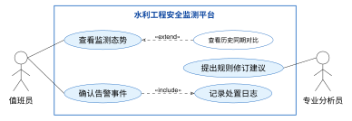
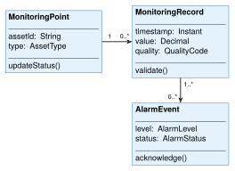
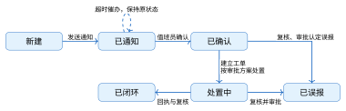
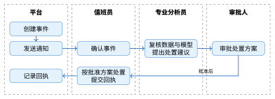
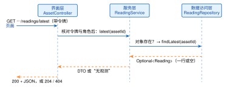
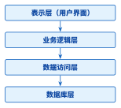
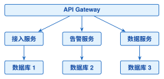
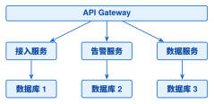
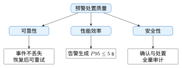

# 第3章 软件架构设计与模块划分

**学习目标**

通过本章学习，学生应能够：

1.  从一组带编号的需求出发划分模块，说明每个模块承载哪条需求、因为什么而改动

2.  会把“高性能”“高可靠”一类形容词需求改写为含刺激、环境、响应与度量的质量属性场景，并给出验证手段

3.  用用例图、类图、状态图、活动图和时序图描述同一个设计，并检查几张图是否一致

4.  按第8章8.1节的接口契约约定模块接口，沿模块图走查一次查询请求和一次预警数据流，写出走查记录

5.  用案例水库的负载数字比较单体、模块化单体与微服务，把结论写成架构决策记录（ADR）

6.  了解架构评审的组织方式和ATAM等评估方法，能对设计方案提出可验证的质疑

**引言**

第2章把用户的意见整理成了带编号、可验收的需求。本章做下一步：决定软件由哪几块组成，每一块负责什么，块与块之间通过什么接口协作。这些决定合起来就是软件架构。它们一旦写进代码，改动的代价很高，所以要在编码之前想清楚，并留下别人能检查的图和表。

全章沿一条线推进，每一步都有一份看得见的产物：3.1节从案例水库的 REQ-MON 系列需求出发，得到需求表、模块职责表和质量属性场景表；3.2节说明模块内部怎样分层；3.3节约定接口，并沿图走查“查询渗压计 PZ-07 的最新观测”和“渗压超阈值产生预警”两条路径，得到两份走查记录；3.4节讨论模块之间的依赖怎样才算合理；3.5节用案例水库的负载数字做一次架构选择；3.6节把选择写成决策记录并交给评审。

## 3.1 从需求到模块

**本节层次**

核心：3.1.1、3.1.2、3.1.3、3.1.4、3.1.5。

**进入本节所需知识**

读过第2章的需求条目、验收条件和追踪矩阵；知道第1章案例水库的测点、角色和预警闭环。

软件架构是一个系统的“结构或结构集合，包括软件构件、构件间的关系以及构件与环境的关系”<sup>[[15]](../../references.md#ref15)[[16]](../../references.md#ref16)[[17]](../../references.md#ref17)[[18]](../../references.md#ref18)</sup>。构件在本章多数时候叫模块：一组一起完成某项职责、一起修改的代码。本节为案例水库走四步：列出需求和使用者（3.1.1节），画清系统边界（3.1.2节），把需求分给模块（3.1.3节），把“快”“可靠”写成能测的场景（3.1.4节）。3.1.5节介绍记录这些设计所用的 UML 图。

### 3.1.1 需求与用例：谁用平台做什么

第2章用案例灌区练习了需求条目和追踪矩阵的写法。案例水库沿用同一套编号规则，把主线需求登记为 REQ-MON 系列，见表3.1。后文的模块、接口、架构决策和第8章的阶段验收都按这些编号回指需求，读者可以据此检查“需求—架构—验收”是否首尾相接。

**表 3.1  案例水库的主线需求（REQ-MON 系列）**

| 编号       | 需求                                                                                               | 关注点   |
|:-----------|:---------------------------------------------------------------------------------------------------|:---------|
| REQ-MON-01 | 观测入库时带质量码（valid、suspect、missing）和仪器采样的事件时间                                  | 数据可信 |
| REQ-MON-02 | 黄色及以上预警须经值班员人工确认，确认后才生成工单                                                 | 处置流程 |
| REQ-MON-03 | 交互查询、告警生成和推送送达的时延不超过表3.5的基线                                                | 性能     |
| REQ-MON-04 | 每条处置都能回查到原始读数和当时的规则版本；确认预警、修改阈值等关键操作留痕，越权操作被拒绝并记录 | 可审计   |

**参与者**

平台的使用者有四类岗位。值班员查看监测总览、确认预警事件、跟踪处置状态；专业分析员维护阈值和分析模型，做风险研判；审批人审批处置方案；运维员负责设备接入、通信维护和账号权限。平台之外还有一些系统与它交换数据：现场的采集网关、短信网关、视频平台、气象服务和上级监管平台。表3.2列出本章统一使用的术语和角色名称。接口、日志、数据库字段和测试用例都用同一套名称，跨文档核对时才对得上；业务方提出新称呼时，在需求评审中登记为同义词。

**表 3.2  第3章核心术语与角色口径**

| 类别       | 统一术语                           | 使用边界                                       |
|:-----------|:-----------------------------------|:-----------------------------------------------|
| 业务侧结论 | 预警                               | 表示对风险趋势的业务提示                       |
| 系统侧对象 | 告警事件、告警服务                 | 表示可追踪、可处置的系统对象                   |
| 岗位角色   | 值班员、专业分析员、审批人、运维员 | 分别承担监视确认、专业研判、方案审批、技术保障 |
| 质量码     | valid、suspect、missing            | 记录测值可信程度，不替代预警等级               |

**用例**

用例是参与者借助系统完成的一件事，名称用“动词＋对象”。值班员最常用的是“查看监测态势”：进入平台后看到测点布局、实时告警列表和趋势曲线，异常测点被高亮，点开能看到最近的观测、空间位置和历史同类事件。第二个是“确认告警事件”：渗压升高、位移突变或水位异常时，平台生成告警事件，把等级、触发规则、涉及测点和建议动作推送给值班员，值班员确认、转办、安排现场核查直至闭环，每一步的时间和责任人都被记录。专业分析员的用例是“阈值与模型管理”，运维员的用例是“设备接入配置”和“用户权限管理”。

图3.1是一张最小的用例图。矩形是系统边界，边界内的椭圆是用例，边界外是参与者，实线表示“谁参与哪个用例”，它不表示调用顺序。两条虚线是用例之间的关系：“确认告警事件”每次都要“记录处置日志”，这是包含（include）；“查看历史同期对比”只在需要时附加到“查看监测态势”上，这是扩展（extend）。参与者之间、用例之间还可以有泛化关系，表示一个是另一个的特例。

<figure markdown>

<figcaption>图 3.1  水利工程安全监测平台用例图示例（人物为AI生成教学渲染）</figcaption>
</figure>

### 3.1.2 系统边界：平台与外部怎样交互

划分内部模块之前，先确定哪些东西在平台之外、平台与它们怎样交互。第2章的上下文图在这里直接复用：平台画在中间，参与者和外部系统画在四周，每条连线就是一个外部接口。外部接口分四类：面向人的用户接口（监测大屏、Web 页面、移动端），面向设备的硬件接口（渗压计、GNSS 站、雨量站经遥测终端和采集网关接入，报文格式受第1章介绍的通信规约约束），面向其他系统的软件接口（上级监管平台、短信网关、气象服务），以及对网络链路、带宽和加密传输的通信要求。

一条连线要写明方向、形式、频率和失败时怎么办，才算约定清楚。表3.3给出案例水库的边界接口清单。

**表 3.3  案例水库平台的边界接口清单**

| 外部对象               | 方向   | 形式                                             | 频率                           | 失败时                                           |
|:-----------------------|:-------|:-------------------------------------------------|:-------------------------------|:-------------------------------------------------|
| 采集网关（6个）        | 进     | 观测报文，整理成带对象编码、事件时间和单位的记录 | 常规每5分钟，汛期加密到每1分钟 | 网关本地缓存，通信恢复后补传；平台按上报编号去重 |
| 值班员等四类用户       | 进、出 | 浏览器经 HTTPS 访问表8.3的接口                   | 随操作发生                     | 页面区分加载中、无数据、无权限和服务故障         |
| 短信与消息通道         | 出     | 告警通知                                         | 随告警事件发生                 | 重试；重要告警走多个通道                         |
| 上级监管平台、气象服务 | 进、出 | REST 接口或消息队列                              | 按协议约定                     | 记录失败，稍后重传，不阻塞本地监测               |

约束条件也属于环境。技术约束来自本书锁定的技术基线（Vue 3.4+、Spring Boot 3.2+、PostgreSQL 等）和既有系统的兼容要求。业务约束来自规程与权限：告警确认必须留痕，汛期采样频率与阈值随工况调整，只有授权角色才能修改安全参数。成本与合规约束会排除一部分技术上更强的方案。这一步的产物是一张上下文图和表3.3这样的一份清单。

### 3.1.3 把需求分给模块

需求条目里的每个动作都要有一个模块负责。以 REQ-MON-01 为例，“观测入库时带质量码和事件时间”里有三个动作：接收观测、判定质量、保存。REQ-MON-02 里有评估预警、通知、确认、生成工单。把全部动作列出来以后，按两条规则归并：总是一起修改的动作放进同一个模块，因为不同原因而修改的动作分开。换一种渗压计只影响“接收观测”，专业分析员调整黄色阈值只影响“评估预警”，这两个动作就不放在一起。

表3.4是案例水库的归并结果，图3.2画出这些模块之间的数据走向。表的最后一列写明每个模块因为什么而改动，3.4节用它检验边界划得对不对。

**表 3.4  案例水库的模块职责与需求对应**

| 模块           | 负责                                                                                   | 承载需求   | 因为什么而改动             |
|:---------------|:---------------------------------------------------------------------------------------|:-----------|:---------------------------|
| 监测接入       | 接收采集网关上报的报文，按设备协议解析成统一的观测记录：对象编码、事件时间、数值、单位 | 01         | 更换设备或通信协议         |
| 质量检查       | 做范围、时序和重复检查，给每条观测标上质量码                                           | 01         | 检查规则调整               |
| 观测存储与查询 | 保存观测（订正只增加版本，不删除旧值）；按对象和时间窗查询，取最新一条                 | 01、03     | 表结构、索引、聚合粒度变化 |
| 预警评估       | 用已批准的规则版本评估合格观测，产生告警事件并保存判定证据                             | 02、03、04 | 阈值与规则换版             |
| 通知与处置     | 推送通知，登记确认，确认后建立工单并跟踪回执                                           | 02、04     | 处置流程、通知渠道变化     |
| 认证与审计     | 登录、令牌与角色校验，关键操作留痕                                                     | 04         | 角色与权限调整             |
| 页面与三维场景 | 总览、曲线、告警列表和测点的三维定位                                                   | 03         | 交互和展示方式变化         |

<figure markdown>

<figcaption>图 3.2  案例水库的模块与数据走向（蓝色为观测上行和预警链路，橙色为页面发起的请求；虚线框在服务端之外）</figcaption>
</figure>

划完以后对着表3.4和图3.2做两项检查。第一，每条需求至少落在一个模块上，每个模块至少承载一条需求；找不到需求的模块多半是多余的，找不到模块的需求就是漏项。第二，想一个最近可能发生的变化，数一数要改几个模块。假如当初把解析、质量检查、预警判定和推送都放进一个“数据处理”模块，那么换设备、调阈值、加通知渠道都要改它，三个人会同时修改同一处代码，任何一次改动都要把整条链路重新测试一遍。

### 3.1.4 把质量要求写成可检验的场景

需求访谈里，功能之外的要求通常是一串形容词。对案例水库，它们集中在三个方面。可靠：汛期、强降雨和突发险情时平台要持续运行，现场断电、边缘站点离线或网络抖动时，靠网关缓存补传、双链路通信和主备切换保证重要数据不丢、预警链路不断，重要告警同时走短信、应用消息和声光等多个通道；设计时要写明全年可用率、允许的单次中断时长，以及超出设计范围时怎样降级和恢复。安全：平台承载工程安全数据和处置指令，传输用 TLS 或专网加密，用户按角色分级授权，关键操作保留审计日志，重要告警要有确认回执。易用：紧急情况下界面要突出重点测点、重要告警和风险趋势，不让关键信息淹没在列表里。这些要求只有变成数字和可以执行的检查，才能指导设计。

先看性能。表3.1里的 REQ-MON-03 要求“时延不超过基线”。基线必须是数字，还要说清从哪里量到哪里。表3.5给出本章用于架构评审的假定性能基线；全书工程参数以第8章8.1节的参数表为准。P95 指把一段时间内所有请求的耗时从小到大排列，第95%位置上的那个值，它比平均值更能反映“慢的那部分请求有多慢”。

**表 3.5  案例水库性能基线**

| 操作         | 指标            | 度量边界                          |
|:-------------|:----------------|:----------------------------------|
| 交互查询     | P95 $\leq 1$ s  | 从 API 收到查询到返回页面所需数据 |
| 告警生成     | P95 $\leq 5$ s  | 数据入站到产生告警事件            |
| 告警推送送达 | P95 $\leq 10$ s | 事件生成到值班终端收到通知        |

性能只是质量要求的一类。质量模型把这类要求分门别类，便于逐项检查有没有遗漏<sup>[[19]](../../references.md#ref19)[[20]](../../references.md#ref20)</sup>。ISO/IEC 25010 的八项顶层质量特性为功能适合性、性能效率、兼容性、易用性、可靠性、安全性、可维护性和可移植性。表3.6选出案例水库最关注的五类，写出各自对应的架构手段和水利场景；其中“扩展性”是面向演进的工程说法，由可维护性、兼容性和可移植性共同支撑。几类属性的优先级会相互冲突：同步写审计记录有利于可追溯，却会拉长告警生成的时延。取舍时把需求、备选方案、代价和理由记下来，3.6.1节的 ADR 就是记录的地方。

**表 3.6  架构质量属性与水利场景对应关系**

| 质量属性 | 架构决策与实现                           | 水利场景应用                                   |
|:---------|:-----------------------------------------|:-----------------------------------------------|
| 性能     | 异步处理、缓存、批流协同、水平扩展       | 汛期高峰数据接入与告警查询保持稳定响应         |
| 可靠性   | 冗余部署、故障转移、消息持久化、恢复演练 | 设备或节点故障时持续采集，告警与处置记录不丢失 |
| 安全性   | 加密通信、基于角色的访问控制、审计日志   | 监测数据防篡改，关键操作授权并留痕             |
| 可维护性 | 监测接入、处理与预警模块分离，接口规范化 | 更新设备驱动不影响预警模块，故障定位边界清晰   |
| 扩展性   | 分层架构、插件式适配、松耦合服务         | 接入新设备和分析模型，扩展到河道、灌区等场景   |

质量属性只有写成**场景**才能被设计和检验。一条场景有六个要素：刺激源、刺激、制品、环境、响应、响应度量。“系统要高可靠”无从设计；写成场景是：“汛期峰值期间（环境），采集网关按案例水库的运行峰值每秒推送10条观测（刺激源与刺激；负载估计见3.5.2节）到接入服务（制品），系统在不丢数据的前提下完成质量检查并入库（响应），从接入服务收到观测到完成入库的时延 P95 不超过5秒、丢失率为零（度量）。”表3.7按同样的写法列出案例水库的四条核心场景，右列是验证手段，可据此准备测试输入、运行环境和结果记录。性能场景对应 REQ-MON-03，安全场景对应 REQ-MON-04。后面的架构决策、评审和 ATAM 演练共用这一组场景。某条场景缺少度量值或验证手段时，先按第2章的方法补齐负载、统计窗口和通过条件，再比较方案。

**表 3.7  案例水库的核心质量属性场景**

| 属性     | 刺激与环境                               | 响应与度量                                     | 验证手段             |
|:---------|:-----------------------------------------|:-----------------------------------------------|:---------------------|
| 性能     | 汛期峰值，网关每秒推送10条观测到接入服务 | 完成质检并入库；接收至入库P95不超过5秒，零丢失 | 压测脚本回放峰值样本 |
| 可靠性   | 常规运行中单个服务节点故障               | 曲线降级为带时间标注的缓存快照，5分钟内恢复    | 停机演练与恢复计时   |
| 安全     | 未授权用户请求修改预警阈值               | 拒绝操作并产生含主体与时间的审计事件           | 越权用例自动化测试   |
| 可维护性 | 新增一类光纤渗压传感器                   | 只改动协议适配层，两人日内接入完成             | 适配层改动的代码评审 |

### 3.1.5 用 UML 把设计画出来

架构要给不同的人看：值班员关心能做什么，开发人员关心类和接口，运维员关心程序部署在哪里。ISO/IEC/IEEE 42010 因此要求架构描述由多个视图组成，每个视图回答一类读者的问题<sup>[[15]](../../references.md#ref15)</sup>。统一建模语言（Unified Modeling Language，UML）为这些视图提供了一套通用的图形符号。3.1.1节已经用过用例图，下面依次介绍类图、状态图、活动图和时序图，它们描述的是同一个告警处置过程的不同侧面。

**类图**

类图画出系统里有哪些类，每个类有什么属性和操作，类与类之间是什么关系。一个类画成三格的矩形，自上而下是类名、属性、操作。关系用不同的线型和端点符号区分，见表3.8。画图时先想清楚两个类是什么关系，再选符号；全部画成实线箭头，读图的人就无从判断。

**表 3.8  UML类图关系符号与语义**

| 关系 | 图形符号           | 语义与判读要点                           |
|:-----|:-------------------|:-----------------------------------------|
| 泛化 | 实线 + 空心三角    | 子类继承父类，三角指向更一般的类         |
| 实现 | 虚线 + 空心三角    | 类实现接口，三角指向接口                 |
| 关联 | 实线，可带开放箭头 | 对象之间存在结构联系，箭头只表示导航方向 |
| 依赖 | 虚线 + 开放箭头    | 使用方在某次操作中依赖被使用方           |
| 聚合 | 实线 + 空心菱形    | 整体与部分可独立存在，菱形在整体端       |
| 组合 | 实线 + 实心菱形    | 部分的生命周期受整体约束，菱形在整体端   |

图3.3把“测点产生监测记录、监测记录可触发告警事件”画成了类图。连线两端的数字叫多重性：一个监测点对应零到多条记录；一条记录可以不触发告警，也可以在不同规则下触发多个事件。告警事件一端写 $1..*$，表示每个事件至少关联一条触发依据，审计时可以沿事件号追溯到原始记录，这正是 REQ-MON-04 的要求。多重性要和数据库约束、接口返回值保持一致，图上是“多”，实现里就不能是一个必填的单值字段。如果业务允许人工创建没有测值依据的事件，应当在需求和数据库约束里写明这个例外。

<figure markdown>

<figcaption>图 3.3  监测点、监测记录与告警事件类图示例</figcaption>
</figure>

**状态图**

状态图描述一个对象在生命周期里经历哪些状态，什么事件使它从一个状态转到另一个状态。圆角矩形是状态，带箭头的线是转换，线上写触发事件。告警事件很适合画状态图：它由规则评估创建，经过通知、确认和处置，最后闭环，或者经专业复核和审批认定为误报。图3.4中的节点表示业务阶段，接口里的状态取值以8.1节为准。超时催办只调整通知对象和渠道，事件保持原状态；进入处置之前仍须完成确认、建立工单和相应审批。

<figure markdown>

<figcaption>图 3.4  告警事件生命周期状态图</figcaption>
</figure>

状态转换由事件、权限和证据共同决定。“已通知”不会因为页面刷新就变成“已确认”，确认要有值班员身份、确认时间和事件版本；“已闭环”需要处置回执与专业复核；“已误报”要保留误报原因并进入规则改进清单。超时升级可以改变责任岗位和通知渠道，原有的状态历史保持不动。有了这样的状态模型，重复点击“确认”不会产生两条确认记录，审计时也能按顺序回放每一次转换。

**活动图**

活动图描述一件事分哪几步、每一步由谁做。圆角矩形是动作，菱形是条件判断，粗横线表示并行的开始与汇合，竖向的分区叫泳道，一条泳道对应一个岗位或系统。图3.5按平台、值班员、专业分析员和审批人划分泳道，画出创建、通知、确认、研判、审批、执行与回执的顺序。状态图看的是对象此刻处于什么状态，活动图看的是动作的先后和责任分工。

<figure markdown>

<figcaption>图 3.5  预警处置泳道活动图</figcaption>
</figure>

**时序图**

时序图按时间自上而下画出参与者与模块之间的消息往来，适合核对跨模块的责任、哪些调用要等结果、异常分支怎样返回。本章有两张时序图：图3.6是一次查询在三层之间的调用（3.2节），图3.9是告警触发、推送与确认的过程（3.3.3节），符号的读法在那里结合例子说明。

**部署图与构件图**

部署图画出程序运行在哪些节点上：节点是服务器、容器或数据库这样的运行环境，节点里放着部署在它上面的构件，节点之间的连线标明通信协议。评审可靠性场景时用它检查哪个节点停机会中断哪条链路。构件图画出模块以及模块之间的依赖：构件边上的小圆圈是它提供的接口，半圆是它需要别人提供的接口，虚线箭头由依赖方指向被依赖方。图3.2是一张简化的构件图，只保留了数据走向。

**几张图要相互核对**

这些图描述的是同一个系统，提交之前要对一遍。先看用例图：值班员确认预警、专业分析员提出规则修订建议分别对应哪个业务目标，边界外的每个角色有没有人负责。再把每个重要用例落到类图的职责上，例如告警服务负责生成和更新事件，监测记录保存测值与质量码，监测点只维护自身标识和采集状态。一个类如果同时承担通知、审批和历史查询，就该拆开。状态图、活动图和时序图从三个角度检查同一条处置链：确认操作在状态图里只能把“已通知”变为“已确认”，在活动图里由值班员泳道执行，在时序图里带着事件号和版本号写回告警服务。三张图不一致时，回到业务规则核对；超时、拒绝和重复消息这些异常分支要保留在图上，它们往往是实现时最容易出错的地方。

提交前可按五条自检：角色、用例和岗位名称是否采用表3.2的统一术语；每条关联是否写明方向、数量和生命周期归属；正常、超时、拒绝、重复提交和误报路径是否至少在一种图里出现；图中的类名、方法名是否与代码接口一致；每个状态转换是否有触发事件、权限条件和可追溯的证据。

## 3.2 分层与职责

**本节层次**

核心：3.2.1、3.2.2；指导实践：3.2.3。

**进入本节所需知识**

读过3.1.3节，能对着表3.4说出一条需求落在哪些模块上；读过第1章的请求过程追踪。

3.1节把平台横向切成了几个模块。一个模块的内部还要纵向再切一次，这就是分层。

**用同一个查询任务看三层**

第1章追踪过“查看某测点最新观测”这一次请求（图1.5）。把它放到软件内部看，服务端至少分成三层，每层只回答一个问题：界面层回答“这是谁、要什么、回什么格式”，服务层回答“业务上允许吗、该拿哪条数据”，数据访问层回答“怎样从表里取出来”。图3.6是这次查询在三层之间的调用时序，表3.9是每层的职责与不该做的事。分层以后，每层可以单独替换和单独测试：第4章的页面先对着教学接口开发，第5章再换成真实后端，界面层以下全换了，页面一行不改，靠的就是这条边界。

<figure markdown>

<figcaption>图 3.6  “查看最新观测”在三层之间的调用时序</figcaption>
</figure>

**表 3.9  三层各自负责什么、不负责什么**

| 层         | 负责                                                                 | 不负责                               |
|:-----------|:---------------------------------------------------------------------|:-------------------------------------|
| 界面层     | 解析路径与参数；核对令牌与角色；把结果转成契约规定的 JSON 与状态码   | 不判断“这条观测算不算异常”；不写 SQL |
| 服务层     | 业务规则：对象是否存在、权限范围内能否看、取最新还是取区间；事务边界 | 不关心 HTTP 状态码；不关心表结构细节 |
| 数据访问层 | 把“取某对象最新一条”翻译成一次查询；返回行或空                       | 不做业务判断；不决定给用户看什么文案 |

图3.6是一张时序图。顶部的方框是参与交互的对象，向下的虚线是它的生命线，实线箭头是调用，虚线箭头是返回，越靠下的消息发生得越晚。

### 3.2.1 分层、客户/服务器与分布式：三个不同的问题

教材和技术文章里常把分层架构、客户/服务器架构和分布式架构并列，容易让人以为要三选一。它们其实回答三个不同的问题，案例水库平台同时具备这三样。

**分层：代码怎样组织，谁可以调用谁**

分层把代码按职责分成自上而下的几层，上层调用下层，下层不知道上层的存在。图3.7在三层之下又画出了数据库，箭头表示调用和依赖的方向。这里说的是软件内部的调用边界，第1章“感知—平台—应用—用户”说的是业务上的数据上行和控制下行，两者是不同的划分角度。企业应用模式文献对分层与数据访问边界有系统的讨论<sup>[[21]](../../references.md#ref21)</sup>。分层的好处已经在上面的查询例子里看到。它也有代价：哪怕是最简单的查询也要逐层转手；接口上多一个字段，几层的代码都要跟着改。

<figure markdown>

<figcaption>图 3.7  软件实现分层的调用依赖方向</figcaption>
</figure>

**客户/服务器：谁发起请求，谁应答**

值班室的大屏、办公室的 Web 页面和巡检人员的手机都是客户端，它们收集输入、展示结果；数据和业务规则集中在服务端。客户端是浏览器时，这种结构也叫浏览器/服务器（B/S）。集中的好处是备份、访问控制和升级都只在服务端做一次，多个客户端看到同一份测点和告警数据。代价有两条：服务端一旦停机，所有客户端同时不可用，并发量大时它也最先成为瓶颈；升级如果改了接口字段，要逐个检查各种客户端是否还兼容。

**分布式：程序运行在几个进程、几台机器上**

分布式架构把系统拆成多个独立运行的服务，服务之间经网络协作。高并发、大数据量或者变化节奏差别很大的部分可以各自扩容和发布，代价是网络调用、部署编排和分布式数据一致性都要由团队自己承担。案例水库的应用本身是一个进程，但它与数据库、消息队列分开运行，已经要面对网络超时和部分失败。拆成多个服务以后，下面两条收益各有成立条件。

**可扩展性**

负载升高时，可以只给吃紧的那个服务增加实例。汛期接入量上升，就增加监测接入服务和告警分析服务的实例，报表服务保持不变。这样做有两个条件：服务本身不在内存里保存会话一类的状态，请求落到哪个实例都能处理；瓶颈确实在这个服务上。如果慢的是它们共用的数据库，增加实例只会让数据库更忙。

**容错性**

各服务运行在不同进程里，报表服务崩溃时，接入服务的进程仍在运行。故障能否被隔离，要看调用关系：如果告警服务同步调用通知服务并一直等待，通知服务变慢时告警服务的线程也会被占满。因此跨服务调用要设置超时，失败后有降级路径，再配合健康检查、自动重启和数据备份。这些机制都要由团队自己配置和演练。

表3.10把三者并列。各行对应不同的划分角度：分层描述代码的逻辑组织，客户/服务器描述交互关系，分布式描述物理部署。选型文档里三项分别记录。案例水库要不要拆成多个服务，3.5节用负载数字来回答。

**表 3.10  关键对比与选择建议**

| **架构类型** | **划分维度**  | **适用场景**               | **技术挑战**             |
|:-------------|:--------------|:---------------------------|:-------------------------|
| 分层架构     | 逻辑结构风格  | 中小型系统，需清晰职责分离 | 层间通信优化             |
| 客户/服务器  | 交互/部署风格 | 集中管理资源，瘦客户端需求 | 服务器性能瓶颈           |
| 分布式架构   | 物理部署风格  | 高并发、大规模系统         | 服务治理、分布式事务处理 |

### 3.2.2 MVC：界面这一层内部的分工

MVC 把处理用户交互的代码分成三部分：模型（Model）保存数据和业务规则，视图（View）把数据呈现给用户，控制器（Controller）接收用户输入，调用模型，再选择用哪个视图显示结果。它回答的问题是：用户点了一下之后，这个动作由谁接收、谁计算、谁显示。

图3.8把这种划分画在案例水库平台上：测点信息、监测记录和告警规则属于模型，监测大屏、趋势图页面和测点详情页是视图，处理查询条件、图层切换和告警确认的部分是控制器。在本书前后端分离的技术基线下，三部分分处两端：控制器是 Spring MVC 的控制器类，它调用服务层的模型，返回 JSON；视图是浏览器里的 Vue 页面，负责把 JSON 画出来。

<figure markdown>

<figcaption>图 3.8  MVC架构模式（人物为AI生成教学渲染）</figcaption>
</figure>

MVC 的好处来自三部分之间约定好的接口。只要模型向视图提供的字段不变，调整监测总览界面的布局和配色就只涉及视图代码；一旦界面要多显示一个“质量码”，模型的查询、控制器的参数和视图就得一起改。三部分可以由不同的人并行开发，前提同样是先把这些字段和方法约定下来。

代价是控制器容易不断堆叠流程而变成“胖控制器”，模型可能退化为只保存字段、没有规则的“贫血模型”，视图直接绑定模型字段也会造成耦合。对策是让控制器只做协议转换，把流程交给服务层，用专门的数据传输对象（DTO，只装接口要传的字段）隔开视图与内部模型，再用接口测试守住这条边界。3.3.1节的清单就是按这个分工写的。

### 3.2.3 用原型检验分层和模块的划分

第2章的原型用来澄清需求：用户看到可以点的界面，才说得清想要什么。架构也可以用原型检验，目的换成了验证结构上的假设。做法是只打通一条很窄的链路：让 PZ-07 的一条观测经过接入、质量检查、预警评估，最后出现在页面上；其余功能用固定数据代替。这条链路走通，说明模块之间的接口是完整的，异常也有地方返回；走不通，就在写出大量代码之前修改划分。配套工程的阶段包就是按这个思路逐段搭起来的。

原型的范围要克制：优先实现监测接入、异常预警和查询这条主线，辅助功能留到后面；用模拟数据代替真实设备；每轮迭代只增加一项能力，例如第一轮显示观测，第二轮加上预警。原型评审记录三样东西：已经验证的能力、让它失败的条件、仍待验证的假设。

原型上的性能调整从测量出发。处理耗时偏高时，先比较过滤与分析算法；网络受限时，测试压缩和异步传输，同时检查压缩开销和队列等待有没有抵消收益；存储吃紧时，先检查查询与索引，再评估时序存储的扩展方案。每次调整使用相同的输入与负载，记录时延和资源占用，发现性能退化就恢复上一配置。

后续各章会把本节的职责划分逐项落到代码上：前端页面与视图的实现见第4章，后端的三层、接口与安全边界见第5章，三维场景和空间对象见第6、7章，预警等级与质量码的落地见第8章。

## 3.3 接口与数据流

**本节层次**

核心：3.3.1、3.3.2、3.3.3；指导实践：3.3.4。

**进入本节所需知识**

读过3.1.3节的模块职责表和3.2节的三层职责；见过 Java 的接口（`interface`）和类。注解、依赖注入的写法可先查附录B的P2单元，第5章会逐一讲解。

模块划好以后，要约定它们之间怎样交互。接口就是这份约定，它写明三件事：调用方要提供什么，提供方返回什么，失败时怎样告知。本节先列出案例水库各模块的接口，再沿图3.2走查两条路径，检查每一步由谁负责、交出什么。

### 3.3.1 两类接口：对内的 Java 接口与对外的 HTTP 契约

同一个进程里的模块之间用 Java 接口约定调用关系；页面与服务端之间隔着网络，用 HTTP 接口。对外的 HTTP 接口全书只有一份约定，即第8章8.1节的表8.3，第4章的页面、第5章的后端和本章的设计都引用它。表3.11把表3.4中各模块对外提供的接口列在一起。

**表 3.11  案例水库各模块提供的接口**

| 提供方               | 接口                                                                                               | 调用方               | 失败时怎样告知                                                                                                              |
|:---------------------|:---------------------------------------------------------------------------------------------------|:---------------------|:----------------------------------------------------------------------------------------------------------------------------|
| 监测接入（设备适配） | Java 接口 `Monitoring``DataProvider`，每种设备协议一个实现                                         | 监测接入模块自身     | 抛出异常，由接入模块记录并重试                                                                                              |
| 监测接入             | 观测事件（消息），含上报编号、对象编码、事件时间、版本、数值、单位、质量码和来源，字段见第8章8.3节 | 质量检查、观测存储   | 重复的上报编号被忽略；消费失败按重试策略重新投递                                                                            |
| 观测存储与查询       | `GET /api/assets`、`GET /api/assets/``{id}/readings`、`GET /api/assets/``{id}/readings/latest`     | 页面与三维场景       | 204 尚无观测（仅 `latest`，`readings` 无数据时返回空数组）；400 参数非法；404 对象不存在                                    |
| 观测存储与查询       | Java 方法 `ReadingService.``latest(assetId)`                                                       | 预警评估等进程内模块 | 返回空的 `Optional` 表示尚无观测                                                                                            |
| 预警评估             | `GET /api/warnings`                                                                                | 页面                 | 未评估的事件照常返回，由页面区分显示                                                                                        |
| 通知与处置           | `POST /api/warnings/``{id}/ack`、`POST /api/work-orders`、`POST /api/work-orders/``{id}/complete`  | 页面                 | 确认请求带事件版本，服务端以状态条件更新（第8章8.3.5节），已被他人确认时应答409并附当前状态；预警不存在或工单状态不符时拒绝 |
| 认证与审计           | `POST /api/auth/login`；对其余每个请求校验令牌与角色                                               | 页面；各 HTTP 接口   | 401 未登录或令牌失效；403 角色无权                                                                                          |

HTTP 接口的错误应答统一为 `{code, message, field?}`，路径、字段和角色约束的细节都以表8.3为准。需要新的端点时，先补进那张表，再在设计和代码里使用。

下面用三段很短的 Java 代码说明这两类接口落到代码上的样子。代码清单3.1是对内的接口：监测接入模块只依赖“能读出一条监测数据”这一约定，Modbus、MQTT 还是厂商私有协议，重连和重试怎样做，都留在各个实现类里。

**清单 3.1  监测数据提供接口**

```java
public interface MonitoringDataProvider {
    MonitoringData readMonitoringData();
}
```

代码清单3.2是对外接口的返回内容。`record` 是 Java 17 定义“只装数据的类”的简写。七个字段与表8.3中“最新观测”端点的成功响应逐一对应：数值必须和单位一起读；`occurredAt` 是仪器采样的时刻，带时区偏移；`quality` 是质量码；`eventId` 标识一次上报；`version` 在人工订正后加一。数据库里的表可以有更多列，DTO 只放接口承诺的字段，表结构调整时页面不受影响。

**清单 3.2  最新观测的数据传输对象**

```java
import java.math.BigDecimal;
import java.time.OffsetDateTime;
public record ReadingDto(String assetId, OffsetDateTime occurredAt,
        BigDecimal value, String unit, String quality,
        String eventId, int version) {
}
```

代码清单3.3是界面层的控制器。它只做协议转换：从路径里取出对象编码，调用服务层，把结果转成状态码和 JSON；预警规则和 SQL 都不出现在这里。`Optional` 是“可能有一个值、也可能为空”的容器：有观测就应答200和 JSON，为空就应答204。对象不存在时服务层抛出异常，由统一的异常处理转成404和契约规定的错误体；完整实现见第5章5.4节。

**清单 3.3  最新观测查询控制器**

```java
import org.springframework.http.ResponseEntity;
import org.springframework.web.bind.annotation.GetMapping;
import org.springframework.web.bind.annotation.PathVariable;
import org.springframework.web.bind.annotation.RequestMapping;
import org.springframework.web.bind.annotation.RestController;
@RestController
@RequestMapping("/api/assets")   // 路径与第8章 8.1 节接口契约一致
public class AssetController {
    private final ReadingService readings;
    public AssetController(ReadingService readings) { this.readings = readings; }
    @GetMapping("/{assetId}/readings/latest")
    public ResponseEntity<ReadingDto> latest(@PathVariable String assetId) {
        return readings.latest(assetId)      // Optional<ReadingDto>
                .map(ResponseEntity::ok)     // 有观测：200 + JSON
                .orElseGet(() ->             // 尚无观测：204
                        ResponseEntity.noContent().build());
    }
}
```

### 3.3.2 沿图走一次：查询 PZ-07 的最新观测

接口约定得对不对，最直接的检验办法是拿一个具体任务，沿着图一步一步走，每一步写下“到了哪里、发生了什么、凭什么看得见”。这种做法叫走查。第一个任务是值班员在页面上点开渗压计 PZ-07（对象编码`DAM-A-PZ-07`），查看它的最新观测。模块一级的路径在图3.2上是橙色的那条：页面、认证与审计、观测存储与查询。进入模块内部，就是图3.6的三层。表3.12是走查记录。

**表 3.12  走查记录：查询 PZ-07 的最新观测**

| 步  | 位置       | 发生了什么                                                                                 | 看得见的证据                                           |
|:----|:-----------|:-------------------------------------------------------------------------------------------|:-------------------------------------------------------|
| 1   | 页面       | 页面脚本发出 `GET /api/assets/``DAM-A-PZ-07/``readings/latest`，请求头带着登录时取得的令牌 | 浏览器开发者工具“网络”面板里的请求行和请求头           |
| 2   | 认证与审计 | 核对令牌和角色。没有令牌或令牌过期应答401，角色不是值班员或分析员应答403，请求到此为止     | 状态码和错误体里的 `code`                              |
| 3   | 界面层     | 控制器从路径取出对象编码，调用 `ReadingService.``latest`                                   | 服务端访问日志里的路径与耗时                           |
| 4   | 服务层     | 检查这个编码是否登记为测点。没有登记则应答404                                              | 错误体 `code` 为 `ASSET_NOT_FOUND`                     |
| 5   | 数据访问层 | 向数据库发一次查询：该对象事件时间最新、版本最高的一条观测                                 | SQL 日志；结果是一行或零行                             |
| 6   | 返回       | 有观测：200和七个字段的 JSON；已登记但还没有上报过：204                                    | 页面显示数值、单位、质量码和事件时间，或显示“暂无观测” |

走完以后对照需求检查三处。第一，REQ-MON-03 的“交互查询 P95 不超过1秒”量的是第3步到第6步，度量边界与表3.5一致，第1步的网络耗时不算在内。第二，204 和 404 要分开：前者表示测点已登记、还没有数据，后者表示编码写错或对象不存在，页面上的提示不同，值班员的下一步动作也不同。第三，页面显示数值时必须同时显示单位和质量码（REQ-MON-01）；质量码为 suspect 的观测可以显示，但要有明显标记，值班员不能把它当作确定的渗压值去判断。

**自测**

页面要在数值旁边多显示“数据来源”（自动采集还是人工补录）。对着表3.12说出哪几步要改、哪几步不用改，第一步应该先改哪份文档。要点：数据库的观测记录里已有来源信息，所以数据访问层不用改；DTO、接口契约和页面要改；先在表8.3里补上字段，再改代码。

### 3.3.3 再走一次：渗压超阈值产生预警

第二条路径的发起者是设备。没有人在等应答，数据到达的速度由现场决定，所以这条路径上的模块大多通过消息衔接：上游把事件放进消息队列就继续处理下一条，下游按自己的速度取用。图3.2上蓝色的那条线就是它。表3.13是走查记录，图3.9用时序图画出其中第4步到第6步，即告警事件产生以后的推送与确认。

**表 3.13  走查记录：PZ-07 渗压超过阈值直至生成工单**

| 步  | 模块             | 发生了什么                                                                                                                                                      | 需求与证据                                   |
|:----|:-----------------|:----------------------------------------------------------------------------------------------------------------------------------------------------------------|:---------------------------------------------|
| 1   | 监测接入         | 采集网关上报 PZ-07 的一条观测。接入模块按设备协议解析，整理成观测事件：上报编号、对象编码、带时区的事件时间、数值、单位 kPa                                     | REQ-MON-01；接入日志里的上报编号             |
| 2   | 质量检查         | 做范围、时序和重复检查，标上质量码。重复的上报编号直接丢弃。valid 的观测继续向下；suspect 和 missing 的观测照常入库，但不参加评估，该测点的预警状态记为“未评估” | REQ-MON-01；质量日志                         |
| 3   | 观测存储         | 保存观测。事件时间是仪器采样时刻，补传的数据按事件时间归位，不按到达时间                                                                                        | 数据库里的新行                               |
| 4   | 预警评估         | 用当前已批准的规则版本评估这条观测。达到黄色阈值，创建告警事件，保存当时的指标、阈值和规则版本作为证据                                                          | REQ-MON-04；时延计入 REQ-MON-03 的“告警生成” |
| 5   | 通知与处置       | 把告警事件推送到值班终端；超时未确认则催办，事件状态不变                                                                                                        | REQ-MON-03 的“推送送达”；推送日志            |
| 6   | 页面、通知与处置 | 值班员在页面上确认，页面调用 `POST /api/warnings/``{id}/ack`，请求带事件版本；服务端以状态条件更新（第8章8.3.5节），已被他人确认时应答409并附当前状态           | REQ-MON-02；审计记录里的确认人和时间         |
| 7   | 页面、通知与处置 | 确认之后，值班员发起工单，页面调用 `POST /api/work-orders`                                                                                                      | REQ-MON-02；工单编号                         |

<figure markdown>

<figcaption>图 3.9  告警触发、推送与确认时序图（实心箭头为同步消息，开放箭头为异步或返回消息）</figcaption>
</figure>

读图3.9时注意两种箭头。实心箭头是同步消息，发出以后要等对方返回，适合“创建事件”“保存确认”这类必须知道结果的操作。开放箭头是异步消息，只保证进了消息通道，适合通知推送；对方有没有处理成功，要靠重试、去重用的事件号和处理失败后的死信队列（暂存无法处理消息的队列）来兜底。生命线上的细长矩形叫激活条，表示这个对象此时正在处理。图上只画了主路径，实际设计还要补上推送失败、重复确认和超时升级三个分支。

这次走查暴露出两个只看模块图不容易想到的问题。其一，“无预警”和“未评估”是两种状态。质量码不合格的观测不参加评估，如果页面因此显示“无预警”，值班员会误以为大坝正常；第8章用等级 NONE 加一个“是否可评估”的标志来区分。其二，第2步和第6步都可能收到重复的请求：网关超时重发，值班员在弱网下连点两次。所以观测事件带上报编号，确认请求带事件版本，接收方据此判断“这件事已经做过了”。同一个请求重复到达多少次，结果都和只到达一次相同，这种性质叫幂等，上报编号和事件版本就是判断重复用的幂等键；第5章5.4节和第8章8.3.4节分别给出观测写入和预警确认的实现。

预警评估模块发布的告警事件也是一份接口。代码清单3.4列出它的字段：事件号用于去重，规则版本和评分让专业分析员事后能够复算，消费者在规则换版以后仍能读懂旧事件。

**清单 3.4  异常分析事件契约**

```java
import java.math.BigDecimal;
import java.time.Instant;
public record AnomalyEvent(String eventId, String assetId,
        Instant occurredAt, String quality,
        String ruleVersion, BigDecimal score) {
}
```

### 3.3.4 设计接口时的几条经验

**一致、最小、稳定**

同一系统里相似的操作用相似的名称、参数顺序和错误表达，例如各类设备的读数方法都叫 `readMonitoringData()`。接口只暴露调用方需要的操作：预警接口提供查询和确认，内部的判定逻辑留在模块里。接口一经发布就尽量不改；不得不做不兼容的修改时，用版本号让新旧调用方在迁移期内共存，兼容的修改则保持原来的名称和约定。

**写入接口把数据语义写全**

观测写入要约定对象编码、事件时间及其时区、数值、单位、质量码和来源，缺一项，下游就只能猜。查询接口支持按对象、时间范围、数据类型和预警等级组合检索，并约定分页方式和时间窗的开闭（表8.3规定左闭右开）。存储一侧还要安排冷热分层、备份恢复和归档，满足水利行业长期留痕和审计追踪的要求。告警事件除了等级和触发规则，还要有状态回写的入口，用来接收确认结果、处置意见和升级操作，这样事件的整个生命周期才可追踪。设备接口要覆盖设备注册、测点映射、读数、时间同步和异常上报，新增测缝计或 GNSS 站时只增加适配器。

**一个类只做一件事**

`AlarmManager` 只管理告警事件：生成事件、记录日志、同步状态，采集和界面处理都不放在这里。`Sensor` 提供 `readLatestValue()` 和 `selfCheck()`；一条观测算不算异常由预警评估模块判断，传感器类不创建告警事件。渗压计、位移计和雨量计有共同的设备信息和采集流程，可以从 `Sensor` 基类继承，再各自改写解析报文的部分，增加设备类型时已有的类不用改。

**控制命令要留痕**

值班员可以在 Web 端提出调整采集频率、停用测点或临时屏蔽告警。请求先经身份、权限和参数校验，再交给配置服务记录版本与有效期，由监测接入模块下发到指定设备；设备返回执行回执后，平台更新配置状态。告警屏蔽只影响通知策略，原始事件照常保存，屏蔽必须设置到期时间和复核人。

**什么时候用消息队列**

上游产生数据的速度与下游处理的速度不一致时，持久化的消息队列可以起缓冲作用。汛期出现瞬时上报高峰，接入线程把事件放进队列即可返回，数据处理按自己的能力消费。代价是要处理重复消息、积压、顺序和重放。3.5.4节和3.6.1节的 ADR-003 会回到这个取舍。

## 3.4 模块化与依赖

**本节层次**

核心：3.4.1、3.4.2、3.4.3；拓展：3.4.4。

**进入本节所需知识**

读过3.1.3节的模块职责表，并跟着3.3节走过两条路径。

3.1.3节按“因为什么而改动”划分了模块。本节说明这条规则背后的原则，以及怎样检验划出来的边界：模块内部的东西是否确实属于同一件事，模块之间是否只通过接口打交道。这些原则在软件设计文献里反复出现，设计模式则为常见的设计问题提供了一套通用词汇<sup>[[22]](../../references.md#ref22)[[23]](../../references.md#ref23)</sup>。

### 3.4.1 按变化的来源划分模块

模块化是把系统分成若干相对独立的部分，每一部分负责一项明确的职责。这样做有三个直接的好处：一次只需要理解一小块代码；不同的人可以同时开发不同模块；职责单纯的模块换个项目还能用，例如登录认证。

怎样分，依据是关注点分离：把因为不同原因而变化的东西分开。案例水库里，“用户认证”与“预警判定”就是两个关注点。认证方式从口令换成统一身份认证，判定规则不受影响；专业分析员调整渗压阈值，登录流程也不用重新测试。每个模块只为一类原因而修改，这条要求通常称为单一职责原则。

衡量划分结果有两个指标。**内聚**看模块内部：各部分是否在共同完成同一件事。渗流异常识别模块只根据位移、渗流、雨量和库水位判断工程状态是否异常，数据怎样存、页面怎样画都不归它管，这是高内聚。把“用户认证”和“报表生成”塞进同一个模块，两者毫无关系，就是低内聚。**耦合**看模块之间：一个模块对另一个模块的内部了解多少。页面通过接口取得观测数据，画成曲线、报表和三维场景，采集协议和设备驱动是什么样子它一概不知，这是低耦合。预警模块如果直接读写接入模块内部的变量，接入模块任何内部调整都可能让预警出错，这是高耦合。设计追求高内聚、低耦合。

有两个简单的检查办法。检查内聚：给模块里的每个函数写一句用途，看它们是否在共同完成同一项职责；如果一个函数因为业务规则变化而修改，另一个只因为文件格式变化而修改，就考虑把它们分到两个模块，用接口连接。检查耦合：看模块之间传递的是什么，尽量只传调用方需要的值；传标志位让对方选择分支，或者共用一个可写的全局对象，都会让两个模块绑在一起。

完整的做法是四步：由需求识别关注点；按职责相关性划分模块；定义模块之间的接口；用依赖分析工具找出相互引用或依赖过多的模块，分析原因后调整。调用方直接读取另一模块内部数据的，改为通过接口查询；两个模块互相调用的，重新分配职责或提取它们共同依赖的部分。调整以后对比依赖关系，并运行原有的功能测试，确认业务行为没有变化。

### 3.4.2 抽象与信息隐藏：让依赖指向接口

抽象是忽略当前不关心的细节，只保留关键特征。案例水库里，位移计、渗压计、雨量计和 GNSS 终端的型号与协议各不相同，但对平台来说，它们都是“能采集、能上报”的监测设备。按这个抽象写出的代码不用区分设备型号，增加新设备时也不用修改。

信息隐藏是与抽象配套的做法：把容易变化的设计决定封装在模块内部，只对外暴露必要的接口<sup>[[24]](../../references.md#ref24)</sup>。监测接入模块内部支持 Modbus、MQTT 和厂商私有协议，对外只提供代码清单3.1的 `readMonitoringData()`。驱动程序、数据帧格式和重连逻辑都是私有的，更换采集设备或通信协议时，只要接口不变，其他模块就不用改。接口也按使用者分开提供：值班员用到告警查看与确认，运维员用到设备维护与通信配置，两组操作放在不同的接口里，谁也不依赖自己用不到的方法。

**依赖的方向**

后端代码按抽象程度分为三个层次。应用层编排一个用例的流程和事务，例如“接收一条观测”；领域层（也叫业务层）放业务规则，例如渗流异常识别、变形趋势判定和预警等级计算；基础设施层提供存储、通信、消息和设备驱动等技术能力，例如 PostgreSQL/TimescaleDB 的访问代码、Kafka 发布器和传感器驱动。依赖方向是应用层到领域层，应用层通过接口使用基础设施；业务规则不直接访问数据库或设备。这三个层次与3.2节的三层是同一件事的两种说法：界面层之下，服务层包含应用层和领域层，数据访问层属于基础设施层。

代码清单3.5把“保存记录、取最新记录”抽象成一个接口，这样的接口常被称为端口。应用层只认识这个接口，数据库版本的实现放在基础设施层；做单元测试时换成一个把数据存在内存里的实现，不用启动数据库。

**清单 3.5  监测记录持久化端口**

```java
import java.util.Optional;
public interface MonitoringRecordPort {
    MonitoringRecord save(MonitoringRecord record);
    Optional<MonitoringRecord> findLatest(String assetId);
}
```

代码清单3.6是“接收一条观测”的用例服务，对应表3.13的第3步和第4步。它只决定先后顺序：先保存，质量码为 valid 的再提交评估。怎样保存、怎样评估都在两个端口的另一侧，这个类里没有 SQL，也没有阈值。

**清单 3.6  测值接收用例服务**

```java
public final class ReceiveMonitoringUseCase {
    private final MonitoringRecordPort records;
    private final WarningEvaluationPort evaluation;
    public ReceiveMonitoringUseCase(MonitoringRecordPort records,
            WarningEvaluationPort evaluation) {
        this.records = records; this.evaluation = evaluation;
    }
    public void handle(MonitoringData data) {
        MonitoringRecord saved = records.save(MonitoringRecord.from(data));
        if (saved.isValid()) {           // suspect、missing 只入库，不参加评估
            evaluation.submit(saved);
        }
    }
}
```

领域层的规则也可以这样处理：定义“预警评估策略”接口，包含 `evaluateRisk()` 方法，渗流异常识别和变形趋势判定各写一个实现；应用层只调用接口，增加一种判定方法时调用方不用改。

控制类操作同样通过窄接口暴露。`MonitoringAcquisitionService` 提供 `pauseAcquisition(``assetId, reason, until)` 和 `resumeAcquisition(assetId)`，设备协议、采样调度和断线重传都藏在后面。暂停只用于设备检修等受控场景：调用前校验授权，调用时记录原因和到期时间，到期后自动恢复；每次只暂停一个测点，整站采集照常运行。

评审信息隐藏时看两件事：接口的参数和返回值里有没有露出设备协议、表结构这类实现细节；把实现换掉以后，调用方的测试是否仍然通过。

### 3.4.3 案例：新增一类传感器要改哪里

表3.7的可维护性场景要求：新增一类光纤渗压传感器，只改动协议适配层，两人日内完成。边界划得对不对，可以拿这类具体变化来检验。表3.14列出四种最近可能发生的变化，分别写出应该改哪里、哪里不该动、怎样检验。

**表 3.14  用具体变化检验模块边界**

| 变化                   | 应该改动                                         | 不该动                   | 怎样检验                                          |
|:-----------------------|:-------------------------------------------------|:-------------------------|:--------------------------------------------------|
| 新增光纤渗压传感器     | 监测接入：新写一个协议适配器；设备台账登记新测点 | 质量检查、预警评估、页面 | 评审适配层的改动范围；原有接口测试全部通过        |
| 专业分析员调整黄色阈值 | 预警评估：发布新的规则版本                       | 监测接入、观测存储与查询 | 用同一段历史观测回放，比较新旧规则的评估结果      |
| 页面增加显示质量码     | 页面；接口已返回 `quality` 字段                  | 服务端各模块             | 页面对 valid、suspect、missing 三种取值的显示测试 |
| 观测表调整分区策略     | 数据访问层                                       | 服务层、界面层、页面     | 接口契约测试通过；查询 P95 与调整前比较           |

以第一行为例。监测接入模块只负责采集与传输：采集位移、渗压、雨量、库水位等数据，做协议转换和初步校验，交给后面的模块；预警什么时候触发、页面怎样展示都不归它管。它对设备一侧的约定是 `MonitoringDataProvider` 接口，对平台一侧的约定是统一的观测事件。新传感器只要写一个实现了该接口的适配器，产出的观测事件格式不变，质量检查、预警评估和页面就感觉不到变化。如果做这件事时不得不修改预警评估的代码，说明设备细节已经漏到了接口之外，应当先修边界。

同一条性质也带来复用。监测接入模块不含水库特有的业务规则，灌区量测、河道水情或泵站运行监测都可以复用它，换一批适配器即可；认证与审计模块同理。评审时不必泛泛地讨论“可扩展、可复用”，各举一个下一年最可能发生的扩展，按表3.14的格式填一行，结论自然清楚。

反方向的配置下发也走受控接口：平台调整采样频率或传输参数时，经接口下发到监测接入模块，并记录操作者、版本和生效时间。

### 3.4.4 内聚与耦合的分级和度量

软件工程文献把内聚和耦合各分成若干等级。表3.15把每一级对应到监测平台里的一个具体形态：左半部分从偶然内聚到功能内聚，由差到好；右半部分从内容耦合到数据耦合，由差到好。评审代码时可以拿这张表对号入座。

**表 3.15  内聚与耦合分级在监测平台中的对照**

| 内聚等级 | 平台中的形态（差→好）                  | 耦合等级 | 平台中的形态（差→好）              |
|:---------|:---------------------------------------|:---------|:-----------------------------------|
| 偶然内聚 | “工具类”里混着日期格式化与阈值计算     | 内容耦合 | 预警模块直接改写接入模块的内部变量 |
| 逻辑内聚 | 一个“处理数据”函数用标志位分流五种业务 | 公共耦合 | 各模块共享一个可写的全局配置对象   |
| 时间内聚 | “系统启动时要做的事”堆在一个初始化类   | 控制耦合 | 调用方传标志位决定被调方走哪条分支 |
| 过程内聚 | 按操作顺序而非业务归属组织函数         | 印记耦合 | 只需测点编号却传入整个测点对象     |
| 通信内聚 | 操作同一数据集的函数聚在一起           | 数据耦合 | 接口只传必需的值参数               |
| 功能内聚 | 渗流异常识别模块只做异常识别           | ——       | ——                                 |

表中几个等级的含义如下。功能内聚指模块的所有部分共同完成一项明确的功能。顺序内聚指前一步的输出是后一步的输入，例如先清洗、后分析，它介于通信内聚和功能内聚之间。通信内聚指各部分操作同一份数据，例如告警的生成、更新和查询都围绕告警数据。偶然内聚指各部分之间没有逻辑联系。耦合一侧，数据耦合只通过参数传递必需的值；控制耦合由调用方传标志位，决定被调用方走哪条分支；公共耦合是多个模块共享可写的全局数据，一处修改，处处受影响；内容耦合是一个模块直接读写另一个模块的内部数据，应当避免。

模块边界也可以用数字度量。扇入是依赖某模块的调用方数量，扇出是该模块直接依赖的模块数量；接口数量反映边界暴露了多少；版本联动次数反映一次变更要同步修改多少个调用方；共同变更频率可以从版本库的提交记录统计出来。扇出过高而且经常与别的模块一起修改，说明职责可能没有拆开；扇入很高的稳定模块要优先保持向后兼容。

基于构件的设计（领域工程、构件合格性检验、面向复用的接口与配置设计）见附录C的C.3节。

## 3.5 架构选择

**本节层次**

核心：3.5.1、3.5.2；拓展：3.5.3、3.5.4、3.5.5。

**进入本节所需知识**

读过3.1–3.4节的核心内容，手边有模块职责表、质量属性场景表和两份走查记录。

同一组需求可以用不同的结构实现。比较方案之前，先把团队规模、部署条件、数据量和变更频率这几项写下来，再看各方案在容量、维护和故障隔离上的差别。本节用案例水库的负载数字完整地做一次选择。

### 3.5.1 三个分开回答的问题

架构选择包含三个彼此独立的问题。第一，系统整体怎样分解：单体、模块化单体还是微服务。第二，单个模块内部怎样组织，MVC 和3.2节的三层是常见答案。第三，模块之间怎样通信：同步调用，还是事件驱动。小型项目可以是“模块化单体＋MVC＋同步调用”，汛期需要单独扩展告警分析的系统可以是“微服务＋各服务内部 MVC＋事件驱动通知”。三个问题分别记录边界、团队能力和质量目标，答案可以自由组合。

每种组合的代价也要写下来。微服务增加网络调用、部署和分布式数据一致性的成本；MVC 要花力气守住控制器、模型和视图的边界；事件驱动增加消息积压、重复消费和链路追踪的成本。评审时把这些新增成本与时延目标、可靠性目标和团队的运维能力逐项对照，拿得出监控、回放和故障演练的证据，才接受更复杂的组合。

技术选型是同一类决定。本书案例锁定 Java 17、Spring Boot 3.2+、Spring Security 6、PostgreSQL + PostGIS + TimescaleDB、Redis、Kafka 和 Vue 3.4+。项目要替换其中某个组件时，用 ADR 记下兼容性、迁移工作量，以及查询时延、资源占用和恢复耗时的实测结果。

### 3.5.2 单体、模块化单体与微服务：用案例水库的数字做一次决策

先估计案例水库的运行负载，再比较三种分解方式：28个测点按5分钟采样，稳态约每分钟5.6条观测；汛期加密到1分钟并叠加补传，峰值按每秒10条估计；并发用户是值班室2块大屏、十余个Web会话和移动巡检，合计不超过50个活跃连接；数据年增量约300万行观测，可先以PostgreSQL单实例开展容量与查询测试。以下三个方案采用相同的负载估计。

纯单体：一个Spring Boot进程装下全部功能。开发调试最简单，但告警评估、报表统计与数据接入共享一个进程的线程池与发布周期，报表慢查询可能拖垮告警时延，改一行展示代码也要整体重发。对本案例的负载，这些风险出现的概率低，仍需按REQ-MON-03检查报表高负载时的告警时延，并明确线程池隔离和发布回退方式。

模块化单体：仍是一个可部署单元，但接入、质量、预警、查询按包边界严格隔离，模块间只经接口调用，事件经进程内总线传递。它保留了单体的运维简单性，又为将来拆分预留了切割线；配合消息队列做异步削峰，告警链路的时延可以单独度量与守护。在上述负载与团队条件下，可优先采用这种结构，配套仓库也按此组织。容量和故障隔离效果仍需测试确认。

微服务：接入、预警、查询各自独立部署。在每秒10条观测、50个并发的估计规模下，独立扩缩容的容量收益有限；同时会增加服务间网络调用、分布式追踪、每服务一套配置与告警、跨服务数据一致性。只有当平台要接入数十座工程、团队扩到多个小组各管一域时，才值得沿模块化单体预留的边界拆分。

这个结论写成 ADR 应包含重新评估条件：接入工程数超过10座、峰值观测超过每秒200条、或出现两个以上独立交付团队时，重启本决策。重新评估时，应比较新负载下的测试结果、故障恢复要求和团队分工，决定继续优化单体还是逐步拆分服务。

### 3.5.3 微服务：什么时候值得拆

微服务把一个大应用拆成多个小的、独立部署的服务。每个服务围绕一项业务能力构建，有自己的数据库和接口，服务之间通过 REST 接口或消息通信。它回答的是“部署单元和团队边界怎样划”。在水利工程安全监测平台中，可以将监测接入、数据治理、预警分析、用户管理等功能分别拆分成独立的微服务。这样，调整预警算法时只需要重新发布预警分析服务，前提是它对外的接口和事件格式不变；接口一旦变化，调用它的服务要同步修改并联调。运行时可以按各服务的实际负载分配资源，条件见3.2.1节。

代价来自服务数量。每个服务都要能被发现、被监控、被单独发布，服务之间的调用要处理超时和失败；原来一个数据库事务能完成的操作，现在跨了几个服务，数据只能做到最终一致，需要额外的补偿和对账机制<sup>[[25]](../../references.md#ref25)</sup>。

以省级智慧水利平台为例，监测接入、告警分析、工单管理和专题分析等功能都可以通过微服务架构实现。省级平台接入的工程多，各业务由不同团队维护，发布节奏也不同，拆分的收益才抵得过服务治理的成本；规模小得多的案例水库按3.5.2节的比较选用模块化单体。微服务架构的整体结构如图3.10所示。判断一条边界值不值得成为服务，依次看四点：它是否对应一项完整的业务能力，业务概念在边界两侧是否可以各自定义，两侧的变更频率是否明显不同，是否有明确的团队负责。能独立发布、独立观测并且有人负责的边界才拆；为了凑服务数量而拆，只会放大网络与运维成本。

<figure markdown>

<figcaption>图 3.10  微服务的网关路由与独立存储（箭头表示访问依赖）</figcaption>
</figure>

### 3.5.4 事件驱动：什么时候不必等结果

事件驱动回答的是“模块之间怎样通知”。同步调用时，调用方发出请求后等着对方返回。事件驱动时，模块把“发生了什么”作为事件发布出去，关心这类事件的模块各自订阅，发布者不等它们处理完，也不需要知道有哪些订阅者。

3.3.3节的预警路径就是这种方式。PZ-07 渗压超过阈值时，预警评估模块发布一个事件，内容包括工程编码、测点编号、发生时间、当前值、质量码和规则版本。告警服务据此生成告警并推送值班终端，工单服务准备处置任务，三维场景订阅同一事件后高亮对应坝段。以后要增加一个“同步上报上级监管平台”的订阅者，发布方的代码不用改。某个订阅者暂时失败时，消息已经持久化，可以按重试策略恢复，原始数据照常入库。

适用条件是发布方确实不需要立即知道处理结果。代价有四项：各模块的状态只能最终一致；事件的字段要演化时必须兼容旧的订阅者；一条链路分散在多个模块里，调试和追踪比同步调用困难；每个订阅者都要用事件标识去重，并设计重试和死信处理。新增订阅者上线前，还要验证消费延迟、对重复事件的处理和字段兼容性，确认它不会改变已有业务的处理结果。这些机制能被监控、被演练，松耦合的好处才是实在的。

### 3.5.5 Web 形态带来的三个约束

案例水库平台以浏览器为主要入口，Web 形态给架构增加三个约束，处理思路在后续章节都有落点。其一是网络密集性：页面与数据都经网络往返，静态资源应交给 CDN 或反向代理缓存并压缩传输，观测数据接口则按时间窗和聚合粒度控制单次载荷（第7章的降采样正是为此服务）。其二是并发访问：汛期大屏与移动端同时涌入时，负载均衡把请求分散到多个无状态实例，测站基础信息等热点读取放入分布式缓存，写入路径靠消息队列削峰（消息队列见第5章5.7节，缓存一致性的代价见附录C）。其三是性能优化贯穿前后端：前端做代码拆分与路由级按需加载，后端按真实查询条件设计联合索引并用执行计划验证（第5章5.4节）。这三个约束都无法靠单点调优解决，水平扩展与缓存的位置要在架构分层时预留。

Web 应用还有导航与内容组织问题：监测总览、测点详情、告警列表和处置工单构成用户的主要动线，路由结构应与业务对象一一对应（`/monitoring`、`/assets/{id}`、`/warnings`），使 URL 可复制、可回退、可审计；帮助文档与预案文本等内容型页面按版本管理，发布走与代码相同的评审流程，不在生产环境直接编辑。

## 3.6 架构评审

**本节层次**

核心：3.6.1；指导实践：3.6.2；拓展：3.6.3、3.6.4、3.6.5。

**进入本节所需知识**

读过3.5.2节的方案比较，带上模块职责表、接口表、走查记录与一条质量属性场景。

设计不能以“画完了”为终点。课堂上的评审只看四件事：职责是否清楚、依赖是否合理、异常路径能否说明、每条需求是否有落点；ATAM 这类完整方法作为拓展。评审的结论要写成决策记录，这样下一次改架构时知道当初为什么这么定。

### 3.6.1 架构决策记录（ADR）

架构决策记录（Architecture Decision Record，ADR）是把一次重要技术取舍固定下来的短文档。它说明在当时的约束下为什么选择某个方案，以及将来什么条件变化时需要重新评估。每条 ADR 至少包含：编号、标题、状态、上下文、决策、备选方案、后果、关联需求、日期和责任人。状态可取“提议、已接受、已取代、已废弃”，取代关系必须链接到新记录。3.5.2节的结论就可以写成一条 ADR：上下文是那一组负载数字，决策是模块化单体，备选方案是纯单体和微服务，重新评估条件是那三个阈值。

再以告警链路为例，ADR-003 的上下文是汛期数据入站峰值升高且通知服务可能短时不可用；决策是在分析服务与通知服务之间使用持久化消息队列，事件写入成功后再异步推送。备选方案是同步调用（实现简单但下游故障会阻塞生成）和仅内存队列（吞吐高但重启会丢事件）。接受该决策的后果是增加消息代理、幂等键、积压监控和回放运维成本，同时获得可重试和故障恢复能力。关联需求为 REQ-MON-03（告警生成 P95 不超过 5 秒、推送送达 P95 不超过 10 秒）与 REQ-MON-04（告警事件可审计）；责任人和日期由项目组填写，评审证据放在记录末尾。

ADR 的评审顺序是先确认上下文和需求，再比较备选方案对质量属性的影响，最后列出验证任务和回滚条件。后续若将消息队列替换为其他实现，做法是新建一条 ADR，把旧记录标记为“已取代”，并在迁移测试、数据回放和运维手册中引用新编号；旧记录的正文保持原样。这样，架构演化与代码变更、部署变更保持同一条审计链。

例如，一份ADR只记录：“决策：使用Kafka。理由：Kafka性能好、业界主流。”它缺了上下文（为什么此处需要队列）、缺了备选（同步调用与内存队列为何不行）、缺了后果（多出哪些运维成本）、缺了重估条件（什么变化时该重看）。后续维护人员将难以判断采用Kafka的条件是否仍然成立。评审时，可暂时遮住结论，仅根据上下文、备选方案和约束检查选择理由是否充分；不同方案都可行时，还应记录团队采用其中一种方案的具体依据。

### 3.6.2 把设计交给评审：一次架构评审会的组织

案例设计进入实现前，组织一次正式评审。评审会需要五类材料：质量属性场景清单（3.1.4节）、架构视图（用例图、类图、模块图和部署视角）、接口表与走查记录（3.3节）、ADR 记录、REQ-MON 追踪表。会议按第2章需求评审的角色分工进行，检查焦点不同：业务代表核对用例覆盖与角色权限边界是否符合规程；专业分析员核对数据流上单位、质量码与模型输入的一致性；开发代表核对接口契约能否直接落到第4、5章的技术栈；运维代表核对部署视角里的监控点与回滚路径。每条意见登记为“接受修改／解释后关闭／登记为风险”三种状态之一，待处理意见同时注明责任人、补充材料和复核时间。

设计小组在上会前先自查五问：每条场景有度量值吗？每个构件能说出它承载哪条需求吗？每个 ADR 写了重估条件吗？部署图上标了监控点吗？风险检查是否覆盖了数据、服务和人员故障？自查发现的缺项在会前补充或列入议题。风险清单至少覆盖三类：技术风险，如选用的设备通信协议尚不成熟，要在选型阶段搭验证环境并建立兼容性矩阵；业务风险，如监测与预警要求提高而现有结构难以支持，要与业务方保持沟通并预留扩展点；管理风险，如关键任务排得过紧，一处延误波及整体交付。每一项写明责任人、触发条件、应对动作和复核日期。

评审通过的条件是：每条 REQ-MON 需求都能在架构图上指出承载它的构件，每个 ADR 都有明确的重新评估条件，风险清单上的每一项都有验证手段与责任人。这份评审记录随版本归档，是第8章阶段验收表中“架构”一行要求的证据原件。

考虑一种不完整的评审记录：只有“与会人员一致同意通过”和一张架构图。核对材料后发现，性能场景缺少度量值，“响应快”无法验证；ADR缺少备选方案，无法判断取舍依据；风险清单也没有列出检查范围。此时应补充负载与时延指标、同步调用和消息队列的比较，以及故障场景的验证计划。如果这些问题拖到联调后才发现，告警链路超时可能同时要求调整服务调用、接口测试和发布配置。评审记录据此列出修改项及其关联模块，补充材料后再复核；即使未发现问题，也要保留所检查的场景与证据。

### 3.6.3 评估方法：ATAM、效用树与其他方法

软件架构评估检查设计决策能否满足具体需求，并找出尚缺证据的假设。场景分析适合检查质量属性之间的相互影响，度量与测试适合验证容量、时延和修改成本；用哪种方法，取决于要回答的问题。

**ATAM（架构权衡分析方法）**

ATAM（Architecture Tradeoff Analysis Method）着重分析多个质量属性之间的权衡。首先把可靠性、安全性和响应时间等目标改写成带刺激、环境、响应和度量的场景；其次说明构件、连接和部署决策如何影响场景；最后识别敏感点、权衡点与风险，并为高风险假设安排验证。若设备故障场景暴露恢复时间不达标，就修改冗余或恢复策略并重新测量，“提高可靠性”这样的定性结论不算评估结果。

ATAM 的效用树把质量属性按业务重要性和实现难度排序，帮助团队先验证最可能影响工程安全的场景。图3.11以“预警处置”作为根节点，向下展开可靠性、性能和安全性，再落到可测的叶节点；叶节点的优先级在需求评审中由各方确认。

<figure markdown>

<figcaption>图 3.11  ATAM 预警处置效用树</figcaption>
</figure>

**一次小规模的方案比较**

设定与具体方案无关的场景“汛期接入流量达到平时10倍时，P95告警生成时延不超过5秒；任一处理节点在处理中崩溃时，已被系统确认接收的告警事件不丢失，恢复后仍能完成推送”。候选方案A为分析服务同步调用通知服务，方案B为分析服务写入持久化消息队列、通知服务独立消费。评估结果见表3.16，它就是 ADR-003 背后的分析过程。

**表 3.16  告警链路ATAM迷你演练**

| 评估项 | 方案A：同步调用                        | 方案B：持久化消息队列                         |
|:-------|:---------------------------------------|:----------------------------------------------|
| 性能   | 空载链路短；通知服务变慢会占用分析线程 | 增加入队开销；可通过分区和消费者扩容稳定吞吐  |
| 可靠性 | 下游故障可能使告警生成失败             | 确认写入后可重试，但需处理重复消费            |
| 复杂度 | 部署与追踪较简单                       | 增加消息代理、幂等键、积压监控和回放机制      |
| 决策   | 不满足单节点故障场景                   | 采用方案B；以事件号作幂等键，并设积压告警阈值 |

这次比较把“性能更好”转化为可测场景，并明确可靠性收益以运维复杂度为代价。ATAM 交付物还包含方法文档、效用树、风险点、非风险点、敏感点和权衡点：例如，重复消费与积压是风险点，消息分区数和消费者并发数是敏感点，已经通过故障注入和10倍流量压测验证的事件持久化可列为非风险点。评审结论把这些判断、验证证据和后续任务一并归档。

**SAAM（软件架构分析方法）**

SAAM 关注架构对需求变更的适应性。做法是建立一个变更场景库，例如增加新的监测点类型、调整预警阈值，逐个检查每个场景要改动哪些模块。表3.14就是一次小规模的 SAAM 式检查。改动范围大的场景指出了架构的薄弱处。

**性能建模与仿真**

在系统建成以前，可以用数学模型估计它在不同负载下的表现。先确定指标（响应时间、吞吐量、资源利用率），再按架构和预期负载建模，例如用排队论模型描述观测的到达间隔、处理时间和排队等待。仿真显示高负载下响应时间过长时，先分析瓶颈在哪个环节，再提出针对性的调整。

### 3.6.4 课堂演练：一次90分钟的迷你ATAM

ATAM 在工业界的完整形态由独立评估组主持、历时数日，产出敏感点、权衡点与风险清单。课堂没有数日，但方法的骨架可以在90分钟内走完：用场景驱动走查、区分三类发现、只交清单不判优劣。见过很多架构图的学生，往往没有见过一个架构被系统地质询，这次演练补的就是这一课。

课堂演练以3.1节与3.3节的案例水库架构为对象，参加者按第2章的评审角色分工：一名学生任主持人，其余分别扮演值班员代表、专业分析员、审批人、开发与运维。演练分五步，时间按90分钟课堂切分。

第一步（10分钟）陈述架构：设计小组用一张分层图和一张部署图讲清结构，说明各模块职责、连接方式和部署位置。第二步（15分钟）确认驱动因素：从 REQ-MON 系列需求中挑出本次评估的质量属性场景，至少覆盖性能（REQ-MON-03）、可审计（REQ-MON-04）和一条可靠性场景；每条场景按“刺激—环境—响应—度量”四要素写在黑板上。第三步（30分钟）沿效用树逐场景走查：对照图3.11，把每条场景在架构图上走一遍数据路径，记录三类发现——敏感点（一个决策影响一个属性，如消息队列容量影响告警时延）、权衡点（一个决策同时拉扯两个属性，如同步审计写入拉高可靠性却拉低吞吐）、风险（尚无证据支撑的假设，如“Kafka 不会成为瓶颈”）。第四步（20分钟）质询与记录：非设计角色每人至少提出一个失败场景（断网、汛期峰值、审批人不在岗），设计小组现场指出架构的应对路径或承认缺口；主持人把缺口登记为待验证项，标明验证手段（压测、演练或原型）与责任人。第五步（15分钟）输出结论：整理三张清单——敏感点清单、权衡点清单、风险与待验证清单，并把它们挂到对应的 ADR 与需求编号上。

第三步可按以下假设方案练习走查。案例水库自身的运行峰值只有每秒10条观测，单实例即可承受，走查不出多少架构问题；演练因此换用一个放大的设想：平台扩展为接入几十座工程的区域平台，网关峰值按每秒500条观测估计。这个数字是为演练设定的压测负载，不是案例水库的运行负载，也高于3.5.2节 ADR 写明的每秒200条重新评估条件，所以方案里才会出现双实例和多分区。性能场景（REQ-MON-03）以它为输入。接入服务采用模块化单体双实例，由负载均衡分发；范围与时序校验在内存中完成，需要通过压测确定单实例处理能力，并记录实例数对时延的影响。消息队列设4个分区，告警评估消费滞后时拟增加消费者，应检查分区数与可用并行度，登记为敏感点。数据库中，观测批量写入使用独立连接池，审计与业务操作共享另一连接池，应检查同步审计对时延的影响，登记为权衡点。推送环节尚未完成埋点，应分别按表3.5测量告警生成和推送送达时延；缺少时间戳关联时，登记为风险，由第2组通过联调日志比对验证。走查记录保留两个敏感点（实例数、分区数）、一个权衡点和待验证风险，并注明方案条件与证据位置。

演练中需要处理两类常见问题：一是把第三步走成设计辩护会，主持人要不断把讨论拉回“这条场景在这张图上怎么走”；二是把风险写成“可能有性能问题”这类不可验证的表述，正确的写法是“未验证：单实例 Kafka 在每秒500条观测（区域平台设想负载）下的端到端时延，验证手段为压测脚本，责任人某某”。演练产物可以直接作为课程项目的架构评审证据。

下面给出三类清单的填写示例，各项性能判断均需由演练结果验证。敏感点清单（节选）：“消息队列分区数决定告警并行度——影响REQ-MON-03，证据为压测报告P95曲线”；“审计表与业务表同库——影响REQ-MON-04的留痕完整性，也影响备份策略”。权衡点清单（节选）：“观测入库走同步校验：提高数据质量（REQ-MON-01），但可能增加峰值时延；可测试将范围校验前移到网关的效果，同时保留服务端必要校验”；“告警推送即时化：缩短响应时间，但重复推送风险上升，需幂等键抑制”。风险与待验证清单（节选）：“未验证：TimescaleDB连续聚合在补传乱序数据下的正确性——验证手段为注入乱序样本比对聚合值，责任人第3组，期限第12教学周”；“假设：值班员确认动作在30秒内完成——若不成立，超时升级路径的时间参数需重定，验证手段为值班室观察记录”。清单按需求编号组织，每项说明影响、证据和责任人；同一风险重复出现时合并记录，涉及多个场景时保留相互引用。

### 3.6.5 复杂度与风险分析

复杂度分析帮助判断哪些部分需要进一步拆分或提前设计，可以从三个方面看。结构复杂度来自模块数量、层次和依赖关系，用3.4.4节的扇入、扇出和共同变更频率度量。算法复杂度关系到处理效率：异常识别如果采用计算量大的机器学习算法，准确性可能提高，大量观测同时到达时响应却会变慢，要在同一组标注样本上同时测量漏报、误报和推理耗时，再做取舍。数据复杂度来自数据的规模、类型和相互关系：平台要处理实时观测、工程台账、视频和历史预警记录；28个测点（参数见8.1节）按5分钟一次采样，一年约300万条读数，测点扩到百级、采样加密到1分钟，量级还会再涨一到两个数量级，分区策略、归档周期和查询预算都要提前设计。

复杂度高的部分往往也是风险集中的部分。分析结果按3.6.2节的格式进入风险清单：写明触发条件、应对动作、验证手段和责任人。

## 3.7 小结

本章沿“需求—模块—接口—一次请求—一次选择—评审”走了一遍。案例水库的四条 REQ-MON 需求被分给七个模块，每个模块写明承载哪条需求、因为什么而改动（表3.4）；“快”和“可靠”被写成带度量的场景（表3.7）。模块内部分为界面层、服务层和数据访问层，每层只回答一个问题。模块之间的约定列在接口表里，对外的 HTTP 接口以第8章8.1节的契约表为准。两次走查把这些约定放到具体任务上检验：查询 PZ-07 的最新观测是一次同步请求，要分清200、204与404；渗压超阈值产生预警是一条由消息衔接的数据流，要分清“无预警”与“未评估”，并处理重复的上报和重复的确认。

比较架构时分清角度：分层讲的是代码的逻辑组织，客户/服务器讲的是交互关系，分布式讲的是物理部署，一个系统可以同时具备这三样。架构选择包含三个分开回答的问题：系统整体分解为单体、模块化单体还是微服务；单个模块内部怎样组织（MVC 是其中一种）；模块之间走同步调用还是事件驱动。案例水库按每秒10条观测、50个并发的负载估计选用模块化单体，并在 ADR 里写明重新评估的条件。

各种组合的收益与成本都写进架构决策记录。ADR 记下编号、上下文、决策、备选方案、后果、关联需求和责任人。告警链路的 ADR-003 选择持久化消息队列，理由是汛期入站峰值升高且通知服务可能短时不可用，代价是多出消息代理、幂等键、积压监控和回放运维。日后若替换实现，新建一条记录并把旧记录标为“已取代”。

模块化与关注点分离、抽象与信息隐藏这些原则，都可以拿一个具体变化当场检验：换一种传感器要改动几个模块，能不能只替换适配层而不动预警评估。课程项目应保存需求表、模块职责表、接口表、走查记录、场景表、ADR 和评审记录，并让每项结论关联到需求编号与验证结果。第8章验收时，沿同一组编号核对实现是否满足场景要求，条件变化时是否重新评估了决策。

## 3.8 章末交付物

完成本章学习后，提交一份《系统架构设计说明》，承接第2章的需求成果。该说明至少包含：

- 系统总体架构图和主要部署方式；

- 模块职责表，如监测接入、质量检查、观测存储与查询、预警评估、通知与处置，每个模块注明承载的需求编号；

- 关键接口表，对外接口引用第8章8.1节的契约；

- 至少一份走查记录，写明每一步的位置、动作和可观察的证据；

- 一条架构决策记录，说明为何采用模块化单体或其他方案，以及重新评估的条件。

## 3.9 思考题与练习题

1.  分析模块化设计原则与系统复杂度的关系，并结合依赖方向、接口数量和共同变更频率识别高耦合模块。

2.  比较MVC架构、微服务架构和事件驱动架构各自的特点，指出它们在智慧水利平台中的适用情景及优缺点。

3.  论述架构设计中的抽象与信息隐藏原则对系统可维护性和可扩展性的重要性。

4.  解释为什么需要进行架构评估与验证，列举正文介绍的评估方法，并说明如何按风险选择合适方法。

5.  对于一个具有大规模数据处理需求的水利平台，分析应该选择怎样的架构类型，并从性能、可维护性等多个角度说明理由。

6.  说明分层架构、客户/服务器架构和分布式架构分别属于哪一划分维度，并举例说明三者如何在同一水利系统中共存。

7.  论述在架构设计过程中如何平衡功能需求、非功能需求、技术成本与风险之间的关系，说明各类风险的识别与控制方法。

8.  分析Web应用架构在处理并发访问和性能优化时的特殊考虑因素，说明如何进行负载均衡和缓存优化。

9.  设计一个中等规模水利管理平台的系统架构，明确各个层级的职责、核心模块划分和模块间的接口。

10. 针对一个实际的智慧水利系统（如防洪决策支持系统），绘制用例图、类图和时序图等UML设计文档。

11. 以水利工程安全监测平台为基础，分析其架构设计中的主要决策点、权衡因素和可改进之处。

12. 设计一个水库监测系统的微服务架构，明确服务划分原则、服务间通信机制和数据管理策略。

13. 仿照表3.12，为“值班员确认一条黄色预警”写一份走查记录：列出请求经过的模块和层、每一步的输入输出和可观察的证据，并说明两名值班员同时点击“确认”时各自看到什么结果。
