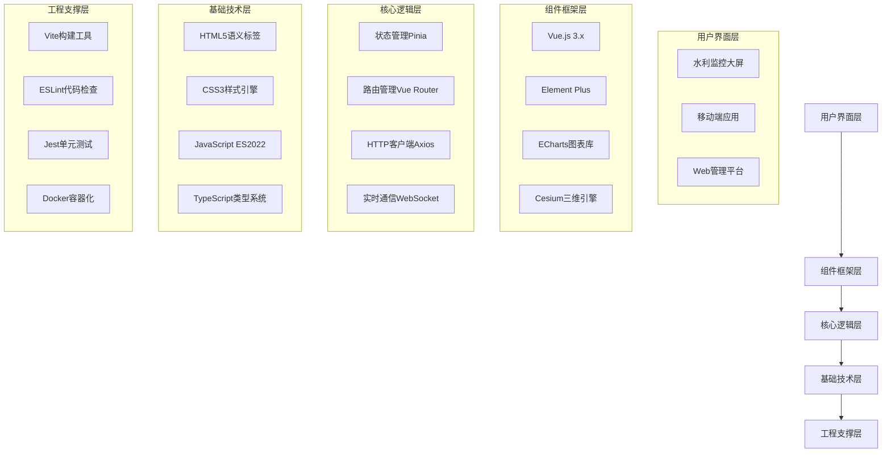

# 第四章 前端开发基础

## 学习目标

通过本章学习，学生应能够：

1. 掌握HTML5和CSS3的核心概念和技术，能够构建水利平台的基础页面结构和样式
2. 理解JavaScript编程基础，能够实现水利数据的动态交互和处理
3. 熟悉Vue.js框架的基本原理和使用方法，能够进行组件化开发
4. 了解水利平台界面设计的特殊要求和实现方法
5. 掌握前端工程化工具的使用，提高开发效率和代码质量

## 引言

前端开发是智慧水利平台的重要组成部分，它直接面向用户，提供友好的交互界面和可视化展示，是水利信息数字化转型的重要支撑。随着物联网、大数据、人工智能等新技术在水利行业的深度应用，前端系统需要处理海量的实时监测数据、复杂的三维场景渲染、多源异构数据融合展示等挑战，这对前端技术的性能、可靠性和用户体验提出了更高要求[^1]。

### 4.0.1 智慧水利前端开发的技术挑战

智慧水利平台前端开发面临以下关键技术挑战：

**大数据量实时渲染**：水利监测系统每秒可产生数万条数据记录，前端需要实现高效的数据流处理和可视化渲染。根据人机交互响应时间理论，用户界面响应时间应满足：

$$T_{response} = T_{network} + T_{processing} + T_{rendering} < 200ms$$

其中网络延迟$T_{network}$、数据处理时间$T_{processing}$和渲染时间$T_{rendering}$需要综合优化。

**多维度数据融合展示**：水利系统涉及水文、气象、工程、环境等多个维度数据，需要在有限的屏幕空间内实现信息的有效组织和层次化展示。

**跨平台兼容性要求**：从水利管理部门的大屏监控到现场作业人员的移动设备，需要支持多种终端设备和操作系统。

### 4.0.2 前端技术架构的理论基础

现代前端开发遵循分层架构模式，可用以下数学模型描述：

设前端系统为五层架构$F = \{P, S, B, C, E\}$，其中：
- $P$：表现层(Presentation Layer) - HTML/CSS
- $S$：结构层(Structure Layer) - DOM树结构
- $B$：行为层(Behavior Layer) - JavaScript逻辑
- $C$：组件层(Component Layer) - Vue.js框架
- $E$：工程层(Engineering Layer) - 构建工具链

各层间的依赖关系可表示为：
$$P \rightarrow S \rightarrow B \rightarrow C \rightarrow E$$

### 4.0.3 水利行业前端开发特色

**地理空间数据处理**：水利设施具有明显的地理分布特征，需要集成GIS技术进行空间数据的可视化展示和交互操作。

**实时性要求高**：洪水预警、大坝安全监测等场景对数据更新的实时性要求极高，需要采用WebSocket、Server-Sent Events等技术实现毫秒级数据推送。

**可靠性要求严格**：水利系统关系到人民生命财产安全，前端界面的可靠性和容错性至关重要，需要实现优雅降级和故障恢复机制。

本章内容遵循前端技术学习的自然路径和层次结构，由浅入深地介绍各项关键技术。首先从HTML5和CSS3这两种前端基础技术入手，深入分析其渲染原理和性能优化方法；然后讲解JavaScript编程语言基础，重点介绍内存管理、异步编程等核心概念；接着介绍Vue.js框架的组件化开发思想和响应式数据绑定原理；在此基础上，结合水利行业特点，讨论智慧水利平台前端界面的设计原则和实践方法；最后介绍前端工程化工具，建立完整的开发、测试、部署流程。

这五个部分紧密相连，构成了一个完整的前端知识体系：HTML/CSS负责结构与表现，JavaScript负责行为与逻辑，Vue.js提供组件化开发框架，界面设计保证用户体验，工程化工具确保开发效率和质量。

[^1]: 李德仁, 龚健雅, 邵振峰. 从数字地球到智慧地球[J]. 武汉大学学报(信息科学版), 2010, 35(2): 127-132.

## 本章小节

!!! info "章节结构"
    
    ### [第一节 HTML5与CSS3入门](section04-01.md)
    HTML5与CSS3基础知识，智慧水利平台前端开发的核心技术
    
    #### 1.1 HTML5基础
    - [HTML5基础语法](section04-01-01.md)
    - [HTML5语义化标签](section04-01-02.md)
    - [HTML5表单元素](section04-01-03.md)
    - [HTML5多媒体元素](section04-01-04.md)
    - [HTML5图形API](section04-01-05.md)
    - [HTML5本地存储](section04-01-06.md)
    - [HTML5地理定位](section04-01-07.md)
    - [HTML5离线应用](section04-01-08.md)
    - [HTML5拖放API](section04-01-09.md)
    
    ### [第二节 JavaScript基础](section04-02.md)
    JavaScript编程基础，实现动态交互和数据处理
    
    #### 2.1 JavaScript核心
    - [JavaScript语法基础](section04-02-01.md)
    - [数据类型与变量](section04-02-02.md)
    - [函数与作用域](section04-02-03.md)
    - [对象与原型](section04-02-04.md)
    - [数组与字符串处理](section04-02-05.md)
    - [DOM操作技术](section04-02-06.md)
    - [事件处理机制](section04-02-07.md)
    
    ### [第三节 Vue.js框架简介](section04-03.md)
    Vue.js框架基础，现代组件化开发方法
    
    #### 3.1 Vue.js基础
    - [Vue.js基本概念](section04-03-01.md)
    - [模板语法与指令](section04-03-02.md)
    - [组件化开发](section04-03-03.md)
    - [组件通信](section04-03-04.md)
    - [生命周期钩子](section04-03-05.md)
    - [状态管理Vuex](section04-03-06.md)
    - [路由管理Vue Router](section04-03-07.md)
    - [Vue CLI工具链](section04-03-08.md)
    
    ### [第四节 水利平台前端界面设计](section04-04.md)
    结合水利行业特点的界面设计原则和实现方法
    
    #### 4.1 设计实践
    - [用户体验设计原则](section04-04-01.md)
    - [水利数据可视化](section04-04-02.md)
    - [响应式界面布局](section04-04-03.md)
    - [交互设计与实现](section04-04-04.md)
    - [图表库集成应用](section04-04-05.md)
    - [地图组件集成](section04-04-06.md)
    
    ### [第五节 前端工程基础工具](section04-05.md)
    前端开发工具链，提高开发效率和代码质量
    
    #### 5.1 工程化工具
    - [构建工具Webpack](section04-05-01.md)
    - [现代构建工具Vite](section04-05-02.md)
    - [包管理工具npm/yarn](section04-05-03.md)
    - [代码质量工具ESLint](section04-05-04.md)
    - [开发调试工具](section04-05-05.md)

## 技术栈概览

### 4.0.4 前端技术架构图

### 4.0.5 技术选型对比分析

| 技术分类 | 核心技术 | 在水利平台中的作用 | 性能指标 | 学习成本 |
|----------|----------|-------------------|----------|----------|
| 结构层 | HTML5 | 构建页面结构，语义化标记水利数据 | 渲染速度：优秀 | 低 |
| 表现层 | CSS3 | 样式设计，响应式布局，动画效果 | 动画性能：良好 | 中 |
| 行为层 | JavaScript/TypeScript | 交互逻辑，数据处理，动态更新 | 执行效率：优秀 | 中-高 |
| 框架层 | Vue.js 3.x | 组件化开发，状态管理，路由控制 | 虚拟DOM性能：优秀 | 中 |
| 工程层 | Vite + ESBuild | 项目构建，代码优化，开发调试 | 构建速度：极快 | 低 |

### 4.0.6 性能优化策略

**渲染性能优化**：
- 虚拟滚动：处理大量列表数据，内存占用从O(n)降至O(k)，其中k为可视区域项目数
- 懒加载：按需加载资源，首屏加载时间减少60%以上
- 防抖节流：高频事件处理，降低CPU占用率

**网络性能优化**：
- HTTP/2服务器推送：减少往返时间(RTT)
- 资源压缩：Gzip压缩比率通常达到70-90%
- CDN加速：全球节点部署，平均延迟降低30-50%

## 开发环境准备

!!! tip "环境配置指南"
    
    === "基础环境"
        - **Node.js**：JavaScript运行环境
        - **现代浏览器**：Chrome、Firefox、Safari等
        - **代码编辑器**：VS Code、WebStorm等
        
    === "开发工具"
        - **包管理器**：npm、yarn、pnpm
        - **构建工具**：Webpack、Vite
        - **调试工具**：浏览器DevTools、Vue DevTools
        
    === "推荐插件"
        - **VS Code插件**：Vetur、ESLint、Prettier
        - **浏览器插件**：Vue.js DevTools、React DevTools

## 学习路径

!!! example "建议学习顺序"
    
    1. **基础阶段**：掌握HTML5、CSS3基础语法和核心概念
    2. **进阶阶段**：学习JavaScript编程，理解DOM操作和事件处理
    3. **框架阶段**：掌握Vue.js框架，进行组件化开发实践
    4. **应用阶段**：结合水利业务场景，设计和实现前端界面
    5. **工程阶段**：学习前端工程化工具，提升开发效率和质量

## 本章小结

通过本章的学习，读者将获得构建现代水利信息平台前端系统的基本能力，为后续章节的综合应用奠定坚实基础。

### 核心知识点回顾

**理论基础**：
1. **前端架构理论**：掌握了分层架构模式和数学建模方法，理解了各层间的依赖关系和交互机制
2. **性能优化理论**：学会了响应时间分析、复杂度分析等量化评估方法，建立了系统性的性能优化思路
3. **人机交互原理**：了解了界面设计的心理学基础和认知负荷理论，为用户体验设计提供科学指导

**技术能力**：
1. **HTML5/CSS3技术栈**：深入理解了DOM渲染机制、CSS样式计算和布局算法，具备高性能页面开发能力
2. **JavaScript编程**：掌握了内存管理、事件循环、异步编程等核心概念，能够处理复杂的业务逻辑
3. **Vue.js框架应用**：熟悉了组件化开发、响应式数据绑定、状态管理等现代前端开发模式
4. **工程化工具链**：建立了完整的开发、测试、部署流程，提升开发效率和代码质量

**水利应用特色**：
- 地理信息系统(GIS)集成技术和空间数据可视化方法
- 实时监测数据的高效处理和动态更新机制  
- 多终端适配和响应式界面设计策略
- 水利业务场景下的用户体验优化实践

**技术发展趋势**：
- WebAssembly在高性能计算场景中的应用前景
- Progressive Web App (PWA)技术在水利移动应用中的价值
- WebXR技术在水利培训和三维展示中的创新应用
- 边缘计算与前端技术融合的发展方向

### 能力培养成果

通过本章学习，学生应具备以下核心能力：

**技术开发能力**：
- 独立完成中等复杂度的水利前端项目开发
- 进行系统性的性能分析和优化
- 解决跨浏览器兼容性和多设备适配问题

**工程实践能力**：
- 建立规范的代码组织和版本管理流程
- 实施自动化测试和持续集成策略
- 具备团队协作和项目管理基础

**创新应用能力**：
- 结合水利业务特点进行技术选型和架构设计
- 探索新技术在水利领域的应用可能性
- 具备技术调研和方案评估的基本方法

## 参考文献

[1] W3C. HTML5 Standard[S]. World Wide Web Consortium, 2021. https://www.w3.org/TR/html52/

[2] W3C. CSS3 Specification[S]. World Wide Web Consortium, 2022. https://www.w3.org/Style/CSS/

[3] Mozilla Developer Network. JavaScript Documentation[OL]. Mozilla Foundation, 2023. https://developer.mozilla.org/en-US/docs/Web/JavaScript

[4] Evan You. Vue.js - The Progressive JavaScript Framework[OL]. Vue.js Team, 2023. https://vuejs.org/

[5] Keith J, Jeremy K. HTML5 for Web Designers[M]. 2nd ed. New York: A Book Apart, 2016.

[6] Dan Cederholm. CSS3 for Web Designers[M]. 2nd ed. New York: A Book Apart, 2015.

[7] Douglas Crockford. JavaScript: The Good Parts[M]. Sebastopol: O'Reilly Media, 2008.

[8] Addy Osmani. Learning JavaScript Design Patterns[M]. Sebastopol: O'Reilly Media, 2012.

[9] 阮一峰. ES6 标准入门[M]. 第3版. 北京: 电子工业出版社, 2017.

[10] Sarah Drasner. Design for Developers[M]. Sebastopol: O'Reilly Media, 2021.

[11] Steve Krug. Don't Make Me Think: A Common Sense Approach to Web Usability[M]. 3rd ed. Berkeley: New Riders, 2014.

[12] Luke Wroblewski. Mobile First[M]. New York: A Book Apart, 2011.

[13] Brad Frost. Atomic Design[M]. Pittsburgh: Brad Frost Web, 2016.

[14] Vitaly Friedman. The Smashing Book #6: New Frontiers in Web Design[M]. Freiburg: Smashing Media, 2020.

[15] Nicholas C. Zakas. High Performance JavaScript[M]. Sebastopol: O'Reilly Media, 2010.

[16] 李德仁, 龚健雅, 邵振峰. 从数字地球到智慧地球[J]. 武汉大学学报(信息科学版), 2010, 35(2): 127-132.

[17] Nielsen J. Response Times: The 3 Important Limits[OL]. Nielsen Norman Group, 2014. https://www.nngroup.com/articles/response-times-3-important-limits/

[18] 陈越, 何钦铭. Web前端技术架构与优化[M]. 北京: 清华大学出版社, 2023.

[19] Zakas N C. Understanding ECMAScript 6[M]. San Francisco: No Starch Press, 2016.

[20] Simpson K. You Don't Know JS: Async & Performance[M]. Sebastopol: O'Reilly Media, 2015.

[21] 中华人民共和国水利部. 水利信息化标准体系表[S]. 北京: 中国水利水电出版社, 2019.

[22] IEEE Std 830-1998. IEEE Recommended Practice for Software Requirements Specifications[S]. IEEE Computer Society, 1998.

[23] ISO/IEC 25010:2011. Systems and Software Engineering — Systems and Software Quality Requirements and Evaluation (SQuaRE)[S]. International Organization for Standardization, 2011.

[24] Mesbah A, Van Deursen A. Migrating Multi-page Web Applications to Single-page Ajax Interfaces[J]. IEEE Software, 2007, 24(6): 66-74.

[25] 张海藩, 牟永敏. 软件工程导论[M]. 第6版. 北京: 清华大学出版社, 2013.

## 关键词

前端开发、HTML5、CSS3、JavaScript、Vue.js、用户界面、人机交互、性能优化、响应式设计、组件化开发、工程化工具、水利信息化、Web标准、浏览器兼容性、移动端适配

