# 第4章 前端开发技术

**学习目标**

通过本章学习，学生应能够：

1.  说明浏览器、HTML、CSS与JavaScript在Web应用中的职责及协作关系；

2.  使用语义化HTML与响应式CSS构建水利业务页面；

3.  使用现代JavaScript、Promise、async/await和DOM事件完成数据交互；

4.  使用Vue 3、Vue Router与Pinia组织单页面应用；

5.  使用Vite完成开发、调试、构建与基本性能优化。

**引言**

值班员在浏览器里看到的测点列表、读数、曲线和预警，都由前端程序画出来。本章先用HTML、CSS和JavaScript写出一个不依赖任何框架的监测页面，让它向接口请求数据并处理加载、空数据和失败；页面能解释、能修改之后，再用Vue 3.4+、Vue Router 4、Pinia 2与Vite 5把它组织成单页面应用。框架API与配置项随版本变化，书中示例与你安装的版本不一致时，以各自的官方文档为准<sup>[[26]](../../references.md#ref26)[[27]](../../references.md#ref27)[[28]](../../references.md#ref28)[[29]](../../references.md#ref29)</sup>；HTML、CSS和JavaScript的语言特性可在MDN查证<sup>[[30]](../../references.md#ref30)</sup>。本章页面都属于水利工程安全监测平台，测点编码、特征水位和演示读数取自8.1节参数表，接口路径和字段取自表8.3。

!!! tip "提示"

    **工程版本线：v0 $\rightarrow$ v1**

    起点 v0 是配套仓库的空前端骨架。本章结束时交付 v1：一个能登录、能按测点与时间窗查询并渲染曲线的只读监测页面，对应`frontend/src/`下的`api/request.js`、`api/assets.js`、`router/index.js`、`stores/asset.js`、`views/Login.vue`、`views/AssetDetail.vue`与`views/WaterLevelSummary.vue`，本章逐个讲到；配套工程还带有后面几章联调用的`/monitoring`仪表盘（`components/MonitoringDashboard.vue`）。验证命令：`npm ci && npm test && npm run build`。

## 4.1 Web基础概念与浏览器架构

**本节层次**

核心。

**进入本节所需知识**

先读1.2.1节的一次查询追踪；按附录B P0准备终端与浏览器开发者工具。

在地址栏输入监测页面的地址后，浏览器做两件事：先通过HTTP或HTTPS把HTML、CSS、JavaScript和图片取回来，再把它们变成屏幕上的页面。取回的HTML被解析成一棵树，每个标签是树上的一个节点，这棵树叫DOM（文档对象模型），脚本读写页面就是读写这棵树。CSS规则被解析成另一棵树，叫CSSOM。浏览器把两棵树合起来，算出每个元素的位置和大小（布局），再画到屏幕上（绘制）。JavaScript在同一个线程里依次处理用户操作、网络响应和定时任务，这个排队机制叫事件循环，4.5节用到时再展开。监测页面常同时显示地图、曲线与预警，短时间内反复修改大量DOM节点会让浏览器一遍遍重新布局，页面就会卡顿。

现代浏览器通常采用多进程架构。图4.1画出各模块的协作关系：浏览器引擎负责协调，渲染引擎使用网络模块取得的资源，调用JavaScript引擎执行脚本，并通过UI后端绘制；存储模块为浏览器引擎和页面脚本提供受控的数据保存能力，4.5节的登录令牌就放在这里。

<figure markdown>
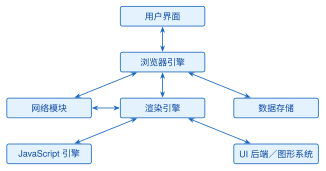
<figcaption>图 4.1  浏览器主要模块及协作关系</figcaption>
</figure>

不同浏览器支持的功能有差别。判断某个功能能不能用，要检测功能本身，例如先看`WebSocket`是否存在，再决定使用实时连接还是退回定时轮询；只按浏览器名称判断，遇到新版本或小众浏览器就会出错。资源缓存由HTTP缓存头控制：样式和脚本可以长期缓存，监测实时值必须每次向服务器要新的，两者不能用同一种缓存策略。

## 4.2 HTML基础与语义化

**本节层次**

核心：4.2.1、4.2.2；指导实践：4.2.3。

**进入本节所需知识**

先读4.1节，能区分浏览器取得文档与呈现页面两步。

HTML描述页面里有什么内容、各部分是什么角色。`header`、`nav`、`main`、`section`、`article`与`footer`等元素直接说明一个区域的用途，这种写法叫语义化；读屏软件、搜索引擎和接手代码的同学都靠它理解页面。标题级别要连续，表单控件要有`label`，图片要有`alt`文本。

清单4.1是一个完整的页面骨架，保存为`monitor.html`后双击即可在浏览器里打开。它只组织内容，颜色和布局留给4.3节的CSS。本章后面的HTML清单都只印`<body>`里变化的部分，`<head>`沿用这一份。

**清单 4.1  水利平台页面骨架**

```html
<!doctype html>
<html lang="zh-CN">
<head>
  <meta charset="UTF-8">
  <meta name="viewport" content="width=device-width,initial-scale=1">
  <title>水库监测</title>
  <link rel="stylesheet" href="monitor.css">
</head>
<body>
  <header><h1>水库监测</h1></header>
  <nav aria-label="主导航"><a href="#level">实时水位</a></nav>
  <main><section id="level" aria-labelledby="level-title">
    <h2 id="level-title">实时水位</h2>
    <output id="level-value">166.84 m</output>
  </section></main>
  <footer>数据更新时间：<time datetime="2026-07-05T03:55:00+08:00">03:55</time></footer>
</body>
</html>
```

表格用来表达行列数据，不用来排版。一张水位表至少要有表头、单位和测量时间。

图4.2是本章第一个阶段成果 S1 的列表页：筛选库水位对象后，对象编码、读数与排序结果逐项对应。这一阶段的数据写死在脚本里，刷新页面不会取得新观测；4.5节再把数据来源换成接口。

<figure markdown>
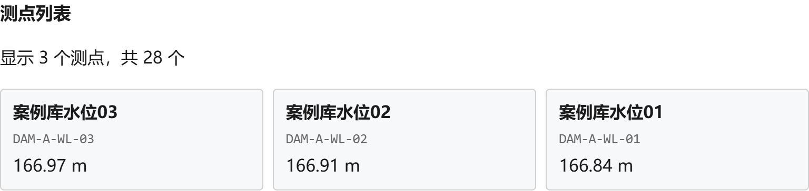
<figcaption>图 4.2  S1测点列表的筛选与排序（配套阶段页实际运行截图）</figcaption>
</figure>

### 4.2.1 文档流、渲染流程与页面地标

浏览器默认按标签在文件里的先后，从上到下、从左到右排列内容，这个默认顺序叫文档流。图4.3展示同一份文档的两条处理路径：DOM与CSSOM合成后用于布局和绘制；DOM里的语义信息还用来生成可访问性树，读屏软件从中读出每个区域的角色、名称和状态。标签的先后顺序因此同时决定了阅读顺序和键盘操作顺序。监测页面先用文档流保证“标题—导航—数据—说明”的路径，再由CSS决定列数、间距和颜色。

<figure markdown>
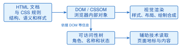
<figcaption>图 4.3  语义化文档的视觉渲染与可访问性路径</figcaption>
</figure>

一个元素脱离文档流（例如4.3.7节的绝对定位）后，后面的元素不会为它留出空间。整个监测面板都用绝对坐标拼接时，窗口尺寸或字体一变，内容就会互相遮挡，所以先用正常流表达层次，只在确实需要叠加的局部使用定位。页面出问题时，先判断它属于结构、样式还是脚本：开发者工具的“元素”面板检查DOM层级和可访问名称，“Computed”面板核对最终生效的样式，“性能”面板定位反复布局造成的卡顿，三者对应图4.3的三个阶段。

渲染流程也决定了更新方式。水位数值每五分钟更新一次时，只替换输出节点的文本；趋势图一秒内收到多条消息时，先在内存中合并，再一次性刷新。

**从地标到可访问名称**

`header`放页面或区域的引导信息，`nav`放一组重要导航，`main`放页面唯一的主要内容，`section`是有主题标题的内容组，`article`是能独立发布的报告或公告，`aside`放辅助信息，`footer`放来源与更新时间，`figure`与`figcaption`把图表和说明绑在一起。这些区域统称页面地标，读屏用户可以按地标列表直接跳到“实时监测”或“预警事件”。选标签看内容的职责，不看浏览器给它的默认样式：有标题、能脱离周围内容单独理解的监测卡片用`article`；几个同类指标的分组用带标题的`section`；只为排版而设的容器用`div`。`main`在一个文档中只能有一个，标题从`h1`逐级向下，不为了字号跳级。

清单4.2把清单4.1的`<body>`换成带地标的监测页面。开头的`href="#monitor-main"`是“跳到主要内容”链接，键盘用户不必每次经过全局导航；`aria-labelledby`把区域标题与地标关联起来；`tabindex="-1"`只让脚本能把焦点移到主要内容，不会把它加入 Tab 键的遍历顺序。水位数字放在`output`里，并用`aria-live="polite"`声明“数值变化时请读屏软件在空闲时播报”；只有需要通知用户的数值才加这个属性，否则每个传感器的细小波动都会打断值班员。用浏览器打开后按 Tab 键，第一个获得焦点的应是跳转链接。

**清单 4.2  带地标和跳转链接的监测页面（只列 body 部分）**

```html
<body>
  <a class="skip-link" href="#monitor-main">跳到主要内容</a>
  <header>
    <h1>水利工程安全监测平台</h1>
    <p>面向值班员的实时监测工作台</p>
  </header>
  <nav aria-label="主导航">
    <a href="#monitor-main">实时监测</a>
    <a href="#warning-panel">预警事件</a>
    <a href="#data-note">数据说明</a>
  </nav>
  <main id="monitor-main" tabindex="-1">
    <h2>实时监测</h2>
    <section aria-labelledby="level-title">
      <h3 id="level-title">水位概览</h3>
      <p>当前水位：<output id="level" aria-live="polite">--</output> m</p>
      <figure>
        <div id="level-chart" role="img"
             aria-label="最近一小时水位趋势图"></div>
        <figcaption>最近一小时水位趋势（示意）</figcaption>
      </figure>
    </section>
    <aside id="warning-panel" aria-labelledby="warning-title">
      <h3 id="warning-title">预警事件</h3>
      <p id="warning-message" role="status">暂无需要处理的事件</p>
    </aside>
  </main>
  <footer id="data-note">
    <p>数据来源：水利工程安全监测平台；更新时间：
      <time datetime="2026-08-07T08:00:00+08:00">08:00</time></p>
  </footer>
</body>
```

### 4.2.2 表单与原生校验

地标回答“我现在在哪里”，表单控件回答“我能提交什么”。浏览器在提交前会按控件上的约束属性自动检查输入，这叫原生校验：`required`不允许空值，`pattern`用正则表达式检查编码格式，`min`、`max`和`step`限定数值范围和步长。清单4.3用测站编码、开始时间和采样间隔演示这些属性。把它放进页面后不写任何脚本，编码留空直接点“查询”，浏览器会在输入框旁弹出默认的提示气泡并阻止提交，这就是原生校验在起作用。表单里预留的`role="alert"`段落先是空的：4.4节有了JavaScript以后，可以给`<form>`加上`novalidate`关掉默认气泡，改由脚本把提示文字写进这个段落。提示要告诉用户怎么改，例如“格式如 DAM-A-PZ-07”，只写“输入错误”没有用。

**清单 4.3  监测查询表单的原生校验与可访问提示**

```html
<form id="query-form">
  <fieldset>
    <legend>查询条件</legend>
    <label for="station-code">测站编码</label>
    <input id="station-code" name="stationCode" required
           pattern="DAM-[A-Z]-[A-Z]{1,2}-[0-9]{2}" placeholder="DAM-A-PZ-07"
           aria-describedby="station-help">
    <small id="station-help">格式：工程-分区-类型-序号，如 DAM-A-PZ-07</small>

    <label for="start-time">开始时间</label>
    <input id="start-time" name="startTime" type="datetime-local"
           required aria-describedby="time-help">
    <label for="sample-step">采样间隔（分钟）</label>
    <input id="sample-step" name="step" type="number"
           min="5" max="60" step="5" value="5" required>
    <small id="time-help">时间范围还需由服务端校验</small>
  </fieldset>
  <p id="query-error" role="alert" aria-live="assertive"></p>
  <button type="submit">查询</button>
</form>
```

前端校验只是为了让用户尽早发现明显错误，不能代替后端校验：浏览器里的脚本可以被禁用或改写，别人也可以绕过页面直接发HTTP请求。采样间隔在页面上限定为5的倍数，并不意味着后端可以相信收到的一定是5的倍数；测站是否属于当前用户的权限范围、起止时间是否有序、时间跨度是否超限，都只能由服务器判断。第5章用 Jakarta Validation 的`@Valid`在服务端重新检查。两层校验的规则来自同一份数据字典：编码格式、时区和允许的采样间隔必须一致。后端返回400时，前端按错误体里的`field`把提示写回对应输入框旁的说明节点，并保留用户已经填好的其他条件。

校验做得对不对，可以按输入逐条检查：编码为空时提示“请输入测站编码”；格式错误时给出示例“DAM-A-PZ-07”；采样间隔超出范围时说明允许区间；三个错误同时存在时，表单顶部汇总数量，字段旁保留各自的原因。提交成功后，焦点移到结果标题或第一条结果上。

### 4.2.3 指导实践：键盘路径与可访问性检查

值班员可能整班只用键盘操作，页面需要一条可预测的键盘路径：跳转链接最先获得焦点，随后是主导航、查询表单、数据卡片和预警区域。这个顺序由DOM顺序决定，不要用正整数`tabindex`人为重排。页面内的普通状态更新用`role="status"`，需要立即处理的异常用`role="alert"`。弹出详情对话框时，焦点要移到对话框标题，关闭后回到触发按钮；这段焦点管理脚本要用到4.4节的JavaScript，收在附录C的C.4节。

检查时用四种方式各过一遍：只用键盘，看有没有走不出去的焦点陷阱；把浏览器字号放大到200%，看有没有横向滚动；用读屏软件，看能否读出标题与单位；用自动化检查工具，确认每个表单控件都有名称。对动态预警，再确认普通状态更新不会抢走焦点。本章对键盘、对比度与状态编码的要求以WCAG 2.2为依据<sup>[[31]](../../references.md#ref31)</sup>。迁移到Vue以后，`header`、`nav`和`main`仍原样写在模板里，数据变化只更新`output`、表格行或图表容器，这些检查同样适用。

## 4.3 CSS样式与响应式布局

**本节层次**

核心：4.3.1、4.3.2、4.3.3、4.3.4、4.3.5；指导实践：4.3.6；拓展：4.3.7、4.3.8。

**进入本节所需知识**

先读4.2节，能在HTML里找到元素、属性与层次；准备好清单4.1的页面，边改样式边刷新观察。

CSS决定页面长什么样。一条规则由选择器和声明块组成：选择器指出“对哪些元素”，声明块写“用什么样式”。清单4.4是监测卡片的样式，保存为`monitor.css`，清单4.1的`<link>`已经引用了它。开头的`–normal`和`–warning`是CSS自定义属性，也叫CSS变量：在`:root`上定义一次，别处用`var(–warning)`取值，改颜色只改一处。工程中用类选择器（以点开头）组织组件样式，不依赖很深的标签层级。

**清单 4.4  监测卡片响应式样式**

```css
:root { --normal: #1677ff; --warning: #d46b08; }
.monitor-grid {
  display: grid;
  grid-template-columns: repeat(3, minmax(12rem, 1fr));
  gap: 1rem;
}
.monitor-card {
  padding: 1rem;
  border: 1px solid #d9e2ec;
  border-radius: .5rem;
  background: #fff;
}
.monitor-card--warning { border-left: .35rem solid var(--warning); }
@media (max-width: 768px) {
  .monitor-grid { grid-template-columns: 1fr; }
}
```

`@media (max-width: 768px)`是媒体查询：视口宽度不超过768像素时，花括号里的规则才生效，三列卡片改为单列。清单4.1的`<body>`里还没有卡片，要看到这个效果，先把清单4.5放进`<main>`：三张卡片用`.monitor-grid`包住，其中一张带`.monitor-card–warning`。

**清单 4.5  供 monitor.css 作用的三张监测卡片（放在 main 内）**

```html
<div class="monitor-grid">
  <article class="monitor-card"><h3>DAM-A-WL-01</h3><p>库水位 164.2 m</p></article>
  <article class="monitor-card monitor-card--warning"><h3>DAM-A-PZ-07</h3><p>渗压 186.1 kPa</p></article>
  <article class="monitor-card"><h3>DAM-A-RF-01</h3><p>雨量 0.0 mm</p></article>
</div>
```

刷新后三张卡片并排；把浏览器窗口慢慢拉窄，或者在开发者工具里打开设备模拟器，可以看到列数在768像素处切换为单列，PZ-07 那张卡片左侧始终有一条橙色边。响应式设计不只是缩小字号，还要调整列数、触控目标大小和信息的先后。

### 4.3.1 盒模型与尺寸计算

浏览器把每个元素当作一个矩形盒子，从内到外依次是内容区、内边距（`padding`）、边框（`border`）和外边距（`margin`），这就是盒模型。`width`和`height`默认只描述内容区，因此一个写成`width: 320px; padding: 16px; border: 1px solid`的监测卡片，水平方向实际占用 $320+16\times2+1\times2=354$ 像素；三个这样的卡片放进1024像素宽的网格，还要扣掉间隙。尺寸算不清楚，卡片就会意外换行，图表会被挤出容器。

工程中通常在全局写`box-sizing: border-box`，让声明的宽高包含内边距和边框，设计稿上的320像素就是盒子的外部尺寸。图4.4从外到内标出四层区域；在开发者工具里选中元素时，四种高亮颜色分别对应这四层。

<figure markdown>
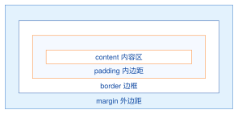
<figcaption>图 4.4  CSS 盒模型的四层尺寸关系</figcaption>
</figure>

清单4.6用一条规则把测站卡片、数值输出和图表容器纳入同一种盒模型。通配符`*`连同`::before`、`::after`生成的装饰一起命中，它们也不会把布局撑大。

**清单 4.6  监测卡片的 border-box 盒模型**

```css
*, *::before, *::after {
  box-sizing: border-box;
}

.station-card {
  width: min(100%, 20rem);
  padding: 1rem;
  border: 1px solid #d9e2ec;
  margin: 0;
  background: #fff;
}

.station-card__value {
  min-height: 2.5rem;
  overflow-wrap: anywhere;
}
```

**选择器、优先级与层叠**

几条规则同时命中一个元素、又给同一属性设了不同的值时，浏览器要决定谁生效，这个决定过程叫层叠。先比选择器的优先级，它可以写成三元组 $(a,b,c)$：$a$ 统计 ID 选择器，$b$ 统计类、属性和伪类，$c$ 统计元素和伪元素。先比 $a$，相同再比 $b$，最后比 $c$；三元组都相同时，后写的覆盖先写的。优先级不是数选择器的个数：一个 ID 高于任意多个类，一个类高于任意多个元素选择器。表4.1用监测页面的三个选择器做了计算。

**表 4.1  CSS 选择器优先级三元组示例**

| 选择器                  | $(a,b,c)$ | 计算与应用场景                               |
|:------------------------|:----------|:---------------------------------------------|
| `#monitor-main`         | (1,0,0)   | 页面主要区域的唯一标识，适合页面级布局边界   |
| `.station-card.warning` | (0,2,0)   | 同时命中组件和状态类，用于预警卡片的局部样式 |
| `section output`        | (0,0,2)   | 两个元素选择器，作为低优先级默认样式         |

颜色或间距没有生效时，先在开发者工具的“样式”面板找到被划掉的声明，再按表中的三元组判断是谁覆盖了它。直接追加`!important`能让这一条强行生效，但下一个维护者只能再写一条更强的去压它，原因却始终没有找到；只在覆盖改不了的第三方组件时才用，并在注释里写明原因。

层叠之外还有继承：颜色、字体等属性会从父元素传给子元素，盒模型尺寸、外边距和定位不会。清单4.7里，`color`从`.dashboard`继承到卡片文字，`border-color`由状态类`.is-warning`显式覆盖。组件只依赖变量名，不关心页面用的是哪一种蓝色；`var()`的第二个参数是变量缺失时的后备值。

**清单 4.7  主题变量与状态层叠规则**

```css
:root {
  --water-primary: #1565c0;
  --water-warning: #d46b08;
  --panel-gap: 1rem;
}

.dashboard {
  color: #263238;
  background: #f5f9ff;
}

.dashboard .station-card {
  border: 1px solid var(--water-primary, #1565c0);
  margin-block-end: var(--panel-gap);
}

.station-card.is-warning {
  border-color: var(--water-warning, #d46b08);
}
```

### 4.3.2 单位体系与可伸缩界面

写长度之前先想清楚它相对于什么。`px`用于边框、图标描边这类要稳定像素精度的细节；`em`相对于当前元素的字号，按钮内边距用它，文字放大时按钮跟着变大；`rem`相对于根元素`html`的字号，适合全站统一的间距和字号刻度；`vw`、`vh`相对于视口宽度和高度，用于大屏容器的比例尺寸；百分比通常相对于父元素的对应属性，用于列宽和进度条。

清单4.8在同一个监测面板里用到这几种单位。`min()`取两个值中较小的一个，`min(100%, 92vw)`保证面板不超出屏幕；`clamp(最小值, 首选值, 最大值)`让字号和间距随窗口宽度平滑变化，又不会小到看不清或大到失控。`vh`用于整屏高度时，手机浏览器的地址栏会伸缩，关键按钮不要只放在视口最底部。写完后把浏览器字号设置调大再看一遍，用固定像素锁死的文字不会跟着放大。

**清单 4.8  监测面板的 CSS 单位策略**

```css
:root { font-size: 16px; }

.monitor-shell {
  width: min(100%, 92vw);
  min-height: min(80vh, 48rem);
  padding: clamp(1rem, 2vw, 2rem);
  gap: clamp(.75rem, 1.5vw, 1.5rem);
}

.monitor-shell h2 {
  font-size: clamp(1.25rem, 1rem + 1vw, 2rem);
}

.monitor-shell button {
  padding: .6em 1em;
  min-height: 2.75rem;
}
```

### 4.3.3 Flexbox：一维的告警工具栏

Flexbox 把一个容器里的子元素沿一条线排开，这条线叫主轴，与它垂直的方向叫交叉轴。在容器上写`display: flex`开启；`flex-direction`决定主轴方向，`justify-content`在主轴上分配剩余空间，`align-items`在交叉轴上对齐，`flex-wrap`允许放不下时换行，`gap`设置项目间距。子元素上的`flex`是三个值的缩写：有剩余空间时分多少（增长因子）、空间不够时缩多少（收缩因子）、分配前的基准尺寸。`flex: 1`表示可以分享剩余空间，不等于“固定等宽”，内容的最小宽度仍会参与计算。

告警工具栏是典型的一维布局：左侧放当前测站，中间放状态摘要，右侧放刷新、导出和确认按钮。清单4.9给出样式和`<body>`内容，放进清单4.1的骨架（样式写进`<head>`里的`<style>`）即可打开。宽度足够时三部分排成一行；把窗口拉窄到`44rem`以下，三部分各占一行，按钮仍保持`2.75rem`的可触控高度。不要用`white-space: nowrap`把所有控件锁在一行，否则放大字体或换到小屏就会出现横向滚动。

**清单 4.9  告警工具栏 Flex 实例（style 与 body 部分）**

```html
  <style>
    :root { --normal: #1677ff; --warning: #d46b08; }
    * { box-sizing: border-box; }
    body { margin: 0; font: 16px system-ui, sans-serif; }
    .alert-toolbar {
      display: flex;
      align-items: center;
      flex-wrap: wrap;
      gap: .75rem 1rem;
      padding: .75rem 1rem;
      border-block-end: 1px solid #d9e2ec;
    }
    .alert-toolbar__station { flex: 1 1 12rem; min-width: 10rem; }
    .alert-toolbar__summary { flex: 2 1 16rem; }
    .alert-toolbar__actions {
      display: flex; align-items: center; flex-wrap: wrap; gap: .5rem;
    }
    .alert-toolbar button {
      min-height: 2.75rem; padding: .55em 1em; border: 1px solid #b0bec5;
      border-radius: .35rem; background: #fff; color: #263238;
    }
    .alert-toolbar button.primary {
      border-color: var(--normal); background: var(--normal); color: #fff;
    }
    @media (max-width: 44rem) {
      .alert-toolbar { align-items: stretch; }
      .alert-toolbar__station, .alert-toolbar__summary,
      .alert-toolbar__actions { flex-basis: 100%; }
    }
  </style>
  <!-- 以上放进 <head>，以下放进 <body> -->
  <header class="alert-toolbar" aria-label="告警工具栏">
    <strong class="alert-toolbar__station">案例水库·测站筛选</strong>
    <span class="alert-toolbar__summary" role="status">当前有 2 条待确认事件</span>
    <span class="alert-toolbar__actions">
      <button type="button">刷新</button>
      <button type="button">导出</button>
      <button class="primary" type="button">确认事件</button>
    </span>
  </header>
```

读这份清单时分清两类属性：`display:flex`、`flex-wrap`、`align-items`、`gap`写在容器上；`flex`、`min-width`写在项目上。项目属性里还有一个`order`，它只改变画出来的顺序，不改变DOM顺序、Tab 键顺序和读屏顺序。告警操作的DOM顺序保持“查看—确认—导出”的业务逻辑，视觉对齐交给轴属性。

### 4.3.4 Grid：二维的监测仪表盘

Grid 同时管理行和列，适合把侧栏、地图、曲线、预警列表和底部状态栏拼成一个版面。`grid-template-columns`描述每一列的宽度，`grid-template-rows`描述每一行的高度，`grid-template-areas`用名字画出各区域的位置；`1fr`表示“分一份剩余空间”，`minmax(最小, 最大)`给出轨道尺寸的范围，`repeat(auto-fit, minmax(10rem, 1fr))`让卡片列数随可用宽度自动增减。

图4.5给出两种布局的分工：只沿一条轴分配空间的工具栏用 Flexbox；要同时控制行列的页面骨架用 Grid；Grid 区域内部的按钮组可以继续用 Flexbox。两者可以混用，但每一层元素只承担一种布局职责。

<figure markdown>
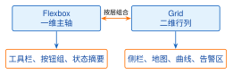
<figcaption>图 4.5  Flexbox 与 Grid 的布局职责边界</figcaption>
</figure>

清单4.10同样只列样式和`<body>`。宽屏时显示侧栏、主图区和预警栏三列；窗口窄于`62rem`时，媒体查询把区域重排为单列，顺序变为标题、主数据、预警、测站、页脚。HTML顺序始终按阅读顺序书写，Grid 只改变视觉位置。`.dashboard > *`上的`min-width: 0`允许格子里的长内容收缩，去掉它再放一个很长的测站名，可以看到格子被撑破。

**清单 4.10  监测仪表盘 Grid 实例（style 与 body 部分）**

```html
  <style>
    * { box-sizing: border-box; }
    .dashboard {
      display: grid;
      grid-template-areas:
        "header header header"
        "side main alerts"
        "footer footer footer";
      grid-template-columns: minmax(12rem, 18rem) minmax(0, 1fr) minmax(14rem, 22rem);
      grid-template-rows: auto minmax(20rem, 1fr) auto;
      gap: 1rem;
      min-height: 100vh;
      padding: 1rem;
      background: #f5f9ff;
    }
    .dashboard > * { min-width: 0; padding: 1rem; background: #fff; }
    .dashboard__header { grid-area: header; }
    .dashboard__side { grid-area: side; }
    .dashboard__main { grid-area: main; }
    .dashboard__alerts { grid-area: alerts; }
    .dashboard__footer { grid-area: footer; }
    .metric-cards {
      display: grid;
      grid-template-columns: repeat(auto-fit, minmax(10rem, 1fr));
      gap: .75rem;
    }
    @media (max-width: 62rem) {
      .dashboard {
        grid-template-areas: "header" "main" "alerts" "side" "footer";
        grid-template-columns: 1fr;
      }
    }
  </style>
  <!-- 以上放进 <head>，以下放进 <body> -->
  <main class="dashboard">
    <header class="dashboard__header"><h1>水利工程安全监测</h1></header>
    <aside class="dashboard__side"><h2>测站</h2><p>站点列表</p></aside>
    <section class="dashboard__main" aria-labelledby="metrics-title">
      <h2 id="metrics-title">实时指标</h2>
      <div class="metric-cards">
        <article><h3>水位</h3><p>—</p></article>
        <article><h3>流量</h3><p>—</p></article>
      </div>
    </section>
    <aside class="dashboard__alerts"><h2>预警事件</h2><p>暂无</p></aside>
    <footer class="dashboard__footer">数据更新时间：—</footer>
  </main>
```

### 4.3.5 响应式断点

媒体查询切换样式的那个宽度叫断点。断点设在内容开始拥挤或操作不便的位置，由真实卡片、表格和按钮的最小宽度推出来，不照抄某个手机型号的像素值；一个断点只解决一个看得见的问题，例如导航换行、侧栏折叠，或图表从并排改为上下排列。写法有两种方向：移动优先先写单列、可滚动、大触控目标的基础样式，再用`min-width`逐级加列；桌面优先先写宽屏，再用`max-width`收拢。清单4.4是桌面优先，下面的清单4.11是移动优先。

图4.6给出窄视口和三个宽视口的布局示例，宽度以 CSS 像素计：1920像素时安排侧栏、主图和预警栏三列，2560与3840像素的值班室大屏增加留白和可见信息；窄视口优先保留水位、预警和更新时间，折叠次要的筛选条件。断点之间用流式尺寸过渡。

<figure markdown>
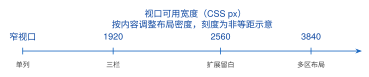
<figcaption>图 4.6  监测平台的响应式断点与大屏适配思路</figcaption>
</figure>

清单4.11里，基础样式是单列，三个`min-width`档位逐级设置三列的宽度；`aspect-ratio: 16 / 9`固定图表容器的宽高比，重排时高度不会跳动。根字号为16像素时，`120rem`就是1920像素。

**清单 4.11  移动优先与 1920/2560/3840 大屏断点**

```css
:root {
  --normal: #1677ff;
  --page-gap: clamp(.75rem, 1vw, 2rem);
  --content-max: 120rem;
}

.water-dashboard {
  width: min(100%, var(--content-max));
  margin-inline: auto;
  padding: var(--page-gap);
  display: grid;
  grid-template-columns: 1fr;
  gap: var(--page-gap);
}
.water-dashboard__chart { aspect-ratio: 16 / 9; min-height: 16rem; }
.water-dashboard__normal { color: var(--normal); }

@media (min-width: 120rem) { /* 1920 CSS 像素附近的宽屏 */
  .water-dashboard { grid-template-columns: 18rem minmax(0, 1fr) 22rem; }
}
@media (min-width: 160rem) { /* 2560 CSS 像素附近的宽屏 */
  .water-dashboard { --page-gap: 2rem; grid-template-columns: 22rem minmax(0, 1fr) 28rem; }
}
@media (min-width: 240rem) { /* 3840 CSS 像素附近的联屏 */
  .water-dashboard { --page-gap: 2.5rem; grid-template-columns: 26rem minmax(0, 1fr) 32rem; }
}
```

每个断点前后都检查同一件事：值班员能否完成同一项查询或确认任务，水位、预警等级和更新时间是否都还看得见，图表比例和按钮的可点击区域是否正常。

### 4.3.6 指导实践：Flex布局的故障定位与可访问性验收

页面出现“按钮被挤出屏幕”“摘要文字遮住数值”或“窄屏时卡片突然变高”时，先别急着加媒体查询，把问题还原成 Flex 的尺寸计算：容器的可用主轴空间等于自身宽度减去内边距、边框和间隙；每个项目先取`flex-basis`或自身内容的宽度作为基准，再按增长和收缩因子分配差额。项目有一个默认的最小宽度，等于它的内容不换行时的宽度；分配结果小于这个值时，浏览器保留最小宽度，于是出现横向溢出。对长测站名、单位文本和操作按钮，在项目上显式写`min-width: 0`解除这个下限，再在允许截断的地方配合`overflow-wrap`或省略号。

清单4.12是一个便于诊断的告警摘要栏：外层容器分配主轴空间；中间的摘要`flex: 1 1 18rem`，宽屏时分享空间、窄屏时主动换行；右侧操作组`flex: 0 0 auto`，确认按钮不会被压成点不中的窄条。在开发者工具里逐条取消这些属性，可以看到横向溢出、换行和按钮大小分别由哪条规则决定。

**清单 4.12  可诊断的告警摘要 Flex 样式**

```css
.alert-summary {
  display: flex;
  align-items: center;
  flex-wrap: wrap;
  gap: .75rem 1rem;
  padding: .75rem 1rem;
  border: 1px solid #b0bec5;
}

.alert-summary__reading {
  flex: 1 1 18rem;
  min-width: 0;
  overflow-wrap: anywhere;
}

.alert-summary__reading strong {
  display: block;
  overflow: hidden;
  text-overflow: ellipsis;
  white-space: nowrap;
}

.alert-summary__actions {
  display: flex;
  flex: 0 0 auto;
  flex-wrap: wrap;
  gap: .5rem;
}

.alert-summary button {
  min-block-size: 2.75rem;
  padding-inline: 1rem;
}

@media (max-width: 36rem) {
  .alert-summary { align-items: stretch; }
  .alert-summary__reading,
  .alert-summary__actions { flex-basis: 100%; }
}
```

**现象、原因与处理**

表4.2列出四种常见现象和对应的检查顺序。每次只改一个因素，然后在320、768、1280像素和联屏宽度下各看一遍，再只用键盘从页面标题走到筛选、查看、确认和导出，确认焦点环没有被`overflow:hidden`裁掉、视觉顺序与操作顺序一致；最后把浏览器字号放大到200%，检查文字有没有被固定高度遮住。问题只出现在某一个测站名上时，修这个项目的最小宽度和断词方式，不要把整个页面改成固定宽度。

**表 4.2  Flex布局常见现象与定位路径**

| 现象                     | 先检查                                             | 教学结论                           |
|:-------------------------|:---------------------------------------------------|:-----------------------------------|
| 右侧按钮被挤出           | 项目是否有`min-width:0`、按钮是否为`flex:0 0 auto` | 先保障操作命中区，再让摘要文本收缩 |
| 窄屏出现横向滚动         | 容器的`flex-wrap`、长文本断词和固定宽度            | 换行是布局策略，不是异常补丁       |
| 焦点顺序与视觉顺序不一致 | DOM 顺序、`order`和键盘 Tab 路径                   | 语义顺序优先于视觉排列             |
| 放大字号后文字被遮挡     | 固定高度、`overflow:hidden`和行高                  | 组件高度应允许内容增长             |

预警状态不能只靠颜色表达。蓝、黄、橙、红之外还要有文字、图标或阈值说明；状态摘要用`role=status`，只有需要立即打断值班员的异常才用`role=alert`，轮询得到的每次普通更新都不应触发打断式播报。

### 4.3.7 拓展：定位、层叠上下文与覆盖关系

`position`有五种常用取值。`static`是默认值，元素留在文档流里；`relative`仍占着原位置，可以相对自身偏移，更常见的用途是给绝对定位的后代当参照；`absolute`脱离文档流，相对最近的已定位祖先摆放；`fixed`相对视口固定，适合始终可见的工具条，要留意它遮住内容；`sticky`在滚动到阈值后暂时固定，适合表头或测站分组标题。卡片网格这类整体布局仍然用 Grid 或 Flexbox，定位只处理局部的叠加。

几个元素叠在一起时，`z-index`大的在上面，但这个比较只在同一个层叠上下文里有效。层叠上下文可以理解为一个独立的图层组：组内元素先排好上下，再作为一个整体与组外元素比较。设置`transform`、小于1的`opacity`、`filter`等属性都会让元素自成一组，这时它的子元素写再大的`z-index`也盖不过组外的兄弟，“`z-index: 9999`不生效”多半是这个原因。监测地图上的预警浮层因此要划清图层边界：地图图层、测站详情、全局提示各占一组。

清单4.13里，工具条用`sticky`留在滚动容器顶部，浮层以相对定位的页面容器为参照；`isolation: isolate`显式创建一个层叠上下文，第三方地图内部的层级不会穿到业务提示上面。在页面里放一个长列表，滚动并切换浮层，观察定位和遮挡关系。

**清单 4.13  监测工具条与预警浮层的定位**

```css
.monitor-page {
  position: relative;
  isolation: isolate;
}

.monitor-toolbar {
  position: sticky;
  top: 0;
  z-index: 10;
  display: flex;
  gap: .75rem;
  padding: .75rem 1rem;
  background: rgb(255 255 255 / .94);
}

.station-popover {
  position: absolute;
  inset: 3.5rem 1rem auto auto;
  z-index: 20;
  max-width: min(24rem, calc(100vw - 2rem));
  padding: 1rem;
  border: 1px solid #d46b08;
  background: #fffaf0;
}
```

### 4.3.8 拓展：大屏缩放与暗色主题

值班室大屏常见两种适配方案。`rem`方案以根字号为缩放基准，间距和字号成比例放大，文字保持清晰；`transform: scale()`方案把按固定像素排好的整张画布整体缩放，适合必须保持像素坐标的演示大屏，但字体、边框和可点击区域会一起缩放，还可能发虚或出现滚动条。日常使用的页面用`rem`加 Grid 做流式布局，只在只读的展示容器上使用整体缩放。

夜间值班需要暗色主题。做法是把文字、背景、边框和状态颜色都定义成CSS变量，在页面根元素上切换`data-theme`属性来替换整组变量值，组件样式不用改。暗色主题不是把白换成黑：文字与背景的对比度、曲线之间的区分度、预警色在暗底上的可见性和焦点环都要重新检查。主题由用户通过按钮或系统偏好选择，不随预警等级自动切换。完整的明暗主题与高对比度样式见附录C的C.5节。

## 4.4 JavaScript基础编程

**本节层次**

核心：4.4.1、4.4.2、4.4.3、4.4.4、4.4.5、4.4.7、4.4.8；指导实践：4.4.6。

**进入本节所需知识**

学过任意一门编程语言（Python、C、Java 均可），会写变量、分支、循环和函数；读过4.2节，知道页面是一棵由标签组成的树。

HTML和CSS写好的页面是静止的。点击按钮后筛选测点、输入编码后判断格式、向接口要数据再写进页面，都由JavaScript完成。本节的代码有两种运行方式：在浏览器里按 F12 打开“控制台”，把代码粘进去回车；或者保存为`.mjs`文件，用`node 文件名.mjs`执行。涉及`document`的代码操作的是页面，只能在浏览器里运行。

**从已学语言到 JavaScript**

变量、分支、循环和函数的用法与你学过的语言相差不大，`if`、`for`、`while`的写法与 C、Java 几乎相同。真正需要适应的差别不多，表4.3把它们列在一起，后面各小节逐项展开。

**表 4.3  从 Python、C、Java 转到 JavaScript 时要留意的差别**

| 主题     | JavaScript 的写法                                                | 与已学语言的差别                                                                                                  |
|:---------|:-----------------------------------------------------------------|:------------------------------------------------------------------------------------------------------------------|
| 变量     | `const limit = 165.5;``let count = 0;`                           | 声明时不写类型，类型跟着值走，同一个变量先后可以存字符串和数字；`const`声明后不能重新赋值，`let`可以              |
| 相等     | `a === b`、`a !== b`                                             | `==`会先转换类型再比较，`"5" == 5`为真；本书一律用三个等号，见4.4.1节                           |
| 空值     | `null`、`undefined`                                              | 两种“空”：`null`是程序主动写入的“没有值”；读取对象上不存在的字段得到`undefined`，不会报错                         |
| 对象     | `{ assetId: 'DAM-A-PZ-07',``  value: 185.09 }` | 不必先定义类，花括号直接写出一个对象，相当于 Python 的字典；用`reading.value`取字段。接口返回的 JSON 就是这种写法 |
| 函数     | `function f(x) { return x * 2; }``const f = x => x * 2;`         | 函数本身是一个值，可以赋给变量、当作参数传给别的函数；第二行是箭头函数，是第一行的简写，见4.4.2节                 |
| 处理列表 | `list.filter(x => x > 1)``    .map(x => x * 2)`                  | 相当于 Python 的列表推导式或 Java 的 stream；传进去的箭头函数对每个元素执行一次                                   |
| 模块     | `import { f } from './m.js';`                  | 路径相对于当前文件，扩展名要写全；被导入的文件用`export`标出对外公开的函数，见4.4.3节                             |
| 等待结果 | `const r = await fetch(url);`                                    | 网络请求不会让程序停下来等；结果用 Promise 表示，`await`只暂停当前函数，见4.5.1节                                 |

基本类型有数字、字符串、布尔值、`null`、`undefined`，以及较少用到的`bigint`与`symbol`；数字不区分整数和浮点数。对象、数组和函数是引用类型，赋值和传参时传的是引用。字符串用单引号或双引号都可以；用反引号写的是模板字面量，里面的`${表达式}`会被替换成表达式的值，相当于 Python 的 f-string。

清单4.14判断案例水库的实测水位是否越过汛限水位 165.5 m（取自表8.1）。粘进控制台运行，输出一行“案例库水位01：166.84 m，预警”；把`value`改成 165.12 再运行，输出变为“正常”。第四行的`条件 ? 甲 : 乙`是三元表达式，与 C、Java 相同。

**清单 4.14  JavaScript基础变量与函数**

```javascript
const stationName = "案例库水位01";
const warningLevel = 165.5; // 单位：m，案例水库汛限水位（8.1 节参数表）
const reading = { assetId: "DAM-A-WL-01", value: 166.84, unit: "m" };
const status = reading.value >= warningLevel ? "预警" : "正常";
const message = `${stationName}：${reading.value} ${reading.unit}，${status}`;
console.log(message.trim());
```

数组的`filter()`留下满足条件的元素，`map()`把每个元素换成另一个值，`reduce()`把整个数组合并成一个结果。清单4.15先用前两个方法筛出越过汛限的观测并包装成对象，`alarms`的结果是只含 166.84 的一个元素。`validateLevel`把“不是数字”和“超出测点量程”当成两类错误分别抛出；如果两种情况都只返回`false`，调用方无从知道错在哪里。

**清单 4.15  监测值条件判断**

```javascript
const readings = [165.12, 166.84, 165.37];          // 案例库水位01 三次观测，单位 m
const floodLimit = 165.5;                            // 汛限水位，见 8.1 节参数表
const alarms = readings
  .filter(level => level >= floodLimit)
  .map(level => ({ level, severity: "warning" }));

function validateLevel(level) {
  if (!Number.isFinite(level)) throw new TypeError("水位必须是数字");
  // 量程取自测点台账（配套数据集 stations.csv）：148.0–171.6 m，即死水位到校核洪水位
  if (level < 148 || level > 171.6) throw new RangeError("水位超出测点量程");
  return level;
}
```

### 4.4.1 类型、相等性与可预测数据

JavaScript 的变量不固定类型，接口传来的数值又常常是字符串，例如`"166.84"`。如果不处理，`"166.84" + 1`得到的是字符串`"166.841"`，因为加号遇到字符串就做拼接。监测数据进入页面时要先解析和校验：把字符串数值转成有限数字，把缺失值统一成`null`，后面的代码才能放心计算和比较。

比较一律用严格相等`===`和严格不等`!==`，它们不转换类型：`5 === "5"`为假，`null === undefined`也为假。`==`会先按一套复杂规则转换类型，空字符串、0 和`false`互相“相等”；对水位、流量这类数值，“读数为 0”和“没有读数”含义完全不同，混在一起会出事故。业务上确实要把几种空值同等对待时，先写一个函数显式地把它们统一，再比较统一后的结果。

清单4.16的`parseLevel`就是这样一个入口函数：先识别三种空值，再把字符串转成数字，最后用`Number.isFinite`排除`NaN`（“不是数字”，`Number('abc')`的结果）和无穷大。返回值里的`kind`字段说明这条读数是缺测、无效还是有效，调用方按它决定显示、统计还是拒收。在控制台里依次试`parseLevel('')`、`parseLevel('abc')`和`parseLevel('4.20')`，对照三种结果。

**清单 4.16  监测读数的类型守卫与严格比较**

```javascript
function parseLevel(raw) {
  if (raw === null || raw === undefined || raw === '') {
    return { kind: 'missing', value: null };
  }
  const value = typeof raw === 'number' ? raw : Number(raw);
  if (!Number.isFinite(value)) return { kind: 'invalid', value: null };
  return { kind: 'valid', value };
}

const reading = parseLevel('4.20');
if (reading.kind === 'valid' && reading.value === 4.2) {
  console.log('可以进入展示流程');
}
```

### 4.4.2 函数、闭包与数组高阶方法

函数在 JavaScript 里是一个值，可以存进变量、放进对象、传给别的函数，也可以作为返回值。`function`声明的命名函数适合表达稳定的业务操作；箭头函数`x => x * 2`适合写在`map`、`filter`的括号里。箭头右边只有一个表达式时，它的值就是返回值；要写多条语句就加花括号并显式`return`。

函数可以使用定义它的那一层作用域里的变量，而且在外层函数返回之后仍然能用，这种“函数连同它记住的变量”叫闭包。清单4.17的`makeRollingAverage`返回一个带`push`和`value`两个方法的对象，两个方法都记着同一个`samples`数组；外部代码拿不到`samples`，只能通过这两个方法操作它，效果相当于 Java 类的私有字段。要留意闭包记住的数据会一直占着内存：把很大的监测数组长期留在闭包里，页面切走后它也不会被回收，用完要主动放掉引用。

数组方法各有明确的用途：`map`改变每个元素的形状，`filter`筛选，`find`返回第一个满足条件的元素，`some`和`every`判断“存在”和“全部”，`reduce`把数组折叠成一个结果。清单后半段先用`filter`排除缺测的`null`，再用`reduce`求和，控制台输出两个有效值的平均数 166.2 附近的值（浮点运算的结果可能带很长的小数，显示时用`toFixed(2)`取两位）。每次链式调用都会产生一个新数组，对每秒多次到达的数据流，应先测量再决定要不要改成循环。

**清单 4.17  闭包与数组高阶方法**

```javascript
function makeRollingAverage(limit = 3) {
  const samples = [];
  return {
    push(value) {
      if (Number.isFinite(value)) samples.push(value);
      if (samples.length > limit) samples.shift();
    },
    value() {
      return samples.length === 0
        ? null
        : samples.reduce((sum, item) => sum + item, 0) / samples.length;
    }
  };
}

const readings = [{ value: 166.1 }, { value: null }, { value: 166.3 }];
const validLevels = readings.map(item => item.value)
  .filter(level => Number.isFinite(level));
const average = validLevels.reduce((sum, level) => sum + level, 0)
  / validLevels.length;
console.log(average);
```

### 4.4.3 解构、展开与 ES 模块

解构是从对象或数组里一次取出多个字段的简写：`const { assetId, value } = reading`等价于分别写`reading.assetId`和`reading.value`。解构时可以改名（`value: rawValue`），也可以给缺失字段指定默认值（`quality = 'missing'`）。展开语法`...`把一个对象的字段铺开到新对象里，`{ ...summary, updated: true }`得到一个多了`updated`字段的新对象，原对象不变。它只复制一层，嵌套的对象仍然是共用的。更新测站状态时总是创建新的顶层对象，避免一个组件改了对象，另一个组件的显示跟着变。

代码多了要分文件。JavaScript 标准的分文件方式叫 ES 模块：一个文件就是一个模块，用`export`标出对外公开的函数或常量，别的文件用`import`按名字导入，没有导出的内容外部看不见。模块按职责划分：`readings.js`负责解析和计算，`api.js`负责请求，页面代码只组合它们，状态不通过全局变量共享。在HTML里用`<script type="module" src="...">`引入入口模块，4.5节的阶段页就是这样组织的。`import`语句写在文件顶部，构建工具据此分析依赖；写成函数调用的`import('./map.js')`是动态导入，返回 Promise，可以把首屏用不到的地图或报表代码推迟到需要时再下载。

清单4.18在一个清单里列出两个文件。把它们放进 Vite 项目的`src/lib/`目录，在入口脚本里导入`station-panel.js`，控制台输出`{ assetId: 'DAM-A-WL-01', value: 166.84, quality: 'valid', updated: true }`；字符串`'166.84'`已经转成了数字，`response`本身没有被改动。

**清单 4.18  ES 模块、解构与展开**

```javascript
// readings.js
export function summarizeReading(reading) {
  const { assetId, value: rawValue, quality = 'missing' } = reading;
  const value = rawValue === null ? null : Number(rawValue);
  return { assetId, value, quality };
}

// station-panel.js
import { summarizeReading } from './readings.js';

const response = { assetId: 'DAM-A-WL-01', value: '166.84', quality: 'valid' };
const summary = summarizeReading(response);
const viewModel = { ...summary, updated: true };
console.log(viewModel);
```

### 4.4.4 DOM 查询、增删改与安全写入

4.1节说过，浏览器把HTML解析成 DOM 树；JavaScript 通过全局对象`document`访问这棵树。`querySelector`按CSS选择器找到第一个匹配的节点，`querySelectorAll`找到全部；`closest`从一个节点向上找最近的匹配祖先，后面处理点击事件时要用。新增节点用`createElement`和`append`，删除用`remove`。HTML里以`data-`开头的自定义属性在脚本里通过`dataset`读写，`data-asset-id`对应`dataset.assetId`。

把外部数据写进页面时用`textContent`，它把内容当纯文本处理。`innerHTML`会把字符串当HTML解析，测站名称或事件说明里如果混进一段`<script>`或带事件属性的标签，就会在值班员的浏览器里执行，这类攻击叫 XSS（跨站脚本）。只有内容完全由自己的代码写死时才用`innerHTML`，清单开头搭页面结构的那一行属于这种情况。

清单4.19先在内存里的文档片段（`DocumentFragment`）上建好所有列表项，再用`replaceChildren`一次放进页面，浏览器只重新布局一次；逐个`append`到页面上则每次都可能触发布局。在任意页面的控制台里运行它，页面内容被替换成两行测点，第二行随后变成“案例渗压07：更新中”。

**清单 4.19  安全创建和更新测站 DOM**

```javascript
document.body.innerHTML = '<ul id="station-list"></ul>';
const list = document.querySelector('#station-list');
const assets = [
  { assetId: 'DAM-A-WL-01', displayName: '案例库水位01', value: 166.84, unit: 'm' },
  { assetId: 'DAM-A-PZ-07', displayName: '案例渗压07', value: 185.09, unit: 'kPa' }
];

const fragment = document.createDocumentFragment();
for (const asset of assets) {
  const item = document.createElement('li');
  item.dataset.assetId = asset.assetId;
  item.textContent = `${asset.displayName}：${asset.value} ${asset.unit}`;
  fragment.append(item);
}
list.replaceChildren(fragment);
list.querySelector('[data-asset-id="DAM-A-PZ-07"]').textContent = '案例渗压07：更新中';
```

### 4.4.5 事件对象、捕获与冒泡

用户点击、输入、按键时，浏览器产生一个事件；用`addEventListener('click', 函数)`在某个节点上登记一个监听函数，事件发生时浏览器调用它，并传入一个描述这次事件的事件对象。

点击列表里的一个按钮，收到通知的不只是按钮。事件沿 DOM 树走三段：先从`window`向下经过各层祖先到达目标，叫捕获阶段；在目标节点上触发，叫目标阶段；再从目标逐层向上回到`window`，叫冒泡阶段。监听函数默认在冒泡阶段被调用，所以在`<ul>`上登记的监听函数能收到它里面任何一个按钮的点击，图4.7画出了这条路径。事件对象的`target`是最初被点击的节点，`currentTarget`是当前正在执行监听函数的节点；在`<ul>`上监听时，前者是按钮，后者是`<ul>`。4.4.6节的事件委托就建立在这个区别上。

<figure markdown>

<figcaption>图 4.7  列表项 click 事件的捕获、目标与冒泡阶段</figcaption>
</figure>

事件对象还有两个常用方法。`preventDefault()`取消浏览器的默认动作，例如阻止表单提交后整页刷新、阻止链接跳转。`stopPropagation()`让事件不再继续传播，祖先节点上的监听函数就收不到它了；它会让上层组件“看不见”这次操作，除非确有必要，不用它来解决重复触发的问题。需要在捕获阶段监听时，把`addEventListener`的第三个参数写成`{ capture: true }`。

### 4.4.6 事件委托与长列表

28个测点的列表，如果给每个按钮各登记一个监听函数，列表每次重画都要重新登记。事件委托只在稳定的父容器上登记一个监听函数，靠冒泡接收所有子项的点击，再用`event.target.closest()`判断点中的是哪一项。列表新增项目不用再登记，监听函数的数量也不随测点数增长。

清单4.20包含两段：第一段是`<ul>`上的事件委托，`closest('button[data-asset-id]')`找到被点击的按钮，`contains`确认它确实在本列表内，点击列表空白处时`button`为`null`，函数直接返回；第二段用`preventDefault`阻止链接跳转，改为在当前页面更新文字。在控制台运行后点击两个按钮，`output`里依次显示所选对象编码。按钮元素的`click`事件同时响应鼠标和键盘回车，不要改成只监听`mousedown`。

**清单 4.20  测站列表的事件委托与 preventDefault**

```javascript
document.body.innerHTML = `
  <a id="station-link" href="/assets">测站列表</a>
  <ul id="delegated-list">
    <li><button data-asset-id="DAM-A-WL-01">案例库水位01</button></li>
    <li><button data-asset-id="DAM-A-PZ-07">案例渗压07</button></li>
  </ul>
  <output id="delegated-result" aria-live="polite"></output>`;

const delegatedList = document.querySelector('#delegated-list');
const output = document.querySelector('#delegated-result');
delegatedList.addEventListener('click', event => {
  const button = event.target.closest('button[data-asset-id]');
  if (!button || !delegatedList.contains(button)) return;
  output.textContent = `选择了 ${button.dataset.assetId}`;
});

document.querySelector('#station-link').addEventListener('click', event => {
  event.preventDefault();
  output.textContent = '已在当前页面打开测站列表';
});
```

请求还没返回时，按钮要显示忙碌状态，不要再登记一个监听函数。列表很长时，瓶颈在节点数量和布局计算：几百行以内用分页或分组折叠；上万行才需要只渲染可视区域的虚拟滚动，它要处理行高估计、占位空间和键盘焦点，实现思路见附录C的C.4节。

### 4.4.7 异常处理

`try`包住可能失败的操作，`catch`处理异常，`finally`无论成败都执行，用来做清理，三者的用法与 Java、Python 的异常处理相同。`throw`可以抛出任何值，习惯上抛`Error`或它的子类，`instanceof`用来判断异常属于哪一类。异常不能悄悄吞掉：界面上给出值班员看得懂的提示，技术细节写进日志。清单4.21按异常类型分流，它调用了清单4.15的`validateLevel`：报文不是合法 JSON、数值超出量程、其他未知失败各对应一个固定的错误码，界面按错误码决定提示文案。分别传入`'{bad'`、`'{"value":999}'`和`'{"value":166.84}'`，对照三种返回值。

**清单 4.21  监测报文解析的分类异常处理**

```javascript
function parseReading(raw) {
  try {
    const reading = JSON.parse(raw);
    return { ok: true, value: validateLevel(reading.value) };
  } catch (error) {
    if (error instanceof SyntaxError) {
      console.error("监测报文格式错误", error);
      return { ok: false, code: "MALFORMED_JSON", message: "数据格式无法解析" };
    }
    if (error instanceof RangeError) {
      console.warn("监测值超出量程", error);
      return { ok: false, code: "OUT_OF_RANGE", message: "数值超出测站量程" };
    }
    console.error("监测数据处理失败", error);
    return { ok: false, code: "UNKNOWN", message: "数据暂不可用" };
  }
}
```

### 4.4.8 综合练习：测点编码输入与校验

这个练习把 DOM 查询、事件监听和安全写入连起来：HTML 定义输入框、按钮和输出区，JavaScript 在点击时读取输入、判断、写回结果。阈值取案例水库的汛限水位 165.5 m（8.1节参数表）。清单4.22放进清单4.1骨架的`<main>`里。

**清单 4.22  测站输入 HTML 片段**

```html
<label for="level-input">库水位（m）</label>
<input id="level-input" type="number" step="0.01">
<button id="check-level" type="button">判断状态</button>
<output id="level-result" aria-live="polite"></output>
```

清单4.23保存为`check.js`，在`</body>`之前用`<script type="module"`` src="check.js">``</script>`引入。输入 166.84 点击按钮，输出区显示“超过汛限水位”；输入 165 显示“水位正常”；什么都不填直接点击，`Number('')`得到 0，页面显示“水位正常”，这是一个需要你修的缺陷：参照清单4.16的`parseLevel`，让空输入得到“请输入有效水位”。

**清单 4.23  测站输入 JavaScript 片段**

```javascript
const input = document.querySelector('#level-input');
const result = document.querySelector('#level-result');
const button = document.querySelector('#check-level');

button.addEventListener('click', () => {
  const level = Number(input.value);
  if (!Number.isFinite(level)) {
    result.textContent = '请输入有效水位';
    return;
  }
  result.textContent = level >= 165.5 ? '超过汛限水位' : '水位正常';
});
```

## 4.5 数据请求与页面状态

**本节层次**

核心：4.5.1、4.5.2、4.5.3、4.5.4、4.5.10；指导实践：4.5.5、4.5.6、4.5.7；拓展：4.5.8、4.5.9。

**进入本节所需知识**

4.4节的函数、数组方法、模块与 DOM 写入；会打开开发者工具的“网络”面板查看一次请求的状态码与耗时（见附录B的 P0 单元）；看过表8.3中“对象列表”与“最新观测”两个端点的字段。本节不用自己写后端：配套工程的教学接口`teaching-api`按同一份契约、用固定数据集应答；第5章的后端完成认证与数据存储后，可以直接替换教学接口，页面代码不用改。

**业务问题**

值班员打开测点详情页，要看到该测点的最新观测值、时间和质量码。页面必须先显示“正在读取”，再显示数据或“暂无观测”，请求失败时说明原因；值班员连续点击两个测点时，最后显示的必须是最后点击的那个。本节最后交付的是一个能在教学接口上运行、四种状态都能观察到的详情页脚本，它也是 4.6 节 Vue 组件和 4.7 节 Pinia 仓库的前身。

### 4.5.1 原理：一次请求从发出到页面更新

在 Python 或 Java 里读文件、查数据库，程序通常停在那一行等结果。浏览器不能这样等：JavaScript 和页面绘制共用一个线程，等待网络的几百毫秒里如果停住，页面就无法滚动和点击。所以`fetch`发出请求后立刻返回，返回的不是数据，而是一个代表“将来才有的结果”的对象，叫 Promise。Promise 有三种状态：刚创建时是 pending（等待中），成功后变为 fulfilled（已兑现），失败后变为 rejected（已拒绝）。状态一旦落定就不再改变。用`then`登记成功后要做的事，用`catch`登记失败后要做的事；`then`本身又返回一个新的 Promise，因此可以一环接一环地写“取响应→解析 JSON→校验字段”。

清单4.24手工创建一个 Promise，并故意多次调用`resolve`和`reject`：只有第一次调用有效，后面的调用不会覆盖已经落定的结果。每个请求的 Promise 都遵守这条规则；两个不同请求谁先谁后则没有保证，要按 4.5.4 节的办法单独控制。

**清单 4.24  Promise 状态一经落定不可再变**

```javascript
let resolveReading;
let rejectReading;
const readingPromise = new Promise((resolve, reject) => {
  resolveReading = resolve;
  rejectReading = reject;
});

readingPromise
  .then(value => console.log('fulfilled:', value))
  .catch(error => console.error('rejected:', error));

resolveReading({ value: 185.091, unit: 'kPa' });
rejectReading(new Error('这次调用不会改变状态'));
resolveReading({ value: 185.2, unit: 'kPa' });
// 控制台只输出一行：fulfilled: { value: 185.091, unit: 'kPa' }
```

`then`链写长了不好读。在函数前加`async`，函数内部就可以用`await`等一个 Promise 落定：成功时`await`表达式的值就是结果，失败时在这一行抛出异常，用普通的`try/catch`接住。`await`只暂停它所在的这个 async 函数，浏览器照常响应用户操作；async 函数的返回值总是一个 Promise。几个互不依赖的请求用`Promise.all`同时发出，全部成功才算成功，任何一个失败整体就失败；希望部分结果仍然可用时改用`Promise.allSettled`逐项检查。清单4.25与清单4.26分别用`then`链和`async/await`读取同一个端点，路径来自表8.3。要注意`fetch`只在网络不通时才失败，服务器返回 404 或 500 时它仍然“成功”，所以两份清单都先检查`response.ok`；204 表示没有响应体，不能再调用`json()`。

**清单 4.25  then 链写法：读取一个对象的最新观测**

```javascript
function loadLatest(assetId) {
  return fetch(`/api/assets/${assetId}/readings/latest`)
    .then(response => {
      if (!response.ok) throw new Error(`HTTP ${response.status}`);
      return response.status === 204 ? null : response.json();
    });
}

loadLatest('DAM-A-PZ-07')
  .then(reading => console.log('最新观测', reading?.value, reading?.unit))
  .catch(error => console.error('加载失败', error));
```

**清单 4.26  async/await 写法：并发读取最新观测与该对象的预警**

```javascript
async function loadDetail(assetId) {
  try {
    const [latest, warnings] = await Promise.all([
      fetch(`/api/assets/${assetId}/readings/latest`),
      fetch(`/api/warnings?assetId=${assetId}`)
    ]);
    if (!latest.ok || !warnings.ok) throw new Error('接口响应异常');
    return { latest: latest.status === 204 ? null : await latest.json(),
             warnings: await warnings.json() };
  } catch (error) {
    console.error('详情加载失败', error);
    throw error;
  }
}
```

这两份清单的请求都没有带`Authorization`头，而表8.3里除登录以外的接口都要求令牌，所以直接在控制台运行它们会得到“HTTP 401”并走进`catch`分支。登录前出现 401 是预期结果，4.5.2节讲完令牌怎样取得和附在请求上以后，这两个函数才能拿到数据。失败按来源分类处理：JSON 解析失败是输入格式错误，量程校验失败是业务数据错误，401 表示登录状态失效，5xx 表示服务端暂时不可用，超时或断网属于连接问题。契约把错误体统一为`{code, message, field}`，页面按状态码和`code`分流，不解析`message`里的自然语言文案。

### 4.5.2 完整例子：读取对象列表与最新观测

清单4.27是本节的起点包：登录取得令牌，读取对象列表，找到渗压计 `DAM-A-PZ-07`，把它的最新观测写进页面。它只用浏览器自带的`fetch`，没有任何框架；`getJson`集中处理了契约规定的 204（尚无观测）与错误体，页面层不必各自解析响应。

**清单 4.27  detail.js：登录、对象列表与最新观测（S2 阶段起点）**

```javascript
// 开发时由 Vite 代理把 /api 转发到教学接口或真实后端（见 4.5.6）
let token = null;

export async function login(username, password) {
  const res = await fetch('/api/auth/login', {
    method: 'POST',
    headers: { 'Content-Type': 'application/json', Accept: 'application/json' },
    body: JSON.stringify({ username, password })
  });
  if (!res.ok) throw new Error(`LOGIN_${res.status}`);
  token = (await res.json()).accessToken;
}

async function getJson(path, signal) {
  const res = await fetch(path, {
    headers: { Accept: 'application/json', Authorization: `Bearer ${token}` },
    signal
  });
  if (res.status === 204) return null;                // 契约：尚无观测
  if (!res.ok) {
    const body = await res.json().catch(() => ({}));  // 契约：{code, message, field?}
    throw Object.assign(new Error(body.code ?? `HTTP_${res.status}`),
                        { status: res.status, body });
  }
  return res.json();
}

export const loadAssets = () => getJson('/api/assets');
export const loadLatest = (assetId, signal) =>
  getJson(`/api/assets/${encodeURIComponent(assetId)}/readings/latest`, signal);

export function renderLatest(el, asset, reading) {
  if (!reading) { el.textContent = `${asset.displayName}：暂无观测`; return; }
  el.textContent = `${asset.displayName}：${reading.value} ${reading.unit}`
    + `（${reading.occurredAt}，质量 ${reading.quality}）`;
}

// 页面入口（index.html 中 <p id="latest"></p> 与 <script type="module" src="/src/detail.js">）
const output = document.querySelector('#latest');
await login('duty01', 'duty123');
const assets = await loadAssets();
const pz07 = assets.find(a => a.assetId === 'DAM-A-PZ-07');
renderLatest(output, pz07, await loadLatest(pz07.assetId));
```

**页面入口与可导入模块**

清单末尾的页面入口（查`#latest`、登录、渲染 PZ-07）能直接写在模块顶层，是因为此刻`detail.js`是页面唯一的脚本；`await`写在模块顶层也是 ES 模块允许的。4.5.4 节加入入口文件`main.js`之后要把这几行删掉：模块顶层的语句在被`import`的那一刻就会执行，留着它，每次导入都会重新登录一次，并抢在列表渲染之前先画一次 PZ-07；写单元测试时导入`controller.js`也会被它带着发真实请求。删掉之后登录改由`main.js`负责，`detail.js`成为一个只导出函数的模块，配套工程`frontend/src/lesson45/`里的就是删掉之后的版本。

**运行方式**

在配套工程目录执行`node teaching-api/server.mjs`启动教学接口（默认 8080 端口），再在`frontend`目录执行`npm run dev`启动 Vite 开发服务器，浏览器打开它给出的地址。Vite 的代理把`/api`转发到 8080，因此脚本里只写相对路径。

**可观察结果**

页面出现一行文字：“案例渗压07：185.091 kPa（2026-07-01T23:55:00+08:00，质量 valid）”。开发者工具“网络”面板依次出现三条请求：`POST /api/auth/login` 返回 200，`GET /api/assets` 返回 200 且响应体是 28 个对象的数组，`GET /api/assets/DAM-A-PZ-07/readings/latest` 返回 200。把最后一条的地址复制到新标签页直接打开，得到的是 401：地址栏访问不带`Authorization`头，受保护接口按契约拒绝没有令牌的请求。表4.4把这几条请求与页面结果对应起来。

**表 4.4  清单4.27的预期运行记录（教学接口 + 固定数据集）**

| 请求                                        | 状态码 | 响应要点 / 页面变化                                      |
|:--------------------------------------------|:-------|:---------------------------------------------------------|
| POST /api/auth/login                        | 200    | 响应含 accessToken，authorities 为 DUTY；页面无变化      |
| GET /api/assets                             | 200    | 数组长度 28（表8.1的测点总数）；页面无变化               |
| GET /api/assets/DAM-A-PZ-07/readings/latest | 200    | value 185.091、unit kPa、quality valid；页面写入一行文字 |
| 同一地址在新标签页打开                      | 401    | 错误体 code 为 UNAUTHORIZED；说明令牌只存在于脚本变量中  |

图4.8是在“网络”面板里读一条请求的方法：先定位请求，再读状态码和响应字段。图中的请求把时间范围写反了，返回 400，错误体的`field`指向`from`。

<figure markdown>
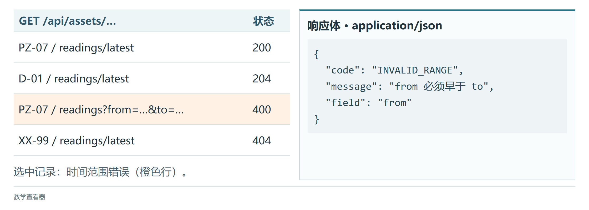
<figcaption>图 4.8  请求状态与JSON响应对照（教学查看器，调用配套教学接口）</figcaption>
</figure>

### 4.5.3 页面的四种状态：加载、空数据、错误与过期

清单4.27只处理了“成功”这一条路。真实页面在任一时刻只能处于一种状态：正在加载、有数据、没有数据、出了错。把状态显式写成一个对象，渲染函数只看状态不看网络，后面的 Vue 组件与 Pinia 仓库也是这个做法。表4.5列出四种状态、用教学接口触发它的方式（参数含义见表8.4）和页面应有的表现。还有一种情况是“过期”：请求发出后用户已经切到别的对象，这个请求即使返回结果也要丢弃，页面保持当前状态，处理方法见 4.5.4 节。

**表 4.5  详情页的状态模型与教学接口触发方式**

| 状态    | 触发方式                                                                                          | 页面应有表现                                                                       |
|:--------|:--------------------------------------------------------------------------------------------------|:-----------------------------------------------------------------------------------|
| loading | 任一请求发出后、响应到达前；用`?teach=delay:3000`拉长                                             | 显示“正在读取 案例渗压07…”；不能显示上一个对象的数据                               |
| ready   | 正常响应 200                                                                                      | 值、单位、时间、质量码；quality 为 suspect 时加提示，为 missing 时不显示数值       |
| empty   | `?teach=empty`（或该对象确实没有观测，204）                                                       | 显示“暂无观测”，不是空白，也不是错误                                               |
| error   | `?teach=invalid`（400）、`?teach=unauthorized`（401）、`?teach=error`（503）、不存在的对象（404） | 400 提示到字段并保留输入；401 清除令牌回到登录页；404 建议返回列表；503 给重试按钮 |

清单4.28实现这个状态模型。`render`把状态写进`data-state`属性，CSS 与测试都可以直接断言它；`messageFor`只依赖契约中的状态码与`code`，不解析文案。

**清单 4.28  state.js：页面状态模型与渲染**

```javascript
// 同一时刻只处于一种状态，渲染函数只看状态不看网络
export const State = { LOADING: 'loading', READY: 'ready', EMPTY: 'empty', ERROR: 'error' };

export function render(el, view) {
  el.dataset.state = view.state;              // 便于 CSS 与测试断言
  const name = view.asset.displayName;
  switch (view.state) {
    case State.LOADING: el.textContent = `正在读取 ${name}…`; break;
    case State.EMPTY:   el.textContent = `${name}：暂无观测`; break;
    case State.READY: {
      const r = view.reading;
      el.textContent = r.quality === 'missing'
        ? `${name}：该时刻缺测`
        : `${name}：${r.value} ${r.unit}（质量 ${r.quality}）`;
      break;
    }
    case State.ERROR:   el.textContent = messageFor(view.error); break;
  }
}

export function messageFor(error) {
  switch (error.status) {
    case 400: return `参数有误：${error.body.field ?? ''} ${error.body.message ?? ''}`.trim();
    case 401: return '登录已失效，请重新登录';
    case 403: return '当前角色无权查看该对象';
    case 404: return '对象不存在，请返回列表';
    default:  return '服务暂时不可用，请稍后重试';
  }
}
```

图4.9是同一个渲染函数的四种运行结果。204 表示对象存在但尚无观测，进入空状态；404 表示对象不存在，进入错误状态。两者对值班员的含义不同：前者等一等就会有数据，后者要回去检查编码。

<figure markdown>
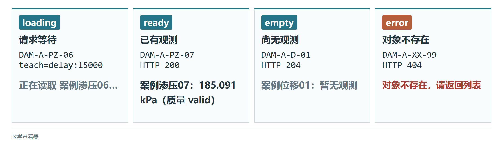
<figcaption>图 4.9  加载、有数据、空数据与错误状态（教学查看器，调用S2模块）</figcaption>
</figure>

### 4.5.4 故障单元：切换测点时旧数据覆盖新数据

**现象**

把清单4.27改成“点击列表中的对象就读取它的最新观测”后，做如下操作：先点击 `DAM-A-PZ-07`，并让教学接口对它延迟 3 秒（请求地址加`?teach=delay:3000`）；不等结果出来，立即点击 `DAM-A-WL-01`。页面先正确显示“案例库水位01：166.837 m”，约 3 秒后却变成“案例渗压07：185.091 kPa”。值班员看着水位计的标题，读到的是渗压计的数。

**时序**

图4.10将两次请求及页面结果放在同一时间轴上。第二次请求先返回，第一次请求随后到达。比较下方两行：无序号校验时，旧响应覆盖当前页面；校验最新请求序号后，迟到响应被丢弃，页面继续显示当前选择的对象。

<figure markdown>
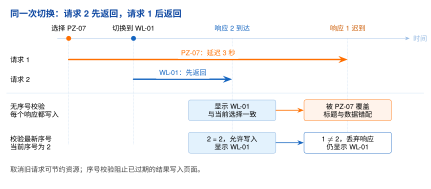
<figcaption>图 4.10  迟到响应的覆盖故障与请求序号校验</figcaption>
</figure>

**原因**

每次点击都发出一个独立的请求，每个响应回来都无条件调用`render`。页面状态与“用户当前想看哪个对象”之间没有绑定，谁最后返回谁就赢。网络慢只是让问题容易复现；只要两次请求的耗时不同，问题就存在。

**处理方案**

两道防线一起用。第一道：切换对象时用`AbortController`取消上一个请求，浏览器不再等它，被取消的`fetch`以`AbortError`拒绝，调用方要把它与服务器错误分开。第二道：给每次切换分配递增序号，响应回来时核对“我的序号是否仍是最新”，不是就丢弃。取消信号发出后，已开始处理的响应仍可能继续执行，因此写入页面前必须核对序号。清单4.29给出完整代码，它复用清单4.27的`loadLatest`（已接收`signal`参数）和清单4.28的`render`；`bindList`用的是4.4.6节的事件委托。入口文件`src/lesson45/main.js`负责登录、读取对象列表、把每个对象渲染成按钮，再调用`bindList`；打开`/lesson45.html`就是这个页面。

**清单 4.29  controller.js：取消旧请求并丢弃迟到响应**

```javascript
import { loadLatest } from './detail.js';
import { State, render } from './state.js';

let sequence = 0;       // 每次切换递增；只有最新序号的响应才允许写入页面
let controller = null;  // 上一次请求的取消句柄

export async function showAsset(el, asset) {
  const mine = ++sequence;
  controller?.abort();                        // 第一道防线：通知旧请求结果不再需要
  controller = new AbortController();
  render(el, { state: State.LOADING, asset });
  try {
    const reading = await loadLatest(asset.assetId, controller.signal);
    if (mine !== sequence) return;            // 第二道防线：迟到的旧响应静默丢弃
    render(el, reading ? { state: State.READY, asset, reading }
                       : { state: State.EMPTY, asset });
  } catch (error) {
    if (error.name === 'AbortError') return;  // 被自己取消的不是故障
    if (mine !== sequence) return;
    render(el, { state: State.ERROR, asset, error });
  }
}

// 列表点击：<button data-asset-id="DAM-A-PZ-07">…</button>
export function bindList(listEl, outputEl, assets) {
  listEl.addEventListener('click', event => {
    const id = event.target.closest('button')?.dataset.assetId;
    const asset = assets.find(a => a.assetId === id);
    if (asset) showAsset(outputEl, asset);
  });
}
```

**验证记录**

重复“现象”中的操作，表4.6是修复前后应当观察到的差别。验收时看两处：“网络”面板中请求1 的状态是否为“已取消”，页面最终文字是否与最后点击一致。只看页面最终结果不够，网络很快的机器上修复前也可能碰巧正确。

**表 4.6  故障单元的验证记录**

| 观察点              | 修复前                   | 修复后                                           |
|:--------------------|:-------------------------|:-------------------------------------------------|
| 点击 WL-01 后的页面 | 立即显示 166.837 m       | 先显示“正在读取 案例库水位01…”，再显示 166.837 m |
| 约 3 秒后的页面     | 变为 185.091 kPa（错误） | 保持 166.837 m                                   |
| “网络”面板中请求1   | 200，耗时约 3 s          | 状态“已取消”（canceled）                         |
| 控制台              | 无输出                   | 无输出：AbortError 被识别为正常路径，不打印      |
| 再点击一次 PZ-07    | 显示 185.091 kPa         | 显示 185.091 kPa（序号已更新，新请求正常写入）   |

**延伸**

同一个模式在本书后面反复出现：4.7 节 Pinia 仓库的`loadLatest`用同样的序号校验，否则切换测点时读数会闪回；7.4 节切换三维对象时，详情面板也不能显示上一个对象的观测；第8章预警确认属于写操作，取消请求并不能撤销服务端已完成的确认，那里要靠幂等键而不是序号。

图4.11记录先选渗压点、再选水位点的请求次序。旧请求取消后，页面保持最后选中的水位对象。

<figure markdown>
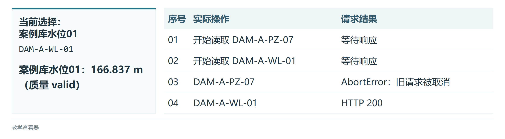
<figcaption>图 4.11  切换测点后的取消记录与最终页面（教学查看器，调用S2模块）</figcaption>
</figure>

### 4.5.5 request.js：JWT、401 与超时的统一入口

清单4.27把令牌放在模块变量里，刷新页面就没了，`getJson`也只有这一个页面能用。4.6节以后的 Vue 页面共用一个请求模块`src/api/request.js`。令牌是第5章后端签发的 JWT：一段带签名和有效期的字符串，后端凭它确认请求者是谁。登录成功后前端保存令牌，后续每个请求在`Authorization: Bearer <token>`头里带上它；收到 401 说明令牌失效，清除令牌并跳转登录页，不拿旧令牌重试。

教学示例把令牌放入`sessionStorage`，关闭标签页后令牌消失；代价是页面一旦被注入恶意脚本（4.4.4节的 XSS），脚本可以读走它。生产系统要结合内容安全策略、短有效期和 HttpOnly Cookie 方案评估。签名密钥只存在于后端，任何以`VITE_`开头的前端变量都会被打包进浏览器能下载的文件，不能存放密钥。

清单4.30就是配套工程的`src/api/request.js`。它统一处理令牌注入、JSON 头、204 空响应、超时和 401 跳转；超时的做法是用`setTimeout`在 10 秒后调用`controller.abort()`，与4.5.4节取消旧请求用的是同一个机制。请求函数只负责传输和认证，页面层根据错误代码决定显示“重新登录”“稍后重试”还是“检查测站输入”。

**清单 4.30  request.js：令牌注入、401 跳转与超时**

```javascript
const API_BASE = import.meta.env.VITE_API_ORIGIN ?? '';   // 契约路径已含 /api 前缀
const DEFAULT_TIMEOUT = 10_000;
// 令牌键名是前端各模块的共同契约：请求封装、路由守卫、
// 登录页都从这里导入，避免"登录成功却处处 401"的隐蔽错误
export const TOKEN_KEY = 'access_token';

function accessToken() {
  return sessionStorage.getItem(TOKEN_KEY);
}

export async function request(path, options = {}) {
  const controller = new AbortController();
  const timeoutId = setTimeout(
    () => controller.abort(), options.timeoutMs ?? DEFAULT_TIMEOUT
  );
  const headers = new Headers(options.headers);
  headers.set('Accept', 'application/json');
  if (options.body && !headers.has('Content-Type')) {
    headers.set('Content-Type', 'application/json');
  }
  const token = accessToken();
  if (token) headers.set('Authorization', `Bearer ${token}`);

  try {
    const response = await fetch(`${API_BASE}${path}`, {
      ...options, headers, signal: controller.signal
    });
    if (response.status === 401 && !path.startsWith('/api/auth/')) {
      // 业务请求的 401 才代表登录态失效；
      // 登录接口自身的 401 是"密码错误"，交回页面层提示
      sessionStorage.removeItem(TOKEN_KEY);
      const redirect = encodeURIComponent(location.pathname + location.search);
      location.assign(`/login?redirect=${redirect}`);
      throw new Error('UNAUTHORIZED');
    }
    if (!response.ok) throw new Error(`HTTP_${response.status}`);
    if (response.status === 204) return null;
    return response.json();
  } catch (error) {
    if (error.name === 'AbortError') {
      throw new Error('REQUEST_TIMEOUT', { cause: error });
    }
    throw error;
  } finally {
    clearTimeout(timeoutId);
  }
}
```

### 4.5.6 Vite 代理与环境变量

Vite 是本章使用的前端开发工具：`npm run dev`启动一个开发服务器，修改源文件后页面自动刷新；`npm run build`把源文件打包成可部署的静态文件。开发时页面由 Vite 的 5173 端口提供，后端在 8080 端口；协议、域名、端口有一项不同就算“不同源”，浏览器默认不允许页面脚本读取不同源接口的响应，这就是跨域限制。Vite 的`server.proxy`让开发服务器代为转发：浏览器请求同源的`/api/...`，Vite 在服务器一侧转给 8080。生产环境由 Nginx 或网关做同样的路径转发。代理只解决开发时的跨域，与后端认证无关。

只有以`VITE_`开头的环境变量会暴露给浏览器代码（通过`import.meta.env`读取），它们的值在构建时被直接替换进 JavaScript 文件，所以只能放 API 基地址、功能开关这类公开信息。清单4.31是带代理的`vite.config.js`：`loadEnv`按运行模式读取`.env`文件，代理目标缺省指向本机 8080。修改配置后重启`npm run dev`，在“网络”面板里看到`/api/assets`的请求地址仍是 5173 端口，而教学接口的终端里出现了对应的访问记录，说明代理生效。

**清单 4.31  Vite 5 的 server.proxy 与 import.meta.env**

```javascript
import { defineConfig, loadEnv } from 'vite';
import vue from '@vitejs/plugin-vue';

export default defineConfig(({ mode }) => {
  const env = loadEnv(mode, process.cwd(), 'VITE_');
  return {
    plugins: [vue()],
    server: {
      proxy: {
        '/api': {
          target: env.VITE_PROXY_TARGET ?? 'http://localhost:8080',
          changeOrigin: true,
          secure: false
        }
      }
    },
    define: {
      __BUILD_MODE__: JSON.stringify(mode)
    }
  };
});
```

### 4.5.7 登录与受保护接口的前后端联调

一次受保护的请求要过几道关。登录接口返回访问令牌；`request.js`在每个请求里注入 Bearer 头；后端的 JWT 过滤器验证签名和有效期，通过后把用户身份放进安全上下文；授权规则再决定这个身份能不能调用目标接口。图4.12把这条链路与两个失败分支画在一起，后端各环节的实现见第5章。

<figure markdown>

<figcaption>图 4.12  前端登录、JWT过滤器与受保护接口的联调链路</figcaption>
</figure>

联调时把状态码和界面行为一一对应。401 表示“不知道你是谁”：清理本地令牌，带着原始路径跳到登录页。403 表示“知道你是谁，但你无权做这件事”：留在当前页面显示无权提示，跳回登录页没有意义。404 说明测站不存在；400 要按`field`把错误写回表单。前端不能把“没有令牌”和“令牌已过期”都显示成空列表，否则值班员只能靠反复刷新来猜系统状态。登录请求的字段名、令牌字段和失败错误码以表8.3为准；令牌的键名由所有模块从清单4.30导入同一个`TOKEN_KEY`常量，键名对不上是“登录成功却处处 401”的常见原因。登录函数的写法已见清单4.27，Vue 登录页见4.7.1节。

联调中另有三类问题容易误判。一是时钟：浏览器与服务端时钟相差过大，刚签发的令牌会被判为尚未生效或已过期，这时应记录服务端时间与令牌里的`iat`、`exp`，而不是放宽过期校验。二是跨域报错：先确认请求是否绕过了代理（地址里出现了 8080），再考虑后端的跨域配置；允许任意来源不能解决认证问题，还会扩大令牌泄露面。三是重试：网络超时后可以重试 GET，创建处置单这类 POST 必须带幂等键（第8章）；多个并发请求同时收到 401 时，只清理和跳转一次。

**表 4.7  前后端认证联调的检查记录**

| 检查点   | 浏览器证据                                          | 服务端证据                                      |
|:---------|:----------------------------------------------------|:------------------------------------------------|
| 登录成功 | POST 返回 200，响应含 accessToken，未把密码写入日志 | issuer、subject、type 和 exp 校验通过           |
| 访问列表 | 请求带 Authorization，响应 200 或明确的 401/403     | 过滤器写入 SecurityContext，权限方法给出决策    |
| 令牌过期 | 收到一次 401，令牌被清理并回到原路径                | 记录 jti、失败原因和请求追踪 ID，不记录完整令牌 |
| 网络异常 | 超时显示重试，幂等请求才自动重试                    | 网关和应用日志能按追踪 ID 对齐时间线            |

每次联调按表4.7逐行记录请求时间、状态码和去掉令牌后的响应摘要。有了这份记录，前后端对“到底通没通”的判断依据是同一组可以重放的请求。

### 4.5.8 拓展：认证契约测试与故障复盘

能登录只是第一步，难点在多个请求同时发生、页面刷新和网络抖动时，页面是否仍然按同一套规则反应。4.5.4 节的竞态覆盖可以写成自动化测试：让第一个模拟请求延迟 200 毫秒、第二个只延迟 20 毫秒，连续调用两次`showAsset`，断言页面最终文字属于第二个对象、第一个请求收到取消信号。配套工程的`tests/lesson45.test.js`就是这样写的，在`frontend/`目录执行`npm test`运行。

错误提示要区分能不能通过重试恢复。表4.8按状态码列出含义和前端动作：401 重试同一个请求没有意义；403 自动重试只会制造日志噪声；409 表示版本或幂等键冲突，要重新读取后由人确认；429 和 503 可以重试，但要遵守服务端`Retry-After`头或逐次加长间隔，并设最大次数。前端读取稳定的`code`字段，不从错误文本里猜状态。

**表 4.8  认证及接口错误的前端处理矩阵**

| 状态    | 业务含义             | 前端动作与验收证据                                         |
|:--------|:---------------------|:-----------------------------------------------------------|
| 401     | 未登录或访问令牌失效 | 清理令牌、保留原路径、只发起一次登录跳转；记录脱敏 traceId |
| 403     | 已识别身份但权限不足 | 停留当前页面，展示所需权限和申请入口；不得循环登录         |
| 404     | 测站或事件不存在     | 显示资源不存在并提供返回列表；不把空对象当作零值           |
| 409     | 版本或幂等键冲突     | 重新读取资源并提示人工确认；保留冲突双方版本号             |
| 429/503 | 限流或服务暂不可用   | 按 Retry-After 或退避重试，超过上限后提供手动重试          |

表中每一行都可以改写成一个端到端测试用例，包含初始路由、是否已有令牌、请求次数、最终 URL 和页面可见文案；涉及权限的用例固定测试账号的角色。用教学接口的`teach=`参数可以依次制造 401、400、503 和延迟，每种故障注入后检查四件事：页面是否仍可操作，是否产生重复请求，是否保存了原路径，是否把故障与正常读数、空结果明确区分。

接口字段升级、跨域预检、令牌存储方式的取舍、认证性能和联调记录归档等内容见附录C的C.6节。

### 4.5.9 拓展：事件循环与任务调度

4.1节提到 JavaScript 在一个线程里依次处理任务，这里说明“依次”的规则。当前同步代码执行完后，事件循环先清空微任务队列，再从任务队列取下一个任务（也叫宏任务）。网络回调、定时器和用户输入进入任务队列；`Promise.then`、`await`之后的代码和`queueMicrotask`的回调进入微任务队列。所以清单4.32的输出顺序与书写顺序不同：两条同步输出在前，两条微任务其次，`setTimeout`即使延迟为 0 也排在最后。

微任务适合做同一轮里的短小收尾，例如把多个状态变化合并后再通知界面。微任务执行期间浏览器不能绘制也不能响应输入，长时间运行的微任务会让页面卡住。处理大量测点时，把计算分批放进任务队列或交给 Web Worker（浏览器提供的后台线程）。

**清单 4.32  事件循环中的同步、微任务与宏任务**

```javascript
console.log('同步：开始读取');

setTimeout(() => console.log('宏任务：定时刷新'), 0);
queueMicrotask(() => console.log('微任务：合并状态'));
Promise.resolve().then(() => console.log('微任务：更新摘要'));

console.log('同步：结束读取');
// 典型顺序：开始、结束、合并状态、更新摘要、定时刷新
```

### 4.5.10 自测与下一步

1.  把清单4.27中最后一行的对象换成 `DAM-A-RF-01`，页面显示什么？再把地址改成 `DAM-A-RF-99`，页面应显示什么、“网络”面板的状态码是多少？（参考：雨量计的最新观测与单位 mm；404 与“对象不存在，请返回列表”。）

2.  只保留清单4.29的序号校验、删去`AbortController`，故障单元的验证记录哪几行会变？（参考：页面结果仍正确，但请求1 不再显示“已取消”，仍会占用 3 秒带宽并返回 200。）

3.  教学接口对`/api/assets`返回`?teach=empty`时，列表页应当显示什么？如果显示“服务暂时不可用”，说明状态模型哪里错了？（参考：空数组是 empty 而非 error；把`[]`当成失败是把“没有数据”和“拿不到数据”混为一谈。）

4.6 节用 Vue 组件承接同一份状态模型；4.7 节把`showAsset`的序号校验搬进 Pinia 仓库；4.8 节给出 S1、S2 两个阶段的验收检查单。完成第5章的存储、统一异常处理和认证后，先停掉教学接口并启动完整的 Spring Boot 后端，再执行契约检查，核对页面的四种状态。

## 4.6 Vue 3组件化开发

**本节层次**

核心：4.6.1、4.6.2；指导实践：4.6.3、4.6.4。

**进入本节所需知识**

读过4.4节与4.5节核心内容，写过“数据变了就手动改 DOM”的代码；配套工程`frontend/`已执行过`npm ci`。

4.5节的`render`函数每次状态变化都要自己找到节点、改写文字。页面上只有一行输出时这不难；仪表盘同时有曲线、表格和预警标识时，“哪个数据变了要改哪几个节点”很快就理不清。Vue 换了一种写法：你在模板里声明“界面长什么样、各处显示哪个状态”，把状态存进 Vue 提供的响应式变量，之后只改变量，DOM 由框架同步。界面仍要遵守反馈及时、操作一致这些基本设计原则<sup>[[32]](../../references.md#ref32)</sup>。

一个 Vue 组件写在一个`.vue`文件里，叫单文件组件（SFC）：`<script setup>`块写状态和逻辑，`<template>`块写模板，可选的`<style>`块写样式。本章使用 Vue 3.4+ 的组合式 API，响应式系统的完整说明见官方文档<sup>[[26]](../../references.md#ref26)</sup>。清单4.33是一个完整的测站卡片组件。`defineProps`声明父组件可以传进来的数据（props）及其类型；`computed`定义一个由其他状态算出来的值，依赖变了自动重算；模板里的双花括号显示一个表达式的值，`:class`把属性绑定到表达式，`@click`登记点击处理；`emit`向父组件发出一个事件。数据由父到子经 props 向下传，子组件通过事件向上通知，这是 Vue 组件之间的基本约定。

把清单保存为`src/components/AssetCard.vue`，在任一页面组件里`import AssetCard from './components/AssetCard.vue'`，模板中写`<AssetCard display-name="案例库水位01" :value="166.84" />`，`npm run dev`后页面出现一张带`station-card–warning`类的卡片；把数值改成 165.12，类名变为`station-card–normal`。

**清单 4.33  测站卡片组合式组件**

```vue
<script setup>
import { computed } from 'vue'
const props = defineProps({
  displayName: { type: String, required: true },
  value: { type: Number, required: true },
  unit: { type: String, default: 'm' }
})
const emit = defineEmits(['open-detail'])
// 165.5 m 是案例水库汛限水位（8.1 节参数表）；真实阈值应来自后端
const status = computed(() => props.value >= 165.5 ? 'warning' : 'normal')
</script>

<template>
  <article :class="['station-card', `station-card--${status}`]">
    <h3>{{ displayName }}</h3>
    <p>当前值：{{ value.toFixed(2) }} {{ unit }}</p>
    <button type="button" @click="emit('open-detail')">查看详情</button>
  </article>
</template>
```

### 4.6.1 Vue 3.4 组合式 API 与响应式状态

普通变量改了值，Vue 并不知道；要让界面跟着变，状态必须放进响应式容器。`ref`包住一个值，在脚本里通过`.value`读写，在模板里直接写变量名，Vue 自动取出里面的值。`reactive`把一个对象变成响应式的，直接读写属性即可；不能把整个对象重新赋值，那样会丢掉响应式。常见分工是：表单的一组字段用`reactive`，加载标志、选中的编码、会被接口结果整体替换的数组用`ref`。

从已有状态算出来的结果用`computed`，例如筛选后的列表；它会缓存，依赖不变就不重算。状态变化时要“做一件事”（发请求、写存储、打日志）用`watch`，它监听一个明确的来源；`watchEffect`自动追踪函数里用到的所有响应式状态，适合小范围联动。表4.9把五个 API 的用途和常见错误放在一起。判断方法很简单：结果能由现有状态纯计算得到，用`computed`；要访问网络或修改外部东西，用`watch`。`computed`里出现了`fetch`，或者`watch`里只是拼了个字符串，都说明用错了。

**表 4.9  Vue 响应式 API 的职责边界与验收问题**

| API           | 适合表达的内容                 | 代码评审时的核对问题                                       |
|:--------------|:-------------------------------|:-----------------------------------------------------------|
| `ref`         | 基本值、可整体替换的对象       | 是否在 JavaScript 中正确使用`.value`，模板是否依赖自动解包 |
| `reactive`    | 表单、稳定结构的对象和数组     | 是否把代理对象整体替换，是否把深层可变状态暴露给子组件     |
| `computed`    | 过滤、排序、格式化等纯派生值   | 函数是否无网络请求和写操作，依赖是否完整                   |
| `watch`       | 具有明确来源的异步或外部副作用 | 是否处理竞态、错误和清理，是否设定合理的`flush`时机        |
| `watchEffect` | 少量依赖的同步联动             | 自动收集的依赖是否稳定，是否会因隐式访问造成重复执行       |

清单4.34是测站筛选页`AssetFilterPage.vue`的脚本部分，数据先写死两条，4.6.4节再换成接口。对象列表的字段取自表8.3。`watch`在选中编码变化时执行，`watchEffect`在筛选结果数量变化时执行。这一段还没有模板，页面上没有输入框；先保存并打开控制台，能看到`watchEffect`首次执行时打印的“筛选数量 2”。补上4.6.2节的模板以后，在页面上输入关键字，就能看到这个数字随输入变化。

**清单 4.34  AssetFilterPage.vue 的脚本：响应式状态、计算属性与监听器**

```vue
<script setup>
import { computed, reactive, ref, watch, watchEffect } from 'vue';

const selectedId = ref('DAM-A-PZ-07');
const form = reactive({ keyword: '', assetType: '' });
const assets = ref([
  { assetId: 'DAM-A-WL-01', displayName: '案例库水位01', assetType: '库水位', unit: 'm' },
  { assetId: 'DAM-A-PZ-07', displayName: '案例渗压07', assetType: '渗压', unit: 'kPa' }
]);
const visibleAssets = computed(() => assets.value.filter(asset => {
  const match = asset.displayName.includes(form.keyword);
  return match && (form.assetType === '' || asset.assetType === form.assetType);
}));

watch(selectedId, id => console.log('重新加载测站', id));
watchEffect(() => console.log('筛选数量', visibleAssets.value.length));
</script>
```

阈值计算和数据质量判定由后端给出结论，前端的响应式状态只管界面；展示读数时保留测点编号、采样时间和质量码，值班员才能追溯。

### 4.6.2 模板指令与组件通信

模板里以`v-`开头的属性叫指令，它们把状态映射成 HTML。`v-if`按条件创建或销毁节点，适合权限区域、错误提示这类不常切换的内容；`v-show`保留节点、只切换`display`，适合反复开合的筛选面板。`v-for`按数组渲染一组节点，必须配一个稳定且唯一的`:key`，用对象编码，不用数组下标：列表筛选或排序后，Vue 靠 key 判断哪一行是哪一行，用下标会把旧行的焦点和输入内容错配给另一个测站。`v-model`让输入控件与状态双向同步，修饰符`.trim`去掉首尾空白；`v-bind`（简写为冒号）绑定属性，`v-on`（简写为`@`）绑定事件。

清单4.35是同一个文件的模板部分，接在清单4.34的`</script>`之后。模板只声明关系，筛选逻辑留在`computed`里。在下拉框里选“渗压”，列表只剩一行；点击某一行的按钮，“当前”标记移到这一行，控制台同时打印`watch`的输出。

**清单 4.35  AssetFilterPage.vue 的模板：指令与稳定 key**

```vue
<template>
  <label>
    关键字
    <input v-model.trim="form.keyword" type="search">
  </label>
  <label>
    类型
    <select v-model="form.assetType">
      <option value="">全部</option>
      <option>库水位</option>
      <option>渗压</option>
    </select>
  </label>
  <p v-show="form.keyword === ''" class="hint">输入名称中的任意几个字即可筛选</p>
  <ul>
    <li v-for="asset in visibleAssets" :key="asset.assetId">
      <button type="button" v-bind:aria-label="`打开${asset.displayName}`"
              v-on:click="selectedId = asset.assetId">
        {{ asset.displayName }}（{{ asset.unit }}）
      </button>
      <span v-if="asset.assetId === selectedId" class="current">当前</span>
    </li>
  </ul>
</template>
```

组件之间有四种传递方式。props 由父到子传只读数据，子组件不修改它；emit 由子到父报告用户动作，事件名描述意图（`select`、`retry`），参数只带业务主键。slot（插槽）让父组件往子组件里塞一段自己的模板，例如替换卡片的操作区，而不必复制整张卡片。provide/inject 跨越多层组件传递只读配置，例如兜底单位、主题和请求客户端；会变化的业务状态不走这条路，交给4.7节的 Pinia，状态归谁管才看得清。

清单4.36在清单4.33的卡片上加了后两种方式：`<slot name="actions">`里的按钮是默认内容，父组件提供了同名插槽就用父组件的；`inject`取得上层`provide`的兜底单位，第二个参数是没人提供时的默认值。父组件用`readonly`包住提供的值，子组件无法改动它。测试这个组件时从约定出发：给定 props 检查渲染出的标题和单位；点击按钮后断言发出的事件名和参数；替换插槽后确认按钮仍有可访问名称。

**清单 4.36  Vue props、emit、slot 与 provide/inject**

```vue
<!-- AssetCard.vue -->
<script setup>
import { inject } from 'vue';
const props = defineProps({ asset: { type: Object, required: true } });
const emit = defineEmits(['select']);
const fallbackUnit = inject('fallbackUnit', 'm');
</script>
<template>
  <article>
    <h3>{{ props.asset.displayName }}</h3>
    <p>当前值：{{ props.asset.value }} {{ props.asset.unit ?? fallbackUnit }}</p>
    <slot name="actions">
      <button type="button" @click="emit('select', props.asset.assetId)">查看</button>
    </slot>
  </article>
</template>

<!-- AssetPanel.vue 的 script setup 片段 -->
<script setup>
import { provide, readonly, ref } from 'vue';
const fallbackUnit = ref('m');   // 对象自身没有单位时的兜底
provide('fallbackUnit', readonly(fallbackUnit));
</script>
```

### 4.6.3 生命周期与资源清理

组件从创建到销毁经过几个固定时刻，Vue 在这些时刻调用你登记的函数，叫生命周期钩子。图4.13画出组合式 API 的钩子顺序：`setup`建立状态，挂载后调用`onMounted`，此时模板已经变成真实的 DOM；响应式状态变化引起的 DOM 更新可以发生零次或多次；组件离开页面时调用`onUnmounted`。Vue 3 的卸载钩子是`onBeforeUnmount`和`onUnmounted`，网上不少旧资料里的`beforeDestroy`、`destroyed`是 Vue 2 的名字。

<figure markdown>
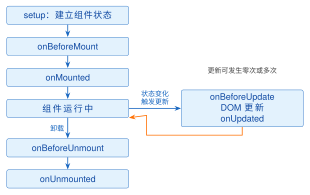
<figcaption>图 4.13  Vue 3组件生命周期与可重复的更新分支</figcaption>
</figure>

定时刷新、WebSocket 连接、图表和三维场景实例都在`onMounted`里建立、在`onUnmounted`里释放。忘记释放时，值班员在页面之间来回切换几次，后台就留下好几个还在发请求的定时器，内存也一直涨。清单4.37是一个每 30 秒刷新一次的组件：`onMounted`保存定时器句柄，`onUnmounted`用这个句柄清除定时器，并通过`AbortController`取消还没返回的请求。验证方法：挂载组件后在“网络”面板看到每 30 秒一条请求；切到别的页面后请求停止；再切回来，仍然只有一路请求。

**清单 4.37  onMounted 与 onUnmounted 的清理模式**

```vue
<script setup>
import { onMounted, onUnmounted, ref } from 'vue';

const latest = ref(null);
const controller = new AbortController();
let timerId;

async function refresh() {
  const response = await fetch('/api/assets/DAM-A-PZ-07/readings/latest', {
    signal: controller.signal
  });
  if (response.ok) latest.value = await response.json();
}

onMounted(() => {
  refresh();
  timerId = window.setInterval(refresh, 30_000);
});
onUnmounted(() => {
  window.clearInterval(timerId);
  controller.abort();
});
</script>
```

刷新间隔由业务允许的延迟决定：案例水库的实时读数允许三十秒延迟，就用三十秒。上一次请求还没回来时不要再发一次，可以用加载标志挡住，或者像4.5.4节那样取消旧请求；标签页转入后台时可以暂停刷新，回到前台立即拉取一次。

### 4.6.4 测站列表筛选页：从 SFC 到组件拆分

现在把4.6.1和4.6.2节的`AssetFilterPage.vue`补成可交付的页面：数据来自接口，有加载中、空结果和正常三种显示，列表行拆成独立组件。父组件负责取数、保存筛选条件和计算可见集合；行组件只管一行的显示和发出选择事件，以后可以在地图侧栏复用。

清单4.38是行组件`AssetRow.vue`。清单4.39只列出`AssetFilterPage.vue`相对前两份清单的改动：写死的数组换成空数组，挂载后用清单4.30的`request`读取`/api/assets`；模板里的`<ul>`换成三个分支。运行前启动教学接口和开发服务器并先登录；页面先显示“正在加载测站……”，随后列出 28 个对象；关键字输入“不存在”，显示“没有符合条件的测站”。

**清单 4.38  测站列表行组件 AssetRow.vue**

```vue
<script setup>
defineProps({
  asset: { type: Object, required: true },
  selected: { type: Boolean, default: false }
});
const emit = defineEmits(['select']);
</script>

<template>
  <li :class="{ selected }">
    <button type="button" @click="emit('select', asset.assetId)">
      <strong>{{ asset.displayName }}</strong>
      <span>{{ asset.assetType }}，单位 {{ asset.unit }}</span>
      <span v-if="selected" class="current">当前</span>
    </button>
  </li>
</template>
```

**清单 4.39  AssetFilterPage.vue 的改动：接口取数、三种显示与行组件**

```vue
<script setup>
import { computed, onMounted, reactive, ref } from 'vue';
import AssetRow from './AssetRow.vue';
import { request } from '../api/request.js';

const assets = ref([]);                 // 写死的两条数据改为空数组
const loading = ref(false);
// selectedId、form、visibleAssets 与 4.6.1 节的脚本清单相同

async function loadAssets() {
  loading.value = true;
  try {
    assets.value = await request('/api/assets');
  } finally {
    loading.value = false;
  }
}
function selectAsset(id) { selectedId.value = id; }
onMounted(loadAssets);
</script>

<template>
  <!-- 两个 <label> 与 4.6.2 节的模板清单相同 -->
  <p v-if="loading" role="status">正在加载测站……</p>
  <p v-else-if="visibleAssets.length === 0">没有符合条件的测站</p>
  <ul v-else>
    <AssetRow v-for="asset in visibleAssets" :key="asset.assetId"
              :asset="asset" :selected="asset.assetId === selectedId"
              @select="selectAsset" />
  </ul>
</template>
```

这个页面还缺错误状态：`request`失败时`loadAssets`会抛出异常，页面却停在空列表上。参照4.5.3节的四种状态补一个`error`变量和对应的`v-else-if`分支，再用`?teach=error`验证，是本小节的练习。交付前按四个方面各检查一遍：数据（字段、单位、时间格式和质量码是否与契约一致）；交互（关键字、类型筛选、键盘选择）；错误（加载失败、令牌过期、超时、空结果）；可访问性（标题层级、表单标签、焦点可见、`role="status"`的加载提示能被读屏软件读到）。每一项写出输入和预期输出。

## 4.7 Vue Router与Pinia应用组织

**本节层次**

指导实践：4.7.1、4.7.2、4.7.3、4.7.4。

**进入本节所需知识**

读过4.6节核心内容；本节复用4.5.5节的`request.js`，运行时需要教学接口和`npm run dev`。

到4.6节为止，页面只有一个。实际平台有登录页、测站列表、测站详情和预警中心，值班员还会把某个测点的详情地址发给同事。单页面应用（SPA）只加载一次HTML，之后的“换页”由脚本完成：Vue Router 根据地址栏的路径决定显示哪个页面组件，并让浏览器的前进、后退和刷新照常工作。页面多了以后，几个页面要用同一份数据（当前测点、最新读数），这份数据放在 Pinia 的仓库（store）里，不属于任何一个组件。三方的分工是：路由负责页面切换和参数解析，页面负责展示与交互，身份和权限的最终判定在后端。

### 4.7.1 根组件、路由表与登录守卫

应用从入口文件`src/main.js`启动。清单4.40就是配套工程里的这个文件：创建应用，依次注册 Pinia 和路由，挂载到`index.html`里`id="app"`的节点上。先注册 Pinia，是因为路由守卫里可能要读仓库里的登录状态，那时仓库必须已经存在。

**清单 4.40  应用入口：注册 Pinia 与路由**

```javascript
import { createApp } from 'vue';
import { createPinia } from 'pinia';
import App from './App.vue';
import router from './router';

createApp(App).use(createPinia()).use(router).mount('#app');
```

根组件`App.vue`只保留全局布局和路由出口。清单4.41里，`<RouterView />`是出口，当前路径匹配到的页面组件显示在这里；`<RouterLink>`生成不会整页刷新的站内链接。

**清单 4.41  App.vue 根组件与 router-view**

```vue
<script setup>
import { RouterLink, RouterView } from 'vue-router';
</script>

<template>
  <header class="app-header">
    <RouterLink to="/">水利工程安全监测平台</RouterLink>
    <nav aria-label="主导航">
      <RouterLink to="/assets">测站</RouterLink>
      <RouterLink to="/warnings">告警中心</RouterLink>
    </nav>
  </header>
  <main>
    <RouterView />
  </main>
</template>
```

清单4.42是加入本章页面之后的路由表：配套工程`src/router/index.js`里已经有登录页和`/monitoring`仪表盘两条路由，在它的`routes`数组上追加以下路由即可，`/monitoring`那条保留，第8章的联调页面还要用它；先按下文建好三个占位组件，再改路由表，否则动态导入找不到文件。每条路由有路径、名称和组件；页面路径跟随表8.3的资源名，对象是`/assets`，预警是`/warnings`。`component: () => import(...)`是4.4.3节的动态导入，详情页的代码到用户真正访问时才下载。`/assets/:id`里的`:id`是动态段，匹配`/assets/DAM-A-PZ-07`这类地址，取到的参数总是字符串。`meta`是附在路由上的自定义数据，这里用`requiresAuth`标记需要登录的页面。几个页面组件中，`AssetList.vue`可以直接用4.6.4节的筛选页，`AssetMap.vue`和`WarningList.vue`先各放一个只有标题的占位组件，`Login.vue`与`AssetDetail.vue`在下面给出。

`router.beforeEach`登记的函数叫导航守卫，每次切换页面之前执行。没有令牌又要访问受保护页面时，守卫返回登录页的路由对象，并把原本要去的路径放进`redirect`查询参数，登录成功后据此跳回。条件里的`to.name !== 'login'`防止登录页自己被重定向而形成死循环。前端守卫只是省去一次注定失败的页面加载，拦不住直接调用接口的人，安全边界在后端。验证：清空`sessionStorage`后访问`/assets/DAM-A-PZ-07`，地址栏变为`/login?redirect=/assets/DAM-A-PZ-07`。

**清单 4.42  src/router/index.js：在现有路由表上追加本章页面、登录守卫与重定向**

```javascript
import { createRouter, createWebHistory } from 'vue-router';
import { TOKEN_KEY } from '../api/request.js';
import MonitoringDashboard from '../components/MonitoringDashboard.vue';

const router = createRouter({
  history: createWebHistory(),
  routes: [
    // 配套工程原有的两条路由：登录页改指向下文的 Login.vue，/monitoring 原样保留
    { path: '/login', name: 'login', component: () => import('../views/Login.vue') },
    { path: '/monitoring', component: MonitoringDashboard,
      meta: { requiresAuth: true, roles: ['DUTY', 'ANALYST', 'OPS'] } },
    // 以下为本章追加的路由
    { path: '/', name: 'home', redirect: { name: 'assets' } },
    { path: '/assets', name: 'assets', component: () => import('../views/AssetList.vue'),
      meta: { requiresAuth: true },
      children: [
        { path: 'map', name: 'asset-map', component: () => import('../views/AssetMap.vue') }
      ] },
    { path: '/assets/:id', name: 'asset-detail',
      component: () => import('../views/AssetDetail.vue'),
      props: true, meta: { requiresAuth: true } },
    // 路径跟随契约的资源名 warning，与 GET /api/warnings 对应
    { path: '/warnings', name: 'warnings',
      component: () => import('../views/WarningList.vue'),
      meta: { requiresAuth: true } }
  ]
});

router.beforeEach(to => {
  // TOKEN_KEY 从 request.js 导入，与请求封装使用同一个键名
  const hasToken = Boolean(sessionStorage.getItem(TOKEN_KEY));
  if (to.meta.requiresAuth && !hasToken && to.name !== 'login') {
    return { name: 'login', query: { redirect: to.fullPath } };
  }
});
export default router;
```

路由表里`/assets`下面有一条子路由`map`，这叫嵌套路由：父页面`AssetList.vue`的模板里要再放一个`<RouterView />`，子页面才有地方显示；漏掉它，子路由匹配成功却什么也看不到。在组件里，`useRoute()`读取当前路径、动态参数和查询参数，`useRouter()`发起跳转。跳转时传路由名称和参数对象，由路由器负责编码，不手工拼接地址字符串。`push`在浏览器历史里新增一条记录，`replace`替换当前记录。清单4.43把两者放在一个组件里对照。

**清单 4.43  useRouter、useRoute 与编程式导航**

```vue
<script setup>
import { computed } from 'vue';
import { useRoute, useRouter } from 'vue-router';

const route = useRoute();
const router = useRouter();
const assetId = computed(() => String(route.params.id ?? ''));
const returnTo = computed(() => String(route.query.from ?? 'assets'));

function openAsset(id) {
  router.push({ name: 'asset-detail', params: { id }, query: { from: returnTo.value } });
}
function backToList() {
  router.replace({ name: 'assets', query: { selected: assetId.value } });
}
</script>

<template>
  <button type="button" @click="backToList">返回测站列表</button>
  <button type="button" @click="openAsset('DAM-A-WL-01')">打开案例库水位01</button>
</template>
```

清单4.44是登录页`src/views/Login.vue`。它读取守卫写入的`redirect`，登录成功后跳回原页面。`safeRedirect`只接受以单个斜杠开头的站内路径，其他情况一律回到`/assets`；少了这个判断，别人可以构造一个`redirect`指向站外地址的登录链接，让用户登录后被带到仿冒网站。登录请求走清单4.30的`request`，令牌键名用同一个`TOKEN_KEY`。用教学账号`duty01`/`duty123`登录，应回到刚才被拦下的详情地址；输错密码时表单下方出现错误提示，页面不跳转。

**清单 4.44  登录成功后的安全回跳**

```vue
<script setup>
import { ref } from 'vue';
import { useRoute, useRouter } from 'vue-router';
import { request, TOKEN_KEY } from '../api/request.js';

const route = useRoute();
const router = useRouter();
const account = ref('');
const password = ref('');
const errorMessage = ref('');

function safeRedirect(value) {
  return typeof value === 'string' && value.startsWith('/') && !value.startsWith('//')
    ? value : '/assets';
}
async function submit() {
  errorMessage.value = '';
  try {
    const result = await request('/api/auth/login', {
      method: 'POST', body: JSON.stringify({ username: account.value, password: password.value })
    });
    sessionStorage.setItem(TOKEN_KEY, result.accessToken);
    await router.replace(safeRedirect(route.query.redirect));
  } catch (error) {
    errorMessage.value = error.message || '登录失败，请稍后重试';
  }
}
</script>

<template>
  <form @submit.prevent="submit">
    <label>账号<input v-model.trim="account" autocomplete="username" required></label>
    <label>密码<input v-model="password" type="password" autocomplete="current-password" required></label>
    <button type="submit">登录</button>
    <p v-if="errorMessage" role="alert">{{ errorMessage }}</p>
  </form>
</template>
```

### 4.7.2 Pinia 仓库与 AssetDetail 详情页

列表页、地图页和详情页都要知道“当前测点是谁、它的最新读数是什么、是不是正在加载”。这些状态放进 Pinia 仓库后，三个页面读的是同一份数据；只在单个组件里用到的状态，例如某个面板是否展开，仍留在组件里。下面几份清单与配套工程`src/`下的同名文件一致；配套工程现有的路由表不含详情路由，按上一小节追加带`props: true`的`/assets/:id`一条后，才能从地址栏打开详情页。

清单4.45是`src/api/assets.js`，把`request`接到最新观测接口。`needsWaterLevelAttention`判断库水位是否达到汛限水位（表8.1），它只用来在界面上加一个“需要关注”的提示，正式的预警等级以后端`/api/warnings`的结果为准。函数先检查质量码和单位，`suspect`或`missing`的读数不参与判断。

**清单 4.45  api/assets.js：观测请求与水位提示**

```javascript
import { request } from './request.js';

export const loadLatest = assetId =>
  request(`/api/assets/${encodeURIComponent(assetId)}/readings/latest`);

// 唯一参数源：output/case-params.tex 的 cpFloodLimitLevel，见 8.1 节。
export const FLOOD_LIMIT_LEVEL = 165.5;
export function needsWaterLevelAttention(reading) {
  return reading?.assetId === 'DAM-A-WL-01' && reading.quality === 'valid'
    && reading.unit === 'm' && Number.isFinite(reading.value)
    && reading.value >= FLOOD_LIMIT_LEVEL;
}
```

清单4.46是`src/stores/asset.js`，用`defineStore`定义仓库，写法分三栏：`state`存数据，`getters`是由数据算出来的值（相当于组件里的`computed`），`actions`是修改数据的方法，异步加载写在这里。`loadLatest`里的`requestVersion`就是4.5.4节的请求序号：每次加载先递增并记下自己的序号，响应回来时序号已经不是最新的就放弃写入；`cancelLatest`递增序号并清空状态，让所有在途响应失效。

**清单 4.46  Pinia测站状态管理**

```javascript
import { defineStore } from 'pinia';
import { loadLatest as fetchLatest, needsWaterLevelAttention } from '../api/assets.js';

export const useAssetStore = defineStore('asset', {
  state: () => ({ currentId: null, latest: null, loading: false, error: null,
    requestVersion: 0 }),
  getters: {
    needsAttention: state => needsWaterLevelAttention(state.latest)
  },
  actions: {
    cancelLatest() {
      this.requestVersion++;
      this.currentId = null; this.latest = null;
      this.loading = false; this.error = null;
    },
    async loadLatest(id) {
      const mine = ++this.requestVersion;
      this.currentId = id; this.latest = null;
      this.loading = true; this.error = null;
      try {
        const reading = await fetchLatest(id);
        if (mine !== this.requestVersion) return null;
        this.latest = reading;
        return reading;
      } catch (error) {
        if (mine === this.requestVersion) this.error = error;
        return null;
      } finally {
        if (mine === this.requestVersion) this.loading = false;
      }
    }
  }
});
```

组件里调用`useAssetStore()`得到仓库对象。有一个容易踩的坑：直接写`const { latest, loading } = store`取出来的是当时的普通值，之后仓库再变，模板也不会更新。状态和 getter 要用`storeToRefs`取出，它返回的是保持响应式的引用；actions 是普通函数，直接从仓库对象上取。清单4.47是`src/views/WaterLevelSummary.vue`：挂载时加载库水位，卸载时调用`cancelLatest`。教学数据集中 WL-01 的最新值 166.837 m 高于汛限水位 165.5 m，页面应显示读数和“需要关注”。

**清单 4.47  组件内使用 Pinia 与 storeToRefs**

```vue
<script setup>
import { onMounted, onUnmounted } from 'vue';
import { storeToRefs } from 'pinia';
import { useAssetStore } from '../stores/asset.js';

const assetStore = useAssetStore();
const { latest, loading, needsAttention } = storeToRefs(assetStore);
const { loadLatest } = assetStore;

onMounted(() => loadLatest('DAM-A-WL-01'));
onUnmounted(() => assetStore.cancelLatest());
</script>

<template>
  <p v-if="loading" role="status">正在读取最新水位……</p>
  <p v-else-if="latest">{{ latest.value }} {{ latest.unit }} <strong v-if="needsAttention">需要关注</strong></p>
  <p v-else>暂无读数</p>
</template>
```

详情页的对象编码来自地址。路由表里的`props: true`让路由器把`:id`动态段作为 prop 传给组件，组件不必自己读路由对象，单元测试时直接传入`id`即可。清单4.48是`src/views/AssetDetail.vue`。`watch`监听`props.id`，`immediate: true`让它在组件创建时先执行一次；从一个测点的详情直接跳到另一个测点时，组件不会重建，只有`id`变化，`watch`再次触发加载。`onCleanup`登记的函数在下一次触发之前和组件卸载时执行，这里用它作废上一个测点的在途请求。模板的四个分支对应4.5.3节的四种状态。

**清单 4.48  AssetDetail.vue 接收动态路由参数**

```vue
<script setup>
import { watch } from 'vue';
import { storeToRefs } from 'pinia';
import { useAssetStore } from '../stores/asset.js';

const props = defineProps({ id: { type: String, required: true } });
const assetStore = useAssetStore();
const { latest, loading, error } = storeToRefs(assetStore);

watch(() => props.id, (id, previous, onCleanup) => {
  void assetStore.loadLatest(id);
  onCleanup(() => assetStore.cancelLatest());
}, { immediate: true });
</script>

<template>
  <article aria-labelledby="station-detail-title">
    <h1 id="station-detail-title">测站 {{ props.id }}</h1>
    <p v-if="loading" role="status">正在加载……</p>
    <p v-else-if="error" role="alert">{{ error.message }}</p>
    <dl v-else-if="latest"><dt>最新观测</dt><dd>{{ latest.value }} {{ latest.unit }}</dd></dl>
    <p v-else>暂无有效读数</p>
  </article>
</template>
```

Pinia 还有第二种写法，叫 setup 式：`defineStore`的第二个参数是一个函数，里面用`ref`定义状态、`computed`定义 getter、普通函数定义 action，最后把要公开的成员返回。清单4.49把同一个仓库改写成 setup 式，可与清单4.46逐行对照；注意`requestVersion`是没有返回的普通变量，外部访问不到，这正是4.4.2节的闭包。两种写法在组件一侧的用法完全相同，一个项目里选定一种。

**清单 4.49  Pinia setup 式 store 对照**

```javascript
import { computed, ref } from 'vue';
import { defineStore } from 'pinia';
import { loadLatest as fetchLatest, needsWaterLevelAttention } from '../api/assets.js';

export const useAssetSetupStore = defineStore('asset-setup', () => {
  const currentId = ref(null);
  const latest = ref(null);
  const loading = ref(false);
  const error = ref(null);
  const needsAttention = computed(() => needsWaterLevelAttention(latest.value));
  let requestVersion = 0;

  function cancelLatest() {
    requestVersion++;
    currentId.value = null; latest.value = null;
    loading.value = false; error.value = null;
  }
  async function loadLatest(id) {
    const mine = ++requestVersion;
    currentId.value = id; latest.value = null;
    loading.value = true; error.value = null;
    try {
      const reading = await fetchLatest(id);
      if (mine !== requestVersion) return null;
      latest.value = reading;
      return reading;
    } catch (cause) {
      if (mine === requestVersion) error.value = cause;
      return null;
    } finally {
      if (mine === requestVersion) loading.value = false;
    }
  }
  return { currentId, latest, loading, error, needsAttention, loadLatest, cancelLatest };
});
```

路由、守卫和仓库连起来验证一遍：未登录时访问详情地址，守卫带着原路径跳到登录页；登录后回到原详情页，`AssetDetail`收到编码并加载读数；在地址栏把编码改成`DAM-A-XX-99`，页面显示错误分支；给最新观测请求加`teach=delay:3000`后快速在两个测点之间切换，页面始终显示后选的那个；让旧请求失败，当前读数与加载状态不受影响。

### 4.7.3 路由参数、查询状态与可恢复导航

地址里能放三类信息，各有各的位置。测点编码是资源的身份，放在路径的动态段里；关键字、页码和排序方向是“这个页面现在怎么看”，放在查询参数里，复制链接给同事就能还原同一个筛选结果；是否需要登录、允许哪些角色是路由自身的属性，放在`meta`里由守卫读取。

查询参数取出来都是字符串，在页面入口处统一解析：页码转成大于零的整数，排序字段只接受白名单里的值，关键字限制长度。更新筛选条件用`router.replace`，值班员连续输入关键字时不会留下几十条历史记录；进入详情用`router.push`，浏览器的返回键才能回到原列表。

权限不足与没有登录要分开处理。全局守卫只判断有没有令牌；某个页面需要特定角色时写在该路由的`meta`里，角色不符进入明确的 403 页面，不送回登录页。守卫如果要等一个异步结果，必须有超时和失败分支，否则网络不通时导航会一直挂着。

刷新页面后，地址还在，Pinia 里的内存状态已经清空。页面挂载时根据路由参数重新请求数据，不把测点读数写进`localStorage`来“记住”。令牌的有效期由第5章的安全策略决定，前端只看令牌在不在、请求有没有返回 401，不自己延长它。

### 4.7.4 Pinia 状态建模、错误恢复与持久化边界

一个仓库里的字段分四类：后端来的资源数据（`latest`）、请求状态（`loading`）、错误对象（`error`）和用户的选择（`currentId`）。清单4.46的`loadLatest`按固定顺序改动它们：开始时清空旧数据和旧错误、置为加载中；成功时写入新数据；失败时记下错误；最后只有最新的那次请求才能把加载标志复位。模板的加载、成功、空结果和错误四个分支与这四类字段一一对应。

旧数据能不能继续显示，要按失败原因决定。短暂的网络抖动时，可以保留上一笔读数，同时标出它的观测时间和“正在重试”；权限失败、测点已停用或质量码为 missing 时，旧读数不能再冒充当前值。阈值和质量判定由后端给出，仓库只保存结果和请求上下文，前后端不各算一套。

哪些东西可以存到浏览器里，也有界线。界面偏好（主题、列宽）可以用持久化插件保存；访问令牌按4.5.5节放在`sessionStorage`；测点读数和预警详情不写入`localStorage`；要跨刷新保留的筛选条件放进 URL 查询参数。登出时清空所有含业务数据的仓库。

仓库的 action 返回结果、把失败原因写进`error`，由调用方决定怎么提示：详情页显示一句话，后台轮询按错误类别决定是否重试。错误用固定的代码区分，例如令牌过期、对象不存在、读数缺测和网络超时；浏览器控制台只输出测点编码和错误类别，不输出令牌和个人信息。

## 4.8 调试、构建与阶段验收

**本节层次**

核心：4.8.1；指导实践：4.8.2；拓展：4.8.3。

**进入本节所需知识**

完成4.2–4.5节的核心页面；4.6–4.7节的 Vue 与路由成果单独验收。

### 4.8.1 阶段验收：S1 与 S2 的检查单

本章的产出分两个阶段验收。S1 是不依赖任何框架和后端的静态监测页面（4.2–4.4 节），S2 先用`lesson45.html`完成4.5节的原生 JavaScript 请求与状态，再在4.6–4.7节迁移到 Vue 组件与路由（4.6.1–4.6.2 为核心，4.6.3–4.7 为指导实践）。表4.10列出每个阶段必须能演示的行为和一个故意注入的故障；演示时记录操作步骤、预期状态和实际结果。S3 起点先单独验证固定数据接口；完成第5章持久化、异常处理和认证后，S3 终点再承接 S2 页面联调。

**表 4.10  第4章两个阶段的验收检查单**

| 阶段 | 必须能演示                                                                                   | 故意注入的故障                                           | 证据                                           |
|:-----|:---------------------------------------------------------------------------------------------|:---------------------------------------------------------|:-----------------------------------------------|
| S1   | 测点列表与详情两个静态页面；列表可按名称筛选、按值排序；非法输入有提示；空列表显示“暂无测点” | 输入 `DAM-A-XX-99` 这样不存在的编码                      | 页面截图；开发者工具“元素”面板中 `aria-*` 属性 |
| S2   | 核心页：列表、最新观测、四种状态与快速切换；指导实践：Vue组件、详情路由与登录回跳            | 最新观测请求加入`teach=delay:3000`或`teach=unauthorized` | 核心页状态记录；Vue实现另交深链接与回跳验证    |

**S1 阶段包与清单对应关系**

配套仓库的`frontend/lesson44.html`（列表）与`lesson44-detail.html`（详情）就是 S1 的成品，执行`npm run dev`后直接打开，不需要启动后端，也没有引入框架。该阶段包组合了前四节的页面、样式与交互代码：页面骨架取自清单4.1的语义结构，卡片样式取自清单4.4，列表渲染沿用清单4.19的`DocumentFragment`与`textContent`写法，点击处理沿用清单4.20的事件委托，编码输入的校验沿用清单4.22与清单4.23的“先判断再更新”结构。固定数据写在`src/lesson44/assets.js`里，28 个测点及其最新观测取自配套数据集，与教学接口、真实后端同源；字段名就是表8.3的`assetId`、`displayName`、`value`、`unit`、`quality`和`occurredAt`。4.5 节把数据来源换成`fetch`后，字段名称与含义保持一致，原有渲染和校验代码可继续使用。

**S1 的空值、空结果与未知编码检查**

第一，8 个位移测点在数据集中没有观测，`value`为`null`；按值升序排序时它们必须留在末尾，把`null`当成 0 会让它们挤到最前面，看起来像读数最低的一批测点。第二，筛选结果为空时页面要写出“暂无测点”，留白无法让人区分“没有匹配”和“代码坏了”。第三，把详情页地址里的编码改成`DAM-A-XX-99`：它格式合法但台账里没有，页面必须说明未找到并回显这个编码，以便区分未知对象与页面加载失败；该测试对应表4.10的 S1 故障项。三条都在`tests/lesson44.test.js`里有对应用例，可以先运行测试再对照页面。

### 4.8.2 调试的顺序与工具

调试按“复现—缩小范围—验证假设—回归测试”的顺序进行。先找到一组能稳定重现问题的操作，例如4.5.4节用`teach=delay:3000`把偶发的竞态变成必现；再判断问题出在哪一层：“网络”面板里请求的地址、状态码和响应体是否正确，决定了该查后端还是查页面；请求正确而显示不对，到“源代码”面板在渲染函数里设断点，看调用栈和变量；页面卡顿用“性能”面板找长任务和反复布局。对原因有了猜测后，只改一处再验证，修好后把复现步骤写成测试用例，`tests/lesson44.test.js`和`tests/lesson45.test.js`里的用例就是这样来的。

`console.log`适合临时观察，提交代码前删掉；需要长期保留的运行记录交给日志方案。代码按4.4.3节的模块划分组织：接口访问放`api/`，业务计算放独立模块，组件只组合它们。这样出问题时可以先单独测试计算模块，再看页面。

### 4.8.3 拓展：Vite 工程化与性能优化

配套工程的`src/`按职责分目录：`views/`放页面组件，`components/`放可复用组件，`stores/`放 Pinia 仓库，`router/`放路由表，`api/`放请求模块。Vite 在开发和构建时做的事情不同。开发时它不打包，浏览器请求哪个模块就转换哪个模块，所以启动和热更新都快。执行`npm run build`时，它从入口文件出发找出全部依赖，删掉没有被用到的导出（Tree Shaking），压缩代码，给文件名加上内容哈希，按动态导入的边界拆成多个文件，输出到`dist/`。开发服务器的代理和错误提示层只用于调试，生产环境部署的是`dist/`里的静态文件。

清单4.50在清单4.31的配置对象里增加两项。`resolve.alias`定义路径别名，`import x from '@/api/request.js'`不必再数有几层`../`；别名还要同步配置给编辑器，否则构建能过而编辑器里无法跳转。`manualChunks`把 Vue 全家桶和图表库各打成一个文件，它们很少变化，业务代码更新后用户的浏览器不必重新下载。分包不是越多越好，每多一个文件就多一次请求，要结合首屏耗时实测。

**清单 4.50  vite.config.js 的新增部分：路径别名与 manualChunks 分包**

```javascript
import { fileURLToPath, URL } from 'node:url';   // 文件顶部新增

// defineConfig 返回的对象里，与 plugins、server 并列增加：
    resolve: {
      alias: {
        '@': fileURLToPath(new URL('./src', import.meta.url)),
        '@api': fileURLToPath(new URL('./src/api', import.meta.url))
      }
    },
    build: {
      target: 'es2022', sourcemap: mode !== 'production',
      rollupOptions: {
        output: {
          manualChunks: {
            'vue-core': ['vue', 'vue-router', 'pinia'],
            'charts': ['echarts']
          }
        }
      }
    }
```

环境变量按运行模式分文件存放：`.env`放公共默认值，`.env.development`和`.env.production`分别覆盖。清单4.51对应清单4.30和清单4.31读取的两个变量：开发时`VITE_API_ORIGIN`留空，请求走同源的`/api`再由代理转发；生产环境如果前端与接口不同源，才填接口的源地址。变量值在构建时写死进 JavaScript 文件，构建之后再改服务器上的`.env`不起作用，要么为目标环境重新构建，要么让`VITE_API_ORIGIN`保持为空、由反向代理在同源下转发`/api`。

**清单 4.51  按模式区分的 Vite 环境变量文件**

```bash
# .env.development
VITE_PROXY_TARGET=http://localhost:8080
VITE_API_ORIGIN=

# .env.production（前端与接口同源部署时同样留空）
VITE_API_ORIGIN=https://water.example
```

性能优化先测量再动手，常用的手段有四类：

- **代码分割**：页面组件用`import()`动态导入，首屏不下载全部业务代码；

- **缓存**：带内容哈希的 JS、CSS 设置长期缓存，入口`index.html`每次重新验证，实时接口不缓存；

- **构建**：用包体分析找出大型依赖，图表库按需引入；

- **运行时**：高频输入做防抖（停止输入一小段时间后才触发），监测数据流成批刷新，不做无意义的深层监听。

配套工程的`package.json`只有`dev`、`build`、`test`三个脚本。清单4.52在它的`scripts`里加上一条`analyze`，并新建`scripts/check-dist.mjs`：`npm run build`生成产物，`npm run analyze`查看各文件体积，`node scripts/check-dist.mjs`确认关键文件已经生成，任何一步失败都不继续发布。看体积时同时看原始大小和压缩后大小；图表库占了首屏的大头时，把图表页改为动态导入。

**清单 4.52  生产构建、体积分析与部署前检查**

```javascript
// package.json：在现有 scripts 里加上 analyze 一行
{
  "scripts": {
    "dev": "vite",
    "build": "vite build",
    "test": "vitest run",
    "analyze": "vite build && npx vite-bundle-visualizer"
  }
}

// 构建完成后检查 dist/（保存为 scripts/check-dist.mjs 单独运行）
// docker compose 中由 nginx 容器挂载 dist/，/api 转发到后端服务
import { existsSync } from 'node:fs';
import { join } from 'node:path';

const required = ['index.html', 'assets'];
for (const name of required) {
  if (!existsSync(join('dist', name))) throw new Error(`缺少产物：${name}`);
}
```

部署时，前端容器只提供`dist/`里的静态文件，`/api/`由反向代理转给后端。单页面应用有一个特有的问题：用户直接打开或刷新`/assets/DAM-A-PZ-07`时，服务器上并没有这个文件，必须配置成找不到文件时返回`index.html`，再由 Vue Router 渲染详情页；同时`/api/`的转发规则要排在这条回退规则之前。反向代理配置、缓存头分层、不可变发布目录与回滚、构建流水线和产物安全检查见附录C的C.7节，完整的容器编排在第8章。

## 4.9 小结

监测页面由结构、样式、状态和请求共同组成：HTML 给出阅读与操作顺序，CSS 适配显示空间，JavaScript 处理事件和异步结果，Vue 组件、路由与 Pinia 组织页面和共享状态，Vite 提供开发与构建环境。

本章有四类故障值得记住。按钮被挤出屏幕，多半是 Flex 项目的最小内容宽度大于分到的空间，在项目上写`min-width: 0`，再决定哪里允许截断。快速切换两个测点时旧数据覆盖新数据，是并发响应的竞态，用`AbortController`加递增序号，让过期响应无法写入。令牌过期后页面在登录页和业务页之间反复跳转，是把 401 和 403 当成了一回事：401 清除令牌去登录，403 留在业务页说明权限不足。离开页面后定时器仍在发请求，是组件卸载时没有清理资源。修复后重做相同的操作，并检查布局、当前测点、登录状态和请求数量是否符合预期。

评价一个前端实现，正常路径和异常路径都要看：数据和单位是否正确，失败提示是否说明了原因，重试能否恢复，留下的记录能否让别人复现问题。

## 4.10 章末交付物

完成本章学习后，提交一套前端原型成果：平台首页、测站详情页与告警中心页；基于`Vue 3 + Vite + Vue Router + Pinia`的工程骨架；页面组件树和状态仓库说明；以及一个实时水位从接口到界面渲染的链路说明。

## 4.11 思考题与练习题

**客观题**

1.  HTML的主要职责是（）。A. 表达内容结构与语义B. 管理数据库C. 编译Java代码D. 配置消息队列

2.  CSS Grid最适合（）。A. 二维仪表盘布局B. 发送HTTP请求C. 解析JSOND. 定义路由守卫

3.  Promise进入fulfilled状态后仍可再次变为rejected。（判断：对／错）

4.  Vue 3组件卸载后的清理逻辑宜放在（）。A. onMountedB. onUnmountedC. computedD. defineProps

5.  Pinia最适合保存（）。A. 跨页面共享的当前测站B. 单个按钮的悬停颜色C. HTML标题级别D. CSS媒体查询

6.  使用动态`import()`可以支持页面级代码分割。（判断：对／错）

**简答与设计题**

7.  说明DOM树、CSSOM树、JavaScript引擎与渲染过程之间的关系。

8.  为水位、流量、雨量三类监测卡片设计语义化HTML和响应式Grid布局。

9.  分别用Promise链和async/await实现测站最新水位加载，并处理HTTP错误。

10. 设计“首页—测站详情—告警中心”的路由表，并说明哪些状态应放入Pinia。

11. 使用浏览器开发者工具定位一次接口缓慢和一次页面频繁重排问题，记录证据与修复结果。
