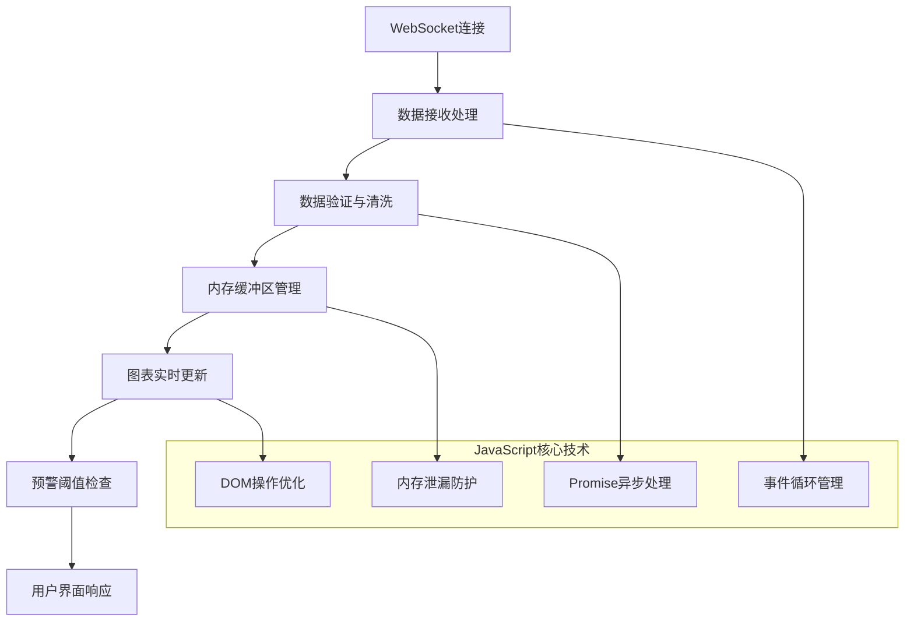

# 第二节 JavaScript基础

本节介绍JavaScript的基础知识和应用，作为智慧水利平台前端开发的核心脚本语言。JavaScript实现了用户交互、数据处理和动态内容更新，使平台具备实时响应能力和丰富的交互体验。在智慧水利系统中，JavaScript承担着数据可视化、实时监控、用户交互等关键任务，其性能和可靠性直接影响系统的用户体验[^1]。

## 学习目标

通过本节学习，学生应能够：

1. **深入理解JavaScript执行机制**：掌握事件循环、内存管理、垃圾回收等核心概念及其数学模型
2. **精通异步编程模式**：理解Promise、async/await、事件驱动编程在实时数据处理中的应用
3. **熟练应用DOM操作技术**：掌握高效的DOM操作方法和性能优化策略
4. **掌握现代JavaScript特性**：熟悉ES6+语法、模块化开发、函数式编程概念
5. **具备水利数据处理能力**：能够处理时序数据、空间数据、实时流数据
6. **建立JavaScript性能优化思维**：理解内存泄漏、执行时间优化等关键问题

## 4.2.1 JavaScript执行机制数学模型

### 事件循环(Event Loop)算法分析

JavaScript的事件循环机制可以用状态机模型描述：

$$EventLoop = (Q, \Sigma, \delta, q_0, F)$$

其中：
- $Q = \{CallStack, TaskQueue, MicroTaskQueue\}$：状态集合
- $\Sigma = \{Execute, Schedule, Complete\}$：输入事件集合  
- $\delta$：状态转移函数
- $q_0$：初始状态（空调用栈）
- $F$：终止状态集

**执行时间分析**：
设任务队列中有n个宏任务，每个任务包含$m_i$个微任务，则总执行时间：

$$T_{total} = \sum_{i=1}^{n} (T_{macro_i} + \sum_{j=1}^{m_i} T_{micro_{ij}})$$

在水利监测系统中，这个模型帮助我们理解数据更新的优先级和执行顺序：

```javascript
// 水利数据更新的事件循环应用
class WaterDataProcessor {
    constructor() {
        this.updateQueue = [];
        this.isProcessing = false;
    }
    
    // 宏任务：批量数据处理
    scheduleDataUpdate(dataSet) {
        setTimeout(() => {
            this.processBatchData(dataSet);
        }, 0);
    }
    
    // 微任务：紧急数据处理
    scheduleUrgentUpdate(urgentData) {
        Promise.resolve().then(() => {
            this.processUrgentData(urgentData);
        });
    }
    
    processBatchData(dataSet) {
        console.log('处理批量水位数据:', dataSet.length, '条');
        // 批量更新UI
        this.updateWaterLevelChart(dataSet);
    }
    
    processUrgentData(urgentData) {
        console.log('处理紧急预警数据:', urgentData.alertLevel);
        // 立即更新预警显示
        this.showAlert(urgentData);
    }
}
```

### 内存管理与垃圾回收

**垃圾回收算法复杂度分析**：

**标记-清除算法**：
- 时间复杂度：$O(n + r)$，其中n为总对象数，r为可达对象数
- 空间复杂度：$O(n)$

**分代垃圾回收优化**：
设年轻代存活率为$p$，老年代存活率为$q$（通常$p \ll q$），则总的垃圾回收时间：

$$T_{GC} = \alpha \cdot T_{young} \cdot f_{young} + \beta \cdot T_{old} \cdot f_{old}$$

其中$f_{young}$和$f_{old}$分别为年轻代和老年代的回收频率。

**水利应用中的内存管理策略**：

```javascript
class WaterLevelMonitor {
    constructor(maxDataPoints = 1000) {
        this.dataBuffer = new Array(maxDataPoints);
        this.bufferIndex = 0;
        this.listeners = new WeakSet(); // 使用WeakSet避免内存泄漏
        this.chartData = null;
    }
    
    // 循环缓冲区，避免内存无限增长
    addDataPoint(waterLevel, timestamp) {
        const dataPoint = { level: waterLevel, time: timestamp };
        
        // 使用循环缓冲区控制内存使用
        this.dataBuffer[this.bufferIndex] = dataPoint;
        this.bufferIndex = (this.bufferIndex + 1) % this.dataBuffer.length;
        
        // 使用requestIdleCallback在浏览器空闲时更新图表
        this.scheduleChartUpdate();
    }
    
    scheduleChartUpdate() {
        if (this.updateScheduled) return;
        
        this.updateScheduled = true;
        requestIdleCallback((deadline) => {
            if (deadline.timeRemaining() > 10) { // 至少10ms空闲时间
                this.updateChart();
            }
            this.updateScheduled = false;
        });
    }
    
    // 清理资源，防止内存泄漏
    destroy() {
        this.dataBuffer = null;
        this.listeners.clear();
        if (this.chartData) {
            this.chartData = null;
        }
    }
}
```

## 4.2.3 异步操作

### 什么是异步？

异步就是"不等待"。比如从服务器获取水位数据时，不需要停下来等待，可以继续做其他事情。

### 使用Promise

```javascript
class WaterDataFetcher {
    constructor() {
        this.apiEndpoints = [
            '/api/water-level',
            '/api/flow-rate', 
            '/api/weather-data',
            '/api/alert-status'
        ];
    }
    
    // 串行数据获取 - 适用于有依赖关系的数据
    async fetchDataSequential(stationId) {
        try {
            const waterLevel = await this.fetchWaterLevel(stationId);
            const flowRate = await this.fetchFlowRate(stationId, waterLevel);
            const weatherData = await this.fetchWeatherData(stationId);
            
            return this.combineData({ waterLevel, flowRate, weatherData });
        } catch (error) {
            console.error('串行数据获取失败:', error);
            throw error;
        }
    }
    
    // 并行数据获取 - 适用于独立数据源
    async fetchDataParallel(stationId) {
        try {
            const [waterLevel, flowRate, weatherData, alertStatus] = 
                await Promise.all([
                    this.fetchWaterLevel(stationId),
                    this.fetchFlowRate(stationId),
                    this.fetchWeatherData(stationId),
                    this.fetchAlertStatus(stationId)
                ]);
                
            return this.combineData({ waterLevel, flowRate, weatherData, alertStatus });
        } catch (error) {
            console.error('并行数据获取失败:', error);
            // 使用Promise.allSettled获取部分成功的结果
            return this.fetchDataWithFallback(stationId);
        }
    }
    
    // 容错处理 - 部分失败时的降级方案
    async fetchDataWithFallback(stationId) {
        const results = await Promise.allSettled([
            this.fetchWaterLevel(stationId),
            this.fetchFlowRate(stationId),
            this.fetchWeatherData(stationId),
            this.fetchAlertStatus(stationId)
        ]);
        
        const successfulData = {};
        results.forEach((result, index) => {
            if (result.status === 'fulfilled') {
                const dataType = ['waterLevel', 'flowRate', 'weatherData', 'alertStatus'][index];
                successfulData[dataType] = result.value;
            }
        });
        
        return this.combineData(successfulData);
    }
}
```

[^1]: Simpson K. You Don't Know JS: Async & Performance[M]. Sebastopol: O'Reilly Media, 2015.

## 本节目录

1. [JavaScript基础概念](section04-02-01.md) - 介绍JavaScript的起源、特点及其在现代Web应用和智慧水利平台中的角色
2. [JavaScript核心语法与对象](section04-02-02.md) - 详解JavaScript语法、数据类型、函数、对象及面向对象编程
3. [DOM操作与事件处理](section04-02-03.md) - 讲解文档对象模型操作和响应用户交互的事件机制
4. [现代JavaScript特性](section04-02-04.md) - 介绍ES6+的新特性、模块化开发和异步编程模式
5. [JavaScript在智慧水利平台中的应用](section04-02-05.md) - 展示JavaScript在数据可视化、地图集成、表单处理和实时通信中的应用
6. [JavaScript最佳实践](section04-02-06.md) - 探讨代码组织、性能优化、安全考量和智慧水利平台特定的开发规范

## 4.2.2 水利数据处理实践案例

### 实时水位监控系统

**技术架构图**：



**完整实现代码**：

```javascript
/**
 * 智慧水利实时监控系统
 * 支持多站点水位数据的实时接收、处理和展示
 */
class WaterLevelRealTimeMonitor {
    constructor(options = {}) {
        this.config = {
            maxDataPoints: options.maxDataPoints || 1000,
            updateInterval: options.updateInterval || 1000,
            alertThresholds: options.alertThresholds || {
                warning: 15.0,
                danger: 17.0,
                emergency: 19.0
            },
            websocketUrl: options.websocketUrl || 'ws://localhost:8080/water-data',
            ...options
        };
        
        this.stations = new Map();
        this.websocket = null;
        this.isConnected = false;
        this.reconnectAttempts = 0;
        this.maxReconnectAttempts = 5;
        
        this.init();
    }
    
    /**
     * 初始化监控系统
     */
    async init() {
        try {
            await this.connectWebSocket();
            this.setupEventHandlers();
            this.startPerformanceMonitoring();
            console.log('水位监控系统初始化完成');
        } catch (error) {
            console.error('系统初始化失败:', error);
            this.handleInitError(error);
        }
    }
    
    /**
     * WebSocket连接管理
     */
    connectWebSocket() {
        return new Promise((resolve, reject) => {
            try {
                this.websocket = new WebSocket(this.config.websocketUrl);
                
                this.websocket.onopen = () => {
                    console.log('WebSocket连接已建立');
                    this.isConnected = true;
                    this.reconnectAttempts = 0;
                    resolve();
                };
                
                this.websocket.onmessage = (event) => {
                    this.handleIncomingData(event.data);
                };
                
                this.websocket.onerror = (error) => {
                    console.error('WebSocket连接错误:', error);
                    this.isConnected = false;
                    reject(error);
                };
                
                this.websocket.onclose = () => {
                    console.log('WebSocket连接已关闭');
                    this.isConnected = false;
                    this.attemptReconnect();
                };
                
            } catch (error) {
                reject(error);
            }
        });
    }
    
    /**
     * 数据接收和处理
     */
    handleIncomingData(rawData) {
        try {
            const data = JSON.parse(rawData);
            
            // 数据验证
            if (!this.validateDataStructure(data)) {
                console.warn('接收到无效数据格式:', data);
                return;
            }
            
            // 异步处理数据，避免阻塞主线程
            requestIdleCallback((deadline) => {
                if (deadline.timeRemaining() > 5) {
                    this.processWaterLevelData(data);
                } else {
                    // 如果没有足够时间，推迟到下一个空闲期
                    setTimeout(() => this.processWaterLevelData(data), 0);
                }
            });
            
        } catch (error) {
            console.error('数据处理失败:', error);
        }
    }
    
    /**
     * 水位数据处理核心逻辑
     */
    async processWaterLevelData(data) {
        const { stationId, waterLevel, timestamp, quality } = data;
        
        // 获取或创建监测站对象
        let station = this.stations.get(stationId);
        if (!station) {
            station = this.createStationMonitor(stationId);
            this.stations.set(stationId, station);
        }
        
        // 数据质量检查
        const processedData = await this.qualityControl(data);
        
        // 添加到缓冲区
        station.addDataPoint(processedData);
        
        // 检查预警条件
        this.checkAlertConditions(stationId, processedData);
        
        // 更新UI显示
        this.updateStationDisplay(stationId, processedData);
    }
    
    /**
     * 数据质量控制
     */
    async qualityControl(data) {
        return new Promise((resolve) => {
            const { waterLevel, timestamp } = data;
            
            // 范围检查
            if (waterLevel < -10 || waterLevel > 50) {
                console.warn('水位数据超出合理范围:', waterLevel);
                data.quality = 'suspect';
            }
            
            // 变化率检查（防止异常跳变）
            const station = this.stations.get(data.stationId);
            if (station && station.lastValidData) {
                const timeDiff = timestamp - station.lastValidData.timestamp;
                const levelDiff = Math.abs(waterLevel - station.lastValidData.waterLevel);
                const changeRate = levelDiff / (timeDiff / 1000 / 60); // m/min
                
                if (changeRate > 0.5) { // 超过0.5m/min认为异常
                    console.warn('水位变化率异常:', changeRate, 'm/min');
                    data.quality = 'suspect';
                }
            }
            
            // 时间戳有效性检查
            const now = Date.now();
            if (Math.abs(timestamp - now) > 300000) { // 超过5分钟
                console.warn('数据时间戳异常:', new Date(timestamp));
                data.quality = 'delayed';
            }
            
            resolve(data);
        });
    }
    
    /**
     * 预警条件检查
     */
    checkAlertConditions(stationId, data) {
        const { waterLevel } = data;
        const thresholds = this.config.alertThresholds;
        
        let alertLevel = null;
        
        if (waterLevel >= thresholds.emergency) {
            alertLevel = 'emergency';
        } else if (waterLevel >= thresholds.danger) {
            alertLevel = 'danger';
        } else if (waterLevel >= thresholds.warning) {
            alertLevel = 'warning';
        }
        
        if (alertLevel) {
            this.triggerAlert(stationId, waterLevel, alertLevel);
        }
    }
    
    /**
     * 触发预警
     */
    triggerAlert(stationId, waterLevel, alertLevel) {
        const alertData = {
            stationId,
            waterLevel,
            alertLevel,
            timestamp: Date.now(),
            message: this.generateAlertMessage(stationId, waterLevel, alertLevel)
        };
        
        // 使用微任务确保预警信息优先处理
        Promise.resolve().then(() => {
            this.displayAlert(alertData);
            this.logAlert(alertData);
            
            // 如果是紧急预警，可能需要调用外部API
            if (alertLevel === 'emergency') {
                this.notifyEmergencyServices(alertData);
            }
        });
    }
    
    /**
     * 创建监测站监控对象
     */
    createStationMonitor(stationId) {
        return {
            stationId,
            dataBuffer: [],
            maxBufferSize: this.config.maxDataPoints,
            lastValidData: null,
            chart: null,
            domElement: null,
            
            addDataPoint(data) {
                // 循环缓冲区实现
                if (this.dataBuffer.length >= this.maxBufferSize) {
                    this.dataBuffer.shift(); // 移除最老的数据
                }
                
                this.dataBuffer.push(data);
                
                if (data.quality !== 'suspect') {
                    this.lastValidData = data;
                }
            },
            
            getRecentData(minutes = 60) {
                const cutoffTime = Date.now() - (minutes * 60 * 1000);
                return this.dataBuffer.filter(data => data.timestamp > cutoffTime);
            }
        };
    }
    
    /**
     * 性能监控
     */
    startPerformanceMonitoring() {
        setInterval(() => {
            const memoryInfo = performance.memory;
            const dataPointsCount = Array.from(this.stations.values())
                .reduce((total, station) => total + station.dataBuffer.length, 0);
            
            console.log('性能监控:', {
                内存使用: Math.round(memoryInfo.usedJSHeapSize / 1024 / 1024) + 'MB',
                数据点总数: dataPointsCount,
                活跃站点: this.stations.size,
                连接状态: this.isConnected ? '正常' : '断开'
            });
            
            // 内存使用过高时清理数据
            if (memoryInfo.usedJSHeapSize > 100 * 1024 * 1024) { // 100MB
                this.performMemoryCleanup();
            }
        }, 30000); // 每30秒监控一次
    }
    
    /**
     * 内存清理
     */
    performMemoryCleanup() {
        console.log('开始内存清理...');
        
        for (const station of this.stations.values()) {
            // 只保留最近1小时的数据
            const recentData = station.getRecentData(60);
            station.dataBuffer = recentData;
        }
        
        // 手动触发垃圾回收（如果可用）
        if (window.gc && typeof window.gc === 'function') {
            window.gc();
        }
        
        console.log('内存清理完成');
    }
    
    /**
     * 断线重连机制
     */
    attemptReconnect() {
        if (this.reconnectAttempts >= this.maxReconnectAttempts) {
            console.error('WebSocket重连次数已达上限，停止重连');
            this.displayConnectionError();
            return;
        }
        
        this.reconnectAttempts++;
        const delay = Math.min(1000 * Math.pow(2, this.reconnectAttempts), 30000); // 指数退避，最大30秒
        
        console.log(`${delay}ms后尝试第${this.reconnectAttempts}次重连...`);
        
        setTimeout(async () => {
            try {
                await this.connectWebSocket();
                console.log('WebSocket重连成功');
            } catch (error) {
                console.error('WebSocket重连失败:', error);
                this.attemptReconnect();
            }
        }, delay);
    }
    
    /**
     * 销毁监控系统，清理所有资源
     */
    destroy() {
        console.log('正在销毁水位监控系统...');
        
        // 关闭WebSocket连接
        if (this.websocket) {
            this.websocket.close();
            this.websocket = null;
        }
        
        // 清理所有站点数据
        for (const station of this.stations.values()) {
            station.dataBuffer = null;
            if (station.chart) {
                station.chart.destroy();
            }
        }
        
        this.stations.clear();
        console.log('水位监控系统已销毁');
    }
}

// 使用示例
const monitor = new WaterLevelRealTimeMonitor({
    maxDataPoints: 2000,
    updateInterval: 1000,
    alertThresholds: {
        warning: 16.0,
        danger: 18.0,
        emergency: 20.0
    },
    websocketUrl: 'ws://water-monitor.example.com/realtime'
});
```

### DOM操作性能优化实例

**批量DOM操作优化**：

```javascript
class EfficientDOMUpdater {
    constructor() {
        this.pendingUpdates = new Map();
        this.isUpdateScheduled = false;
    }
    
    // 错误做法：每次都直接操作DOM
    updateWaterLevelBad(stationId, waterLevel) {
        const element = document.getElementById(`station-${stationId}`);
        element.textContent = `${waterLevel.toFixed(2)}m`;
        element.className = this.getAlertClass(waterLevel);
        element.style.color = this.getAlertColor(waterLevel);
    }
    
    // 优化做法：批量更新DOM
    updateWaterLevel(stationId, waterLevel) {
        this.pendingUpdates.set(stationId, {
            level: waterLevel,
            className: this.getAlertClass(waterLevel),
            color: this.getAlertColor(waterLevel)
        });
        
        this.scheduleUpdate();
    }
    
    scheduleUpdate() {
        if (this.isUpdateScheduled) return;
        
        this.isUpdateScheduled = true;
        requestAnimationFrame(() => {
            this.flushUpdates();
            this.isUpdateScheduled = false;
        });
    }
    
    flushUpdates() {
        // 使用DocumentFragment减少重排
        const fragment = document.createDocumentFragment();
        
        for (const [stationId, updateData] of this.pendingUpdates) {
            const element = document.getElementById(`station-${stationId}`);
            if (element) {
                element.textContent = `${updateData.level.toFixed(2)}m`;
                element.className = updateData.className;
                element.style.color = updateData.color;
            }
        }
        
        this.pendingUpdates.clear();
    }
}
```

## 重要性与应用

在智慧水利平台的前端开发中，JavaScript是构建交互式用户界面的核心技术。通过JavaScript，可以实现：

**实时数据处理能力**：
- 高效处理每秒数千条的水文监测数据
- 实时计算统计指标（平均值、峰值、变化率等）
- 异常数据检测和质量控制
- 时序数据的滑动窗口分析

**用户交互体验**：
- 响应式的图表缩放、平移、筛选操作
- 智能化的数据查询和过滤功能
- 多点触控支持的移动端操作
- 键盘快捷键和无障碍访问支持

**系统集成能力**：
- WebSocket实现的实时双向通信
- RESTful API的异步数据交换
- WebRTC支持的视频监控集成
- Service Worker实现的离线功能

**性能与可靠性**：
- 内存管理和垃圾回收优化
- DOM操作的批量处理和虚拟化
- 错误处理和自动恢复机制
- 性能监控和诊断工具集成


## 思考题与练习

### 基础题

1. **概念理解题**
   - 解释JavaScript事件循环机制的状态机模型，并分析其在水利数据处理中的应用
   - 说明垃圾回收算法的复杂度差异，给出内存管理优化建议
   - 描述Promise异步编程的数学模型，并解释串行与并行执行的性能区别

2. **计算题**
   - 给定一个包含5000条水位数据的监控系统，计算使用循环缓冲区相比无限数组的内存节省比例
   - 设计一个事件循环调度算法，计算宏任务和微任务的执行时间分配
   - 分析WebSocket连接断线重连的指数退避算法，计算最优重连参数

3. **应用题**
   - 设计一个水质监测数据的异步处理流程，包含数据验证、质量控制和存储
   - 实现一个基于Promise的水文数据批量查询系统，支持超时和重试机制
   - 创建一个内存安全的实时图表组件，处理连续24小时的水位数据更新

### 提高题

4. **系统设计题**
   - 设计一个支持多种传感器数据类型的实时监控系统架构，考虑性能和可扩展性
   - 分析大量DOM操作对水利监控界面的性能影响，提出批量更新优化方案
   - 设计一套水利数据处理的JavaScript工具库，包含统计分析、异常检测等功能

5. **性能优化题**
   - 分析内存泄漏的产生原因，设计水利长期运行系统的内存管理策略
   - 对比requestAnimationFrame和setTimeout在数据可视化中的性能表现
   - 设计Web Worker多线程方案，处理大量水文计算任务

6. **错误处理题**
   - 设计一个容错性强的WebSocket通信机制，处理网络中断和数据丢失
   - 实现一个优雅的错误处理系统，包含错误分类、上报和用户提示
   - 分析JavaScript运行时错误对水利系统的影响，提出监控和恢复方案

### 实践项目

7. **基础项目：水位数据实时图表**
   - 使用Canvas API绘制实时水位曲线图
   - 实现平滑的数据更新动画效果
   - 集成缩放、平移等交互功能
   - 添加多条件数据过滤和导出功能

8. **进阶项目：多站点监测数据处理系统**
   - 设计异步数据获取和处理架构
   - 实现数据质量控制和异常检测算法
   - 集成WebSocket实时通信功能
   - 添加离线数据缓存和同步机制

9. **综合项目：智慧水利移动端监控应用**
   - 构建响应式的移动端监控界面
   - 集成地理位置API和传感器数据
   - 实现离线模式和数据同步功能
   - 优化电池使用和网络流量消耗

### 算法实现题

10. **数据结构与算法**
    - 实现一个时间复杂度为O(log n)的水位数据二分查找算法
    - 设计滑动窗口算法，计算水文数据的移动平均值和趋势分析
    - 实现基于优先队列的实时数据排序和Top-K查询

11. **数学建模**
    - 使用JavaScript实现水文统计分析函数（均值、方差、相关系数等）
    - 设计插值算法，处理传感器数据的缺失值问题
    - 实现简单的机器学习算法，进行水位预测和异常检测

### 讨论题

12. **技术发展趋势**
    - 讨论WebAssembly在水利数据处理中的应用前景和性能提升潜力
    - 分析ES2023新特性对前端开发的影响和在水利系统中的应用价值
    - 探讨Service Worker技术在离线水利应用中的实现方案

13. **行业应用场景**
    - 分析不同类型水利工程对JavaScript性能的差异化需求
    - 讨论极端环境下（如洪涝灾害）系统可靠性保障措施
    - 探索边缘计算与JavaScript技术结合在水利物联网中的应用

14. **工程实践**
    - 讨论大型水利项目中JavaScript代码的组织和模块化策略
    - 分析多团队协作下的代码规范和质量保证方法
    - 探讨自动化测试在JavaScript水利应用开发中的最佳实践

## 本节小结

### 核心知识点总结

本节深入探讨了JavaScript在智慧水利平台开发中的核心应用，建立了完整的理论体系和实践框架：

**理论基础**：
1. **JavaScript执行机制**：掌握了事件循环的状态机模型，理解了$O(n + r)$复杂度的垃圾回收算法，建立了异步编程的数学建模思维
2. **内存管理理论**：学会了循环缓冲区设计、WeakSet/WeakMap应用等内存优化策略，理解了分代垃圾回收的$T_{GC}$计算模型
3. **异步编程模型**：深入理解了Promise链的串行($\sum t_i$)与并行($\max t_i$)执行模式，掌握了容错处理和优雅降级机制

**实践技能**：
1. **实时数据处理**：能够设计高效的WebSocket通信架构，实现毫秒级数据更新和质量控制算法
2. **性能优化技术**：掌握DOM批量操作、requestIdleCallback调度、GPU加速等关键优化方法
3. **错误处理机制**：建立了完善的异常捕获、断线重连、内存泄漏防护体系
4. **数据可视化能力**：能够处理大规模时序数据的实时渲染和交互操作

**水利应用特色**：
- 多站点监测数据的并发处理和统一管理
- 传感器数据的质量控制和异常检测算法
- 实时预警系统的事件驱动架构设计
- 移动端水利巡检应用的离线同步机制

### 技术发展展望

**语言特性演进**：
- ES2023/2024新特性在水利系统中的应用前景
- WebAssembly与JavaScript协作的高性能计算方案
- TypeScript类型系统在大型水利项目中的价值提升

**运行时性能优化**：
- V8引擎的持续优化对水利应用性能的推动作用
- Web Workers和SharedArrayBuffer在多线程计算中的应用扩展
- Service Worker技术在离线优先架构中的创新实践

**生态系统发展**：
- Node.js在水利数据处理服务端的扩展应用
- 现代构建工具(Vite、esbuild)对开发效率的持续提升
- 新兴框架和库在水利可视化领域的应用探索

### 学习成果检验

通过本节学习，学生应具备：

**基础编程能力**：
- 熟练掌握JavaScript核心语法和ES6+现代特性
- 理解异步编程模式和Promise/async-await使用方法
- 具备DOM操作和事件处理的最佳实践知识
- 掌握调试技巧和性能分析方法

**水利应用开发能力**：
- 能够设计和实现实时水利监测数据处理系统
- 掌握WebSocket等实时通信技术的工程应用
- 具备处理大量地理空间数据的技术能力
- 理解水利业务场景下的性能和可靠性要求

**工程实践素养**：
- 建立代码质量管理和性能优化的系统思维
- 具备团队协作中的代码规范意识
- 掌握测试驱动开发的基本方法
- 理解持续集成和部署的工程流程

### 后续章节预览

本节建立的JavaScript技术基础将在后续章节中得到深入应用：
- 第三节将学习Vue.js框架，利用JavaScript进行组件化开发
- 第四节将结合JavaScript技术设计水利平台的交互界面
- 第五节将使用JavaScript构建工程化的开发工具链
- 后续章节将在更复杂的系统架构中应用JavaScript技术

**重要提醒**：JavaScript作为前端开发的核心语言，其掌握程度直接影响后续学习效果。建议学生：
1. 多进行实际编码练习，熟悉语言特性和常见模式
2. 关注新版本特性发展，保持技术敏感度
3. 结合水利业务场景思考技术应用，提升解决实际问题的能力
4. 建立良好的代码组织和文档习惯，为团队协作做准备
