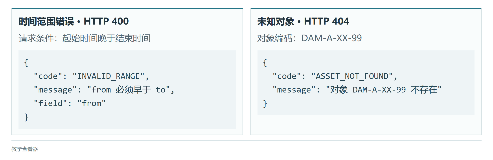
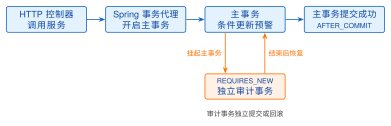
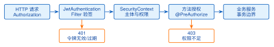
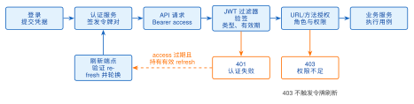

# 第5章 后端开发技术

**学习目标**

通过本章学习，学生应能够：

1.  说明智慧水利后端的职责，设计符合HTTP语义的RESTful API；

2.  使用Spring Boot组织配置、依赖注入、控制器与服务；

3.  使用Jakarta Persistence完成实体映射、Repository访问和事务处理；

4.  使用Spring Security 6与JWT实现基本认证和授权；

5.  区分进程内事件与跨服务消息，并使用消息队列实现可靠解耦；

6.  通过缓存、分页、日志与指标改善服务性能和可运维性。

**引言**

智慧水利后端负责接入监测数据、执行业务规则、维护一致性并向前端提供接口。本章统一采用Java 17、Spring Boot 3.2+、Spring Security 6、Jakarta Persistence 3.1与Jakarta Servlet 6.x；JWT示例按jjwt 0.11.x接口编写。框架配置、注解语义与版本迁移细节可查阅对应版本的官方参考文档<sup>[[32]](../../references.md#ref32)[[33]](../../references.md#ref33)[[34]](../../references.md#ref34)</sup>；运行示例时应先核对 Java、依赖与容器版本。分布式事务和领域驱动设计作为选学内容，不作为首次后端课程的前置要求。本章延续第3章的架构决策：模块化单体内部按控制器、服务、数据访问分层，观测写入经Kafka削峰后进入TimescaleDB；案例水库峰值每秒10条观测、50并发查询的负载数字，是本章连接池、缓存与分页设计的直接依据。

!!! tip "提示"

    **工程版本线：v1（前端只读切片） $\rightarrow$ v2（认证与观测API）**

    起点是第4章交付的 v1 前端。本章结束时你应交付 **v2**：为 v1 提供真实数据的后端——登录签发 JWT、受保护的测点与观测查询、事务与幂等写入——对应仓库 `backend/` 的 `JwtService`、`JwtAuthenticationFilter`、`SecurityConfig`、`AuthController`、`AssetController`、`ReadingService`；验证命令 `mvn test`，联调后前端 401 分流与登录回跳应全部生效。

## 5.1 后端服务与REST接口概述

**本节层次**

核心。

**进入本节所需知识**

会写 Java 类、方法、`List`与`try/catch`。没有接触过 Maven、注解和数据库表的读者，先读附录B的 P2 单元（工程目录、Maven、注解与依赖注入）和 P3 单元（表、键、SQL 与事务），并完成两个单元的自测。

第4章的页面向`/api/assets`发出请求，拿到一段 JSON，再把它画成列表。应答这个请求的程序就是后端。它要做的事情比“返回数据”多：确认请求者是谁、有没有权限，检查参数是否合理，按业务规则读写数据库，留下审计记录，有时还要通知别的系统。本节先说明一次请求在后端经过哪些环节，以及 HTTP 用什么方式表达“要做什么”和“结果如何”。从5.2节起动手写程序，顺序是：先让一个 Java 方法返回固定数据，再处理路径参数和查询参数，然后把固定数据换成数据库查询（5.4.1节），最后把一个类拆成控制器、服务和数据访问三层（5.4.2节）。分层放在最后，是因为只有写过“全都挤在一个类里”的版本，才看得出每一层替你解决了什么麻烦。

### 5.1.1 一次请求经过的环节

以值班员查看渗压计 PZ-07 的最新观测为例。浏览器发出`GET /api/assets/``DAM-A-PZ-07/``readings/latest`，后端应答如下：

**清单 5.1  最新观测接口的一次应答（状态码 200）**

```json
{
  "assetId": "DAM-A-PZ-07",
  "occurredAt": "2026-07-01T23:55:00+08:00",
  "value": 185.091,
  "unit": "kPa",
  "quality": "valid",
  "eventId": "evt-pz-0287-6",
  "version": 1
}
```

清单5.1的七个字段来自表8.3的约定，每一个都对应水利观测数据的一项含义。`value`必须和`unit`一起读，185.091 是千帕还是米水头，差着一个数量级；`occurredAt`是仪器采样的时刻，带着时区偏移，它和服务器收到数据的时刻可能相差几分钟甚至几小时（补传）；`quality`是质量码，取`valid`、`suspect`或`missing`，后两种观测不能直接拿去判断预警；`eventId`标识这一次上报，重复收到时靠它识别；`version`从1开始，人工订正一次加1，原值保留。后端程序的很大一部分工作，就是保证这些含义在读写过程中不走样。

图5.1画出这次请求在后端内部走过的路。控制器（Controller）面对 HTTP：从路径里取出`DAM-A-PZ-07`，把返回的对象转成 JSON，决定状态码。应用服务（Service）面对业务：这个对象存在吗，最新观测是哪一条，没有观测算不算错误。Repository（数据访问层，专门负责查库和存库的那部分代码）面对数据库：把“某对象最新的一条观测”变成一条 SQL。数据库保存数据，并用主键、外键和检查约束拒绝不合规则的写入。调用自左向右，结果自右向左逐层返回；每一层只和相邻的层打交道，控制器里不拼 SQL，Repository 里不判断预警。

<figure markdown>

<figcaption>图 5.1  一次请求在后端经过的环节</figcaption>
</figure>

这四个环节不必一开始就写全。5.2节的程序只有控制器一层，数据直接写在代码里；5.4.1节接上 Repository 和数据库；5.4.2节再把业务判断移进服务层。设备协议（Modbus、MQTT 等）的接入属于边缘网关的职责，本章的后端从“网关已经把观测整理成 JSON 或消息”之后讲起。

### 5.1.2 用 HTTP 表达动作和结果

HTTP 请求的第一行由**方法**和**路径**组成。路径指明操作的对象，用名词；方法指明动作。表5.1列出五种常用方法。

**表 5.1  REST接口常用HTTP方法**

| 方法   | 典型语义           | 水利示例           | 是否幂等           |
|:-------|:-------------------|:-------------------|:-------------------|
| GET    | 查询资源           | 查询测站最新水位   | 是                 |
| POST   | 创建资源或触发命令 | 创建告警处置单     | 否（需业务幂等键） |
| PUT    | 整体替换资源       | 更新测站完整配置   | 是                 |
| PATCH  | 局部修改资源       | 修改告警状态       | 取决于操作定义     |
| DELETE | 删除资源           | 删除尚未发布的规则 | 是                 |

表5.1最后一列的**幂等**，指同一个请求重复执行多次，资源最终的状态与执行一次相同。查询天然幂等；“把告警状态改为已确认”执行两次，结果仍是已确认；而`POST`创建处置单，执行两次就会出现两张单。值班员在弱网下重复点击“提交处置”，或者网关超时后重发观测，都会造成重复请求，所以写入接口必须约定怎样识别重复。具体做法是给每次上报带一个唯一编号，并让数据库拒绝重复的编号，5.5节讨论；本章前几节只涉及查询。

路径按资源的层级来写。在案例平台里，测点等工程对象是稳定的资源（`/api/assets`）；观测是挂在对象下面、按时间不断追加的子资源（`/api/assets/DAM-A-PZ-07/readings`）；预警和工单是带状态流转的业务资源。“要哪一段时间”“按什么排序”这类条件不属于层级，放进查询参数：`?from=...&to=...`。只有当一个业务动作无法表达成“修改某个资源的状态”时，才在路径里用动词，例如表8.3中确认预警的`POST /api/warnings/w-0001/ack`。

应答的第一行是**状态码**，调用方不必解析响应体就能知道结果属于哪一类。本章用到的有：200 成功并带响应体；201 创建成功；204 成功但没有内容；400 请求参数有误；401 没有提供有效身份；403 身份有效但无权操作；404 资源不存在；409 与资源当前状态冲突；500 服务器内部错误。对监测平台来说，204 与 404 的区别值得专门记住：请求`DAM-A-D-01`的最新观测，如果这支位移计已经登记但还没有上报过数据，应答是 204，页面显示“暂无观测”；如果编码打错成`DAM-A-XX-99`，平台里根本没有这个对象，应答才是 404。两种情况若都返回 404，值班员就无法区分“仪器还没数据”和“我输错了编码”。表8.3对每个接口都写明了这类约定，后面各节的程序以它为准。

## 5.2 第一个 HTTP 接口：从固定数据到契约

**本节层次**

核心：5.2.1、5.2.2、5.2.3。

**进入本节所需知识**

5.1节；附录B的 P2 单元，并按其中的说明装好 Java 17 与 Maven；表8.3的前四行；能用浏览器地址栏或`curl`发一个 GET 请求。

**业务问题**

第4章的页面一直对着教学接口开发。现在要让`GET /api/assets`由自己写的 Java 程序应答，而且沿用页面已经使用的字段和响应格式。先返回固定的对象列表，观察 Java 方法怎样与 HTTP 路径对应；再处理路径参数与查询参数，把错误应答做成契约规定的样子；最后用契约核对脚本检查它。数据库到5.4节才接入。

### 5.2.1 返回固定数据的接口

清单5.2是完整的一个类。三个注解各管一件事：`@RestController`告诉框架这个类的方法返回 JSON；`@RequestMapping`给出公共前缀；`@GetMapping`把一个方法绑到一条路径上。方法体里没有任何 Web 代码——它只是返回一个`List`，框架负责把它序列化成 JSON 并加上状态码 200。四个测点的编码与名称取自表8.1的测点设定，单位与数据集一致。

**清单 5.2  AssetController：返回写死的对象列表**

```java
package edu.example.qingyuan;

import java.util.List;
import org.springframework.web.bind.annotation.GetMapping;
import org.springframework.web.bind.annotation.RequestMapping;
import org.springframework.web.bind.annotation.RestController;

@RestController
@RequestMapping("/api/assets")
public class AssetController {
    /** 与 8.1 节契约表同名的字段；record 自动生成构造器与访问方法 */
    public record AssetDto(String assetId, String displayName,
                           String assetType, String unit) {}

    private static final List<AssetDto> FIXED = List.of(
        new AssetDto("DAM-A-PZ-07", "案例渗压07", "渗压", "kPa"),
        new AssetDto("DAM-A-WL-01", "案例库水位01", "库水位", "m"),
        new AssetDto("DAM-A-D-01", "案例位移01", "位移", "mm"),
        new AssetDto("DAM-A-RF-01", "案例雨量01", "雨量", "mm"));

    @GetMapping                      // GET /api/assets
    public List<AssetDto> assets() {
        return FIXED;
    }
}
```

**运行与观察**

在配套工程`backend`目录启动独立的5.2节入口：执行`mvn spring-boot:run`并附加参数`-Dspring-boot.run.main-class=``edu.example.lesson52.``Lesson52Application`。控制台出现`Tomcat started on port 8080`后，浏览器打开`http://localhost:8080/api/assets`，应看到四个对象的 JSON 数组。教学接口须先停止，以免端口冲突。这个起点尚未提供登录；先通过浏览器和契约脚本观察结果，完成5.6节认证后的 S3 终点再接入带登录的 S2 页面。表5.2列出本阶段可验证的行为。

**表 5.2  清单5.2的预期运行记录**

| 操作                              | 状态码 | 观察                                                          |
|:----------------------------------|:-------|:--------------------------------------------------------------|
| 浏览器打开 /api/assets            | 200    | 四元素 JSON 数组；字段名与契约一致（assetId 而不是 asset_id） |
| 浏览器打开 /api/asset（少一个 s） | 404    | Spring 通用路由错误；与业务对象不存在的契约错误分别观察       |
| 经 Vite 代理访问 /api/assets      | 200    | 打开5173端口的同一路径可见四个对象；此项只验证代理与列表接口  |
| 先启动教学接口再启动本工程        | —      | 启动失败，日志含 `Port 8080 was already in use`               |

### 5.2.2 路径参数、查询参数与错误体

契约的第三、四行需要两样东西：路径里的对象编码（`/api/assets/``{assetId}/``readings/latest`）和查询串里的时间范围（`?from=…&to=…`）。清单5.3在同一个控制器里加两个方法。`@PathVariable`把路径片段绑定到参数，`@RequestParam`把查询参数绑定到参数并自动转换类型；找不到对象时，按契约返回 404 与`{code, message}`。这里用异常类和`@ExceptionHandler`把“业务上的找不到”翻译成 HTTP 的 404；5.5 节把它扩展成全局统一的错误响应。

**清单 5.3  路径参数、查询参数与契约错误体**

```java
import java.time.OffsetDateTime;
import java.util.Map;
import org.springframework.http.HttpStatus;
import org.springframework.http.ResponseEntity;
import org.springframework.web.bind.annotation.*;

// —— 放在 AssetController 里 ——
public record ReadingDto(String assetId, OffsetDateTime occurredAt, Double value,
                         String unit, String quality, String eventId, int version) {}

@GetMapping("/{assetId}/readings/latest")
public ResponseEntity<ReadingDto> latest(@PathVariable String assetId) {
    AssetDto asset = FIXED.stream().filter(a -> a.assetId().equals(assetId))
        .findFirst().orElseThrow(() -> new NotFound("ASSET_NOT_FOUND", "对象 " + assetId + " 不存在"));
    if (!asset.assetId().equals("DAM-A-PZ-07")) return ResponseEntity.noContent().build(); // 契约：无观测 204
    return ResponseEntity.ok(new ReadingDto(asset.assetId(),
        OffsetDateTime.parse("2026-07-01T23:55:00+08:00"), 185.091, "kPa", "valid", "evt-pz-0287-6", 1));
}

@GetMapping("/{assetId}/readings")
public List<ReadingDto> readings(@PathVariable String assetId,
                                 @RequestParam OffsetDateTime from,
                                 @RequestParam OffsetDateTime to) {
    if (!from.isBefore(to)) throw new BadRequest("INVALID_RANGE", "from 必须早于 to", "from");
    return List.of();   // 5.4 节改为查数据库
}

// —— 两个最小异常与它们到 HTTP 的翻译 ——
static class NotFound extends RuntimeException {
    final String code; NotFound(String code, String msg) { super(msg); this.code = code; }
}
static class BadRequest extends RuntimeException {
    final String code, field;
    BadRequest(String code, String msg, String field) { super(msg); this.code = code; this.field = field; }
}
@ExceptionHandler(NotFound.class)
ResponseEntity<Map<String, String>> notFound(NotFound e) {
    return ResponseEntity.status(HttpStatus.NOT_FOUND).body(Map.of("code", e.code, "message", e.getMessage()));
}
@ExceptionHandler(BadRequest.class)
ResponseEntity<Map<String, String>> badRequest(BadRequest e) {
    return ResponseEntity.badRequest().body(Map.of("code", e.code, "message", e.getMessage(), "field", e.field));
}
```

**读懂清单里的 Java 写法**

清单5.3的`latest`方法里有一条很长的链式调用，没有学过 Java 8 以后写法的读者可以把它读成一个循环。`FIXED.stream()`把列表变成可以逐个处理的序列；`filter(a -> a.assetId().equals(assetId))`只留下编码相符的元素，其中`a -> ...`是 lambda 表达式，即一个没有名字的函数，箭头左边的`a`是参数，右边是函数体；`findFirst()`取第一个，结果类型是`Optional<AssetDto>`——一个“可能有值、也可能为空”的盒子，用来代替容易被忘记检查的`null`；`orElseThrow(...)`表示盒子里有值就取出来，空就抛出异常；括号里的`() -> new NotFound(...)`是一个没有参数的 lambda，只有盒子为空时才执行它、创建异常。整条链与清单5.4的循环等价：

**清单 5.4  与 stream 链式调用等价的循环写法**

```java
AssetDto asset = null;
for (AssetDto a : FIXED) {
    if (a.assetId().equals(assetId)) { asset = a; break; }
}
if (asset == null) {
    throw new NotFound("ASSET_NOT_FOUND", "对象 " + assetId + " 不存在");
}
```

两种写法都可以用。本书后面的清单采用链式写法，是因为 Spring Data 的查询方法本来就返回`Optional`和`List`，链式调用可以直接接上去。另外两处语法：`record`是 Java 16 起提供的不可变数据类（本书用 Java 17），`a.assetId()`是它自动生成的访问方法，没有`get`前缀；`static class NotFound extends RuntimeException`定义了一个不需要在方法签名上声明的异常，抛出后由下面标了`@ExceptionHandler`的方法接住。

**一个会遇到的失败**

`from=2026-07-01T00:00:00+08:00`直接放进地址栏，浏览器原样发出加号，而服务端按 URL 的规则把查询串里的加号解码成空格，时间解析失败，应答 400；错误体却不是契约格式，而是 Spring 默认的错误信息。原因是类型转换失败发生在进入方法之前，`@ExceptionHandler(BadRequest.class)`接不到它。两件事要做：客户端把`+`编码成`%2B`（第4章的`URLSearchParams`会自动做）；服务端在 5.5 节用`@ControllerAdvice`接住`MethodArgumentTypeMismatchException`，统一翻译成契约错误体。复现时分别观察参数转换前后发生的错误，确认类型转换异常与业务异常都返回约定的错误体。

图5.2是配套教学接口的两个错误响应。时间区间非法与对象不存在使用不同`code`；`field`只在需要指出具体输入项时出现。开发Java接口时，用相同请求核对这些字段。

<figure markdown>

<figcaption>图 5.2  400与404错误体的实际响应（教学查看器，配套教学接口）</figcaption>
</figure>

### 5.2.3 用第4章的页面和故障表验证接口

写好的接口要对照契约检查，而且不止检查一次。现在这个程序只有固定数据，没有数据库，也没有登录，能检查的是表5.3的四行：固定数据、204、404 和 400 各一例。5.4节接上数据库以后，用同样的请求再查一遍，这时对象和观测来自数据库。5.6节补上认证以后，后端才具备教学接口的全部行为，可以把第4章的 S2 页面接过来，重做表4.9的界面验收。教学接口靠`teach=`参数人为制造故障（表8.4）；真实后端没有这个参数，要用真实的请求去触发：不带令牌、把时间范围写反、请求不存在的对象、请求还没有观测的对象。

**表 5.3  第一个接口的契约核对单**

| 请求                                           | 期望状态 | 期望响应体 / 页面表现                                                          |
|:-----------------------------------------------|:---------|:-------------------------------------------------------------------------------|
| GET /api/assets/DAM-A-PZ-07/readings/latest    | 200      | value 185.091，页面显示“案例渗压07：185.091 kPa”                               |
| GET /api/assets/DAM-A-WL-01/readings/latest    | 204      | 空体；页面显示“暂无观测”而不是报错                                             |
| GET /api/assets/DAM-A-XX-99/readings/latest    | 404      | `{code:"ASSET_NOT_FOUND"}`；页面显示“对象不存在，请返回列表” |
| GET …/readings?from=2026-07-02…&to=2026-07-01… | 400      | `{code:"INVALID_RANGE", field:"from"}`     |

**配套工程中的位置**

清单5.2与清单5.3对应配套目录`backend/src/main/java/edu/example/lesson52/`，是 S3 阶段的起点：一个类，没有数据库，没有认证。它放在独立的包`edu.example.lesson52`里，与完整工程的`edu.example.qingyuan`分开；Spring Boot 从启动类所在的包向下扫描组件，两组控制器若被同一次扫描发现，两个`/api/assets`映射冲突，应用启动即失败。表5.3的四行不必手工逐个点，配套工程的契约核对脚本把它们连同错误体的形状写成了可执行的检查，运行方式见清单5.5：

**清单 5.5  对 5.2 节的程序运行契约核对脚本**

```bash
node teaching-api/contract-check.mjs http://localhost:8080 --stage=lesson52
```

脚本逐项打印通过或失败；失败时按它报告的路径、状态码和字段去核对程序。同一个脚本把`–stage`换成`lesson54`、`full`或`teaching`，分别核对5.4节接了数据库的程序、带认证的完整后端和教学接口，每个阶段只检查该阶段已经实现的行为。

**自测**

（1）把清单5.2中的`@RestController`换成`@Controller`，访问`/api/assets`会发生什么？为什么？（框架把返回值当视图名去找模板，得到 404 或 500；`@RestController` = `@Controller` + `@ResponseBody`。）（2）`latest`方法为什么返回`ResponseEntity`而`assets`方法直接返回`List`？（前者需要区分 200 与 204 两种状态码，后者永远 200。）（3）不看代码，说出契约里“错误体统一为`{code, message, field?}`”在本节由哪两个方法保证，还有哪一类错误它们接不住。

## 5.3 Spring Boot企业级开发基础

**本节层次**

核心：5.3.1、5.3.3；指导实践：5.3.2、5.3.4、5.3.6；拓展：5.3.5。

**进入本节所需知识**

先完成5.2节，能从请求路径找到控制器方法及返回对象。

5.2节的程序只有一个控制器类，却能监听端口、解析路径、输出 JSON，这些事是 Spring Boot 替你做的。本节回答三个问题：这些能力从哪里来（起步依赖与自动配置，5.3.1节）；数据库地址、口令这类随环境变化的值放在哪里（配置文件，5.3.2节）；控制器需要的 Repository 和服务对象由谁创建、怎样交到它手里（依赖注入，5.3.3节）。5.4节接数据库、拆分三层时，这三样都要用到。工程目录的布局见清单5.10。

### 5.3.1 起步依赖与自动配置的边界

起步依赖是一组经过验证的依赖坐标，目的是让项目以一致的版本组合获得 Web、验证、JPA、PostgreSQL 和 Actuator 能力。它不是一个运行时服务，也不会替业务代码决定领域规则；Maven 解析依赖树后，Spring Boot 才根据类路径中的类和配置条件创建自动配置 Bean。排查启动问题时，应先查看依赖树和条件评估报告，再决定是补充依赖、修改配置还是排除某项自动配置。

**清单 5.6  Spring Boot 3.2 起步依赖与版本管理**

```xml
<parent>
  <groupId>org.springframework.boot</groupId>
  <artifactId>spring-boot-starter-parent</artifactId>
  <version>3.2.12</version>
</parent>
<properties>
  <java.version>17</java.version>
</properties>
<dependencies>
  <dependency>
    <groupId>org.springframework.boot</groupId>
    <artifactId>spring-boot-starter-web</artifactId>
  </dependency>
  <dependency>
    <groupId>org.springframework.boot</groupId>
    <artifactId>spring-boot-starter-validation</artifactId>
  </dependency>
  <dependency>
    <groupId>org.springframework.boot</groupId>
    <artifactId>spring-boot-starter-data-jpa</artifactId>
  </dependency>
  <dependency>
    <groupId>org.postgresql</groupId>
    <artifactId>postgresql</artifactId>
    <scope>runtime</scope>
  </dependency>
</dependencies>
```

清单5.6锁定 Java 17 和 Spring Boot 3.2 基线，依赖版本由父 POM 的依赖管理统一维护。PostgreSQL 驱动只在运行时需要，编译阶段依赖 JDBC 抽象；若后续接入 PostGIS 或 TimescaleDB，仍以 PostgreSQL 连接为基础，在数据库迁移脚本中启用扩展。生产项目应提交锁定的 Maven Wrapper 版本，构建机使用`./mvnw`而不是依赖本地 Maven 的偶然版本。

自动配置的关键是条件注解：类路径存在某个类、容器中尚未有同类型 Bean、配置属性满足条件时，配置类才会生效。自定义 Bean 会改变“缺少 Bean”条件的结果，因此添加一个数据源或消息转换器可能使默认配置退让。开发者应把覆盖点写成显式配置，并在启动日志中记录生效的 Profile 和关键连接信息（密码保持隐藏），避免把自动配置当作不可追踪的黑盒。

### 5.3.2 application.yml 与 Profile 多环境

配置文件按环境拆分，公共配置放在`application.yml`，开发、测试和生产差异分别放在`application-development.yml`、`application-test.yml`和`application-production.yml`。启动时使用`SPRING_PROFILES_ACTIVE`选择 Profile，敏感值通过环境变量或密钥管理器注入。Profile 只表达环境差异，不应把业务阈值复制成多套；案例水库的工程参数仍以第8章 8.1 参数表为唯一来源。

**清单 5.7  多环境配置与外部化密钥**

```yaml
# application.yml：所有环境共享的安全默认值
spring:
  application:
    name: water-reading-service
  jpa:
    open-in-view: false
  profiles:
    default: development

# application-development.yml
spring:
  datasource:
    url: ${DB_URL:jdbc:postgresql://localhost:5432/qingyuan}
    username: ${DB_USER:qingyuan_app}
    password: ${DB_PASSWORD:}
security:
  jwt:
    issuer: ${JWT_ISSUER:water-platform-dev}

# application-production.yml
spring:
  config:
    activate:
      on-profile: production
  jpa:
    hibernate:
      ddl-auto: validate
security:
  jwt:
    secret: ${JWT_SECRET_BASE64}
    issuer: ${JWT_ISSUER}
```

清单5.7把生产环境的 JWT 密钥和发行者设为必填外部变量，缺少变量时让应用在启动阶段失败，而不是运行到认证请求才发现`issuer`为空。生产环境使用`ddl-auto: validate`只校验表结构，建表和扩展由版本化迁移脚本完成；开发环境可以使用`update`辅助实验，但不得把它作为生产建表策略。配置审计应检查 Profile 是否被正确激活、数据库 URL 是否指向允许的网络段和日志是否遮蔽密码。

### 5.3.3 依赖注入与 Bean 生命周期

控制反转把对象创建、依赖组装和销毁交给 Spring 容器；依赖注入则描述组件如何获得所需协作者。构造器注入能保证对象创建后依赖完整，字段注入会隐藏依赖并增加测试难度。一个 Bean 通常经历实例化、依赖注入、`@PostConstruct`初始化、投入使用和`@PreDestroy`销毁阶段；连接池、线程池和订阅应在对应生命周期内建立和关闭。

**清单 5.8  构造器注入与 Bean 生命周期**

```java
@Configuration
class WaterInfrastructureConfig {
    @Bean(destroyMethod = "close")
    ScheduledExecutorService refreshExecutor() {
        return Executors.newScheduledThreadPool(2);
    }
}

@Service
class StationRefreshService {
    private final StationRepository repository;
    private final ScheduledExecutorService executor;
    private ScheduledFuture<?> task;

    StationRefreshService(StationRepository repository,
                          ScheduledExecutorService executor) {
        this.repository = repository;
        this.executor = executor;
    }

    @PostConstruct
    void start() {
        task = executor.scheduleAtFixedRate(
                repository::refreshLatest, 0, 30, TimeUnit.SECONDS);
    }

    @PreDestroy
    void stop() {
        if (task != null) task.cancel(true);
    }
}
```

清单5.8展示了基础设施 Bean 与业务服务的依赖方向。调度器由配置类创建并统一销毁，服务只依赖接口和执行器；测试时可以注入假的`StationRepository`和单线程执行器，验证刷新是否按预期发生。定时任务中的异常要被捕获并记录，否则一次未处理异常可能停止后续刷新；任务间隔还要结合数据库连接池容量和监测数据的时效要求确定。

Bean 的作用域也影响生命周期。单例适合无状态服务和连接池，原型适合每次创建独立对象，请求作用域只在 Web 请求中使用。把请求上下文注入单例时，要通过代理或显式参数传递，不能把上一次请求的测站 ID 保存到共享字段。配置属性 record 采用构造器绑定，必须通过`@EnableConfigurationProperties`或`@ConfigurationPropertiesScan`注册；仅在 record 上写注解而没有启用扫描，容器不会创建可注入的`JwtProperties`。

工程目录应与依赖方向一致：`controller`只依赖`service`，`service`依赖领域对象和仓储接口，`repository`适配 PostgreSQL/PostGIS/TimescaleDB，`config`集中放安全、序列化和外部客户端。测试代码按同样的包结构组织，配置文件分为测试 Profile 和生产 Profile，避免在测试中意外连接真实案例水库数据库。

### 5.3.4 自动配置诊断与启动契约

当应用启动失败时，先区分“没有 Bean”“Bean 有多个候选”“配置属性缺失”和“外部依赖不可达”四类原因。开启条件评估报告后，可以看到某个自动配置类为何匹配或未匹配；例如缺少 PostgreSQL 驱动会使数据源自动配置跳过，存在两个相同类型的 Repository 实现会触发歧义。解决问题的顺序应是检查依赖树、读取有效 Profile、核对环境变量、最后才考虑排除自动配置。直接添加随机注解可能掩盖根因，使后续环境再次失败。

启动日志是部署契约的一部分。应用应输出应用名、版本、激活的 Profile、数据库主机（不含密码）、消息主题和健康检查地址；配置值按敏感级别脱敏，JWT 密钥只输出长度或摘要。容器编排系统在收到健康检查前不应把实例加入负载均衡，数据库迁移完成后才允许读取和写入请求。启动阶段如果发现 issuer、数据库 URL 或关键业务参数缺失，应立即失败并给出变量名，而不是使用空字符串继续运行。

配置属性 record 可以集中表达一组强相关参数，并通过 Bean Validation 在启动时校验。发行者不能为空，超时时间必须为正数，数据库连接池大小应有上限。校验失败时应用不会进入可服务状态，运维人员可以在部署日志中定位具体字段。配置对象只负责承载值，密钥轮换、令牌撤销和环境权限仍由安全组件完成，避免把认证逻辑塞进 YAML 解析器。

**清单 5.9  配置属性注册与启动校验**

```java
@ConfigurationProperties(prefix = "security.jwt")
@Validated
public record JwtProperties(
        @NotBlank String secret,
        @NotBlank String issuer,
        @Min(60) @Max(86_400) long accessSeconds,
        @Min(300) @Max(2_592_000) long refreshSeconds) {}

@Configuration
@EnableConfigurationProperties(JwtProperties.class)
class SecurityPropertiesConfig {}
```

清单5.9把配置错误前移到启动阶段，并明确访问令牌和刷新令牌的有效期范围。生产值由密钥管理器注入，配置文件只保留变量占位符；测试可以提供一组短有效期值验证刷新逻辑，但不应把测试密钥复制到生产 Profile。若项目使用`@ConfigurationPropertiesScan`，可以在启动类统一开启扫描；两种注册方式选择其一即可，重复注册会造成 Bean 名称冲突。

### 5.3.5 Bean 作用域、代理与资源释放

单例 Bean 在应用上下文中只有一个实例，适合无状态服务、Repository 和连接池；它的字段必须线程安全，不能保存某个请求的测站 ID 或当前用户。请求作用域 Bean 每次 HTTP 请求创建，适合请求追踪信息；原型 Bean 每次注入时创建，适合短生命周期的可变对象。把请求作用域对象注入单例时，Spring 使用代理延迟解析当前请求，测试时则要显式建立请求上下文。

生命周期回调要与资源类型匹配。数据库连接池和线程池由配置类创建，使用`destroyMethod`或`@PreDestroy`关闭；消息消费者在应用停止时先停止接收，再等待正在处理的消息完成；WebSocket 和定时刷新在组件或服务销毁时取消。若把资源创建写在构造器里而没有对应释放，容器重启和测试重复启动会留下线程、文件句柄或网络连接。

代理机制还影响`@Transactional`、`@Async`和`@Cacheable`。这些注解通过代理拦截外部调用，同类内部使用`this.method()`绕过代理，因此不会获得事务、异步或缓存行为。解决方案是把不同边界拆到另一个 Bean，或在确有必要时使用编程式模板；不要通过反射强行调用代理。代码评审应把注解所在方法的调用路径写进测试，确保“看起来有注解”与“运行时真的生效”一致。

### 5.3.6 工程骨架的测试切片

工程骨架搭好后，应尽早验证各层能否独立启动。`@WebMvcTest`只加载控制器和 MVC 基础设施，适合检查 JSON、状态码和参数校验；`@DataJpaTest`加载实体、Repository 和事务测试数据库，适合验证查询与索引；完整的`@SpringBootTest`才会装配安全、消息和外部客户端。测试 Profile 使用独立数据库或容器，禁止依赖开发机正在运行的 PostgreSQL 实例。

配置测试至少覆盖三种情况：合法 Profile 能启动并读取 issuer；缺少 JWT 密钥时启动失败；生产 Profile 的`ddl-auto`为`validate`且不会自动改表。依赖注入测试用假的 Repository 和时钟替换真实实现，验证刷新任务、超时和资源释放；集成测试再验证真实 PostgreSQL、Redis 或 Kafka 的连接。这样的分层测试能在代码进入控制器之前发现配置绑定和 Bean 生命周期问题。

目录结构还应服务于模块边界。`common`保存跨模块共享的值对象和错误码，模块专用工具保留在各自目录；`api`只放外部 DTO 和客户端契约，`domain`不依赖 Spring Web；数据库迁移文件按版本命名并与发布记录关联。新增预警服务时，先复制边界和测试结构，再决定是否拆分进程，避免目录先于业务边界膨胀。 每个模块还应提供自己的 README，写明启动 Profile、依赖的外部服务、健康检查和测试命令；新成员按文档即可在隔离环境复现启动过程，减少“只在某台机器上可用”的隐性配置。 文档还应列出本地开发所需的端口、初始化命令和清理方式，保证测试结束后不会遗留后台进程。清单5.10给出本章工程的目录布局，可以对照它检查自己的工程：控制器、服务、领域与持久化各占一层，配置和迁移脚本单列。

**清单 5.10  按职责分层的工程目录**

```bash
src/main/java/com/example/water/
  controller/   # HTTP适配
  service/      # 用例与事务边界
  repository/   # 数据访问
  domain/       # 实体和值对象
  config/       # 安全与基础设施配置
src/main/resources/application.yml
```

配置应从代码中分离，并可被环境变量覆盖。密钥不得写入版本库。清单5.11的`application.yml`用`${JWT_SECRET}`这类占位符引用环境变量，仓库里只留变量名和默认的非敏感值。

**清单 5.11  Spring Boot应用入口与JWT配置**

```yaml
spring:
  datasource:
    url: ${DB_URL:jdbc:postgresql://localhost:5432/qingyuan}
    username: ${DB_USER:qingyuan_app}
    password: ${DB_PASSWORD}
security:
  jwt:
    secret: ${JWT_SECRET_BASE64}
    issuer: ${JWT_ISSUER:water-platform}
```

依赖注入优先使用构造器，使依赖明确并便于测试。控制器把DTO交给服务，不直接访问数据库。清单5.12的控制器只有构造器注入的一个服务字段，测试时传入替身即可，不必启动数据库。

**清单 5.12  查询接口控制器**

```java
@RestController
@RequestMapping("/api/assets")
class AssetQueryController {
    private final AssetQueryService queryService;

    AssetQueryController(AssetQueryService queryService) {
        this.queryService = queryService;
    }

    @GetMapping("/{id}/readings/latest")   // 路径见 8.1 节契约表
    ReadingResponse latest(@PathVariable String id) {
        return queryService.latest(id);
    }
}
```

Spring Boot 3使用`jakarta.servlet.*`命名空间。旧项目从`javax.servlet.*`迁移时，应同步检查依赖、过滤器、验证注解和JPA包名。Jakarta Servlet 6.x是本章基线；迁移完成后还应通过编译、集成测试和容器启动检查确认包路径与运行时容器一致。

## 5.4 Jakarta Persistence与事务管理

**本节层次**

核心：5.4.1、5.4.2、5.4.10、5.4.11；指导实践：5.4.3、5.4.5、5.4.6、5.4.7、5.4.14；拓展：5.4.4、5.4.8、5.4.9、5.4.12、5.4.13、5.4.15。初学时读核心四小节即可。

**进入本节所需知识**

先读5.3节核心内容与附录B P3，能解释表、主键、查询和事务。

### 5.4.1 把固定数据换成数据库查询

**业务问题**

5.2节的四个测点写在 Java 代码里。工程上新装一支渗压计，就得改代码、重新编译、重新部署；历史观测的查询也一直返回空列表。测点台账和观测本来就存放在数据库的`asset`和`reading`两张表里（教学用到的列见附录B P3 单元的表B.2，完整表结构见配套工程的`db/001_init.sql`），现在让接口去读这两张表。接口的路径、字段和状态码一律不变，第4章的页面不应察觉数据来源换过。

要补三样东西：一个与`asset`表对应的 Java 类（实体），一个负责查询的接口（Repository），以及数据库的连接配置。

**实体：一行记录对应一个对象**

清单5.13是配套工程的`AssetEntity.java`。`@Entity`声明这个类的对象与数据库表的行对应，`@Table`指出表名，`@Id`标出主键字段。字段名`assetId`与列名`asset_id`的对应不用逐个声明：Spring Boot 默认把驼峰写法的字段名转换成下划线写法的列名。无参构造器留给框架，它从数据库读出一行后，先用无参构造器创建对象再填入各字段；业务代码使用带参数的构造器。实体只有读取方法、没有`set`方法，业务代码拿到对象后无法随手改动它的字段。表里的`geometry`、`elevation_m`等列在实体中没有对应字段，这是允许的：实体只需声明本程序用到的列，空间位置到第6章才用。

**清单 5.13  AssetEntity：与 asset 表对应的实体**

```java
package edu.example.qingyuan;

import jakarta.persistence.Entity;
import jakarta.persistence.Id;
import jakarta.persistence.Table;

@Entity
@Table(name = "asset")
public class AssetEntity {
    @Id private String assetId;
    private String assetType;
    private String displayName;
    private String unit;
    private boolean active = true;
    protected AssetEntity() {}
    public AssetEntity(String assetId, String assetType, String displayName, String unit) {
        this.assetId = assetId; this.assetType = assetType; this.displayName = displayName; this.unit = unit;
    }
    public String getAssetId() { return assetId; }
    public String getAssetType() { return assetType; }
    public String getDisplayName() { return displayName; }
    public String getUnit() { return unit; }
    public boolean isActive() { return active; }
}
```

**Repository：只声明方法，不写实现**

清单5.14是一个接口，全工程找不到它的实现类。应用启动时，Spring Data 读取接口中的方法名，按“`findBy` + 条件 + `OrderBy` + 排序字段”的规则生成查询：`findByActiveTrue``OrderByAssetId`被翻译成一条查询语句，大意是`select ... from asset`` where active = true`` order by asset_id`。继承`JpaRepository<AssetEntity, String>`还带来一批现成的方法，两个类型参数分别是实体类型和主键类型，5.4.2节要用的`existsById`就在其中。方法名里的`Active`、`AssetId`必须与实体字段名对应；拼错了，编译照样通过，错误要到应用启动时才暴露，本小节末尾的故障练习会让你读一次这条错误。

**清单 5.14  AssetRepository：由方法名派生查询**

```java
package edu.example.qingyuan;

import java.util.List;
import org.springframework.data.jpa.repository.JpaRepository;

public interface AssetRepository extends JpaRepository<AssetEntity, String> {
    List<AssetEntity> findByActiveTrueOrderByAssetId();
}
```

**控制器：只改数据来源**

控制器的改动见清单5.15，其余部分与5.2节相同。原来的`FIXED`列表删去，换成一个`AssetRepository`类型的字段。这个字段由构造器参数赋值，而全工程没有哪一行代码调用这个构造器：应用启动时，框架先创建 Repository 的实例，再把它作为参数创建控制器，这就是5.3.3节讲的构造器注入（构造器的第二个参数`ReadingService`在5.4.2节说明）。配套文件里每个接口方法上方还多一行`@PreAuthorize(...)`，那是5.6节的权限声明，启用认证之前不起作用，清单中略去。`AssetDto.from`把实体转换成接口约定的响应对象；`map(AssetDto::from)`中的`AssetDto::from`是方法引用，等价于 lambda 表达式`e -> AssetDto.from(e)`。实体不直接作为响应体返回，原因有两个。第一，表里以后可能增加只供内部使用的列（例如停用原因），它们不应自动出现在接口上。第二，接口字段一旦交给前端使用就不能随便改，而表结构还会调整。DTO（数据传输对象）就是隔在两者之间的一层。

**清单 5.15  AssetController 的改动：注入 Repository，用查询结果替换固定列表**

```java
// —— AssetController.java 中发生变化的部分 ——
    public record AssetDto(String assetId, String displayName, String assetType, String unit) {
        static AssetDto from(AssetEntity e) {
            return new AssetDto(e.getAssetId(), e.getDisplayName(), e.getAssetType(), e.getUnit());
        }
    }

    private final AssetRepository assets;
    private final ReadingService readings;

    public AssetController(AssetRepository assets, ReadingService readings) {
        this.assets = assets; this.readings = readings;
    }
    @GetMapping
    public List<AssetDto> assets() {
        return assets.findByActiveTrueOrderByAssetId().stream().map(AssetDto::from).toList();
    }
```

**连接配置**

数据库在哪里、用什么账号连接，写在`src/main/resources/application.yml`中（清单5.16）。`${DB_URL:jdbc:postgresql://...}`的含义是：有环境变量`DB_URL`就用它，没有就用冒号后面的默认值，同一份配置文件因此可以不加修改地用于本机和容器。DDL 指建表、改表这类语句；`ddl-auto: validate`表示应用启动时只核对实体与表结构、不做改动，对不上就拒绝启动；表由`db/001_init.sql`创建，应用本身不建表也不改表。

**清单 5.16  application.yml 中的数据源配置**

```yaml
spring:
  datasource:
    url: ${DB_URL:jdbc:postgresql://localhost:5432/qingyuan}
    username: ${DB_USER:qingyuan_app}
    password: ${DB_PASSWORD:teaching-only}
  jpa:
    open-in-view: false
    hibernate.ddl-auto: validate
```

**观测表的实体**

`reading`表的主键由三列组成：哪个对象、什么时刻、第几个版本。同一对象、同一时刻、同一版本只能有一条记录；人工订正不覆盖原值，而是追加一条版本号加1的记录，“当时采到的是什么、后来改成了什么”都查得到。清单5.17用`@EmbeddedId`把这三列组合成一个主键对象`ReadingId`；`@Embeddable`表示`ReadingId`自己不对应一张表，它的三个字段嵌入`reading`表的三列；JPA 规定复合主键类要实现`Serializable`，照写即可。`value`的类型是`BigDecimal`而不是`double`：表中这一列是十进制的`numeric`，实体写成`Double`会在启动核对时被拒绝；二进制浮点数也无法精确表示 0.1、185.091 这样的十进制小数，误差会在累加和比较时显现（`0.1 + 0.2 == 0.3`为假），日降雨量累计、与阈值比较都属于这类运算。缺测时`value`为`null`，与 0 是两回事。

**清单 5.17  ReadingEntity：复合主键与带单位的观测值（节选）**

```java
@Entity
@Table(name = "reading")
public class ReadingEntity {
    @EmbeddedId private ReadingId id;
    // 幂等键：一次上报一个 eventId，重复收到时靠它识别
    @Column(name = "event_id", nullable = false) private String eventId;
    // 表中是 numeric 列，对应 BigDecimal；缺测时为 null，不是 0
    @Column(name = "value") private BigDecimal value;
    @Column(nullable = false) private String unit;
    @Column(nullable = false) private String quality;
    @Column(nullable = false) private String source;
    // ……构造器与访问方法略，见配套文件

    @Embeddable
    public record ReadingId(@Column(name = "asset_id") String assetId,
                            @Column(name = "occurred_at") OffsetDateTime occurredAt,
                            int version) implements java.io.Serializable {}
}
```

清单5.18是观测的 Repository。按时间窗查询不适合用方法名表达，改用`@Query`写出查询语句。这种语句叫 JPQL，写法与 SQL 相近，但`from`后面是实体类名，条件里用的是字段名（`r.id.occurredAt`）而不是列名。语句两端的三个双引号是 Java 的多行字符串；`:assetId`是命名参数，运行时由标了`@Param("assetId")`的方法参数填入，值与语句分开传递，就是附录B P3 单元讲的参数化查询。时间窗取左闭右开$[\mathit{from}, \mathit{to})$：查询“7月1日”和“7月2日”两天时，7月2日零点整的那条观测只出现在后一天的结果里，两天的结果拼接起来既不重复也不遗漏，统计日降雨量、日平均渗压时不会把边界上的观测算两次。取最新观测仍由方法名派生。方法名中的`IdAssetId`要读成`id.assetId`，即先进入主键对象`id`，再取其中的`assetId`；`First`表示只取一条。排序先按时间倒序，同一时刻再按版本号倒序，取到的是订正后的值。

**清单 5.18  ReadingRepository：时间窗查询与最新一条**

```java
package edu.example.qingyuan;

import java.time.OffsetDateTime;
import java.util.List;
import java.util.Optional;
import org.springframework.data.jpa.repository.JpaRepository;
import org.springframework.data.jpa.repository.Query;
import org.springframework.data.repository.query.Param;

public interface ReadingRepository extends JpaRepository<ReadingEntity, ReadingEntity.ReadingId> {
    /** [from, to)：相邻查询窗口的共同边界只出现在后一个窗口。 */
    @Query("""
            select r from ReadingEntity r where r.id.assetId = :assetId
            and r.id.occurredAt >= :from and r.id.occurredAt < :to
            order by r.id.occurredAt, r.id.version
            """)
    List<ReadingEntity> findInWindow(@Param("assetId") String assetId,
            @Param("from") OffsetDateTime from, @Param("to") OffsetDateTime to);
    boolean existsByEventId(String eventId);

    /** 契约 GET /api/assets/{id}/readings/latest：同一时刻可能有多个版本，取版本号最大的那条。 */
    Optional<ReadingEntity> findFirstByIdAssetIdOrderByIdOccurredAtDescIdVersionDesc(String assetId);
}
```

**运行与观察**

这一步的可运行入口是配套工程的`edu.example.lesson54.Lesson54Application`。它没有自己的业务代码，只把上面几个类和5.4.2节的服务类装配起来，不启用认证，也不连接消息队列。配套工程只保留拆成三层之后的版本，5.4.1节和5.4.2节因此共用这一个入口；“全都写在控制器里”的中间状态只出现在书中的讲解里。先停掉5.2节的程序，按`STAGES.md`“S3 中点”的命令用 Docker 启动 PostgreSQL（初始化脚本自动建表并写入五个对象和几条观测），再启动这个入口。表5.4是应当看到的结果。

**表 5.4  接入数据库后的预期运行记录**

| 操作                                                                                                                                      | 状态码 | 观察                                                                                                                  |
|:------------------------------------------------------------------------------------------------------------------------------------------|:-------|:----------------------------------------------------------------------------------------------------------------------|
| 浏览器打开 /api/assets                                                                                                                    | 200    | 五个对象，按编码排序；比5.2节多出`DAM-A-PZ-08`，它来自数据库而不是代码                                                |
| 在数据库中执行`UPDATE asset SET active = false WHERE asset_id = 'DAM-A-RF-01'`后刷新（执行方法和恢复命令见`STAGES.md`） | 200    | 只剩四个对象；程序没有重启，代码没有改动。练习后把`active`改回`true`                                                  |
| /api/assets/DAM-A-D-01/readings/latest                                                                                                    | 204    | 位移计已登记、尚无观测                                                                                                |
| /api/assets/DAM-A-PZ-07/readings，时间窗取宽，如`from=2026-01-01T00:00:00Z`、`to=2030-01-01T00:00:00Z`                                    | 200    | 五条种子观测，其中一条`value`为`null`、`quality`为`missing`；时间以 UTC（末尾带 Z）给出，与带`+08:00`的写法指同一时刻 |
| 运行契约核对脚本，`–stage=lesson54`                                                                                                       | —      | 全部通过；状态码、字段名和错误体与5.2节一致                                                                           |

**一个会遇到的失败**

把清单5.14的方法名改成`findByActiveTrueOrderByAssetCode`再启动。编译通过，应用却启动失败，日志末尾有一行`PropertyReferenceException: No property 'assetCode' found for type 'AssetEntity'`。原因是 Spring Data 在启动时解析方法名，`AssetEntity`没有名为`assetCode`的字段。改回`AssetId`后重新启动，再访问`/api/assets`确认恢复。另一个常见失败是数据库没有启动或口令不符，日志中出现`Connection refused`或`password authentication failed`，应用同样拒绝启动。这类错误都要从启动日志的最后一个`Caused by`读起，它指向最初的原因。

**自测**

（1）`AssetRepository`没有实现类，`assets.findByActiveTrueOrderByAssetId()`调用的代码从哪里来？（Spring Data 在启动时按方法名生成实现。）（2）把`ddl-auto`从`validate`改成`update`，应用会按实体自动改表。监测平台为什么不这样做？（表结构由迁移脚本统一管理并经过评审；让程序自动改表，观测表的约束和索引可能在无人知晓时被改动。）（3）时间窗为什么取左闭右开而不是两端都闭？

### 5.4.2 从一个类到三层

**业务问题**

接入数据库以后，“取最新观测”这个接口要回答的问题变多了：这个对象存在吗？存在的话，最新的一条是哪条？同一时刻有订正版本时取哪个？一条也没有时怎么应答？这些判断如果都写在控制器方法里，控制器既要处理 HTTP，又要懂业务规则，还要知道怎样查库。5.7节的消息消费者收到新观测时，也需要“按对象和时间查观测”“写入前检查是否重复”这些能力，而它根本不经过 HTTP，控制器里的代码它用不上。解决办法是把代码按职责分到三层，每层只回答一类问题，如图5.1所示。

**服务层**

清单5.19是配套工程的`ReadingService`。`@Service`把它登记为由框架创建和注入的组件。它对外提供两个查询方法，调用者不需要知道底下是哪一条 SQL。`latest`返回`Optional`：有观测就装着那条观测，没有就是空的。“没有观测”在这里是一种正常结果，不是异常；它对应 HTTP 的哪个状态码，服务层不关心，也不应该关心，因为调用它的不一定是 HTTP 请求。`@Transactional(readOnly = true)`声明这个方法在一个只读事务中执行，它告诉框架这个方法只读不写，框架和数据库可以据此省去一些工作；事务是什么在5.4.10节讲，这里先照写。

**清单 5.19  ReadingService：服务层的两个查询方法**

```java
@Service
public class ReadingService {
    private final ReadingRepository repository;
    public ReadingService(ReadingRepository repository) { this.repository = repository; }

    @Transactional(readOnly = true)
    public List<ReadingEntity> find(String assetId, OffsetDateTime from, OffsetDateTime to) {
        return repository.findInWindow(assetId, from, to);
    }

    /** 最新一条观测；对象存在但尚无观测时返回空，由控制层按契约转成 204。 */
    @Transactional(readOnly = true)
    public Optional<ReadingEntity> latest(String assetId) {
        return repository.findFirstByIdAssetIdOrderByIdOccurredAtDescIdVersionDesc(assetId);
    }
    // ……幂等写入方法 accept(...) 见配套文件
}
```

**控制器只做协议转换**

清单5.20是拆分之后控制器里的`latest`方法。它做三件事：用`existsById`确认对象存在，不存在就抛出异常，由统一的异常处理器转换成 404 和契约错误体；调用服务层取最新观测；把服务层返回的`Optional`翻译成 HTTP 应答，有值时转换成`ReadingDto`并应答 200，空值时应答 204。5.1节说的“204 与 404 要分开”，落到代码上就是这两个分支。

**清单 5.20  AssetController.latest：对象不存在 404，尚无观测 204**

```java
    @GetMapping("/{assetId}/readings/latest")
    public ResponseEntity<ReadingDto> latest(@PathVariable String assetId) {
        if (!assets.existsById(assetId)) {
            throw new AssetNotFoundException(assetId);
        }
        return readings.latest(assetId)
                .map(ReadingDto::from)
                .map(ResponseEntity::ok)
                .orElseGet(() -> ResponseEntity.noContent().build());
    }
```

**依赖方向与 DTO**

三层之间的依赖是单向的：控制器依赖服务，服务依赖 Repository 接口，Repository 的实现依赖数据库；反过来不成立，`ReadingService`的代码里没有出现任何 HTTP 或 JSON 的类型，单元测试可以直接创建它，传入一个假的 Repository 来检验规则。图5.3标出一次请求可能在哪个边界上失败，以及各自对应的状态码：格式问题在控制器被拒绝（400），对象不存在或状态冲突由业务判断得出（404、409）。测试接口时，除了断言状态码，还应核对响应字段，并确认失败的请求没有留下写了一半的数据。

<figure markdown>

<figcaption>图 5.3  REST接口的契约边界与失败返回</figcaption>
</figure>

**运行与观察**

仍然使用`Lesson54Application`。从5.2节的一个类，到接上数据库，再到拆成三层，程序内部变了三次，`–stage=lesson52`与`–stage=lesson54`核对的却是同一份契约，状态码、字段名和错误体都没有变。重构指的就是这种改动：内部结构变了，对外的行为不变；判断重构有没有改坏东西，靠的是这类可以重复执行的检查。再做一个反向试验：把清单5.20中`existsById`的判断删掉，重新启动后请求`/api/assets/DAM-A-XX-99/readings/latest`。应答从 404 变成了 204，一个不存在的对象被报告成“暂无观测”，契约核对脚本在“返回 404”这一项上报告失败。恢复这段判断后重新核对。

**自测**

（1）`ReadingService.latest`为什么返回`Optional`，而不是在没有观测时抛出异常？（没有观测是正常结果；是否算错误、用哪个状态码表达，由调用方决定。）（2）消息消费者收到一条观测后需要写入数据库，它应该调用控制器、服务还是 Repository？为什么？（3）如果让`ReadingService`直接返回`ResponseEntity`，哪一条依赖方向被破坏了？

**后面几小节换一个简化的例子**

配套工程的观测表用复合主键，而且只追加、不修改，这是监测数据的特点，却不方便演示“修改一条记录”时会遇到的问题。本节余下的小节讲关联与懒加载、分页、乐观锁、审计字段和事务，改用清单5.21中简化的`Reading`类：它只有一个自增主键，带版本列，允许修改，接口路径相应写成`/api/readings/{id}`。这个类和清单末尾的`ReadingRepository`只在书里出现，配套工程中没有，不要与前面的`ReadingEntity`及其 Repository 混淆。

**清单 5.21  Jakarta实体映射**

```java
import jakarta.persistence.*;
import java.math.BigDecimal;
import java.time.Instant;

@Entity
@Table(name = "reading")
public class Reading {
    @Id @GeneratedValue(strategy = GenerationType.IDENTITY)
    private Long id;
    @Column(name = "asset_id", nullable = false, length = 32)
    private String assetId;
    @Column(nullable = false, precision = 12, scale = 4)
    private BigDecimal value;
    @Column(nullable = false, length = 12) private String unit;
    @Column(nullable = false) private Instant occurredAt;
    @Column(nullable = false, length = 16) private String quality;
    @Version @Column(nullable = false) private long version;
    @Column(nullable = false) private boolean archived;
    @Column(name = "created_at", nullable = false, updatable = false)
    private Instant createdAt;
    @Column(name = "updated_at", nullable = false)
    private Instant updatedAt;

    protected Reading() {}
    public Reading(String assetId, BigDecimal value, String unit,
                        Instant occurredAt, String quality, Instant now) {
        this.assetId = assetId;
        this.value = value;
        this.unit = unit;
        this.occurredAt = occurredAt;
        this.quality = quality;
        this.createdAt = now;
        this.updatedAt = now;
    }

    public Long getId() { return id; }
    public String getAssetId() { return assetId; }
    public BigDecimal getValue() { return value; }
    public String getUnit() { return unit; }
    public Instant getOccurredAt() { return occurredAt; }
    public String getQuality() { return quality; }
    public long getVersion() { return version; }
    public Instant getCreatedAt() { return createdAt; }
    public Instant getUpdatedAt() { return updatedAt; }
    public void replace(BigDecimal value, String unit, Instant occurredAt,
                        String quality, Instant now) {
        this.value = value;
        this.unit = unit;
        this.occurredAt = occurredAt;
        this.quality = quality;
        this.updatedAt = now;
    }

    /** 工厂方法：由 DTO 映射层调用，统一填充服务器时间。 */
    public static Reading create(String assetId, BigDecimal value,
                                      String unit, Instant occurredAt,
                                      String quality) {
        return new Reading(assetId, value, unit,
                occurredAt, quality, Instant.now());
    }

    /** 带版本校验的替换：客户端版本与当前版本不一致即视为并发冲突。 */
    public void replaceIfVersion(BigDecimal value, String unit,
                                 Instant occurredAt, String quality,
                                 long expectedVersion) {
        if (this.version != expectedVersion)
            throw new OptimisticLockException("版本不一致，请重新读取");
        replace(value, unit, occurredAt, quality, Instant.now());
    }

    public boolean isArchived() { return archived; }
}

interface ReadingRepository extends JpaRepository<Reading, Long> {
    Optional<Reading> findFirstByAssetIdOrderByOccurredAtDesc(String id);
}
```

Repository提供基本数据访问，服务层决定一次用例需要哪些读写。查询列表时应分页，避免把多年监测记录一次加载到内存。

实体映射需要同时定义对象身份、数值精度、生命周期和并发更新规则。水位属于有单位的测量值，使用`BigDecimal`并设置数据库精度，避免在累计统计时把二进制浮点误差当作工程变化；`occurredAt`记录设备采样时间，`createdAt`和`updatedAt`记录服务器侧生命周期。`version`由 JPA 在更新时递增，控制器将它映射为响应中的版本，服务层在替换前比较客户端版本。清单5.21通过实体访问器提供读数，DTO 的`ReadingResponse.from`能够通过公开的只读方法取值，而不会依赖反射或直接暴露字段。

实体的无参构造器供 JPA 反射创建，业务构造器负责建立完整不变量；访问器默认只读，修改通过`replace`等有业务含义的方法完成。数据库列名、长度、精度和非空约束应与迁移脚本逐项对照，不能只相信 Java 类型。特别是字符串枚举要用稳定的代码值，展示文字由界面字典提供，这样新增中文名称不会破坏历史记录。

### 5.4.3 关联关系与懒加载边界

测站与读数是一对多关系，读数与测站是多对一关系。多对一侧通常使用懒加载，避免每读取一条读数都立即查询测站；一对多集合也使用懒加载，并通过专门的查询决定何时批量取出。清单5.22展示了双向关系的维护方式：只有聚合根方法可以建立关联，集合不直接暴露给控制器，序列化层使用 DTO 打断循环引用。

**清单 5.22  测站与读数的懒加载关联**

```java
import jakarta.persistence.*;
import java.time.Instant;
import java.util.*;

@Entity
class StationEntity {
    @Id @GeneratedValue(strategy = GenerationType.IDENTITY)
    private Long id;
    @Column(name = "asset_id", nullable = false, unique = true)
    private String assetId;
    @OneToMany(mappedBy = "station", fetch = FetchType.LAZY)
    private final Set<StationReadingEntity> readings = new LinkedHashSet<>();

    protected StationEntity() {}
    StationEntity(String assetId) { this.assetId = assetId; }
    public String getAssetId() { return assetId; }
    public Set<StationReadingEntity> getReadings() {
        return Collections.unmodifiableSet(readings);
    }
    public void attach(StationReadingEntity reading) {
        readings.add(reading);
        reading.attachTo(this);
    }
}

@Entity
class StationReadingEntity {
    @Id @GeneratedValue(strategy = GenerationType.IDENTITY)
    private Long id;
    @ManyToOne(fetch = FetchType.LAZY, optional = false)
    @JoinColumn(name = "station_pk", nullable = false)
    private StationEntity station;
    @Column(nullable = false) private Instant occurredAt;

    protected StationReadingEntity() {}
    StationReadingEntity(Instant occurredAt) { this.occurredAt = occurredAt; }
    void attachTo(StationEntity station) { this.station = station; }
    public Long getId() { return id; }
    public Instant getOccurredAt() { return occurredAt; }
    public StationEntity getStation() { return station; }
}
```

懒加载将关联数据的读取推迟到访问该关联时；查询用例需要安排这一时机。若在事务外调用集合访问器，会出现`LazyInitializationException`；若为了避免异常把所有关系改成`EAGER`，列表接口又会产生大量无关数据和更大的连接结果集。更安全的做法是在服务层打开事务，在查询中声明需要的关联，随后立即映射成 DTO 并结束实体生命周期。日志、JSON 序列化和模板渲染都不应隐式触发懒加载。

### 5.4.4 N+1 查询与 fetch join

N+1 的典型形状是先查询 N 条读数，再对每条读数访问一次测站字段，数据库日志中会出现 1 条集合查询加 N 条单项查询。数据量小的时候不明显，到了案例水库的历史查询或报表导出就会耗尽连接池。修复前先用 SQL 日志、慢查询日志或测试断言确认问题，再选择 fetch join、`@EntityGraph`、批量大小或 DTO 投影；不能仅凭“加了索引”推断 N+1 已消失。

**清单 5.23  用 fetch join 消除列表接口的 N+1**

```java
import org.springframework.data.jpa.repository.*;
import org.springframework.data.repository.query.Param;
import java.time.Instant;
import java.util.List;

public interface StationReadingQueryRepository
        extends JpaRepository<StationReadingEntity, Long> {
    @Query("select r from StationReadingEntity r "
         + "join fetch r.station s "
         + "where s.assetId = :assetId "
         + "and r.occurredAt >= :from and r.occurredAt < :to "
         + "order by r.occurredAt desc, r.id desc")
    List<StationReadingEntity> findForReport(
            @Param("assetId") String assetId,
            @Param("from") Instant from,
            @Param("to") Instant to);

    @EntityGraph(attributePaths = "station")
    List<StationReadingEntity> findTop100ByOrderByOccurredAtDescIdDesc();
}
```

清单5.23的`join fetch`适合有限时间窗的报表；它不适合直接套在带分页的多值集合上，因为连接后数据库先展开行，分页可能截断聚合结果。分页场景可以先按主键分页，再用第二次`where id in (...)`批量抓取关联，或改用只返回所需字段的 DTO 投影。`@EntityGraph`是声明式替代，优点是查询方法仍然可读，缺点是复杂条件下需要回到显式 JPQL 或原生 SQL。

**表 5.5  JPA 查询策略与适用边界**

| 策略            | 解决的问题                        | 使用边界与验证方式                                    |
|:----------------|:----------------------------------|:------------------------------------------------------|
| 派生查询        | 简单字段、排序和存在性判断        | 方法名必须可读；复杂条件拆成查询对象并用 SQL 日志核对 |
| `@Query`        | 明确的 JPQL、fetch join 或聚合    | 参数命名一致；关联集合分页前先验证行数和重复          |
| `Pageable/Page` | 列表分页、总数和排序              | 限制最大页大小；检查 count 查询是否走索引             |
| DTO 投影        | 只取列表需要的列                  | 避免把实体关系带出事务；字段增加要同步契约测试        |
| 原生 SQL        | PostGIS、TimescaleDB 等数据库特性 | 绑定参数、迁移脚本和方言版本必须一起评审              |

选择策略时应先写出业务问题再选 API。表5.5中的派生查询适合“查某测站最新一条”，`Page`适合界面翻页，fetch join适合一次性生成小范围报告；三者都要以执行计划和集成测试确认，而不是把 Repository 方法数量当作性能指标。

### 5.4.5 派生查询、Pageable 与稳定分页

Spring Data 的派生查询名称按“动词 + 属性 + 条件 + 排序”组合，例如`findByAssetIdAndQualityOrderByOccurredAtDescIdDesc`。方法名里的属性必须与实体字段名逐字对应（实体字段叫`assetId`，方法名就写`ByAssetId`）。派生查询在应用启动时才解析，字段改名后编译器查不出来，启动日志会报`PropertyReferenceException`；查询含义复杂或涉及时间半开区间时，优先使用`@Query`明确写出条件。所有列表接口都应限制`size`，默认排序追加唯一 ID 作为 tie-breaker，保证追加新读数时不会在页边界重复或漏掉记录。

分页、排序和过滤也要形成稳定的 URL 契约。`page`表示页码，起始值需由接口契约约定；下面示例采用从0开始的`page`、正数`size`，排序使用`sort=occurredAt,desc`，过滤使用`assetId`、`quality`和时间范围。服务端限制`size`上限，拒绝未知排序字段，返回`content`、`page`、`size`、`totalElements`和`totalPages`，这样前端可以显示总页数而不是用当前页长度猜测。报表导出这类耗时操作不放在一次 HTTP 请求里等待：接口先应答`202 Accepted`并给出任务地址，由客户端轮询任务状态。

**清单 5.24  Pageable 分页查询与服务层上限**

```java
import org.springframework.data.domain.*;
import org.springframework.data.jpa.repository.JpaRepository;

interface ReadingPageRepository extends JpaRepository<Reading, Long> {
    Page<Reading> findByAssetIdAndQuality(
            String assetId, String quality, Pageable pageable);
}

@Service
class ReadingPageService {
    private static final int MAX_PAGE_SIZE = 200;
    private final ReadingPageRepository repository;

    ReadingPageService(ReadingPageRepository repository) {
        this.repository = repository;
    }

    @Transactional(readOnly = true)
    Page<ReadingResponse> page(String assetId, String quality,
                               int page, int size) {
        int bounded = Math.min(Math.max(size, 1), MAX_PAGE_SIZE);
        Pageable request = PageRequest.of(page, bounded,
                Sort.by(Sort.Order.desc("occurredAt"),
                        Sort.Order.desc("id")));
        return repository.findByAssetIdAndQuality(assetId, quality, request)
                .map(ReadingResponse::from);
    }
}
```

清单5.24返回的`Page`包含总元素数和总页数，适合需要页码跳转的管理界面；只需向后滚动时可以使用游标分页，避免高页码的`OFFSET`扫描。默认排序必须显式写出，不能依赖数据库自然顺序。查询服务只把实体映射成 DTO 后离开事务，避免序列化阶段再次访问懒加载关系。

### 5.4.6 乐观锁与审计字段

监测读数的修改通常不是高冲突写入，但测站配置、预警规则和人工订正可能被多个值班员同时编辑。`@Version`把冲突检测交给数据库更新条件：更新语句带上旧版本，影响行数为零就抛出乐观锁异常，异常处理器返回409，客户端重新读取后让用户决定是否合并。它不能替代权限检查，也不能保证跨表操作自动一致；跨聚合修改仍要由事务边界和约束共同保护。

审计字段至少分为创建时间、更新时间、操作者和来源。创建/更新时间可以由 Spring Data Auditing 自动填充，操作者来自经过认证的主体；设备上报的`assetId`和采样时间属于业务字段，不能用服务器时间覆盖。对逻辑删除记录保留删除时间和原因，查询默认过滤，审计查询按权限开放。

**清单 5.25  乐观锁与审计字段映射**

```java
import jakarta.persistence.*;
import org.springframework.data.annotation.*;
import org.springframework.data.jpa.domain.support.AuditingEntityListener;
import java.time.Instant;

@MappedSuperclass
@EntityListeners(AuditingEntityListener.class)
abstract class AuditedEntity {
    @CreatedDate @Column(nullable = false, updatable = false)
    private Instant createdAt;
    @LastModifiedDate @Column(nullable = false)
    private Instant updatedAt;
    @CreatedBy @Column(length = 64, updatable = false)
    private String createdBy;
    @LastModifiedBy @Column(length = 64)
    private String updatedBy;
    public Instant getCreatedAt() { return createdAt; }
    public Instant getUpdatedAt() { return updatedAt; }
    public String getUpdatedBy() { return updatedBy; }
}

@Entity
@Table(name = "station_config")
class StationConfigEntity extends AuditedEntity {
    @Id @GeneratedValue(strategy = GenerationType.IDENTITY)
    private Long id;
    @Version @Column(nullable = false)
    private long version;
    @Column(name = "asset_id", nullable = false, unique = true)
    private String assetId;
    @Column(nullable = false) private boolean archived;
    public long getVersion() { return version; }
    public String getAssetId() { return assetId; }
    public boolean isArchived() { return archived; }
}
```

启用审计时要在配置类加入`@EnableJpaAuditing`并提供`AuditorAware<String>`，测试中用固定操作者替代真实登录主体。审计字段写入与业务更新必须属于同一事务；如果把审计写入另一个异步任务，主记录提交后任务失败会造成不可解释的缺口。清单5.25的版本列属于并发控制，审计人和时间属于追责信息，两者用途不同，不能用一个“更新时间”字段代替。

### 5.4.7 索引设计与 PostgreSQL 迁移

索引要由过滤、排序、连接和唯一性共同决定。测站读数列表通常先按`station_id`过滤，再按`measured_at`和`id`倒序，因此联合索引应保持相同的前缀顺序；质量码只有在选择性较高或统计查询频繁时才适合放入索引。索引不能替代时间分区、TimescaleDB 超表或 PostGIS 空间索引，创建后要用`EXPLAIN (ANALYZE, BUFFERS)`核对实际执行计划；执行计划算子与代价模型的解释见 PostgreSQL 官方文档<sup>[[35]](../../references.md#ref35)</sup>，超表与连续聚合的行为约束见 TimescaleDB 官方文档<sup>[[36]](../../references.md#ref36)</sup>。

**清单 5.26  PostgreSQL 索引与扩展迁移**

```sql
-- V20260807_01__reading_indexes.sql
CREATE EXTENSION IF NOT EXISTS postgis;
CREATE EXTENSION IF NOT EXISTS timescaledb;

CREATE INDEX IF NOT EXISTS idx_reading_station_time
    ON reading (asset_id, occurred_at DESC, id DESC);
CREATE INDEX IF NOT EXISTS idx_reading_quality_time
    ON reading (quality, occurred_at DESC)
    WHERE quality IN ('valid', 'suspect');
CREATE TABLE IF NOT EXISTS reading_idempotency (
    idempotency_key text PRIMARY KEY,
    reading_id      bigint NOT NULL,
    created_at      timestamptz NOT NULL DEFAULT now()
);
-- 主键即唯一约束；若采用独立索引写法，注意与建表语句同批迁移
CREATE INDEX IF NOT EXISTS idx_reading_idem_created
    ON reading_idempotency (created_at);

-- 大表迁移时在低峰期执行，并在发布记录中保存执行耗时
```

清单5.26使用版本化迁移而不是让应用启动时猜测表结构。`ddl-auto: validate`只校验实体和数据库是否一致，生产环境的建表、扩展、索引和超表转换都应由迁移工具执行。索引创建会占用 I/O 和锁资源，大表可采用在线创建并单独观察；删除索引前先检查慢查询和回滚方案。迁移版本必须可重复检查，禁止把密码、真实连接串或未审计的临时 SQL 提交到教材仓库。

建表策略要与发布流程绑定。开发 Profile 可以在一次性实验数据库上使用自动更新，帮助学生快速观察列映射；测试 Profile 使用迁移脚本建立干净数据库，确保约束、索引和扩展都经过验证；生产 Profile 只允许校验，迁移由发布流水线在备份和审批之后执行。这样，应用启动不会因为实体类的一个拼写变化而悄悄改写业务表，数据库变更也能在代码评审中看到完整差异。

一次迁移应当有明确的前置条件、执行动作、验证查询和回滚策略。新增可空列通常可以先发布，再由后台任务填充，最后在下一版本加非空约束；直接把大表列改为非空可能长时间持锁。删除列则要先停止读写、确认日志和报表不再引用，保留一个可恢复窗口。对时序表，分区或超表转换还要评估历史数据规模、压缩策略和保留期限，避免一次性操作阻塞实时写入。

索引列的顺序应由真实查询的选择性决定，而不是按字段名称排列。以测站和时间联合索引为例，先按`station_id`筛选能缩小扫描范围，再用时间倒序满足最新读数列表；若查询还经常过滤质量码，应通过执行计划判断把质量码放进联合索引还是建立部分索引。索引过多会拖慢写入、增加 vacuum 成本和备份体积，所以每个索引都要登记服务、查询模板、预计收益和删除条件。

### 5.4.8 查询测试、执行计划与观测

Repository 测试不能只验证返回了几条记录，还要验证查询语义和数据库行为。对最新读数测试“同一时间按 ID 取最大值”的稳定排序，对分页测试第一页、最后一页和空页，对时间范围测试左闭右开避免相邻窗口重复。对 fetch join 测试查询次数上限，使用 SQL 统计器或数据源代理确认没有 N+1；对乐观锁测试两个事务读取同一版本时只有一个更新成功。

集成测试应使用独立的 PostgreSQL 数据库，并在测试开始时执行同一套迁移脚本。测试数据包含多个测站、相同时间戳的不同 ID、valid/suspect/missing 三种质量码以及跨月时间边界。这样既能验证索引前缀和排序，也能发现 DTO 映射把单位、时区或质量码丢失的问题。测试结束后回滚事务或销毁临时数据库，不能依赖开发机残留数据。

执行计划是查询优化的证据。使用`EXPLAIN (ANALYZE, BUFFERS)`时记录规划时间、实际行数、共享命中率和是否发生顺序扫描；不要只看“用了索引”这一行。数据量变化后要重新分析统计信息，时间序列持续增长时还要观察分区裁剪和压缩段读取。优化目标是满足接口时延和数据库资源预算，而不是让每条 SQL 都套上索引。

应用层也应暴露可观测指标：按查询名统计耗时分位数、返回行数、分页页大小、慢查询次数和锁等待；日志中记录`traceId`、测站和时间窗口，不记录完整 SQL 参数中的敏感信息。发现慢查询时，先从请求追踪定位到 Repository，再对照执行计划和数据库指标，最后决定改查询、改索引还是调整缓存。缓存只适合允许短暂陈旧的读模型，不能掩盖实体关系和事务边界设计错误。

当时序数据达到保留期限，可以按业务规则归档或压缩，而不是直接删除在线表中的随机行。归档任务要记录批次号、时间窗口、行数和校验摘要，完成后再更新保留标记；查询服务默认只访问在线窗口，需要历史数据时走异步任务。任何清理操作都要经过审批、备份和演练，保证误删时能恢复并解释影响范围。

分页接口的总数查询也可能成为瓶颈。管理界面需要精确总页数时使用`Page`，但在持续追加的时序流中可以返回“是否还有下一页”和游标，避免对数百万行执行`count(*)`。接口文档应说明两种模式的排序、最大窗口和一致性范围；客户端不能把游标解码后自行改写时间边界，否则会跳过记录或重复处理。服务端应对非法游标返回400，并在日志中保留解析失败的错误码。

查询对象还要保护数据库资源。限制单次时间跨度、最大页大小、并发导出任务数和每个租户的速率；复杂统计超过预算就创建异步任务，返回任务 ID 和进度。取消任务时释放连接和临时表，失败时保留执行计划摘要和迁移版本，方便运维复盘。这些约束与实体映射一起构成查询服务的运行条件，接口实现和测试应同时检查查询结果、资源占用与失败恢复。

数据访问评审还应检查三个容易被忽略的边界。第一，实体的时间字段必须明确时区，数据库连接和应用 JVM 统一使用 UTC，展示层再转换为值班员时区；第二，单位换算应在进入实体前完成并保存单位代码，不能让查询层猜测“米”或“毫米”；第三，删除和归档要区分业务证据与缓存数据，水位原始记录通常只允许追加订正，不允许物理覆盖。把这些边界写进实体约束、Repository 方法名和集成测试，才能让后续的事务、消息和预警计算建立在可信数据上。

还要把数据访问失败设计成可恢复的运维事件。连接池耗尽、锁等待超时、违反唯一约束和迁移版本不匹配分别对应不同的处理路径：前两者需要限流、重试或降级，唯一约束通常提示客户端重复提交，版本不匹配则应阻止实例加入流量并触发发布告警。异常日志记录 SQL 操作名、迁移版本、追踪 ID 和安全的参数摘要，响应只返回稳定错误码。值班员据此可以区分“请求需要修改”“稍后重试”和“发布需要回滚”，而不是面对一条无法行动的数据库异常文本。

最后，查询契约应写入接口文档和回归测试：字段名称、单位、时区、排序、分页边界及错误码都要有固定示例。优化后用相同输入检查返回值和错误响应，并比较执行计划与耗时，确认性能变化没有破坏接口约定。 发布前还应由应用、数据库和运维共同复核迁移窗口、备份点与回滚责任人。

### 5.4.9 统计服务中的数值稳定性

`WaterDataSummary`是服务层的内存统计对象，不是 JPA 实体，也不承担 Repository 或事务职责。它适合在一次批处理用例内聚合读数，完成后由服务决定是否持久化汇总表。这个对象不是线程安全的：两个线程同时更新可能读到相同的`dataCount`并覆盖结果；并且直接累加大量`double`会积累舍入误差。并发场景应按测站分片、在服务层串行处理，或使用数据库聚合与明确的锁策略。

Welford 增量算法把新值与当前均值的差作为修正量，数值稳定性优于反复计算“总和除以计数”。本章示例用`averageLevel += (newLevel - averageLevel) / (dataCount + 1)`表达核心步骤；若业务要求厘米级可追溯，应把输入规范化为`BigDecimal`，并在批量汇总结束时统一舍入，而不是每条记录都截断。

### 5.4.10 事务边界与传播

`@Transactional`通常标注在公开服务方法上。Spring默认通过代理拦截外部调用；同一Bean内部用`this.method()`自调用不会经过代理，因此方法上的新事务注解不会生效。需要`REQUIRES_NEW`时，应把该职责放到另一Bean。

**清单 5.27  事务代理、审计传播与提交后事件**

```java
import org.springframework.context.ApplicationEventPublisher;
import org.springframework.stereotype.Service;
import org.springframework.transaction.annotation.*;
import java.time.Instant;

record ReadingSavedEvent(Long readingId, String assetId) {}

@Service
class AuditService {
    private final AuditRepository auditRepository;
    AuditService(AuditRepository auditRepository) {
        this.auditRepository = auditRepository;
    }

    @Transactional(propagation = Propagation.REQUIRES_NEW)
    public void record(String action) {
        auditRepository.save(new AuditLog(action, Instant.now()));
    }
}

@Service
class ReadingCommandService {
    private final ReadingRepository repository;
    private final AuditService auditService;
    private final ApplicationEventPublisher eventPublisher;

    ReadingCommandService(ReadingRepository repository,
            AuditService auditService,
            ApplicationEventPublisher eventPublisher) {
        this.repository = repository;
        this.auditService = auditService;
        this.eventPublisher = eventPublisher;
    }

    @Transactional
    public void save(Reading reading) {
        Reading saved = repository.save(reading);
        auditService.record("SAVE_READING"); // 经另一Bean代理调用
        eventPublisher.publishEvent(
                new ReadingSavedEvent(saved.getId(), saved.getAssetId()));
    }
}
```

主业务是否应与审计记录使用不同事务，取决于失败语义；不能只为展示传播行为而滥用新事务。首次后端课程重点掌握默认传播、回滚规则和事务边界即可。清单5.27还把领域事件发布放在保存之后，但事件处理器要等主事务提交成功才执行；如果保存回滚，提交后监听器不会收到该事件，从而避免把未落库的读数传播给下游。

### 5.4.11 事务的 ACID 契约与边界

事务将一个业务用例中的多步数据库操作组织为共同提交或回滚的单元。原子性要求保存读数、更新最新值和写入审计要么全部成功、要么全部回滚；一致性要求外键、唯一键、非空和业务检查在提交点成立；隔离性控制并发事务之间能看到哪些中间状态；持久性要求提交后的数据在进程重启后仍可恢复。应用服务应围绕一个可说明的业务结果划定边界，例如“接收一个测站读数并生成审计事件”，而不是让控制器、Repository 和异步线程各自开启一段互不相干的事务。

清单5.27中的`save`由外部调用进入事务代理，Repository 写入和审计调用共享默认事务；`AuditService.record`使用`REQUIRES_NEW`时会挂起外层事务，形成独立审计提交。图5.4把代理边界、挂起和提交后事件画成一条时序，读者可以据此判断“代码出现了注解”是否真的意味着运行时开启了新事务。

<figure markdown>

<figcaption>图 5.4  事务代理、独立审计与提交后事件</figcaption>
</figure>

如果控制器在同一个 Bean 中用`this.save()`调用另一个带事务注解的方法，调用不会穿过代理，传播属性、只读标志和回滚规则都不会被重新评估。解决办法是把用例拆到另一个 Spring Bean，通过构造器注入调用；或者在确实需要动态边界时使用`TransactionTemplate`。把代理对象注入自己、依靠反射或强制打开全局事务都会增加理解成本，教材示例优先采用清晰的 Bean 边界。

事务边界还应考虑外部调用。数据库事务中不应等待慢 HTTP 请求、文件上传或人工确认；这些动作应先提交本地状态，再由事务发件箱或消息队列异步推进。若外部系统必须参与一致性，需要明确超时、补偿、幂等和人工处置，不要假定数据库回滚可以撤销已经发出的网络请求。

### 5.4.12 七种传播行为与使用场景

Spring 的传播行为描述“已有事务到达一个方法时怎么办”。`REQUIRED`是默认值：有事务就加入，没有就创建，适合一个用例内的普通读写；`REQUIRES_NEW`挂起外层并创建独立事务，适合必须独立保留的审计或失败记录，但会增加连接占用；`NESTED`在支持保存点的资源上建立嵌套边界，局部回滚不必撤销外层已完成的步骤，适合批次中允许单行失败的场景，使用前要确认数据库和事务管理器支持保存点。

`SUPPORTS`有事务就加入、没有就以非事务方式执行，适合可选的一致性读取；`NOT_SUPPORTED`会挂起外层并以非事务方式执行，适合不应锁住数据库的轻量指标采集，但它不能读取未提交状态；`MANDATORY`要求调用方已有事务，没有则立即失败，适合只能作为事务内部步骤的约束检查；`NEVER`要求调用方没有事务，发现事务就失败，适合明确禁止持有数据库锁的外部适配器。七种行为不是性能开关，选择时要从失败语义、锁持有时间和恢复方式解释原因。

**清单 5.28  事务传播行为的服务边界示例**

```java
import org.springframework.stereotype.Service;
import org.springframework.transaction.annotation.*;

@Service
class ReadingBatchService {
    private final ReadingRepository readings;
    private final AuditService audit;
    private final MetricService metrics;

    ReadingBatchService(ReadingRepository readings, AuditService audit,
                        MetricService metrics) {
        this.readings = readings;
        this.audit = audit;
        this.metrics = metrics;
    }

    @Transactional(propagation = Propagation.REQUIRED)
    public void saveBatch(List<Reading> batch) {
        readings.saveAll(batch);
        audit.record("BATCH_SAVED");
        metrics.sample(batch.size());
    }
}

@Service
class MetricService {
    @Transactional(propagation = Propagation.NOT_SUPPORTED,
                   readOnly = true)
    public void sample(int count) {
        // 只记录内存指标，不延长写事务的锁持有时间
    }
}
```

清单5.28刻意把主写入、独立审计和不参与事务的指标分开。批次写入失败时，主事务回滚；审计是否保留失败事实由`AuditService`的传播属性决定；指标采集不应因为数据库回滚而伪装成已处理。实践中应在集成测试中记录事务状态和连接数，防止把`REQUIRES_NEW`放进大循环导致连接池耗尽。

### 5.4.13 隔离级别与并发异常

隔离级别回答“一个事务能看到其他事务的哪些变化”。READ UNCOMMITTED 允许脏读，在 PostgreSQL 中通常按 READ COMMITTED 处理，不能把它当作真正的脏读实验；READ COMMITTED 是 PostgreSQL 默认值，每条语句看到一个新的已提交快照，适合大多数读写接口，但同一事务两次查询可能看到不同结果；REPEATABLE READ 固定事务快照，能避免不可重复读，但写入冲突会在提交时失败；SERIALIZABLE 进一步要求并发执行结果等价于串行执行，冲突时需要重试，吞吐和锁等待成本也更高。

脏读是读取到尚未提交的数据，读到回滚值会使预警计算产生错误；不可重复读是同一事务两次读取同一行得到不同版本；幻读是两次范围查询返回的行集合变化；丢失更新是两个写者基于旧值覆盖彼此结果。`@Version`可以发现实体级丢失更新，唯一约束和检查约束负责拒绝非法状态，隔离级别则决定范围读取和并发写入之间的可见性。提升隔离级别后仍需处理并发冲突，并配置重试上限、退避与告警。

**清单 5.29  隔离级别与乐观锁的集成测试思路**

```java
import org.springframework.boot.test.context.SpringBootTest;
import org.springframework.test.context.ActiveProfiles;
import org.springframework.transaction.annotation.Transactional;
import static org.assertj.core.api.Assertions.assertThatThrownBy;

@SpringBootTest
@ActiveProfiles("test")
class ReadingConcurrencyTest {
    // JUnit 5 的构造器注入需要 @Autowired，否则参数无法解析
    private final ReadingCommandService service;
    private final ReadingRepository repository;

    @Autowired
    ReadingConcurrencyTest(ReadingCommandService service,
                           ReadingRepository repository) {
        this.service = service;
        this.repository = repository;
    }

    @Test
    @Transactional(readOnly = true)
    void repeatedReadUsesDeclaredSnapshot() {
        // 测试中配合两个事务和 SQL 日志观察快照，而不是只断言返回值
    }

    @Test
    void staleVersionIsConflict() {
        Reading first = repository.findById(1L).orElseThrow();
        Reading second = repository.findById(1L).orElseThrow();
        service.replace(first, new BigDecimal("1.20"));
        assertThatThrownBy(() -> service.replace(second, new BigDecimal("1.30")))
                .isInstanceOf(OptimisticLockingFailureException.class);
    }
}
```

清单5.29强调测试应验证并发协议而非依赖线程睡眠。真实测试使用两个事务、屏障或数据库锁制造可重复的交错顺序，记录隔离级别、SQL 和回滚结果；随机压测则用于发现长尾锁等待。服务层把乐观锁异常转换为409，客户端重新读取后由专业分析员决定保留哪一个订正值，不能自动覆盖另一人的修改。

回滚规则也属于事务契约。Spring 默认对未检查异常和`Error`回滚，对受检异常提交；业务服务若把受检异常作为“数据拒收”信号，就应明确使用`rollbackFor`，或者把异常转换为领域运行时异常。相反，某些可预期的通知失败可能允许主记录提交，此时使用`noRollbackFor`还不够，还要把失败原因写入重试表或事务发件箱。代码评审应逐个列出异常类型、数据库状态和补偿动作，避免 catch 后只打印日志导致半完成状态。

批量导入的事务边界取决于业务语义。全批次原子提交能保证“全部成功或全部失败”，但一条坏数据会让整批回滚，并长时间占用锁；按测站或固定数量分块可以缩短事务，却必须返回每块的批次号、成功数和失败行号。无论选择哪一种，重复提交都要靠幂等键或唯一约束处理，重试不能依赖“上次大概执行到哪里”的内存变量。事务日志、审计记录和补发任务应能通过同一个追踪 ID 关联起来。

数据库事务提交后，缓存刷新、指标增加和消息发布都可能失败。`AFTER_COMMIT`监听器不能把异常传回已经完成的主事务，因此处理器要采用幂等键、有限重试和死信记录；对关键跨服务事件，应由事务发件箱表保存事件内容和状态，再由独立发布器投递 Kafka，发布成功后更新状态。这样即使应用在提交后立刻崩溃，事件仍能从数据库恢复，而不是依赖进程内队列的偶然顺序。

只读事务适合查询和报表，但它不会自动限制数据库用户写权限，也不会阻止代码调用`save`。服务层仍应通过接口设计避免写入，数据库账号可以在只读副本上使用更小权限；如果查询需要锁定行，应明确使用带锁查询而不是把`readOnly=true`当作锁。读写分离时要说明复制延迟，刚写入的读数不能立刻从滞后的副本读取，否则值班员会看到旧状态。

事务测试至少包含：成功提交后事件被处理；主事务回滚时事件不被处理；审计独立事务在主事务失败时仍保留失败事实；两个版本同时更新时只有一个成功；死锁或序列化冲突按上限重试后返回稳定错误码。测试数据使用固定时钟和固定操作者，日志保存事务 ID、连接线程和隔离级别，避免用不可重复的 sleep 掩盖竞态。 测试报告还应保存数据库版本、迁移版本和测试用例的追踪标识，便于在不同环境复核相同结论。

### 5.4.14 只读事务与提交后事件处理

查询方法可以标注`@Transactional(readOnly = true)`，让连接驱动和 ORM 知道该事务不应执行写入；这不是数据库权限替代品，也不保证所有数据库都自动获得更高性能。只读方法仍需限制结果集、关闭懒加载泄漏并在事务内完成 DTO 映射。写方法则应在一个事务中完成状态检查、实体保存、审计和领域事件发布，事件处理器使用`AFTER_COMMIT`把指标或缓存刷新放到提交之后。

**清单 5.30  只读查询与提交后事件的完整调用**

```java
import org.springframework.stereotype.Service;
import org.springframework.transaction.annotation.*;

@Service
class ReadingUseCase {
    private final ReadingRepository repository;
    private final ApplicationEventPublisher publisher;

    ReadingUseCase(ReadingRepository repository,
                   ApplicationEventPublisher publisher) {
        this.repository = repository;
        this.publisher = publisher;
    }

    @Transactional(readOnly = true)
    Optional<ReadingResponse> latest(String assetId) {   // 空值由控制器转成 204
        return repository.findFirstByAssetIdOrderByOccurredAtDesc(assetId)
                .map(ReadingResponse::from);
    }

    @Transactional
    ReadingResponse save(Reading reading) {
        Reading saved = repository.save(reading);
        publisher.publishEvent(
                new ReadingSavedEvent(saved.getId(), saved.getAssetId()));
        return ReadingResponse.from(saved);
    }
}
```

清单5.30中的查询在事务内完成实体到 DTO 的转换，写入则在保存后发布事件。对象存在但还没有观测时，查询返回空的`Optional`，控制器按表8.3应答204；对象本身不存在才是404，这两种结果在服务层就要分开。若主事务回滚，`AFTER_COMMIT`监听器不执行；若监听器自身失败，主事务也不会被重新回滚，因此监听器必须具备幂等、重试和失败告警。跨进程通知不能只依靠进程内事件，应把事件写入事务发件箱，再由可靠发布器投递 Kafka。

### 5.4.15 统计量更新

增量平均值在已有样本数为$n$、均值为$\bar{x}_n$时加入新值$x$，应计算 $$\bar{x}_{n+1}=\frac{\bar{x}_n n+x}{n+1}.$$ 计数和均值必须初始化，并在计算后再更新计数。清单5.31按上式做增量更新，而不是把历史观测全部读进内存再求和——后者在观测量增长后会先变慢、再耗尽堆内存。

**清单 5.31  增量统计的数值稳定实现**

```java
class WaterDataSummary {
    private long dataCount = 0L;
    private double averageLevel = 0.0;

    public void updateStatistics(double newLevel) {
        averageLevel += (newLevel - averageLevel)
                / (dataCount + 1);
        dataCount++;
    }

    public long getDataCount() { return dataCount; }
    public double getAverageLevel() { return averageLevel; }
}
```

!!! tip "提示"

    选学：跨服务一致性可使用事务消息、Saga或补偿流程；DDD聚合可帮助表达复杂一致性边界。这些方法需要结合业务失败语义、幂等和可观测性学习，不作为本章基础代码的必要组成。

## 5.5 服务层与异常处理

**本节层次**

核心：5.5.1；指导实践：5.5.2、5.5.3、5.5.5；拓展：5.5.4、5.5.6。核心阅读按所列小节推进，实践成果按章末要求验收。

**进入本节所需知识**

先读5.2节与5.4节核心内容，区分输入校验、业务规则和数据库约束。

服务层按用例组织方法，例如“保存监测值”“确认告警”“查询测站详情”。输入DTO先通过Bean Validation完成格式校验，领域规则仍由服务或领域对象校验。统一响应不应把所有结果都包装成HTTP 200；HTTP状态码仍须表达协议层结果。清单5.32把校验失败翻译成 400 并指出出错字段，与表8.3约定的错误体形状一致。

**清单 5.32  参数校验异常处理**

```java
// 与 5.5.1 节的 CreateReadingRequest 相比省略了 unit 和 quality，
// 用最小字段演示校验异常的响应结构，故单独命名
record ReadingValidationPayload(
        @NotBlank String assetId,
        // 上下限为示例阈值，工程取值以第8章8.1参数表为唯一来源
        @NotNull @DecimalMin("0.0") @DecimalMax("1000.0") BigDecimal value,   // 量程按对象类型再校验，见测点台账
        @NotNull Instant occurredAt) {}

@RestControllerAdvice
class GlobalExceptionHandler {
    @ExceptionHandler(EntityNotFoundException.class)
    ResponseEntity<ProblemDetail> notFound(EntityNotFoundException ex) {
        ProblemDetail problem = ProblemDetail.forStatus(404);
        problem.setTitle("资源不存在");
        problem.setDetail(ex.getMessage());
        return ResponseEntity.status(404).body(problem);
    }

    @ExceptionHandler(MethodArgumentNotValidException.class)
    ResponseEntity<ProblemDetail> invalid(MethodArgumentNotValidException ex) {
        ProblemDetail problem = ProblemDetail.forStatus(400);
        problem.setTitle("请求参数无效");
        return ResponseEntity.badRequest().body(problem);
    }
}
```

异常处理器把可预期错误转换为稳定契约；意外异常只向客户端返回通用信息，详细堆栈写入受控日志。日志应包含请求标识、测站标识和事件类型，但不得记录密码、完整令牌或敏感个人信息。

### 5.5.1 读写接口的状态与版本处理

一个可交付的 REST 资源至少要说明集合查询、单项查询、创建、整体更新和删除的语义。案例平台对观测记录只允许“新增”和“订正为新版本”（见 8.1 节契约表），下面清单中的`DELETE`只用于讲解 REST 语义，真实平台不提供删除观测的接口。以监测读数为例，`GET /api/readings/``id`返回单条记录，`GET /api/readings`支持分页与过滤，`POST /api/readings`创建新记录，`PUT /api/readings/``id`替换可编辑字段，`DELETE /api/readings/``id`删除尚未归档的记录。更新和删除前要检查资源版本、用户权限和业务状态；已进入审计归档的读数应采用逻辑失效或拒绝删除，而不是直接破坏时序证据。

写入接口要把协议校验、业务校验和持久化顺序写清。协议层检查必填字段、数值格式和时间字符串，应用服务检查测站是否存在、采样时间是否落在允许窗口、质量码是否允许参与计算，Repository 在事务中保存记录。创建成功返回`201 Created`并在`Location`头给出新资源地址；重复的幂等键返回第一次创建的响应或`409 Conflict`，不能静默创建第二条记录。清单5.33是写入接口的请求体，字段上的注解声明格式要求；清单5.34的`create`方法用`@Valid`触发这些校验，再交给服务层判断测站与时间窗，最后返回带`Location`的 201。

**清单 5.33  写入请求体 CreateReadingRequest：字段与格式校验**

```java
public record CreateReadingRequest(
        @NotBlank String assetId,
        // 上下限为示例阈值，工程取值以第8章8.1参数表为唯一来源
        @NotNull @DecimalMin("0.0") @DecimalMax("1000.0") BigDecimal value,   // 量程按对象类型再校验，见测点台账
        @NotBlank String unit,
        @NotNull Instant occurredAt,
        @NotBlank String quality) {}
```

请求体用`BigDecimal`表达观测值，避免用`double`承载边界校验时出现二进制浮点舍入误差；服务内部仍可按明确规则转换为数据库数值类型。`@Valid @RequestBody`只负责触发Bean Validation，诸如“测站属于当前工程”“时间不得早于上一条记录”等跨字段规则必须在服务层再次检查。幂等键的处理见5.5.4节。

**清单 5.34  监测读数 GET/POST/PUT/DELETE 控制器**

```java
@RestController
@RequestMapping("/api/readings")
class ReadingCrudController {
    private final ReadingApplicationService service;

    ReadingCrudController(ReadingApplicationService service) {
        this.service = service;
    }

    @GetMapping
    Page<ReadingResponse> list(@PageableDefault(size = 20) Pageable pageable,
                               @RequestParam(required = false) String assetId,
                               @RequestParam(required = false) String quality) {
        return service.list(pageable, assetId, quality);
    }

    @GetMapping("/{id}")
    ReadingResponse get(@PathVariable long id) {
        return service.get(id);
    }

    @PostMapping
    ResponseEntity<ReadingResponse> create(@Valid @RequestBody CreateReadingRequest request,
                                           UriComponentsBuilder builder) {
        ReadingResponse created = service.create(request);
        URI location = builder.path("/api/readings/{id}")
                .buildAndExpand(created.id()).toUri();
        return ResponseEntity.created(location).body(created);
    }

    @PutMapping("/{id}")
    ReadingResponse replace(@PathVariable long id,
                            @Valid @RequestBody ReplaceReadingRequest request) {
        return service.replace(id, request);
    }

    @DeleteMapping("/{id}")
    ResponseEntity<Void> delete(@PathVariable long id) {
        service.delete(id);
        return ResponseEntity.noContent().build();
    }
}
```

清单5.34把协议层的五个入口连接到同一个应用服务。集合查询返回`Page`并由`Pageable`限制页大小，创建成功返回201和`Location`，删除成功返回204；异常由统一处理器转换为400、404或409。控制器没有直接访问 Repository，也没有把数据库实体作为响应体，因而可以独立替换持久化实现。

**清单 5.35  DTO 与实体的双向映射**

```java
record ReplaceReadingRequest(
        @NotNull BigDecimal value,
        @NotBlank String unit,
        @NotNull Instant occurredAt,
        @NotBlank String quality,
        @NotNull Long version) {}

record ReadingResponse(long id, String assetId, BigDecimal value,
                       String unit, Instant occurredAt, String quality,
                       long version) {
    static ReadingResponse from(Reading entity) {
        return new ReadingResponse(entity.getId(), entity.getAssetId(),
                entity.getValue(), entity.getUnit(), entity.getOccurredAt(),
                entity.getQuality(), entity.getVersion());
    }
}

final class ReadingMapper {
    private ReadingMapper() {}

    static Reading toEntity(CreateReadingRequest request) {
        return Reading.create(request.assetId(), request.value(),
                request.unit(), request.occurredAt(), request.quality());
    }
}
```

清单5.35把外部字段转换集中在映射边界，单位、质量码和版本号不会因为数据库字段改名而泄露到 API。`version`为后续的乐观锁校验预留位置；更新请求携带旧版本时，服务层可以在保存前检查版本是否仍然匹配，冲突返回409并提示客户端重新读取，而不是覆盖另一个值班员刚提交的数据。清单5.36把写入、订正与失效三种命令放在同一个应用服务里，三种命令共用领域校验，并分别执行相应的状态迁移。

**清单 5.36  应用服务中的写入、更新与删除规则**

```java
@Service
class ReadingApplicationService {
    private final ReadingRepository repository;
    private final StationRepository stations;

    ReadingApplicationService(ReadingRepository repository,
                              StationRepository stations) {
        this.repository = repository;
        this.stations = stations;
    }

    @Transactional
    ReadingResponse create(CreateReadingRequest request) {
        if (!stations.existsById(request.assetId()))
            throw new EntityNotFoundException("测站不存在");
        Reading entity = ReadingMapper.toEntity(request);
        return ReadingResponse.from(repository.save(entity));
    }

    @Transactional
    ReadingResponse replace(long id, ReplaceReadingRequest request) {
        Reading entity = repository.findById(id)
                .orElseThrow(() -> new EntityNotFoundException("读数不存在"));
        entity.replaceIfVersion(request.value(), request.unit(),
                request.occurredAt(), request.quality(), request.version());
        return ReadingResponse.from(repository.save(entity));
    }

    @Transactional
    void delete(long id) {
        Reading entity = repository.findById(id)
                .orElseThrow(() -> new EntityNotFoundException("读数不存在"));
        if (entity.isArchived()) throw new ConflictException("归档读数不可删除");
        repository.delete(entity);
    }
}
```

服务层同时承担跨字段业务规则和事务边界。测站存在性、采样时间窗口、质量码取值域和归档状态都不能只依赖注解；它们需要读取当前领域状态并在同一事务中决定是否保存。更新使用版本号防止丢失写入，删除先检查归档标记，所有分支都能映射到明确的领域异常。

### 5.5.2 统一错误响应与参数校验

Spring Boot 3提供的`ProblemDetail`可以承载标准状态、标题、详情和扩展字段。参数缺失或格式错误返回400，权限不足返回403，资源不存在返回404，版本冲突或状态不允许返回409，未认证由安全过滤链返回401。错误响应不应把 Java 异常类名、SQL 片段和堆栈发给客户端；服务端日志通过`traceId`保留诊断信息，前端只根据稳定错误码显示可行动提示。

**清单 5.37  RestControllerAdvice 统一错误响应**

```java
@RestControllerAdvice
class ReadingProblemAdvice {
    /** 契约错误体：{code, message, field?}，见 8.1 节表的通用约定。
     *  ProblemDetail 负责状态码与 application/problem+json，
     *  三个扩展属性负责契约要求的字段，两者不冲突。 */
    private static ProblemDetail of(HttpStatus status, String code, String message, String field) {
        ProblemDetail problem = ProblemDetail.forStatus(status);
        problem.setProperty("code", code);
        problem.setProperty("message", message);
        if (field != null) problem.setProperty("field", field);
        return problem;
    }

    @ExceptionHandler(MethodArgumentNotValidException.class)
    ResponseEntity<ProblemDetail> invalid(MethodArgumentNotValidException ex) {
        // 契约的 field 是单数：先报第一个出错的字段，前端据此定位输入框
        String field = ex.getBindingResult().getFieldErrors()
                .stream().map(FieldError::getField).findFirst().orElse(null);
        return ResponseEntity.badRequest()
                .body(of(HttpStatus.BAD_REQUEST, "VALIDATION_ERROR", "请求参数无效", field));
    }

    @ExceptionHandler(EntityNotFoundException.class)
    ResponseEntity<ProblemDetail> notFound(EntityNotFoundException ex) {
        return ResponseEntity.status(HttpStatus.NOT_FOUND)
                .body(of(HttpStatus.NOT_FOUND, "READING_NOT_FOUND", "观测记录不存在", null));
    }

    @ExceptionHandler(ConflictException.class)
    ResponseEntity<ProblemDetail> conflict(ConflictException ex) {
        return ResponseEntity.status(HttpStatus.CONFLICT)
                .body(of(HttpStatus.CONFLICT, "READING_CONFLICT", "记录版本或状态冲突", null));
    }

    /** 时间参数解析失败发生在进入方法之前，控制器内的处理器接不到，只有这一层能兜住。 */
    @ExceptionHandler(MethodArgumentTypeMismatchException.class)
    ResponseEntity<ProblemDetail> mismatch(MethodArgumentTypeMismatchException ex) {
        return ResponseEntity.badRequest().body(of(HttpStatus.BAD_REQUEST, "INVALID_PARAMETER",
                "参数 " + ex.getName() + " 需为 ISO-8601 带时区格式", ex.getName()));
    }
}
```

清单5.37只把字段名和稳定错误码放入响应，具体原因留在受控日志。四个处理器产出同一形状的`{code, message, field?}`，与表8.3的通用约定、教学接口以及 5.2 节控制器的格式一致，前端可使用相同的字段读取和错误提示逻辑。`field`指向第一个出错的字段，帮助前端定位输入框；对跨字段错误，服务层抛出带业务码的异常。异常处理器本身也应有测试，确保新异常不会意外回落到500，并验证响应的`Content-Type`为`application/problem+json`。

浮点边界是参数校验的常见陷阱。Jakarta Bean Validation 对`double`和`float`不保证`@DecimalMin`与`@DecimalMax`的十进制精确语义，二进制舍入可能让边界值在比较时偏离预期；水位、雨量等带单位的小数应使用`BigDecimal`或整数最小单位，并在转换时指定舍入模式。校验通过后仍要执行物理范围、单位换算和质量码优先级检查，避免“格式合法”被误解为“业务可信”。

### 5.5.3 三层校验与错误定位

参数校验可以分为表示层、领域层和持久化层三道闸。表示层验证 JSON 是否完整、类型是否正确、字符串长度和枚举值是否落在公开契约内；领域层验证测站是否存在、单位是否与测点配置匹配、采样时间是否满足时序顺序、质量码是否允许进入计算；持久化层通过非空约束、唯一约束、外键和检查约束保证最后一道数据完整性。各层面向不同入口：HTTP 请求先经过表示层，内部消息可能直接进入领域层，数据库脚本则直接接受持久化约束的检查。

同一字段的错误要有稳定的错误码。`assetId`为空属于`FIELD_REQUIRED`，测站不存在属于`STATION_NOT_FOUND`，水位超出批准范围属于`LEVEL_OUT_OF_RANGE`，采样时间倒退属于`MEASURED_AT_ORDER`。错误码与 HTTP 状态码分离：字段错误和业务规则错误都可以返回400，但前端通过错误码决定提示文本和是否允许重试。错误详情不要包含数据库列名、SQL 或内部堆栈，以免把实现细节暴露给外部调用者。

校验分组适合处理创建和更新的差异。创建读数要求`assetId`、`occurredAt`、`value`和`quality`全部提供；更新读数可能只允许修改订正值和质量码，同时必须携带版本号；删除请求不需要读取体，但要检查资源状态和操作者权限。把三种请求复用为一个“万能 DTO”会产生大量可选字段，容易出现“字段缺失却被当作清空”的歧义。为每种用例定义独立 record，能让 OpenAPI 文档、测试和错误提示保持一致。

### 5.5.4 HTTP 状态转换与事务语义

HTTP 状态码应与业务结果一一对应。查询成功返回200，集合为空仍返回200并给出空的`content`；创建成功返回201和`Location`，异步导入返回202并给出任务地址；替换成功返回200或204，删除成功返回204；参数解析失败返回400，缺少身份返回401，身份存在但权限不足返回403，资源找不到返回404，版本或状态冲突返回409，服务器暂时不可用返回503。不要把所有异常包装成200再在响应体中写一个`success=false`，这样会让网关、监控和浏览器缓存失去判断依据。

创建接口的事务边界应覆盖“验证测站—生成实体—保存读数—写入审计”的完整用例。若数据库保存成功而审计失败，系统需要依据业务要求回滚主记录或将审计事件写入事务发件箱；不能在控制器中先保存实体、再用另一个连接写日志。更新接口在同一事务中读取版本、执行状态检查和写入新值，数据库的唯一约束与版本列负责处理并发竞争。删除接口若采用逻辑删除，应把删除时间、操作者和原因写入审计字段，查询默认过滤已删除记录，但管理员接口仍可按权限恢复或查看。

幂等请求与重试的关系也要写进接口说明。客户端在连接超时后重试`POST`时，服务端先查询幂等键；如果已有相同请求摘要，则返回原响应和同一`Location`；如果摘要不同，返回409并要求客户端生成新键。幂等记录应保存到与业务写入同一事务的表中，过期时间覆盖网关重试、消息重投和人工补发的最大窗口。只放在内存 Map 中会在服务重启后丢失，无法保证关键基础设施数据的唯一性。带状态的资源还要约定状态迁移规则：处置单只有`OPEN`可以变为`ACKNOWLEDGED`，重复确认应答当前状态，不再次产生副作用。同一个幂等键携带不同的请求体时应答冲突，防止客户端把一个键当作通用令牌反复使用。

### 5.5.5 DTO 契约与单位转换

DTO 是接口版本和领域模型之间的缓冲层。后端内部可以把水位存为米制`BigDecimal`，外部请求允许厘米或毫米，但转换必须依据显式单位字段和工程配置完成，并在响应中返回统一单位。未知单位返回400，单位缺失不能默认为米；同一测站的历史数据应在存储层使用统一单位，避免查询时把不同量纲相加。时间字段统一使用带时区的 ISO 8601 字符串，服务层转换为`Instant`后再比较，展示时由前端选择值班员时区。

响应 DTO 只输出读者需要的字段：资源 ID、测站 ID、数值、单位、采样时间、质量码、版本和更新时间。数据库主键、内部租户标识、软删除标记和审计人不应因为实体序列化而意外暴露。对枚举新增值时，服务端可以先在响应中保留未知值的兼容处理，客户端显示“未知状态”而不是解析失败；删除或重命名枚举则必须通过新 API 版本完成。

### 5.5.6 测试矩阵与接口可观测性

接口文档还应给出示例请求、示例响应、错误码和限流规则，并在每次版本发布时同步更新 OpenAPI 描述；值班员和前端开发者据此可以复现问题、核对字段单位并确认兼容范围。

每个端点至少覆盖正常、参数错误、未认证、无权限、资源不存在、版本冲突和重复请求七类场景。正常场景验证状态码、响应体和`Location`；参数错误验证字段列表和错误码；未认证与无权限验证401/403的区别；资源不存在验证404不泄露其他资源信息；版本冲突验证409并保留数据库原值；重复请求验证幂等键返回同一资源。测试还要确认异常日志包含`traceId`，但不含完整 JWT、密码和个人信息。

MockMvc 或 WebTestClient 可以在没有真实网络的情况下验证控制器协议，服务层单元测试使用假的 Repository 和时钟验证业务规则，PostgreSQL 集成测试验证唯一约束、检查约束和事务回滚。测试数据应在每个用例开始时明确准备，在结束时清理或使用独立事务回滚；不要依赖测试执行顺序。对于时间窗口和质量码，测试数据要覆盖边界值、闰秒处理约定和 missing/suspect/valid 三种质量状态。

参数校验和异常处理的价值在于让失败尽早、信息稳定、恢复可行。失败响应告诉客户端应该修正输入、重新认证、重新读取资源还是稍后重试；服务端指标则按错误码统计参数错误率、冲突率和资源缺失率，帮助运维区分客户端缺陷与数据库故障。这样，接口设计就从“能返回 JSON”提升为可测试、可观测、可演进的后端契约。 接口文档应把这些约定转换为可执行示例：为每个端点列出请求头、路径参数、查询参数、请求体、成功响应、错误响应和重试建议。示例数据使用测站编号、采样时间和质量码的真实组合，避免只展示抽象的“foo/bar”。前端联调时先依据文档生成契约测试，后端发布时再用同一组样例验证字段名称、单位和状态码，发现不一致就阻断版本发布。

对于批量写入，接口还要说明部分成功语义。可以把每条读数放入独立结果数组，返回成功、重复、参数错误和业务拒收四种结果，并给出批次追踪 ID；也可以采用全批次原子事务，但要限制批量大小和锁持有时间。无论选择哪种方案，都必须记录每条测站 ID 和错误码，使值班员能够补发失败记录而不重复提交已经成功的读数。

批次接口还应限制单次记录数量、请求体大小和处理时长，并在响应中返回可检索的批次号。异步导入使用任务资源和进度状态，客户端轮询任务而不是长时间占用连接；任务失败时保留失败行号和错误码，便于只补发有问题的测点。这样既保护数据库连接池，也让数据修复过程可审计。

写入接口的审计字段还应记录采集来源、操作者、设备时间与服务器接收时间，并明确时钟偏差处理策略；当设备时间超出允许窗口时，服务端应保留原始值和拒收原因，便于后续核查而不是静默修正。接口响应中的`traceId`、批次号与幂等键关联后，值班员可以从一次补发操作追踪到数据库事务和审计事件。对于修改和删除操作，审计记录还应保存变更前后的关键字段、授权角色及审批依据，避免只留下“操作成功”而无法解释业务状态为何改变。

## 5.6 Spring Security 6与JWT

**本节层次**

指导实践：5.6.1、5.6.3、5.6.5；拓展：5.6.2、5.6.4、5.6.6、5.6.7、5.6.8。本节按所列层次学习；指导实践成果仍按章末要求验收。

**进入本节所需知识**

先读5.1节的 HTTP状态码与5.5节异常处理；在提供的认证骨架上验证权限。

认证回答“用户是谁”，授权回答“允许做什么”。Spring Security 6使用`@EnableMethodSecurity`启用方法授权，并采用Lambda DSL配置过滤链。无状态API关闭服务器会话并在JWT过滤器中建立认证上下文。

图5.5把一次受保护请求经过过滤器链的决策点展开。认证过滤器只负责从 Bearer 令牌得到可信主体和权限，授权规则再决定该主体能否访问具体方法；两者分开后，过期令牌应得到 401，权限不足应得到 403，业务方法不必重复解析令牌。图中的“拒绝”分支还提醒读者：过滤器不能把异常吞掉后继续当作匿名用户执行写操作，审计日志要记录拒绝原因和请求追踪 ID。

<figure markdown>

<figcaption>图 5.5  Spring Security 6 的 JWT 认证与方法授权边界</figcaption>
</figure>

清单5.38是图5.5中那条过滤链的配置：会话置为无状态，认证端点放行，其余请求交给 JWT 过滤器。

**清单 5.38  Spring Security过滤链**

```java
import org.springframework.context.annotation.*;
import org.springframework.http.HttpStatus;
import org.springframework.security.config.annotation.method.configuration.*;
import org.springframework.security.config.annotation.web.builders.*;
import org.springframework.security.config.http.SessionCreationPolicy;
import org.springframework.security.web.*;
import org.springframework.security.web.authentication.*;

@Configuration
@EnableMethodSecurity
@EnableConfigurationProperties(JwtProperties.class)
class SecurityConfig {
    @Bean
    SecurityFilterChain securityFilterChain(HttpSecurity http,
            JwtAuthenticationFilter jwtFilter) throws Exception {
        return http
            .csrf(AbstractHttpConfigurer::disable)
            // 接入下文的 corsConfigurationSource Bean；
            // 只定义 Bean 而不调用 .cors() 时该配置不会生效
            .cors(Customizer.withDefaults())
            .sessionManagement(s -> s.sessionCreationPolicy(
                    SessionCreationPolicy.STATELESS))
            .exceptionHandling(e -> e
                    .authenticationEntryPoint((request, response, ex) ->
                            response.sendError(HttpStatus.UNAUTHORIZED.value()))
                    .accessDeniedHandler((request, response, ex) ->
                            response.sendError(HttpStatus.FORBIDDEN.value())))
            .authorizeHttpRequests(a -> a
                    .requestMatchers("/actuator/health", "/api/auth/**").permitAll()
                    .anyRequest().authenticated())
            .addFilterBefore(jwtFilter, UsernamePasswordAuthenticationFilter.class)
            .build();
    }
}
```

浏览器若使用Cookie携带凭据，不能机械关闭CSRF防护；上例适用于只从Authorization头读取Bearer令牌的API。权限只使用一个枚举，避免名称和取值漂移。清单5.39的过滤器只做一件事：把`Bearer`头里的令牌解析成认证对象放进`SecurityContext`，解析失败就放行给后续环节返回 401，不在过滤器里直接写响应体。

**清单 5.39  JWT认证过滤器**

```java
import jakarta.servlet.*;
import jakarta.servlet.http.*;
import org.springframework.security.authentication.UsernamePasswordAuthenticationToken;
import org.springframework.security.core.authority.SimpleGrantedAuthority;
import org.springframework.security.core.context.SecurityContextHolder;
import org.springframework.security.web.authentication.WebAuthenticationDetailsSource;
import org.springframework.web.filter.OncePerRequestFilter;
import java.io.IOException;
import java.util.stream.Collectors;

enum WaterSystemPermission {
    STATION_READ, READING_WRITE, ALERT_ACKNOWLEDGE
}

class JwtAuthenticationFilter extends OncePerRequestFilter {
    private final JwtService jwtService;
    private final TokenRevocationService revocations;

    JwtAuthenticationFilter(JwtService jwtService,
                            TokenRevocationService revocations) {
        this.jwtService = jwtService;
        this.revocations = revocations;
    }

    @Override
    protected void doFilterInternal(HttpServletRequest request,
                                    HttpServletResponse response,
                                    FilterChain chain)
            throws ServletException, IOException {
        String header = request.getHeader("Authorization");
        if (header != null && header.startsWith("Bearer ")) {
            String token = header.substring("Bearer ".length());
            try {
                Claims claims = jwtService.parseAccess(token);
                String jti = claims.getId();
                if (jti != null && !revocations.isRevoked(jti)) {
                    var authorities = jwtService.permissions(claims).stream()
                            .map(SimpleGrantedAuthority::new)
                            .collect(Collectors.toUnmodifiableSet());
                    var authentication = new UsernamePasswordAuthenticationToken(
                            claims.getSubject(), null, authorities);
                    authentication.setDetails(new WebAuthenticationDetailsSource()
                            .buildDetails(request));
                    SecurityContextHolder.getContext().setAuthentication(authentication);
                }
            } catch (JwtException ex) {
                SecurityContextHolder.clearContext();
            }
        }
        chain.doFilter(request, response);
    }
}
```

JWT 密钥通过配置注入并以足够长度的 Base64 值提供。本章示例锁定 jjwt 0.11.x：`parseClaimsJws` 返回 Claims 之前已经完成签名验证，签名不合法会抛出异常，应用不能先手工解码 Base64 再“验证”字段。刷新凭据须在有效期内使用，校验签名、`type=refresh`、issuer、subject、jti 和服务端会话状态；到期后重新登录。访问令牌到期可以触发刷新请求，刷新令牌本身到期则拒绝签发新令牌。清单5.40给出 jjwt 0.11.x 的正确调用顺序，注意签名验证发生在读取任何 Claim 之前。

**清单 5.40  jjwt 0.11.x 签名验证与访问令牌解析**

```java
import io.jsonwebtoken.*;
import io.jsonwebtoken.security.Keys;
import io.jsonwebtoken.io.Decoders;
import javax.crypto.SecretKey;
import java.util.List;
import java.time.Clock;
import org.springframework.stereotype.Service;
import edu.example.lesson56.RefreshTokenVerifier;
import org.springframework.context.annotation.Bean;
import org.springframework.context.annotation.Configuration;

// JwtProperties 复用清单 lst:ch05-config-validation 中带
// @Validated 启动校验的定义，此处不再重复声明

@Configuration
class JwtClockConfiguration {
    @Bean
    Clock jwtClock() { return Clock.systemUTC(); }
}

@Service
class JwtService {
    private final SecretKey key;
    private final JwtProperties properties;
    private final Clock clock;

    JwtService(JwtProperties properties, Clock clock) {
        this.properties = properties;
        this.clock = clock;
        this.key = Keys.hmacShaKeyFor(
                Decoders.BASE64.decode(properties.secret()));
    }

    Claims parseAccess(String token) {
        Claims claims = Jwts.parserBuilder().setSigningKey(key)
                .requireIssuer(properties.issuer()).build()
                .parseClaimsJws(token).getBody();
        if (!"access".equals(claims.get("type", String.class)))
            throw new JwtException("token type is not access");
        return claims;
    }

    List<String> permissions(Claims claims) {
        return claims.get("permissions", List.class);
    }

    /** 刷新令牌的签名、声明和有效期统一交给完整校验器。 */
    Claims parseRefresh(String token) {
        return new RefreshTokenVerifier(key, properties.issuer(),
                clock).parse(token);
    }
}
```

清单5.41给出完整校验器，文件位于配套后端的`edu.example.lesson56`包。运行`mvn -Dtest=RefreshTokenVerifierTest test`可观察有效令牌通过、到期及篡改令牌被拒绝；固定时钟使边界测试可复现。该工具不新增HTTP端点，轮换会话由后续持久化实践实现。

**清单 5.41  拒绝到期刷新令牌的完整校验器**

```java
package edu.example.lesson56;

import io.jsonwebtoken.Claims;
import io.jsonwebtoken.JwtException;
import io.jsonwebtoken.Jwts;
import java.time.Clock;
import java.time.Instant;
import java.util.Date;
import java.util.Objects;
import javax.crypto.SecretKey;

/** jjwt 0.11.x：只验证刷新令牌，轮换与撤销记录由调用方在事务中处理。 */
public final class RefreshTokenVerifier {
    private final SecretKey key;
    private final String issuer;
    private final Clock clock;

    public RefreshTokenVerifier(SecretKey key, String issuer, Clock clock) {
        this.key = Objects.requireNonNull(key);
        if (issuer == null || issuer.isBlank()) throw new IllegalArgumentException("issuer is required");
        this.issuer = issuer;
        this.clock = Objects.requireNonNull(clock);
    }

    public Claims parse(String token) {
        Instant now = clock.instant();
        Claims claims = Jwts.parserBuilder().setSigningKey(key)
                .requireIssuer(issuer).require("type", "refresh")
                .setClock(() -> Date.from(now)).build()
                .parseClaimsJws(token).getBody();
        Date expiry = claims.getExpiration();
        if (expiry == null || !expiry.toInstant().isAfter(now))
            throw new JwtException("refresh token must have a future expiration");
        if (claims.getSubject() == null || claims.getSubject().isBlank())
            throw new JwtException("refresh token subject is required");
        if (claims.getId() == null || claims.getId().isBlank())
            throw new JwtException("refresh token jti is required");
        return claims;
    }
}
```

刷新服务必须进一步确认Claims中的`type=refresh`、签发者和服务端撤销状态，才可签发新令牌对。配置常量由`JwtProperties`共享，不跨类访问私有常量。

!!! tip "提示"

    版本迁移提示：jjwt 0.12.x 将解析器接口拆为`Jwts.parser().verifyWith(key).build()`与`parseSignedClaims(token).getPayload()`两步，对应本章 0.11.x 的`parserBuilder().setSigningKey(key).build()`和`parseClaimsJws(token).getBody()`。迁移时逐项核对签名算法、issuer、type、过期处理和异常类型，不能只做方法名替换。

认证链路可以拆成“凭据校验—令牌签发—请求认证—权限决策—撤销与轮换”五个环节。图5.6把访问令牌和刷新令牌的边界画出：访问令牌短期有效，携带权限进入过滤器；刷新令牌只发送到刷新端点，服务端验证类型和撤销状态后签发新的令牌对。前端不能把刷新令牌当作普通 API 凭据，也不能在浏览器日志、URL 或错误消息中输出完整令牌。

<figure markdown>

<figcaption>图 5.6  Spring Security 6 与 JWT 的认证授权时序</figcaption>
</figure>

令牌的声明应最小化。`sub`标识用户或服务主体，`iss`限制签发者，`aud`限制使用方，`iat`和`exp`描述有效时间，`jti`用于撤销和审计，`type`区分 access 与 refresh，权限集合只携带授权决策需要的稳定代码。不要把身份证号、手机号、设备密钥或完整业务对象放入 JWT；JWT 是带签名的可读载荷，不是加密容器。

**清单 5.42  jjwt 0.11.x 签发访问与刷新令牌**

```java
import io.jsonwebtoken.Jwts;
import java.time.Instant;
import java.util.Date;
import java.util.List;
import java.util.UUID;

record TokenPair(String accessToken, String refreshToken,
                 Instant accessExpiresAt, Instant refreshExpiresAt) {}

class TokenIssuer {
    private final JwtProperties properties;
    private final SecretKey key;

    TokenIssuer(JwtProperties properties, SecretKey key) {
        this.properties = properties;
        this.key = key;
    }

    TokenPair issue(String subject, List<String> permissions, Instant now) {
        Instant accessExp = now.plusSeconds(properties.accessSeconds());
        Instant refreshExp = now.plusSeconds(properties.refreshSeconds());
        String access = build(subject, permissions, "access", now, accessExp);
        String refresh = build(subject, List.of(), "refresh", now, refreshExp);
        return new TokenPair(access, refresh, accessExp, refreshExp);
    }

    private String build(String subject, List<String> permissions, String type,
                         Instant issuedAt, Instant expiresAt) {
        return Jwts.builder().setId(UUID.randomUUID().toString())
                .setSubject(subject).setIssuer(properties.issuer())
                .setIssuedAt(Date.from(issuedAt)).setExpiration(Date.from(expiresAt))
                .claim("type", type).claim("permissions", permissions)
                .signWith(key).compact();
    }
}
```

清单5.42用不同的 jti 生成访问与刷新令牌，刷新令牌不携带业务权限，减少权限变更后的残留窗口。签发时间由注入的时钟提供，测试可以固定`Instant`验证过期边界；生产环境要考虑设备与服务器时钟偏差，允许的时钟容差必须写入安全配置并监控。密钥轮换时保留短暂的旧密钥验证窗口，并给每个密钥版本设置撤销和淘汰日期。清单5.43把这些约束落到登录端点上：密码比对走`PasswordEncoder`，成功后一次签发访问令牌与刷新令牌。

**清单 5.43  登录端点、密码校验与令牌签发**

```java
import org.springframework.security.crypto.password.PasswordEncoder;
import org.springframework.web.bind.annotation.*;
import jakarta.validation.Valid;

record LoginRequest(String username, String password) {}
record LoginResponse(String accessToken, String refreshToken,
                     Instant accessExpiresAt, Instant refreshExpiresAt) {}

@RestController
@RequestMapping("/api/auth")
class LoginController {
    private final UserAccountService accounts;
    private final PasswordEncoder passwordEncoder;
    private final TokenIssuer issuer;
    private final Clock clock;

    LoginController(UserAccountService accounts, PasswordEncoder passwordEncoder,
                    TokenIssuer issuer, Clock clock) {
        this.accounts = accounts;
        this.passwordEncoder = passwordEncoder;
        this.issuer = issuer;
        this.clock = clock;
    }

    @PostMapping("/login")
    LoginResponse login(@Valid @RequestBody LoginRequest request) {
        UserAccount account = accounts.findEnabled(request.username())
                .orElseThrow(() -> new BadCredentialsException("用户名或密码错误"));
        if (!passwordEncoder.matches(request.password(), account.passwordHash()))
            throw new BadCredentialsException("用户名或密码错误");
        TokenPair pair = issuer.issue(account.id(), account.permissions(),
                Instant.now(clock));
        return new LoginResponse(pair.accessToken(), pair.refreshToken(),
                pair.accessExpiresAt(), pair.refreshExpiresAt());
    }
}
```

密码只保存经过适当成本因子哈希后的结果，登录错误统一返回“凭据无效”，不区分用户名不存在还是密码错误，避免账号枚举。登录端点应有速率限制、失败计数和审计事件；密码重置、二次认证和设备绑定属于更高层的身份系统，不能用把字段塞进 JWT 的方式替代。刷新端点的检查比登录更容易写漏，清单5.44把三项必查列全：签名、`type`是否为`refresh`、旧 jti 是否已在轮换中作废。

**清单 5.44  刷新令牌的签名、类型和轮换检查**

```java
import io.jsonwebtoken.*;
import java.time.Instant;
import java.time.Clock;
import org.springframework.security.authentication.BadCredentialsException;

// 实现须以事务中的条件更新消费未过期且主体匹配的会话，返回旧会话；
// 同一 jti 的并发调用至多一个成功。登录时也须登记新 refresh 会话。
record RefreshSession(String subject, java.util.List<String> permissions) {}
interface RefreshSessionRepository {
    java.util.Optional<RefreshSession> consumeActive(
        String jti, String subject, Instant now);
    void saveActive(String jti, RefreshSession session, Instant expiresAt);
}

@org.springframework.stereotype.Service
class RefreshService {
    private final JwtService jwtService;
    private final TokenIssuer issuer;
    private final TokenRevocationService revocations;
    private final RefreshSessionRepository sessions;
    private final Clock clock;

    RefreshService(JwtService jwtService, TokenIssuer issuer,
                   TokenRevocationService revocations,
                   RefreshSessionRepository sessions, Clock clock) {
        this.jwtService = jwtService;
        this.issuer = issuer;
        this.revocations = revocations;
        this.sessions = sessions;
        this.clock = clock;
    }

    @org.springframework.transaction.annotation.Transactional
    TokenPair refresh(String token) {
        Claims claims = jwtService.parseRefresh(token);
        String jti = claims.getId();
        if (jti == null || revocations.isRevoked(jti))
            throw new BadCredentialsException("刷新会话已撤销");
        Instant now = Instant.now(clock);
        RefreshSession session = sessions.consumeActive(jti, claims.getSubject(), now)
                .orElseThrow(() -> new BadCredentialsException("刷新会话不存在"));
        revocations.revoke(jti, claims.getExpiration().toInstant());
        TokenPair next = issuer.issue(session.subject(), session.permissions(), now);
        Claims nextClaims = jwtService.parseRefresh(next.refreshToken());
        sessions.saveActive(nextClaims.getId(), session,
                nextClaims.getExpiration().toInstant());
        return next;
    }
}
```

JWT 的声明字段、签名与校验语义以 RFC 7519 为规范依据<sup>[[37]](../../references.md#ref37)</sup>。刷新采用轮换策略：每次成功使用旧 refresh jti 后立即撤销，并生成新的 refresh jti；若同一旧令牌再次出现，系统可以判定重放并撤销整个会话族。过期刷新令牌直接拒绝。会话仓储的`consumeActive`须以条件更新原子地消费旧会话，且在同一数据库事务中登记新会话；先查询再写Redis不能保证并发轮换唯一。该仓储由持久化练习实现，Redis撤销缓存不替代会话事实。

**清单 5.45  基于 jti 与版本号的令牌撤销**

```java
import java.time.Duration;
import java.time.Instant;
import org.springframework.data.redis.core.StringRedisTemplate;

interface TokenRevocationService {
    boolean isRevoked(String jti);
    void revoke(String jti, Instant expiresAt);
}

@Service
class RedisTokenRevocationService implements TokenRevocationService {
    private final StringRedisTemplate redis;

    RedisTokenRevocationService(StringRedisTemplate redis) {
        this.redis = redis;
    }

    public boolean isRevoked(String jti) {
        return Boolean.TRUE.equals(redis.hasKey("jwt:revoked:" + jti));
    }

    public void revoke(String jti, Instant expiresAt) {
        Duration remaining = Duration.between(Instant.now(), expiresAt);
        if (!remaining.isNegative() && !remaining.isZero())
            redis.opsForValue().set("jwt:revoked:" + jti, "1", remaining);
    }
}
```

清单5.45让撤销记录的 TTL 覆盖原令牌剩余寿命，避免黑名单永久增长。高并发平台还可以使用用户令牌版本号：用户注销或改密时递增版本，过滤器比较令牌中的版本与当前账户版本；jti 黑名单适合撤销单个设备，版本号适合撤销用户全部会话，两者可以组合。撤销状态读取失败时要按安全策略拒绝请求或进入受限降级，不能把 Redis 不可达默认为“令牌有效”。过滤链解决“是谁”，方法级注解解决“能做什么”：清单5.46用`@PreAuthorize`把角色判断写在服务方法上，跨域策略集中在一处配置，不散落在各个控制器。

**清单 5.46  方法级权限与跨域策略**

```java
import org.springframework.security.access.prepost.PreAuthorize;
import org.springframework.web.bind.annotation.*;

@RestController
class StationWriteController {
    @PreAuthorize("hasAuthority('READING_WRITE')")
    @PostMapping("/api/readings")
    ReadingResponse create(@Valid @RequestBody CreateReadingRequest request) {
        return service.create(request);
    }

    private final ReadingApplicationService service;
    StationWriteController(ReadingApplicationService service) {
        this.service = service;
    }
}

@Configuration
class CorsConfig {
    @Bean
    CorsConfigurationSource corsConfigurationSource() {
        CorsConfiguration c = new CorsConfiguration();
        c.setAllowedOrigins(List.of("https://water.example.edu"));
        c.setAllowedMethods(List.of("GET", "POST", "PUT", "DELETE"));
        c.setAllowedHeaders(List.of("Authorization", "Content-Type"));
        UrlBasedCorsConfigurationSource source = new UrlBasedCorsConfigurationSource();
        source.registerCorsConfiguration("/api/**", c);
        return source;
    }
}
```

方法级权限是控制器之后的第二道边界，不能只依赖前端按钮隐藏。CORS 只约束浏览器跨源读取，不等于身份认证；允许来源、方法和请求头要使用明确白名单，不能在携带凭据时使用任意来源。系统还应区分未认证的401和已认证但无权限的403，日志记录权限代码和追踪 ID，不回显完整 JWT。

认证与授权测试要覆盖：合法访问令牌、签名错误、issuer 错误、type 错误、过期令牌、撤销 jti、权限不足、无 Authorization 头、CORS 预检和密钥轮换窗口。测试不应把真实密钥写进源码，使用测试专用随机密钥和固定时钟；集成测试验证过滤器确实建立`SecurityContext`，方法授权验证权限缺失时返回403。刷新测试还要验证旧 refresh jti 不能重复使用，并检查 Redis 过期后黑名单自动清理。

### 5.6.1 威胁模型与认证边界

安全设计先描述需要保护的对象和攻击路径。案例水库平台至少要保护值班员身份、测站写入权限、预警处置记录、设备上报密钥和审计日志；攻击者可能伪造 Bearer 令牌、重放被窃取的刷新令牌、利用错误码枚举账号、通过跨源页面诱导请求，或在日志和备份中搜寻长期有效的密钥。JWT 只解决“令牌由谁签发、内容是否被篡改”，不能解决令牌被复制后的重放，也不能代替传输层加密、账户生命周期和数据库权限。

访问令牌的有效期应短于一次值班班次中可接受的暴露窗口，刷新令牌的寿命则受设备风险、撤销能力和人工换班流程约束。有效期不是越长越方便：时间越长，泄露后的可利用窗口越大；时间越短，客户端刷新和故障恢复越频繁。工程上要结合网关超时、Redis 可用性、时钟偏差和移动网络重连确定数值，并把这些配置写入安全评审记录，而不是在代码中散落魔法数字。

### 5.6.2 密钥生命周期与配置管理

HMAC 密钥必须来自受控密钥管理器或部署平台的机密变量，应用配置只保存变量名和密钥版本。启动时校验 Base64 可解码、长度满足算法要求、issuer 非空且当前版本处于有效窗口；校验失败立即阻止实例接收流量。日志只能输出密钥版本和摘要，不能输出密钥本身、完整 JWT 或配置对象的`toString`。

密钥轮换分为准备、双读、切换和退役四步。准备阶段生成新密钥并登记版本；双读阶段验证器按令牌头部的`kid`选择旧或新密钥，但签发只使用新密钥；切换阶段撤销异常版本并观察认证失败率；退役阶段等待最长刷新令牌寿命加时钟容差后删除旧密钥。若令牌没有`kid`，轮换时只能按时间窗口尝试有限的候选密钥，并应在下一次签发中补上版本标识。

### 5.6.3 密码、账户与登录防护

密码存储使用 Spring Security 的`PasswordEncoder`，例如 BCrypt 或 Argon2，并由安全基线规定成本因子。数据库只保存哈希、算法版本、修改时间和失败计数，不保存明文或可逆加密后的密码。登录成功后清零失败计数并记录设备和追踪 ID；连续失败触发指数退避或临时锁定，解锁由风险策略决定。管理员重置密码时应递增账户令牌版本，使旧访问和刷新令牌全部失效。

认证异常的外部表现要统一。用户名不存在、密码错误、账户停用和二次认证失败都返回相同的401描述，详细原因只写入受控审计；资源存在性检查在权限判断之后执行，避免未授权用户通过404/403差异推测测站编号。审计事件记录主体、客户端、时间、结果码和关联的`jti`，但不记录密码、Authorization 头或完整刷新令牌。

### 5.6.4 CSRF、CORS 与浏览器存储

本章过滤链关闭 CSRF 的前提是 API 只从 Authorization 头读取 Bearer 令牌，且访问令牌不由浏览器自动附带。如果改用 HttpOnly Cookie 保存凭据，浏览器会自动发送 Cookie，必须启用 CSRF 令牌或采用双重提交方案；把 Cookie 标记为 HttpOnly 只能降低脚本读取风险，不能阻止跨站请求本身。SameSite、Secure、过期时间和域路径应与部署拓扑一起评审。

CORS 预检请求只是在浏览器侧询问“是否允许这个源访问”，服务端仍要执行身份认证和方法授权。生产环境把来源列入白名单，明确允许的方法、请求头、暴露头和缓存时长；不能因为预检失败就放开`*`，也不能把 CORS 当作防火墙。非浏览器设备、Kafka 消费者和内部任务不受 CORS 保护，仍需使用服务身份和网络策略。

前端存储策略要根据威胁模型选择。内存存储能缩短刷新后的暴露时间但页面刷新会丢失；`sessionStorage`限定标签页生命周期，却仍可能被同源脚本读取；`localStorage`便于持久登录但一旦发生 XSS 会长期暴露。更高要求的系统可以把刷新凭据放入受保护 Cookie，将短期访问令牌保存在内存，并配合 CSP、依赖审计和严格的 DOM 写入规则。无论选择哪种方案，网络日志、错误监控和浏览器历史都不应包含令牌。

### 5.6.5 权限建模与最小授权

权限代码要表达稳定能力而不是界面按钮。例如`STATION_READ`允许读取测站，`READING_WRITE`允许写入读数，`ALERT_ACKNOWLEDGE`允许确认预警；“值班员”“专业分析员”“审批人”和“运维员”是角色，角色到权限的映射由服务端配置管理。资源范围还要单独检查：拥有读数写入权限不代表可以修改所有工程或归档记录。

方法级注解适合表达粗粒度能力，细粒度的测站归属、时间窗口和状态迁移放在应用服务。授权判断失败应保持无副作用，不能先保存实体再检查权限；批量接口要逐条验证资源范围，避免一条请求越权覆盖其他测站。权限增加采用向后兼容策略，权限删除或含义改变则发布版本化变更，并在审计中记录授权策略版本。

### 5.6.6 撤销、重放与故障降级

撤销服务不可达时，系统必须事先确定“安全失败”还是“可用优先”。对写入、密码修改和预警处置等高风险操作应拒绝请求并返回503，读取公开状态可以使用短时间缓存但要标记缓存时间。Redis 黑名单记录应带 TTL，TTL 至少覆盖令牌剩余寿命；用户版本号变更要通过事务更新并在缓存失效后最终一致。撤销接口本身需要认证、幂等和审计，不能让任意客户端提交 jti 即可封禁其他用户。

重放检测不仅适用于刷新令牌，也适用于一次性登录链接、密码重置链接和设备注册码。服务端保存随机值的哈希、主体、用途、首次使用时间和过期时间；第一次消费后原子地标记已用，重复消费返回统一错误。消息或 HTTP 重试必须携带请求 ID，不能通过比较请求到达时间猜测是否重复。检测到同一刷新会话族的异常重放时，可撤销该用户全部会话并通知运维复核。

### 5.6.7 认证链路的可观测性与演练

安全指标包括401/403比率、签名失败、issuer/type 不匹配、刷新成功率、撤销查询延迟、Redis 错误、密钥版本分布和账户锁定次数。指标标签不能使用完整用户名、令牌或高基数的原始 URL，避免监控系统本身泄露隐私。日志采用结构化字段记录`traceId`、主体哈希、jti 哈希、权限结果和策略版本；审计日志单独存储并设置保留和访问权限。

演练应覆盖密钥误配、Redis 故障、旧密钥退役过早、时钟漂移、刷新令牌重放和网关错误转码。每次演练记录检测时间、拒绝比例、恢复步骤和未覆盖的请求类型；恢复后检查旧令牌是否仍能访问、黑名单是否增长异常、缓存是否持有过期权限。演练结果应能说明每种故障影响了哪些请求、哪些操作被拒绝，以及恢复后如何重新验证权限。

接口契约中还应明确 Authorization 头的大小上限、令牌格式、401/403/429/503 的响应结构和重试建议。网关负责基础限流，应用服务负责账户和 jti 级别的风控，数据库负责审计唯一性；三层职责不能互相假定。发布前使用自动化扫描检查依赖漏洞、弱密钥、调试端点和错误日志，人工复核权限矩阵与数据范围。这样，学生可以把安全实现从一段过滤器代码扩展为可部署、可轮换、可审计的系统能力。

### 5.6.8 令牌失效与会话迁移

退出登录需要同步处理浏览器保存的令牌和服务端会话。客户端应清除内存中的访问令牌、撤销当前 refresh jti，并在下一次请求收到401时停止自动重试，避免失败请求形成循环。服务端注销接口验证当前 refresh 会话的主体和设备范围，再写入撤销记录；管理员强制下线则递增账户版本并记录原因。多个终端同时在线时，注销一个设备不应误伤其他设备，除非操作明确选择“退出全部会话”。

会话迁移要考虑密钥轮换和权限变更。权限从“可写入”降为“只读”后，已签发的短期 access token 仍可能在剩余寿命内携带旧权限；高风险权限可以采用更短的 access 有效期、实时版本检查或敏感接口再次查询账户状态。普通读取允许短暂使用令牌声明以降低延迟，但预警确认、规则发布和测站配置修改应在服务层执行最新权限检查。

令牌解析失败的错误分类只用于内部指标，不直接返回给客户端。签名失败、过期、issuer 不匹配、type 错误和撤销状态分别计数，响应统一为401；权限不足返回403；触发账户或 IP 限流返回429并给出重试时间；密钥服务或撤销存储不可用返回503。这样既不给攻击者提供试错反馈，又让运维能从指标判断是密钥配置错误、时钟漂移还是恶意重放。

刷新端点要限制调用频率和来源，不能接受跨域任意站点的请求体。客户端只在访问令牌临近过期或收到明确的401时刷新一次，使用互斥锁合并并发刷新，避免多个请求同时消费同一个旧 refresh jti。服务端轮换成功后返回新令牌对和过期时间，客户端只保留最新一对；如果轮换失败，清除本地凭据并要求重新登录，不能继续使用已经被撤销的旧令牌。

审计数据要区分“认证事件”和“业务操作”。登录成功、登录失败、刷新、撤销、密钥切换属于认证事件；创建读数、确认预警、修改配置属于业务操作。两类事件共享 traceId 和主体，但保留不同的保留期限、访问角色和脱敏规则。审计表设置事件 ID 唯一约束，写入失败时按照 5.4 节确立的事务边界决定回滚主操作、写入发件箱或进入人工补偿，不能静默丢失。

安全配置应在启动检查和运行检查中分别验证。启动检查确认 issuer、密钥版本、撤销存储地址和 CORS 白名单存在；运行检查周期性验证密钥即将过期、Redis 延迟、刷新失败率和时间同步偏差。健康端点可以报告“认证依赖不可用”，但不能在响应中泄露密钥版本之外的敏感配置。发布流水线在切换流量前先调用认证探针，验证合法令牌、非法签名和撤销令牌的三条路径。

在多服务部署中，不同服务是否共享 JWT 签名密钥要有明确决策。共享密钥便于验证但扩大泄露影响，任一服务都能伪造其他服务信任的令牌；公钥验证和集中签发可以缩小签名权限，服务只持有验证公钥，签发服务通过安全通道保护私钥。无论采用 HMAC 还是非对称算法，issuer、audience、算法白名单和密钥版本都写入契约，禁止根据令牌头部的算法字段动态信任未知算法。

最后，教材示例中的安全代码必须配套“不能做什么”的检查清单：不手工 Base64 解码后信任 Claims，不使用未验签的解析 API，不把 refresh 当 access，不把密钥放在前端变量或 Git，不在异常中回显完整令牌，不用 CORS 放宽替代权限，不在过滤器里执行数据库写事务。代码审查、自动化测试和部署演练共同覆盖这些边界，学生才不会把一个能运行的 Demo 误当作生产级认证系统。

## 5.7 事务事件与消息队列

**本节层次**

核心：5.7.1；拓展：5.7.2、5.7.3、5.7.4、5.7.5、5.7.6。本节引言和5.7.1讲清两个异步概念：“提交之后再做”，以及同步调用为什么会把下游的故障传给上游。5.7.2—5.7.6是 Kafka 生产者、消费者幂等、重试与死信、事务发件箱和分区顺序的完整实现，属于选学，用于课程设计或自学，运行它们需要配套工程的 Compose 环境。

**进入本节所需知识**

先读5.4节事务基础与5.5节服务职责，能说明提交成功和处理成功的区别。

同一应用进程内的领域事件可降低模块耦合。若处理必须在数据库事务成功后执行，应使用`@TransactionalEventListener`并指定`AFTER_COMMIT`，不能用普通`@EventListener`声称“提交后执行”。清单5.47用这个注解在观测入库提交之后才更新指标，事务回滚时监听器不会被触发，指标也就不会记录一条并不存在的观测。

**清单 5.47  事务提交后的指标事件监听**

```java
import org.springframework.context.event.EventListener;
import org.springframework.stereotype.Component;
import org.springframework.transaction.event.*;

interface MetricsCounter {
    void increment(String assetId);
}

@Component
class ReadingEventHandler {
    private final MetricsCounter metricsCounter;

    ReadingEventHandler(MetricsCounter metricsCounter) {
        this.metricsCounter = metricsCounter;
    }

    @TransactionalEventListener(phase = TransactionPhase.AFTER_COMMIT)
    void afterCommit(ReadingSavedEvent event) {
        metricsCounter.increment(event.assetId());
    }
}
```

跨服务通信必须使用网络可达的消息基础设施。清单5.48的 Kafka 监听器位于告警服务，消费数据服务发布的事件；它不是进程内事件监听器，两者的区别在于消息跨进程后必须自己处理重复投递。

**清单 5.48  Kafka 消息监听与告警评估**

```java
record ReadingMessage(String eventId, String assetId,
                      BigDecimal value, Instant occurredAt) {}

@Component
class AlertMessageListener {
    private final AlertApplicationService alertService;

    AlertMessageListener(AlertApplicationService alertService) {
        this.alertService = alertService;
    }

    // 与后文幂等消费者分属不同消费组：两组各自独立消费同一主题
    @KafkaListener(topics = "water.reading.saved", groupId = "alert-basic-v1")
    void onReading(ReadingMessage message) {
        alertService.evaluateIdempotently(message.eventId(), message.assetId(),
                message.value(), message.occurredAt());
    }
}
```

消息系统不能自动保证业务恰好执行一次。生产者应考虑事务发件箱（outbox）或可靠发布；消费者用`eventId`去重，并配置有限重试、死信队列和监控。消息模式适合告警评估、通知和异步统计，不适合需要立即返回结果的简单查询。

在分布式部署中，服务发现负责把逻辑服务名解析为可用实例，配置中心负责管理环境参数，网关负责认证、限流与路由。Spring Boot应用应通过明确的Starter和配置文件接入这些基础设施，并在健康检查中验证注册状态、心跳超时和实例摘除；业务代码只依赖稳定的服务接口，不把具体注册中心的客户端注解扩散到领域层。这样的边界便于在开发、测试和生产环境切换实现。

### 5.7.1 为什么引入消息队列

同步调用把生产者、消费者和网络故障绑在同一个请求里。写入服务保存读数后同步调用预警服务，若预警服务重启、网络抖动或处理变慢，写入请求就会超时；客户端重试又可能造成重复保存。同步链路还会把峰值流量直接传给下游，多个消费者同时扩容时难以平滑。Kafka 把事件写入持久化主题，生产者与消费者通过分区和偏移量解耦，消费者可以按自己的速度追赶积压。

异步投递的可靠性取决于发送确认、失败恢复和消费端处理策略。生产者要处理发送失败、确认超时和序列化异常，消费者要处理重复投递、处理失败、顺序和重平衡；主题还要设置副本、保留时间、分区数和消费者组。事件体必须包含事件 ID、主体 ID、发生时间、模式版本和追踪 ID，不能只发送一个无法解释的数值。事件版本向后兼容时新增可选字段，破坏性变更发布新主题或新版本。

**清单 5.49  Spring Kafka 生产与消费配置**

```yaml
spring:
  kafka:
    bootstrap-servers: ${KAFKA_BOOTSTRAP_SERVERS}
    producer:
      key-serializer: org.apache.kafka.common.serialization.StringSerializer
      value-serializer: org.springframework.kafka.support.serializer.JsonSerializer
      acks: all
      enable-idempotence: true
      properties:
        spring.json.add.type.headers: false
    consumer:
      group-id: reading-alert-v1
      enable-auto-commit: false
      key-deserializer: org.apache.kafka.common.serialization.StringDeserializer
      value-deserializer: org.springframework.kafka.support.serializer.JsonDeserializer
      properties:
        spring.json.trusted.packages: com.example.water.events
        spring.json.value.default.type: com.example.water.events.ReadingSavedMessage
    listener:
      ack-mode: record
      concurrency: 3
```

清单5.49把生产者确认设为`acks=all`并打开 Kafka 的幂等生产者，减少网络重试造成的重复记录；消费者关闭自动提交，让业务处理成功后再提交偏移量。`spring.json.trusted.packages`只允许教材事件包，不能为了省事写`*`，否则恶意消息可能诱导反序列化不应实例化的类型。生产配置还应通过机密变量注入 SASL、TLS 和凭据，日志不得输出连接密码。

### 5.7.2 生产者、事件模式与发送确认

生产者把领域对象转换为事件 DTO，再通过`KafkaTemplate`发送。发送成功只表示 broker 接受并按确认策略写入，不表示消费者已经处理；因此接口若需要立即反馈，只返回本地保存结果和事件 ID，消费者处理状态通过状态查询或通知接口提供。发送回调记录分区、偏移量和耗时，失败进入重试或发件箱，而不是在 HTTP 线程中无限阻塞。

**清单 5.50  KafkaTemplate 生产者与发送回调**

```java
import org.springframework.kafka.core.KafkaTemplate;
import org.springframework.stereotype.Service;
import java.time.Instant;
import java.util.UUID;
import java.util.concurrent.CompletableFuture;

record ReadingSavedMessage(String eventId, String assetId,
                           String quality, Instant occurredAt,
                           String schemaVersion, String traceId) {}

@Service
class ReadingEventPublisher {
    private final KafkaTemplate<String, ReadingSavedMessage> kafka;
    private final EventPublishFailureStore failures;

    ReadingEventPublisher(KafkaTemplate<String, ReadingSavedMessage> kafka,
                          EventPublishFailureStore failures) {
        this.kafka = kafka;
        this.failures = failures;
    }

    void publish(String assetId, String quality, Instant occurredAt,
                 String traceId) {
        String eventId = UUID.randomUUID().toString();
        ReadingSavedMessage message = new ReadingSavedMessage(
                eventId, assetId, quality, occurredAt, "v1", traceId);
        CompletableFuture<?> future = kafka.send("water.reading.saved",
                assetId, message);
        future.whenComplete((result, error) -> {
            if (error != null) failures.record(eventId, message, error);
        });
    }
}
```

清单5.50使用测站 ID 作为消息键，使同一测站的事件在同一分区内保持顺序；分区数量和热点测站要通过压测评估。生产者不能在回调里直接修改主业务记录，因为回调可能在另一个线程执行且原事务早已结束；发送失败应写入可重试存储，后台任务按照退避策略再次发送。事件 ID 在数据库和消息体中保持一致，便于消费者去重和运维追踪。

### 5.7.3 消费者幂等与去重约束

Kafka 至少一次投递意味着消费者可能在业务提交后、偏移量提交前崩溃，重启后再次收到同一消息。幂等处理要把“是否处理过”与业务写入放进同一个数据库事务，并用事件 ID 唯一约束作为并发闸门。先插入去重表，若违反唯一约束则返回“已处理”；插入成功后执行预警评估和状态更新，事务提交后再提交偏移量。只在内存 Set 中去重会在重启或多实例之间失效。

**清单 5.51  事件去重表与消费者事务**

```java
import jakarta.persistence.*;
import org.springframework.dao.DataIntegrityViolationException;
import org.springframework.kafka.annotation.KafkaListener;
import org.springframework.stereotype.Service;
import org.springframework.transaction.annotation.Transactional;
import java.time.Instant;

@Entity
@Table(name = "consumed_event",
       uniqueConstraints = @UniqueConstraint(name = "uk_event_id",
                                              columnNames = "eventId"))
class ConsumedEvent {
    @Id @GeneratedValue(strategy = GenerationType.IDENTITY)
    private Long id;
    @Column(nullable = false, length = 64) private String eventId;
    @Column(nullable = false) private Instant consumedAt;
    protected ConsumedEvent() {}
    ConsumedEvent(String eventId, Instant consumedAt) {
        this.eventId = eventId; this.consumedAt = consumedAt;
    }
}

@Service
class ReadingAlertConsumer {
    private final ConsumedEventRepository consumed;
    private final AlertApplicationService alerts;

    ReadingAlertConsumer(ConsumedEventRepository consumed,
                         AlertApplicationService alerts) {
        this.consumed = consumed; this.alerts = alerts;
    }

    @Transactional
    @KafkaListener(topics = "water.reading.saved", groupId = "alert-v1")
    void onMessage(ReadingSavedMessage message) {
        try {
            consumed.saveAndFlush(new ConsumedEvent(
                    message.eventId(), Instant.now()));
        } catch (DataIntegrityViolationException duplicate) {
            return; // 唯一约束表明该事件已成功处理
        }
        alerts.evaluate(message.assetId(), message.occurredAt(),
                        message.quality(), message.traceId());
    }
}
```

清单5.51的去重表应设置保留窗口，覆盖消息最大重投和人工补发周期；过期清理必须与审计要求协调，不能在仍可能重投时删除记录。若业务更新跨越多个数据库或调用外部系统，去重记录、状态更新和外部副作用需要事务发件箱、幂等 API 或补偿流程共同保证。消费者组扩容只改变分区分配，不会自动消除重复消息。

### 5.7.4 重试、退避与死信队列

失败要先分类。网络瞬断、数据库连接暂时耗尽和下游503属于可重试错误，应使用有限次数、指数退避和抖动；JSON 格式错误、未知事件版本、违反业务约束属于不可重试错误，应立即进入死信并通知值班员。无限重试会让一个坏消息长期阻塞分区，重试主题或死信主题要保留原事件、异常类型、首次失败时间、重试次数和原始追踪 ID。

**清单 5.52  DefaultErrorHandler 与死信发布**

```java
import org.apache.kafka.common.TopicPartition;
import org.springframework.context.annotation.*;
import org.springframework.kafka.core.*;
import org.springframework.kafka.listener.*;
import org.springframework.util.backoff.ExponentialBackOff;

@Configuration
class KafkaErrorHandlingConfig {
    @Bean
    DeadLetterPublishingRecoverer deadLetterPublishingRecoverer(
            KafkaOperations<Object, Object> template) {
        return new DeadLetterPublishingRecoverer(template,
                (record, error) -> new TopicPartition(
                        record.topic() + ".DLT", record.partition()));
    }

    @Bean
    DefaultErrorHandler kafkaErrorHandler(
            DeadLetterPublishingRecoverer recoverer) {
        ExponentialBackOff backOff = new ExponentialBackOff(1000L, 2.0);
        backOff.setMaxElapsedTime(30_000L);
        DefaultErrorHandler handler = new DefaultErrorHandler(recoverer, backOff);
        handler.addNotRetryableExceptions(
                IllegalArgumentException.class, JsonParseException.class);
        return handler;
    }
}
```

清单5.52把不可重试异常直接送入死信，把瞬态异常限制在30秒窗口内。生产环境还要监控重试次数、死信增长、消费延迟和分区积压；死信处理界面允许专业分析员查看原因、修复数据后按原事件 ID 补发，补发仍经过去重约束。重试任务不能绕过认证和审计，也不能把死信内容原样展示给无权限用户。

### 5.7.5 事务发件箱与可靠发布

数据库提交和 Kafka 发送是两个资源，直接在事务中先保存再发送可能出现“数据库已提交、消息发送失败”，先发送再提交则可能出现“消息已消费、数据库回滚”。事务发件箱把待发送事件作为业务事务的一部分写入`outbox_event`表，提交后由发布器轮询或使用 CDC 读取，发送成功后更新状态。发布器崩溃可以从状态为 pending 的记录继续，消费者仍需幂等，因为发送确认和状态更新之间也可能重试。清单5.53分两段：写入段与业务数据同一个事务，发布段是独立的定时任务，两段之间只通过`outbox_event`表的状态字段交接。

**清单 5.53  事务发件箱写入与发布任务**

```java
import jakarta.persistence.*;
import org.springframework.kafka.core.KafkaTemplate;
import org.springframework.scheduling.annotation.Scheduled;
import org.springframework.stereotype.*;
import org.springframework.transaction.annotation.Transactional;
import java.time.Instant;

@Entity
@Table(name = "outbox_event")
class OutboxEvent {
    @Id @Column(length = 64) private String eventId;
    @Column(nullable = false, length = 120) private String topic;
    @Column(nullable = false, columnDefinition = "text") private String payload;
    @Column(nullable = false, length = 16) private String status;
    @Column(nullable = false) private Instant createdAt;
    protected OutboxEvent() {}
    OutboxEvent(String id, String topic, String payload, Instant now) {
        eventId = id; this.topic = topic; this.payload = payload;
        status = "PENDING"; createdAt = now;
    }
}

@Service
class OutboxService {
    private final OutboxRepository outbox;
    private final KafkaTemplate<String, String> kafka;

    OutboxService(OutboxRepository outbox, KafkaTemplate<String, String> kafka) {
        this.outbox = outbox; this.kafka = kafka;
    }

    @Scheduled(fixedDelay = 1000)
    @Transactional
    void publishPending() {
        // 在事务内同步等待发送结果：whenComplete 回调运行在
        // Kafka 客户端线程上，届时本事务早已提交，状态更新会
        // 脱离事务；同步 get 换来的是"锁批次—发送—记结果"同事务
        for (OutboxEvent event : outbox.lockNextBatch(100)) {
            boolean ok;
            try {
                kafka.send(event.topic(), event.getEventId(),
                           event.getPayload()).get(5, TimeUnit.SECONDS);
                ok = true;
            } catch (InterruptedException interrupted) {
                Thread.currentThread().interrupt();
                ok = false;
            } catch (Exception sendFailure) {
                ok = false;
            }
            outbox.markResult(event.getEventId(), ok);
        }
    }
}
```

发件箱表要有状态、尝试次数、最后错误、下次重试时间和创建时间索引；发布器用行锁或租约避免多实例重复领取，发送确认和状态更新采用幂等更新。对于高吞吐时序事件，可以按日期分区、批量发送并设置保留期限，历史成功记录归档而不是无限增长。发件箱解决的是“本地事务与消息之间的原子记录”，不能替代 Kafka 副本、TLS、消费者幂等和死信治理；分区、副本与消费组的语义以 Kafka 官方文档为准<sup>[[38]](../../references.md#ref38)</sup>。

消息安全还包括主题权限和数据脱敏。生产者只允许写入指定主题，消费者只允许读取所属组；不同环境使用不同集群凭据和主题前缀。事件中不放密码、JWT、个人信息或不必要的原始测点数据，日志使用事件 ID 和摘要定位。主题 ACL、Schema 版本、保留策略、灾备恢复和重放演练应纳入发布清单，确保异常时可以追踪“谁在何时向哪个主题写入了什么版本的事件”。

### 5.7.6 分区、顺序与消费者组

Kafka 主题由多个分区组成，分区是并行度和顺序边界。同一测站使用同一消息键时，事件在该分区内按偏移量有序；不同测站可以并行处理。分区数增加后不能保证跨分区全局顺序，预警规则若需要跨测站比较，应在应用层按时间窗口重新排序，或把比较任务建模为独立的聚合流。消费者组中的每个分区同一时刻只分配给一个消费者，但重平衡会暂停处理并重新分配，代码必须能安全重启。

消费者提交偏移量的时机决定交付语义。先提交再执行业务可能丢失事件，处理成功再提交可能重复但可通过去重保证最终效果；长时间处理时要延长会话和最大轮询间隔，或把耗时任务转成任务表并快速确认消息。消费者处理线程不应执行无界的外部调用，数据库、HTTP 和模型推理都设置超时，失败交给错误处理器。积压指标按主题、分区和消费者组观察，不能只看应用实例 CPU。

事件模式要有注册和兼容策略。生产者在消息中带模式版本，消费者对未知可选字段忽略，对未知必需字段进入死信；发布新版本前先运行旧消费者的契约测试。JSON 序列化默认的类型头可能泄露实现包名，配置中关闭类型头并使用受控的默认类型；跨服务使用明确的 DTO，不把 JPA 实体直接序列化。事件字段单位、时间时区、质量码和追踪 ID 在文档中固定，变化时附带迁移说明。

批量发送和批量消费要控制资源。生产者可以按字节大小或时间窗口聚合，但必须设置最大等待时间，避免低流量时延迟无限增长；消费者批量拉取后逐条执行，部分失败记录每条事件 ID 和错误原因，不能把整批成功标记掩盖了坏行。发件箱发布器按状态和下次重试时间领取小批次，使用数据库行锁或租约避免多个实例重复发布。归档和清理任务保留失败记录及审计摘要，满足故障追溯与合规要求。

消息链路的端到端测试从数据库事务开始：创建读数、写入发件箱、发布 Kafka、消费者去重、预警服务更新和死信补偿都使用固定事件 ID 和追踪 ID。测试模拟 broker 暂停、网络超时、消费者崩溃、重平衡、重复投递和未知模式，检查主记录是否重复、偏移量是否前进、死信是否可重放。压测记录生产吞吐、消费者延迟、数据库锁等待和 Redis/Kafka 连接数，容量结论以测量数据为依据。

当 Kafka 集群不可用时，写入接口要依据业务级别选择策略：关键监测原始记录仍可先落库并由发件箱延迟发布，实时预警状态则返回“暂未评估”并在界面显示数据时间；不应为了保持 HTTP 200 而假装告警已完成。恢复后发布器按创建时间和优先级追赶积压，并限制重放速率，避免恢复瞬间再次冲击下游。运维手册记录暂停消费、扩容分区、迁移死信和回滚模式版本的步骤。

## 5.8 性能诊断与可观测性专题

**本节层次**

拓展。

**进入本节所需知识**

先完成本章接口与持久化实践；带着一项具体的延迟或资源问题阅读附录C。

性能分析从 5.4 节的查询测试与执行计划开始：先定位耗时语句和资源瓶颈，再选择缓存、索引或连接池参数。附录C“拓展专题”分别介绍缓存与 Redis 一致性、游标分页、连接池与慢查询定位、Actuator 与结构化日志，以及性能故障的分层处置，供课程设计和运维任务查阅。基础课程要求能够读懂查询测试与执行计划，专题实现可按项目需要选学。平台拆分为多个服务或接口对外公开后才需要考虑的服务边界、跨服务调用的超时与降级、接口版本和健康检查，见附录C的C.1节；微服务边界与分布式失败的系统论述可参考文献<sup>[[39]](../../references.md#ref39)</sup>。

## 5.9 测试策略与质量门禁

**本节层次**

指导实践。

**进入本节所需知识**

先完成5.2节接口验证；数据库和认证测试使用5.4、5.6节的实践骨架。

接口契约、事务要求与安全策略可以转化为测试用例，在开发和修改代码时重复执行。对水利工程安全监测平台而言，测试数据必须带有测站编号、采样时间、质量码和操作者上下文；检查 HTTP 状态码时，还需核对质量码与审计字段，防止无效读数通过接口后进入风险计算。测试报告应记录代码版本、数据库迁移版本、配置 Profile、时区和数据集版本，便于值班员在故障复盘时重现同一条件。

单元测试关注一个类在依赖替身下的决策：例如服务层收到越界水位时是否拒绝写入、重复的幂等键是否返回同一结果、乐观锁冲突是否转换为409。它不启动 Servlet 容器，也不依赖真实网络。集成测试则验证多个边界的协作，包括 Spring MVC 参数绑定、Spring Security 过滤链、JPA 事务和 PostgreSQL 约束；这类测试允许启动应用上下文，但必须明确清理数据。端到端测试再覆盖 Kafka、Redis 或反向代理等外部依赖，数量应少而稳定，不能把所有业务分支都塞进一条慢测试。

服务层的单元测试可以用 Mockito 构造仓储和时钟替身，重点断言“调用了什么”以及“拒绝了什么”。清单5.54给出一个可独立阅读的例子：测试使用固定时钟和明确的质量码，避免依赖当前时间导致偶发失败。异常断言应检查稳定的领域错误码，而不是绑定完整中文消息，这样日志文案调整不会破坏协议测试。

**清单 5.54  服务层单元测试：质量码与幂等决策**

```java
import static org.assertj.core.api.Assertions.assertThatThrownBy;
import static org.mockito.ArgumentMatchers.any;
import static org.mockito.Mockito.verify;
import static org.mockito.Mockito.when;

import java.math.BigDecimal;
import java.time.Clock;
import java.time.Instant;
import java.time.ZoneOffset;
import org.junit.jupiter.api.BeforeEach;
import org.junit.jupiter.api.Test;
import org.mockito.Mock;
import org.mockito.MockitoAnnotations;

class ReadingCommandServiceTest {
    @Mock private ReadingRepository repository;
    @Mock private IdempotencyStore idempotencyStore;
    private ReadingCommandService service;

    @BeforeEach
    void setUp() {
        MockitoAnnotations.openMocks(this);
        Clock clock = Clock.fixed(Instant.parse("2026-08-07T00:00:00Z"),
                ZoneOffset.UTC);
        service = new ReadingCommandService(repository, idempotencyStore, clock);
    }

    @Test
    void rejectsMissingQualityReading() {
        ReadingCommand command = new ReadingCommand("DAM-A-PZ-07",
                new BigDecimal("48.20"), Instant.parse("2026-08-06T23:59:00Z"),
                "missing", "event-1");
        assertThatThrownBy(() -> service.save(command))
                .isInstanceOf(DomainValidationException.class)
                .hasMessageContaining("QUALITY_NOT_USABLE");
    }

    @Test
    void storesValidReadingOnceForAnIdempotencyKey() {
        ReadingCommand command = new ReadingCommand("DAM-A-PZ-07",
                new BigDecimal("48.20"), Instant.parse("2026-08-06T23:59:00Z"),
                "valid", "event-2");
        when(idempotencyStore.claim("event-2")).thenReturn(true);
        service.save(command);
        verify(repository).save(any(Reading.class));
    }
}
```

接口集成测试使用`@SpringBootTest`加载真实配置和安全过滤链，再用`MockMvc`发出 HTTP 请求。测试配置应使用专门的 Profile，令牌签名密钥、数据库 URL 和 Kafka 地址全部由测试环境注入，禁止读取开发机的生产变量。清单5.55把四种基本场景写成独立测试方法，并验证响应体中的错误码；无权限场景必须经过实际的过滤链，不能只调用控制器方法绕过授权。

**清单 5.55  MockMvc 接口测试：四种基础场景**

```java
import static org.springframework.test.web.servlet.request.MockMvcRequestBuilders.get;
import static org.springframework.test.web.servlet.result.MockMvcResultMatchers.jsonPath;
import static org.springframework.test.web.servlet.result.MockMvcResultMatchers.status;

import org.junit.jupiter.api.Test;
import org.springframework.beans.factory.annotation.Autowired;
import org.springframework.boot.test.context.SpringBootTest;
import org.springframework.boot.test.autoconfigure.web.servlet.AutoConfigureMockMvc;
import org.springframework.http.MediaType;
import org.springframework.security.test.web.servlet.request.
        SecurityMockMvcRequestPostProcessors;
import org.springframework.test.context.ActiveProfiles;
import org.springframework.test.web.servlet.MockMvc;

@SpringBootTest
@AutoConfigureMockMvc
@ActiveProfiles("test")
class ReadingControllerIT {
    @Autowired private MockMvc mockMvc;

    @Test
    void returnsLatestReadingForAnAuthorizedUser() throws Exception {
        mockMvc.perform(get("/api/assets/DAM-A-PZ-07/readings/latest")
                .with(SecurityMockMvcRequestPostProcessors.user("analyst")
                        .roles("ANALYST")))
            .andExpect(status().isOk())
            .andExpect(jsonPath("$.assetId").value("DAM-A-PZ-07"));
    }

    @Test
    void rejectsInvalidParameter() throws Exception {
        // 对象编码不符合 DAM-区-类型-序号 的格式：进入方法前即由校验拦截为 400
        mockMvc.perform(get("/api/assets/bad id/readings/latest")
                .with(SecurityMockMvcRequestPostProcessors.user("analyst")
                        .roles("ANALYST")))
            .andExpect(status().isBadRequest())
            // 错误响应采用 ProblemDetail 结构，稳定错误码放在扩展字段 code
            .andExpect(jsonPath("$.code").value("VALIDATION_ERROR"));
    }

    @Test
    void rejectsUserWithoutReadPermission() throws Exception {
        mockMvc.perform(get("/api/assets/DAM-A-PZ-07/readings/latest")
                .with(SecurityMockMvcRequestPostProcessors.user("operator")))
            .andExpect(status().isForbidden());
    }

    @Test
    void returnsNotFoundForUnknownAsset() throws Exception {
        mockMvc.perform(get("/api/assets/DAM-A-XX-99/readings/latest")
                .with(SecurityMockMvcRequestPostProcessors.user("analyst")
                        .roles("ANALYST")))
            .andExpect(status().isNotFound())
            .andExpect(jsonPath("$.code").value("ASSET_NOT_FOUND"));
    }
}
```

Testcontainers 用一次性容器提供接近生产版本的 PostgreSQL、Redis 或 Kafka，避免开发机服务残留造成“本地通过、流水线失败”。容器启动后先执行版本化迁移，再插入最小数据集；每个测试用例使用事务回滚或唯一的测试批次 ID 清理数据，不能依赖测试执行顺序。清单5.56展示 PostgreSQL 容器与 Spring 测试属性的绑定；CI 应缓存镜像层但不缓存业务数据，容器退出时收集日志和数据库诊断信息。

**清单 5.56  Testcontainers：隔离 PostgreSQL 集成环境**

```java
import org.junit.jupiter.api.AfterEach;
import org.junit.jupiter.api.Test;
import org.springframework.beans.factory.annotation.Autowired;
import org.springframework.boot.test.context.SpringBootTest;
import org.springframework.test.context.DynamicPropertyRegistry;
import org.springframework.test.context.DynamicPropertySource;
import org.testcontainers.containers.PostgreSQLContainer;
import org.testcontainers.junit.jupiter.Container;
import org.testcontainers.junit.jupiter.Testcontainers;

@Testcontainers
@SpringBootTest
class ReadingRepositoryIT {
    @Container
    static final PostgreSQLContainer<?> POSTGRES =
            new PostgreSQLContainer<>("postgres:16-alpine")
                    .withDatabaseName("textbook_test")
                    .withUsername("test")
                    .withPassword("test");

    @Autowired private ReadingRepository repository;

    @DynamicPropertySource
    static void databaseProperties(DynamicPropertyRegistry registry) {
        registry.add("spring.datasource.url", POSTGRES::getJdbcUrl);
        registry.add("spring.datasource.username", POSTGRES::getUsername);
        registry.add("spring.datasource.password", POSTGRES::getPassword);
        registry.add("spring.jpa.hibernate.ddl-auto", () -> "validate");
    }

    @AfterEach
    void cleanTestRows() {
        repository.deleteByAssetIdStartingWith("TEST-");
    }

    @Test
    void readsTheSameOrderingAsProduction() {
        // 先由迁移脚本建立表，再插入 TEST- 前缀的数据并断言游标顺序。
    }
}
```

测试数据准备要区分“固定基准数据”和“用例临时数据”。测站元数据、单位和质量码字典属于基准数据，使用版本化 SQL 或`@Sql`在套件启动时加载，并在测试中只读；读数、告警事件和撤销令牌属于临时数据，使用工厂方法按用例生成，包含明确的事件 ID 和时间窗口。清理应覆盖数据库行、Redis 键、Kafka 测试主题和审计日志，失败时保留失败用例的样本快照而不是静默吞掉异常。对并发测试还应为每个线程分配独立测站或批次，避免清理线程删除另一个用例尚未断言的数据。

四场景覆盖表5.6把题目要求落实到测试层次。正常场景验证业务结果和审计字段；参数错误验证字段级错误码以及不产生副作用；无权限验证401/403与敏感字段不泄露；资源不存在验证404并确认没有创建缓存或事件。每个新增接口都至少登记一行覆盖矩阵，变更权限、质量码或事务边界时重新执行全表，而不是只运行“绿色”的正常用例。

**表 5.6  读数接口四场景测试覆盖**

| 场景       | 测试层次                  | 关键断言                                     | 数据与清理                        |
|:-----------|:--------------------------|:---------------------------------------------|:----------------------------------|
| 正常       | MockMvc + Repository      | 200/201、质量码、审计人、事件 ID             | 使用 TEST- 测站，事务后删除       |
| 参数错误   | Controller 单元 + MockMvc | 400、字段级错误码、仓储未被调用              | 不写数据库，不写缓存或发件箱      |
| 无权限     | Spring Security 集成      | 未认证为401，缺少角色为403，响应不含令牌细节 | 使用短期测试主体，测试后撤销      |
| 资源不存在 | Service + MockMvc         | 404、稳定的 NOT_FOUND 错误码、无副作用       | 读取不存在 ID，确认无缓存键和事件 |

测试运行顺序应由构建工具统一管理，并行执行时隔离数据库 Schema 或测试批次。失败重试只能用于标记为瞬态的基础设施错误，业务断言失败不得自动重试掩盖缺陷。覆盖率数字只是信号：一段错误的权限判断可以被“执行过”却没有被有效断言。发布门禁至少包括编译、迁移、单元测试、集成测试、静态检查和关键接口的契约测试；长时间的 Testcontainers 套件可放在合并分支，但每次提交仍运行快速的 MockMvc 和服务单元测试。

测试的输出还应能回答“哪一条证据证明这次变更安全”。每个失败用例保存请求摘要、用户角色、traceId、迁移版本和相关事件 ID；密码、JWT、连接串和完整测站坐标等敏感字段在报告中脱敏。接口契约测试把路径、方法、必填字段、响应状态和错误码固化为版本化文件，前后端在合并前共同校验，避免只改了 DTO 就悄悄改变客户端可见结构。数据库迁移测试先在空库执行全部版本，再从最近生产快照升级，分别检查索引、约束、TimescaleDB 超表和回滚脚本。

质量码和预警判定需要专门的性质测试。对同一事件重复投递，业务状态只能改变一次；对时间逆序或缺测记录，系统必须写入相应质量码，并且不可进入风险打分；当数据恢复为 valid 时，后续事件可以重新评估，但不能修改已经归档的原始值。可以用参数化测试生成边界水位、边界时间和四种权限组合，再用随机顺序检验幂等性与事务隔离。这些用例分别检查重复投递、顺序变化与质量变化是否仍符合协议要求。

上线前的回归清单按风险排序：先跑认证和撤销，再跑质量码、事务和消息幂等，最后跑报表与大范围分页。任何一个关键套件失败都阻断发布；非关键外部依赖不可用时，测试应验证受控降级和明确的503，而不是把异常吞掉后返回空数组。值班员看到的告警必须能反查到失败测试、发布版本和责任人，修复后用同一数据集重跑，并把失败原因、修改内容和复验结果关联到发布记录。

!!! tip "提示"

    **选学：Python Web 框架的场景化比较。**

    主线后端采用 Spring Boot；若读者在数据分析服务中遇到 Python，可用表5.7建立边界意识。这里比较的是适用场景、生态与部署约束，不构成对某一框架的统一推荐，也不替代本章 Java 示例。

**表 5.7  Python Web 框架的场景、生态与部署约束**

| 框架    | 适用场景与生态                                                                             | 部署约束                                                                                                   |
|:--------|:-------------------------------------------------------------------------------------------|:-----------------------------------------------------------------------------------------------------------|
| Flask   | 轻量 API、数据处理微服务；扩展生态可按需组合，团队需自行约定目录、认证与错误格式。         | 需要明确 WSGI/ASGI 服务器、配置加载、迁移、监控和安全扩展；依赖越多，升级责任越集中在项目团队。            |
| Django  | 需要管理后台、成熟 ORM 和约定式项目结构的既有系统；生态覆盖认证、后台与迁移。              | 运行时组件较完整，部署需管理静态资源、数据库迁移和进程模型；若只提供小型 API，需评估框架边界。             |
| FastAPI | 类型提示驱动的 API、异步 I/O 或需要自动 OpenAPI 文档的服务；适合与 Python 数据处理库衔接。 | 以 ASGI 服务器、异步依赖和类型校验为基础；阻塞式科学计算必须移入任务队列或线程池，并补齐认证、限流和观测。 |

## 5.10 小结

一次“提交观测读数”的请求先经过 Spring Security 6 的过滤器链验证 JWT 并解析权限，再进入控制器完成参数校验，然后由服务层开启事务、经 Repository 落库；需要可靠发布的事件与业务数据在同一事务中写入发件箱，提交后由发布器投递到 Kafka，最后由消费者幂等处理。

检查实现时，应分别验证格式、业务规则与持久化约束；服务层需检查同类内部调用是否绕过事务代理，导致 `@Transactional` 失效；持久化层需检查 N+1 查询和事务外的懒加载；事件如果在事务提交之前发布，回滚后消息已经发了出去；消费者若没有去重的唯一约束，一次重试就会变成一次重复入库。密钥硬编码、Actuator 端点全量暴露、日志回显异常堆栈，也都应在上线前排除。

接口验收应同时核对返回值和运行记录，包括事务边界的测试、幂等键的唯一约束、慢查询的执行计划、traceId 串起来的分层耗时，以及降级时“未评估”与“正常”之间的明确区分。示例统一采用 Java 17 与 Jakarta 命名空间，配置按 Profile 分环境外部化，使测试能够在明确的依赖和配置条件下重复执行。

## 5.11 章末交付物

提交一个监测数据后端原型：测站最新水位查询与监测值写入接口；JPA实体和Repository；一项具有明确事务边界的服务；认证与权限说明；一个提交后事件监听（5.7节引言的做法）；以及接口测试和运行日志。选做5.7.2—5.7.6的小组另交一条 Kafka 消费链路及其重复投递测试。

## 5.12 思考题与练习题

**客观题**

1.  创建新资源最常使用（）。A. GETB. POSTC. PATCHD. DELETE

2.  Spring同一Bean内部自调用一定会触发方法上的事务代理。（判断：对／错）

3.  加入第$n+1$个样本时，增量均值的分母应为（）。A. $n-1$B. $n$C. $n+1$D. $2n$

4.  Spring Security 6启用方法授权使用（）。A. `@EnableMethodSecurity`B. `@EnableGlobalMethodSecurity`C. `@EnableEurekaClient`D. `@Async`

5.  跨服务告警事件适合使用（）。A. 进程内普通事件B. Kafka主题C. 浏览器DOM事件D. CSS媒体查询

6.  消费者记录并检查`eventId`有助于实现幂等处理。（判断：对／错）

**简答与设计题**

7.  说明控制器、应用服务、Repository和数据库之间的职责边界。

8.  解释为什么同Bean事务自调用可能失效，并给出两种改进思路。

9.  设计测站最新水位查询与监测值写入接口，列出方法、路径和主要状态码。

10. 比较`@TransactionalEventListener(AFTER_COMMIT)`与Kafka监听器的适用范围。

11. 设计JWT密钥管理和刷新流程，说明如何校验`type=refresh`、`issuer`、`jti`及有效期，并拒绝过期刷新令牌，并用 Redis TTL 撤销记录与令牌轮换防止重放。

**实践题**

12. 使用Spring Boot实现本章章末交付物；所有单元测试和接口测试均须包含正常、参数错误、无权限和资源不存在场景。
