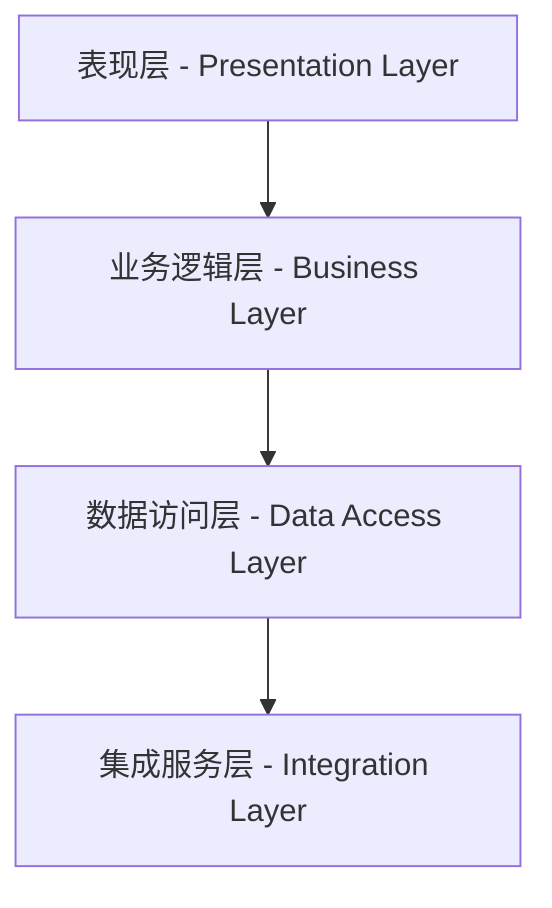

# 5.1 后端服务概述

后端服务是现代Web应用程序的核心组成部分，它隐藏在用户界面背后，负责处理业务逻辑、管理数据存储、提供API接口和确保系统安全等关键功能。与前端主要关注用户交互和界面展示不同，后端服务专注于数据处理、业务规则实现和系统集成。

!!! info "本节学习重点"
    
    本节将系统介绍后端服务的**基本概念与架构**、**HTTP协议机制**、**网站架构模式**和**Web开发框架**四个核心主题

## 5.1.1 后端服务体系结构

### 后端服务的基本概念

**后端服务（Backend Service）**是Web应用程序架构中的服务器端组件，它运行在Web服务器上，负责处理来自客户端的请求，执行业务逻辑，管理数据存储，并将处理结果返回给客户端。

后端服务的主要职责包括：

| 功能领域 | 核心职责 | 技术要求 |
|---------|---------|---------|
| **数据管理** | CRUD操作、数据一致性保障 | 数据库设计、事务处理 |
| **业务逻辑** | 业务规则实现、流程控制 | 算法设计、状态管理 |
| **接口服务** | API设计、数据格式化 | RESTful架构、JSON处理 |
| **安全控制** | 身份认证、权限管理 | 加密算法、安全协议 |

### 现代后端架构模式

现代后端服务普遍采用**分层架构模式（Layered Architecture）**，这是一种将系统功能按照职责进行垂直分层的设计方法。

#### 分层架构核心层次



**各层职责说明：**

- **表现层**：HTTP请求处理、参数验证、响应格式化、异常处理
- **业务逻辑层**：业务规则实现、领域模型管理、工作流协调、事件处理  
- **数据访问层**：数据库操作、ORM映射、连接池管理、事务控制
- **集成服务层**：外部API调用、消息队列、文件系统、缓存服务

!!! example "完整代码示例"
    分层架构的详细实现请参考：`examples/LayeredArchitecture.java`

### 架构模式演进趋势

| 架构类型 | 技术特点 | 适用场景 | 优势 | 挑战 |
|---------|---------|---------|------|-----|
| **单体架构** | 统一部署、共享数据库 | 中小型项目 | 开发简单、调试容易 | 扩展困难、技术局限 |
| **微服务架构** | 服务独立、分布式部署 | 大型复杂项目 | 扩展灵活、技术多样 | 复杂度高、运维困难 |

## 5.1.2 HTTP协议核心机制

### HTTP协议基础理论

**HTTP（HyperText Transfer Protocol）**是Web应用程序之间进行数据通信的应用层协议。它定义了客户端与服务器之间请求和响应的标准格式。

**HTTP协议核心特征：**

- **无状态性**：每个请求都是独立的，服务器不记住之前的请求信息
- **请求-响应模式**：客户端发起请求，服务器处理后返回响应
- **文本协议**：使用可读的文本格式传输控制信息
- **连接管理**：支持短连接、持久连接和多路复用

### HTTP消息结构详解

#### HTTP请求消息组成

```http
POST /api/users HTTP/1.1
Host: example.com
Content-Type: application/json
Authorization: Bearer token...

{"username": "admin", "email": "admin@example.com"}
```

**消息结构分析：**
- **请求行**：HTTP方法、URI路径、协议版本
- **请求头部**：元数据信息（Host、Content-Type、Authorization等）
- **请求体**：实际传输的数据内容

#### HTTP响应消息组成

```http
HTTP/1.1 200 OK
Content-Type: application/json
Content-Length: 156

{"success": true, "message": "用户创建成功", "data": {...}}
```

### HTTP方法语义规范

| 方法 | 语义 | 幂等性 | 安全性 | 典型用途 |
|-----|------|-------|-------|---------|
| **GET** | 获取资源 | 是 | 是 | 数据查询、资源下载 |
| **POST** | 创建资源 | 否 | 否 | 数据提交、资源创建 |
| **PUT** | 完整更新 | 是 | 否 | 资源替换、完整更新 |
| **PATCH** | 部分更新 | 否 | 否 | 字段修改、部分更新 |
| **DELETE** | 删除资源 | 是 | 否 | 资源删除、数据清理 |

### HTTP状态码分类体系

| 状态码类别 | 含义 | 典型状态码 | 使用场景 |
|-----------|------|-----------|----------|
| **2xx 成功** | 请求成功处理 | 200 OK, 201 Created | 正常业务响应 |
| **3xx 重定向** | 需要进一步操作 | 301, 302, 304 | 资源重定向 |
| **4xx 客户端错误** | 请求存在问题 | 400, 401, 404 | 参数错误、权限问题 |
| **5xx 服务器错误** | 服务器处理异常 | 500, 502, 503 | 系统故障、服务异常 |

## 5.1.3 Web应用架构模式

### 静态网站vs动态网站

| 对比维度 | 静态网站 | 动态网站 |
|---------|----------|----------|
| **内容生成** | 预先生成HTML文件 | 实时生成页面内容 |
| **数据处理** | 无服务器端处理 | 复杂业务逻辑处理 |
| **性能表现** | 极快的加载速度 | 依赖服务器计算能力 |
| **个性化** | 统一的展示内容 | 个性化用户体验 |
| **适用场景** | 企业官网、文档站点 | 电商平台、社交网络 |

### 混合架构设计模式

现代Web开发趋向于混合架构，结合不同技术的优势：

#### 前后端分离架构

**前端API服务基本结构：**
```javascript
class ApiService {
  constructor(baseURL) { this.baseURL = baseURL; }
  async fetchData(endpoint) { /* API调用逻辑 */ }
}
```

!!! example "完整示例代码"
    详细的前端API服务实现请参考：`examples/FrontendApiService.js`

**架构特点：**
- **技术栈解耦**：前后端可采用不同技术栈独立开发
- **并行开发**：前后端团队可同时进行开发工作  
- **独立部署**：前后端服务可分别部署和扩展
- **接口标准**：通过RESTful API进行数据交换

## 5.1.4 企业级Web框架技术

### Web应用框架核心价值

**Web应用框架**提供了一套完整的开发工具和规范约定，帮助开发者快速构建功能完善的Web应用。框架的核心价值在于：

- **开发效率提升**：标准化组件、自动化配置
- **代码质量保障**：最佳实践、设计模式
- **系统稳定性**：经过验证的解决方案
- **安全性增强**：内置安全防护机制

### Servlet技术基础

**Servlet生命周期管理：**

```java
@WebServlet("/api/users")
public class UserServlet extends HttpServlet {
    public void init() { /* 初始化 */ }
    protected void doGet(HttpServletRequest req, HttpServletResponse resp) { /* GET处理 */ }
    public void destroy() { /* 资源清理 */ }
}
```

!!! example "完整示例代码"
    详细的Servlet实现代码请参考：`examples/BasicUserServlet.java`

**Servlet开发关键要点：**

| 开发方面 | 技术要点 | 注意事项 |
|---------|---------|---------|
| **参数获取** | `request.getParameter()` | 需要进行参数验证和类型转换 |
| **响应设置** | `response.setContentType()` | 设置正确的内容类型和编码 |
| **状态码** | `response.setStatus()` | 使用标准HTTP状态码 |
| **异常处理** | `ServletException` | 向容器报告处理异常 |

### Spring Boot现代开发模式

**Spring Boot控制器核心特性：**

```java
@RestController
@RequestMapping("/api/users")
public class UserController { /* 详见示例文件 */ }
```

!!! example "完整示例代码"
    详细的Spring Boot控制器实现请参考：`examples/UserController.java`

**框架对比分析：**

| 特性对比 | 原生Servlet | Spring Boot | 优势分析 |
|---------|-------------|-------------|----------|
| **代码量** | 60+行 | 20行 | Spring Boot显著减少样板代码 |
| **配置方式** | XML或注解 | 注解驱动 | 声明式配置更直观 |
| **数据处理** | 手动解析 | 自动绑定 | 框架处理格式转换 |
| **异常处理** | try-catch | 全局处理器 | 统一的错误处理机制 |

### 框架选型决策要素

企业级Web框架选择需要综合考虑以下因素：

| 评估维度 | 考虑因素 | 权重 |
|---------|---------|------|
| **技术成熟度** | 版本稳定性、社区支持、文档完善度 | 25% |
| **开发效率** | 学习曲线、开发工具、调试支持 | 20% |
| **性能表现** | 响应速度、并发能力、资源消耗 | 20% |
| **安全性** | 安全机制、漏洞历史、合规支持 | 15% |
| **可维护性** | 代码质量、架构清晰度、测试友好性 | 10% |
| **生态系统** | 插件丰富度、第三方集成、工具链 | 10% |

## 5.1.5 企业级后端开发实践

### 企业级系统核心特征

现代企业级后端系统需要适应以下核心特征：

#### 数据密集型处理能力

**技术要求：**
- 高吞吐量：>10,000 TPS
- 低延迟响应：<100ms  
- 大数据量：TB级别存储
- 多数据源：关系型+NoSQL+缓存

#### 业务复杂性管理

**核心原则：**
- **单一职责**：每个组件专注特定业务领域
- **规则引擎**：将业务规则与代码逻辑分离
- **流程编排**：使用工作流引擎管理复杂流程

#### 实时性需求处理

**技术架构：**
```
实时数据流 → 消息队列 → 流处理引擎 → 实时响应
     ↓           ↓            ↓           ↓
   Kafka    → Storm/Flink → Redis → WebSocket
```

### 专业化技术应用实践

#### 时序数据库应用

**应用场景：**
- 用户行为分析：记录用户操作时间序列
- 系统性能监控：收集CPU、内存等性能指标
- 业务指标统计：交易量、访问量等业务数据

#### 流式数据处理

**技术优势：**
- 实时响应：毫秒级数据处理延迟
- 高吞吐量：处理大规模数据流
- 容错机制：确保数据处理的可靠性

#### 多级缓存优化策略

**缓存层次架构：**
- **L1缓存**：应用内存缓存，响应最快
- **L2缓存**：分布式缓存，多实例共享
- **CDN缓存**：静态资源边缘缓存

### 安全合规技术实现

#### 身份认证与授权

**多因子认证流程：**
1. 用户名密码验证
2. 动态验证码确认  
3. JWT令牌生成
4. 权限角色分配

#### 数据加密保护

**加密策略：**
- **传输加密**：HTTPS/TLS协议保护数据传输
- **存储加密**：数据库字段级加密
- **应用加密**：敏感数据处理时加密

### 运维监控体系建设

#### 应用性能监控

**监控维度：**
- **响应时间**：API接口响应延迟
- **吞吐量**：每秒处理请求数量
- **错误率**：异常请求占比
- **资源使用**：CPU、内存、网络消耗

#### 告警机制设计

**告警级别：**
- **高级告警**：系统故障，需立即处理
- **中级告警**：性能异常，需及时关注
- **低级告警**：状态变化，需定期检查

### 后端技术发展趋势

#### 微服务架构深化

**发展方向：**
- 服务网格技术简化微服务通信管理
- 更细粒度的服务拆分和业务边界划分
- 分布式事务和数据一致性解决方案成熟化

#### 云原生技术栈普及

**关键技术：**
- **Kubernetes**：容器编排平台
- **Docker**：容器化技术
- **Helm**：包管理工具
- **Prometheus**：监控生态

#### 人工智能与业务集成

**应用领域：**
- 智能预警和异常检测
- 业务趋势分析和预测
- 自动化运维和故障诊断

### 学习成果总结

#### 核心能力掌握

**架构设计能力**：理解分层架构、微服务架构等设计模式，能够根据业务需求选择合适的架构方案。

**协议机制掌握**：深入理解HTTP协议的工作原理，掌握RESTful API的设计规范和最佳实践。

**技术选型能力**：了解不同Web框架的特点和适用场景，能够做出合理的技术选型决策。

**企业级开发认知**：认识到企业级后端开发的复杂性，掌握了应对技术挑战的解决方案。

#### 实践技能建立

**代码实现能力**：通过示例代码学习，掌握了Servlet、Spring Boot等关键技术的实际应用。

**安全防护技能**：理解了企业级安全要求，掌握了认证、授权、加密等安全技术实现。

**监控运维知识**：建立了完整的系统监控和运维管理概念，具备了处理生产环境问题的基础能力。

在下一节的学习中，我们将深入Spring Boot框架的具体应用，通过实际的代码实践来巩固本节学到的理论知识，逐步构建完整的企业级后端服务。

**关键思考** 企业级后端开发不仅是技术问题，更是如何运用现代软件工程方法解决复杂业务挑战的系统工程。掌握技术基础是第一步，理解业务需求、适应系统特点、保障应用安全是更高层次的专业能力要求。