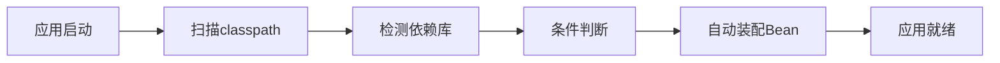

# 5.2 Spring Boot入门与实践

Spring Boot作为现代Java企业级应用开发的主流框架，通过简化配置、自动装配和生产就绪等特性，极大地提高了开发效率和应用质量。它不仅继承了Spring框架的强大功能，更在此基础上提供了开箱即用的开发体验，使开发者能够快速构建独立运行的、生产级别的Spring应用程序。

!!! info "本节学习重点"
    
    本节将全面介绍Spring Boot的**核心概念**、**开发环境搭建**、**项目创建与配置**和**实践应用开发**

## 5.2.1 Spring Boot框架概述

### Spring Boot的设计理念

**Spring Boot**的核心设计理念是"约定优于配置"（Convention over Configuration）。这一理念旨在通过合理的默认配置和智能的自动装配机制，减少开发者在项目配置上花费的时间和精力。

**传统Spring vs Spring Boot对比：**

| 对比维度 | 传统Spring | Spring Boot | 改进效果 |
|---------|------------|-------------|----------|
| **配置复杂度** | 复杂XML配置 | 自动配置 | 配置代码减少90% |
| **项目启动** | 复杂依赖管理 | Starter依赖 | 依赖管理简化 |
| **部署方式** | 外部应用服务器 | 内嵌服务器 | 独立可执行JAR |
| **生产监控** | 需要额外配置 | 内置Actuator | 开箱即用 |

### Spring Boot核心价值

**开发效率提升：**
- **Starter依赖**：一个依赖包含完整功能模块
- **自动配置**：根据依赖自动完成配置
- **热部署**：代码修改自动重启应用

**部署简化：**
- **可执行JAR**：java -jar一键启动
- **内嵌服务器**：无需外部Tomcat等容器
- **配置外化**：环境配置与代码分离

**生产就绪：**
- **健康检查**：自动提供应用状态监控
- **指标监控**：内置性能指标收集
- **配置管理**：运行时配置查看和修改

## 5.2.2 Spring Boot核心特性

### 自动配置机制

自动配置是Spring Boot最重要的特性，通过条件化配置和智能推断机制自动完成应用程序配置。

**自动配置工作原理：**



**条件判断机制：**

| 条件类型 | 说明 | 示例 |
|---------|------|------|
| **@ConditionalOnClass** | 类存在时生效 | 检测到MySQL驱动类时配置数据源 |
| **@ConditionalOnMissingBean** | Bean不存在时生效 | 用户未自定义时提供默认配置 |
| **@ConditionalOnProperty** | 配置属性匹配时生效 | 根据配置开启特定功能 |

### Starter依赖体系

Spring Boot通过Starter简化依赖管理，每个Starter包含一组相关的依赖库。

**常用Starter列表：**

| Starter名称 | 功能描述 | 包含的关键依赖 |
|------------|---------|---------------|
| **spring-boot-starter-web** | Web开发 | Spring MVC, Tomcat, Jackson |
| **spring-boot-starter-data-jpa** | JPA数据访问 | Hibernate, JDBC, 事务管理 |
| **spring-boot-starter-security** | 安全框架 | Spring Security核心组件 |
| **spring-boot-starter-test** | 测试支持 | JUnit, Mockito, TestContainers |

### 配置外化管理

Spring Boot支持多种配置方式，实现配置与代码的完全分离。

**配置优先级（从高到低）：**
1. 命令行参数
2. 系统环境变量
3. application.properties/yml文件
4. 默认配置

**配置文件格式对比：**

| 格式 | 特点 | 适用场景 |
|------|------|---------|
| **Properties** | 键值对格式，简单直观 | 简单配置 |
| **YAML** | 层次结构，可读性强 | 复杂配置 |
| **Environment** | 环境变量，安全性高 | 敏感信息配置 |

## 5.2.3 Spring Boot项目搭建

### 项目创建方式

**三种主要创建方式：**

#### 1. Spring Initializr（推荐）
- 官网：https://start.spring.io/
- 可视化选择依赖和配置
- 生成完整项目骨架

#### 2. IDE集成工具
- IntelliJ IDEA：Spring Initializr插件
- Eclipse：Spring Tools Suite
- 提供图形化创建界面

#### 3. 命令行工具
```bash
curl https://start.spring.io/starter.zip \
  -d type=maven-project \
  -d dependencies=web,data-jpa \
  -o demo.zip
```

### 项目结构规范

**标准Maven项目结构：**

```
src/
├── main/
│   ├── java/                 # Java源码
│   │   └── com/example/demo/
│   │       ├── DemoApplication.java    # 主启动类
│   │       ├── controller/             # 控制器层
│   │       ├── service/               # 业务服务层
│   │       ├── repository/            # 数据访问层
│   │       └── config/                # 配置类
│   └── resources/
│       ├── application.yml            # 主配置文件
│       ├── static/                    # 静态资源
│       └── templates/                 # 模板文件
└── test/                              # 测试代码
```

### 主启动类详解

**启动类基本结构：**

```java
@SpringBootApplication
public class DemoApplication {
    public static void main(String[] args) {
        SpringApplication.run(DemoApplication.class, args);
    }
}
```

**@SpringBootApplication注解功能：**
- **@Configuration**：标识为配置类
- **@EnableAutoConfiguration**：启用自动配置
- **@ComponentScan**：启用组件扫描

!!! example "完整示例代码"
    详细的Spring Boot项目结构和启动类实现请参考：`examples/SpringBootDemo/`

## 5.2.4 基础Web开发实践

### REST控制器开发

**控制器基本结构：**

```java
@RestController
@RequestMapping("/api/users")
public class UserController {
    
    @GetMapping
    public List<User> getAllUsers() { /* 查询逻辑 */ }
    
    @PostMapping
    public User createUser(@RequestBody User user) { /* 创建逻辑 */ }
}
```

!!! example "完整示例代码"
    详细的控制器实现请参考：`examples/UserRestController.java`

**REST API设计规范：**

| HTTP方法 | URL模式 | 功能描述 | 状态码 |
|---------|---------|---------|-------|
| **GET** | `/api/users` | 获取用户列表 | 200 OK |
| **GET** | `/api/users/{id}` | 获取指定用户 | 200 OK |
| **POST** | `/api/users` | 创建新用户 | 201 Created |
| **PUT** | `/api/users/{id}` | 更新用户信息 | 200 OK |
| **DELETE** | `/api/users/{id}` | 删除用户 | 204 No Content |

### 数据持久化配置

**JPA配置示例：**

```java
@Entity
public class User {
    @Id
    @GeneratedValue(strategy = GenerationType.IDENTITY)
    private Long id;
    private String username;
    // getter/setter省略
}

@Repository
public interface UserRepository extends JpaRepository<User, Long> {
    List<User> findByUsername(String username);
}
```

**数据源配置：**

```yaml
spring:
  datasource:
    url: jdbc:h2:mem:testdb
    driver-class-name: org.h2.Driver
    username: sa
    password: 
  jpa:
    hibernate:
      ddl-auto: create-drop
    show-sql: true
```

### 配置管理实践

**多环境配置：**

```yaml
# application.yml - 通用配置
spring:
  profiles:
    active: dev

---
# application-dev.yml - 开发环境
spring:
  datasource:
    url: jdbc:h2:mem:devdb

---  
# application-prod.yml - 生产环境
spring:
  datasource:
    url: jdbc:mysql://prod-server/db
```

**自定义配置属性：**

```java
@ConfigurationProperties(prefix = "app")
@Data
public class AppProperties {
    private String name;
    private String version;
    private Security security = new Security();
    
    @Data
    public static class Security {
        private boolean enabled = true;
        private String algorithm = "SHA-256";
    }
}
```

## 5.2.5 Spring Boot开发最佳实践

### 项目结构组织

**分层架构实践：**

| 层次 | 包名 | 职责 | 注解 |
|------|------|------|------|
| **控制层** | controller | HTTP请求处理 | @RestController |
| **服务层** | service | 业务逻辑实现 | @Service |
| **持久层** | repository | 数据访问操作 | @Repository |
| **配置层** | config | 系统配置管理 | @Configuration |
| **模型层** | model/entity | 数据模型定义 | @Entity |

### 依赖注入最佳实践

**推荐的注入方式：**

```java
@Service
public class UserService {
    
    private final UserRepository userRepository;
    
    // 构造器注入（推荐）
    public UserService(UserRepository userRepository) {
        this.userRepository = userRepository;
    }
}
```

**注入方式对比：**

| 注入方式 | 优点 | 缺点 | 推荐度 |
|---------|------|------|-------|
| **构造器注入** | 依赖明确、便于测试 | 构造器参数多时复杂 | ⭐⭐⭐⭐⭐ |
| **Setter注入** | 灵活性高 | 依赖可能为null | ⭐⭐⭐ |
| **字段注入** | 代码简洁 | 难以测试、循环依赖 | ⭐⭐ |

### 异常处理机制

**全局异常处理：**

```java
@ControllerAdvice
public class GlobalExceptionHandler {
    
    @ExceptionHandler(ValidationException.class)
    public ResponseEntity<ErrorResponse> handleValidation(ValidationException ex) {
        return ResponseEntity.badRequest().body(new ErrorResponse(ex.getMessage()));
    }
}
```

### 测试策略

**测试层次结构：**

| 测试类型 | 测试范围 | 注解 | 执行速度 |
|---------|---------|------|---------|
| **单元测试** | 单个类/方法 | @Test | 极快 |
| **集成测试** | 多个组件 | @SpringBootTest | 较快 |
| **Web层测试** | 控制器 | @WebMvcTest | 中等 |
| **数据层测试** | Repository | @DataJpaTest | 中等 |

### 性能优化建议

**启动优化：**
- 使用 `@ComponentScan` 限制扫描范围
- 延迟初始化非必要Bean
- 使用条件注解避免不必要的自动配置

**内存优化：**
- 合理设置JVM参数
- 使用连接池管理数据库连接
- 启用HTTP压缩减少传输开销

**监控配置：**

```yaml
management:
  endpoints:
    web:
      exposure:
        include: health,info,metrics
  endpoint:
    health:
      show-details: always
```

### 安全考虑

**基础安全配置：**
- 启用HTTPS传输加密
- 配置CORS策略防止跨域攻击
- 使用Spring Security进行认证授权
- 敏感配置信息使用环境变量

**配置安全示例：**

```yaml
server:
  ssl:
    enabled: true
    key-store: classpath:keystore.p12
    key-store-password: ${SSL_PASSWORD}
```

### 学习成果总结

#### 核心概念掌握

**Spring Boot理念理解**：深入理解"约定优于配置"的设计思想，掌握自动配置机制的工作原理。

**项目搭建能力**：熟练使用Spring Initializr等工具快速创建项目，掌握标准项目结构组织方式。

**配置管理技能**：熟练使用多种配置方式，掌握多环境配置管理和配置外化技术。

#### 实践技能建立

**Web开发能力**：掌握REST API设计和实现，熟练使用Spring MVC进行Web开发。

**数据持久化**：掌握Spring Data JPA的基本使用，熟悉数据库集成配置。

**测试和调试**：了解Spring Boot测试框架，掌握基本的测试策略和调试技巧。

#### 最佳实践认知

**代码组织**：掌握分层架构的组织方式，熟悉依赖注入的最佳实践。

**性能优化**：了解基本的性能优化策略，掌握监控和诊断方法。

**安全意识**：建立基础的安全配置意识，了解常见的安全风险防范。

在下一节的学习中，我们将深入学习Spring Boot的数据访问技术，包括JPA、MyBatis等持久化框架的使用，进一步巩固企业级应用开发的核心技能。

**关键思考** Spring Boot的价值不仅在于简化配置，更在于其体现的现代软件开发理念：通过标准化、自动化和约定化，让开发者能够专注于业务价值的创造，而不是重复的技术配置工作。