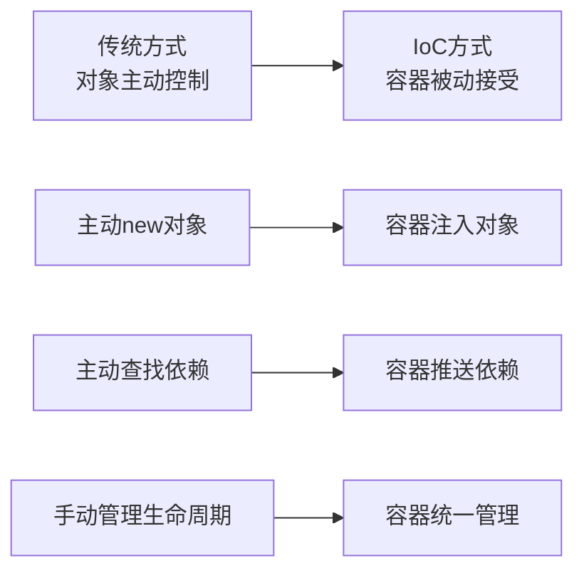

# 5.3 依赖注入和控制反转

依赖注入和控制反转是Spring框架最核心的设计理念，它们从根本上改变了传统Java应用程序的对象管理和依赖关系处理方式。通过将对象的创建、配置和生命周期管理交给Spring容器负责，开发者能够编写出更加松耦合、可测试、可维护的代码。

!!! info "本节学习重点"
    
    本节将深入探讨**控制反转原理**、**IoC容器机制**、**依赖注入方式**和**注解驱动开发**的核心内容

## 5.3.1 控制反转核心概念

### 传统对象依赖管理问题

在传统的Java程序设计中，对象之间的依赖关系通过直接实例化来建立，这种方式会带来诸多问题：

| 问题类型 | 具体表现 | 影响范围 |
|---------|---------|----------|
| **紧耦合问题** | 对象A直接创建对象B，与具体实现绑定 | 违背开闭原则，难以扩展 |
| **测试困难** | 无法轻易替换依赖为模拟对象 | 单元测试复杂化 |
| **配置管理复杂** | 配置信息散布在各个类中 | 维护成本高，易出错 |
| **生命周期管理** | 手动管理对象创建和销毁 | 资源泄露风险 |

### 控制反转设计思想

控制反转（Inversion of Control，IoC）的核心思想是将对象的控制权从使用者转移到外部容器：

**控制权转移的体现：**



### Spring IoC容器架构

Spring提供了两个主要的容器接口：

| 容器类型 | 功能特点 | 适用场景 |
|---------|---------|----------|
| **BeanFactory** | 基础容器，延迟初始化 | 资源受限环境 |
| **ApplicationContext** | 企业级容器，预初始化 | 企业应用开发 |

**容器接口层次结构：**

```
BeanFactory (基础接口)
    ├── ListableBeanFactory (批量操作)
    ├── HierarchicalBeanFactory (层次结构)
    └── ApplicationContext (企业级功能)
        ├── 国际化支持
        ├── 事件发布机制
        └── 资源访问能力
```

## 5.3.2 Spring IoC容器机制

### 容器初始化过程

Spring容器的初始化分为七个主要阶段：

| 阶段 | 主要工作 | 关键组件 |
|------|---------|----------|
| **1. 容器创建** | 基本配置，设置类加载器 | ApplicationContext |
| **2. 配置加载** | 读取配置源，解析Bean定义 | ConfigurationParser |
| **3. 定义注册** | Bean定义注册到注册表 | BeanDefinitionRegistry |
| **4. 定义后处理** | 修改Bean定义元数据 | BeanFactoryPostProcessor |
| **5. Bean实例化** | 创建Bean实例 | BeanFactory |
| **6. 依赖注入** | 解析并注入依赖关系 | DependencyResolver |
| **7. 初始化回调** | 执行初始化方法 | BeanPostProcessor |

### Bean定义与注册机制

**Bean定义包含的信息：**

- **基本信息**：类名、作用域、延迟初始化标志
- **依赖信息**：构造函数参数、属性值、依赖Bean
- **生命周期**：初始化方法、销毁方法、自动装配方式

**Bean定义创建方式对比：**

| 配置方式 | 语法特点 | 优势 | 适用场景 |
|---------|---------|------|----------|
| **XML配置** | `<bean>` 标签 | 配置集中，类型安全 | 传统项目，第三方库 |
| **注解配置** | @Component系列 | 开发效率高 | 业务组件 |
| **Java配置** | @Bean方法 | 类型安全，重构友好 | 复杂配置逻辑 |

### 作用域管理策略

Spring支持多种Bean作用域：

| 作用域类型 | 实例特点 | 生命周期 | 线程安全 |
|-----------|----------|----------|----------|
| **Singleton** | 容器单例 | 与容器同生命周期 | 需要考虑 |
| **Prototype** | 每次新建 | 不管理销毁 | 天然安全 |
| **Request** | 每个HTTP请求 | 请求结束销毁 | 请求隔离 |
| **Session** | 每个HTTP会话 | 会话过期销毁 | 会话隔离 |

## 5.3.3 依赖注入实现方式

### 三种注入方式对比

| 注入方式 | 语法示例 | 主要优势 | 主要局限 | 推荐度 |
|---------|----------|----------|----------|--------|
| **构造器注入** | `public Service(Repository repo)` | 强制性、不可变性 | 参数过多时复杂 | ⭐⭐⭐⭐⭐ |
| **Setter注入** | `@Autowired setRepository()` | 灵活性、可选依赖 | 无法保证完整性 | ⭐⭐⭐ |
| **字段注入** | `@Autowired Repository repo` | 代码简洁 | 测试困难、封装性差 | ⭐⭐ |

!!! example "完整示例代码"
    - 构造器注入示例：`examples/ConstructorInjectionDemo.java`
    - Setter注入示例：`examples/SetterInjectionDemo.java`
    - 字段注入示例：`examples/FieldInjectionDemo.java`

### 构造器注入最佳实践

**核心优势：**

```java
@Service
public class UserService {
    private final UserRepository userRepository;  // final保证不可变
    
    // 强制依赖，缺少时无法创建对象
    public UserService(UserRepository userRepository) {
        Objects.requireNonNull(userRepository);  // 依赖验证
        this.userRepository = userRepository;
    }
}
```

### Setter注入适用场景

**可选依赖处理：**

```java
@Service
public class ReportService {
    @Autowired(required = false)  // 可选依赖
    public void setCacheService(CacheService cache) {
        // 可有可无的功能增强
    }
}
```

## 5.3.4 注解驱动开发实践

### 组件注解体系

Spring提供了语义化的组件注解：

| 注解名称 | 功能语义 | 典型用途 | 技术特性 |
|---------|----------|----------|----------|
| **@Component** | 通用组件 | 工具类、配置类 | 基础注解 |
| **@Service** | 业务服务 | 业务逻辑层 | 语义标识 |
| **@Repository** | 数据访问 | 数据访问层 | 异常转换 |
| **@Controller** | 控制器 | Web控制层 | MVC支持 |

**基本使用模式：**

```java
@Service                    // 业务服务标识
public class UserService {
    @Autowired             // 自动装配
    private UserRepository userRepository;
    
    @Value("${app.name}")  // 配置注入
    private String appName;
}
```

### 自动装配机制

**@Autowired工作原理：**

1. **按类型匹配** → 查找匹配类型的Bean
2. **按名称匹配** → 多个候选时按名称筛选
3. **@Qualifier限定** → 精确指定目标Bean
4. **@Primary优先** → 标记首选实现

### 歧义性解决策略

**多候选Bean处理方式：**

| 解决方案 | 使用方式 | 适用场景 |
|---------|----------|----------|
| **@Primary** | `@Bean @Primary` | 有明确主实现 |
| **@Qualifier** | `@Autowired @Qualifier("name")` | 精确指定 |
| **按名称注入** | 字段名匹配Bean名 | 命名规范场景 |
| **自定义限定符** | 创建专用注解 | 复杂业务场景 |

### 配置属性注入

**@Value支持的表达式格式：**

| 表达式类型 | 语法格式 | 示例 |
|-----------|----------|------|
| **属性占位符** | `${property.name}` | `${server.port:8080}` |
| **SpEL表达式** | `#{expression}` | `#{systemProperties['user.home']}` |
| **环境变量** | `${ENV_VAR}` | `${JAVA_HOME}` |

### 组件扫描配置

**@ComponentScan核心配置：**

```java
@ComponentScan(
    basePackages = {"com.example.service"},  // 扫描包
    includeFilters = @Filter(Service.class), // 包含过滤
    excludeFilters = @Filter(pattern = ".*Test.*") // 排除过滤
)
```

**过滤器类型：**

- **注解类型过滤** - 基于注解筛选
- **指定类型过滤** - 基于具体类型
- **正则表达式过滤** - 基于名称模式
- **自定义过滤器** - 自定义筛选逻辑

## 5.3.5 Bean生命周期与作用域

### Bean生命周期阶段

Spring Bean经历完整的生命周期过程：

| 生命周期阶段 | 回调时机 | 主要作用 |
|-------------|----------|----------|
| **1. Aware回调** | 依赖注入后 | 获取容器引用 |
| **2. @PostConstruct** | 属性设置后 | 资源初始化 |
| **3. InitializingBean** | 后处理前 | 配置验证 |
| **4. 自定义init-method** | 初始化最后 | 业务初始化 |
| **5. @PreDestroy** | 销毁开始 | 资源清理 |
| **6. DisposableBean** | 销毁过程中 | 连接关闭 |
| **7. 自定义destroy-method** | 销毁最后 | 最终清理 |

!!! example "完整示例代码"
    Bean生命周期完整示例：`examples/BeanLifecycleDemo.java`

### 初始化与销毁回调

**三种回调方式的执行顺序：**

```mermaid
graph TD
    A[Bean实例化] --> B[@PostConstruct]
    B --> C[InitializingBean.afterPropertiesSet]
    C --> D[自定义init-method]
    D --> E[Bean可用]
    E --> F[@PreDestroy]
    F --> G[DisposableBean.destroy]
    G --> H[自定义destroy-method]
```

**典型初始化模式：**

```java
@Component
public class ResourceService {
    @PostConstruct
    public void init() {
        // 1. 资源初始化
    }
    
    @PreDestroy  
    public void cleanup() {
        // 2. 资源清理
    }
}
```

### 作用域选择指南

**作用域选择决策树：**

```
是否需要状态？
├── 否 → Singleton（默认推荐）
└── 是 → 是否Web环境？
    ├── 否 → Prototype
    └── 是 → Request/Session/Application
```

**Web作用域特殊处理：**
- 需要**代理模式**解决作用域不匹配问题
- 使用`@Scope(proxyMode = ScopedProxyMode.TARGET_CLASS)`

### 学习成果总结

#### 核心理念掌握

**IoC思想理解**：深刻理解控制反转的设计理念，掌握依赖关系管理的现代化方法。

**容器机制认知**：全面了解Spring容器的工作原理，具备容器配置和调优的基础能力。

#### 实践技能建立

**注入方式选择**：熟练掌握三种依赖注入方式的特点和适用场景，能够做出正确的技术选择。

**注解驱动开发**：熟悉Spring注解体系，能够使用注解进行高效的企业级应用开发。

**生命周期管理**：理解Bean生命周期各个阶段，能够合理利用生命周期回调实现资源管理。

在下一节的学习中，我们将深入学习JPA和数据持久化技术，在IoC和DI的基础上构建完整的数据访问层，进一步完善企业级应用的技术栈。

**关键思考** 依赖注入和控制反转不仅是技术实现手段，更是软件设计思想的重要体现。通过将依赖关系的管理外化到容器，我们实现了真正的关注点分离，为构建松耦合、可测试、可维护的企业级应用奠定了坚实基础。