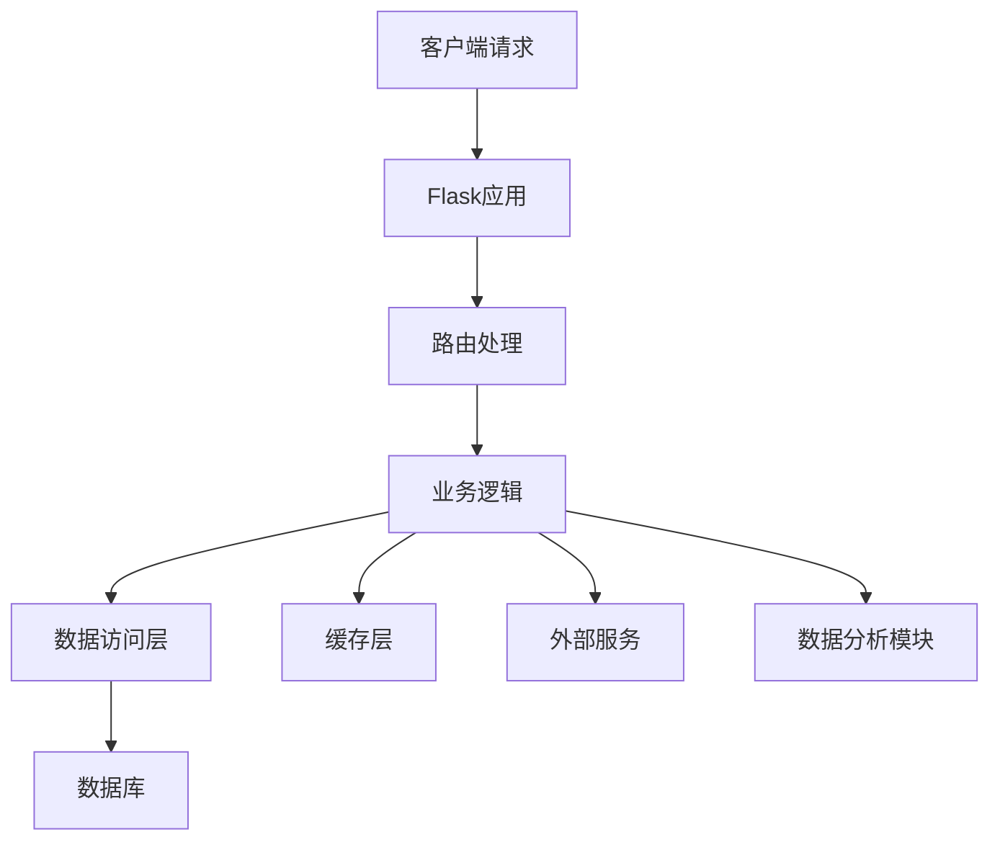
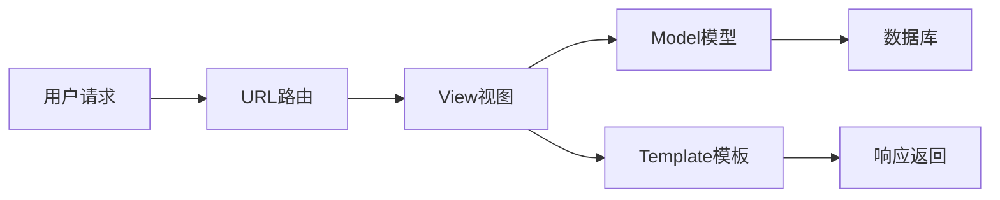

# 5.6 Python Web框架：Flask与Django企业级应用

## 框架概述与设计理念

Python Web开发生态中，Flask和Django代表了两种不同的设计哲学。Flask采用微框架理念，提供最小化的核心功能，通过插件生态实现扩展；Django遵循"包含电池"的全栈设计，内置完整的企业级功能模块。两者在企业应用中各有优势，适用于不同的业务场景和技术需求。

### Python框架在企业应用中的价值

| 应用领域 | 技术优势 | 适用场景 |
|----------|----------|----------|
| 数据分析集成 | NumPy、Pandas、SciPy生态 | 业务数据分析、报表系统 |
| 机器学习应用 | scikit-learn、TensorFlow集成 | 智能预测、风险预警 |
| 快速原型开发 | 简洁语法、丰富库支持 | 概念验证、MVP开发 |
| 科学计算服务 | 数值计算、统计分析 | 工程计算、模拟分析 |
| API服务构建 | RESTful、GraphQL支持 | 微服务、数据接口 |

## Flask微框架架构设计

### 微框架核心理念

Flask采用微框架设计，核心组件包括路由系统、请求处理和模板引擎。其设计原则是提供最小化功能集，通过扩展实现复杂功能。

```python
from flask import Flask, jsonify
app = Flask(__name__)

@app.route('/api/health')
def health_check():
    return jsonify({'status': 'healthy'})
```

### Flask企业级应用架构



### Flask核心组件与扩展

| 组件类型 | 核心功能 | 常用扩展 | 企业应用场景 |
|----------|----------|----------|-------------|
| 路由系统 | URL映射、请求处理 | Flask-RESTful | RESTful API设计 |
| 数据库集成 | 手动配置 | Flask-SQLAlchemy | ORM数据访问 |
| 认证授权 | 基础会话 | Flask-Login, Flask-JWT | 用户管理系统 |
| 数据验证 | 手动实现 | Flask-WTF, Marshmallow | 表单验证、API参数校验 |
| 缓存支持 | 无内置 | Flask-Caching | 性能优化 |
| 任务调度 | 无内置 | Celery集成 | 异步任务处理 |

!!! example "Flask企业级应用完整示例"
    查看完整的Flask微服务实现，包括认证、数据管理、分析功能：
    [FlaskMicroserviceDemo.py](examples/FlaskMicroserviceDemo.py)

### Flask微服务架构优势

Flask的轻量级设计特别适合微服务架构：

- **服务独立性**：每个服务可独立开发、部署和扩展
- **技术栈灵活性**：不同服务可选择不同的技术组合
- **容器化友好**：启动快速，资源占用少
- **开发效率**：简单项目快速上线

## Django企业级全栈框架

### MTV架构模式

Django采用Model-Template-View架构，将数据层、表现层和控制层清晰分离：



### Django核心功能模块

| 功能模块 | 内置特性 | 企业级应用 |
|----------|----------|------------|
| ORM系统 | 数据库抽象、迁移管理 | 复杂数据关系建模 |
| 认证系统 | 用户管理、权限控制 | 企业用户体系 |
| 管理后台 | 自动生成管理界面 | 内容管理系统 |
| 表单处理 | 数据验证、渲染 | 复杂业务表单 |
| 国际化 | 多语言支持 | 全球化应用 |
| 安全框架 | CSRF、XSS防护 | 企业安全合规 |

### Django企业应用架构模式

```python
# 基础配置示例
INSTALLED_APPS = [
    'django.contrib.admin',
    'django.contrib.auth',
    'rest_framework',  # API框架
    'django_filters',  # 数据过滤
    'corsheaders',     # 跨域支持
    'users',           # 用户管理应用
    'data_management', # 数据管理应用
    'analytics',       # 分析应用
]
```

!!! example "Django企业级应用完整示例"
    查看完整的Django企业应用实现，包括模型设计、API接口、用户管理：
    [DjangoEnterpriseDemo.py](examples/DjangoEnterpriseDemo.py)

## 框架性能对比与选型指导

### 性能特性对比

| 性能指标 | Flask | Django | 说明 |
|----------|-------|--------|------|
| 启动速度 | 极快 | 快 | Flask启动时间更短 |
| 内存占用 | 低 | 中等 | Flask最小化依赖 |
| 请求处理 | 高效 | 良好 | 简单请求Flask更优 |
| 数据库操作 | 依赖ORM选择 | 优化的Django ORM | Django内置优化 |
| 并发处理 | 需要外部工具 | 内置支持 | Django提供更多并发选项 |

### 技术选型决策矩阵

| 项目特征 | Flask适用度 | Django适用度 | 推荐框架 |
|----------|-------------|-------------|----------|
| 快速原型开发 | ★★★★★ | ★★★★☆ | Flask |
| 大型企业应用 | ★★★☆☆ | ★★★★★ | Django |
| API服务 | ★★★★★ | ★★★★☆ | Flask |
| 管理后台 | ★★☆☆☆ | ★★★★★ | Django |
| 数据分析集成 | ★★★★★ | ★★★★☆ | Flask |
| 团队协作开发 | ★★★☆☆ | ★★★★★ | Django |

!!! example "框架性能对比工具"
    使用性能测试工具对比Flask和Django在不同场景下的表现：
    [FrameworkComparisonTool.py](examples/FrameworkComparisonTool.py)

### 扩展性分析

**水平扩展对比：**

- **Flask**: 天然无状态，易于负载均衡，需要外部工具支持
- **Django**: 支持多种部署模式，内置会话管理，扩展配置相对复杂

**垂直扩展对比：**

- **Flask**: CPU和内存效率高，但功能依赖外部库
- **Django**: 功能完整但资源占用较高，内置优化策略

## 企业级应用最佳实践

### Flask企业应用模式

1. **微服务架构**：每个服务职责单一，独立部署
2. **插件化开发**：按需选择扩展，避免过度设计
3. **API优先设计**：构建RESTful服务，支持多端调用
4. **容器化部署**：Docker容器快速部署和扩展

### Django企业应用模式

1. **单体应用架构**：功能完整的一体化应用
2. **应用模块化**：按业务领域划分Django应用
3. **管理界面集成**：利用Django Admin构建管理后台
4. **全栈开发模式**：前后端一体化开发

### 共同最佳实践

1. **数据库优化**：索引设计、查询优化、连接池管理
2. **缓存策略**：Redis/Memcached集成，分层缓存设计
3. **安全防护**：身份验证、权限控制、数据加密
4. **监控告警**：日志记录、性能监控、错误追踪
5. **测试覆盖**：单元测试、集成测试、性能测试

## 总结与展望

Flask和Django各有优势，选择应基于具体项目需求：

- **选择Flask**：追求性能、需要灵活性、构建API服务、微服务架构
- **选择Django**：快速开发、管理后台需求、团队协作、企业级应用

两个框架都能与Python科学计算生态良好集成，在数据驱动的企业应用中都有广阔的应用前景。随着云原生技术发展，两个框架都在向容器化、微服务化方向演进，为企业数字化转型提供强有力的技术支撑。