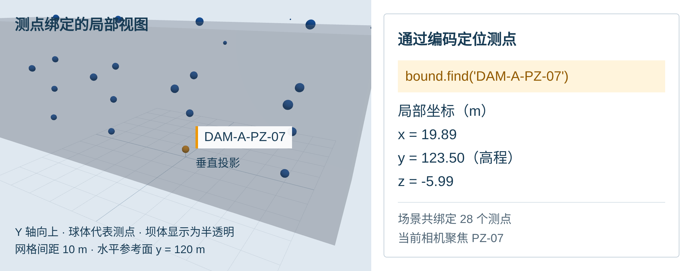
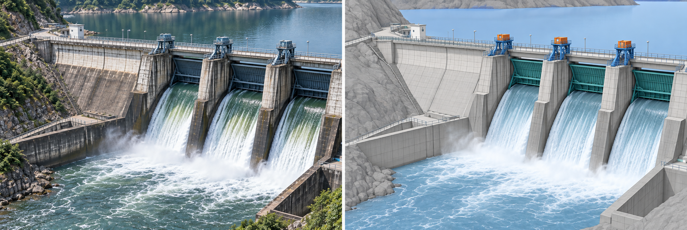
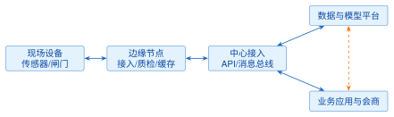
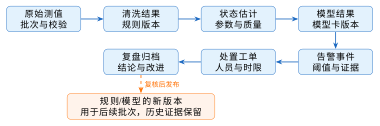

# 第6章 智慧水利三维场景构建

**学习目标**

通过本章学习，学生应能够：

1.  用 Three.js 搭出一个可交互的坝体场景，说明场景、相机、渲染器、网格与材质各自的作用；

2.  用齐次坐标和模型、观察、投影三个矩阵解释一个顶点怎样从构件走到屏幕，并据此排查“物体看不见”“位置不对”一类问题；

3.  加载 glTF/GLB 工程模型，检查并改正单位、轴向和基面高程；

4.  说明CGCS2000、高斯—克吕格分带、1985国家高程基准和场景局部原点的关系，把工程坐标换算为场景坐标并能反算回去；

5.  按对象编码把28个测点绑定到场景对象，并用检查表核对数量、标识、高程和水平位置；

6.  （选读）了解OGC地图服务、倾斜摄影、BIM/IFC与数字孪生平台架构在水利场景中的分工。

**引言**

值班员在监测页上看到的是一张表：PZ-07，185.091 kPa。专业分析员接着要问的是这支渗压计埋在哪个坝段、什么高程、离上游面多远，旁边的测点是否也在升高。三维场景回答的就是这类“在哪里”的问题。本章的主线分五步：先让一个代表坝体的长方体在浏览器里转起来；再用几何体搭出带断面形状的坝体，认识网格、材质和变换；然后加载现成的工程模型，处理它的单位和轴向；接着弄清工程坐标、高程基准和场景局部原点；最后把28个测点按编码放到正确的位置上。6.1节和6.2节完成这条主线，技术基线为 WebGL2、Three.js r160+ 与 CesiumJS 1.12x+。地图服务、倾斜摄影与BIM的生产流程、数字孪生平台架构放在各节靠后的小节和6.3、6.4节，供课程设计和后续学习选读。坝体尺寸、特征水位和测点编码一律取自表8.1；本章得到的场景与测点定位，是第7章曲线联动和第8章完整平台的输入。

!!! tip "提示"

    **工程版本线：v2（认证与观测API） $\rightarrow$ v3（三维场景接入）**

    起点是已完成认证和观测查询的 v2 前后端。本章结束时你应交付 **v3**：在监测页之外新增一个三维场景页，页面里有坝体、水面和按编码定位的28个测点，坐标由 CGCS2000 经纬度和1985国家高程基准换算而来。三维部分作为独立页面接入 v2 的路由与认证，不改动既有接口。配套工程的起点是`frontend/lesson61.html`（S4 阶段页）。

## 6.1 WebGL2与Three.js三维渲染基础

**本节层次**

核心：6.1.1、6.1.2、6.1.3、6.1.4、6.1.5；拓展：6.1.6。

**进入本节所需知识**

4.4节的 ES 模块与事件；4.5节取得对象列表的请求写法；线性代数里的矩阵乘法；一个支持 WebGL2 的现代浏览器。

### 6.1.1 从一个几何体开始：场景、相机、渲染器与循环

**业务问题**

第7章要把28个测点画进坝体三维场景，点一下测点弹出它的观测曲线。在加载任何工程模型之前，先用一个长方体代替坝体，把 Three.js 的四个基本对象和一个渲染循环跑通；本小节结束时你有一个能转动的“坝体”，并且知道黑屏时先查哪三处。

**四个对象**

场景（`Scene`）是所有物体的容器；相机（`PerspectiveCamera`）决定从哪里、以多大视角看；渲染器（`WebGLRenderer`）把场景和相机变成画布上的像素；网格（`Mesh`）由几何体和材质组成，表示一个可以画出来的物体。清单6.1是完整的一页脚本，对应配套工程的`frontend/src/lesson61/first-scene.js`；在自己的 Vite 工程里使用时先执行`npm install three@0.160`。尺寸单位是米，与 8.1 节参数一致：坝高52 m，坝顶高程172.0 m，因此长方体的底面放在 120.0 m。坝长160 m、厚40 m是为画图选的教学尺寸。

**清单 6.1  first-scene.js：一个代表坝体的长方体与渲染循环**

```javascript
import * as THREE from 'three';
import { OrbitControls } from 'three/addons/controls/OrbitControls.js';

// 1. 场景与相机：单位用米，Y 轴向上，高程直接作为 y 坐标
const scene = new THREE.Scene();
scene.background = new THREE.Color(0xdfe8f0);
const camera = new THREE.PerspectiveCamera(45, innerWidth / innerHeight, 1, 2000);
camera.position.set(220, 260, 220);   // 站在坝的斜前上方
camera.lookAt(0, 146, 0);             // 看向坝体中部（坝基 120 + 坝高 52 的一半）

// 2. 渲染器挂到页面
const renderer = new THREE.WebGLRenderer({ antialias: true });
renderer.setSize(innerWidth, innerHeight);
renderer.setPixelRatio(Math.min(devicePixelRatio, 2));
document.body.append(renderer.domElement);

// 3. “坝体”：长 160 m、高 52 m、厚 40 m 的长方体，底面在坝基高程 120 m
const dam = new THREE.Mesh(
  new THREE.BoxGeometry(160, 52, 40),
  new THREE.MeshStandardMaterial({ color: 0x8d99ae }));
dam.position.set(0, 120 + 52 / 2, 0);   // Box 以中心定位，所以抬高半个坝高
dam.userData.assetId = 'DAM-A';         // 业务标识：第7章拾取时靠它找回对象
scene.add(dam);

// 4. 没有光，标准材质是黑的
scene.add(new THREE.AmbientLight(0xffffff, 0.6));
const sun = new THREE.DirectionalLight(0xffffff, 1.2);
sun.position.set(100, 300, 100);
scene.add(sun);

// 5. 交互与循环：每一帧都重新拍一次
const controls = new OrbitControls(camera, renderer.domElement);
controls.target.set(0, 146, 0);
renderer.setAnimationLoop(() => { controls.update(); renderer.render(scene, camera); });

// 6. 窗口尺寸变化时同步相机与画布，否则画面被拉伸
addEventListener('resize', () => {
  camera.aspect = innerWidth / innerHeight;
  camera.updateProjectionMatrix();
  renderer.setSize(innerWidth, innerHeight);
});
```

**运行与可观察结果**

在配套工程`frontend`目录启动教学接口和 Vite，打开`/lesson61.html`。页面出现灰蓝色长方体，拖动鼠标可旋转视角，滚轮可缩放。ES 模块里的变量不是全局变量，阶段页特意把`scene`、`camera`、`dam`等挂到了`window`上，所以可以直接在控制台输入`dam.position.y`，得到146；在自己的工程里，把`console.log`写在脚本末尾效果相同。再看相机与坝体的距离：先执行`camera.updateMatrixWorld()`，再打印`dam.getWorldPosition(new THREE.Vector3()).``applyMatrix4(camera.matrixWorldInverse).z`，结果约为$-331.35$。这个数是坝体中心在相机坐标系里的$z$坐标，负号表示它在相机前方；331.35 m落在近裁剪面1 m与远裁剪面2000 m之间，所以看得见。6.1.3节会解释这个数是怎么算出来的。

**黑屏时先查哪三处**

表6.1把初学者最常见的三种黑屏按“现象—原因—验证”列出，分别对应相机、材质与光照、画布与渲染循环。这三种情况控制台都不报错，只能靠逐项验证来定位。

**表 6.1  第一个场景的三种黑屏及其排查**

| 现象                 | 原因                                                                 | 验证方法                                                                                               |
|:---------------------|:---------------------------------------------------------------------|:-------------------------------------------------------------------------------------------------------|
| 背景色有，物体没有   | 相机偏离物体，或物体位于视锥之外；朝向原点时需检查坝体是否仍在视场内 | 在脚本内打印中心观察坐标并核对深度；将 `controls.target` 设为坝体中心，调用 `controls.update()` 后观察 |
| 物体是纯黑一块       | 用了 `MeshStandardMaterial` 却没有加光                               | 换成 `MeshBasicMaterial` 能看见即可确认；加回环境光与平行光                                            |
| 整页空白连背景都没有 | 渲染器画布没有加进 DOM，或没有调用渲染循环                           | 元素面板里找 `<canvas>`；在 `setAnimationLoop` 回调里打一次 `console.count`                            |

**自测**

（1）把坝体改为 8.1 节参数表中的“3孔弧形闸门”：在坝顶加 3个宽 8.0 m 的小长方体，底面在闸底高程 152.0 m，说出每个的 `position.y`。（2）把远裁剪面改成300并更新投影矩阵，哪些部分会被裁去？（坝体中心距相机约331 m，已在远裁剪面之外；离相机较近的一角仍在300 m以内，所以只剩近侧一部分可见。）（3）`setAnimationLoop`相比手写`requestAnimationFrame`循环有什么作用？（它统一管理普通渲染与 WebXR 循环；常规页面下两种方式通常都会在后台暂停。离开场景时仍需用`setAnimationLoop(null)`停止循环并释放资源。）

### 6.1.2 用几何体搭出坝体：网格、材质与变换

**业务问题**

长方体看不出哪一面挡水。混凝土重力坝的横断面接近直角梯形：上游面近于铅直，下游面放坡，坝顶窄、坝底宽。本小节把长方体换成带断面形状的坝体，再加一层水面，并借这两个物体认识几何体、材质和变换。

**几何体：顶点、三角形与法线**

GPU 只会画三角形。几何体保存三样东西：顶点位置，哪三个顶点组成一个三角形（索引），以及每个顶点处表面的朝向（法线，光照计算用它判断这一面亮不亮）。在控制台输入`dam.geometry.attributes.position.count`得到24，`dam.geometry.index.count`得到36。长方体只有8个角，却有24个顶点，原因是每个角同时属于三个面，三个面的法线各不相同，同一个位置要存三份；36个索引对应$6\times2$个三角形。

坝体断面用`Shape`画出轮廓，再用`ExtrudeGeometry`沿坝轴线方向拉伸。清单6.2只替换清单6.1的第3步，其余不动。这个坝体用到的尺寸集中在表6.2：坝高和基面高程取自8.1节，坝轴线长、底宽、顶宽和坝轴线的摆放方向是为了在场景里画出一个像样的梯形而定的教学尺寸，只在本章和第7章的场景练习里使用，表8.1的工程参数里没有它们。配套数据集里测点的位置（6.1.5节、6.2.3节）和6.1.4节的教学模型文件都按这张表布置。

**表 6.2  教学三维坝体的几何约定（仅用于场景练习，不是案例工程参数）**

| 项目       | 取值        | 说明                                                                                           |
|:-----------|:------------|:-----------------------------------------------------------------------------------------------|
| 坝基高程   | 120.0 m     | 取自表8.1；几何体 $y=0$ 对应这一高程                                                           |
| 坝顶高程   | 172.0 m     | 取自表8.1，坝高52 m                                                                            |
| 坝轴线长   | 160 m       | 教学尺寸；沿场景 $x$ 轴，$x\in[-80,80]$，原点在坝轴线中点                                      |
| 断面底宽   | 40 m        | 教学尺寸；$z\in[-20,20]$，上游面（铅直）在 $z=-20$                                             |
| 断面顶宽   | 8 m         | 教学尺寸；坝顶占 $z\in[-20,-12]$，下游坡面从坝趾 $(z{=}20,\,y{=}120)$ 到 $(z{=}-12,\,y{=}172)$ |
| 上下游方向 | 上游为 $-z$ | 场景 $x$ 指东、$y$ 向上，右手系的 $+z$ 指南，因此水库在坝体北侧                                |
| 水面       | 168.0 m     | 正常蓄水位，取自表8.1；平面 $160\times300$ m，中心在 $z=-170$                                  |

**清单 6.2  用断面拉伸出坝体并加水面（替换 first-scene.js 的第3步）**

```javascript
// 3a. 坝体横断面：断面局部坐标 x 指向下游、y 向上，单位 m
const section = new THREE.Shape();
section.moveTo(0, 0);      // 上游坝踵
section.lineTo(40, 0);     // 下游坝趾
section.lineTo(8, 52);     // 坝顶下游边
section.lineTo(0, 52);     // 坝顶上游边
section.closePath();

// 3b. 沿局部 z 轴拉伸 160 m，再把几何体原点移到“底面中心”
const geometry = new THREE.ExtrudeGeometry(section, { depth: 160, bevelEnabled: false });
geometry.translate(-20, 0, -80);

const dam = new THREE.Mesh(geometry,
  new THREE.MeshStandardMaterial({ color: 0x8d99ae, roughness: 0.9 }));
dam.rotation.y = -Math.PI / 2;   // 拉伸方向转到世界 x 轴：坝轴线沿 x，下游朝 +z
dam.position.y = 120;            // 几何体 y=0 是坝基，所以直接放到坝基高程
dam.userData.assetId = 'DAM-A';
scene.add(dam);

// 3c. 水面：正常蓄水位 168.0 m，位于上游一侧（-z）
const water = new THREE.Mesh(new THREE.PlaneGeometry(160, 300),
  new THREE.MeshStandardMaterial({ color: 0x3a7ca5, transparent: true, opacity: 0.6 }));
water.rotation.x = -Math.PI / 2; // PlaneGeometry 默认竖在 xy 平面内，先放平
water.position.set(0, 168.0, -170);
scene.add(water);
```

**几何体的原点放在哪里**

长方体以中心为原点，所以清单6.1要把它抬高“坝基高程加半个坝高”。清单6.2用`geometry.translate`把原点移到了底面中心，`position.y`就可以直接写坝基高程120.0 m。两种写法画出来的位置相同，后一种让`position`带上了工程含义，以后核对高程时不必再心算半个坝高。

**材质**

材质决定表面怎样对光作出反应。`MeshBasicMaterial`不参与光照，给什么颜色就显示什么颜色，适合测点标记和排查黑屏；`MeshStandardMaterial`按粗糙度（`roughness`）和金属度（`metalness`）计算明暗，混凝土取高粗糙度、零金属度。水面用`transparent`加`opacity`做成半透明，这样水下的上游坝面和以后放进去的库水位测点仍然看得见。

**变换：位置、旋转与缩放**

每个物体都有`position`、`rotation`、`scale`三个属性，Three.js 在渲染前把它们合成一个矩阵，作用到几何体的每个顶点上。几何体本身的顶点数据不变，改的只是“怎么摆”。清单6.2里坝体先绕$y$轴转$-90^\circ$，再抬到坝基高程；水面先绕$x$轴放平，再移到正常蓄水位168.0 m。

**可观察结果**

刷新页面，坝体下游面成为斜坡，上游一侧出现半透明水面，水面比坝顶低4 m。在控制台执行`new THREE.Box3().setFromObject(dam)`，得到的包围盒最小点是$(-80,120,-20)$，最大点是$(80,172,20)$：$y$的上限172正是坝顶高程172.0 m，$x$方向跨160 m，是坝轴线的长度。

**故障练习**

现象：删掉`dam.position.y = 120`一行，坝体沉到地面，水面悬在坝顶之上116 m。原因：几何体的$y=0$被当成了高程0 m。验证：包围盒的$y$范围变成0到52。处理：恢复这一行。包围盒是检查“高程放对没有”最快的办法，6.1.4节检查外来模型时还要用到它。

**场景图与业务标识**

物体可以有子物体。把3扇闸门放进一个`Group`，再把这个组加到坝体下面，移动或旋转坝体时闸门跟着一起动，因为子物体的变换是在父物体的坐标系里定义的。这棵由父子关系组成的树叫场景图，如图6.1所示。工程场景通常按工程、构筑物、构件、测点分层，每个需要与业务数据对应的节点在`userData`里记下对象编码。编码与网格名称要分开：建模软件导出时可能把网格改名为`DamGateMesh001`一类的名字，用名称做主键，换一次模型，预警联动就找不到对象了。

<figure markdown>

<figcaption>图 6.1  水利三维场景的场景图与业务标识层级</figcaption>
</figure>

**自测**

（1）把水面改到汛限水位165.5 m，只需要改哪一个数？（2）`dam.rotation.y`改成$+\pi/2$，下游坡面朝向哪一侧？水面还在上游吗？（坡面转向$-z$，与水面同侧；这时应把水面移到$+z$一侧，或者把旋转改回去。）（3）鼠标悬停时想让坝体变亮，应该改材质的颜色还是复制一份几何体？（改材质。几何体占显存，多个网格可以共用同一个几何体。）

### 6.1.3 坐标变换与透视投影

**业务问题**

6.1.1节从控制台读到坝体中心在相机坐标系里的$z\approx-331.35$，6.1.2节用旋转和平移摆放了坝体和水面。这些操作在 Three.js 内部都是$4\times4$矩阵乘法。弄清这几步，才能在“物体看不见”或“位置不对”时判断问题出在模型摆放、相机还是投影。

**齐次坐标：为什么是四个分量**

旋转和缩放可以写成$3\times3$矩阵乘以坐标，平移却不行：矩阵乘法总把原点映射到原点，而平移恰恰要移动原点。办法是给每个点添一个分量$w=1$，写成$(x,y,z,1)^{\mathrm T}$，平移就成了一次矩阵乘法： $$\begin{bmatrix}1&0&0&t_x\\0&1&0&t_y\\0&0&1&t_z\\0&0&0&1\end{bmatrix}
\begin{bmatrix}x\\y\\z\\1\end{bmatrix}
=\begin{bmatrix}x+t_x\\y+t_y\\z+t_z\\1\end{bmatrix}.$$ 这种四分量的写法叫齐次坐标。平移、旋转、缩放从此都是$4\times4$矩阵，连续几步变换可以先乘成一个矩阵，再作用到成千上万个顶点上。

**模型矩阵$M$：从构件到世界**

物体的`position`、`rotation`、`scale`分别对应平移矩阵$T$、旋转矩阵$R$和缩放矩阵$S$，Three.js 按 $$M=T\,R\,S$$ 合成模型矩阵，存放在`object.matrixWorld`里。矩阵从右往左作用：顶点先缩放，再旋转，最后平移。以清单6.1的长方体为例，它的一个顶角在几何体自身坐标系里是$(80,26,20)$，$M$只有平移$(0,146,0)$，变换后得到$(80,172,20)$，$y$分量正好是坝顶高程172.0 m。外来模型摆不对时，可以对照这三个矩阵逐项检查：尺寸差一千倍，问题在$S$（毫米当成了米）；躺倒或镜像，问题在$R$（竖直轴约定不同）；形状、朝向都对但整体偏移，问题在$T$（原点或基面高程不同）。6.1.4节和6.2.3节会反复用到这个对照。

**观察矩阵$V$：换到相机的坐标系**

相机也是场景里的一个物体，有自己的模型矩阵。把世界里的点变到“以相机为原点、相机朝$-z$方向看”的坐标系，用的是相机模型矩阵的逆，即`camera.matrixWorldInverse`。6.1.1节那行控制台命令做的就是这一步：相机位于$(220,260,220)$，看向坝体中心$(0,146,0)$，两点相距$\sqrt{220^2+114^2+220^2}\approx331.35$ m；坝体中心落在相机的视线上，所以它在相机坐标系里是$(0,0,-331.35)$。

**投影矩阵$P$：近大远小**

设垂直视场角为$\theta$、画面宽高比为$a$、近远裁剪面到相机的距离为$n$和$f$，WebGL 使用的透视投影矩阵为 $$P=\begin{bmatrix}
\dfrac{1}{a\tan(\theta/2)}&0&0&0\\
0&\dfrac{1}{\tan(\theta/2)}&0&0\\
0&0&-\dfrac{f+n}{f-n}&-\dfrac{2fn}{f-n}\\
0&0&-1&0
\end{bmatrix}.$$ 这里的$f$是远裁剪面距离，不是焦距。最后一行$(0,0,-1,0)$把相机坐标的$-z$，也就是点到相机的深度，送进了结果的$w$分量。三个矩阵连乘，得到裁剪坐标： $$\mathbf{p}_{\mathrm{clip}}=P\,V\,M\,\mathbf{p}_{\mathrm{model}}.$$ GPU 先丢弃视锥以外的部分（裁剪），再把$x,y,z$同除以$w$，得到范围在$[-1,1]$内的规范化设备坐标（NDC）。除以$w$就是除以深度，远处的物体因此变小，透视效果由此而来。$\theta=45^\circ$时$1/\tan(\theta/2)\approx2.414$：相机坐标系里高度为$y$、深度为$d$的点，NDC 的纵坐标是$2.414\,y/d$。深度331 m处，一个正对相机、高52 m的物体约占画面高度的$2.414\times52/331/2\approx19\%$。

**深度为什么不均匀**

把$n=1$、$f=2000$和坝体中心的$z=-331.35$代入第三行，再除以$w$，得到 NDC 深度约0.995。坝体离相机只有远裁剪面距离的六分之一，深度值却已用掉可用范围的99%以上。透视投影把绝大部分深度精度分给了靠近相机的地方。近裁剪面设得越小，远处可分辨的深度层次越少，远处两个靠得很近的面（水面与库底、坝面与贴在上面的标记）就会闪烁交错。库区这种上千米尺度的场景，近裁剪面取1 m左右，不要取0.01。

**视口变换：到像素**

最后一步把 NDC 映射到画布。画布宽$W$、高$H$像素时， $$x_{\mathrm{win}}=\frac{x_{\mathrm{ndc}}+1}{2}\,W,\qquad
  y_{\mathrm{win}}=\frac{y_{\mathrm{ndc}}+1}{2}\,H .$$ WebGL 的窗口坐标原点在左下角，浏览器鼠标事件的坐标原点在左上角。第7章做点击拾取时要把鼠标位置反算回 NDC，$y$方向必须翻转一次，漏掉这一步，点击上半屏会选中下半屏的物体。图6.2用同一个橙色顶点把整条链画在一起：构件上的顶点，相机视锥里的同一个点，屏幕上的像素，底部一行是对应的运算。

<figure markdown>

<figcaption>图 6.2  同一顶点从工程构件到屏幕窗口坐标的变换</figcaption>
</figure>

图6.2也是一张排错图。整体位置或朝向不对，查$M$；画面上下颠倒或相机看向了别处，查$V$；远近比例失真、物体被切掉一块或前后遮挡关系错乱，查$P$的视场角和近远面。物体被裁掉时，模型其实已经加载成功，只是画布上看不到；这时打印包围盒和观察坐标，比反复调整模型位置有效。

**自测**

（1）把清单6.1的相机移到$(0,146,500)$并看向坝体中心，坝体中心的观察坐标是多少？（$(0,0,-500)$。）（2）某模型加载后只有预期的千分之一大，且沉在地面以下，分别该查$T$、$R$、$S$中的哪一个？（$S$和$T$。）（3）为什么$P$的最后一行不是$(0,0,0,1)$？（那样$w$恒为1，除以$w$不改变坐标，得到的是没有近大远小的正交投影。）

### 6.1.4 加载现成模型：glTF 的单位、轴向与基面

**业务问题**

真实工程的坝体不会用几行代码画出来，而是由设计或测绘单位交付模型文件。Web 三维的通用交付格式是 glTF，它的二进制打包形式是 GLB，几何、材质和贴图装在一个文件里。模型能加载只是第一步。它有多大、哪个轴朝上、底面在什么高程，都要在加载后核对。

**glTF 的约定**

glTF 规范规定长度单位为米、$+Y$轴向上、右手坐标系，与 Three.js 的默认约定一致。麻烦出在导出环节：许多 CAD 和 BIM 软件内部以毫米为单位、以$Z$轴为竖直方向，导出时如果没有勾选单位和轴向转换，文件就带着原软件的习惯。加载器无法替你判断，要靠已知尺寸核对。

加载器不在 Three.js 的核心包里，而在附加模块（addon）目录下<sup>[[40]](../../references.md#ref40)</sup>。清单6.3是导入写法。本书使用的 r160 的 npm 包已经在`exports`字段里内置了`three/addons/`到`examples/jsm/`的映射（r144 起提供），Vite 工程直接使用这个路径即可；只有不用构建工具、直接写浏览器 importmap 的页面，才需要在 importmap 里自己声明这条映射。

**清单 6.3  Three.js addon路径与构建环境对应**

```javascript
// npm + Vite（r160；r144 起提供）：包内置 exports 映射，直接可用
import { GLTFLoader } from 'three/addons/loaders/GLTFLoader.js';
import { OrbitControls } from 'three/addons/controls/OrbitControls.js';

// 浏览器 importmap（无构建工具）：three/addons/ 必须在
// importmap 的 imports 中显式声明后才可解析
import { DRACOLoader } from 'three/addons/loaders/DRACOLoader.js';
```

清单6.4加载一个 GLB，并用6.1.2节用过的包围盒做三项检查。配套工程的`frontend/public/models/dam.glb`是一个教学模型：由同目录的`generate-dam-glb.py`（只用 Python 标准库）按表6.2的尺寸生成，一个梯形柱体、一种材质，长度单位为米、$+Y$向上、底面在$y=0$，与6.1.2节拉伸出的坝体同形，不承担任何真实工程语义。用这个文件时三项检查的答案是已知的：高度52落在$y$方向，所以不缩放、不旋转，只把底面从0抬到坝基高程120.0 m。脚本带`–units mm`和`–z-up`两个开关，可以故意生成毫米单位或$Z$轴向上的文件，用来看前两项检查怎样生效。练习时在`first-scene.js`末尾调用`loadDam(scene)`；换成设计单位交付的模型时，函数里的阈值改为该模型的一个已知尺寸。

**清单 6.4  load-dam.js：加载 GLB 并核对单位、轴向与基面高程**

```javascript
import * as THREE from 'three';
import { GLTFLoader } from 'three/addons/loaders/GLTFLoader.js';

const DAM_HEIGHT = 52, BASE_ELEV = 120;      // 已知尺寸，取自 8.1 节

export async function loadDam(scene) {
  let gltf;
  try {
    gltf = await new GLTFLoader().loadAsync('/models/dam.glb');
  } catch (error) {                           // 路径错误、网络中断、文件损坏
    console.error('坝体模型加载失败，保留几何体坝体', error);
    return null;
  }
  const model = gltf.scene;
  const size = () => new THREE.Box3().setFromObject(model).getSize(new THREE.Vector3());

  // 检查一：单位。高度在 52000 左右说明文件用的是毫米
  if (Math.max(size().y, size().z) > DAM_HEIGHT * 100) model.scale.setScalar(0.001);
  // 检查二：轴向。52 m 出现在 z 方向说明模型以 Z 轴为竖直方向
  if (Math.abs(size().z - DAM_HEIGHT) < Math.abs(size().y - DAM_HEIGHT)) {
    model.rotation.x = -Math.PI / 2;          // 绕 x 轴转 -90°：原来的 +Z 转到 +Y
  }
  // 检查三：基面。把包围盒底面对到坝基高程
  const box = new THREE.Box3().setFromObject(model);
  model.position.y += BASE_ELEV - box.min.y;

  model.userData.assetId = 'DAM-A';           // 与几何体坝体使用同一个对象编码
  scene.add(model);
  console.table({ size: size(), bottom: BASE_ELEV });
  return model;
}
```

**三项检查各对应哪个矩阵**

单位不对改`scale`，轴向不对改`rotation`，基面不对改`position`，正是6.1.3节的$S$、$R$、$T$。顺序不能乱：先统一单位，尺寸才可比；先转正，才知道哪个方向是“底”。Three.js 按$M=TRS$合成矩阵，清单里的三处修改互不干扰。三项改正都作用在模型的根节点上，模型文件和内部各构件的相对关系保持原样，以后换新版本模型，只需重新核对这三个数。

**可观察结果**

加载教学模型后，控制台的表格里`size`为$(160,52,40)$；执行`new THREE.Box3()``.setFromObject(model)`，得到的包围盒与6.1.2节的坝体相同，$y$范围为120到172，两个坝体在画面上重合。用`–units mm –z-up`重新生成文件再刷新，加载时前两项检查依次触发，最终包围盒不变。把模型地址故意写错，控制台出现“坝体模型加载失败”，页面上几何体坝体仍在，渲染循环不中断。

**颜色与贴图**

模型颜色发灰或过曝，多半是色彩空间标错了。颜色贴图按 sRGB 编码保存，光照计算在线性空间进行，渲染器输出时再转回 sRGB。r152 以后这三处分别由贴图的`colorSpace`、内部的颜色管理和渲染器的`outputColorSpace`控制。`GLTFLoader`会替模型自带的贴图标好色彩空间；自己用`TextureLoader`加载贴图时要手工标注，如清单6.5。法线、粗糙度、金属度贴图存的是数据而不是颜色，保持线性，不标 sRGB。

**清单 6.5  色彩空间：渲染器输出与手工加载的贴图（补在 first-scene.js 第2步之后）**

```javascript
renderer.outputColorSpace = THREE.SRGBColorSpace;  // r152+ 的默认值，写出来便于核对

const colorMap = new THREE.TextureLoader().load('/textures/concrete-color.png');
colorMap.colorSpace = THREE.SRGBColorSpace;        // 颜色贴图：sRGB
const normalMap = new THREE.TextureLoader().load('/textures/concrete-normal.png');
// 法线贴图是线性数据，保持默认，不标 sRGB
dam.material = new THREE.MeshStandardMaterial({ map: colorMap, normalMap });
```

**自测**

（1）某 GLB 加载后包围盒尺寸为$(160000,40000,52000)$，说出清单6.4三项检查各自的结论和改正后的尺寸。（毫米，缩放0.001；$Z$轴向上，绕$x$轴转$-90^\circ$；改正后约为$(160,52,40)$，再把底面对到120 m。）（2）为什么不直接改写模型的顶点坐标，而是改根节点的变换？

### 6.1.5 把测点挂到坝体上：对象绑定与查找

**业务问题**

`GET /api/assets`返回28个对象；台账（配套数据集`stations.json`）给出每个对象的经纬度与高程。场景里要出现28个可点击的小球，点到哪个球就要知道它的`assetId`。本小节先做到“挂上去、找得到”，水平位置用一个粗略的换算；6.2节讲清坐标和高程之后，6.2.3节再把位置换成精确值。拾取交互在第7章7.4节。

**做法**

三条规则。第一，业务标识写进`userData.assetId`，不用网格名字或数组下标当标识：名字会重复，下标会因为增删而漂移。第二，同类对象放进一个`Group`，切换工程时整组移除，并释放几何体和材质占用的显存。第三，从对象编码到网格的查找用一张`Map`，不必每次遍历场景。清单6.6把这三条写成一个函数，对应配套工程的`frontend/src/lesson61/bind-assets.js`；输入是契约的`AssetDto`加上台账里的坐标，输出是可被拾取的组。水平位置此处用“经纬度差乘以每度的米数”换算，高程直接作$y$。注意$z$坐标前的负号：场景的$x$轴指东、$y$轴向上，按右手坐标系，$+z$指向南，所以向北的位移要取负。

**清单 6.6  bind-assets.js：把对象列表绑定为场景中的可拾取网格**

```javascript
import * as THREE from 'three';

const ORIGIN = { lon: 111.2, lat: 30.5 };                 // 场景局部原点（坝轴线附近）
const M_PER_DEG_LAT = 111_000;                             // 教学近似；6.2 节改用投影坐标
const M_PER_DEG_LON = 111_000 * Math.cos(ORIGIN.lat * Math.PI / 180);

export function bindAssets(scene, assets) {
  const group = new THREE.Group();
  group.name = 'assets';
  const byId = new Map();                                  // assetId -> Mesh
  const geometry = new THREE.SphereGeometry(1.5, 16, 16);  // 所有测点共用几何体
  for (const a of assets) {
    const mesh = new THREE.Mesh(geometry, new THREE.MeshStandardMaterial({ color: 0x1565c0 }));
    mesh.position.set((a.longitude - ORIGIN.lon) * M_PER_DEG_LON,
                      a.elevation_m,                          // 高程直接作 y
                      -(a.latitude - ORIGIN.lat) * M_PER_DEG_LAT);
    mesh.userData.assetId = a.assetId;                       // 唯一的业务标识
    group.add(mesh);
    byId.set(a.assetId, mesh);
  }
  scene.add(group);
  return {
    group, byId,
    find: assetId => byId.get(assetId),
    dispose() {                                              // 切换工程时整组释放
      scene.remove(group);
      geometry.dispose();
      group.traverse(o => o.material?.dispose());
      byId.clear();
    }
  };
}

// 用法：const bound = bindAssets(scene, assets);  bound.find('DAM-A-PZ-07').material.color.set(0xffa000);
```

**可观察结果与检查表**

打开`/lesson61.html`，28个蓝色小球按表6.2的约定分布在坝体周围：4个位移标点在坝顶、4个在下游坡面上，3个库水位计在坝体北侧（上游）150到700 m的库区里，5个雨量站中1个在右岸坝头，其余4个散在1到2 km外的近坝流域，拉远视角才能看全。12支渗压计埋在坝体内部的三个高程上，被灰蓝色的坝体挡住；在控制台执行`dam.material.transparent = true; dam.material.opacity = 0.35`，就能透过坝体看见它们。阶段页把返回值挂在`window.bound`上，控制台执行`bound.find('DAM-A-PZ-07').position`，得到的向量$y$分量等于台账中该测点的高程123.5，$x$约20、$z$约$-6$，即坝轴线中点以东20 m、上游面以内14 m、坝基以上3.5 m处。表6.3逐项列出要核对的内容。对象映射错一个，第7章的曲线就会挂到错误的球上，而页面不会报任何错。

**表 6.3  对象绑定的坐标与映射检查表**

| 检查项       | 怎么查                                                                              | 不通过的表现                                     |
|:-------------|:------------------------------------------------------------------------------------|:-------------------------------------------------|
| 数量一致     | `group.children.length` 等于接口返回的对象数                                        | 少球：有对象缺坐标被跳过；多球：上一次未 dispose |
| 标识唯一     | `byId.size` 等于对象数                                                              | 重复 assetId 覆盖，两个球只找得到一个            |
| 高程合理     | 所有球的 y 在坝基 120.0与坝顶 172.0之间（雨量站可高于坝顶）                         | 有球在地下或天上：高程列单位或基准错             |
| 水平位置合理 | 按资产坐标与工程覆盖范围核对水平位置                                                | 经纬度写反（lat/lon 互换）时球会飞出几十公里     |
| 切换后无残留 | `dispose()` 后 `scene.``getObjectByName(``'assets')` 为 undefined | 内存与球一起累积                                 |

图6.3按编码定位并聚焦 PZ-07；场景实际绑定28个测点。10 m 网格、垂直投影和坐标文字为采集时添加的识读标记，坝体也是为了露出埋在坝内的渗压计才调成半透明的，测点坐标与几何保持原样。对象总数与当前可见数量应分别核对。

<figure markdown>

<figcaption>图 6.3  按编码定位测点的局部视图（配套程序运行图，添加坐标识读标记）</figcaption>
</figure>

### 6.1.6 WebGL2 管线、能力探测与性能预算

本小节是拓展内容，回答两个问题：Three.js 替我们调用了哪些底层接口；场景变大以后从哪里着手优化。

**直接使用 WebGL2**

Three.js 的渲染器内部使用浏览器的 WebGL2 接口。清单6.7绕过 Three.js 直接取得上下文：拿不到`webgl2`就立即报错退出，错误停在初始化阶段，不会拖到绘制时才表现为黑屏。

**清单 6.7  WebGL2 上下文初始化与能力检测**

```javascript
const canvas = document.querySelector('#scene');
const gl = canvas.getContext('webgl2');
if (!gl) throw new Error('当前浏览器不支持 WebGL2');

gl.enable(gl.DEPTH_TEST);
gl.clearColor(0.86, 0.93, 0.98, 1.0);
gl.viewport(0, 0, canvas.width, canvas.height);
gl.clear(gl.COLOR_BUFFER_BIT | gl.DEPTH_BUFFER_BIT);
```

6.1.3节的三个矩阵最终在顶点着色器里相乘。顶点着色器是在 GPU 上对每个顶点执行一次的小程序。清单6.8把模型、观察、投影三个矩阵分开传入，没有预先乘成一个；物体位置不对时，可以逐个换成单位矩阵，看是哪一步的坐标错了。

**清单 6.8  GLSL 顶点着色器：模型—视图—投影变换**

```glsl
#version 300 es
layout(location = 0) in vec3 aPosition;
uniform mat4 uModel;
uniform mat4 uView;
uniform mat4 uProjection;

void main() {
    gl_Position = uProjection * uView * uModel
                  * vec4(aPosition, 1.0);
}
```

CPU 负责准备顶点缓冲、纹理和绘制命令，GPU 依次执行顶点处理、图元装配、光栅化、片元处理和深度与混合测试。视口变换得到的是连续的窗口坐标，光栅化才把三角形变成一个个片元（候选像素）。

**深度范围约定**

6.1.3节的投影矩阵把 NDC 的$z$映射到$[-1,1]$，这是 OpenGL 与 WebGL 的约定。WebGPU、Direct3D 以及 Cesium 的某些反向深度（reverse-Z）配置使用$[0,1]$，投影矩阵第三行的系数随之不同。把一个接口的投影矩阵直接搬到另一个接口，会出现近远裁剪或深度测试错误。相机模块除了保存矩阵，还要记下所用接口、深度范围、是否反向深度和近远面。

**WebGL1 兼容**

WebGL2 基于 OpenGL ES 3.0，内置顶点数组对象、32位索引、实例化和多渲染目标。旧设备只有 WebGL1 时，这些能力分别依赖`OES_vertex_array_object`、`OES_element_index_uint`、`WEBGL_draw_buffers`等扩展，GLSL ES 3.00、统一缓冲对象和整型纹理则完全不可用。清单6.9在初始化阶段集中探测，缺什么能力就在这里决定怎样降级。

**清单 6.9  WebGL能力探测与兼容性记录**

```javascript
function inspectWebGL(canvas) {
  const gl2 = canvas.getContext('webgl2');
  if (gl2) {
    return {version: 2, instancing: true, indexUint32: true,
      drawBuffers: true, shadingLanguage: 'GLSL ES 3.00'};
  }
  const gl1 = canvas.getContext('webgl');
  if (!gl1) throw new Error('需要支持 WebGL 的浏览器');
  const extensions = {
    vao: Boolean(gl1.getExtension('OES_vertex_array_object')),
    indexUint32: Boolean(gl1.getExtension('OES_element_index_uint')),
    drawBuffers: Boolean(gl1.getExtension('WEBGL_draw_buffers')),
  };
  return {version: 1, ...extensions, instancing: false,
    shadingLanguage: 'GLSL ES 1.00'};
}
```

**性能预算**

优化之前先测量：帧时间、每帧绘制调用次数、显存占用，用目标终端实测，不凭感觉。常用手段各有适用条件。实例化（`InstancedMesh`）用一次绘制调用画出大量共用几何体和材质的物体，适合护栏、植被和测点标记；代价是各实例不是独立的`Mesh`，拾取得到的是实例序号，要另建“序号到`assetId`”的映射，清单6.6的`byId`得相应改写。28个测点远不到需要实例化的规模，主线因此用独立网格。LOD（细节层次）按相机距离在高、中、低精度模型之间切换，适合大体量坝体和地形。纹理压缩与尺寸上限直接决定显存占用；视锥裁剪和按需加载减少 GPU 与网络的工作量。清单6.10给出实例化和 LOD 的写法，其中250 m和800 m两个切换距离要按终端实测的帧时间调整。

**清单 6.10  实例化测点与距离驱动的LOD选择**

```javascript
const markerGeometry = new THREE.SphereGeometry(0.08, 8, 6);
const markerMaterial = new THREE.MeshBasicMaterial({color: 0xffcc00});
const markers = new THREE.InstancedMesh(markerGeometry, markerMaterial, 28);
const transform = new THREE.Object3D();
stations.forEach((station, index) => {
  transform.position.fromArray(station.position);
  transform.updateMatrix();
  markers.setMatrixAt(index, transform.matrix);
});
markers.instanceMatrix.needsUpdate = true;
scene.add(markers);

const lod = new THREE.LOD();
lod.addLevel(highDetailModel, 0);
lod.addLevel(mediumDetailModel, 250);
lod.addLevel(lowDetailModel, 800);
scene.add(lod);
```

模型交付前的网格简化、纹理压缩、法线检查和层级拆分属于生产环节，见6.3.3节。

## 6.2 GIS服务、坐标与二三维集成

**本节层次**

核心：6.2.1、6.2.2、6.2.3；指导实践：6.2.4；拓展：6.2.5。

**进入本节所需知识**

6.1节核心小节，特别是6.1.3节的$T$、$R$、$S$和6.1.5节的绑定函数；测量学里经纬度、投影和高程的基本概念。

**业务问题**

6.1.5节用“经纬度差乘以每度111 km”把测点放进了场景。这个换算有三个没有交代的地方：经纬度属于哪个坐标系，台账里的高程从哪个面起算，场景原点为什么选在坝址附近而不是直接使用测绘坐标。工程资料还常常给出另外两种位置：高斯—克吕格平面坐标（东坐标、北坐标，单位米）和坝轴线桩号。本节先把这几种坐标和高程讲清楚，再在6.2.3节给出一条能正算也能反算的换算链，把28个测点重新放一遍。

### 6.2.1 CGCS2000与投影坐标

**地理坐标**

我国现行的大地坐标系是2000国家大地坐标系（CGCS2000），它的经纬度坐标在 EPSG 编码体系里的代码是 EPSG:4490<sup>[[41]](../../references.md#ref41)</sup>；常见的 EPSG:4326 对应的是 WGS 84。EPSG 代码是坐标系的公共编号，软件靠它查到椭球、投影和单位的定义。CGCS2000 参考椭球长半轴为6378137 m、扁率倒数为298.257222101，与 WGS 84 椭球极为接近，但二者是两个不同的坐标系；在软件里定义 CGCS2000 时，椭球填 GRS80，`datum`一项不填 WGS84。

**为什么要投影**

经纬度的单位是度，而经度一度对应的地面距离随纬度变化：在案例水库所在的北纬$30.5^\circ$，纬度变化一度，地面距离约111 km；经度变化一度，只有约96 km。度不能直接当长度用，算距离、画断面、放进以米为单位的三维场景之前，要先投影到平面。我国工程测量通用高斯—克吕格投影：设想一个横放的圆柱面与某条经线（中央经线）相切，把经线两侧一个窄带内的地面展到平面上，得到东坐标$E$和北坐标$N$，单位为米。离中央经线越远，长度变形越大，所以要分带，每带用自己的中央经线。

**分带与中央经线**

6度带从$0^\circ$经线起每$6^\circ$一带，我国大陆范围为13至23带。经度$\lambda$所在带号与中央经线为 $$N_6=\left\lfloor\frac{\lambda}{6}\right\rfloor+1,
  \qquad \lambda_0=6N_6-3 .$$ 大比例尺水利测图常用3度带，变形更小： $$n_3=\left\lfloor\frac{\lambda-1.5}{3}\right\rfloor+1,
  \qquad \lambda_0=3n_3 .$$ 以经度$113^\circ42'$E的某测站为例，先把度分化成十进制度$113.7^\circ$。按6度带，$N_6=\lfloor113.7/6\rfloor+1=19$，中央经线$111^\circ$；按3度带，$n_3=\lfloor(113.7-1.5)/3\rfloor+1=38$，中央经线$114^\circ$。同一个测站在两种带宽下的带号和中央经线都不同，拿到一份平面坐标，必须同时知道它用的是哪种带宽、哪条中央经线。案例水库的场景原点取在经度$111.2^\circ$，3度带为37带，6度带为19带，中央经线恰好都是$111^\circ$。带号由经度和带宽算出，与流域名称无关；黄河、长江这类跨多个带的工程，每个数据集要各自标明分带。

东坐标还有一个容易出错的约定。为避免出现负数，东坐标统一加500 km；有的成果还在前面拼上带号，例如37带的519200 m写成37519200 m。表6.4列出 CGCS2000 各类坐标的 EPSG 代码范围，带号前缀的有无对应不同的代码。按表中的排列，中央经线$111^\circ$、不带前缀的3度带是 EPSG:4546。

**表 6.4  CGCS2000高斯—克吕格分带EPSG对照**

| 坐标类型          | EPSG范围  | 说明                                     |
|:------------------|:----------|:-----------------------------------------|
| 3度带（带号前缀） | 4513–4533 | 以带号标识的工程平面坐标，中央经线为$3n$ |
| 3度带（无前缀）   | 4534–4554 | 东坐标不拼接带号，交付时仍需记录带号     |
| 6度带（带号前缀） | 4491–4501 | 以6度带号标识，中央经线为$6N-3$          |
| 6度带（无前缀）   | 4502–4512 | 适合项目统一平面坐标，带号写入元数据     |
| 地理二维坐标      | 4490      | CGCS2000经纬度，单位为度                 |

清单6.11用经度计算两种带宽的带号和中央经线，结果要与数据自带的 EPSG 说明对照。测站靠近分带边界时，采用邻带还是全工程统一到一个带，由项目的测量技术设计决定，程序按该约定执行，不自行切换。

**清单 6.11  3度带与6度带带号计算**

```javascript
function gaussKrugerZone(longitude) {
  const sixDegree = Math.floor(longitude / 6) + 1;
  const threeDegree = Math.floor((longitude - 1.5) / 3) + 1;
  return {
    sixDegree: {number: sixDegree, centralMeridian: 6 * sixDegree - 3},
    threeDegree: {number: threeDegree, centralMeridian: 3 * threeDegree}
  };
}
console.log(gaussKrugerZone(113 + 42 / 60));
```

**用 proj4 做转换**

投影公式是一组级数，实际工作交给 proj4 库（`npm install proj4`）。清单6.12定义 CGCS2000 经纬度和中央经线$111^\circ$的高斯—克吕格平面坐标，并对清单6.11的测站做一次往返转换。`tmerc`是横轴墨卡托，即高斯—克吕格投影的计算方法；GRS80 椭球与 CGCS2000 椭球的参数在这一精度下一致；`+k_0=1`表示中央经线上长度不变；`+x_0=500000`就是前面说的500 km东偏，不带带号前缀。

**清单 6.12  proj4 定义 CGCS2000 与高斯—克吕格转换**

```javascript
import proj4 from 'proj4';

const CGCS2000 =
  '+proj=longlat +ellps=GRS80 +no_defs +type=crs';
const GK_CM111 =
  '+proj=tmerc +lat_0=0 +lon_0=111 +k_0=1 '
  + '+x_0=500000 +y_0=0 +ellps=GRS80 '
  + '+units=m +no_defs +type=crs';

proj4.defs('CGCS2000', CGCS2000);
proj4.defs('CGCS2000_GK_CM111', GK_CM111);
const projected = proj4('CGCS2000', 'CGCS2000_GK_CM111',
                        [113 + 42 / 60, 34.20]);   // [经度, 纬度] -> [E, N]
const back = proj4('CGCS2000_GK_CM111', 'CGCS2000', projected);
console.log(projected, back);
```

**可观察结果**

`projected`约为$[748887,\ 3789144]$：东坐标减去500 km后是249 km，说明这个测站在中央经线以东约249 km，已接近6度带的边缘；北坐标是它到赤道的投影距离。`back`与输入的经纬度在小数点后八位以内一致，相当于毫米量级。往返误差明显偏大，通常是椭球或中央经线填错了；东坐标多出两位数字，是对方的成果带了带号前缀。

**轴序**

“先经度还是先纬度”没有统一答案。proj4 和 GeoJSON 按“经度，纬度”排列；EPSG 对4490的正式定义是“纬度，经度”，WMS 1.3.0 照此执行（6.2.4节）。接口里传坐标时用带名字的字段，或者在契约里写明顺序，不要让调用方去猜。清单6.13在入口处检查坐标的元数据，缺少轴序、单位或 EPSG 代码就拒绝，避免“默认经度在前”这种假设藏在代码里。

**清单 6.13  坐标元数据校验与轴序显式化**

```javascript
function validateCoordinate(point, metadata) {
  if (metadata.axisOrder !== 'lon-lat') {
    throw new Error('接口契约要求显式声明经度/纬度轴序');
  }
  if (metadata.unit !== 'degree' || metadata.epsg !== 4490) {
    throw new Error('经纬度输入必须是 EPSG:4490 度单位');
  }
  if (point.lon < -180 || point.lon > 180 ||
      point.lat < -90 || point.lat > 90) {
    throw new Error('经纬度超出合法范围');
  }
  return {x: point.lon, y: point.lat, crs: `EPSG:${metadata.epsg}`};
}
```

图6.4把到目前为止的环节连了起来：经纬度经分带和投影得到$E$、$N$；高程$H$走另一条线，先统一高程基准（6.2.2节）；两条线在最后一步汇合，经局部原点平移和轴向换算进入场景（6.2.3节）。

<figure markdown>

<figcaption>图 6.4  从CGCS2000经纬度到工程三维场景的坐标链</figcaption>
</figure>

**投影变形与坐标选择**

中央经线上长度不变，向两侧逐渐伸长。坝址测图、施工放样和变形监测要求毫米到厘米级精度，采用覆盖工程范围的3度带，或者以坝轴线为基准的工程独立坐标；流域级的展示对变形不敏感，可以直接用经纬度。测量成果、断面计算和放样数据始终保留原始测绘坐标，场景里的局部坐标只是为了显示而做的换算。工程跨越分带边界时，在设计阶段选定一个主坐标系，其他带的数据转换后另存为新数据集，原始文件不覆盖。

### 6.2.2 高程基准与空间一致性

**两种高程**

表8.1里的坝顶高程172.0 m、正常蓄水位168.0 m和台账里各测点的高程，都是1985国家高程基准下的**正常高**，通俗地说是从平均海水面延伸出来的那个面起算的高度，水往低处流说的就是这种高程。GNSS 接收机直接给出的却是**椭球高**$h$，即点到参考椭球面的距离；椭球面是一个数学曲面，与海水面并不重合。两者之差称为高程异常$\zeta$： $$H_\gamma=h-\zeta .$$ 我国法定的高程系统是正常高。有的资料使用正高$H_g$，它与椭球高相差大地水准面差距$N$： $$H_g=h-N .$$ 正常高和正高数值接近但定义不同，椭球高与它们可以相差几十米。三者不能共用一个叫“海拔”的字段。

**差多少**

按重力似大地水准面模型 CNGG2011 的统计，我国大陆范围内高程异常大致在$-68$ m到$+28$ m之间<sup>[[42]](../../references.md#ref42)</sup>，西部为负、东南部为正，同一测区内部的变化通常在米级到十米级。这些数字用来建立数量级概念；工程计算使用测区批准的似大地水准面模型（CNGG2011 或省级加密模型），并记录模型名称、版本、格网分辨率和适用范围。程序里不能用一个固定常数代替模型。

举一个数值例子。某点 GNSS 测得椭球高$h=245.30$ m，该处$\zeta=-8.62$ m，则 $$H_\gamma=245.30-(-8.62)=253.92\ \mathrm{m}.$$ $\zeta$的符号由模型给出，程序只执行公式，不对符号做任何“修正”。假如把这个椭球高直接当作正常高写进台账，测点会比实际位置低8.62 m。对一座52 m高的坝，这相当于错了六分之一个坝高：位于坝体中部的渗压计会被画到靠近坝基的地方，6.1.5节检查表的“高程合理”一项未必拦得住它，因为它仍在坝基与坝顶之间。高程基准因此必须写在数据里，不能靠数值范围去猜。

清单6.14把高程转换写成显式函数：必须说明要哪一种高程，必须给出对应的改正值，输出带着基准标签。两个分支的算式相同，区别在于调用方要分别传入$\zeta$或$N$，它们来自不同的模型成果。

**清单 6.14  椭球高到正常高与正高的转换**

```javascript
function convertHeight({h, kind, anomaly}) {
  if (!Number.isFinite(h) || !Number.isFinite(anomaly)) {
    throw new Error('高程与异常值必须为有限数');
  }
  // anomaly：正常高用高程异常ζ，正高用大地水准面差距N，
  // 二者来自不同模型成果，调用方必须按 kind 传入对应值
  if (kind === 'normal') return {value: h - anomaly, datum: '1985-normal'};
  if (kind === 'orthometric') return {value: h - anomaly, datum: 'orthometric'};
  throw new Error('必须明确 normal 或 orthometric 高程类型');
}
const normal = convertHeight({h: 245.30, kind: 'normal', anomaly: -8.62});
```

**两条链路分开管**

平面投影改变水平坐标，高程转换改变竖向基准，两者各有参数和版本。一份可交付的坐标数据至少写明：水平坐标系的 EPSG 代码、带宽、中央经线、东坐标是否带带号前缀；高程类型、高程基准、单位；采用的转换模型及版本。同一控制点转换后的高程还要与水准测量成果独立核对。缺了这些说明，日后发现“偏了2 m”，无从判断是单位、带号、轴序还是原点出了问题。

### 6.2.3 局部原点、轴向换算与测点重新定位

**大坐标为什么会抖**

案例水库场景原点（经度$111.2^\circ$、纬度$30.5^\circ$，取在坝轴线中点）在中央经线$111^\circ$的高斯—克吕格投影下，东坐标约519200 m，北坐标约3375559 m。JavaScript 的数值是64位浮点数，保存这样的坐标毫无问题；但几何体的顶点数据以32位浮点数（`Float32Array`）保存并送入 GPU，着色器里的运算也是32位。32位浮点数只有24位有效二进制位，约7位十进制有效数字。数值在$2^{21}$到$2^{22}$之间（约210万到420万）时，相邻两个可表示的数相差$2^{21-23}=0.25$。在控制台试一下：

**清单 6.15  32位浮点数保存北坐标时的舍入**

```javascript
Math.fround(3375558.74)   // 3375558.75：只能落在 0.25 m 的格点上
Math.fround(519199.80)    // 519199.8125：东坐标的格距是 1/32 m
Math.fround(58.74)        // 58.7400016784668：减去原点后，误差在微米量级
```

清单6.15说明，如果模型的顶点直接使用测绘坐标，北方向上每个顶点都会被舍入到最近的0.25 m格点：渗压计这样的小构件被压扁变形，相机移动时各顶点的舍入方向不断变化，画面就出现抖动。解决办法是选一个靠近工程的点作**局部原点**$(E_0,N_0)$，所有坐标先在64位精度下减去原点，再交给场景。减完以后数值只有几百到几千米，32位浮点数足够精确。高程本身只有一两百米，不必再减，保留“$y$就是高程”还便于核对。

**轴向换算**

工程坐标的三个方向是东、北、上，场景的三个轴是$x$、$y$、$z$，且$y$向上。取$x$指东、$y$向上之后，右手坐标系里$+z$只能指向南，于是 $$\begin{bmatrix}x\\y\\z\\1\end{bmatrix}
=\begin{bmatrix}1&0&0&-E_0\\0&0&1&-H_0\\0&-1&0&N_0\\0&0&0&1\end{bmatrix}
\begin{bmatrix}E\\N\\H\\1\end{bmatrix},
\qquad\text{即}\quad
x=E-E_0,\;\; y=H-H_0,\;\; z=-(N-N_0).$$ 这是6.1.3节齐次矩阵的又一个用处：一次轴向换算加一次平移。$z$前面的负号如果漏掉，场景不会报错，但整个工程成了镜像：左岸与右岸对调，从上游看过去闸门的编号顺序反了。清单6.16把正算和反算写在一起。反算同样重要：在场景里点中一个位置，要把它还原成工程坐标，才能拿去查台账或交给后端做空间查询。

**清单 6.16  local-origin.js：工程坐标与场景局部坐标互转**

```javascript
// origin = { east, north, height }，案例中 height 取 0，让 y 直接等于高程
export function toLocal(p, origin) {
  return { x: p.east - origin.east,
           y: p.height - origin.height,
           z: -(p.north - origin.north) };    // 北 -> -z，保持右手系
}
export function toEngine(local, origin) {
  return { east: local.x + origin.east,
           height: local.y + origin.height,
           north: origin.north - local.z };
}
```

**重新定位28个测点**

现在可以回头改进6.1.5节的绑定。`bindAssets`的结构、标识和释放逻辑都不动，变化只在“怎样由台账算出`position`”。把清单6.6复制为`bind-assets-projected.js`，删去开头三个常量，把`mesh.position.set(...)`一句换成清单6.17的写法。

**清单 6.17  用投影坐标与局部原点计算测点位置（替换 bindAssets 中的 position 计算）**

```javascript
import proj4 from 'proj4';
import { toLocal } from './local-origin.js';
// 'CGCS2000' 与 'CGCS2000_GK_CM111' 的 proj4.defs 见本节前面的 proj4 转换清单

const ORIGIN_LONLAT = [111.2, 30.5];
const [E0, N0] = proj4('CGCS2000', 'CGCS2000_GK_CM111', ORIGIN_LONLAT);
const ORIGIN = { east: E0, north: N0, height: 0 };

function scenePosition(a) {
  if (a.elevation_datum && a.elevation_datum !== '1985-normal') {
    throw new Error(`${a.assetId} 的高程基准不是 1985 国家高程基准`);
  }
  const [east, north] = proj4('CGCS2000', 'CGCS2000_GK_CM111',
                              [a.longitude, a.latitude]);
  return toLocal({ east, north, height: a.elevation_m }, ORIGIN);
}

// bindAssets 循环体内：
const p = scenePosition(a);
mesh.position.set(p.x, p.y, p.z);
```

配套数据集`stations.json`里与位置有关的字段只有`longitude`、`latitude`和`elevation_m`。案例约定经纬度为 CGCS2000（配套数据库的`geometry`列即声明为 EPSG:4490），高程与8.1节的特征水位同属1985国家高程基准，因此`elevation_datum`字段不存在时函数直接放行；接入带有该字段的真实台账时，这个判断会拦下混入的椭球高。

**可观察结果**

两种算法下 PZ-07 的位置对比：粗略换算得到$x\approx19.89$、$z\approx-5.99$，投影换算得到$x\approx19.96$、$z\approx-6.02$，平面上相差约0.07 m；$y$都是123.5，没有变化。差别随离原点的距离增大：坝轴线两端的测点（离原点60 m）相差约0.25 m，库区里的 WL-03（约700 m）相差约2.0 m，离原点最远的雨量站 RF-04（约1.6 km）相差约7.4 m。差别来自两处：每度的米数取了近似值（纬度$30.5^\circ$处一度经差约96.0 km，粗略公式用的$111\cos\varphi$只有95.6 km）；高斯—克吕格的坐标北与真北之间有一个小夹角（子午线收敛角）。原点选在坝上，坝体范围内两种算法的差别只有分米量级，这是局部原点靠近工程的好处；但同一段代码用到流域尺度就会差出好几米，而且粗略公式没有反算，场景里点到的位置换不回工程坐标。重新用表6.3核对一遍，五项结论应当与6.1.5节相同。

**坝轴线桩号**

大坝的施工图和测点考证表通常不写经纬度，而用工程自己的一套定位方式：沿坝轴线的**桩号**、到坝轴线的垂直距离（轴距，注明上游或下游）和高程。桩号“坝0+085.00”表示从坝轴线起点沿轴线走85 m。这套坐标与断面图、坝段划分直接对应，值班员说“0+085断面的渗压计”，比报一串经纬度更容易让人明白位置。已知坝轴线起点的平面坐标$(E_s,N_s)$和轴线的坐标方位角$\alpha$（从坐标北顺时针量到轴线前进方向的角度），桩号$s$、下游轴距$d$的点的平面坐标为 $$E=E_s+s\sin\alpha+d\cos\alpha,\qquad
  N=N_s+s\cos\alpha-d\sin\alpha ,$$ 这里假定面向桩号增大方向时下游在右手一侧，相反时$d$取负。算出$E$、$N$之后，其余步骤与清单6.17相同。如果把场景的局部原点取在坝轴线起点，并让$x$轴沿坝轴线，桩号就直接等于$x$坐标；表6.2的坝体正是让坝轴线沿$x$轴摆放、原点取在轴线中点的，那里的桩号与$x$只差80 m这个常数，PZ-07 的$x\approx20$对应桩号坝0+100。案例数据集没有提供桩号，课程设计使用真实工程资料时会遇到它。

**位置不对时先查哪一步**

表6.5按现象列出排查顺序，与6.1.3节的$S$、$R$、$T$对照着看。先查元数据，再动代码；用手工偏移把模型“拖到看起来对齐”，只会让后端查询和剖面分析继续使用错误的位置。

**表 6.5  测点或模型位置错误的排查顺序**

| 现象                         | 先查                                   | 验证方法                         |
|:-----------------------------|:---------------------------------------|:---------------------------------|
| 整体尺寸差一千倍或一百倍     | 单位：毫米、厘米与米；度与米           | 包围盒尺寸与坝高52 m比较         |
| 场景左右对调（镜像）         | 轴向：北方向是否取了$-z$               | 从上游看，左岸测点是否在左手一侧 |
| 模型躺倒                     | 轴向：模型是否以$Z$轴为竖直方向        | 包围盒哪个方向等于坝高           |
| 测点整体偏移几十到几百千米   | 经纬度轴序；东坐标带号前缀；500 km东偏 | 打印$E$、$N$，看位数和量级       |
| 偏差随离中央经线的距离增大   | 带宽与中央经线                         | 用清单6.11重算带号               |
| 高程整体偏几米到几十米       | 高程类型：椭球高、正常高、正高         | 取一个控制点与水准成果比较       |
| 只有某一图层或某一批测点错位 | 该数据集的 EPSG 与转换记录             | 逐数据集核对元数据               |
| 画面抖动、小构件变形         | 顶点是否直接使用测绘坐标               | 对坐标执行`Math.fround`看舍入量  |

**自测**

（1）台账里 PZ-07 的经度为$111.200208^\circ$、纬度为$30.500054^\circ$，它在3度带里的带号和中央经线是多少？（37带，$111^\circ$。）（2）局部原点改成另一个点以后，`toEngine(toLocal(p))`的结果会变吗？（不变；正算和反算用同一个原点即可。）（3）把`toLocal`里$z$的负号去掉，`toEngine`不改，点击场景反算出的北坐标会怎样？（相对原点南北颠倒。）坐标成果入库、转换审计和版本管理的做法见附录C的C.9节。

### 6.2.4 OGC地图与要素服务

**业务问题**

三维场景需要底图、地形和矢量要素作背景，这些数据通常由 GIS 服务器按开放地理空间联盟（OGC）的标准接口提供。本小节说明几种服务各返回什么，怎样发出最小请求，以及怎样在 Cesium 里接入自建的底图服务。

WMS 根据请求的范围、尺寸、坐标系和样式动态渲染地图图像；WMTS 按预先定义的瓦片矩阵提供切好的瓦片，便于缓存；WFS 提供可查询的矢量要素；WCS 提供栅格数据本体，可按范围和波段取得原始像元值，适合读取数字高程模型（DEM）和做淹没分析<sup>[[43]](../../references.md#ref43)[[44]](../../references.md#ref44)[[45]](../../references.md#ref45)</sup>。3D Tiles 是 OGC 社区标准，按层次细节流式加载大规模三维内容，适合把 BIM、倾斜摄影和点云送到浏览器。表6.6按“返回什么”并列这五种服务。选型时先确定业务需要的是图像、瓦片、要素、原始像元还是三维内容，再选服务。

**表 6.6  常用OGC服务的职责**

| 服务     | 返回内容       | 主要特点                | 适用场景            |
|:---------|:---------------|:------------------------|:--------------------|
| WMS      | 动态地图图像   | 范围与样式灵活          | 专题图叠加          |
| WMTS     | 预定义地图瓦片 | 易缓存、吞吐高          | 稳定底图            |
| WFS      | 矢量要素       | 可查询属性与几何        | 河道、测站编辑查询  |
| WCS      | 栅格覆盖       | 返回原始像元与波段      | DEM取值、淹没分析   |
| 3D Tiles | 三维瓦片内容   | LOD流式加载、按视域请求 | BIM、倾斜摄影、点云 |

经典 OGC 服务用键值对参数（KVP）表达操作。下面三条请求分别取得图像、要素和栅格数据，地址以课堂自建的 GeoServer 为例。WMS 1.3.0 使用`CRS`参数；坐标系为 EPSG:4490 时，规范轴序是纬度在前、经度在后，`BBOX`按这个顺序填写。客户端沿用“经度，纬度”的习惯，会得到空白图或偏移的图。清单6.18获取一幅底图。

**清单 6.18  WMS 1.3.0 GetMap最小请求**

```http
GET /geoserver/water/wms?SERVICE=WMS&VERSION=1.3.0
  &REQUEST=GetMap&LAYERS=water:reservoir
  &STYLES=&CRS=EPSG:4490
  &BBOX=34.20,113.70,34.30,113.85
  &WIDTH=1024&HEIGHT=768&FORMAT=image/png
```

清单6.19取的是矢量要素本身，返回 GeoJSON 后可以直接参与前端的属性查询与空间判断。

**清单 6.19  WFS GetFeature最小请求**

```http
GET /geoserver/water/ows?SERVICE=WFS&VERSION=2.0.0
  &REQUEST=GetFeature&TYPENAMES=water:station
  &SRSNAME=EPSG:4490&COUNT=100
  &BBOX=113.70,34.20,113.85,34.30,EPSG:4490
  &OUTPUTFORMAT=application/json
```

这里的轴序与上一条请求相反。EPSG:4490 的正式定义是纬度在前，但 GeoServer 对简写形式`EPSG:4490`的`SRSNAME`按经度在前处理，清单6.19即按此书写；改用`urn:ogc:def:crs:EPSG::4490`形式时，BBOX 要换成纬度在前。WFS 联调时“查不到要素”，多数是这个原因。清单6.20用 WCS 取回带高程数值的栅格。

**清单 6.20  WCS GetCoverage最小请求**

```http
GET /geoserver/water/ows?SERVICE=WCS&VERSION=2.0.1
  &REQUEST=GetCoverage&COVERAGEID=water:dem
  &SUBSET=Long(113.70,113.85)&SUBSET=Lat(34.20,34.30)
  &FORMAT=image/tiff
```

比较三条请求的应答：GetMap 是渲染好的 PNG，只能看；GetFeature 是带属性和几何的要素集合，可以查询和联动；GetCoverage 保留栅格像元值，可以参与计算。做淹没分析要用 WCS 取得的高程值，WMS 图片上的颜色不能反推高程。OGC API 系列（Features、Tiles、Coverages、Maps）把这些能力改写成资源化的 REST 接口，正在逐步补充经典接口；存量系统仍以 WMS、WFS、WCS 为主。

**给请求设上限**

这几类请求的开销都随范围增长。WMS 限制最大图片尺寸和并发数；WFS 设置要素数量上限、空间过滤和返回字段白名单，避免一次请求拖出全库；WCS 限制范围、波段和输出格式，不把整幅 DEM 下载到浏览器；3D Tiles 用最大屏幕空间误差和同时加载的瓦片数控制显存。服务端把这些上限写进能力文档和错误应答，客户端收到超限错误后缩小范围，不反复重试。测站属性、原始 DEM 和工程模型的访问级别高于公开底图，图层权限和令牌校验在服务端配置；缓存键要包含数据版本和用户可见范围，防止受限图层的瓦片被返回给其他角色。

**在 Cesium 里接入自建底图**

清单6.21用自建 GeoServer 的 WMTS 图层替换 Cesium 默认的在线底图。示例关闭了 Ion 底图、地形、地理编码、时间轴和动画组件，不会请求任何商业服务的密钥，课堂断网时场景仍能出图。

**清单 6.21  Cesium 无商业底图密钥的 WMTS 初始化**

```javascript
const viewer = new Cesium.Viewer('scene', {
  baseLayer: false,
  baseLayerPicker: false,
  geocoder: false,
  timeline: false,
  animation: false
});
const imagery = new Cesium.WebMapTileServiceImageryProvider({
  url: 'https://gis.example.edu/geoserver/gwc/service/wmts',
  layer: 'water:cgcs2000_basemap',
  style: 'default',   // 与 GetCapabilities 中的样式标识一致
  format: 'image/png',
  tileMatrixSetID: 'EPSG:4490',
  // GeoServer GWC 的矩阵标识形如 "EPSG:4490:0"，
  // 不显式给出 labels 时 Cesium 按纯数字层级请求会全部 404
  tileMatrixLabels: Array.from({ length: 19 },
    (_, level) => `EPSG:4490:${level}`),
  tilingScheme: new Cesium.GeographicTilingScheme(),
  maximumLevel: 18
});
viewer.imageryLayers.addImageryProvider(imagery);
```

EPSG:4490 是以度为单位的地理坐标瓦片矩阵，必须使用`GeographicTilingScheme`；`maximumLevel`取切片服务实际提供的最大层级，否则客户端会不断请求不存在的瓦片；`tileMatrixLabels`与 GetCapabilities 报告的矩阵标识逐层对应，自建瓦片矩阵集联调失败大多出在这里。示例域名要换成课程服务器，并在服务端配置跨域和访问控制。GeoServer 默认只内置 EPSG:4326 与 EPSG:900913 两个瓦片矩阵集，EPSG:4490 的需要手工创建；创建步骤、缓存与发布流程见附录C的C.8节。

**课堂实验**

对同一个水库范围分别请求 GetMap、GetFeature 和 GetCoverage：把 WMS 图像叠加到 Cesium 地球上，点击 WFS 测站取得属性，再从 WCS 读取该处的 DEM 像元值。三者的坐标系、范围或轴序只要有一处不一致，叠加结果马上出现偏移。记录每条请求的参数、应答头、关键字段和像元单位，并回答：为什么 3D Tiles 不能代替 WCS 提供高程数值？

### 6.2.5 Cesium场景集成

Three.js 适合单个工程的局部场景；范围扩大到流域、需要地球曲面和海量瓦片时，改用 CesiumJS。它直接以经纬度和高程定位，内部用6.2.3节同样的思路（相对相机的局部坐标）处理大坐标精度。`Cesium3DTileset.fromUrl`返回 Promise，要等对象创建完成后再加入场景<sup>[[46]](../../references.md#ref46)</sup>；清单6.22使用`await`，早期版本的`readyPromise`已经废弃。

**清单 6.22  Cesium 加载 3D Tiles 瓦片集**

```javascript
try {
  const tileset = await Cesium.Cesium3DTileset.fromUrl(
    '/tiles/dam/tileset.json'
  );
  viewer.scene.primitives.add(tileset);
  await viewer.zoomTo(tileset);
} catch (error) {
  console.error('三维瓦片加载失败', error);
}
```

二三维联动时各类服务的职责要分清。3D Tiles 只负责空间表达，测站状态、质量码和预警等级仍然按对象编码从业务接口（表8.3）查询；WMS 或 WMTS 作背景和专题叠加，WFS 用于点选，WCS 为淹没分析提供栅格输入。预警发生时前端改变构件的颜色和标签，颜色不写回模型或瓦片。这样模型版本、地图服务版本和业务数据版本可以各自更新和回退。

## 6.3 倾斜摄影与BIM模型构建

**本节层次**

拓展：6.3.1、6.3.2、6.3.3。

**进入本节所需知识**

6.1.4节的模型检查和6.2节的坐标与高程基准。本节回答6.1.4节加载的那类模型从哪里来、精度怎样评定。

### 6.3.1 倾斜摄影数据生产

倾斜摄影用一个垂直镜头和几个倾斜镜头同时拍摄，从多个角度的影像恢复工程及周边地表的三维表面。系统由飞行平台、航摄仪、地面控制和内业处理组成，如图6.5所示。

<figure markdown>

<figcaption>图 6.5  无人机倾斜摄影测量系统组成</figcaption>
</figure>

生产流程依次为航线设计、影像采集、质量检查、空中三角测量（简称空三，由影像间的同名点解算每张影像的位置和姿态）、密集匹配、网格与纹理生成、坐标校核、切片和发布。常用处理软件有过更名：Agisoft PhotoScan 自2019年起称 Metashape，Bentley ContextCapture 自2023版起称 iTwin Capture Modeler，查阅资料时两个名字都可能遇到。

**四种点**

流程里有四种“点”，作用不同。特征点由算法在单张影像上自动检测；连接点是在多张影像上匹配到的同一地物，把相邻影像连成整体；像控点有外业实测的已知坐标，参与空三平差，把模型约束到工程坐标系；检查点同样有实测坐标，但不参与平差，只用来独立评定精度。检查点一旦参与平差，精度数字会变好看，却失去了检验作用。图6.6是一个教学化的布设示意：像控点和检查点都要覆盖坝轴线两端、坝顶与坝脚、闸室和测区边界，高差大的坡面另行加密。

<figure markdown>

<figcaption>图 6.6  航带覆盖与三类点的平面布设示意</figcaption>
</figure>

**任务设计**

成果用途决定精度要求，再由精度要求反推地面采样距离（GSD，一个像元对应的地面尺寸）、影像重叠度、航高和控制点布设。以1:500地形图为例，GSD 的设计目标通常不大于3 cm；平面和高程的限差按项目适用的规范条款查取。低空数字航空摄影测量的外业和内业分别由 CH/T 3004-2021 和 CH/T 3003-2021 规定，航摄实施由 CH/T 3005-2021 规定，GNSS 控制测量依据 GB/T 18314-2024<sup>[[47]](../../references.md#ref47)[[48]](../../references.md#ref48)[[49]](../../references.md#ref49)[[50]](../../references.md#ref50)</sup>。图6.7展开影像预处理与质量控制环节：缺片、模糊或重叠不足的要补拍，色调或接边问题返回匀色，返工后的影像重新检查。

<figure markdown>

<figcaption>图 6.7  倾斜影像预处理与质量控制流程</figcaption>
</figure>

**精度评定**

设检查点共$n$个，成果坐标与实测坐标之差为$\Delta X_i$、$\Delta Y_i$、$\Delta H_i$，东、北、高程三个方向的均方根误差（中误差）按式(6.1)、式(6.2)和式(6.3)计算： $$m_x=\sqrt{\frac{1}{n}\sum_{i=1}^{n}(\Delta X_i)^2}.$$ $$m_y=\sqrt{\frac{1}{n}\sum_{i=1}^{n}(\Delta Y_i)^2}.$$ $$m_h=\sqrt{\frac{1}{n}\sum_{i=1}^{n}(\Delta H_i)^2}.$$ 平面验收用的是点位中误差，由两个平面分量合成： $$m_p=\sqrt{m_x^2+m_y^2}.$$ 按式(6.4)得到的$m_p$与高程中误差$m_h$是一对验收指标，分别与平面限差和高程限差比较。$m_x$、$m_y$留作诊断量：某个方向明显偏大，说明这个方向有系统偏差，例如6.2节讲过的东坐标前缀或中央经线问题；它们各自都小于平面限差，不等于$m_p$合格。表6.7汇总任务设计与验收时要报告的内容。精度结论连同检查点数量、空间分布、坐标与高程基准和限差来源一起给出，只报一个数值，别人无法复核。

**表 6.7  倾斜摄影任务设计与精度验收口径**

| 项目            | 任务设计或报告字段                     | 验收统计与判定                                            | 依据与备注                       |
|:----------------|:---------------------------------------|:----------------------------------------------------------|:---------------------------------|
| 1:500地形图示例 | GSD目标通常不大于3 cm                  | 平面使用$m_p$，高程使用$m_h$；限差按适用条款查表          | 设计目标示例，限值以适用规范为准 |
| 平面检查点      | 点号、坐标基准、$\Delta X$、$\Delta Y$ | 报告$m_x$、$m_y$、$m_p$及最大绝对误差                     | 不把分量误差替代平面点位指标     |
| 高程检查点      | 高程基准、$\Delta H$、测量方法         | 报告$m_h$及最大绝对误差                                   | 与平面统计分开，记录模型版本     |
| 异常点处理      | 残差、复核状态、处置人                 | $|r|>2\,m$进入复核；$|r|>3\,m$判为粗差候选（$m$为中误差） | 删除或剔除必须记录原因和证据     |

**粗差处理**

残差绝对值超过2倍中误差的点进入复核，查点位识别、坐标录入、时间同步和影像质量；超过3倍的作为粗差候选，由测绘人员确认后才能剔除，并保留剔除前后的两套统计量。多个异常点沿同一条航带成带状分布，先怀疑系统误差；单点异常且现场记录完整，才考虑点位识别或录入错误。清单6.23同时输出分量误差、合成平面误差和复核标记，可以用同一份检查点数据核对软件报告。代码里的2倍和3倍只用来生成复核名单，合格与否由规范限差决定。

**清单 6.23  检查点平面与高程精度计算及粗差复核**

```javascript
function evaluateCheckPoints(points, rmse) {
  if (!Array.isArray(points) || points.length < 3) {
    throw new Error('独立检查点至少需要3个且必须是数组');
  }
  const sq = (value) => value * value;
  const n = points.length;
  const dx = points.map((p) => p.dx);
  const dy = points.map((p) => p.dy);
  const dh = points.map((p) => p.dh);
  const mx = Math.sqrt(dx.reduce((s, v) => s + sq(v), 0) / n);
  const my = Math.sqrt(dy.reduce((s, v) => s + sq(v), 0) / n);
  const mh = Math.sqrt(dh.reduce((s, v) => s + sq(v), 0) / n);
  const mp = Math.sqrt(mx * mx + my * my);
  const review = points.map((p) => {
    const residual = Math.max(Math.abs(p.dx), Math.abs(p.dy), Math.abs(p.dh));
    const flag = residual > 3 * rmse ? 'gross-error-candidate'
      : residual > 2 * rmse ? 'review' : 'pass';
    return {id: p.id, residual, flag};
  });
  return {mx, my, mp, mh, review};
}
```

外业设计、空三的分阶段检核、像控点记录、密集匹配与成果验收的细则见附录C的C.10节。

### 6.3.2 BIM语义与IFC 4.3

倾斜摄影得到的是一张连续的表面，看得出闸门在哪里，却不知道哪一块三角形属于哪扇闸门。建筑信息模型（BIM）按构件组织，每个构件有类型、属性和相互关系。两者互补：闸门启闭机、监测仪器等需要查询的对象用 BIM 表达，大范围地形和周边环境用倾斜摄影或地形瓦片表达。

图6.8把同一坝体的外观纹理与构件分区并列。左侧帮助辨认表面和周边环境，右侧用颜色区分闸门、支承结构和启闭设备。颜色分区只是构件识别的入口；能否查询某扇闸门的编码、开度和检修记录，还取决于模型对象与业务数据的绑定，做法与6.1.5节相同。

<figure markdown>

<figcaption>图 6.8  工程外观与构件分区对照（AI生成教学渲染，非测绘或BIM软件输出）</figcaption>
</figure>

IFC 是 BIM 的开放交换标准。IFC 4.3 新增的港口与航道领域（Ports and Waterways Domain）面向航道、运河、船闸、升船机和港口码头，相关实体是`IfcMarineFacility`和`IfcMarinePart`，设施类型用`PredefinedType`表达。buildingSMART 的范围说明把大坝与堤防（Dams/levees）、堰、海堤和丁坝列在该领域之外，海岸防护、侵蚀防护和防洪三类复合类型也不在范围内<sup>[[51]](../../references.md#ref51)</sup>。水库坝体、溢洪道、泄洪闸门、廊道和监测仪器因此没有对应的原生实体。表6.8按 IFC 4.3.2 的定义列出常见水工对象的表达边界。

**表 6.8  水工对象到IFC 4.3的表达边界**

| 对象                       | 可用实体与`PredefinedType`                                                        | 说明与边界                                                                                                                     |
|:---------------------------|:----------------------------------------------------------------------------------|:-------------------------------------------------------------------------------------------------------------------------------|
| 通航渠道                   | `IfcMarineFacility`；`NAVIGATIONALCHANNEL`（也可按对象语义选`CANAL`或`WATERWAY`） | 表达通航设施本体，另记录航道等级、岸线和运营属性；与水库坝体无关。                                                             |
| 船闸（含闸室与闸首）       | `IfcMarineFacility`；`SHIPLOCK`；`IfcMarinePart`；`CHAMBER`/`GATEHEAD`            | `CHAMBER`是船闸蓄水闸室的纵向空间部分，`GATEHEAD`是船闸闸门、支承结构与设备的纵向空间部分；两者均限定在船闸语境。              |
| 升船机                     | `IfcMarineFacility`；`SHIPLIFT`或`WATERWAYSHIPLIFT`                               | 表达通航设施中的升船机，不延伸为水库泄洪设施。                                                                                 |
| 护岸                       | `IfcMarineFacility`；`REVETMENT`                                                  | 表达设施级护岸；与其他防护工程组成复合系统时，另建项目分类和属性关联。                                                         |
| 防波堤                     | `IfcMarineFacility`；`BREAKWATER`                                                 | 表达港工或滨海设施中的防波堤，不能把该类型泛化为所有挡水建筑物。                                                               |
| 滨海与洪泛防护设施         | `IfcMarineFacility`；`MARINEDEFENCE`                                              | 该值的定义是以保护或防御滨海或洪泛区域为主要功能的设施子集；复合的海岸、侵蚀和洪水防护仍按官方范围边界处理。                   |
| 坝体                       | 无原生实体                                                                        | 采用项目分类、`IfcPropertySet`属性集与映射规则表达坝段、材料和空间关系，并保留原始设计模型；不能借用海事设施类型代替坝体语义。 |
| 溢洪道                     | 无原生实体                                                                        | 采用项目分类、`IfcPropertySet`属性集与映射规则表达泄流功能、段落和连接关系，并保留原始设计模型。                               |
| 泄洪闸门                   | 无原生实体                                                                        | 船闸语境的`GATEHEAD`不能挪用于水库泄洪闸门；用项目分类、`IfcPropertySet`属性集和映射规则记录闸门及启闭设备。                   |
| 廊道                       | 无原生实体                                                                        | 以项目分类、`IfcPropertySet`属性集和映射规则表达廊道空间、断面和连通关系，并保留原始设计模型。                                 |
| 监测仪器                   | 无原生实体                                                                        | 以项目分类、`IfcPropertySet`属性集和映射规则表达仪器编码、测点关系和运维属性，监测时序仍由水利平台数据模型管理。               |
| 项目土方填筑（不等同坝体） | `IfcEarthworksFill`；`EMBANKMENT`                                                 | 官方定义偏向道路路基或整体抬高地面的土方构件；用于土石坝时只能作为项目层面的约定映射，不能宣称为坝体的标准原生语义。           |

没有原生实体的对象，做法是先给它分配稳定的项目分类编码，再用`IfcPropertySet`补充设计单位、施工阶段、运行状态和数据来源，并在映射规则里写明源模型对象与交付对象的对应关系；原始设计模型随 IFC 文件一并保留，作为核对依据。常见的错误是找一个名字相近的实体凑数：用`IfcDoor`表示闸门，用船闸语境的`GATEHEAD`表示泄洪闸，或者把坝体当作`IfcStructuralMember`（它是结构分析模型里的实体）。下游软件会按错误的语义解析这些对象。

### 6.3.3 多源模型融合与发布

融合前先统一坐标、高程、单位和数据版本，再处理几何，步骤如下：

1.  建立 GIS 空间底座与项目局部坐标的转换关系（6.2.3节）；

2.  校核倾斜摄影成果的控制点和边界；

3.  为 BIM 构件建立业务编码与空间定位；

4.  轻量化：网格简化、纹理压缩、法线检查和层级拆分，生成分层 LOD 和 3D Tiles 或 glTF 交付物（LOD 见6.1.6节，3D Tiles 见6.2.4节）；

5.  用同名点、剖面和关键尺寸复核；

6.  发布模型目录、元数据与版本清单。

轻量化时保留业务需要的全局标识、类型、空间层级和关键属性；转换日志记录源模型版本、工具、参数和校核结果，属性丢了可以查到是哪一步丢的。成果从几何精度、纹理质量、语义完整性、加载性能和版本一致性五个方面检查。不管怎样简化，测点、构件与业务记录之间的对应关系不能断，断了6.1.5节的绑定和第8章的预警着色就找不到对象。

## 6.4 数字孪生水利平台架构概览

**本节层次**

拓展：6.4.1、6.4.2、6.4.3、6.4.4、6.4.5、6.4.6、6.4.7、6.4.8、6.4.9、6.4.10、6.4.11、6.4.12、6.4.13、6.4.14、6.4.15、6.4.16、6.4.17。

**进入本节所需知识**

1.2节的业务闭环、3.2节的分层架构和6.1、6.2节的场景与坐标。6.1—6.3节解决“把工程画出来、把测点放对”，本节讨论场景之外还要接上什么，才称得上数字孪生。第8章8.5节在案例水库上实现其中的一部分，相应小节给出了对应位置。

### 6.4.1 概念边界与五维组织

数字孪生里的“孪生体”，指的是平台里那个与现场工程一一对应、随现场变化而更新的数字对象：坝体、闸门、测点在现场各有一个实物，在平台里各有一个带状态的数字副本。三个相近的概念按数据流向区分。数字模型是物理对象的数字表达，建好以后与现场没有自动的数据往来；数字影子有从现场到模型的单向数据更新；数字孪生还要求从模型回到现场的反馈，形成受控、可验证的双向闭环。按这个标准，6.1、6.2节做出的场景接上实时观测以后是数字影子；模型计算、人工确认和指令回执都接上，才是数字孪生。我国数字孪生水利建设围绕流域防洪、水资源管理和工程运行等业务任务展开<sup>[[6]](../../references.md#ref6)[[4]](../../references.md#ref4)</sup>，平台的数据、模型和服务按这些任务的需要分阶段配置。

NASA文献强调物理模型、传感器更新和运行历史的综合映射<sup>[[52]](../../references.md#ref52)</sup>。陶飞、张萌提出的数字孪生车间模型包含物理车间、虚拟车间、服务系统和孪生数据<sup>[[53]](../../references.md#ref53)</sup>；在此基础上，陶飞等进一步提出数字孪生五维模型<sup>[[54]](../../references.md#ref54)</sup>，原文记为 $$M_{DT}=(PE,VE,Ss,DD,CN),$$ 其中$PE$为物理实体、$VE$为虚拟实体、$Ss$为服务、$DD$为孪生数据（观测、状态和模型运行所需的数据）、$CN$为连接。图6.9把五个维度画在一起，连接维$CN$居中，承载其余四维之间的观测更新与执行反馈；连接中断时，虚拟状态会落后于现场，指令结果也无法确认。

<figure markdown>

<figcaption>图 6.9  数字孪生水利平台五维组织</figcaption>
</figure>

把五个维度落到大坝安全监测这一具体对象上，各维对应的内容见表6.9：物理实体是坝体与测点，虚拟实体是几何与渗流模型，服务是异常识别与预警判定，孪生数据是观测序列与模型输出，连接则是采集链路与指令回执。

**表 6.9  五个维度在大坝安全监测中的映射**

| 维度     | 典型内容                         | 设计关注点                   |
|:---------|:---------------------------------|:-----------------------------|
| 物理实体 | 坝体、廊道、传感器、闸门         | 对象标识、状态、可控边界     |
| 虚拟实体 | 三维几何、渗流/变形模型、规则    | 适用条件、参数、版本、可信度 |
| 服务     | 数据质检、预警、分析、方案比选   | 输入输出、时效、责任主体     |
| 孪生数据 | 实时值、历史序列、模型结果、档案 | 时空基准、质量码、血缘       |
| 连接     | 采集协议、API、消息、反馈指令    | 安全、延迟、幂等、审计       |

### 6.4.2 分层技术架构

平台分成物理对象层、感知连接层、数据底板层、模型与知识层、服务层和交互应用层六层，各层分别负责数据校验、模型运行、结果解释和指令审批。图6.10把六层自下而上排开，双向箭头表示层间接口与数据交换。层间接口规定输入、输出和失败应答；接口不变，一层的实现可以整体替换，相邻层不用改。

<figure markdown>

<figcaption>图 6.10  数字孪生水利平台分层架构</figcaption>
</figure>

感知连接层先检查测站身份、时间戳、单位、范围和质量码，通过了才进数据底板。模型层不直接读原始表，只从带版本的数据产品取输入。服务层把模型结果翻译成能解释的风险等级或方案指标；应用层把依据和不确定性一起展示，建议就是建议，不装成自动命令。

### 6.4.3 跨层契约与架构演进

层与层之间靠契约协作。契约就是每层接口文档里写明的输入、输出、失败应答和责任主体：物理对象层提供资产目录、设备状态和工程边界；感知连接层提供带事件时间的原始消息；数据底板层提供带质量码的可查询数据；模型与知识层提供带适用范围和不确定性的计算结果；服务层提供查询、预警、预演和调度建议；交互应用层提供证据浏览、人工确认和操作回执。

契约要同时覆盖正常流和失败流。正常流里，网关接收带对象编码和事件标识的观测，质量服务校验单位、时间和范围，数据底板写入不可变的原始记录，模型服务读取数据快照，业务服务生成带证据的预警，应用层显示并等待授权操作。失败流里，缺少对象编码的消息进入隔离队列，单位错误的观测标为可疑，关键测点缺测时模型降级或停算，模型超时返回明确的不可用状态，权限不足时只返回允许范围内的数据。每一种失败对应一个稳定的错误码、一个责任角色和一个恢复动作。

评审架构时可以沿三条线检查。数据向上：采集、质检、存储和模型输入是否始终使用同一对象编码、时间基准和质量码语义。指令向下：建议、审批、执行和回执是否都经过权限、有效期和设备状态校验。证据横向贯穿：一条闸门调度建议既能追到降雨情景和预报运行，也能追到审批人、设备回执和执行后的水位变化。哪些步骤可以自动推进、哪些必须等人确认，也写进契约：数据接入和质量标记可以自动完成，高风险处置、闸门命令和预案启用必须由授权角色审批，界面上相应出现“待复核、已批准、执行中、待回执”等状态。

空间语义同样沿层传递。物理对象层保存工程坐标，数据底板保存水平坐标系、高程基准和转换版本，应用层才按6.2.3节的做法换算成局部坐标。任何一层改变坐标都要留下转换记录。

平台扩展时先扩契约，再换实现。从单个工程扩展到流域，新增的是河网拓扑、断面和预报模型，原有的测点编码、质量码和事件时间语义保持不变；从本地三维场景扩展到地球级浏览，新增的是大范围坐标、瓦片服务和 LOD 策略，业务对象编码不因更换引擎而改变。新模块需要改变既有字段含义时，发布新的契约版本并保留一段兼容期。契约是否成立用业务证据检验：抽取一条观测，看它能否从接入日志一路追到质量结论、模型输入、风险结果、人工确认和指令回执；再制造一条重复消息、一个单位错误、一次模型超时和一次无权限命令，看系统是否分别给出幂等忽略、可疑标记、降级结果和拒绝审计。第8章8.5.15节给出这套检验在案例水库上的脚本。

### 6.4.4 业务场景与需求分解

数字孪生建设先定业务场景和它的反馈过程，再据此选模型范围、空间精度和数据更新频率。场景说明回答六个问题：管理对象是什么、谁在什么时候用、需要哪些观测、调用什么模型、输出怎样解释、最终行动由谁批准。表6.10把几个典型场景列在一起对照。大坝安全监测关心小时级趋势和毫米级位移，防洪调度关心分钟级预报更新和米级水位，两者对“实时”的定义相差一个数量级；用同一套指标要求它们，结果通常是前者过度投入而后者仍然不够快。

**表 6.10  典型数字孪生水利场景的需求差异**

| 场景       | 核心对象与观测               | 主要模型/规则        | 业务输出             |
|:-----------|:-----------------------------|:---------------------|:---------------------|
| 大坝安全   | 坝段、测点、库水位、温度     | 基线、统计或结构模型 | 风险证据与处置工单   |
| 洪水预报   | 河网、断面、雨量与流量       | 水文/水动力模型      | 过程预报与影响范围   |
| 水资源调度 | 水库、取用水户、控制断面     | 供需平衡与优化模型   | 可行方案及约束冲突   |
| 河湖监管   | 河湖岸线、遥感影像、巡查事件 | 变化检测与规则       | 疑点清单和核查任务   |
| 工程巡检   | 构件、缺陷、工单、现场影像   | 缺陷分类与维护规则   | 定位、等级和复检计划 |

需求分解用“对象—事件—状态—服务—证据”五项来写。“大坝渗压异常”这个场景，对象是测点和坝段，事件是新观测到达，状态是质量码和风险级别，服务是质检、模型计算和告警，证据是原始值、趋势、相关测点和模型版本。五项都写出来，三维界面和后端业务就不会各做各的。

每个场景还要写清当前做到了哪一步。第一阶段只做感知、质检、展示和人工处置，验收报告就记这几步的输入、输出和责任人；模型服务和自动控制列为后续任务，写明接入它们需要什么条件。

### 6.4.5 数据底板与模型平台

数据底板管理四类数据：实时监测序列、空间地理数据、工程结构与档案、模型输入输出。每条关键数据带对象标识、采集时间、入库时间、单位、空间参考、质量码和来源。表6.11把这些元数据按数据类与模型类分别列出。检查元数据是否完整有个简单办法：随便抽一个计算结果，看能不能追到数据来源、采集时间、处理责任人和规则版本，追不到的那一项就是缺的。

**表 6.11  数字孪生数据与模型注册的关键元数据**

| 对象       | 必备元数据                        | 作用                     |
|:-----------|:----------------------------------|:-------------------------|
| 监测数据集 | 测点、单位、时区、质量码、血缘    | 防止错点、错时、错单位   |
| 空间数据集 | 水平CRS、高程基准、精度、版本     | 保证图层和模型空间一致   |
| 计算模型   | 版本、参数、适用范围、校准记录    | 判断模型能否用于当前场景 |
| 模型运行   | 输入快照、代码版本、开始/结束时间 | 支持复现和责任追踪       |
| 业务规则   | 阈值、审批人、生效期、依据        | 避免规则无来源或长期失效 |

模型平台负责模型的注册、调度、监控和评估，不把所有算法塞进同一个服务。机理模型、统计模型和规则可以并存，每个输出都记着它来自哪个模型的哪个版本。模型更新后先用历史工况回放、通过验收，再替换生产版本。

### 6.4.6 模型卡与可信度管理

模型卡是一份跟着模型走的说明书，记录模型的用途和适用条件；运行快照记录某一次计算用了什么输入、哪个版本。两者合起来，一个结果才能被复核。案例水库的场景版本、不确定性分析与方案比较见8.5.12节，从任何一个方案都能找到它的模型卡、输入快照和审批记录。

模型用于决策之前，先核对适用工况、误差和已知限制。每个生产模型配一张模型卡，记录用途、责任人、输入、输出、适用空间与工况、参数来源、校准数据、误差指标、已知限制、版本和回滚方法；统计或机器学习模型还记训练数据的时间范围和分布漂移检查。表6.12列出基本字段。“已知限制”用来判断当前工况能不能采信结果；“回滚方法”写明退回上一版本的条件和步骤，模型失效后照着做就能恢复服务。

**表 6.12  水利模型卡的最小字段**

| 字段组         | 示例                         | 验证问题             |
|:---------------|:-----------------------------|:---------------------|
| 身份与责任     | 模型ID、版本、负责人         | 谁批准进入生产环境   |
| 适用范围       | 流域、工程、洪水量级、季节   | 当前工况是否超出范围 |
| 输入契约       | 数据集版本、单位、时间步长   | 缺测或延迟如何处理   |
| 输出与不确定性 | 流量过程、置信区间、风险等级 | 用户能否理解误差边界 |
| 校准与验证     | 历史事件、指标、阈值         | 是否使用独立验证数据 |
| 运行与回滚     | 资源、超时、降级、旧版本     | 失败后如何恢复服务   |

评估模型不只看一个平均误差。洪峰预报看峰值、峰现时间和过程拟合；异常识别看误报、漏报和处置代价；淹没结果看边界位置和对高程的敏感性。指标跟着业务用途走。

模型运行前先校验输入契约。数据时间落后、单位不符或关键测站缺测时，平台有三种选择：拒绝运行，用经批准的降级输入，或者运行但明确降低可信等级；悄悄用零填上缺测再算，是最坏的一种。输出页面同时显示模型版本、输入时刻和可信状态，看结果的人才知道它在什么条件下成立。

模型变更走“开发—离线验证—影子运行—评审—发布—监控—回滚”这条流程。影子运行是让新模型接收真实输入但不参与生产决策，用来比较新旧结果、发现边界工况。模型审批记录和软件发布记录合起来就是审计证据。

### 6.4.7 事件时间、状态估计与质量码

观测进入孪生状态之前，先定时间顺序和质量处理规则。事件时间、处理时间和质量优先级一起决定一条数据参不参与当前计算；案例水库的对象编码、时空基线、状态表结构与回放流程见8.5.9节。

多源监测数据不会同时到达。事件时间是现场观测发生的时刻，处理时间是平台收到或算完的时刻，两个都要存：模型输入按事件时间对齐，处理时间用来衡量传输和计算延迟。只存一个时间戳，一条补传的旧数据就会被当成当前状态。

流式处理用水位线（watermark）表示“系统认为这个事件时间之前的数据基本到齐了”。这里的水位线是事件时间处理的术语，与库水位无关。允许迟到多久按网络和场景定，秒级告警与日尺度统计不能共用一个窗口。超过窗口才到的数据照样保存，然后触发重算、修订或标为历史补录。

不同频率的数据进模型前按明确的规则对齐：连续物理量在允许间隔内插值，离散的设备状态保持最近有效值，累计雨量按时间段重采样。任何填补都带上“原始、插值、估算或人工修订”的标记，派生值才不会被当成实测值。表6.13把质量码和下游处理对应起来。同一个“可疑”标记，画趋势时可以保留但淡化显示，算风险评分时必须排除；同一条数据在不同用途下处理不同，所以原始数值保留不动，用独立的质量码说明使用条件。

**表 6.13  监测数据质量码与处理建议**

| 质量状态 | 判断示例                         | 下游处理                       |
|:---------|:---------------------------------|:-------------------------------|
| 有效     | 格式、范围、时序和设备状态均正常 | 进入状态估计和模型             |
| 可疑     | 突变、邻点不一致或接近量程边界   | 保留并降低权重，提示复核       |
| 缺测     | 期望窗口内无观测                 | 按模型契约停算或使用批准的估算 |
| 迟到     | 事件时间早于当前水位线           | 保存并决定是否重算历史状态     |
| 人工修订 | 经授权人员更正                   | 保存原值、修订值、原因与操作者 |
| 设备故障 | 自检失败、离线或维护             | 禁止作为正常观测参与模型       |

状态估计不覆盖原始记录。数据分四层：原始层是不可变的观测，标准层统一了单位和时空基准，状态层是面向业务的当前状态，模型层是预测或分析结果。各层之间用数据血缘（每条数据从哪来、经过了哪些处理的记录）关联，从一条风险结论可以追到模型运行、输入快照和原始测点。

单位换算集中在标准层做：水位统一为米、流量统一为立方米每秒，接口里仍带单位字段。阈值和模型参数写明单位，不靠开发者记着。时间存成带偏移的时间或 UTC，界面按用户时区显示。

### 6.4.8 三维交互与决策证据链

本小节讨论场景里的一个对象要连到哪些证据上；颜色编码、键盘可达和图表联动等界面做法见第7章7.4节。

三维界面帮用户做三件事：找到对象，看懂状态，拿到证据。选中对象后显示稳定的业务名称、编码、数据时刻和质量状态；颜色配合图例、文字或图标，只靠红绿色区分风险，色觉异常的值班员看不出来。键盘操作、字号和对比度也做基本的无障碍检查。

状态着色与几何材质分开。原始模型的材质是资产本身的表现，风险着色是临时盖在上面的业务图层，退出专题模式就恢复原材质。这样不用反复改模型文件，渗压、位移、巡检几个专题也能各自着色。图6.11画出从三维对象回溯到业务处置的链条：点选构件、查看测点、调阅原始序列与质量码、比对模型残差与阈值依据、生成告警事件与工单。这条链缺任何一环，界面上的颜色就只是颜色，当不了处置依据。

<figure markdown>

<figcaption>图 6.11  从三维对象到业务处置的证据链</figcaption>
</figure>

时间轴可以回看任一历史状态，但“当时已知的数据”和“后来补录后重算的状态”要分开。回放用了后来的数据，界面就标成修订视图，否则事后算出来的结果会被当成当时的决策依据。

空间查询同样有证据边界。淹没范围、影响人口或工程数量是由某个模型、某个数据版本算出来的，点击统计数字能打开它的空间范围、过滤条件和生成时间。截图只用来沟通，正式结果保留可查询的数据和生成记录。

三维性能下降时先保业务信息。模型可以降 LOD 或切到二维地图，告警列表、数据表和处置入口一直可用。这样三维场景不会成为整个业务系统的单点故障。

### 6.4.9 实时同步与闭环控制

一次完整闭环包括“感知—质检—状态更新—模型计算—风险解释—人工确认—指令下发—执行反馈—效果评估”。不是所有场景都允许自动控制：大坝安全和防洪调度要经过权限、会商和人工确认。图6.12把这些环节连成回路，标出人工确认与审批的位置。指令发下去以后还要核对执行回执，再用后续观测评估效果；回执或观测缺了，系统只能记下做到了哪一步，说不出指令有没有执行。

<figure markdown>

<figcaption>图 6.12  数字孪生业务闭环</figcaption>
</figure>

清单6.24只写状态更新主线，每个函数代表一个可测试的服务接口。读它时关注调用顺序，不关注具体算法：算法由水工专业模型决定，平台负责的是把它接进可追溯的流程。

**清单 6.24  数字孪生模型计算接口**

```python
def update_twin(reading, repository, model, publisher):
    checked = validate_unit_time_quality(reading)
    repository.save_raw(checked)

    state = repository.load_state(checked.asset_id)
    state = merge_observation(state, checked)
    prediction = model.run(state)

    event = {
        "assetId": checked.asset_id,
        "stateVersion": state.version,
        "risk": prediction.risk,
        "modelVersion": model.version
    }
    repository.save_result(event)
    publisher.publish("twin.state.updated", event)
    return event
```

生产实现还要加上事务、幂等、超时、重试和审计。状态版本防止旧结果覆盖新结果；模型版本和输入快照保证结果可以复现。

### 6.4.10 接口与事件契约

状态事件、查询接口和控制命令分别负责状态传播、信息读取与设备操作，各有自己的字段语义和幂等要求。案例水库的模型任务编排与运行生命周期见8.5.10节，那里把这些约定落到服务、数据库事务和审计日志上。

查询接口用来读当前状态，事件用来通知“状态变了”，命令用来请求执行一个有业务副作用的动作。三者分开，各自的字段和处理规则才说得清；都包装成笼统的“消息”，收到的一方就不知道该读、该记还是该动。

状态更新事件至少包含事件标识、对象标识、发生时间、状态版本、模型版本和追踪标识，清单6.25是一个完整样例；其中模型版本不能省，否则出现异常结果时无法判断是哪一版模型算出来的：

**清单 6.25  模型事件契约示例**

```json
{
  "eventId": "01J5...",
  "eventType": "twin.state.updated.v1",
  "assetId": "DAM-A-PZ-07",
  "occurredAt": "2026-08-05T08:30:00+08:00",
  "stateVersion": 1842,
  "modelVersion": "seepage-2.3.1",
  "risk": "ORANGE",
  "traceId": "5d0e..."
}
```

事件类型携带契约版本，新增可选字段保持向后兼容；删除或改变字段语义时发布新版本。消费者用`eventId`去重，用`stateVersion`拒绝过期更新，用`traceId`串联采集、模型和告警日志。

控制命令比状态事件要求更严。命令带发起人、审批记录、目标设备、期望状态、有效期和幂等键；执行端回复接收、拒绝、执行中、成功或失败。超时不等于没执行，调用方要查最终状态，否则可能把闸门开两次。图6.13把状态事件与控制命令两条链路并排画出，标出各自写审计的位置。状态事件靠消费者去重，防止重复计算或写入；控制命令还要校验审批记录、有效期和幂等键，重复投递才不会让设备动第二次。

<figure markdown>

<figcaption>图 6.13  状态事件与控制命令两条链路及共同的审计落点</figcaption>
</figure>

接口契约用自动化测试验证：必填字段、单位、时区、枚举、重复事件和乱序事件各写一组。契约文档和代码一起打版本，同一个字段不能由不同团队各按口头约定去解释。

### 6.4.11 大坝安全监测场景

大坝场景的观测有渗压、位移、应变、温度、库水位和环境量。虚拟实体包含坝段几何、测点拓扑、统计基线和必要的机理模型。服务包括异常识别、趋势分析、空间联动和处置流程。

一次渗压异常不只是三维颜色变一下。平台展示原始值、质量码、历史趋势、相关库水位、模型残差、阈值依据和邻近测点状态，值班员据此判断是传感器坏了、环境影响还是结构异常。确认后形成告警事件、处置工单和复核记录。表6.14把大坝场景的输入、处理与输出逐项列开。一次渗压异常涉及的输入远不止渗压值本身，还有库水位、气温、历史同期序列和模型残差；缺了其中任何一项，值班员都分不清传感器故障和结构异常。

**表 6.14  大坝数字孪生场景的输入、处理与输出**

| 环节     | 内容                              | 质量控制                       |
|:---------|:----------------------------------|:-------------------------------|
| 输入     | 渗压、位移、库水位、温度          | 时间对齐、单位、缺测、突变检查 |
| 状态更新 | 测点状态、坝段状态、关联工况      | 版本控制、空间拓扑校核         |
| 模型服务 | 基线比较、回归/机理计算、风险规则 | 适用范围、残差、不确定性       |
| 输出     | 风险等级、证据链、处置建议        | 人工确认、权限、审计           |
| 反馈     | 工单结果、复测、模型修正          | 闭环时间、误报漏报复盘         |

### 6.4.12 流域预报调度场景

流域场景的空间范围更大，涉及降雨预报、河网汇流、水库调度和下游影响。平台把“预报”和“调度”分开：预报模型给出未来流量及其不确定性，调度模型比较约束条件下的方案，专业分析员和审批人结合预案和实时信息作决定。

方案比选展示目标、约束、模型版本、边界条件、关键断面过程和风险指标。每条调度建议保留输入快照；预报更新后重新计算，新方案用新编号，旧方案保留。

流域预报和调度共用一个数据底板，输入输出契约各不相同。预报的输入是降雨预报、前期土壤状态、河道初始水位和断面流量，输出是未来时段的流量、水位、到达时间和不确定性；调度的输入是预报过程、水库当前状态、工程约束、供水目标、生态约束和已批准的规则，输出是候选闸门动作、库容变化、下游影响和约束冲突。一份预报结果可以被多个调度方案复用，调度方案不能反过来改预报事实；人工改了降雨情景，就新建一次预报运行和一个方案版本。表6.15把两类模型放在同一条业务链上，设计接口时据此区分字段、版本和责任主体。

**表 6.15  流域预报与调度场景的输入输出契约**

| 环节     | 输入                                                  | 状态更新与模型服务                                     | 输出与反馈                                                    |
|:---------|:------------------------------------------------------|:-------------------------------------------------------|:--------------------------------------------------------------|
| 预报输入 | 降雨预报、前期雨量、土壤状态、初始水位、断面流量      | 校验时间窗、单位、空间范围和缺测；运行产汇流与河道演算 | 未来流量/水位过程、洪峰与到达时间、不确定性；供预警和预演调用 |
| 状态更新 | 最新实测雨量、流量、水位、闸门状态                    | 按事件时间对齐，形成可追溯的流域状态快照               | 状态版本、数据质量分布和输入快照；迟到数据触发重算标记        |
| 调度输入 | 预报过程、水库状态、供水/生态目标、闸门约束、预案规则 | 约束检查、方案生成、目标函数计算和下游影响评估         | 候选泄流、库容轨迹、断面影响、约束余量和不可行原因            |
| 人工会商 | 候选方案、不确定性、历史相似过程、风险等级            | 专业分析员比较方案，审批人确认责任和有效期             | 已批准方案、驳回原因、会商记录和执行时段                      |
| 执行反馈 | 闸门回执、实测水位/流量、下游巡查信息                 | 对比预测与实况，评估偏差并更新模型输入或规则           | 效果评价、预警复核、模型校准任务和下一轮预报触发              |

表中的“执行反馈”把调度执行后的实测水位和流量送回状态更新，原预报结果保留下来比较误差；执行回执没有到，方案就停在“已批准、待回执”，系统不假设闸门已经按计划动了。预报模型的误差看洪峰、峰现时间和过程拟合，调度模型的评价看约束满足、供水缺口、生态下泄和下游风险；两类指标分开统计，才分得清偏差来自预报还是来自执行。

### 6.4.13 云边协同与部署

现场的边缘节点（装在工程现场、离传感器最近的那台机器）做协议接入、缓存、初步质检和断网续传；中心平台做全局数据治理、模型调度和综合应用。控制指令走最小权限、双向认证和可审计的通道，原有的安全规程不因为叫了“数字孪生”就绕过去。图6.14把边缘与中心的职责画在一起，标出断网期间边缘侧的续传缓存。断网恢复后先补原始观测，再算模型结果：模型结果要等完整输入到齐之后重新计算，断网期间算出来的那些没有用。

<figure markdown>

<figcaption>图 6.14  数字孪生水利平台云边协同部署</figcaption>
</figure>

部署设计写明网络分区、允许离线多久、数据补传顺序、模型降级方式和灾备目标。模型服务不可用时，平台照常展示经质检的实时数据和已批准的阈值规则；整个监控能力不绑在一个模型上。

### 6.4.14 安全、权限与失效降级

权限判断在后端做，高风险建议要经过审批并保留回滚依据。三维底板与算法服务分开授权、分开降级，模拟结果有明显标识；案例水库的权限范围、模拟标注与服务解耦方式见8.5.8节。

数字孪生汇集了工程数据，还可能连着执行设备，安全边界是架构的一部分。身份认证确认主体，授权限制它能碰哪些对象、做哪些操作；网络分区把办公、平台、现场控制隔开；传输和存储加密；审计记录关键查询、模型发布、告警确认和控制命令。表6.16把常见失效场景和降级策略并列：模型服务不可用时保留实时监测与历史查询，三维底板加载失败时退回二维地图与列表，边缘断网时靠本地缓存维持基本告警。降级策略事先写好并演练过；临场决定的降级往往把问题放大。

**表 6.16  数字孪生平台的失效场景与降级策略**

| 失效场景         | 风险               | 预期降级                               |
|:-----------------|:-------------------|:---------------------------------------|
| 现场网络中断     | 实时状态停更       | 边缘缓存、标记数据龄期、恢复后按序补传 |
| 关键测站缺测     | 模型输入不完整     | 降低可信度或停算，禁止静默填零         |
| 模型服务超时     | 预报/分析不可用    | 保留实时展示和批准的静态规则           |
| 消息重复或乱序   | 状态回退、重复告警 | 事件去重与状态版本检查                 |
| 三维模型加载失败 | 空间界面不可用     | 降级到二维地图、表格和告警列表         |
| 身份服务故障     | 权限无法确认       | 高风险操作默认拒绝，保留只读应急入口   |

高风险控制职责分离：专业分析员提建议，审批人审批，执行系统校验有效期和设备状态。工程运行规程不因为“自动化”就跳过。紧急手动操作在恢复后补录原因和结果。

安全测试覆盖越权访问、令牌失效、重放、消息篡改、接口限流和审计完整性。三维前端同样是攻击面：模型文件、纹理和属性数据要校验来源，不可信的脚本和敏感属性不能直接交给浏览器。

### 6.4.15 可观测性、数据血缘与运行值守

运行看板与日志同时反映服务可用性、数据可信度和业务处置进度，并且能关联到具体事件。案例水库的备份与恢复步骤、值守时间线及复盘记录见8.6.2节。

平台上线后，运行团队随时要回答三个问题：服务可用吗，数据可信吗，模型结果能用于业务吗。只看 CPU 和内存回答不了后两个，所以服务、数据、模型和业务闭环都要纳入可观测体系。表6.17从服务、数据、模型、业务和安全五方面列出指标，分别看服务可用性、数据新鲜度与完整性、模型适用范围、预警处置进度，以及权限与审计异常。CPU 和内存正常时，照样可能断报、模型越界或工单积压，五类要分别看。每条关键链路定一个服务级目标（Service Level Objective，SLO），写明统计窗口、允许失败的比例、告警责任人和处置时限。

**表 6.17  数字孪生平台的分层可观测指标**

| 层面 | 关键指标                             | 典型异常                     | 处置责任   |
|:-----|:-------------------------------------|:-----------------------------|:-----------|
| 服务 | 可用率、P95延迟、错误率、队列积压    | 接口超时、消费滞后、缓存击穿 | 平台运维   |
| 数据 | 到达延迟、完整率、重复率、质量码分布 | 测站断报、时钟漂移、单位突变 | 数据值守   |
| 模型 | 运行成功率、残差、漂移、置信区间覆盖 | 输入越界、参数失效、结果突跳 | 模型负责人 |
| 业务 | 告警确认时长、工单闭环率、指令回执率 | 告警无人确认、工单长期挂起   | 业务值班   |
| 安全 | 越权拒绝、异常登录、审计缺口         | 令牌滥用、批量探测、日志中断 | 运维员     |

一次渗压异常从传感器采集到处置完成，要经过测点、边缘网关、消息主题、清洗规则、状态估计、异常模型、告警服务、三维界面和工单系统。给这条链路一个贯穿始终的事件标识，日志、指标和追踪记录就能按同一个业务事件聚在一起；各系统只记自己的内部编号，复盘时就说不清某个告警用了哪一批原始数据、哪个模型版本。

数据血缘记录数据集从来源到结果的每一步变换。每个血缘节点有来源标识、时间范围、处理规则版本、输入与输出的校验摘要、执行状态和责任主体；模型结果还关联模型卡、参数集和运行环境。采集、计算和发布流程自动把血缘写进元数据存储，从三维对象或告警详情可以反向查询。

图6.15把血缘链从原始观测一直画到处置复盘：每一步都记录输入摘要、规则版本和执行状态，因此复盘时可以沿链反向定位，判断偏差究竟来自数据、规则还是模型。

<figure markdown>

<figcaption>图 6.15  从原始数据到处置复盘的血缘与证据链</figcaption>
</figure>

值守界面按影响范围和紧迫程度合并告警，同一个根因不刷出一堆重复提示。每条告警带对象、发生时间、当前值、质量码、触发规则、推荐动作和确认入口；抑制、合并或关闭告警都记下操作者和理由。交接班记录还没恢复的数据源、降级中的模型、未闭环的工单和临时权限，这些信息不能只留在聊天软件里。

数据质量或模型表现持续低于阈值时，系统自动降低结果可信等级，必要时退出自动推荐，原始数据、二维地图和人工规程照常可用。恢复正常不是服务重启就算完，还要补完积压、校验时间顺序、重算状态、去重告警、责任人确认；值班员核对这些恢复记录之后，数据、模型和业务处置才算恢复到可用状态。

### 6.4.16 验证、验收与持续改进

验收把数据、空间、模型、服务、反馈过程和运维指标各自对到具体的输入、版本、责任人和复核结果上。案例水库的失效降级步骤、验收脚本和阶段门禁见8.5.15节。

数字孪生验收既看软件质量，也看数据和模型的可信度，分数据、空间、模型、服务、闭环和运维六类。表6.18列出每类的检查项，每项结果附可复查的记录：模型精度检查就要列出检查数据、适用工况、误差指标，以及它与验收限值的比较。

**表 6.18  数字孪生平台验收检查项**

| 类别 | 检查项                           | 证据                   |
|:-----|:---------------------------------|:-----------------------|
| 数据 | 完整率、时效、单位、质量码、血缘 | 抽样记录与异常处置日志 |
| 空间 | CRS、高程基准、控制点、模型对齐  | 校核报告与同名点误差   |
| 模型 | 适用范围、参数、校准、回放结果   | 模型卡、版本和测试数据 |
| 服务 | 可用性、延迟、错误处理、权限     | 压测、安全测试和监控   |
| 闭环 | 告警到工单、指令到回执、责任追踪 | 演练记录与审计链       |
| 运维 | 备份、降级、灾备、变更和回滚     | 运维手册与恢复演练     |

上线前用历史典型洪水、设备故障和缺测场景回放；上线后持续统计模型残差、告警准确性、处置时长和数据质量。每项改进都打版本、测试、审批、准备好回滚再发布。

持续改进的方向也要配上可检验的指标。模型可信度：用历史场景回放，统计实测值落在预报区间内的比例。跨系统语义一致：抽取若干工程，比对各系统里的编码、名称和特征水位，冲突数应趋近于零。云边协同：拉断网络若干分钟再接上，检查有无缺测空洞和重复入库。事件处理：测量从观测到达到预警生成的端到端时延，以及汛期峰值下消息积压的恢复时间。人工决策：每一条进入执行的指令都能回溯到审批人、模型版本和输入快照。安全：越权尝试被拒绝并留痕，密钥可以不停机轮换。

### 6.4.17 课程项目实施路线

课程项目按对象与坐标、场景绑定、模型服务、业务处置的顺序推进，每轮提交代码、数据样例与运行记录。案例水库的端到端实现、验收脚本和分阶段交付见8.5.13节。

课程项目不要求一次做出完整的流域数字孪生，分四次迭代，每次有可验收的成果。表6.19把四轮的任务、交付物和验收重点逐行列开。前一轮的成果是后一轮的输入：对象编码和数据字典支撑三维定位，空间与观测状态给模型提供输入，模型事件再进入处置流程。第一轮建立对象编码、空间基准和数据样例；第二轮完成三维场景与状态绑定；第三轮接入一个模型或规则并形成事件；第四轮完成处置闭环、测试和演示。用经验公式代替模型时，记下它的适用条件，验证输入与结果。

**表 6.19  数字孪生课程项目的四次迭代**

| 迭代 | 主要任务                          | 交付物             | 验收重点               |
|:-----|:----------------------------------|:-------------------|:-----------------------|
| 一   | 场景选择、对象编码、CRS与数据字典 | 范围说明、数据样例 | 边界和元数据完整       |
| 二   | 加载GIS/三维模型、绑定对象状态    | 可交互页面、映射表 | 定位正确、异常可见     |
| 三   | 实现质检、规则或简化模型          | 模型卡、结果事件   | 输入契约、版本可追踪   |
| 四   | 告警处置、审计、测试和降级        | 演示系统、验收报告 | 闭环可复现、失败可降级 |

团队角色分数据/空间、前端场景、后端服务和测试集成四块，接口与对象编码由全组一起评审。每次迭代用同一组场景用例，各人分头做出来的东西才拼得上。

最终演示包含正常流、数据质量异常、模型不可用和无权限操作四类场景。验收报告记录输入文件、运行版本、操作步骤、预期和实际结果，别的小组照着能复现；只交一段成功的录像不算。

## 6.5 小结

本章沿一条路径把案例水库搬进了浏览器。先用场景、相机、渲染器和网格搭出一个能转动的长方体，学会从相机、光照和渲染循环三处排查黑屏；再用断面拉伸出坝体、加上水面，认识几何体、材质和变换；齐次坐标和$M$、$V$、$P$三个矩阵解释了顶点怎样走到屏幕，也给出了一个排错的对照：尺寸不对查缩放，躺倒或镜像查旋转，整体偏移查平移。加载外来模型时用包围盒核对单位、轴向和基面，用的就是这个对照。

把测点放对位置，要管住三件事。第一是坐标：CGCS2000 经纬度、高斯—克吕格平面坐标和场景局部坐标各有单位和适用范围，换算时记下带宽、中央经线和东坐标前缀；测绘坐标先减去局部原点再进入场景，北方向取$-z$。第二是高程：GNSS 给出的椭球高$h$与水利工程使用的1985国家高程基准正常高$H_\gamma=h-\zeta$可以相差几十米，二者不能共用一个“海拔”字段，缺少区域高程异常模型时程序拒绝换算。第三是标识：场景里的每个对象用`userData.assetId`记下对象编码，模型可以更换，编码不变，第7章的拾取联动和第8章的预警着色都靠它找到对象。

选读部分说明了场景数据的来源和去向。OGC 服务分别提供图像、瓦片、要素和栅格数值；倾斜摄影提供实景表面，精度由独立检查点的$m_p$和$m_h$评定；BIM/IFC 提供构件语义，水工对象在 IFC 4.3 里大多要靠项目分类和属性集表达。数字孪生在场景之上接入持续观测、模型计算、人工确认和执行反馈，模型卡、质量码、数据血缘、权限与失效降级使它的结论可以复核。

## 6.6 章末交付物

提交 v3 三维场景页及一份说明。场景页包含带断面形状的坝体、正常蓄水位水面和按编码绑定的28个测点，测点位置由 CGCS2000 经纬度经投影和局部原点换算得到。说明写明：水平坐标系、带宽与中央经线、高程基准、局部原点和轴向约定；表6.3五项检查的结果；一次故意制造的定位错误（单位、轴向、原点或高程基准任选其一）的现象、原因、处理和验证。选做6.3、6.4节的小组另交模型来源与精度说明，或数字孪生五维映射与一条业务闭环。

## 6.7 思考题与练习题

**客观题**

1.  MVP矩阵中的$V$表示（）。A. 模型矩阵B. 观察矩阵C. 投影矩阵D. 纹理矩阵

2.  CGCS2000地理二维坐标系的EPSG代码是（）。A. 4326B. 3857C. 4490D. 4547

3.  WMS以预定义瓦片矩阵为核心。（判断：对／错）

4.  `Cesium3DTileset.fromUrl`应等待Promise完成后再加入场景。（判断：对／错）

5.  像控点的坐标来自外业测量，可参与空三约束。（判断：对／错）

6.  数字孪生数据维度只包含清洗算法，不包含实时和历史数据。（判断：对／错）

**简答与设计题**

7.  说明模型、世界、观察和裁剪坐标系的变换关系。

8.  比较WMS、WMTS和WFS的返回内容及水利应用场景。

9.  解释椭球高与1985国家高程基准正常高的区别，并列出数据入库所需元数据。

10. 某测站经度为113°42′E，分别按6度带和3度带计算带号与中央经线，并说明应在交付元数据中记录哪些分带信息。

11. 某点GNSS测得大地高$h=245.30\,\mathrm{m}$，该区高程异常$\zeta=-8.62\,\mathrm{m}$，求1985国家高程基准下的正常高$H_\gamma$，并写出计算式。

12. 说明倾斜摄影特征点、连接点、像控点和检查点的区别。

13. 结合IFC 4.3官方范围，说明闸门、坝体和廊道应如何避免错误实体映射。

14. 为某水库绘制数字孪生五维映射，说明模型结果如何进入人工确认和处置闭环。

**实践题**

15. 在一课时内完成一个GLB模型加载、定位和业务标识绑定，并记录包围盒与加载错误处理。

16. 使用5个以上独立检查点计算$m_x$、$m_y$、$m_p$和$m_h$，依据适用规范给出的平面点位与高程限差判断成果是否合格；对绝对残差超过2倍中误差的点建立复核记录，对超过3倍中误差的粗差候选说明复核、剔除理由及前后统计量。

17. 以模板补全表6.18，为一个大坝渗压异常场景设计最小验收用例集。

18. 某坝体模型的顶点直接使用测绘坐标，北坐标约3375559 m。用`Math.fround`说明32位浮点数在这个量级上的最小间隔；按6.2.3节的做法选定局部原点，写出正算和反算函数，并用 PZ-07 验证`toEngine(toLocal(p))`还原到原坐标。

19. 一个外来 GLB 加载后包围盒尺寸为$(40000,160000,52000)$，底面在$z=0$。判断它的单位和竖直轴，写出使它与6.1.2节坝体重合所需的缩放、旋转和平移，并用包围盒验证坝顶高程为172.0 m。
