# 第6章 智慧水利三维场景构建

**学习目标**

通过本章学习，学生应能够：

1.  说明三维渲染坐标变换与WebGL2渲染管线，使用Three.js加载工程模型；

2.  区分WMS、WMTS、WFS与WCS，正确处理CGCS2000、投影坐标和高程基准；

3.  说明倾斜摄影、BIM与3D Tiles在水利场景中的分工和生产流程；

4.  设计数字孪生水利平台的分层架构、数据闭环和验收指标；

5.  将三维场景与实时监测、模型计算和业务服务建立可追踪关联。

**引言**

三维场景不是智慧水利平台的装饰层，而是空间基准、工程模型、监测数据和业务状态的综合表达。本章按照“浏览器三维渲染—GIS与坐标—实景/BIM模型—数字孪生平台”的顺序展开，技术基线为WebGL2、Three.js r160+、CesiumJS 1.12x+、OGC服务与IFC 4.3。本章的场景对象仍是案例水库：坐标与高程基准、坝体模型和28个测点的空间定位，是第7章观测展示与第8章完整平台的直接输入；6.4节各小节给出方法框架，其工程落地集中在第8章拓展篇，两处按同一语义互相索引。

!!! tip "提示"

    **工程版本线：v2（认证与观测API） $\rightarrow$ v3（三维场景接入）**

    起点是 v2 的前后端闭环。本章结束时你应交付 **v3**：在监测页之外新增一个三维场景页，加载工程模型并把测点定位到 CGCS2000 坐标——三维部分作为独立页面接入 v2 的路由与认证，不改动既有接口；本章清单中的坐标转换与模型加载代码即是该页面的实现素材。

## 6.1 WebGL2与Three.js三维渲染基础

**本节层次**

核心：6.1.1、6.1.2、6.1.4、6.1.5；拓展：6.1.3。核心路线只要求读完核心小节。

### 6.1.1 从一个几何体开始：场景、相机、渲染器与循环

**业务问题**

第7章要把 28 个测点画进坝体三维场景，点一下测点弹出它的观测曲线。在加载任何工程模型之前，先用一个长方体代替坝体，把 Three.js 的四个基本对象和一个渲染循环跑通；本小节结束时你有一个能转动的“坝体”，并且知道黑屏时先查哪三处。

**四个对象**

场景（`Scene`）是所有物体的容器；相机（`PerspectiveCamera`）决定从哪里、以多大视角看；渲染器（`WebGLRenderer`）把场景和相机变成画布上的像素；网格（`Mesh`）= 几何体 + 材质，是能被看见的最小单位。四者的关系只有一句话：渲染器用相机去拍场景。清单6.1是完整可运行的一页脚本，放进第4章的 Vite 工程即可（`npm install three@0.160`），尺寸单位与 8.1 节参数一致：坝高52 m，坝顶高程172.0 m，因此长方体的底面放在 120.0 m。

**清单 6.1  first-scene.js：一个代表坝体的长方体与渲染循环**

```javascript
import * as THREE from 'three';
import { OrbitControls } from 'three/addons/controls/OrbitControls.js';

// 1. 场景与相机：单位用米，Y 轴向上，高程直接作为 y 坐标
const scene = new THREE.Scene();
scene.background = new THREE.Color(0xdfe8f0);
const camera = new THREE.PerspectiveCamera(45, innerWidth / innerHeight, 1, 2000);
camera.position.set(220, 260, 220);   // 站在坝的斜前上方
camera.lookAt(0, 146, 0);             // 看向坝体中部（坝基 120 + 坝高 52 的一半）

// 2. 渲染器挂到页面
const renderer = new THREE.WebGLRenderer({ antialias: true });
renderer.setSize(innerWidth, innerHeight);
renderer.setPixelRatio(Math.min(devicePixelRatio, 2));
document.body.append(renderer.domElement);

// 3. “坝体”：长 160 m、高 52 m、厚 40 m 的长方体，底面在坝基高程 120 m
const dam = new THREE.Mesh(
  new THREE.BoxGeometry(160, 52, 40),
  new THREE.MeshStandardMaterial({ color: 0x8d99ae }));
dam.position.set(0, 120 + 52 / 2, 0);   // Box 以中心定位，所以抬高半个坝高
dam.userData.assetId = 'DAM-A';         // 业务标识：第7章拾取时靠它找回对象
scene.add(dam);

// 4. 没有光，标准材质是黑的
scene.add(new THREE.AmbientLight(0xffffff, 0.6));
const sun = new THREE.DirectionalLight(0xffffff, 1.2);
sun.position.set(100, 300, 100);
scene.add(sun);

// 5. 交互与循环：每一帧都重新拍一次
const controls = new OrbitControls(camera, renderer.domElement);
controls.target.set(0, 146, 0);
renderer.setAnimationLoop(() => { controls.update(); renderer.render(scene, camera); });

// 6. 窗口尺寸变化时同步相机与画布，否则画面被拉伸
addEventListener('resize', () => {
  camera.aspect = innerWidth / innerHeight;
  camera.updateProjectionMatrix();
  renderer.setSize(innerWidth, innerHeight);
});
```

**可观察结果**

页面出现一个灰蓝色长方体，拖动鼠标可以绕它转动，滚轮可缩放。打开控制台输入`dam.position.y`得到 146；输入`camera.position.distanceTo(dam.position)`得到约 390，说明相机在近裁剪面 1 与远裁剪面 2000 之间。

**黑屏时先查哪三处**

表6.1把初学者最常见的三种黑屏按“现象—原因—验证”列出。它们都不报错，控制台干干净净，这正是三维开发与前两章最大的不同：错误往往不是异常，而是“什么都没看见”。

**表 6.1  第一个场景的三种黑屏及其排查**

| 现象                 | 原因                                                                                                       | 验证方法                                                                                                  |
|:---------------------|:-----------------------------------------------------------------------------------------------------------|:----------------------------------------------------------------------------------------------------------|
| 背景色有，物体没有   | 相机没有看向物体，或物体在裁剪面之外（近 1、远 2000）；坝体放在 y=146，若相机 `lookAt(0,0,0)` 就只看到脚下 | 控制台打印 `camera.position` 与 `dam.position`，算距离是否在裁剪范围；临时把 `lookAt` 指向 `dam.position` |
| 物体是纯黑一块       | 用了 `MeshStandardMaterial` 却没有加光                                                                     | 换成 `MeshBasicMaterial` 能看见即可确认；加回环境光与平行光                                               |
| 整页空白连背景都没有 | 渲染器画布没有加进 DOM，或没有调用渲染循环                                                                 | 元素面板里找 `<canvas>`；在 `setAnimationLoop` 回调里打一次 `console.count`                               |

**自测**

（1）把坝体改为 8.1 节参数表中的“3孔弧形闸门”：在坝顶加 3个宽 8.0 m 的小长方体，底面在闸底高程 152.0 m，说出每个的 `position.y`。（2）把远裁剪面改成 300，会发生什么？为什么？（3）`setAnimationLoop` 与`requestAnimationFrame`手写循环相比，页面切到后台时有什么区别？（前者由渲染器托管，标签页不可见时自动暂停，第4章讲的资源释放原则同样适用。）

### 6.1.2 坐标变换与透视投影

一个顶点通常依次经过模型坐标系、世界坐标系、观察坐标系、裁剪坐标系、规范化设备坐标和屏幕坐标。模型矩阵$M$把局部构件放入世界，观察矩阵$V$表示相机，投影矩阵$P$形成透视或正交投影，三者合称MVP矩阵： $$\mathbf{p}_{\mathrm{clip}}=PVM\,\mathbf{p}_{\mathrm{model}}.$$

设垂直视场角为$\theta$、宽高比为$a$、近远裁剪面距离为$n$和$f$，OpenGL风格透视矩阵可写为 $$P=\begin{bmatrix}
\dfrac{1}{a\tan(\theta/2)}&0&0&0\\
0&\dfrac{1}{\tan(\theta/2)}&0&0\\
0&0&-\dfrac{f+n}{f-n}&-\dfrac{2fn}{f-n}\\
0&0&-1&0
\end{bmatrix}.$$ 这里$f$只表示远裁剪面，不能同时当作焦距。近裁剪面过小会降低深度缓冲精度；大尺度库区场景应按可见范围动态调整近远面，并采用局部原点或高低位拆分缓解浮点精度问题。

### 6.1.3 WebGL2渲染管线

本章统一使用WebGL2，不提供名义上的WebGL1回退。WebGL1对顶点数组对象、32位索引和扩展支持的要求不同，若确需兼容，应单独实现并测试兼容分支。清单6.2取上下文并当场检测能力：拿不到`webgl2`就明确报错退出，而不是继续跑到后面报一堆看不懂的空指针。

**清单 6.2  WebGL2 上下文初始化与能力检测**

```javascript
const canvas = document.querySelector('#scene');
const gl = canvas.getContext('webgl2');
if (!gl) throw new Error('当前浏览器不支持 WebGL2');

gl.enable(gl.DEPTH_TEST);
gl.clearColor(0.86, 0.93, 0.98, 1.0);
gl.viewport(0, 0, canvas.width, canvas.height);
gl.clear(gl.COLOR_BUFFER_BIT | gl.DEPTH_BUFFER_BIT);
```

顶点着色器必须显式声明使用的uniform。清单6.3把模型、观察和投影三个矩阵分开传入而不是预乘成一个，物体位置不对时可以逐个矩阵替换成单位阵，定位到底是哪一步的坐标错了。

**清单 6.3  GLSL 顶点着色器：模型—视图—投影变换**

```glsl
#version 300 es
layout(location = 0) in vec3 aPosition;
uniform mat4 uModel;
uniform mat4 uView;
uniform mat4 uProjection;

void main() {
    gl_Position = uProjection * uView * uModel
                  * vec4(aPosition, 1.0);
}
```

图形管线的每一级都应有可观测的输入和输出。模型矩阵错误通常表现为整体位置或朝向异常，观察矩阵错误表现为相机方向和“上下颠倒”，投影矩阵错误则表现为远近比例、裁剪或深度顺序异常。把问题定位到管线阶段，比盲目调节模型坐标更可靠。图6.1用一条测站构件的路径概括了顶点从局部坐标到屏幕像素的转换；调试时可以在每个箭头处输出包围盒、矩阵和深度范围。

<figure markdown>
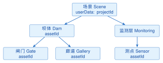
<figcaption>图 6.1  WebGL三维渲染管线中的坐标变换</figcaption>
</figure>

Three.js r160+ 的最小可运行程序必须同时创建场景、相机、渲染器和渲染循环。只有把网格加入场景而没有渲染器，浏览器不会产生任何像素；只有相机而没有更新宽高比，窗口改变大小后会出现拉伸。清单6.4把这些职责放在一个模块中，并在每一帧读取渲染区域尺寸。`setAnimationLoop`由Three.js根据当前渲染器选择合适的动画调度方式，在支持 WebXR 的环境中也能复用。

**清单 6.4  Three.js r160+最小可运行渲染骨架**

```javascript
import * as THREE from 'three';

const canvas = document.querySelector('#scene');
const renderer = new THREE.WebGLRenderer({canvas, antialias: true});
renderer.setPixelRatio(Math.min(window.devicePixelRatio, 2));
renderer.setSize(canvas.clientWidth, canvas.clientHeight, false);
renderer.outputColorSpace = THREE.SRGBColorSpace;

const scene = new THREE.Scene();
scene.background = new THREE.Color(0x102a43);
const camera = new THREE.PerspectiveCamera(45, 1, 0.1, 5000);
camera.position.set(12, 8, 18);

const geometry = new THREE.BoxGeometry(4, 2, 3);
const material = new THREE.MeshStandardMaterial({color: 0x4ea5d9});
const damBlock = new THREE.Mesh(geometry, material);
scene.add(damBlock);
scene.add(new THREE.HemisphereLight(0xddeeff, 0x223344, 1.4));

function resize() {
  const width = canvas.clientWidth;
  const height = canvas.clientHeight;
  if (height === 0) return;
  camera.aspect = width / height;
  camera.updateProjectionMatrix();
  renderer.setSize(width, height, false);
}
window.addEventListener('resize', resize);
resize();
renderer.setAnimationLoop(() => {
  damBlock.rotation.y += 0.002;
  renderer.render(scene, camera);
});
```

颜色管理必须区分“纹理已经是 sRGB 编码”和“光照计算使用线性空间”。r152 以后，渲染器输出使用`outputColorSpace`，常见显示器输出设置为`THREE.SRGBColorSpace`；旧的`outputEncoding`与`sRGBEncoding`不应作为 r160+ 新代码。颜色贴图应标记为 sRGB，法线、粗糙度和金属度贴图保持线性数据。Three.js 当前默认启用`THREE.ColorManagement.enabled`，但项目仍应在初始化处写出假设并在截图回归测试中固定曝光和色调映射。清单6.5把这些假设写成代码：渲染器输出色彩空间、颜色贴图的 sRGB 标注与法线贴图的线性标注各占一行，便于核对。

**清单 6.5  Three.js色彩空间与纹理颜色标注**

```javascript
import * as THREE from 'three';

THREE.ColorManagement.enabled = true;
const renderer = new THREE.WebGLRenderer({antialias: true});
renderer.outputColorSpace = THREE.SRGBColorSpace;
renderer.toneMapping = THREE.ACESFilmicToneMapping;
renderer.toneMappingExposure = 1.0;

const colorMap = new THREE.TextureLoader().load('/textures/concrete-color.png');
colorMap.colorSpace = THREE.SRGBColorSpace;
const normalMap = new THREE.TextureLoader().load('/textures/concrete-normal.png');
// 法线、粗糙度、金属度是线性数据，不要标成 sRGB。
const material = new THREE.MeshStandardMaterial({map: colorMap, normalMap});
```

几何体、材质和光照共同决定水工构件的可读性。几何体负责顶点、索引和法线，材质负责颜色、粗糙度、透明度与纹理，灯光负责把这些属性转换成视线可见的亮度。坝体、闸门和廊道通常需要不同的选择反馈：鼠标悬停只改变材质的高亮状态，选中后才显示属性面板；不要为了改变颜色复制整套几何体，否则会成倍增加显存。场景图应当以工程、构筑物、构件和传感器图层分组，业务 ID 放在`userData`，点击拾取时沿父节点向上查找该 ID。

图6.2展示了这一层级。将业务标识与渲染节点分离后，模型替换、LOD切换和实时数据更新都不会破坏监测对象的引用；反之，如果把“DamGateMesh001”这样的显示名称当成主键，模型导出时重命名就会使告警联动失效。

<figure markdown>

<figcaption>图 6.2  水利三维场景的场景图与业务标识层级</figcaption>
</figure>

透视投影矩阵还涉及深度区间约定。本章采用的 OpenGL/WebGL 矩阵把归一化设备坐标的 $z$ 映射到 $[-1,1]$；WebGPU、Direct3D 以及 Cesium 某些 reverse-Z 配置采用 $[0,1]$，投影矩阵第三行的系数随之改变。把一个 API 的矩阵直接复制到另一个 API 会导致近远裁剪、深度测试或反转深度错误。工程代码应在相机模块记录 API、深度范围、是否 reverse-Z 和近远面，而不是只保存一个四乘四矩阵。

WebGL2 基于 OpenGL ES 3.0，提供顶点数组对象、32 位索引、实例化和多渲染目标等能力。若因旧设备必须使用 WebGL1，兼容范围要写成具体扩展：`OES_vertex_array_object`提供顶点数组对象，`OES_element_index_uint`允许 32 位索引，`WEBGL_draw_buffers`支持多渲染目标；WebGL1 不支持 GLSL ES 3.00、统一缓冲对象（UBO）、实例化内置支持和整型纹理。清单6.6把能力探测集中在初始化阶段，缺失能力时给出可解释的降级，而不是运行到绘制阶段才出现黑屏。

**清单 6.6  WebGL能力探测与兼容性记录**

```javascript
function inspectWebGL(canvas) {
  const gl2 = canvas.getContext('webgl2');
  if (gl2) {
    return {version: 2, instancing: true, indexUint32: true,
      drawBuffers: true, shadingLanguage: 'GLSL ES 3.00'};
  }
  const gl1 = canvas.getContext('webgl');
  if (!gl1) throw new Error('需要支持 WebGL 的浏览器');
  const extensions = {
    vao: Boolean(gl1.getExtension('OES_vertex_array_object')),
    indexUint32: Boolean(gl1.getExtension('OES_element_index_uint')),
    drawBuffers: Boolean(gl1.getExtension('WEBGL_draw_buffers')),
  };
  return {version: 1, ...extensions, instancing: false,
    shadingLanguage: 'GLSL ES 1.00'};
}
```

Three.js 自 r156 起在 npm 包的 `exports` 字段中内置了`three/addons/*`到`examples/jsm/*`的映射，因此 Vite 等现代构建工具无需任何配置即可解析`three/addons/`导入；仍需手工声明别名的只剩“无构建工具、直接用浏览器 importmap”这一种运行方式。两条导入路径指向同一份文件，工程内应统一选用一种写法。清单6.7列出两种环境的对应关系。

**清单 6.7  Three.js addon路径与构建环境对应**

```javascript
// npm + Vite（r156+）：包内置 exports 映射，直接可用
import { GLTFLoader } from 'three/addons/loaders/GLTFLoader.js';
import { OrbitControls } from 'three/addons/controls/OrbitControls.js';

// 浏览器 importmap（无构建工具）：three/addons/ 必须在
// importmap 的 imports 中显式声明后才可解析
import { DRACOLoader } from 'three/addons/loaders/DRACOLoader.js';
```

性能优化必须先建立预算。实例化适合大量共享几何和材质的护栏、植被或测点标记；LOD适合从远到近逐级替换模型；纹理压缩和最大尺寸控制显著影响显存；视锥裁剪、遮挡裁剪和按需加载减少 GPU 与网络工作量。清单6.8用实例化绘制 28 个测点，并以距离切换高低细节模型。实际阈值要依据目标终端帧时间和交互任务测量，不能把“开启实例化”当成所有场景的万能优化。

**清单 6.8  实例化测点与距离驱动的LOD选择**

```javascript
const markerGeometry = new THREE.SphereGeometry(0.08, 8, 6);
const markerMaterial = new THREE.MeshBasicMaterial({color: 0xffcc00});
const markers = new THREE.InstancedMesh(markerGeometry, markerMaterial, 28);
const transform = new THREE.Object3D();
stations.forEach((station, index) => {
  transform.position.fromArray(station.position);
  transform.updateMatrix();
  markers.setMatrixAt(index, transform.matrix);
});
markers.instanceMatrix.needsUpdate = true;
scene.add(markers);

const lod = new THREE.LOD();
lod.addLevel(highDetailModel, 0);
lod.addLevel(mediumDetailModel, 250);
lod.addLevel(lowDetailModel, 800);
scene.add(lod);
```

CPU负责准备缓冲、纹理和绘制命令，GPU执行顶点处理、图元装配、光栅化、片元处理和深度/混合测试。性能差异受场景、设备和实现影响，不使用“固定快10倍或100倍”之类无出处断言；应通过帧时间、绘制调用数和显存占用实测。

### 6.1.4 Three.js场景组织与模型加载

Three.js封装了场景、相机、材质、灯光和渲染器。工程项目宜把测站、坝段、闸门等对象组织为稳定层级，并把业务标识写入`userData`，而不是依赖模型节点的显示名称。

官方addon路径为`three/addons/loaders/GLTFLoader.js`<sup>[[40]](../../references.md#ref40)</sup>。glTF/GLB适合Web交付；加载后仍需检查单位、坐标轴、材质色彩空间和包围盒。清单6.9在加载回调里做了这几项检查，并把业务标识写进`userData`，第7章的拾取就是靠它找回测点的。

**清单 6.9  Three.js 加载 GLTF 工程模型**

```javascript
import * as THREE from 'three';
import { GLTFLoader } from
  'three/addons/loaders/GLTFLoader.js';

const scene = new THREE.Scene();
const loader = new GLTFLoader();
const gltf = await loader.loadAsync('/models/dam.glb');
gltf.scene.userData.assetId = 'DAM-001';
scene.add(gltf.scene);
```

模型交付前应完成网格简化、纹理压缩、法线检查和层级拆分。优化顺序是先测量瓶颈，再选择实例化、LOD、视锥裁剪、遮挡裁剪或按需加载；不同策略的效果必须以目标终端实测为准。

### 6.1.5 把测点挂到坝体上：对象绑定与查找

**业务问题**

`GET /api/assets`返回 28 个对象，每个有经纬度与高程（配套数据集 stations.csv）；场景里要出现 28 个可点击的小球，点到哪个球就要知道它的`assetId`。本小节只做“挂上去、找得到”，坐标转换的精确做法在 6.2 节，拾取交互在第7章 7.4 节。

**做法**

三条规则。第一，业务标识写进`userData.assetId`，永远不用网格名字或数组下标当标识——名字会重复，下标会因为增删而漂移。第二，同类对象放进一个`Group`，删一次清一组，第4章讲的资源释放在三维里表现为“切换工程时把上一组全部 dispose”。第三，从对象到网格的查找用一张`Map`，不要每次遍历场景。清单6.10把这三条写成一个函数；输入就是契约的`AssetDto`加上台账里的坐标，输出是可被拾取的组。局部坐标此处简单地把经纬度差乘以米/度换算、高程直接作 y，6.2 节会解释为什么真正的工程场景不能这样做。

**清单 6.10  bind-assets.js：把对象列表绑定为场景中的可拾取网格**

```javascript
import * as THREE from 'three';

const ORIGIN = { lon: 111.2, lat: 30.5 };                 // 场景局部原点（坝轴线附近）
const M_PER_DEG_LAT = 111_000;                             // 教学近似；6.2 节改用投影坐标
const M_PER_DEG_LON = 111_000 * Math.cos(ORIGIN.lat * Math.PI / 180);

export function bindAssets(scene, assets) {
  const group = new THREE.Group();
  group.name = 'assets';
  const byId = new Map();                                  // assetId -> Mesh
  const geometry = new THREE.SphereGeometry(1.5, 16, 16);  // 所有测点共用几何体
  for (const a of assets) {
    const mesh = new THREE.Mesh(geometry, new THREE.MeshStandardMaterial({ color: 0x1565c0 }));
    mesh.position.set((a.longitude - ORIGIN.lon) * M_PER_DEG_LON,
                      a.elevation_m,                          // 高程直接作 y
                      -(a.latitude - ORIGIN.lat) * M_PER_DEG_LAT);
    mesh.userData.assetId = a.assetId;                       // 唯一的业务标识
    group.add(mesh);
    byId.set(a.assetId, mesh);
  }
  scene.add(group);
  return {
    group, byId,
    find: assetId => byId.get(assetId),
    dispose() {                                              // 切换工程时整组释放
      scene.remove(group);
      geometry.dispose();
      group.traverse(o => o.material?.dispose());
      byId.clear();
    }
  };
}

// 用法：const bound = bindAssets(scene, assets);  bound.find('DAM-A-PZ-07').material.color.set(0xffa000);
```

**可观察结果与检查表**

调用后坝体附近出现 28 个蓝色小球；控制台执行`bound.find(’DAM-A-PZ-07’).position`应得到一个 y 约等于台账中该测点高程的向量。表6.2是交付前必须逐项核对的清单——对象映射错一个，第7章曲线就会挂到错误的球上，而页面不会报任何错。

**表 6.2  对象绑定的坐标与映射检查表**

| 检查项       | 怎么查                                                            | 不通过的表现                                     |
|:-------------|:------------------------------------------------------------------|:-------------------------------------------------|
| 数量一致     | `group.children.length` 等于接口返回的对象数                      | 少球：有对象缺坐标被跳过；多球：上一次未 dispose |
| 标识唯一     | `byId.size` 等于对象数                                            | 重复 assetId 覆盖，两个球只找得到一个            |
| 高程合理     | 所有球的 y 在坝基 120.0与坝顶 172.0之间（雨量站可高于坝顶）       | 有球在地下或天上：高程列单位或基准错             |
| 水平位置合理 | 球到原点的水平距离小于 1 km                                       | 经纬度写反（lat/lon 互换）时球会飞出几十公里     |
| 切换后无残留 | `dispose()` 后 `scene.``getObjectByName(``’assets’)` 为 undefined | 内存与球一起累积                                 |

## 6.2 GIS服务、坐标与二三维集成

**本节层次**

核心：6.2.2、6.2.3；指导实践：6.2.1；拓展：6.2.4。核心路线只要求读完核心小节。

### 6.2.1 OGC地图与要素服务

WMS根据请求范围、尺寸、坐标参考系和样式动态渲染地图图像；WMTS按预定义瓦片矩阵提供地图瓦片，便于缓存和大规模浏览；WFS提供可查询的矢量要素；WCS覆盖栅格数据本体，可按范围和波段取得原始像元值，适合DEM取值与淹没分析<sup>[[41]](../../references.md#ref41)[[42]](../../references.md#ref42)[[43]](../../references.md#ref43)</sup>。3D Tiles是OGC社区标准，按层次细节（LOD）流式加载大规模三维对象，适合把BIM、倾斜摄影和点云交付到浏览器。表6.3把这些服务按“返回什么”并列：WMS返回按请求参数渲染出来的图像，WMTS返回预先切好的瓦片，WFS返回可查询的矢量要素本身，WCS返回可分析的栅格覆盖，3D Tiles返回带层次结构的三维内容。选型时先确定业务需要的是图像、瓦片、要素、原始像元还是三维流式内容，再决定服务路线。

**表 6.3  常用OGC服务的职责**

| 服务     | 返回内容       | 主要特点                | 适用场景            |
|:---------|:---------------|:------------------------|:--------------------|
| WMS      | 动态地图图像   | 范围与样式灵活          | 专题图叠加          |
| WMTS     | 预定义地图瓦片 | 易缓存、吞吐高          | 稳定底图            |
| WFS      | 矢量要素       | 可查询属性与几何        | 河道、测站编辑查询  |
| WCS      | 栅格覆盖       | 返回原始像元与波段      | DEM取值、淹没分析   |
| 3D Tiles | 三维瓦片内容   | LOD流式加载、按视域请求 | BIM、倾斜摄影、点云 |

经典OGC服务常用KVP（Key-Value Pair）请求表达操作。下面三条最小请求分别展示图像、要素和覆盖数据的返回类型；实际项目还需加入认证、版本、异常格式和服务地址。WMS 1.3.0使用`CRS`参数而不是旧版本的`SRS`；当坐标系为EPSG:4490时，规范轴序是纬度在前、经度在后，`BBOX`应按该顺序填写。客户端若沿用“经度,纬度”的习惯，会得到空白图或位置偏移。清单6.11是取一张底图的最小请求，注意`CRS`与`BBOX`两个参数必须配套。

**清单 6.11  WMS 1.3.0 GetMap最小请求**

```http
GET /geoserver/water/wms?SERVICE=WMS&VERSION=1.3.0
  &REQUEST=GetMap&LAYERS=water:reservoir
  &STYLES=&CRS=EPSG:4490
  &BBOX=34.20,113.70,34.30,113.85
  &WIDTH=1024&HEIGHT=768&FORMAT=image/png
```

清单6.12取的则是矢量要素本身而不是渲染好的图片，返回 GeoJSON 后可以直接参与前端的属性查询与空间判断。

**清单 6.12  WFS GetFeature最小请求**

```http
GET /geoserver/water/ows?SERVICE=WFS&VERSION=2.0.0
  &REQUEST=GetFeature&TYPENAMES=water:station
  &SRSNAME=EPSG:4490&COUNT=100
  &BBOX=113.70,34.20,113.85,34.30,EPSG:4490
  &OUTPUTFORMAT=application/json
```

注意轴序：EPSG:4490 的官方定义是纬度在前，但 GeoServer 对简写`EPSG:4490`形式的`SRSNAME`默认按经度在前处理，本例即按此约定书写；若改用`urn:ogc:def:crs:EPSG::4490`形式，BBOX 必须交换为纬度在前，这是 WFS 联调中最常见的“查不到要素”原因。第三类是栅格：清单6.13用 WCS 取回带高程数值的覆盖数据，它和 WMS 的区别在于返回的是可参与计算的数值，不是一张看图。

**清单 6.13  WCS GetCoverage最小请求**

```http
GET /geoserver/water/ows?SERVICE=WCS&VERSION=2.0.1
  &REQUEST=GetCoverage&COVERAGEID=water:dem
  &SUBSET=Long(113.70,113.85)&SUBSET=Lat(34.20,34.30)
  &FORMAT=image/tiff
```

读者可以比较三条请求的响应：GetMap是渲染后的PNG，适合叠加展示；GetFeature是带属性和几何的要素集合，适合查询、编辑和业务联动；GetCoverage保留栅格像元，适合读取高程、分类值或模型输入。WCS的响应不能被当成“已经画好的图片”，否则淹没分析会失去原始数值。OGC API系列（Features、Tiles、Coverages、Maps）正在逐步补充和替代经典OWS的接口形态，新建平台应评估其资源化路径，并与第9章关于开放接口演进的讨论保持一致。

服务选型还要考虑数据生命周期。WMS样式和图例变化时可以重新渲染，不必重建原始数据；WMTS适合版本稳定的底图，更新时按区域和层级增量切片；WFS的属性字段属于业务契约，字段改名应通过版本化接口发布；WCS的覆盖数据需要保留像元分辨率、NoData值、单位和采样时间，供模型计算复现；3D Tiles则在每个瓦片中维护几何、纹理和层级元数据，客户端按视域和屏幕误差请求内容。把这些服务混在一个“地图接口”里，会使缓存策略、权限边界和数据更新节奏互相牵制。

WMS请求的范围、宽高和样式直接影响渲染开销，值班员查看监测专题图时可以限制最大图片尺寸和并发数；WFS查询应设置要素数量上限、空间过滤和返回字段白名单，避免一次请求拖出全库；WCS需要限制覆盖范围、波段和输出格式，防止把整幅DEM下载到浏览器；3D Tiles通过最大屏幕空间误差和最大同时加载瓦片数控制显存。服务端应把这些上限写进能力文档和错误响应，客户端看到限制错误后缩小范围或改用异步任务，而不是无限重试。

安全上，GetCapabilities、GetMap等公开能力与测站属性、原始DEM和工程模型的访问级别不同。GeoServer工作空间、图层和样式分别配置角色权限，服务网关再加入令牌校验、速率限制和审计日志；缓存键必须包含用户可见范围和数据版本，避免把受限图层的瓦片返回给其他角色。WFS和WCS的查询参数进入数据库或栅格处理器前要做白名单校验，日志记录请求摘要、traceId、图层、CRS和耗时，不记录完整令牌。

GeoServer发布前应先用小范围样本检查坐标轴和像元值，再扩大到完整覆盖。GetMap通过肉眼检查颜色和图例，GetFeature检查属性、几何和坐标轴，GetCoverage抽取几个像元与原始文件对比，3D Tiles则检查LOD切换、纹理色彩空间和业务ID是否保留。冒烟通过后才启动GWC预生成；预生成任务按层级和行政/工程范围拆分，失败任务可重跑，缓存目录采用版本号避免新旧瓦片混用。

OGC API路线强调资源、链接和可发现性，Features返回集合与分页链接，Tiles返回瓦片集和模板，Coverages返回覆盖描述与子集能力，Maps返回渲染结果及样式信息。经典WMS/WFS/WCS仍然是存量系统的主流接口，因此平台可以采用“兼容层+新接口”策略：内部数据模型保持统一，外部根据客户端能力选择OWS或OGC API；迁移期间对同一测站和DEM样本做双接口结果比对，确认坐标、属性和像元值一致后再逐步切换。

三维场景与二维服务的联动也要有明确边界。Cesium加载3D Tiles只负责空间表达，测站状态、质量码和预警等级仍从业务API按稳定ID查询；WMS/WMTS作为背景或专题叠加，WFS用于点选和编辑，WCS为淹没分析提供原始栅格输入。告警事件发生时，前端可以改变构件颜色和标签，但不把渲染颜色写回原始模型或瓦片。这样，模型版本、地图服务版本和业务数据版本各自可回滚，三维页面的视觉状态也能追溯到具体的服务响应。

**服务能力文档与故障处理**

每个服务都应维护一份能力文档，列出服务版本、操作、图层或覆盖名称、坐标参考系、轴序、输出格式、最大请求范围和异常编码。文档中的示例请求使用脱敏域名和小范围数据，读者可以替换地址后直接验证。平台启动时对GetCapabilities做健康检查，检查图层是否存在、CRS是否和数据库元数据一致；运行中持续记录响应时延、返回字节、缓存命中率、4xx/5xx数量和上游数据库耗时。当WMS渲染失败时，前端显示专题图不可用但保留基础底图；当WFS或WCS不可用时，相关查询按钮进入受控禁用状态，避免把空结果当成“没有测站”或“没有积水”。

GeoServer的样式、图层权限和GWC缓存配置应与数据版本一起纳入发布包。样式变更可能改变WMS像素结果，但不应改变WFS属性或WCS像元；因此图层发布记录需要分别保存样式版本和数据版本。缓存键至少包含图层、样式、CRS、范围、宽高、时间维度和数据版本，清理任务按版本或区域执行。对有时间维度的水位或降雨图层，缓存时间参数必须参与键计算，否则新旧时刻会显示同一张图片。

3D Tiles发布还要检查瓦片内容的空间参考、几何误差和属性透传。每个瓦片的包围体用于视锥和屏幕空间误差判断，包围体错误会造成过早卸载或加载过多；纹理需要按颜色空间标注，业务属性应通过稳定ID关联到后端，不把完整监测记录塞进瓦片。转换工具输出日志包含源模型、坐标转换、LOD阈值、纹理压缩和失败对象，抽样加载根节点、中间层和叶节点后再开放服务。模型更新采用新目录和新版本号，客户端完成切换后再回收旧目录，避免长连接用户读到半发布状态。

在课堂实验中，可以用同一个水库范围分别请求GetMap、GetFeature和GetCoverage：先把WMS图像叠加在Cesium地球上，再点击WFS测站取得属性，最后从WCS读取DEM像元计算局部高程；若三者的CRS、范围或轴序不一致，叠加结果会立即暴露偏移。实验报告应记录请求参数、响应头、关键字段、像元单位和错误处理，并解释为何3D Tiles不能替代WCS的数值覆盖。这个流程把协议学习与水利业务任务连起来，也为后续数字孪生闭环提供可复用的服务测试样例。

服务迁移到OGC API时，先建立资源目录和链接关系，再为旧客户端保留兼容代理。代理层负责把旧KVP参数转换为新的路径和查询参数，同时记录原始请求与新请求的对应关系；双写或双读期间对同一范围进行结果哈希、属性数量和像元统计比较。迁移完成后，能力文档标出推荐接口和弃用时间，监控面板按接口版本分别统计流量，确保没有客户端在不知情的情况下被切断。开放接口的演进应当以数据一致性、权限一致性和可观测性为验收条件，而不是只看URL是否更现代。

故障演练时可以人为关闭GWC、限制WCS范围或撤销某个图层权限，观察客户端是否展示清晰状态、服务端是否记录审计、缓存是否保持版本隔离。演练结果进入运行手册，下一次发布前由值班员按同一脚本复核。

复核还应覆盖错误坐标系、越界范围、超大图片、未知图层和过期令牌等异常输入，检查服务是否返回稳定错误码并且不泄露内部路径。异常请求的traceId与发布版本写入审计记录，便于把一次空白地图还原为具体的参数和配置。 对异常响应还要检查Content-Type、错误码和重试建议，前端按契约展示可操作的提示。 服务端同时限制错误详情长度，避免把数据库或文件系统信息暴露给外部用户。 客户端日志只保留必要上下文和traceId。 故障恢复后再开放自动刷新。 恢复记录应关联演练编号和验证人员。 并标注验证结果。 记录已归档并可追溯。 后续复测沿用同一编号和样本。

教学示例使用自建GeoServer，不依赖商业底图密钥。清单6.14用自建服务的 WMTS 图层替换掉 Cesium 默认的在线底图，这样课堂环境断网或没有密钥时场景仍然能出图：

**清单 6.14  Cesium 无商业底图密钥的 WMTS 初始化**

```javascript
const viewer = new Cesium.Viewer('scene', {
  baseLayer: false,
  baseLayerPicker: false,
  geocoder: false,
  timeline: false,
  animation: false
});
const imagery = new Cesium.WebMapTileServiceImageryProvider({
  url: 'https://gis.example.edu/geoserver/gwc/service/wmts',
  layer: 'water:cgcs2000_basemap',
  style: 'default',   // 与 GetCapabilities 中的样式标识一致
  format: 'image/png',
  tileMatrixSetID: 'EPSG:4490',
  // GeoServer GWC 的矩阵标识形如 "EPSG:4490:0"，
  // 不显式给出 labels 时 Cesium 按纯数字层级请求会全部 404
  tileMatrixLabels: Array.from({ length: 19 },
    (_, level) => `EPSG:4490:${level}`),
  tilingScheme: new Cesium.GeographicTilingScheme(),
  maximumLevel: 18
});
viewer.imageryLayers.addImageryProvider(imagery);
```

实际部署需要将示例域名替换为课程或项目服务器，并在服务端配置跨域、访问控制和缓存策略。Cesium示例关闭了Ion底图、地形、地理编码、时间轴和动画组件，因此不会隐式请求商业token；业务底图只来自自建GeoServer。由于EPSG:4490是地理坐标瓦片矩阵，必须使用`GeographicTilingScheme`，并把`maximumLevel`设置为GWC gridset实际提供的最大层级；`tileMatrixLabels`必须与 GetCapabilities 报告的矩阵标识逐层对应，这是自建 gridset 最常见的联调故障点。GeoServer GWC默认内置EPSG:4326与EPSG:900913两个gridset，EPSG:4490需要手工创建并核对原点、瓦片宽高、比例尺和矩阵层级。

GeoServer发布流程可以拆成四个可回滚步骤：先在工作区登记数据源和坐标元数据，再创建工作空间和图层，随后配置样式与访问权限，最后在GWC中创建或绑定gridset并预生成热点区域缓存。发布前用GetCapabilities确认服务版本、图层名和CRS，发布后用一条GetMap、一条GetFeature和一条GetCoverage请求做冒烟测试。缓存清理和重新切片要有任务 ID 与进度记录，不在高峰时段直接删除全部瓦片。

**清单 6.15  GeoServer GWC EPSG:4490 gridset配置要点**

```yaml
gridSet:
  name: EPSG:4490
  srs: 4490
  tileWidth: 256
  tileHeight: 256
  extent: [113.0, 34.0, 114.0, 35.0]
  metersPerUnit: 111319.490793
  levels:
    # 层 0 让 1°×1° 范围恰好落入一张 256×256 瓦片：
    # 1/256 ≈ 0.00390625 度/像素，逐层减半
    - {level: 0, resolution: 0.00390625}
    - {level: 1, resolution: 0.001953125}
  cacheLayers:
    - water:cgcs2000_basemap
```

清单6.15是教学配置片段，真实项目需从测区范围和服务规范计算分辨率、矩阵宽高与最大层级。若图层声明的CRS与gridset不一致，缓存会在切片阶段产生错位；若最大层级没有和Cesium的`maximumLevel`同步，客户端会持续请求不存在的瓦片并制造404噪声。发布脚本应把这两项作为启动前检查。

### 6.2.2 CGCS2000与投影坐标

CGCS2000地理二维坐标系代码是EPSG:4490<sup>[[44]](../../references.md#ref44)</sup>，EPSG:4326对应WGS 84。CGCS2000参考椭球长半轴为6378137米、扁率倒数为298.257222101；它与WGS 84椭球参数极为接近，但不能在坐标定义中直接写成`datum=WGS84`。

我国大陆范围的6度高斯—克吕格分带为13至23带。经度$\lambda$所在带号可按 $$N=\left\lfloor\frac{\lambda}{6}\right\rfloor+1,
  \qquad \lambda_0=6N-3$$ 确定中央经线。大比例尺水利测图还常采用3度带，带号与中央经线为 $$n=\left\lfloor\frac{\lambda-1.5}{3}\right\rfloor+1,
  \qquad \lambda_0=3n.$$ 带号是投影分带的计算结果，不是流域名称的固定属性；黄河、长江等跨区域工程应依据每个数据集的经度范围、比例尺和项目坐标规范选择分带。代码不能硬编码某一固定带号，也不能在未标注3度带或6度带口径时引用带号区间。

CGCS2000的EPSG代码还要区分地理坐标、带号前缀和无前缀东坐标。表6.4列出本章涉及的范围，工程交付时应在元数据中同时写出EPSG代码、中央经线、带宽、尺度因子和东坐标是否带号前缀。

**表 6.4  CGCS2000高斯—克吕格分带EPSG对照**

| 坐标类型          | EPSG范围  | 说明                                     |
|:------------------|:----------|:-----------------------------------------|
| 3度带（带号前缀） | 4513–4533 | 以带号标识的工程平面坐标，中央经线为$3n$ |
| 3度带（无前缀）   | 4534–4554 | 东坐标不拼接带号，交付时仍需记录带号     |
| 6度带（带号前缀） | 4491–4501 | 以6度带号标识，中央经线为$6N-3$          |
| 6度带（无前缀）   | 4502–4512 | 适合项目统一平面坐标，带号写入元数据     |
| 地理二维坐标      | 4490      | CGCS2000经纬度，单位为度                 |

图6.3把“经度—分带—投影—场景原点”的关系画成一条可审计链。任何一步缺少带宽或中央经线，后续三维定位都只能算近似结果。

<figure markdown>
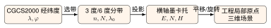
<figcaption>图 6.3  从CGCS2000经纬度到工程三维场景的坐标链</figcaption>
</figure>

清单6.16用经度计算两种带宽的带号和中央经线，结果应和坐标数据的EPSG元数据交叉检查。浮点经度靠近分带边界时，要保留原始经度精度并由项目负责人确认是否采用邻带或统一工程坐标。

**清单 6.16  3度带与6度带带号计算**

```javascript
function gaussKrugerZone(longitude) {
  const sixDegree = Math.floor(longitude / 6) + 1;
  const threeDegree = Math.floor((longitude - 1.5) / 3) + 1;
  return {
    sixDegree: {number: sixDegree, centralMeridian: 6 * sixDegree - 3},
    threeDegree: {number: threeDegree, centralMeridian: 3 * threeDegree}
  };
}
console.log(gaussKrugerZone(113 + 42 / 60));
```

下面示例把CGCS2000经纬度转换到中央经线111度的6度带（19带），采用无前缀东坐标。`tmerc`表示横轴墨卡托/高斯—克吕格计算；GRS80与CGCS2000椭球参数一致，`+k_0`是PROJ 6+推荐写法，`+no_defs +type=crs`用于明确坐标定义。带号写入元数据，交付系统若要求带号前缀，再按项目规范转换。清单6.17把这段定义写成 proj4 字符串并做一次往返转换，往返误差应在毫米量级；误差过大通常说明椭球或中央经线填错了。

**清单 6.17  proj4 定义 CGCS2000 与高斯——克吕格转换**

```javascript
const CGCS2000 =
  '+proj=longlat +ellps=GRS80 +no_defs +type=crs';
const GK19 =
  '+proj=tmerc +lat_0=0 +lon_0=111 +k_0=1 '
  + '+x_0=500000 +y_0=0 +ellps=GRS80 '
  + '+units=m +no_defs +type=crs';

proj4.defs('CGCS2000', CGCS2000);
proj4.defs('CGCS2000_GK19', GK19);
const projected = proj4('CGCS2000', 'CGCS2000_GK19',
                        [113 + 42 / 60, 34.20]);
```

### 6.2.3 高程基准与空间一致性

GNSS通常给出椭球高$h$，水利工程常使用1985国家高程基准下的正常高$H_\gamma$。二者通过高程异常$\zeta$联系： $$H_\gamma=h-\zeta.$$ 正常高对应我国采用的正常重力场和高程异常；若业务数据采用正高，则应使用大地水准面差距$N$并计算 $$H_g=h-N.$$ 两种高程不能混写为同一个“海拔”字段。淹没线、闸顶和监测点高程必须记录高程类型、基准、单位、转换模型和版本，转换模型由测绘专业人员按区域成果确认。

高程异常具有明显的区域性。按重力似大地水准面模型CNGG2011的统计，我国大陆范围内高程异常约在$-68\,\mathrm{m}$至$+28\,\mathrm{m}$之间<sup>[[45]](../../references.md#ref45)</sup>：负极值出现在受印度洋大地水准面低谷影响的西部地区，正极值出现在东南部；同一测区内部的变化通常在米级到十米级。这里的数值用于帮助学生建立数量级概念，工程计算应采用测区批准的似大地水准面或高程异常模型，例如CNGG2011或省级加密模型，并在元数据中记录模型名称、版本、格网分辨率、适用范围和发布日期。模型文件随成果归档，程序不得用固定常数替代区域模型。

清单6.18把高程转换写成显式函数，输入值和输出值都保留单位与基准标签；当缺少异常模型时，程序应拒绝静默换算。

**清单 6.18  椭球高到正常高与正高的转换**

```javascript
function convertHeight({h, kind, anomaly}) {
  if (!Number.isFinite(h) || !Number.isFinite(anomaly)) {
    throw new Error('高程与异常值必须为有限数');
  }
  // anomaly：正常高用高程异常ζ，正高用大地水准面差距N，
  // 二者来自不同模型成果，调用方必须按 kind 传入对应值
  if (kind === 'normal') return {value: h - anomaly, datum: '1985-normal'};
  if (kind === 'orthometric') return {value: h - anomaly, datum: 'orthometric'};
  throw new Error('必须明确 normal 或 orthometric 高程类型');
}
const normal = convertHeight({h: 245.30, kind: 'normal', anomaly: -8.62});
```

对于同一控制点，转换后的高程还要与水准测量或批准的似大地水准面模型做独立核对。平面投影和高程转换是两条不同链路：前者改变水平坐标，后者改变竖向基准，任何一条链路缺少版本都会使三维场景看似对齐而实际存在系统偏差。

**坐标元数据的最小契约**

坐标字段不应只保存三个数字。一个可交付的数据集至少需要记录水平坐标参考系、投影方法、带宽、带号、中央经线、尺度因子、假东/假北、东坐标是否带号前缀、高程类型、高程基准、单位、时间基准、精度等级、转换模型版本和生产软件版本。对于来自不同单位的数据，还要记录原始坐标、转换前后的EPSG代码以及转换日期。这样，后续人员可以判断一个“偏移2米”的问题究竟来自单位误读、带号丢失、轴序颠倒还是局部原点平移，而不是靠肉眼拖动模型。

工程数据库可以把这些信息拆成数据集级元数据和要素级属性。数据集级元数据适合保存统一的CRS和版本；要素级属性保存测站、控制点或构件的采集方法、精度和质量标识。若同一图层混合了不同来源，应在入库时拆分为多个数据集并建立转换记录。坐标转换成功不等于精度满足要求，转换记录还要保存控制点数量、残差统计和审核人，便于在成果复核时重算。

**投影选择与变形控制**

高斯—克吕格投影把椭球面映射到平面，会产生长度、角度或面积变形。中央经线附近的长度变形较小，距离中央经线越远，变形越明显；因此大比例尺坝址测图通常选择覆盖工程范围的3度带或局部工程坐标。流域级展示可以使用统一的地理坐标或适合可视化的投影，但测量成果、断面计算和放样数据必须保留其测绘坐标。三维场景的局部原点只用于降低浮点误差，不改变原始测量坐标；平移矩阵应作为场景配置发布，并能反向恢复到工程坐标。

当项目跨越分带边界时，应在设计阶段确定一套主坐标和一套交换坐标。主坐标服务于施工放样、结构测量和变形监测，交换坐标服务于跨区域地图、遥感影像和外部服务。两者之间通过明确的七参数、控制点或官方转换网格连接，转换结果写入新数据集而不是覆盖原始文件。图层发布时在标题和服务能力文档中标注CRS，客户端据此选择坐标轴顺序、瓦片矩阵和单位，避免把一个带的东坐标误当成另一个带的局部坐标。

**轴序、单位与序列化**

EPSG定义的坐标轴顺序与许多Web API的习惯并不总是一致。GeoJSON通常以经度、纬度序列化，WMS 1.3.0在某些EPSG坐标系下按规范使用纬度、经度；工程接口应在契约中写明轴序，并使用带名称的对象字段或显式数组顺序。长度统一用米、角度统一用度，角度的度分秒输入必须先转换为十进制度再进行带号计算。数据库字段类型与精度也要与坐标用途匹配：经纬度保留足够小数位，工程平面坐标保留毫米或项目规定的精度，高程字段同时保存数值和基准枚举。清单6.19把轴序、单位和基准做成必填的元数据字段并在入口处校验，缺项直接拒绝，不让“默认是经度在前”这类假设留在代码里。

**清单 6.19  坐标元数据校验与轴序显式化**

```javascript
function validateCoordinate(point, metadata) {
  if (metadata.axisOrder !== 'lon-lat') {
    throw new Error('接口契约要求显式声明经度/纬度轴序');
  }
  if (metadata.unit !== 'degree' || metadata.epsg !== 4490) {
    throw new Error('经纬度输入必须是 EPSG:4490 度单位');
  }
  if (point.lon < -180 || point.lon > 180 ||
      point.lat < -90 || point.lat > 90) {
    throw new Error('经纬度超出合法范围');
  }
  return {x: point.lon, y: point.lat, crs: `EPSG:${metadata.epsg}`};
}
```

**误差传播与验收**

坐标转换的误差来自控制点测量、投影计算、模型拟合、数据舍入和软件实现。评估时应把平面和高程分开统计，分别报告最大绝对误差、均方根误差、样本数量和空间分布。一个控制点恰好通过并不代表整个工程可靠；控制点应覆盖坝轴线两端、闸室、廊道出入口和场景边界，避免所有点集中在同一小块区域。对同名点做独立检查时，平面误差可按东、北分量和点位合成误差报告，高程误差按对应基准比较。

当平面坐标进入Three.js时，通常要先减去局部原点$(E_0,N_0,H_0)$，再按米制缩放和场景轴约定旋转。局部变换的逆运算必须保留：点击场景中的测站后，系统先把局部坐标加回原点，再转换到EPSG:4490或工程平面坐标，最后调用后端查询。若只保存渲染后的浮点坐标，用户看到的构件无法与测量成果或监测数据库建立可复核关系。清单6.20把正反两个方向写在一起，正是为了让这条逆运算不被遗漏。

**清单 6.20  工程坐标与三维局部原点互转**

```javascript
function toLocal(enginePoint, origin) {
  return {x: enginePoint.east - origin.east,
    y: enginePoint.height - origin.height,
    z: enginePoint.north - origin.north};
}
function toEngine(localPoint, origin) {
  return {east: localPoint.x + origin.east,
    height: localPoint.y + origin.height,
    north: localPoint.z + origin.north};
}
```

**转换流水线的审计步骤**

数据接收阶段先读取坐标参考系和高程基准，缺少元数据的数据进入隔离区；预处理阶段按带宽、中央经线和轴序完成转换，保留原始文件和工具版本；质量阶段用独立控制点计算残差，检查是否存在整体平移、旋转或比例误差；发布阶段生成服务能力文档、EPSG声明和数据字典；运行阶段对新增测点继承同一转换配置，并在配置变更时重新运行回归检查。任何一步失败都应返回明确的错误原因，值班员可以据此补齐资料或回退版本。

三维平台还要处理动态数据的时间基准。监测值的时间戳、坐标采集时间和模型发布时刻应分别保存，不能把“当前显示时间”写回测量数据。洪水演进动画可以在局部坐标中播放，但每个水位面、测点状态和告警事件仍需关联原始时间基准。跨系统交换时使用带时区的ISO 8601或明确的UTC毫秒值，服务端统一转换，前端只负责格式化展示。

**典型排错路径**

当模型整体偏东时，先检查经度/纬度轴序和东坐标前缀；当模型尺度异常时，检查米与度、毫米与米的单位；当高程上下错位时，检查椭球高、正常高和正高的字段含义；当只有某个图层错位时，检查该图层的EPSG和瓦片矩阵；当误差随距离中央经线增大时，检查3度带/6度带选择和中央经线。把症状映射到可能的元数据字段，通常比修改顶点数组更快恢复正确结果。

**3度带计算实例与边界处理**

以经度113°42′E为例，先将度分秒转换为十进制度$113.7^\circ$。按6度带公式得到$N=\lfloor113.7/6\rfloor+1=19$，中央经线为111°；按3度带公式得到$n=\lfloor(113.7-1.5)/3\rfloor+1=38$，中央经线为114°。这个例子说明同一个测站在不同带宽下拥有不同带号和中央经线，EPSG选择不能只依据“区域名称”。若测站靠近分带边界，项目应在设计文件中写明采用邻带、跨带统一投影或局部工程坐标，并在转换报告中给出边界两侧的误差比较。

高程实例中，$h=245.30\,\mathrm{m}$、$\zeta=-8.62\,\mathrm{m}$时，正常高为$H_\gamma=245.30-(-8.62)=253.92\,\mathrm{m}$。这个结果并不意味着把负号“修正”为正号；异常值的符号属于模型定义，程序只执行公式并保留输入值。若同一位置还提供了大地水准面差距$N$，正高应使用$H_g=h-N$单独计算，二者的差异应在数据字典中解释。

**从测量成果到服务发布**

测量成果进入平台时，建议划分“原始区、标准区、发布区”三层。原始区保存外业文件和原始坐标，不做覆盖；标准区完成EPSG、单位、高程基准和质量码统一，生成带版本的数据库表；发布区根据WMS、WFS或三维瓦片的服务需求生成切片、索引和缓存。每层都保存源文件哈希、处理工具、参数和责任人，服务刷新只读取通过质量检查的标准区数据。出现定位问题时，可按哈希和版本回放整个处理链。

服务接口的坐标参数应使用结构化对象，例如`crs: "EPSG:4490", axisOrder: "lon-lat", coordinates: [113.7,34.2]`，而不是把“113.7,34.2”拼成无上下文字符串。投影平面接口应另外返回单位、中央经线和带号；客户端把数据转换为局部原点时，将原点、旋转角和缩放系数写入场景配置。这样，三维拾取、二维地图查询和后端空间分析共享同一份可验证的坐标契约。

**精度预算与变更控制**

坐标精度预算应在需求阶段分配到数据采集、控制测量、转换计算、模型简化和渲染显示。测量层的毫米级精度经过投影和局部原点平移后仍需保持可逆；模型简化允许视觉误差，但不能改变用于定位闸门或测点的控制顶点；屏幕显示可以按像素取整，查询和分析仍使用原始米制坐标。每次改变中央经线、局部原点或高程模型，都应重新生成控制点报告并对比上一版本的残差和服务范围。

对于长期运行的数字孪生平台，坐标配置属于基础设施契约而非前端常量。配置中心记录当前版本，后端接口在响应中返回坐标版本，前端加载模型时校验版本是否匹配；版本不匹配时显示待更新状态并停止自动叠加，避免把新测量数据错误投到旧场景。迁移完成后再解除限制，并保留一段时间的双版本查询用于回归。

**小结性检查表**

提交前逐项检查：是否写出3度带或6度带口径；是否给出中央经线和EPSG；东坐标前缀是否与服务契约一致；椭球高、正常高、正高是否分字段；轴序和单位是否在接口文档声明；局部原点是否可逆；控制点和残差报告是否归档；三维模型、二维图层和监测数据库是否共享同一转换版本。只有这些条件同时满足，场景中的“对齐”才具有测量意义和审计价值。

坐标服务的验收还应包含可重复性测试：用同一组经纬度和元数据在开发机、CI和生产镜像中转换，比较东、北坐标和高程的差异；差异超过约定精度时，冻结发布并检查PROJ数据文件、浮点模式和参数顺序。测试样本既要包含中央经线附近的点，也要包含分带边缘、南北方向和高程异常符号变化的点。对外发布的服务能力文档、数据库迁移和前端场景配置使用同一版本号，部署后由值班员抽查一个测站完成“地图点选—三维拾取—后端查询—原始坐标回放”闭环。该闭环证明坐标不仅在画面上重合，也能够支撑监测、分析和审计。

对于教学实验，学生可以先用一个已知控制点验证公式，再扩展到整批测站。实验报告应列出原始经度、带宽、带号、中央经线、投影参数、转换后坐标、局部原点和误差统计；若采用软件默认值，说明默认值的来源和适用条件。报告还应给出一个故意改变轴序或高程类型的反例，观察地图、三维模型和查询结果如何分离，从而把“坐标元数据”理解为可执行的工程约束，而不是表格中的附属说明。

在验收记录中还要标注转换执行的日期、操作者和软件环境，保留输入文件哈希与输出文件哈希。后续若更新PROJ数据库或高程模型，先在隔离环境重算并比较差异，再决定是否发布新版本；旧版本数据保持可查询，便于审计和回滚。

坐标版本更新还应通知地图服务、三维瓦片和监测接口的维护者，形成变更单与回滚点；发布说明列出受影响的图层、测站和查询时间窗，值班员据此安排抽查。 转换链中的每个参数都应能由脚本读取并打印，避免人工复制时丢失小数位或符号。 验收人员依据同一脚本和样本数据复核结果，复核记录与发布版本一并归档。 复核过程同时检查坐标轴方向、单位和高程基准标签，确保数值与语义保持一致。 若标签缺失，数据进入隔离区等待补全后再发布。 补全后重新执行同一套样本校验并更新审核状态。 审核状态还应记录复核人、复核时间和使用的样本版本。 并保留复核结论。

二三维集成应建立统一空间元数据：水平CRS、高程基准、时间基准、单位、精度等级和转换记录。对关键坝轴线、控制点和监测点进行同名点校核，发现系统偏差时回到数据生产环节处理，而不是在前端用手工偏移掩盖。

### 6.2.4 Cesium场景集成

Cesium的`Cesium3DTileset.fromUrl`返回Promise，应等待对象创建完成后再加入场景<sup>[[46]](../../references.md#ref46)</sup>；清单6.21用`await`而不是已废弃的`readyPromise`：

**清单 6.21  Cesium 加载 3D Tiles 瓦片集**

```javascript
try {
  const tileset = await Cesium.Cesium3DTileset.fromUrl(
    '/tiles/dam/tileset.json'
  );
  viewer.scene.primitives.add(tileset);
  await viewer.zoomTo(tileset);
} catch (error) {
  console.error('三维瓦片加载失败', error);
}
```

业务图层采用稳定标识关联测站与工程对象。点击三维构件后，前端用标识查询后端状态；数据更新只改变颜色、标签或图表，不重复创建整个模型。

## 6.3 倾斜摄影与BIM模型构建

**本节层次**

拓展：6.3.1、6.3.2、6.3.3。本节没有核心小节，课堂核心路线可整体跳过。

### 6.3.1 倾斜摄影数据生产

倾斜摄影通过垂直与多个倾斜视角获取影像，用于恢复工程及周边地表。系统由飞行平台、航摄仪、地面控制和内业处理组成，如图6.4所示。

<figure markdown>
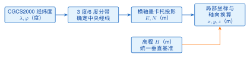
<figcaption>图 6.4  无人机倾斜摄影测量系统组成</figcaption>
</figure>

生产流程包括航线设计、影像采集、质量检查、空中三角测量、密集匹配、网格与纹理生成、坐标校核、切片和发布。Agisoft PhotoScan于2019年更名为Metashape并沿用至今；Bentley ContextCapture自2023版起更名为iTwin Capture Modeler。项目文档应记录软件版本、产品名称、处理参数和名称沿革，便于学生按官方资料复现实验，也便于成果在多年运行后追溯。

倾斜摄影的精度不是软件“自动生成”的属性，而是由任务设计、传感器标定、外业控制和内业检核共同决定。任务书首先写明成果用途、比例尺、覆盖范围、坐标和高程基准，再反推地面采样距离（GSD）、影像重叠度、飞行高度、相机曝光参数和控制点布设。以1:500地形图为例，GSD通常把目标设在不大于3 cm的量级；这是任务设计的示例目标，平面和高程限差仍须按项目适用规范与合同条款查表确认。CH/T 3004-2021与CH/T 3003-2021分别约束低空数字航空摄影测量的外业与内业环节（二者的2010年CH/Z版本已废止），CH/T 3005-2021约束低空数字航空摄影的航摄实施，GB/T 18314-2024《全球导航卫星系统（GNSS）测量规范》是卫星定位测量成果的技术依据，这些标准应与项目适用的水利行业规范共同列入质量计划<sup>[[47]](../../references.md#ref47)[[48]](../../references.md#ref48)[[49]](../../references.md#ref49)[[50]](../../references.md#ref50)</sup>。

外业设计要把“看得到”和“量得准”分开讨论。影像覆盖应超过成果边界，航带端部和转弯区保留足够的缓冲；建筑物立面、坝肩和峡谷等遮挡严重的部位，应增加交叉航线或补拍方向，并在任务书中记录补拍原因。相机曝光时间、快门速度、光圈和感光度应与飞行速度、光照和地表反射率匹配，避免运动模糊和高光饱和。飞行日志至少保存航线版本、起降时间、设备编号、镜头组合、POS来源、坐标基准、天气和异常处置；日志与影像文件通过统一任务编号关联，不能只依赖操作员记忆。

图6.5给出了控制网络的教学化布设：连接点负责把相邻影像锁定到同一块地物，像控点把模型约束到工程坐标，检查点保持独立用于验收。控制点应覆盖坝轴线两端、坝顶与坝脚、高程变化明显的坡面、闸室和场景边界；检查点宜与像控点分区布设，避免所有点落在同一小区域。图中不同符号不是装饰，而是提醒学生在平差文件中为每个点写明角色、测量方法、坐标基准、精度等级和是否参与平差。

<figure markdown>
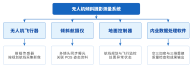
<figcaption>图 6.5  倾斜摄影空三控制与独立检查点布设示意</figcaption>
</figure>

内业处理从影像完整性检查开始。程序先核对文件数量、命名、时间戳、相机姿态、POS轨迹和坐标单位，再统计模糊、过曝、欠曝、遮挡和重叠不足的影像。质量检查结果分为“可进入空三”“需补拍或重采”“隔离待人工复核”三类，原始影像和检查报告只读保存。匀光匀色应保持地物纹理的相对关系，处理参数和输出版本写入报告；任何增强操作都不能覆盖原始像素。

空中三角测量（空三）可以拆成四个可审计阶段。第一阶段检测每幅影像的特征点，并在相邻影像和交叉航带之间匹配连接点；匹配点要经过几何一致性检验，删除明显的错误对应。第二阶段读取相机内方位元素、镜头畸变参数和POS初值，建立观测方程；相机标定文件应标出获取日期、适用镜头和坐标单位。第三阶段把像控点作为带权观测加入束平差，通过迭代估计相机外方位、连接点坐标和必要的系统改正；平差报告须列出迭代次数、单位权中误差、控制点残差和未参与平差的检查点清单。第四阶段用独立检查点验证成果，若误差集中在某条航带或某个高差突变区，应回查航带重叠、POS时间同步、控制点坐标和镜头标定，而不是只调高软件的容差。

像控点测量要形成“点—照片—坐标—证据”闭环。每个点至少保存点号、现场照片、点位描述、平面坐标、高程、坐标参考系、测量设备、观测时段和质量等级；点位应选择纹理稳定、边缘清楚且在多个视角可辨认的位置。坝顶栏杆、流水面反光区和临时堆料区容易随时间变化，应谨慎作为控制点。检查点使用同样的记录格式，但在空三求解阶段锁定为独立数据，只有在最终验收时才参与误差统计。控制点和检查点混用会让模型看起来更“精确”，却失去对泛化误差的检验能力。

密集匹配前先冻结通过空三验收的相机和点云版本。匹配参数应随地物类型调整：水面、玻璃和植被边缘的纹理不足会造成空洞，坝体混凝土的重复纹理会产生条纹，狭窄廊道则可能因视角不足形成错误表面。处理报告中要记录点云密度、异常点剔除规则、空洞填补策略和人工修补区域；对用于变形监测的几何，不得用视觉平滑掩盖真实位移。网格和纹理生成后，再以检查点、剖面线和关键尺寸进行复核，合格成果才进入切片和服务发布。

成果精度报告应按平面和高程分别给出统计量。式(6.2)和式(6.3)分别描述东、北分量，工程验收通常还需要平面点位均方根误差$m_p$，其定义为 $$m_p=\sqrt{m_x^2+m_y^2}.$$ 按式6.1可将两个平面分量合成为点位指标。因此，限差判断应采用“平面点位均方根误差$m_p$与高程均方根误差$m_h$”这一对指标；$m_x$与$m_y$保留为诊断量，用来定位某一方向的系统偏差，不能把两个分量分别与同一条平面限差简单比较。报告还应列出最大绝对误差、点数、点的空间分布、限差来源、坐标/高程基准和软件版本。典型GSD目标与验收口径的关系见表6.5，表中的“按规范查表”提醒读者：比例尺、地形类别和成果用途会改变允许误差，示例目标不能替代项目适用条款。

**表 6.5  倾斜摄影任务设计与精度验收口径**

| 项目            | 任务设计或报告字段                     | 验收统计与判定                                            | 依据与备注                       |
|:----------------|:---------------------------------------|:----------------------------------------------------------|:---------------------------------|
| 1:500地形图示例 | GSD目标通常不大于3 cm                  | 平面使用$m_p$，高程使用$m_h$；限差按适用条款查表          | 设计目标示例，限值以适用规范为准 |
| 平面检查点      | 点号、坐标基准、$\Delta X$、$\Delta Y$ | 报告$m_x$、$m_y$、$m_p$及最大绝对误差                     | 不把分量误差替代平面点位指标     |
| 高程检查点      | 高程基准、$\Delta H$、测量方法         | 报告$m_h$及最大绝对误差                                   | 与平面统计分开，记录模型版本     |
| 异常点处理      | 残差、复核状态、处置人                 | $|r|>2\,m$进入复核；$|r|>3\,m$判为粗差候选（$m$为中误差） | 删除或剔除必须记录原因和证据     |

粗差处理遵循“先复核、后判定、可追溯”的顺序。把残差绝对值超过2倍中误差（RMSE）的点列入复核清单，检查点位识别、坐标录入、时间同步和影像质量；超过3倍中误差的点可判为粗差候选，但仍需由测绘人员确认并记录剔除原因、原始残差、复核证据和重新计算结果。报告中应同时保留剔除前后的统计量，避免通过删除不利点“优化”数字。若多个异常点沿同一航带成带状分布，应优先调查系统误差；若单点异常且现场记录完整，才可能是点位识别或录入错误。

清单6.22把分量误差、合成平面误差和粗差标记同时输出，学生可以用同一份检查点 CSV 复核软件报告。代码中的阈值只负责生成复核队列，最终限差仍由项目适用规范和验收文件决定。

**清单 6.22  检查点平面与高程精度计算及粗差复核**

```javascript
function evaluateCheckPoints(points, rmse) {
  if (!Array.isArray(points) || points.length < 3) {
    throw new Error('独立检查点至少需要3个且必须是数组');
  }
  const sq = (value) => value * value;
  const n = points.length;
  const dx = points.map((p) => p.dx);
  const dy = points.map((p) => p.dy);
  const dh = points.map((p) => p.dh);
  const mx = Math.sqrt(dx.reduce((s, v) => s + sq(v), 0) / n);
  const my = Math.sqrt(dy.reduce((s, v) => s + sq(v), 0) / n);
  const mh = Math.sqrt(dh.reduce((s, v) => s + sq(v), 0) / n);
  const mp = Math.sqrt(mx * mx + my * my);
  const review = points.map((p) => {
    const residual = Math.max(Math.abs(p.dx), Math.abs(p.dy), Math.abs(p.dh));
    const flag = residual > 3 * rmse ? 'gross-error-candidate'
      : residual > 2 * rmse ? 'review' : 'pass';
    return {id: p.id, residual, flag};
  });
  return {mx, my, mp, mh, review};
}
```

在成果交付单中，平面限差、高程限差、中误差计算口径和粗差处置规则应作为一个整体签字确认。若项目采用地方细化规范或合同中的更严要求，应在表6.5对应行补充版本、条款和适用范围；若规范版本发生变化，重新计算检查点并保留旧版报告，确保三维模型、BIM构件和监测平台引用的是同一成果版本。

控制点布设还要考虑工程对象的几何层次。坝轴线两端控制整体方向，坝顶和坝脚控制高差与坡面，闸室、溢洪道和廊道出入口控制局部构件，场景边界控制模型裁切和瓦片范围。每一层至少保留一组独立检查点，使误差统计能够回答“整体是否平移”“局部是否变形”“边界是否翘曲”三个不同问题。若所有点只布在坝顶，平面指标可能很好看，但坝脚和峡谷侧壁的遮挡、纹理重复和高差变化仍可能导致模型失真。项目报告应把点位分层、点位数量和每层的最大残差列成表格，审查人员据此判断验收覆盖是否充分。

空三参数的变更采用小步回归策略。先冻结通过检查的影像、控制点和相机标定版本，只改变一个参数组，例如连接点匹配阈值、POS权重或畸变模型；每次运行都输出平差迭代、控制点残差、独立检查点的$m_p$和$m_h$，并与上一版本做差异比较。若整体误差下降而某一航带误差上升，应保留两版结果并分析原因，不能只挑选数值较小的版本交付。对于重复飞行或季度更新，稳定控制点可以作为跨期公共点，新增检查点用于检验地表变化；发生真实施工变化的点位要标注“不可跨期比较”，避免把工程改造误判为摄影测量误差。

从点云到网格的每一步都应保留可回放的中间成果。点云阶段记录坐标基准、密度、分类规则和异常点清单；网格阶段记录三角形数量、孔洞填补和简化误差；纹理阶段记录影像选择、接缝处理和压缩参数；切片阶段记录层级、包围盒、瓦片格式和服务版本。对坝面、闸门和监测仪器等关键对象，交付包同时保存原始高密度模型与发布用轻量模型，并以稳定对象编码关联。这样，平台在运行时可以使用轻量瓦片保持流畅，专业复核时仍能回到原始模型核对尺寸和位置。模型属性、控制点报告和检查点证据共同构成成果血缘，任何一项缺失都会使三维场景难以承担测量和审计职责。

在水利场景中，影像成果还要接受业务语义检查。把坝顶、坝脚、溢洪道边墙和库岸水线分别作为可查询对象，检查对象编码是否与BIM或GIS目录一致；对同一构件在不同LOD中的几何简化，核对其中心线、端点和高程是否保持在项目允许范围内。监测仪器位置应与实测点号一一对应，模型更新时只替换几何和纹理，不改变历史观测的对象主键。若发现模型表面与控制点一致而对象属性错配，应将成果退回语义校核环节，避免把视觉上的“对齐”误当作业务可用。交付验收因此同时覆盖几何精度、坐标基准、对象语义、版本血缘和服务性能五个方面，形成可复核的闭环。

验收单还应给出“通过、限期整改、退回重算”三种结论及责任人、完成日期和复核证据。通过表示精度和语义均满足适用条款；限期整改表示问题已定位且不影响隔离范围内的其他成果；退回重算表示控制网、基准或关键对象存在系统性风险。结论状态写入成果目录，平台发布服务只读取“通过”版本，学生由此理解测绘成果、模型发布和业务使用之间的责任边界。

每次复核还要保存输入清单、软件环境和脚本版本，使同一批检查点能够在另一台机器上得到相同结果。对于跨期更新，报告注明哪些差异来自新采集、哪些差异来自处理参数，避免把版本变化误读为工程变形。 复核结果与发布版本同步归档。

图6.6把其中的预处理与质量控制环节展开：完整性核查、影像质量检查、匀光匀色、拼接检查、质量判定，以及不合格时的返工回路。返工回路是这张图的重点——质量判定不通过时退回的是采集或匀色环节，而不是带着问题继续走到成果发布。

<figure markdown>
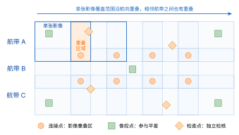
<figcaption>图 6.6  倾斜影像预处理与质量控制流程</figcaption>
</figure>

术语必须区分：特征点由算法在影像中检测；连接点是多幅影像中匹配到同一地物的特征；像控点具有外业测得的已知坐标，用于约束空三结果；检查点不参与平差，只用于独立精度评定。

若检查点共有$n$个，成果与实测坐标差分别为$\Delta X_i$、$\Delta Y_i$、$\Delta H_i$，三个方向的均方根误差按式(6.2)、式(6.3)和式(6.4)分别计算。这三个量描述的是成果相对于检查点的符合程度，因此检查点本身不能参与平差，否则精度评定就失去了独立性： $$m_x=\sqrt{\frac{1}{n}\sum_{i=1}^{n}(\Delta X_i)^2}.$$ $$m_y=\sqrt{\frac{1}{n}\sum_{i=1}^{n}(\Delta Y_i)^2}.$$ $$m_h=\sqrt{\frac{1}{n}\sum_{i=1}^{n}(\Delta H_i)^2}.$$ 精度结论应同时给出检查点数量、空间分布、坐标/高程基准和限差来源，不能只报告一个平均值。

### 6.3.2 BIM语义与IFC 4.3

BIM强调构件语义、属性和工程关系，倾斜摄影强调表面真实感，两者不能互相替代。闸门启闭机、监测仪器等关键对象宜保留可查询语义；大范围地形和周边建筑可用倾斜摄影或地形瓦片表达。

IFC 4.3 的 Ports and Waterways Domain 面向航道、运河、船闸与升船机、港口码头等通航与港工设施。与水利工程建模最相关的实体是`IfcMarineFacility`和`IfcMarinePart`，设施类型通过`PredefinedType`表达。buildingSMART 的范围说明把 Dams/levees、Weirs、seawalls、groynes 列在该域之外，并将 coastal protection、erosion protection、flood protection 三类复合类型列为范围之外<sup>[[51]](../../references.md#ref51)</sup>。因此，水库坝体、溢洪道、泄洪闸门、廊道和监测仪器都不能为了追求“有一个实体”而强行套用海事设施语义。

表6.6把常见水工对象与 IFC 4.3 的表达边界并列起来。表中列出的枚举值仅限于 IFC 4.3.2 官方文档已经核对的值；“无原生实体”不是数据缺失，而是要求模型交付方保留对象的工程语义，并把项目分类、属性集和映射规则作为可审计的补充层。

**表 6.6  水工对象到IFC 4.3的表达边界**

| 对象                       | 可用实体与`PredefinedType`                                                        | 说明与边界                                                                                                                     |
|:---------------------------|:----------------------------------------------------------------------------------|:-------------------------------------------------------------------------------------------------------------------------------|
| 通航渠道                   | `IfcMarineFacility`；`NAVIGATIONALCHANNEL`（也可按对象语义选`CANAL`或`WATERWAY`） | 表达通航设施本体；应记录航道等级、岸线和运营属性，不能据此推断水库坝体语义。                                                   |
| 船闸（含闸室与闸首）       | `IfcMarineFacility`；`SHIPLOCK`；`IfcMarinePart`；`CHAMBER`/`GATEHEAD`            | `CHAMBER`是船闸蓄水闸室的纵向空间部分，`GATEHEAD`是船闸闸门、支承结构与设备的纵向空间部分；两者均限定在船闸语境。              |
| 升船机                     | `IfcMarineFacility`；`SHIPLIFT`或`WATERWAYSHIPLIFT`                               | 表达通航设施中的升船机，不延伸为水库泄洪设施。                                                                                 |
| 护岸                       | `IfcMarineFacility`；`REVETMENT`                                                  | 表达设施级护岸；若与其他防护工程组成复合系统，应另建项目分类和属性关联。                                                       |
| 防波堤                     | `IfcMarineFacility`；`BREAKWATER`                                                 | 表达港工或滨海设施中的防波堤，不能把该类型泛化为所有挡水建筑物。                                                               |
| 滨海与洪泛防护设施         | `IfcMarineFacility`；`MARINEDEFENCE`                                              | 该值的定义是以保护或防御滨海或洪泛区域为主要功能的设施子集；复合的海岸、侵蚀和洪水防护仍按官方范围边界处理。                   |
| 坝体                       | 无原生实体                                                                        | 采用项目分类、`IfcPropertySet`属性集与映射规则表达坝段、材料和空间关系，并保留原始设计模型；不能借用海事设施类型代替坝体语义。 |
| 溢洪道                     | 无原生实体                                                                        | 采用项目分类、`IfcPropertySet`属性集与映射规则表达泄流功能、段落和连接关系，并保留原始设计模型。                               |
| 泄洪闸门                   | 无原生实体                                                                        | 船闸语境的`GATEHEAD`不能挪用于水库泄洪闸门；应以项目分类、`IfcPropertySet`属性集和映射规则记录闸门及启闭设备。                 |
| 廊道                       | 无原生实体                                                                        | 以项目分类、`IfcPropertySet`属性集和映射规则表达廊道空间、断面和连通关系，并保留原始设计模型。                                 |
| 监测仪器                   | 无原生实体                                                                        | 以项目分类、`IfcPropertySet`属性集和映射规则表达仪器编码、测点关系和运维属性，监测时序仍由水利平台数据模型管理。               |
| 项目土方填筑（不等同坝体） | `IfcEarthworksFill`；`EMBANKMENT`                                                 | 官方定义偏向道路路基或整体抬高地面的土方构件；用于土石坝时只能作为项目层面的约定映射，不能宣称为坝体的标准原生语义。           |

工程映射应先给对象分配稳定的项目分类编码，再用`IfcPropertySet`补充设计单位、施工阶段、运行状态和数据来源，并在映射规则中写明源模型对象与交付对象的对应关系。对于没有原生实体的对象，原始设计模型是审计依据，IFC 文件中的补充属性是交换层，不应反过来替代原始设计语义。这样既能让通航设施使用标准实体，也能让坝体、溢洪道和监测仪器在跨系统交换时保持可追溯。

为避免把“存在一个相似名称”误读成“语义相同”，本章保留三条正向约束：闸门应按项目分类和属性集表达，不能用`IfcDoor`表示；廊道应按空间与连通关系表达，不能用`IfcFurniture`表示；坝体应按工程对象和项目映射规则表达，不能简单当作`IfcStructuralMember`。其中`IfcStructuralMember`属于结构分析模型实体，用于分析构件语义，不是水工物理构件的通用替身。对于船闸闸首，只有在对象确实属于船闸空间部分时，才可依据表6.6使用`GATEHEAD`；该值不能迁移到水库泄洪闸门。

模型轻量化应保留业务所需的全局标识、类型、空间层级和关键属性，再把几何转换为glTF或3D Tiles。转换日志记录源模型版本、转换工具、参数、时间和校核结果，以便发现属性丢失时追溯。

### 6.3.3 多源模型融合与发布

融合前先统一坐标、高程、单位和时间版本，再处理几何。推荐步骤为：

1.  建立GIS空间底座与项目局部坐标转换；

2.  校核倾斜摄影成果的控制点和边界；

3.  对BIM构件建立业务编码与空间定位；

4.  生成分层LOD和3D Tiles/glTF交付物；

5.  通过同名点、剖面和关键尺寸进行复核；

6.  发布模型目录、元数据与版本清单。

模型成果分析包括几何精度、纹理质量、语义完整性、加载性能和版本一致性。任何优化都不应破坏测站—构件—业务记录之间的关联。

## 6.4 数字孪生水利平台架构概览

**本节层次**

拓展：6.4.1、6.4.2、6.4.3、6.4.4、6.4.5、6.4.6、6.4.7、6.4.8、6.4.9、6.4.10、6.4.11、6.4.12、6.4.13、6.4.14、6.4.15、6.4.16、6.4.17、6.4.18。本节没有核心小节，课堂核心路线可整体跳过。

### 6.4.1 概念边界与五维组织

数字模型是物理对象的数字表达；数字影子强调物理对象向数字模型的数据更新；数字孪生还要求虚实之间形成受控、可验证的双向业务闭环。仅有精美三维场景而没有持续数据、模型服务和反馈流程，不能称为完整数字孪生。

NASA文献强调物理模型、传感器更新和运行历史的综合映射<sup>[[52]](../../references.md#ref52)</sup>。陶飞、张萌提出的数字孪生车间模型包含物理车间、虚拟车间、服务系统和孪生数据<sup>[[53]](../../references.md#ref53)</sup>；在此基础上，陶飞等进一步提出数字孪生五维模型<sup>[[54]](../../references.md#ref54)</sup>，原文记为 $$M_{DT}=(PE,VE,Ss,DD,CN),$$ 其中$PE$为物理实体、$VE$为虚拟实体、$Ss$为服务、$DD$为孪生数据、$CN$为连接。本章沿用该五维划分，并结合水利业务对各维度作工程化细化，不把“孪生数据”改写成“数据处理”。图6.7把五个维度画在一起，并用连接维$CN$把其余四维两两串起来。这一维最常被省略，但它恰恰决定孪生能否闭环：没有可靠的双向连接，物理实体与虚拟实体只是各自独立的两套数据。

<figure markdown>
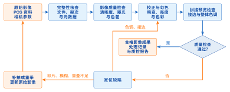
<figcaption>图 6.7  数字孪生水利平台五维组织</figcaption>
</figure>

把五个维度落到大坝安全监测这一具体对象上，各维对应的内容见表6.7：物理实体是坝体与测点，虚拟实体是几何与渗流模型，服务是异常识别与预警判定，孪生数据是观测序列与模型输出，连接则是采集链路与指令回执。

**表 6.7  五个维度在大坝安全监测中的映射**

| 维度     | 典型内容                         | 设计关注点                   |
|:---------|:---------------------------------|:-----------------------------|
| 物理实体 | 坝体、廊道、传感器、闸门         | 对象标识、状态、可控边界     |
| 虚拟实体 | 三维几何、渗流/变形模型、规则    | 适用条件、参数、版本、可信度 |
| 服务     | 数据质检、预警、分析、方案比选   | 输入输出、时效、责任主体     |
| 孪生数据 | 实时值、历史序列、模型结果、档案 | 时空基准、质量码、血缘       |
| 连接     | 采集协议、API、消息、反馈指令    | 安全、延迟、幂等、审计       |

### 6.4.2 分层技术架构

平台可划分为物理对象层、感知连接层、数据底板层、模型与知识层、服务层和交互应用层。分层的目的不是增加名词，而是明确数据在哪里校验、模型在哪里运行、结果由谁解释、指令由谁批准。图6.8把这六层自下而上排开，并在层间标出数据上行与指令下行两条通道。读图时应重点看层与层之间的接口，而不是层内的技术名词：分层的价值在于替换某一层实现时，相邻层的契约不必跟着改。

<figure markdown>
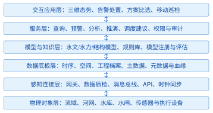
<figcaption>图 6.8  数字孪生水利平台分层架构</figcaption>
</figure>

感知连接层先完成测站身份、时间戳、单位、范围和质量码检查，再进入数据底板。模型层不直接读取任意原始表，而通过具有版本的数据产品获得输入。服务层把模型结果转换为可解释的风险等级或方案指标；应用层展示依据与不确定性，不把建议伪装成自动命令。

### 6.4.3 跨层契约与架构演进

分层架构真正可维护的关键，在于每一层都把“输入是什么、输出是什么、失败如何表达、谁对结果负责”写成契约。物理对象层提供资产目录、设备状态和工程边界；感知连接层提供带事件时间的原始消息与接入证据；数据底板层提供经过质量码标记的可查询数据产品；模型与知识层提供带适用范围和不确定性的计算结果；服务层提供查询、预警、预演和调度建议；交互应用层提供证据浏览、人工确认和操作回执。任一层缺少版本或责任字段，上一层的正确性都无法传递到下一层。

契约应同时覆盖正常流和失败流。正常流中，网关接收带有对象编码和事件标识的观测，质量服务完成单位、时间和范围校验，数据底板写入不可变原始记录，模型服务读取符合条件的数据快照，业务服务生成带证据的预警或方案，应用层显示并等待授权操作。失败流中，缺少对象编码的消息进入隔离队列，单位错误被标记为可疑，关键测点缺测使模型降级或停算，模型超时返回可解释的不可用状态，权限不足只返回允许范围内的数据。每一种失败都要有稳定错误码、责任角色和恢复动作，不能把异常堆栈直接当作业务提示。

架构评审可采用“数据向上、指令向下、证据贯穿”的三条线。数据向上检查采集、质检、存储和模型输入是否保持同一对象编码、时间基准和质量语义；指令向下检查建议、审批、执行和回执是否经过权限、有效期和设备状态校验；证据线横向关联原始观测、模型运行、规则版本、界面操作和工单结果。三条线交汇处就是平台的审计边界：例如某次闸门调度建议既要能追到降雨情景和预报运行，也要能追到审批人、设备回执和执行后的水位变化。

平台演进应优先扩展契约，再替换实现。把单工程场景扩展到流域时，新增的是河网拓扑、断面、预报模型和影响对象目录，原有测点、质量码、事件时间和权限语义仍然有效；把本地三维场景扩展到地球级浏览时，增加的是大范围坐标、瓦片服务和LOD策略，业务对象编码和时间窗不能因切换引擎而改变。若某个新模块要求修改既有字段含义，应发布新的契约版本，同时保留一段兼容期并记录迁移规则；直接复用旧字段承载新语义，会让历史数据和新结果无法比较。

模型、数据和前端的发布节奏也应解耦。模型服务可以先影子运行，使用真实输入生成不影响生产的结果；数据底板可以先扩展字段，旧客户端继续读取兼容视图；前端可以先增加“模拟”标签和版本显示，等待后端接口正式开放。发布单要列出依赖关系、回滚条件和观测指标，运维员依据指标逐步放量。发生异常时，先停止新版本进入决策链，再保留已经产生的预警和工单，最后按输入快照和版本号重放，判断异常来自数据、模型还是界面。

跨层契约还决定课程项目的分工方式。负责三维场景的学生提交对象编码、坐标转换和加载错误证据；负责数据服务的学生提交质量检查、时序查询和幂等写入证据；负责模型的学生提交输入快照、模型卡和不确定性说明；负责业务闭环的学生提交预警、工单、审批和回执证据。各组以同一组样例数据和同一追踪号联调，任何一组都不能用手工复制的“演示数字”替代接口调用。这样，分层架构不只是画在图上的盒子，而是可以由不同成员独立实现、组合验收并在失败时定位责任的工程组织方式。

架构设计还要明确哪些状态可以自动推进，哪些状态必须等待人工确认。数据接入和质量标记属于可自动化的机械步骤，但“是否进入风险评分”应由质量规则和模型契约共同决定；模型运行可以自动排队和重试，但模型结果进入预警或调度建议前要检查适用范围和输入快照；预警事件可以自动生成，但高风险处置、闸门命令和预案启用必须由授权角色审批。把自动步骤和人工步骤写成状态机后，系统才能在界面上给出“待复核、已批准、执行中、待回执”等明确状态，而不是用一个“完成”字段掩盖责任交接。

跨层接口的时间语义尤其容易被忽略。采集设备的事件时间用于重建现场事实，网关接收时间用于衡量链路延迟，模型开始和结束时间用于衡量计算资源，人工确认时间用于衡量处置时效。四类时间都要保留，不能把接收时间覆盖事件时间，也不能把页面刷新时间当成模型结果时刻。发生迟到数据时，系统按事件时间判断是否需要重算；发生模型超时时，系统按处理时间触发降级；发生审批超时时，系统按业务有效期升级值守任务。时间字段的分工一旦写入契约，跨服务日志才具有可比较性。

空间语义也应沿层传递。物理对象层保存工程坐标和对象关系，数据底板同时保存水平CRS、高程基准和转换版本，模型输入输出保留计算网格或断面坐标，服务层返回对象编码与空间范围，应用层才把它们转换成局部原点、地图瓦片或三维屏幕位置。任何一层改变坐标，都必须在结果中写出转换记录；如果只在前端拖动模型使其“看起来对齐”，后端查询、剖面分析和监测点回放仍会使用错误位置。架构验收应选择至少一个测点和一个工程构件，完成“原始坐标—标准坐标—局部坐标—三维拾取—反向查询”的闭环。

当平台需要接入新模型或新数据源时，先做契约评审，再做适配器开发。评审清单包括对象编码映射、时间基准、单位和质量码、输入输出版本、错误与超时、权限和审计、性能预算以及回滚方案。适配器负责把外部格式转换为平台规范，不把外部字段直接泄露到业务页面；对于无法映射的字段，进入扩展属性并在数据字典登记。这样，模型可以替换、数据源可以增加、三维引擎可以升级，而既有预警、工单和审计记录仍能按原语义读取。

最终的架构验收以业务证据为中心组织。抽取一条观测事件，验证它能从接入日志追到质量结论、状态版本、模型输入、风险结果、人工确认、指令回执和复盘记录；再制造一条重复消息、一个单位错误、一次模型超时和一次无权限命令，验证系统分别给出幂等忽略、可疑标记、降级结果和拒绝审计。正常流证明系统能工作，失败流证明系统知道何时停止、如何恢复以及由谁负责。第8章的案例实现沿用这套证据链，读者可在8.5.15节看到端到端脚本和阶段门禁的具体写法。

可以用一次“连续降雨后渗压变化”的演算检查双向闭环：雨量事件上行后，质量服务标记时间窗和数据完整性，模型服务根据水位与渗压快照计算趋势，预警服务给出带可信状态的结果；值班员确认后生成工单，若需要调度则由审批人选择方案并下发命令，设备回执和新的水位、流量又沿数据链上行。每一步都保留追踪号和版本，才能在复盘时回答“当时看到了什么、依据哪一版模型、谁作了决定、执行后发生了什么”。这个演算也说明五维模型中的连接维不是网络名词，而是把数据、模型、服务和物理对象串成可验证行动的机制。 该闭环还可作为联调的最小验收用例：人为制造迟到观测、模型超时和审批拒绝，检查状态是否停在正确节点，并核对恢复后是否补齐证据。通过同一追踪号比较正常与失败两条路径，学生能够把抽象的五维关系落实为可观察的系统行为。 验收报告应附状态转移、输入输出快照和责任签名，便于跨角色复核；复核记录写出模型版本、数据窗口、异常处置人、复核时间与责任角色。责任角色未签名时，验收状态保持“待复核”，不进入正式发布；状态变更、签名和发布动作使用同一追踪号关联，并由审计角色独立复核。证据链完整，系统结果才可进入正式业务处置。

### 6.4.4 业务场景与需求分解

数字孪生建设应从闭环业务场景开始，而不是从“建立全域高精度模型”开始。场景说明至少回答六个问题：管理对象是什么、谁在何时使用、需要哪些观测、调用什么模型、输出如何解释、最终行动由谁批准。不同场景的时效和空间精度要求差异很大，不能共享一套未经区分的“实时”指标。表6.8把几个典型场景的时效与精度要求列在一起对照。大坝安全监测关心的是小时级趋势与毫米级位移，防洪调度关心的是分钟级预报更新与米级水位，两者对“实时”的定义相差一个数量级；把它们塞进同一套指标，结果通常是前者过度投入而后者仍然不够快。

**表 6.8  典型数字孪生水利场景的需求差异**

| 场景       | 核心对象与观测               | 主要模型/规则        | 业务输出             |
|:-----------|:-----------------------------|:---------------------|:---------------------|
| 大坝安全   | 坝段、测点、库水位、温度     | 基线、统计或结构模型 | 风险证据与处置工单   |
| 洪水预报   | 河网、断面、雨量与流量       | 水文/水动力模型      | 过程预报与影响范围   |
| 水资源调度 | 水库、取用水户、控制断面     | 供需平衡与优化模型   | 可行方案及约束冲突   |
| 河湖监管   | 河湖岸线、遥感影像、巡查事件 | 变化检测与规则       | 疑点清单和核查任务   |
| 工程巡检   | 构件、缺陷、工单、现场影像   | 缺陷分类与维护规则   | 定位、等级和复检计划 |

需求分解可采用“对象—事件—状态—服务—证据”模板。例如“大坝渗压异常”对象是测点和坝段，事件是新读数到达，状态包括质量码和风险级别，服务包括质检、模型计算和告警，证据包括原始值、趋势、相关测点和模型版本。模板能防止三维界面与后端业务脱节。

每个场景还应定义最小闭环。若第一阶段只能完成感知、质检、展示和人工处置，就应明确称为第一阶段能力，而不是用未来规划补足当前缺失。范围清楚比一次性堆叠全部模型更有利于验收和迭代。

### 6.4.5 数据底板与模型平台

数据底板至少管理四类数据：实时监测序列、空间地理数据、工程结构与档案、模型输入输出。每条关键数据应带有对象标识、采集时间、入库时间、单位、空间参考、质量码和来源。表6.9把这些元数据按数据类与模型类分别列出。判断元数据是否够用有个简单标准：出现争议时，能否仅凭这些字段还原出“这个数是谁、在什么时候、用哪一版规则算出来的”。还原不出来，就说明还缺项。

**表 6.9  数字孪生数据与模型注册的关键元数据**

| 对象       | 必备元数据                        | 作用                     |
|:-----------|:----------------------------------|:-------------------------|
| 监测数据集 | 测点、单位、时区、质量码、血缘    | 防止错点、错时、错单位   |
| 空间数据集 | 水平CRS、高程基准、精度、版本     | 保证图层和模型空间一致   |
| 计算模型   | 版本、参数、适用范围、校准记录    | 判断模型能否用于当前场景 |
| 模型运行   | 输入快照、代码版本、开始/结束时间 | 支持复现和责任追踪       |
| 业务规则   | 阈值、审批人、生效期、依据        | 避免规则无来源或长期失效 |

模型平台负责注册、调度、监控和评估，不把所有算法塞入同一服务。机理模型、统计模型和规则可以并存，但每个输出必须保留来源。模型更新后先回放历史工况并通过验收，再替换生产版本。

### 6.4.6 模型卡与可信度管理

本节给出模型卡和可信度管理的方法框架；案例水库中的场景版本、不确定性和方案比较见8.5.12节。两处内容分别承担“通用方法”和“工程实现”的职责，模型卡字段、输入快照和审批证据应保持同一语义。

模型“能够运行”不等于“适合决策”。每个生产模型应配模型卡，记录用途、责任人、输入、输出、适用空间与工况、参数来源、校准数据、误差指标、已知限制、版本和回滚方法。统计或机器学习模型还需记录训练数据时间范围和分布漂移检查。表6.10给出模型卡的最小字段。其中“已知限制”与“回滚方法”两项最容易被跳过，而它们恰恰是模型出问题时唯一能立即派上用场的信息：前者决定当前工况下还能不能采信结果，后者决定多久能退回上一版。

**表 6.10  水利模型卡的最小字段**

| 字段组         | 示例                         | 验证问题             |
|:---------------|:-----------------------------|:---------------------|
| 身份与责任     | 模型ID、版本、负责人         | 谁批准进入生产环境   |
| 适用范围       | 流域、工程、洪水量级、季节   | 当前工况是否超出范围 |
| 输入契约       | 数据集版本、单位、时间步长   | 缺测或延迟如何处理   |
| 输出与不确定性 | 流量过程、置信区间、风险等级 | 用户能否理解误差边界 |
| 校准与验证     | 历史事件、指标、阈值         | 是否使用独立验证数据 |
| 运行与回滚     | 资源、超时、降级、旧版本     | 失败后如何恢复服务   |

模型评估不宜只看一个平均误差。洪峰预报还可检查峰值、峰现时间和过程拟合；异常识别需结合误报、漏报和处置代价；空间淹没结果需检查边界位置和高程敏感性。所有指标都应与业务用途对应。

模型运行时先校验输入契约。若数据时间落后、单位不符或关键测站缺测，平台应拒绝运行、使用经批准的降级输入或显式降低可信等级，不能悄悄以零值填充。输出页面同时展示模型版本、输入时刻和可信状态，使使用者知道结果的条件。

模型变更遵循“开发—离线验证—影子运行—评审—发布—监控—回滚”流程。影子运行让新模型接收真实输入但不影响生产决策，可比较新旧结果并发现边界工况。模型审批记录与软件发布记录共同构成审计证据。

### 6.4.7 事件时间、状态估计与质量码

本节给出事件时间和质量码的通用处理框架；案例中对象编码、时空基线与孪生状态的落地见8.5.9节。读者应先掌握事件时间、处理时间和质量优先级，再阅读案例的表结构与回放流程。

多源监测数据不会严格同时到达。平台应区分事件时间与处理时间：事件时间表示现场观测发生的时刻，处理时间表示平台收到或计算的时刻。模型输入按事件时间对齐；处理时间用于衡量传输和计算延迟。若只保留一个时间戳，补传数据可能被误认为当前状态。

流式处理可使用水位线（watermark）表达“系统认为某一事件时间之前的数据基本到齐”。水位线不是业务水位，而是事件时间处理术语。允许迟到窗口应依据网络和场景设置：秒级告警与日尺度统计不能共用同一窗口。超过窗口的数据仍应保存，但需触发重算、修订或标记为历史补录。

不同频率数据进入模型前需采用明确的对齐规则。连续物理量可在允许间隔内插值，离散设备状态通常保持最近有效值，累计雨量需要按时间段重采样。任何填补都要保留“原始、插值、估算或人工修订”标记，避免派生值被当作实测值。表6.11把质量码与下游处理建议对应起来。同一个“可疑”标记，在趋势展示中可以保留但降低视觉权重，在风险评分中则必须排除——同一条数据在不同用途下处理方式不同，这正是把质量码单独建模、而不是直接去改数值的原因。

**表 6.11  监测数据质量码与处理建议**

| 质量状态 | 判断示例                         | 下游处理                       |
|:---------|:---------------------------------|:-------------------------------|
| 有效     | 格式、范围、时序和设备状态均正常 | 进入状态估计和模型             |
| 可疑     | 突变、邻点不一致或接近量程边界   | 保留并降低权重，提示复核       |
| 缺测     | 期望窗口内无观测                 | 按模型契约停算或使用批准的估算 |
| 迟到     | 事件时间早于当前水位线           | 保存并决定是否重算历史状态     |
| 人工修订 | 经授权人员更正                   | 保存原值、修订值、原因与操作者 |
| 设备故障 | 自检失败、离线或维护             | 禁止作为正常观测参与模型       |

状态估计不能覆盖原始记录。原始层保持不可变观测，标准层完成单位和时空统一，状态层形成面向业务的当前状态，模型层保存预测或分析结果。各层通过数据血缘关联，用户可从风险结论追溯到模型运行、输入快照和原始测点。

单位转换在数据标准层集中完成。例如水位统一为米、流量统一为立方米每秒；接口仍携带单位字段。阈值和模型参数必须声明所用单位，禁止依赖开发者记忆。时区统一存储为带偏移的时间或UTC，界面按用户时区显示。

### 6.4.8 三维交互与决策证据链

三维交互的详细视觉编码、LOD降级、键盘可达和图表联动由第7章负责，本节只保留跨层证据链的接口约束；具体展示实现可参见7.4节。第6章的职责是定义对象、状态、模型证据和处置记录如何连接，第7章的职责是把这些证据转成可读、可操作的二维与三维界面。

三维界面应帮助用户定位对象、理解状态和获取证据。对象选择后显示稳定业务名称、编码、数据时刻和质量状态；颜色表达必须配合图例、文字或图标，不能只用红绿色区分风险。对键盘操作、字号和对比度也应进行基本无障碍检查。

状态着色与几何材质分离。原始模型材质属于资产表现，风险着色属于临时业务覆盖层；退出专题模式后应恢复原材质。这样既避免反复修改模型文件，也能同时支持渗压、位移、巡检等多个专题。图6.9把从三维对象一路回溯到业务处置的链条画了出来：点选构件、查看测点、调阅原始序列与质量码、比对模型残差与阈值依据、生成告警事件与工单。这条链缺任何一环，界面上的颜色就只是颜色，无法作为处置依据。

<figure markdown>
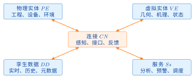
<figcaption>图 6.9  从三维对象到业务处置的证据链</figcaption>
</figure>

时间轴允许回看任一历史状态，但必须区分“当时已知的数据”和“后来补录后重算的状态”。若回放使用了后来数据，界面应标注为修订视图，防止把事后计算结果误认为当时决策依据。

空间查询同样需要证据边界。淹没范围、影响人口或工程数量由特定模型和数据版本计算，界面点击统计数字时应能打开其空间范围、过滤条件和生成时间。截图只能作为沟通材料，正式结果应保留可查询数据和生成记录。

三维性能下降时优先保证业务信息可达。模型可降级LOD或切换二维地图，告警列表、数据表和处置入口仍应可用。通过这种渐进增强，三维场景不会成为整个业务系统的单点故障。

### 6.4.9 实时同步与闭环控制

一次完整闭环包括“感知—质检—状态更新—模型计算—风险解释—人工确认—指令下发—执行反馈—效果评估”。并非所有场景都允许自动控制：大坝安全和防洪调度通常需要权限、会商和人工确认。图6.10把这些环节连成回路，并把需要人工确认的位置单独标出。判断一个平台是否真的形成闭环，要看“执行反馈”与“效果评估”两环是否落地：大量项目止步于指令下发，回路实际上是断开的。

<figure markdown>

<figcaption>图 6.10  数字孪生业务闭环</figcaption>
</figure>

清单6.23只表达状态更新主线，每个函数都代表一个可测试的服务接口，读的时候关注调用顺序而不是具体算法——算法由水工专业模型决定，平台负责的是把它接进可追溯的流程。

**清单 6.23  数字孪生模型计算接口**

```python
def update_twin(reading, repository, model, publisher):
    checked = validate_unit_time_quality(reading)
    repository.save_raw(checked)

    state = repository.load_state(checked.asset_id)
    state = merge_observation(state, checked)
    prediction = model.run(state)

    event = {
        "assetId": checked.asset_id,
        "stateVersion": state.version,
        "risk": prediction.risk,
        "modelVersion": model.version
    }
    repository.save_result(event)
    publisher.publish("twin.state.updated", event)
    return event
```

生产实现还需事务、幂等、超时、重试和审计。状态版本可防止旧结果覆盖新结果；模型版本和输入快照保证结果可复现。

### 6.4.10 接口与事件契约

本节给出状态事件、查询接口和控制命令的通用契约；案例水库中的模型任务编排、运行生命周期和消息落地见8.5.10节。框架层关注字段语义与幂等边界，案例层负责把它们绑定到具体服务、数据库事务和审计日志。

数字孪生各层通过稳定契约协作。查询接口适合读取当前状态，事件适合通知“状态已经发生变化”，命令用于请求执行有业务副作用的动作。三者不能都包装成含混的“消息”。

状态更新事件至少包含事件标识、对象标识、发生时间、状态版本、模型版本和追踪标识，清单6.24是一个完整样例；其中模型版本不能省，否则出现异常结果时无法判断是哪一版模型算出来的：

**清单 6.24  模型事件契约示例**

```json
{
  "eventId": "01J5...",
  "eventType": "twin.state.updated.v1",
  "assetId": "DAM-001-BLOCK-07",
  "occurredAt": "2026-08-05T08:30:00+08:00",
  "stateVersion": 1842,
  "modelVersion": "seepage-2.3.1",
  "risk": "ORANGE",
  "traceId": "5d0e..."
}
```

事件类型携带契约版本，新增可选字段保持向后兼容；删除或改变字段语义时发布新版本。消费者用`eventId`去重，用`stateVersion`拒绝过期更新，用`traceId`串联采集、模型和告警日志。

控制命令比状态事件要求更严格。命令包含发起人、审批记录、目标设备、期望状态、有效期和幂等键；执行端返回接收、拒绝、执行中、成功或失败状态。超时不等于未执行，调用方必须查询最终状态，避免重复启闭设备。图6.11把状态事件与控制命令两条链路并排画出，并标出各自写入审计的位置。两者的差别集中在幂等键与审批记录上：状态事件重复投递不产生副作用，控制命令重复投递则可能让设备二次动作。

<figure markdown>
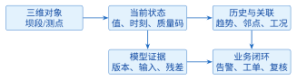
<figcaption>图 6.11  状态事件与控制命令两条链路及共同的审计落点</figcaption>
</figure>

接口契约需通过自动化测试验证，包括必填字段、单位、时区、枚举、重复事件和乱序事件。契约文档与代码同步版本化，避免不同团队凭口头约定解释同一字段。

### 6.4.11 大坝安全监测场景

大坝场景可选渗压、位移、应变、温度、库水位和环境量作为观测。虚拟实体包含坝段几何、测点拓扑、统计基线和必要的机理模型。服务包括异常识别、趋势分析、空间联动和处置流程。

一次渗压异常不应只改变三维颜色。平台需展示原始值、质量码、历史趋势、相关库水位、模型残差、阈值依据和邻近测点状态，帮助值班人员判断传感器故障、环境影响或结构异常。确认后形成告警事件、处置工单和复核记录。表6.12把大坝场景的输入、处理与输出逐项列开。对照这张表可以看出，一次渗压异常涉及的输入远不止渗压值本身，还包括库水位、气温、历史同期序列和模型残差；缺少其中任何一项，值班人员都无法区分传感器故障与结构异常。

**表 6.12  大坝数字孪生场景的输入、处理与输出**

| 环节     | 内容                              | 质量控制                       |
|:---------|:----------------------------------|:-------------------------------|
| 输入     | 渗压、位移、库水位、温度          | 时间对齐、单位、缺测、突变检查 |
| 状态更新 | 测点状态、坝段状态、关联工况      | 版本控制、空间拓扑校核         |
| 模型服务 | 基线比较、回归/机理计算、风险规则 | 适用范围、残差、不确定性       |
| 输出     | 风险等级、证据链、处置建议        | 人工确认、权限、审计           |
| 反馈     | 工单结果、复测、模型修正          | 闭环时间、误报漏报复盘         |

### 6.4.12 流域预报调度场景

流域场景的空间范围更大，涉及降雨预报、河网汇流、水库调度和下游影响。平台应把“预报”和“调度”分开：预报模型给出未来流量及不确定性，调度模型比较约束条件下的方案，业务人员结合预案和实时信息作出决定。

方案比选至少展示目标、约束、模型版本、边界条件、关键断面过程和风险指标。任何调度建议都要保留输入快照；预报更新后重新计算时，新旧方案不能混用同一编号。

流域预报和调度虽然共享同一数据底板，却有不同的输入输出契约。预报以降雨预报、前期土壤状态、河道初始水位和断面流量为输入，输出未来时段的流量、水位、到达时间和不确定性；调度以预报过程、水库当前状态、工程约束、供水目标、生态约束和已批准规则为输入，输出候选闸门动作、库容变化、下游影响和约束冲突。预报结果可以被多个调度方案复用，调度方案却不能反向修改预报事实；如果人工改变了降雨情景，应创建新的预报运行和新的方案版本。表6.13把两类模型放在同一条业务链中，便于在接口设计阶段区分字段、版本和责任主体。

**表 6.13  流域预报与调度场景的输入输出契约**

| 环节     | 输入                                                  | 状态更新与模型服务                                     | 输出与反馈                                                    |
|:---------|:------------------------------------------------------|:-------------------------------------------------------|:--------------------------------------------------------------|
| 预报输入 | 降雨预报、前期雨量、土壤状态、初始水位、断面流量      | 校验时间窗、单位、空间范围和缺测；运行产汇流与河道演算 | 未来流量/水位过程、洪峰与到达时间、不确定性；供预警和预演调用 |
| 状态更新 | 最新实测雨量、流量、水位、闸门状态                    | 按事件时间对齐，形成可追溯的流域状态快照               | 状态版本、数据质量分布和输入快照；迟到数据触发重算标记        |
| 调度输入 | 预报过程、水库状态、供水/生态目标、闸门约束、预案规则 | 约束检查、方案生成、目标函数计算和下游影响评估         | 候选泄流、库容轨迹、断面影响、约束余量和不可行原因            |
| 人工会商 | 候选方案、不确定性、历史相似过程、风险等级            | 专业分析员比较方案，审批人确认责任和有效期             | 已批准方案、驳回原因、会商记录和执行时段                      |
| 执行反馈 | 闸门回执、实测水位/流量、下游巡查信息                 | 对比预测与实况，评估偏差并更新模型输入或规则           | 效果评价、预警复核、模型校准任务和下一轮预报触发              |

读表时要特别注意“反馈”一行。调度执行后的水位和流量不是简单写回预报结果，而是作为新的实测证据进入状态更新；若执行回执缺失，系统只能把方案标记为“已批准、待回执”，不能假设闸门已经按计划动作。预报模型的误差评价关注洪峰、峰现时间和过程拟合，调度模型的评价则关注约束满足、供水缺口、生态下泄和下游风险，两类指标分开统计后才能判断是预报误差还是方案执行偏差。

### 6.4.13 云边协同与部署

现场边缘节点适合完成协议接入、缓存、初步质检和断网续传；中心平台负责全局数据治理、模型调度和综合应用。控制指令采用最小权限、双向认证和可审计通道，不能因引入“数字孪生”而绕过原有安全规程。图6.12把边缘与中心的职责画在同一张图上，并标出断网期间边缘侧的续传缓存位置。设计时要特别留意断网恢复后的补传顺序：先补的应是原始观测而不是模型结果，因为模型结果需要在完整输入到齐之后重新计算。

<figure markdown>
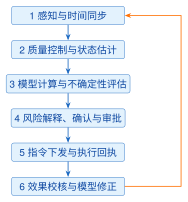
<figcaption>图 6.12  数字孪生水利平台云边协同部署</figcaption>
</figure>

部署设计需明确网络分区、离线时长、数据补传顺序、模型降级和灾备目标。例如模型服务不可用时，平台仍应展示经质检的实时数据和已批准阈值规则；不能把整个监控能力绑定在单一模型上。

### 6.4.14 安全、权限与失效降级

本节给出安全边界、职责分离和降级原则；案例中底板与算法解耦、权限范围和模拟标注的实现见8.5.8节。无论使用何种产品，权限判断都必须在后端完成，高风险建议必须保留审批与回滚证据。

数字孪生汇集工程数据并可能连接执行设备，需把安全边界纳入架构。身份认证确认主体，授权限制其对象和操作范围；网络分区隔离办公、平台、现场控制等区域；传输和存储加密保护数据；审计记录关键查询、模型发布、告警确认和控制命令。表6.14把常见失效场景与对应降级策略并列：模型服务不可用时保留实时监测与历史查询，三维底板加载失败时退回二维地图与列表，边缘断网时以本地缓存维持基本告警。降级策略必须事先写明并演练过，临场决定的降级往往把问题放大。

**表 6.14  数字孪生平台的失效场景与降级策略**

| 失效场景         | 风险               | 预期降级                               |
|:-----------------|:-------------------|:---------------------------------------|
| 现场网络中断     | 实时状态停更       | 边缘缓存、标记数据龄期、恢复后按序补传 |
| 关键测站缺测     | 模型输入不完整     | 降低可信度或停算，禁止静默填零         |
| 模型服务超时     | 预报/分析不可用    | 保留实时展示和批准的静态规则           |
| 消息重复或乱序   | 状态回退、重复告警 | 事件去重与状态版本检查                 |
| 三维模型加载失败 | 空间界面不可用     | 降级到二维地图、表格和告警列表         |
| 身份服务故障     | 权限无法确认       | 高风险操作默认拒绝，保留只读应急入口   |

高风险控制采用职责分离：分析人员提出建议，授权人员审批，执行系统校验有效期和设备状态。系统不得因“自动化”跳过工程运行规程。紧急手动操作也要在恢复后补录原因和结果。

安全测试包括越权访问、令牌失效、重放、消息篡改、接口限流和审计完整性。三维前端同样属于攻击面，模型文件、纹理和属性数据要进行来源校验，避免把不可信脚本或敏感属性直接交付浏览器。

### 6.4.15 可观测性、数据血缘与运行值守

本节给出服务、数据、模型和业务闭环的可观测框架；案例中的备份、恢复、值守时间线和复盘记录见8.6.2节。框架要求指标能够回答“是否可用、是否可信、是否已处置”，案例则把问题落实为看板、日志和演练脚本。

平台上线后，运行团队必须回答三个问题：当前服务是否可用，当前数据是否可信，当前模型结果能否用于业务。仅监控CPU和内存无法回答后两个问题，因此需要把服务、数据、模型和业务闭环统一纳入可观测体系。表6.15按服务、数据、模型和业务闭环四层给出对应指标。四层各自回答一个问题：服务层回答“能不能用”，数据层回答“数据是否新鲜完整”，模型层回答“结果是否落在适用范围内”，闭环层回答“预警有没有被处置”。只盯着第一层，后三层的故障会以“系统一切正常”的形式被掩盖。每条关键链路应配置服务级目标（Service Level Objective，SLO），并明确统计窗口、允许失败比例、告警责任人和处置时限。

**表 6.15  数字孪生平台的分层可观测指标**

| 层面 | 关键指标                             | 典型异常                     | 处置责任   |
|:-----|:-------------------------------------|:-----------------------------|:-----------|
| 服务 | 可用率、P95延迟、错误率、队列积压    | 接口超时、消费滞后、缓存击穿 | 平台运维   |
| 数据 | 到达延迟、完整率、重复率、质量码分布 | 测站断报、时钟漂移、单位突变 | 数据值守   |
| 模型 | 运行成功率、残差、漂移、置信区间覆盖 | 输入越界、参数失效、结果突跳 | 模型负责人 |
| 业务 | 告警确认时长、工单闭环率、指令回执率 | 告警无人确认、工单长期挂起   | 业务值班   |
| 安全 | 越权拒绝、异常登录、审计缺口         | 令牌滥用、批量探测、日志中断 | 安全管理员 |

一次渗压异常从传感器采集到处置完成，至少跨越测点、边缘网关、消息主题、清洗规则、状态估计、异常模型、告警服务、三维界面和工单系统。应为这条链路分配贯穿始终的事件标识或关联标识，使日志、指标和追踪记录可以按同一业务事件聚合。若只记录各系统内部编号，事故复盘时就难以证明某个告警使用了哪一批原始数据和哪个模型版本。

数据血缘记录数据集从来源到结果的变换关系。最小血缘节点包含来源标识、时间范围、处理规则版本、输入与输出校验摘要、执行状态和责任主体；模型结果还要关联模型卡、参数集和运行环境。血缘不是另存一份不可维护的说明文档，而应由采集、计算和发布流程自动写入元数据存储，并能从三维对象或告警详情反向查询。

图6.13把血缘链从原始观测一直画到处置复盘：每一步都记录输入摘要、规则版本和执行状态，因此复盘时可以沿链反向定位，判断偏差究竟来自数据、规则还是模型。

<figure markdown>
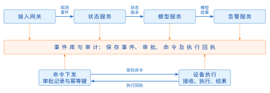
<figcaption>图 6.13  从原始数据到处置复盘的血缘与证据链</figcaption>
</figure>

值守界面应按影响范围和紧迫程度合并告警，避免同一根因产生大量重复提示。告警必须包含对象、发生时间、当前值、质量码、触发规则、推荐动作和确认入口；抑制、合并或关闭告警也要保留操作者与理由。交接班记录尚未恢复的数据源、降级中的模型、未闭环工单和临时权限，防止信息只停留在即时通信中。

当数据质量或模型表现持续低于阈值时，系统应自动降低结果可信等级，必要时退出自动推荐，但仍保留原始数据、二维地图和人工规程。恢复正常不能只看服务重新启动，还应完成积压补传、时间顺序校验、状态重算、告警去重和责任人确认。这样，可观测性才从“发现程序故障”扩展为“证明业务链路已经可信恢复”。

### 6.4.16 验证、验收与持续改进

本节给出数据、空间、模型、服务、闭环和运维六类验收框架；案例水库的失效降级、验收脚本和阶段门禁见8.5.15节。验收证据应从通用指标回到具体输入、版本、责任人和复核结果。

数字孪生验收既包含软件质量，也包含数据和模型可信度。建议分为数据、空间、模型、服务、闭环和运维六类指标。表6.16列出这六类的具体检查项。使用时应逐项确认证据形式：写一句“模型精度满足要求”不算通过，需要指出用哪一组检查数据、在什么工况下、得到什么误差指标。

**表 6.16  数字孪生平台验收检查项**

| 类别 | 检查项                           | 证据                   |
|:-----|:---------------------------------|:-----------------------|
| 数据 | 完整率、时效、单位、质量码、血缘 | 抽样记录与异常处置日志 |
| 空间 | CRS、高程基准、控制点、模型对齐  | 校核报告与同名点误差   |
| 模型 | 适用范围、参数、校准、回放结果   | 模型卡、版本和测试数据 |
| 服务 | 可用性、延迟、错误处理、权限     | 压测、安全测试和监控   |
| 闭环 | 告警到工单、指令到回执、责任追踪 | 演练记录与审计链       |
| 运维 | 备份、降级、灾备、变更和回滚     | 运维手册与恢复演练     |

上线前使用历史典型洪水、设备故障和缺测场景回放；上线后持续统计模型残差、告警准确性、处置时长和数据质量。改进必须经过版本化、测试、审批和回滚准备。

### 6.4.17 课程项目实施路线

本节给出课程项目的四次迭代路线；案例中的端到端实现切片、验收脚本和分阶段交付见8.5.13节。学生先完成对象和坐标契约，再做场景绑定、模型服务和业务闭环，每一轮都提交可复现证据。

课程项目不要求一次实现完整流域数字孪生，可分四次迭代，每次形成可验收成果。表6.17把四轮的任务、交付物和验收重点逐行列开。按这张表推进的好处是每一轮都能独立答辩：第一轮拿不出完整的对象编码和数据字典，第二轮的三维定位就无从检验；反过来，只要前两轮的边界和元数据是对的，后两轮即使模型简化为经验公式，闭环仍然成立。第一轮建立对象编码、空间基准和数据样例；第二轮完成三维场景与状态绑定；第三轮接入一个模型或规则并形成事件；第四轮完成处置闭环、测试和演示。

**表 6.17  数字孪生课程项目的四次迭代**

| 迭代 | 主要任务                          | 交付物             | 验收重点               |
|:-----|:----------------------------------|:-------------------|:-----------------------|
| 一   | 场景选择、对象编码、CRS与数据字典 | 范围说明、数据样例 | 边界和元数据完整       |
| 二   | 加载GIS/三维模型、绑定对象状态    | 可交互页面、映射表 | 定位正确、异常可见     |
| 三   | 实现质检、规则或简化模型          | 模型卡、结果事件   | 输入契约、版本可追踪   |
| 四   | 告警处置、审计、测试和降级        | 演示系统、验收报告 | 闭环可复现、失败可降级 |

团队角色可分为数据/空间、前端场景、后端服务和测试集成，但接口与对象编码必须共同评审。每次迭代使用同一组场景用例，避免各成员分别制作无法拼接的演示。

最终演示应包含正常流、数据质量异常、模型不可用和无权限操作四类场景。验收报告记录输入文件、运行版本、操作步骤、预期和实际结果，使其他小组能够复现，而不仅是录制一段成功视频。

### 6.4.18 发展重点

判断一个技术方向值不值得投入，看它能不能落到一条可以测量的指标上。下面六个方向都能，所以值得持续关注。

模型可信度与不确定性表达，衡量的是模型卡是否记录了适用范围与已知失效条件，以及预报结果能否给出区间而不只是一个数；验证方式是用历史场景回放，统计实测值落在给出区间内的比例。跨系统语义互操作，衡量的是同一座水库在不同系统里的编码、名称和特征水位是否一致；验证方式是抽取若干工程做跨库比对，冲突数应当趋近于零。云边协同，衡量的是断网期间边缘侧能否继续采集与本地判断、恢复后数据是否按事件时间正确回补；验证方式是拉断网络若干分钟再接上，检查有无缺测空洞和重复入库。

面向事件的实时数据处理，衡量的是从观测到达到预警生成的端到端时延，以及消息积压在汛期峰值下的恢复速度。人在回路的决策支持，衡量的是每一条进入执行的指令是否都能回溯到审批人、依据的模型版本和输入快照。网络与数据安全，衡量的是权限越界尝试能否被拒绝并留痕、密钥能否在不停机的情况下轮换。

反过来说，如果一个方向说不清用什么指标验证、在什么场景下算失败，那它就还停留在概念阶段，适合课堂讨论而不适合写进建设方案。

我国数字孪生水利建设强调流域防洪、水资源管理和工程运行等实际任务<sup>[[5]](../../references.md#ref5)[[3]](../../references.md#ref3)</sup>。平台规划应从可闭环的业务问题出发，逐步扩展数据、模型和服务，而不是先建设不可维护的全量高精度场景。

## 6.5 小结

三维的目标不是把模型渲染得更像，而是让空间表达能够承担业务判断。本章从 WebGL2 的坐标变换与渲染管线讲到 Three.js 的场景组织与模型加载，从 OGC 地图与要素服务讲到倾斜摄影、BIM/IFC 与数字孪生架构，贯穿其中的是三个不能含糊的量。

第一个是坐标。CGCS2000 地理坐标、高斯–克吕格平面坐标和场景局部坐标各有各的单位与适用范围，转换时必须同时记录基准、投影带、单位和精度，任何一项缺失都会让“定位偏了几米”变成无法追查的问题。第二个是高程。GNSS 给出的是椭球高 $h$，水利工程使用的是 1985 国家高程基准下的正常高 $H_\gamma = h - \zeta$，二者不能混写成同一个“海拔”字段；淹没线、闸顶和监测点高程都要标注高程类型、基准、转换模型与版本，缺少区域高程异常模型时程序应当拒绝静默换算，而不是拿一个常数顶上。第三个是标识。倾斜摄影成果、BIM 构件和业务对象来自三条不同的生产链路，只有落在同一套标识体系下，融合发布才谈得上成立。

数字孪生的可信度同样建立在这三个量之上：模型卡记录版本与适用范围，质量码区分“正常”与“证据不足”，数据血缘和运行回放让结论可以被复核，权限与失效降级保证异常时不产生看似正常的输出。缺了这些，三维平台就只剩下一次性的演示。

## 6.6 章末交付物

提交一个水利工程三维场景方案：空间参考与高程基准说明；GIS、倾斜摄影和BIM模型清单；一段可运行的Three.js或Cesium加载代码；数字孪生五维映射、分层架构和一条业务闭环；以及数据、模型和系统验收表。

## 6.7 思考题与练习题

1.  

2.  MVP矩阵中的$V$表示（）。A. 模型矩阵B. 观察矩阵C. 投影矩阵D. 纹理矩阵

3.  CGCS2000地理二维坐标系的EPSG代码是（）。A. 4326B. 3857C. 4490D. 4547

4.  WMS以预定义瓦片矩阵为核心。（判断：对／错）

5.  `Cesium3DTileset.fromUrl`应等待Promise完成后再加入场景。（判断：对／错）

6.  像控点的坐标来自外业测量，可参与空三约束。（判断：对／错）

7.  数字孪生数据维度只包含清洗算法，不包含实时和历史数据。（判断：对／错）

8.  

9.  说明模型、世界、观察和裁剪坐标系的变换关系。

10. 比较WMS、WMTS和WFS的返回内容及水利应用场景。

11. 解释椭球高与1985国家高程基准正常高的区别，并列出数据入库所需元数据。

12. 某测站经度为113°42′E，分别按6度带和3度带计算带号与中央经线，并说明应在交付元数据中记录哪些分带信息。

13. 某点GNSS测得大地高$h=245.30\,\mathrm{m}$，该区高程异常$\zeta=-8.62\,\mathrm{m}$，求1985国家高程基准下的正常高$H_\gamma$，并写出计算式。

14. 说明倾斜摄影特征点、连接点、像控点和检查点的区别。

15. 结合IFC 4.3官方范围，说明闸门、坝体和廊道应如何避免错误实体映射。

16. 为某水库绘制数字孪生五维映射，说明模型结果如何进入人工确认和处置闭环。

17. 

18. 在一课时内完成一个GLB模型加载、定位和业务标识绑定，并记录包围盒与加载错误处理。

19. 使用5个以上独立检查点计算$m_x$、$m_y$、$m_p$和$m_h$，依据适用规范给出的平面点位与高程限差判断成果是否合格；对绝对残差超过2倍中误差的点建立复核记录，对超过3倍中误差的粗差候选说明复核、剔除理由及前后统计量。

20. 以模板补全表6.16，为一个大坝渗压异常场景设计最小验收用例集。
