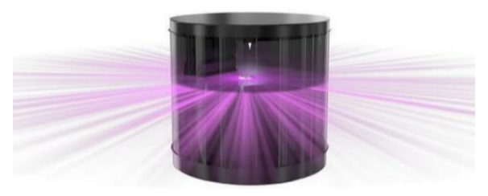
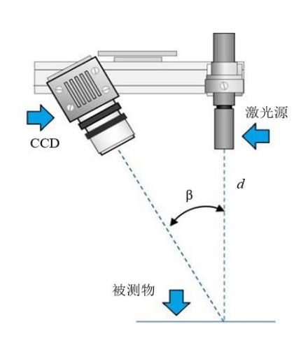
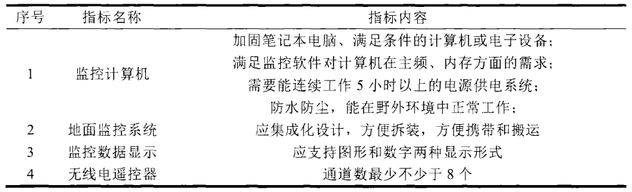
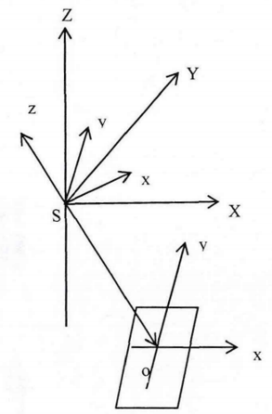
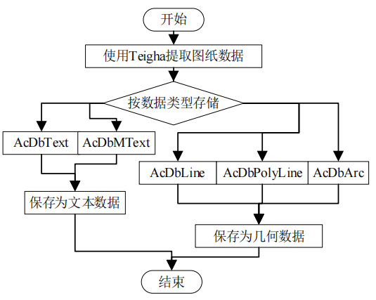
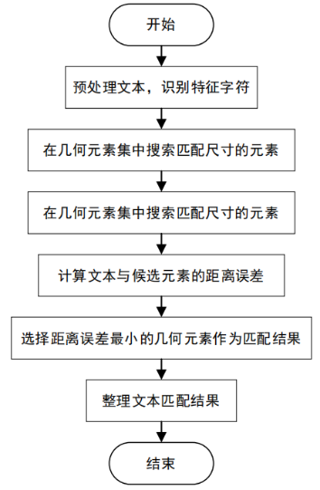
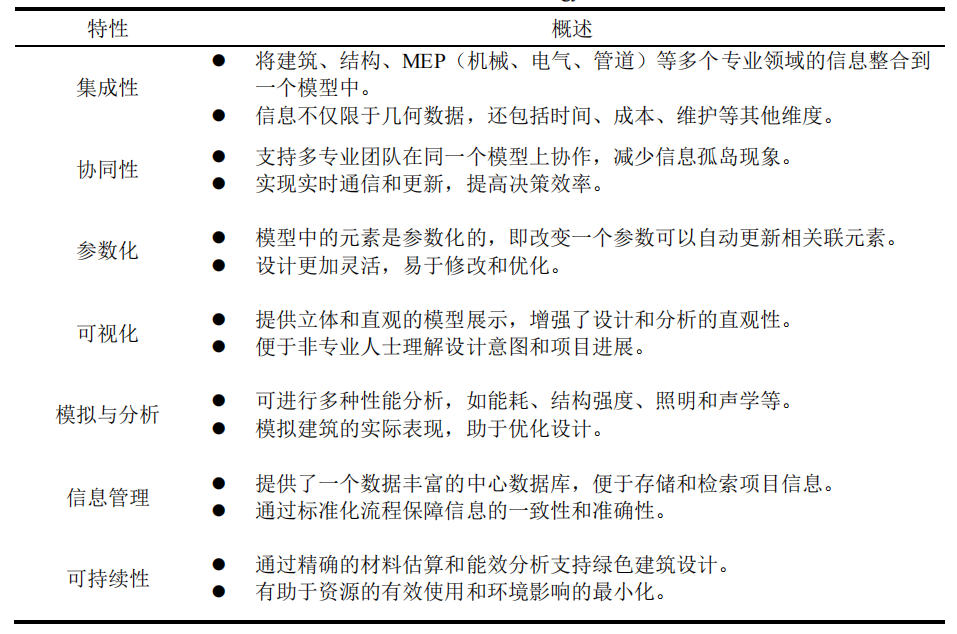

## 6.1 三维场景技术概�?
三维场景技术，作为计算机图形学与计算机视觉发展的重要成果，近年来在多个行业中得到了广泛应用。在智慧水利领域，三维场景技术更是成为推进水利信息化和数字化转型的关键支撑手段之一。该技术通过在虚拟环境中模拟现实世界的物体、场景和动态过程，实现对现实水利系统的高度还原与直观表达。借助高精度的地理信息数据与多源水利数据，三维场景不仅能够再现复杂的地形地貌和水系结构，还可以对水利工程的建筑形态、运行机制及其与周边环境的关系进行动态演示和实时交互�?
与传统的二维图纸和文字报告相比，三维场景具有更强的沉浸感、交互性和信息承载能力，使得水利工程的空间布局、结构逻辑及运作流程能够被更清晰地感知和理解。在智慧水利建设中，通过三维可视化平台，工程人员可以在虚拟环境中进行全方位的观察、分析与仿真，从而提升规划设计的科学性，优化施工组织与运维管理。同时，在防汛抗旱、水资源调度、水文预警等场景中，三维场景还能与实时监测数据联动，构建动态的“数字孪生”系统，实现对水利工程运行状态的可视化监控与辅助决策�?
此外，三维场景技术还具备良好的可拓展性和兼容性，能够与GIS系统、BIM模型、物联网传感器、大数据平台等进行融合应用，打造功能丰富、结构清晰、可持续迭代的水利信息系统。尤其是在当前“数字中国”、“智慧水利”、“新型基础设施建设”等国家战略持续推进的背景下，三维场景正逐步从单一的展示工具演变为承载分析计算、预测模拟和智能决策的核心平台�?
因此，全面了解三维场景技术的构建原理、关键方法和实际应用，已成为智慧水利从业人员的重要能力要求。本章内容正是围绕该技术在智慧水利领域的实际需求，系统介绍其理论基础、技术体系、构建流程及典型应用案例，帮助读者在掌握核心技术的同时，具备将其应用于实际水利工程中的综合能力�?
### 6.1.1 三维场景的组成要�?
在智慧水利三维场景构建中，三维模型是构成虚拟场景的核心要素之一，是实现现实世界数字化、可视化表达的基础。所谓三维模型，指的是对现实场景中各类物体进行几何形态和空间结构的数字化建模与表达，它不仅决定了场景的可视质量和空间真实感，也直接关系到后续的分析模拟、交互操作和系统集成的效率与效果。在智慧水利三维场景中，常见的三维模型主要包括以下几类：

地形模型主要用于表达地表的高程起伏和地貌特征，是构建整个三维场景的基础框架。通常采用数字高程模型（DEM, Digital Elevation Model）或数字地表模型（DSM, Digital Surface Model）进行建模，通过高程栅格数据构建出真实地形的三角网（TIN）或格网结构。在水利工程中，精确的地形建模对于水流模拟、水库调度分析、洪水预警等具有重要意义�?
建筑模型主要用于表示水利工程中的各类人工构筑物，如大坝、水闸、泵站、渠道、取水口等。这些模型不仅需要在几何形态上真实反映建筑物的结构，还需包含材质、构件属性等信息，便于进行施工过程模拟、运行状态演示与管理维护。部分高级模型甚至融合了BIM（建筑信息模型）技术，实现构造信息与工程数据的高度集成�?
水体模型用于表现河流、湖泊、水库、水道等水域要素的空间形态与动态变化。不同于静态的固体建筑模型，水体通常具有动态性，因此在三维建模中，需结合流体动画、透明度变化、波浪纹理等多种渲染技术，模拟真实的水流流动、水位变化和水面反光效果。此外，水体模型还可与水文模拟系统联动，展示实时水位、流速、水质等数据�?
植被模型则用于构建场景中的绿化覆盖区域，如山体植被、堤坝护坡草皮、流域林地等。常用的方法包括基于纹理贴图的简化建模与基于L-system等算法的真实植物建模，具体可根据场景精度要求进行权衡。合理的植被模型不仅提升视觉真实感，还可为流域生态分析、水土保持评估等提供辅助支持�?
通过上述各类三维模型的综合构建与协调应用，可以还原出一个空间结构真实、信息表达丰富、动态变化合理的智慧水利三维场景。在构建过程中，还需充分考虑模型的精度需求、数据获取方式、资源加载效率以及与其他系统（如GIS、BIM、监测平台）的协同接口，确保整个系统既具备强大的表达能力，也具备良好的运行性能和可扩展性�?
#### 6.1.1.1 三维模型

一、地形模�?
地形模型中最常见的即为数字高程模型（Digital Elevation Model，DEM)，是通过有限的地形高程数据实现对地面地形的数字化模拟（即地形表面形态的数字化表达）。它是用一组有序数值阵列形式表示地面高程的一种实体地面模型，是数字地面模型（Digital Terrain Model，DTM）的一个分支，其它各种地形特征值均可由此派生。数字地面模型（Digital Terrain Model，简�?DTM），是对地球表面裸露地形（即不包括植被、建筑物等覆盖物）的高程信息进行数字化描述的一种模型。DTM 是地理空间建模中重要的基础数据类型，广泛应用于测绘、地理信息系统（GIS）、水利工程、交通规划、环境模拟等多个领域。数字地面模型是地形建模的一种形式，它通过一系列规则或不规则分布的高程点（通常为三维坐标：X、Y、Z）来表达实际地面（“地表”的物理表面）在空间上的连续变化。与数字表面模型（DSM）相比，DTM 是在去除了地物（如树木、房屋、电线塔等）之后所获得的“纯地面”模型，强调的是对自然地貌的真实再现。数字地面模型更通用的定义是描述地球表面形态多种信息空间分布的有序数值阵列，从数学的角度，可以用以下二维函数系列取值的有序集合来概括地表示数字地面模型的丰富内容和多样形式�?
$$
K_p = f_k(u_p,v_p)(k=1,2,3,\cdots,m;p=1,2,3,\cdots,n)
$$
(6.1.1)

式中�?$K_p$为第*$p$*号地面点（可以是单一的点,但一般是某点及其微小邻域所划定的一个地表面元）上的�?$k$*类地面特性信息的取值；$u_p,v_p$为第*p*号地面点的二维坐标，可以是采用任一地图投影的平面坐标，或者是经纬度和矩阵的行列号等；*m*�?m*大于等于1)为地面特性信息类型的数目�?n*为地面点的个数。当上述函数的定义域为二维地理空间上的面域、线段或网络时，*n*趋于正无穷大；当定义城为离散点集时，*n一般为有限正整数�?
在式(6.1.1)中，�?m*=1且人为对地面高程的映射，($u_p,v_p$)为矩阵行列号时，�?6.1.1)表达的数宁地面棋型即所谓的数字高程模型（DEM)。显然，DEM是DTM的一个子集。实际上，DEM是DTM中最基本的部分，它是对地球表面地�?
地貌的一种离散的数字表达�?
总之，数字高程模型DEM是表示区�?D*上的三维向量有限序列，用函数的形式描述为�?
$$
V_=(X_i,Y_i,Z_i)(i=1,2,3,\cdots,n)
$$
 (6.1.2)

式中�?X_i,Y_i$是平面坐�? $Z_i$�?$X_i,Y_i$)对应的高程。当该序列中各平面向量的平面位置呈规则格网排列时,其平面坐标可省略,此时DEM就简化为一维向量序�?|Z_i,i=1,2,3,\cdots,n|$�?
与传统地形图比较，DEM作为地形表面的一种数字表达形式有如下特点�?
�?）容易以多种形式显示地形信息。地形数据经过计算机软件处理后，产生多种比例尺的地形图、纵横断面图和立体图。而常规地形图一经制作完成后，比例尺不容易改变，改变或者绘制其他形式的地形图，则需要人工处理�?
�?）精度不会损失。常规地图随着时间的推�?图纸将会变形，失掉原有的精度。而DEM采用数字媒介，因而能保持精度不变。另�?由常规的地图用人工的方法制作其他种类的地图，精度会受到损失，而由DEM直接输出，精度可得到控制�?
�?）容易实现自动化、实时化。常规地图要增加和修改都必须重复相同的工�?劳动强度大而且周期�?不利于地图的实时更新。而DEM由于是数字形式的,所以增加或改变地形信息只需将修改信息直接输人到计算�?经软件处理后立即可产生实时化的各种地形图。概括起�?数字高程模型具有以下显著的特�?便于存储、更新、传播和计算机自动处�?具有多比例尺特�?�?m分辨率的DEM自动涵盖了更小分辨率�?0m�?00m的DEM内容;特别适合于各种定量分析与三维建模�?
二、数字高程模型的分类

根据不同的分类标准，可以有不同的类型�?
1、根据大小和覆盖范围分类

局部的DEMs(Local)：建立局部的模型往往源于这样的前�?即待模拟的区域非常复杂，只能对一个个局部的范围进行处理�?
全局的DEMs(Global)：全局性的模型一般包含大量的数据并覆盖一个很大的区域,并且该区域通常具有简单、规则的地形特征。或者为了一些特殊的目的如侦�?只需要使用地形表面最一般的信息�?
地区的DEMs(Regional)：介于局部和全局两种模型之间的情况�?
2、根据模型的连续性分�?
不连续的DEMs(Discontinuous):一个不连续的模型表面源于这样的考虑,即每一个观测点的高程都代表了其邻域范围内的值。基于这样的观点,任何待内插的点的高程都可以利用最邻近的参考点近似。这时，一系列局部的表面被用来表示整个地形�?
连续的DEMs(Continuous):与不连续的DEMs相反,连续的模型表面基于这样的思想,即每个数据点代表的只是连续表面上的一个采样�?而表面的一阶导数可以是连续的也可以是不连续的。但这里的定义还是限定于一阶导数不连续的情�?因为任何一阶导数或更高阶导数连续的表面将被定义为光滑表面。连续的DEMs包含的是相互连在一起的一系列局部表面或面片，从而形成地形整体的一个连续表面�?
光滑的DEMs(Smooth):光滑DEMs指的是一阶导数或更高阶导数连续的表面,通常是在区域或全局的尺度上实现。创建这种模型一般基于以下假�?模型表面不必经过所有原始观测点,待构建的表面应该比原始观测数据所反映的变化要平滑得多�?
二、建筑模�?
在智慧水利三维场景构建中，水利工程建筑物的三维表达是实现真实感、高还原度虚拟仿真场景的核心内容之一。所谓水利工程建筑物，主要包括大坝、水闸、泵站、溢洪道、闸门、引水管道等具有复杂几何结构和关键功能的工程设施。这些建筑物在整个水利系统中起着关键的调控、输送和保护作用，其形态、结构和运行状态对水利系统的安全性和运行效率具有重要影响�?
传统的水利工程设计与管理中，工程建筑物多以二维图纸、剖面图或文字描述的形式进行表达，虽然能呈现基础结构信息，但在空间理解、形态感知以及整体系统的可视化呈现方面存在明显的局限。而随着计算机图形学、BIM（建筑信息建模）、GIS（地理信息系统）和三维建模技术的发展，水利工程建筑物的三维表达已逐渐成为智慧水利建设的重要组成部分。三维表达不仅能够以高度仿真的形式再现水利建筑物的几何形状和空间布局，还可以集成属性信息、运行状态以及与周边地理环境的空间关系，为工程规划、可视化设计、虚拟施工模拟、运行监测与预警提供技术支撑。例如，在构建一个三维大坝模型时，不仅需精确表达大坝的坝体外形、内部结构（如坝基、泄洪洞、排水孔等），还可叠加水位变化、渗压分布、结构应力等动态信息，实现多维度的融合展示。再如水闸三维建模，可以详细还原闸门类型（平面闸门、弧形闸门）、启闭设备、闸室结构等，结合水流仿真可实现水流调度过程的三维动态演示�?
在技术实现方面，水利工程建筑物的三维建模通常采用多源数据融合与多阶段建模方法。常见的数据来源包括工程设计图纸（CAD、Revit 等）、无人机航测影像、激光扫描点云数据（LiDAR）、遥感影像和现场测绘成果。通过对这些数据的整合处理，可逐步构建出结构合理、细节清晰、精度较高的三维模型。在软件工具选择方面，可依据具体需求采�?BIM 建模软件（如 Revit、Tekla）、三维建模平台（�?SketchUp�?ds Max）、GIS 平台（如 ArcGIS、Cesium）等实现建模与可视化效果渲染�?
此外，三维水利建筑物模型还可与其他系统进行集成应用。例如与水文模型对接，实现洪水演进对大坝安全的模拟分析；与传感器网络集成，实现结构状态和运行数据的实时更新与动态可视化；与虚拟现实/增强现实（VR/AR）技术结合，提供沉浸式巡检培训、事故演练和公众展示平台。在实际工程应用中，三维水利建筑物模型已在多个智慧水利示范项目中取得显著成效。如南水北调工程的枢纽建筑三维展示平台，不仅可用于公众宣传和科普教育，还用于辅助调度决策和运维管理。又如城市排涝系统中的闸门控制模拟系统，通过三维交互界面可直观展示闸门开度调节对下游水位和淹没范围的影响，提高调度效率和应急响应能力�?
总之，水利工程建筑物的三维表达不仅提升了工程信息的空间可视化能力，也为构建数字孪生水利系统、实现水利工程全生命周期的数字化管理提供了坚实的基础。在今后的智慧水利建设中，三维表达技术将继续拓展其应用范围，并逐步与人工智能、大数据、物联网等先进技术融合，推动水利行业向更加智能化、可视化、精细化的方向发展�?
三、水体模�?
水体模型是智慧水利三维场景构建中的重要组成部分，其主要目标是以三维可视化的方式真实、动态地再现自然水体的空间分布、形态特征以及水动力过程。水体模型不仅包括对静态水体形态的几何建模，也涵盖了对水文、水力等动态变化过程的模拟与可视化。通过构建高精度的河流、湖泊、水库、渠道等水体的三维表达，相关部门可以更直观地分析水体变化规律、水资源分布、水环境状态等，为水利工程规划与调度、水灾预警、水环境治理等工作提供科学依据和技术支撑�?
在河流模型构建中，通常需要结合数字高程模型（DEM）与实测水文数据，通过流域划分、河道提取、水面线计算等步骤建立河道骨架与断面结构，并进一步通过三维建模手段重建河流的空间形态。河道两岸的地形、堤防结构以及沿线水利设施也可作为辅助要素加入整体模型中，形成一个完整的河流三维场景。在动态模拟方面，可引入水动力学模型对河道中水流流速、水位、水深等进行计算，并将结果映射至三维模型中，实现水流运动的实时或近实时可视化，为洪水预报、排涝调度、航道设计等提供辅助决策工具。湖泊与水库的三维建模则更侧重于水面与水下地形的完整表达。首先，需要基于遥感影像、测深数据与地形数据确定湖泊或水库的边界、水面高程和库底地形，再通过面片重构、水面拟合等方法生成其三维形态。在不同水位条件下，模型可动态调整水体边界与体积，模拟湖泊在降雨、蒸发、调水等水文过程影响下的变化情况。此外，湖泊水体的透明度、水质、温度分层等物理属性也可以通过三维可视化技术进行表达，使得湖泊模型不仅具备几何可视化功能，还能够反映生态水文特征，有助于环境监测与生态保护�?
在构建水体模型的过程中，还需考虑以下关键技术因素：一是水体边界的提取与更新，尤其是洪涝、干涸等极端条件下水体形态快速变化的建模能力；二是与其他三维元素（如地形、建筑、植被等）的空间关系处理，确保模型整体协调统一；三是水体动态变化的模拟与动画表达，如水面波动、水流方向与速度、水面上涨与退却等效果的真实再现；四是多源数据的融合处理，包括遥感影像、无人机航拍、激光雷达（LiDAR）点云、水文监测数据等，确保建模数据的时效性与精度�?
现代三维可视化平台如Cesium、Unity 3D、Unreal Engine等为水体建模提供了强大的技术支持。这些平台支持对水体材质、水面反射、透明度、动态效果等的高度定制，能够实现仿真级别的水体视觉效果。此外，通过与水文数值模拟软件（如MIKE、HEC-RAS、OpenFOAM）对接，还可以将模拟结果实时接入三维平台，进一步提升模型的科学性与实用性�?
综上所述，水体模型作为智慧水利三维场景中的关键内容，不仅承担着对水体静态几何形态的表达任务，更逐渐拓展为融合水文、水力、生态等多维要素的综合表现平台。通过其构建与应用，不仅可提升水利工程管理的科学化水平，也可为公众科普、水资源调度、应急响应等领域提供有力的技术支撑，是智慧水利建设不可或缺的基础模块之一�?
四、植被模�?
植被模型在三维场景中的表达是虚拟环境建模中的一个关键环节，尤其是在自然景观的虚拟重现中，它不仅影响着整体视觉效果，还对场景的真实感与沉浸感产生了深远的影响。植被覆盖作为自然界中不可或缺的一部分，其表现方式和细节再现的精确度，往往决定了虚拟环境的真实度。植被的三维表达，不仅仅是对单一植被的建模，更是要全面地呈现出整个生态环境中植被的多样性、层次感和生长变化�?
植被的三维建模通常采用几何建模和程序化生成两种方法。几何建模方式适合对个别植物进行高精度建模，尤其是对于需要细致描绘植物形态的应用场景，如电影特效和高端视觉模拟。这类建模方法需要采集大量真实植物的几何数据，并通过建模软件进行细致的处理，生成精确的三维模型。然而，这种方式在处理大规模场景时，其效率和计算资源的消耗较为庞大，通常不适用于需要快速生成复杂植被环境的情况�?
与此相比，程序化建模技术则是通过算法生成植被模型，具有更高的灵活性和效率。程序化模型往往依托于自然界植物生长的规律，如分形理论和L-systems（L系统），生成符合生长逻辑的植被。这种方法的优势在于能够以较少的资源消耗，生成大量的植被元素，同时也能根据场景需求进行动态调整。程序化建模尤其适用于大规模的环境模拟，能够根据不同的地理和气候条件，自动调整植被的种类和分布。在大规模场景中，植被的表现不仅仅依赖于静态的几何建模，还需要考虑到动态元素的加入，如风力的影响、季节的变化等。植被的动态表现使得场景更加生动与真实。例如，风力影响下树木的摇曳、季节变换中的树叶变色、草地上随着时间推移的生长状态，都是增加场景沉浸感的重要元素。在这些动态模拟中，粒子系统和物理引擎起到了至关重要的作用，能够模拟植物在风中的摇摆、落叶的飘动等现象，使得植被的表现更加自然、真实�?
虚拟环境中植被的三维表达不仅仅是为了美观，其在各种应用场景中都起到了至关重要的作用。例如，在虚拟城市建模中，植被的三维建模能够展现城市中的绿化带、公园以及生态环境，帮助设计师在城市规划时进行更精确的环境模拟。在生态环境模拟和气候研究中，植被的变化也能为科学研究提供重要的参考数据。通过虚拟环境中的植被模型，研究人员能够预测在不同气候条件下，植物的生长状态及其对生态系统的影响�?
此外，植被的三维表达在游戏开发、电影特效和虚拟旅游等领域也得到了广泛的应用。在开放世界游戏中，植被不仅要展现不同地形下的生态特点，还要具备与玩家互动的能力。例如，在一个森林场景中，玩家可以触发植被的动态变化，如推倒一棵树或经过时草地随之晃动，这种互动性大大增强了游戏的代入感。在电影特效中，精细的植被建模能够为场景增添更多的视觉冲击力，使得虚拟世界的重现更加接近现实�?
尽管目前植被三维建模技术已经取得了显著的进展，但仍然面临诸多挑战。首先，植被模型通常细节复杂，尤其是叶片、枝条等部分的建模，往往需要大量的计算资源。其次，在大规模虚拟环境中，如何高效渲染大量的植被元素，避免性能瓶颈，依然是技术难点之一。此外，随着实时渲染技术的发展，如何使植被在复杂环境中的表现更加生动、自然，仍然是一个值得深究的问题。展望未来，随着计算机硬件的进步与算法的优化，植被的三维建模将在精度和效率上取得更大突破。程序化生成技术将得到更加广泛的应用，人工智能和机器学习技术的引入，也可能改变传统植被建模的方式。通过AI算法，系统能够根据地理、气候等因素，自动生成最合适的植被类型，甚至能够实时模拟植物的生长过程，提供更加灵活和智能的环境模拟。总之，植被模型的三维表达不仅仅是虚拟环境中的装饰元素，它们在多个领域中扮演着至关重要的角色。随着技术的不断进步，植被的三维建模将变得更加精细和动态，为我们提供更加真实、沉浸的虚拟体验。无论是在生态环境保护、城市规划，还是在娱乐和影视制作中，植被的三维表现都将是虚拟世界中不可或缺的一部分�?
#### 6.1.1.2 模型纹理与材�?
模型材质（Material）、纹理（Texture）、贴图（Texture Map）是计算机图形学中的三个概念，它们之间存在关系但也有一些区别。模型材质（Material）是描述物体外观和光学特性的属性集合。它包括物体的颜色、反射属性（如漫反射、高光反射）、透明度、折射率等。材质定义了物体如何与光线进行交互，决定了物体在渲染时的外观效果。模型纹理（Texture）是一种图像，用于模拟物体表面的细节和纹理。它可以包含颜色信息、细节图案、纹理细节等。通过将纹理映射到模型表面，可以赋予模型更加真实的外观和细节。模型贴图（Texture Map）是将纹理应用到3D模型表面的过程。贴图是通过将纹理图像与模型的顶点或像素相匹配，使得纹理图像覆盖在模型表面，在渲染过程中，根据贴图的坐标信息来确定模型表面的颜色、纹理细节等。可以简单总结它们之间的关系和区别：材质定义了物体的外观和光学特性，纹理是用来模拟物体表面的细节。纹理贴图是将纹理应用到模型表面的过程，用来决定模型表面的颜色、纹理和细节效果。在渲染过程中，材质和纹理是相互配合使用的，材质定义了物体的属性，纹理贴图则通过提供具体的颜色和纹理信息来赋予模型真实感和细节效果�?
要设置材质、纹理和贴图，需要按照以下步骤进行操作：①、创建基本形状：首先，在3D建模软件中创建基本的形状，例如盒子或球体，作为我们要应用材质、纹理和贴图的模型。②、创建材质：�?D建模软件或渲染引擎中创建一个新的材质，并为其指定一个名称。材质是用来控制模型表面属性的容器，包括颜色、反射属性、纹理等。③、设置材质的属性：在创建的材质中，设置各种属性，例如颜色、反射属性（例如漫反射、高光反射）、透明度、折射率等。这些属性将决定模型的外观特性。可以通过调整属性值来实现所需的外观效果。④、准备纹理贴图：准备所需的纹理图像。可以使用图像编辑软件（如Photoshop）或在线纹理库获取合适的纹理图像。确保你选择的图像与你的模型和场景需求相匹配。⑤、导入纹理图像：将所有需要使用的纹理图像导入到你所使用�?D建模软件或渲染引擎中。通常可以通过在软件界面中拖放图像文件来实现导入。⑥、关联纹理贴图：在创建好的材质中，找到纹理贴图相关的选项或属性。这些选项通常会提供纹理贴图的位置和应用方式。通过指定纹理图像的路径，将其关联到材质上。⑦、调整纹理坐标：纹理贴图使用纹理坐标来确定图像在模型表面的位置和拉伸方式。你可以根据需要调整纹理坐标的缩放、旋转等参数，以确保纹理在模型上正确映射。⑧、创建UV映射：在3D建模软件中创建UV映射（也称为纹理坐标），将其应用于模型表面。UV映射是一种将2D纹理应用�?D模型表面的技术。⑨、应用材质：将创建好并设置好纹理贴图的材质应用到你的模型上。这通常可以通过选中模型并选择所需的材质来实现�?
#### 6.1.1.3 模型光照与阴�?
一、局部光照模�?
局部光照简单的说就是只考虑光源到模型表面的照射效果。在局部光照模型中，我们假定物体表面是光滑的且由理想材料构成，只考虑被照明物体的几何对反射和投射光的影响。在局部光照模型中，需要考虑的因素有�?
�?）环境光

环境光是指光线在场景中经过复杂传播之后，形成的弥漫于整个空间的光线，其光照方程可以表示为�?I_e=K_aI_a$，其�?I_a$表示环境光亮度，$K_a$表示环境光反射系数，$I_e$表示物体表面呈现的亮度�?
�?）漫反射

漫反射是指物体表面向周围辐射等强度的光照，通常这些物体的表面是粗糙并且无光泽的。满反射的光照模型可以表示为�?I_d=I_pK_d cos \theta$；其�?I_p$表示点光源的亮度�?K_d$表示漫反射系数，$\theta$表示入射角�?
�?）高光与镜面反射

高光是入射光在光滑物体表面形成的特别亮的区域，镜面反射是入射光照射在光滑物体表面的反射�?
�?）光的衰�?
光在光源到物体表面的过程中会有一个衰减的过程�?
�?）产生颜�?
在对物体表面进行着色之前，所先要选取合适的颜色模型，通常我们使用RGB颜色模型。最终的颜色由R，G，B三个颜色分量组合而成�?
�?）多光源

局部光照模型还可以表示多个光源照射物体表面的情况，我们只需要将每个　光源的光照方程计算完以后进行简单叠加即可�?
�?）阴�?
阴影是光照生成的，在真实世界中，光源大致可以被划分为三种，点光源，聚光光源和平行光源，不同的光源照射同一个物体会产生不同的类型的阴影�?
二、全局光照模型

全局光照简单的说就是考虑到环境中所有表面和光源相互作用的照射，采用全局光照模型可以极大改善图形渲染画质，但具有很大的性能消耗，几年前还无法想象将全局光照模型应用到实时系统中，但现在新一代的GPU可以帮助我们实现这样的效果�?
在全局光照模型中，物体表面的入射光由以下几个分两构成：�?）光源直接照射；�?）其他物体的反射光；�?）透射光。最常用的两种全局光照技术是光线跟踪(Ray Tracing)和辐射度(Radiosity)算法�?
#### 6.1.1.4 特效模拟

视化场景中，特效的模拟是提升真实感、增强沉浸感与表达环境氛围的重要手段。水流、雨、雾、云等自然特效，不仅是对真实物理环境的还原，更是场景氛围渲染、功能模拟与用户情感引导的关键元素。合理的特效设计与实现，能够让场景在视觉和交互层面更加生动、逼真，并提升整个系统的表现力和专业性�?
特效是三维特效中最具表现力和复杂度的元素之一。它通常用于表现河流、溪流、水渠、溢洪道等动态水体。实现方式主要包括基于纹理流动的动画贴图、Shader编程实现的法线扰动模拟、甚至基于粒子系统的水花飞溅模拟等。其中，贴图流动是最基础的方法，通过UV动画使水面纹理沿某一方向移动，营造水流动感；而使用法线贴图叠加扰动效果，则能模拟水面反光和波纹，更具真实感。对于较复杂的水流（如坝体泄洪、水流冲击障碍物等），可结合物理引擎或流体模拟算法（如SPH、FLIP）来提升真实度，使水流在碰撞、反弹、汇聚等细节上更加自然。此外，水体与光影的交互也是表现水流真实性的关键，可通过环境反射、高光闪耀、Caustics（光斑）效果进一步增强视觉效果�?
模拟通常依赖粒子系统进行实现。雨滴作为基本粒子，根据重力方向进行线性或曲线下落，在与地面或其他表面接触时可生成溅落水花、波纹扩散等细节特效。常见实现方式包括在摄像机视角前动态生成大量雨滴粒子，通过GPU加速渲染以保证性能。在真实天气模拟中，雨滴密度、下落速度、方向会根据风速、风向进行调整，而雨滴打在物体表面时的溅射、聚集、渗透等效果也可以通过Shader与法线扰动处理来增强表现力。为了进一步提升沉浸感，还可以结合环境音效（如雨声）、摄像机镜头上的“水珠”贴图模拟、打湿材质效果等，使用户仿佛置身真实雨天�?
是模拟空气中湿度和颗粒物影响视觉的典型特效，在场景中常用于表现远近景深、空间氛围、早晨或潮湿环境的朦胧感。实现方式通常采用体积雾（Volumetric Fog）或指数雾（Exponential Fog）算法。体积雾通过对空间内光线与颗粒物相互作用的体积渲染，可以表现出随视角变化而改变浓度和颜色的真实雾效，适用于室内、山谷、森林等复杂环境；而指数雾则基于距离与高度进行透明度衰减，是较为轻量级的实现方法。现代图形引擎中，雾效常与光照系统结合，通过体积光柱、遮挡雾等进一步增强层次感和神秘氛围。例如，在山间模拟中，用户在漫游过程中逐渐进入被雾气包裹的区域，画面边缘逐渐变得模糊，从而带来视觉过渡的真实体验�?
特效则是表现天气变化、时间变迁与高度环境的关键视觉元素。在不同类型的三维场景中，云的表现方式也不尽相同。远处天空的云层通常采用动态天空盒或天光散射模拟，通过多层贴图滚动、颜色渐变和光影混合展现云的流动与层次感；而近距离观察的云体，例如在无人机模拟或高空场景中，需要用到体积云技术（Volumetric Clouds），通过三维噪声函数（如Perlin Noise、Worley Noise）构建云体体积，模拟真实的稠密、透光、变化等特性。此外，随着时间变化与天气模拟系统的联动，云的形态、密度、亮度也应当动态变化，例如晴天云量稀疏且光亮，雷雨前则变得密集厚重，增强场景的沉浸性和动态性。在实际应用中，这些特效往往需要相互结合，并与时间、天气、用户交互等系统模块联动。例如，在三维水利仿真系统中，用户可通过时间轴选择不同气象条件，系统自动调整降雨强度、水流速度、雾气浓度与云层密布程度；在虚拟城市展示平台中，不同区域根据地形高度或功能分区展现不同的雾气、云影、湿润度，表现生态差异；在灾害演练平台中，暴雨、洪水、能见度降低等一系列动态特效可与警报系统联动，形成多感官的沉浸式体验�?
从技术实现层面来看，现代图形引擎（如Unity、Unreal、Cesium等）提供了丰富的特效支持，开发者可通过内置的粒子系统、Shader图形语言、后处理管线以及插件扩展快速构建各种自然特效。在性能优化方面，GPU并行渲染技术、LOD控制、多级采样与遮挡剔除等方法也被广泛应用，以确保特效在视觉真实的同时不影响系统整体流畅度。总的来说，水流、雨、雾、云等特效的模拟不仅丰富了三维场景的视觉表达，也在功能演示、环境还原、用户沉浸等方面发挥着不可替代的作用。未来，随着图形计算能力的提升与AI辅助建模的发展，这些特效将更加智能化、自动化，实现对真实自然现象更高精度、更低成本的还原，为三维可视化场景带来更加动人心魄的表现力�?
#### 6.1.1.5 交互系统

在三维虚拟场景或仿真环境中，交互系统是用户与场景进行沟通和控制的桥梁，其核心作用是为用户提供直观、便捷、高效的操作方式，使用户能够流畅地对场景中的对象进行观察、选择、修改与控制。交互系统不仅包括可视化的界面元素，如按钮、滑块、菜单等，还涵盖了对鼠标、键盘、触控、语音、甚至体感输入等多种输入方式的响应机制。良好的交互系统可以极大地提升用户体验，使得虚拟场景不仅是“可看”的，更是“可用”“可控”的�?
首先，用户界面（UI）作为交互系统的外在表现，是用户感知系统功能和进行操作的主要窗口。在三维场景中，UI设计既要兼顾功能性，也要注意不遮挡关键视角，常常采用半透明悬浮面板、可折叠菜单等形式。例如，在一个虚拟仿真平台中，用户可以通过左侧工具栏选择不同的操作模式，如漫游、测量、标注、查询等；右侧则显示对象属性面板，用户可查看或修改场景中某一元素的详细信息。这种界面设计注重“信息可得性”与“空间不干扰性”的平衡，确保用户操作与场景观察能同步进行而不互相干扰�?
其次，交互控制机制则决定了用户操作行为如何转化为系统响应。这部分主要通过事件监听、输入识别和反馈机制来实现。例如，当用户在场景中单击某个物体时，系统需要识别该物体的几何位置、类型和属性，并在界面中弹出相应的操作选项或信息窗口。这一过程中涉及到了射线检测（Ray Casting）、碰撞检测等基础算法，同时还需要根据物体的类型判断其可交互性。对于支持复杂操作的场景，还会引入拖拽、旋转、缩放等手势或指令，使用户能够更加自然地控制场景元素�?
在高复杂度场景中，交互系统往往还需要支持多层次、多模式的操作。例如，在一个虚拟城市仿真平台中，用户既可以进行全局视角下的建筑选址与规划，又可以切换到局部模式进行微观操作，如对建筑立面进行设计修改或查看内部结构。这要求系统具备“视角控制”“操作上下文切换”和“多级菜单管理”等交互逻辑。此外，现代系统越来越强调交互的“沉浸性”与“即时性”，用户的每一次操作都应伴随清晰的视觉或听觉反馈，确保系统的可控性与可预测性。例如，点击按钮时出现轻微的视觉变化或音效提示，滑动调节参数时实时更新场景内容，这些反馈机制大大增强了用户的掌控感�?
在用户交互方式的多样性方面，随着新型硬件技术的发展，传统的鼠标与键盘交互已经逐步扩展到触控屏、语音识别、体感捕捉甚至脑机接口。例如，在VR/AR环境中，交互系统通常通过手柄、手势识别或眼动追踪实现操作；在移动设备上，用户通过手指点击、滑动和捏合等手势操作三维模型。这些新型交互方式对系统响应速度、识别精度和用户习惯的适应性提出了更高要求，也使得交互设计更加注重“自然交互”（Natural Interaction）原则，力求让用户以最直观的方式完成复杂操作�?
此外，交互系统的可定制性与个性化也是现代三维平台的重要特征。不同用户群体对交互功能的需求存在显著差异，例如专家用户希望拥有更多参数设置入口与高级操作功能，而普通用户更偏好简洁、自动化的操作流程。因此，系统往往提供“标准模式”与“高级模式”两种界面布局，并允许用户对快捷按钮、功能菜单、操作逻辑进行自定义，提升系统的灵活性与适用范围。从技术实现角度看，交互系统常基于组件化框架进行开发，使其具备良好的可扩展性和维护性。前端部分可能采用Vue、React等现代UI框架构建响应式界面，而与三维引擎（如Cesium、Three.js、Unity等）之间通过事件总线或数据双向绑定进行通信，实现“界�?场景-数据”三位一体的动态联动。随着AI技术的发展，一些系统还引入了智能助手功能，能够理解自然语言指令、预测用户意图、优化交互路径，使得操作更加智能化与便捷化�?
综合而言，交互系统是连接用户与虚拟场景之间的关键桥梁，其设计与实现直接影响平台的可用性与用户体验。一个优秀的交互系统应当具备界面友好、逻辑清晰、响应及时、方式多样、反馈明确、易于定制等特点。在未来，随着技术的不断发展，交互系统将朝着更智能、更自然、更沉浸的方向演进，推动虚拟场景从“可视化”走向“可操作化”，真正实现人与虚拟空间的高效融合与自由操控�?
### 6.1.2 三维数据来源

#### 6.1.2.1 激光雷�?LiDAR)扫描

激光雷达对测量环境光照条件要求低，且测量误差小，常被应用于空间信息获取系统中。激光雷达分类方式多样，如以内部有无机械旋转部件，分为机械激光雷达、固态激光雷达两类；根据可扫描空间维度分为三维激光雷达和二维激光雷达。三维激光雷达也叫多线激光雷达，如图6.1.1(a)所示，在一帧时间内可以发出多条激光，可直接获得丰富三维数据。每条激光线对应唯一标号，扫描线数量越多，垂直扫描平面方向数据点分布越密集，点云精度越高。近年来三维激光雷达常被应用于建筑体三维重建、农作物检测、城市道路重建等工作，但三维激光雷达购置费用高。相比之下，基于二维激光雷达的系统性价比更高，二维激光雷达仅通过雷达内部的光学部件旋转实现一个平面内的二维扫描，如图6.1.1(b)所示，只有一个收发通道，内部结构主要包括激光发射模块、接收模块，以及驱动模块组成�?
 

(a) 三维激光雷�?(b) 二维激光雷�?
**�?.1.1 激光雷达分�?*

激光雷达为主动探测型传感器，通过具有良好方向性的激光进行非接触扫描得到距离信息。目前激光雷达测量距离方法主要有三角测距法和时间飞行法两种�?�?.1.2为三角测距法示意图，激光器�?CCD在同一水平线，且已知激光源�?CCD之间角偏�?β*，焦距为*f*�?CCD 接收遇到物体后的反射光，根据三角公式可得距离*d*。由于该方法以相似三角形原理计算，对于近距离测量结果�?%以内，随着测量距离增大，误差也逐渐增大，所以基于三角测距法的激光雷达不适用于远距离数据获取�?


**�?.1.2 激光雷达分�?*

时间飞行法（Time Of Flight）是依赖飞行时间，如�?.1.3所示，激光在空气中传播， 当遇到待测目标时，反射光信号被接收器捕获，通过计算激光器从发出光时刻*t*1到接收到物体反射光时�?t*2的时间间隔，根据时间差来计算激光发出点和被测物体的距离，如�?6.1.3)。由于光速很快，所以该方法需要非常精准的时钟电路，距离测量的精度与时间计时单元相关。该方法测距精度受系统误差及随机误差两种因素影响。其中系统误差主要包括晶振频率漂移、工作环境障碍物等，随机误差指电路的不稳定性等�?
$$
d=\Delta \times \frac{c}{2} (6.1.3)
$$
式中�?c$为测量距离；表示光速（300000km/s）�?
****

**�?.1.3 TOF方法测量示意�?*

根据上述两种测距方法基本原理可得，TOF 雷达性能优于激光三角法雷达，TOF激光雷达测距范围更远，因其依赖于飞行时间，所以测量距离远近对测量误差影响不大。且 TOF 采样率更高，根据单个脉冲即可进行一次测量，环境光对其影响也较小�?
#### 6.1.2.2 无人机航拍测量技�?
无人机航摄系统主要是由飞行平台、飞行导航与控制系统、机载传感器设备、地面监控系统、数据传输系统、地面保障系统、发射与回收系统等组成。该系统具备低空飞行、自主导航并获取姿态参数、可远程控制、不依赖机场起降等特点，主要用于厘米级分辨率遥感数据和空间信息数据的快速获取、处理和建模�?
一、飞行平台及飞控系统

1、飞行平�?
飞行平台是系统的重要组成部分，它能实时接收欲到达地点和欲到达航高的指令，然后把成像传感器系统直接送到空中沿着设定预设航线飞行。目前常用的UAV飞行平台主要有四大类，即固定翼和多旋翼无人机、无人直升机和无人飞艇。固定翼无人机主要能源为电池，隐蔽性极佳，适用于高清航空摄影测�?多旋翼无人机机身上均匀分布了两个或两个以上螺旋桨，能在很狭小的场地起降，适用于困难测�?无人直升机不仅操作灵活，能够垂直起降，还可以沿着飞行剖面飞行，在空中自由悬停;无人飞艇载重性能好，空中安全系数高，可进行精细测绘。四类飞行平台及比较分别如图6.1.4和表6.1.1所示�?
   

(a) (b) (c) (d)

**�?.1.4 无人机飞行平�?*

**�?.1.1 无人机飞行平台特�?*

****

四者相比较各具优劣，固定翼无人机抗风能力强，能同时搭载多种遥感传感器，是目前类型最多、应用最广泛的无人机。旋翼无人机机动性最强，即使场地狭小也能顺利起降，但其抗阻力能力也最差，因此落地损伤的几率较大。无人直升机飞行稳定，可靠性高，安全性好，便于携带，然而其续航能力是硬伤。无人飞艇载重性能较好，安全系数高，但是抗风能力较差，成本较高，转移迁运麻烦。以上四类飞行平台各有优劣，只有在在不断实践中协调采用才能事半功倍。为了保证航空摄影所获取的影像质量满足航测要求，需要综合考虑低空飞行的安全性、抗风能力以及长时间的续航能力，由此引出无人机飞行平台的选型技术要求�?
**�?.1.2 无人机平台选型性能指标**

****

2、飞控系�?
飞行导航与控制系�?简称“飞控系统”，导航系统之于无人机相当于“领航员”之于有人机，而飞行控制系统则充当着无人机航飞作业的“驾驶员”，飞控系统可对飞机进行导航和定位，接收来自地面的航飞路线及临时修改命令，实时掌握飞行姿态和轨迹。科技的发展使得无人机野外作业越来越简单，现今多数航测无人机已经实现了自动驾驶，这其中飞控系统的成熟技术最为关键。图6.1.5所示为飞行控制系统的原理，无人机飞控系统应满足三个指标要求�?1)航路点设置数量一般情况下要大�?00个，且系统自身重量应小于2kg�?2)飞行姿态控制稳度参数要�?横滚角、俯仰角和航向角的误差均应同时小于�?°�?3)航迹控制精度应满足偏航距和航高差都小于�?0米，同时直线段的航迹弯曲度应小于+5°�?


**�?.1.5 无人机飞控系�?*

二、地面设�?
1、机载传感器设备

安放于无人机机舱内用于获取地面航摄影像的设备即为无人机机载传感器设备，不同的航摄任务需要选用不同的传感器设备，常用的有数码相机，如高分辨率CCD数码相机和轻型光学相机，多光谱成像仪，激光扫描仪，磁测仪等虽然现在已经有高像素的专业测量相机，但是由于无人机自身载荷问题，所以常选用的摄影测量传感器一般都是面阵CCD数字相机。同时，在得知所需要的地形比例尺之后，航摄作业之前，必须先选择满足条件的相机设备，该设备既要满足系统自身轻载荷的条件，同时也要满足航测影像高分辨率高精度的要求，因此首先就要对选取的非量测型相机进行检校，求出相机的内外参数�?
2、数据处理系�?
数据处理系统包括机载处理系统和地面接收系统，即空中部分和地面部分，是无人机跟地面站的通讯系统。机载处理系统包括数字传输电台设备、天线、传输接口等，可将飞行信息及航拍数据及时传输回地面处理站;地面接收系统包括通讯系统、软件显示系统和维护系统，地面处理系统可以接收无人机发回的各类信息并且可以在计算机设备上显示出相关飞行参数、地图导航状态和航迹信息，从而实现对无人机的精确导航定位，保证飞行信息的及时有效反馈。数据传输系统选型性能指标如表6.1.3�?
**�?.1.3 数据传输系统选型性能指标**


3、地面保障系�?
地面保障系统又叫地面控制站，由无线电遥控器、监控计算机系统、地面供电系统以及监控软件等组成。主要任务是完成航摄路线的设计，并通过数据传输系统将设计好的航线信息文件传送到飞行控制系统，该系统可以实时接飞行平台发出的飞行高度、速度、航向和姿态等参数并显示航拍所得到的电子地图、航迹和设备工作状态。通过反馈回来的信息，地面监测人员可以通过控制软件随时调整航迹规划和飞行路径等来控制无人机的飞行状态，进行各种任务的控制执行。通常情况下，地面保障系统都设置在地面保障监测车中。地面监控系统选型性能指标如表6.1.4�?
**�?.1.4 地面保障系统选型性能指标�?*


三、发生与回收系统

发射与回收系统是无人机的一个重要组成系统，是满足飞机机动灵活、重复使用等多种需求的必要技术保障，发射系统主要是为了保证无人机能在一定的距离内加速到起飞速度，顺利起飞，而回收系统则是无人机完成飞行任务之后为无人机安全降落提供保障�?
无人机发射与回收的方法有很多种，常见的无人机发射的方式主要有滑跑起飞和弹射两种。滑跑起飞分为起飞车滑跑起飞和轮式起落架滑落起飞，其优点是发射系统部分简单可靠，配套地面保障设施少，加速的过载小，操作容易:其缺点是受场地的限制，需要跑道或较好的地面条件满足无人机正常地面起飞速度机动灵活性差。弹射起飞比较方便容易实现，机动灵活、安全性和隐蔽性较好只需要携带弹射架即可，不受场地的限制，只要发射地点满足空旷等条件即可相应地，无人机的降落方式主要有滑行降跟伞降，场地条件要求跟起飞条件相同一般在场地较好的硬化地，可采用滑跑发射及降�?遇到地理环境复杂条件时多采用弹射发射和伞降。因此，无论是从操作简便性还是地形适应性来看，弹射起飞和伞降应用比较广泛�?
四、摄影测量坐标系�?
摄影测量常用的坐标系可以分为两类，一类是用于描述像点的位置，称为像方空间坐标系；另一类是用于描述地面点的位置，称为物方空间坐标系，两类坐标系如图�?
 

(a) (b)

**�?.1.6 摄影测量坐标系统**

像方空间坐标系由像平面坐标系、像空间坐标系和像空间辅助坐标系构成。①像平面坐标系。像平面坐标系表示像点在像平面上的位置，通常用右手坐标系x，y轴的选择按需要而定，用0-xy表示；②像空间坐标系。像平面坐标为维坐标系，为了方便后续空间坐标的变换，建立像空间坐标系来表示像点在像方空间位置的空间直角坐标系，如�?.7所示S-xz直角坐标系；③像空间辅助坐标系。为了实现像空间和物空间过渡性的相对统一而建立的坐标系称为像空间辅助坐标系，用S-XYZ 表示�?
物方空间坐标系由摄影测量坐标系、地面测量坐标系和地面摄影测量坐标系构成。①摄影测量坐标系。将像空间辅助坐标系S-XYZ沿着Z轴反方向平移至地面点P，得到的坐标系即为摄影测量坐标系，用P-XpYpZp表示，其坐标原点为地面点P。②地面测量坐标系。地面测量坐标系通常指地图投影坐标系，用于描述地面点的空间位�?也是国家测图所采用的高�?克吕�?°带或6°带投影的平面直角坐标系和高程系，用O-XtYtZt表示。③地面摄影测量坐标系。为了实现摄影测量坐标到地面测量坐标的转换而建立的一种过渡性的坐标系，称为地面摄影测量坐标系，如图6.1.6，用D-XtpYtpZtp表示�?
五、航摄像片方位元�?
内方位元素表示摄影中心S与像片之间相关位置的参数，包含三个元素：摄影中心到像片面的垂距f，f又叫做航摄机主距;像主点O在像平面坐标系中的坐标x0, y0，如�?.1.7所示�?


**�?.1.7 内方位元素示意图**

设O点在像平面坐标系中的坐标�?(x_0,y_0)$，在像空间坐标系中的坐标�?(x,y,f)$，则像平面坐标系和像空间坐标系的转换关系为：

$$
\left\{ {\begin{array}{*{20}{c}}
{x = x' - {x_0}}\\
{y = y' - {y_0}}
\end{array}} \right.
$$
 (6.1.4)

外方位元素主要是用来确定摄影光束在像片摄影瞬间的空间位置和姿态的参数。一张像片的外方位元素包括六个参数，其中三个是直线元素，用于描述摄影中心的空间坐标；另外三个是角元素，用于描述像片的空间姿态�?
六、航摄质量评�?
无人机通过低空航摄获取的影像空间分辨率达到厘米级，理论上满足比例尺1:2000 或更大比例尺地形图的成图需要，可以快速的获取影像数据，但是通过无人机获取的影像通常会存在倾角过大、重叠度不规则、基线短、数量多等问题，所以无人机航测影像质量评定工作是保证后续内业工作顺利完成的必经环节�?
飞行质量主要包括像片重叠度，像片倾角和旋角，航线弯曲度和航高、图覆盖和分区覆盖等内容�?
①像片重叠度。规范要求航向重叠度一般不应小�?3%，最好为60%~65%；旁向重叠度的一般要求是不得小于15%，保持在30%~40%之间最佳，最低不应低�?8%。一般情况下，为了避免出现“航摄漏洞”，提高后期影像空三加密的准确性，设计的航向重叠度一般不低于65%，旁向重叠度一般不低于45%。②像片倾角和像片旋角。规范要求：1）像片倾角一般不能大�?，最大不可以超过 12°，且出现超过8°的像片数不能多于总数�?0%。特别困难地区，倾角大于8°，但是不能超�?5°,其中倾角大于10°的像片所占像片总量的百分比应低�?0%�?）像片旋角应小于15°，假如像片的航向重叠度跟旁向重叠度都符合设计要求，最大像片旋角也不能超过30°；在同一条航线上旋角超过20°的个数不应超�?片，超过15°的像片不得超过本架次像片数的10%。③航线弯曲度和航高差。航线弯曲度是指一条航线上，实际航迹与航线首末端像主点连线的偏离程度，通常以最大弯曲的矢距*d*与航线长度工之比来表示。规范要求航线弯曲度不大�?%。航高差是反映无人机航飞作业时飞行姿态是否平稳的重要指标，对于中小比例尺测图要求，规定同一航线相邻像片的航高差不得大于 30m，最大航高和最小航高之间不应超�?0m，摄影分区内实际航高不应超出设计航高�?5%。④摄区边界覆盖和分区覆盖标准。规范要求旁向覆盖超出摄区边界线的范围应高于像幅�?0%，最少不少于像幅�?0%；按照图幅中心线和旁向两相邻图幅公共图廓线敷设航线时，旁向覆盖超出图线最少不少于像幅�?2%。⑤航线质量评价

除了上述几个飞行评价指标以外，航摄分区、航线走向、航摄基准面和地面分辨率等指标是否满足成图精度，是否符合航摄要求也是飞行质量检查应考虑的指标�?
#### 6.1.2.3 实地测量数据

实地测量数据是地理空间数据的重要来源之一，指通过传统测量手段，在地面实际作业中获取的高精度坐标与高程信息。这类数据通常由专业测量人员使用全站仪、水准仪、GNSS（全球导航卫星系统）接收机、测距仪、经纬仪等仪器在实地采集，具有精度高、真实性强、误差可控等优点，是各类工程建设、地形制图、地籍调查、地质勘探、水利水文测量等工作的基础数据来源�?
传统测量技术最早可追溯到利用绳索和量角器的简单测量方法，随着科技的发展，逐渐演变为现今精度更高、应用更广的现代化测量手段。其中，全站仪结合测距与测角功能，可以在较短时间内完成一定范围内的地物测量并获取其空间坐标信息；而水准仪则主要用于获取高程数据，通过逐点对比的方式，实现高精度的高程测定，常用于建筑物基础标高控制、水利工程设计、地形起伏测绘等方面。在地形测绘中，实地测量数据通常以离散点的形式存在，每个点记录了其所在位置的X、Y平面坐标以及Z高程值。通过这些点的插值，可以生成等高线图、数字高程模型（DEM）、三维地形图等，用于展示和分析地形起伏、坡度、坡向等地形特征。在城市规划和建设过程中，这些数据还可用于地基设计、管网布设、道路规划等关键环节，确保工程的精度和安全�?
尽管遥感、无人机测绘等新兴技术逐渐兴起，但实地测量数据依然无法被完全取代，尤其在对精度要求极高、地形复杂或植被遮挡严重的区域，其作用尤为重要。例如，在山区进行道路设计或隧道开挖时，遥感数据可能因云层遮挡、分辨率不足等因素影响判读效果，而实地测量则能够提供毫米级的高程与坐标数据，为工程设计提供可靠依据。此外，实地测量还常用于遥感和地图数据的校验与精度控制。在获取一幅遥感影像后，需通过在地面布设控制点，并以实地测量方式采集其精确坐标，以此作为参考对遥感影像进行几何校正和配准。这一过程确保了影像数据在空间上的准确性，使其能够与其他地理信息系统（GIS）数据无缝叠加使用�?
随着GNSS技术的不断进步，现代实地测量数据采集已越来越趋向数字化与自动化。例如，使用RTK（Real-Time Kinematic）技术的GNSS接收设备，可以在几秒钟内获取厘米级甚至毫米级的三维坐标信息，大大提高了测量效率和精度。在野外作业中，还可以配合平板电脑、测量软件和云端系统，实现数据实时采集、同步上传与在线处理，推动了测量工作的智能化发展。然而，实地测量也存在一定的局限性，如工作强度大、作业效率相对较低、对天气和地形条件依赖性强等。特别是在高山峡谷、丛林湿地、危险或禁入区域，实地测量的实施难度较大，甚至可能危及作业人员的安全。因此，在实际应用中，常常采用遥感数据与实地测量数据相结合的方式，充分发挥两者优势，既保证测量精度，又提高作业效率�?
综上所述，实地测量数据作为最基础、最可靠的空间信息来源之一，在工程建设、地形制图、土地调查等领域发挥着不可替代的作用。随着测量仪器的智能化、数字化发展，其精度和效率将不断提升，为国土资源管理、基础设施建设和自然灾害防控等提供坚实的数据支撑。即便在遥感和无人机测绘等技术高度发达的今天，实地测量依然是保障空间数据精度和质量的重要手段，其价值和地位仍将长期存在�?
#### 6.1.2.4 卫星遥感数据

卫星遥感技术是现代地球观测和资源调查中最重要的手段之一，其核心优势在于能够以宏观、连续、动态的方式获取地球表面的信息。遥感数据主要通过搭载在卫星上的传感器，利用电磁波在不同波段的反射、吸收和发射特性，对地表目标进行无接触的探测和记录。相较于传统的地面调查方式，卫星遥感具有观测范围广、重复周期短、信息丰富、成本相对较低等显著优势，因此被广泛应用于地形分析、土地利用监测、资源管理、环境评估、灾害监测等众多领域。在地形信息获取方面，遥感数据通过可见光、红外和雷达波段的影像，可以生成高精度的数字高程模型（DEM）、数字表面模型（DSM）以及坡度、坡向等二次地形因子。这些地形信息对于地质调查、水文模拟、城市规划以及国防建设等具有极高的应用价值。例如，通过光学遥感影像结合立体像对技术，可以对山区的高差和地貌形态进行精确建模；而合成孔径雷达（SAR）技术则能够在云层遮挡或夜间条件下仍然获取地表起伏变化，为全天候的地形监测提供保障�?
在地表覆盖信息的提取方面，遥感影像可区分植被、水体、裸地、城市建设区、农田等不同类型的地表覆盖物。通过多时相、多光谱数据的对比分析，还可以识别土地利用类型的变化趋势，例如城市扩张、森林退化、水域萎缩等现象，为土地资源管理和环境保护提供科学依据。此外，借助高分辨率遥感数据，如我国高分系列卫星（如高分一号、高分六号等）获取的影像，能够对小尺度的地表特征进行精准分类与解译，满足精细化管理的需求。随着人工智能、机器学习和大数据技术的发展，遥感影像的智能解译能力也显著增强。通过构建遥感影像分类模型，例如支持向量机（SVM）、随机森林（RF）、卷积神经网络（CNN）等，可以对复杂地表覆盖类型进行自动化识别与变化检测，大大提高了解译效率和精度。这使得遥感数据不仅仅是地表信息的记录工具，更成为动态监测和预测未来变化的重要手段�?
此外，遥感数据还具备多尺度、多时空的特点，可以根据不同的应用需求选择合适的空间分辨率和时间分辨率。例如，对于全球尺度的气候变化研究，可使用中低分辨率的MODIS或Landsat数据；而对于城市建筑监测或灾后评估，则可选择亚米级的商业遥感卫星数据，如WorldView系列或高景系列�?
综上所述，卫星遥感数据作为获取地形与地表覆盖信息的重要手段，已经深度融入到自然资源调查、生态环境监测、城市发展评估、农业生产指导、灾害应急响应等众多领域。随着遥感技术的不断进步和数据获取手段的多样化，其在服务社会经济发展、保障生态安全与促进可持续发展方面的作用将日益凸显。未来，遥感数据还将在智慧城市、精细农业、碳监测与应对气候变化等新兴领域发挥更加广泛而深远的影响�?
#### 6.1.2.5 CAD/BIM数据转换

一、CAD数据提取

CAD图纸中数据表达分为几何元素信息和文本信息。因此，可以利用 Teigha 工具来提取出图纸中的几何元素数据和文本数据�?


**�?.1.8 数据提取流程�?*

1、几何元素数据提�?
利用Teihga库的功能，CAD图纸文件数据库被读取，随后遍历BlockTable 类对象的实例以搜集实体记录。实体分类是通过读取实体�?GetRXClass()方法下的 Name 属性来完成的，该属性区分了几何元素，如 AcDbCircle、AcDbArc、AcDbPolyLine、AcDbLine 等。这些实体名称指�?Teigha.DatabaseServices 命名空间下的相应类别，Circle、Arc、Polyline、Line。这些类别的 Layer 属性记录了图元所属的图层信息。为了便于后续在Revit中进行建模，轮廓线图层中所有的 Line、Arc、Circle、Polyline元素信息被获取，并将其参数转化为 Autodesk.Revit.DB命名空间下的Curve类型，其中包含了Line和Arc。随后，创建了CADGeometryModel类实例，将Teigha的Line 和Arc转换为Revit�?Curve 类型，保存线段或圆弧。同时，Teigha的Circle类型被转换为Revit的Arc类型，存储圆形。Teigha的Polyline类型被转化为XYZ类型的CadPolylinePoints，保存多段线的顶点。每个元素的图层名称被记录在LayerName中。元素类型包括线、弧线、圆、多段线，并按照这些类型将CadText赋值，所有这些数据以List结构 存储，构成了CADGeometryModel类型的数据集合，命名为ListCADGeometryModels�?
2、文本数据提�?
CAD 图纸通过被链接到Revit的新项目中。利用Teihga库的功能，CAD 图纸文件数据库被读取，随后遍历BlockTable类对象的实例以搜集实体记录。实体分类是通过读取实体�?GetRXClass()方法下的Name属性来完成的，该属性区分了文本元素，如AcDbText、AcDbMText等。这些实体名称指代Teigha.DatabaseServices命名空间下的相应类别，Text、MText。这些类别的Layer属性记录了图元所属的图层信息。随后，创建了CAD Text Model类实例，将读取到的文本数据中位置、内容、角度和图层等属性信息转化并赋值。所有这些数据以 List 结构存储，构成了 CADTextModel类型的数据集合，命名�?ListCADTextModels�?
3、文本语义匹�?
在本研究中，分析 CAD 图纸标注所涉及的复杂文本，这些文本可能涵盖汉字、几何图形符号、拉丁字母及数字符号，这些元素单独出现时往往缺乏明确的定义。为了解决这一问题，本研究提出了一种方法，该方法通过将文本与相应的图形元素进行关联，从而赋予其明确的尺寸标注意义。具体而言，尺寸文本通常与其标注的图形元素如线段和角度具有特定的空间关联，例如线段长度的文本标注多位于其中垂线附近，而角度的文本标注则靠近角的平分线。此外，特定的字符，如“R”或“r”通常表示圆的半径，而带有“φ”符号的文本则指示圆的直径，这类特征有助于缩减搜索空间并指导匹配过程。通过运用匹配算法，用于将 CAD 图形中描述尺寸的文本与相应的几何元素相匹配。该算法不仅考虑标注文本与几何元素之间的空间距离，还考虑了文本的排布方向和匹配误差，从而确保精确关联每个标注文本与其对应的几何图形元素。具体算法步骤如下：

(1) �?CAD 图形中提取所有的尺寸标注文本�?
(2) 使用字符识别技术处理这些文本，以区分和分类汉字、符号、字母和数字�?
(3) 分析文本的空间位置和关联规律�?
(4) 在图形的几何元素集中搜索与标注文本描述的尺寸相匹配的元素�?
(5) 计算每个标注文本与其候选几何元素之间的空间距离�?
(6) 验证匹配项，选择空间距离误差最小的几何元素作为最终的匹配结果�?
(7) 整理文本匹配结果�?


**�?.1.9 文本语义匹配流程�?*

二、BIM技�?
BIM 技术自问世以来，总是与CAD相提并论，其发展速度一度受到CAD 的限制，并曾被简略视作三维版的CAD，而CAD在三维方面的扩展也成为了深入研究和开发的领域。在深入分析相关文献并亲身体验了 Auto Desk 公司�?AutoCAD �?Revit 平台后，本文从图形绘制、信息呈现、优化策略三个角度对 BIM与CAD进行了细致比较，揭示了BIM技术不只在视觉层面上占有优势，详见下文附表6.1.5的具体分析�?
**�?.1.5 BIM和CAD的差�?*



根据所提供的表格内容，可以观察到BIM技术与CAD在设计方法上存在本质区别。BIM不仅仅是简单地绘制点、线、弧，而是创建了元素之间的连接，这样修改一个元素时，相关联的元素也会自动更新，有效确保了信息的连贯性。BIM 还引入了可参数化的构件和动态的多视角展示，改善了项目过程并提高了组织内部的沟通。在信息管理方面，BIM展现了其多样化和自动化的存储方法，提供了比手工管理更高的信息精度和更简单的信息访问，这无疑提高了工作效率和信息的使用效益。此外，利用BIM的仿真与建模功能，可有效地配合各个专业领域和项目，进而有效降低工程设计失误，保证了工程建设安全与质量。综上所述，BIM 在许多层次上都高于CAD�?
BIM技术展现了在建筑信息管理领域的综合性、有序性和平台支持性。通过整合建筑项目的全方位信息，BIM建立了一个覆盖建筑、结构、以及设备等各专业领域的详尽信息数据库。信息的共享促进了项目相关信息在各利益相关者和阶段间的有效流动。同时，BIM为建筑信息模型的创建过程制定了明确的标准、程序和工具集，助力实现流程的规范化，保障了跨专业团队协作解决项目问题的能力。它创造了一个共享平台，使得各方能在统一的环境中对项目的集成信息模型进行高效协作与管理。BIM技术特性主要涵盖了以下几个方面：继承性、协同性、参数化、可视化、模拟与分析、信息管理、可持续性。详细内容见�?.1.6�?
**�?.1.6 BIM技术特性概�?*


BIM的独特优势和特性使其在与CAD的竞争中逐步占据优势，BIM软件也日益成为跨行业专业人士的首选工具。BIM不仅仅是一种技术，它更是一种具有远见和指导意义的理念，明确提出了利用大数据和互联网技术支持下的建筑行业全生命周期信息管理的新思维和新方案。BIM扩展了计算机辅助设计的界限，从传统的二维图形展示发展到三维立体的多角度可视化，并贯穿项目的全周期数据管理，集成了虚拟仿真和算法支持的决策，进而实现了信息化和智能化的全过程管理�?
### 6.1.3 关键技�?
#### 6.1.3.1 三维建模技�?
一、自动化建模技�?
自动化建模技术是现代数字建模领域的重要发展方向，尤其在地形建模、城市三维重建、虚拟现实和数字孪生等应用中发挥着日益重要的作用。所谓“自动化建模”，是指通过程序化、参数化、算法驱动的方式，从输入数据（如高程、点云、遥感影像等）中自动生成三维模型的技术流程。与传统人工建模相比，自动化建模大幅提升了建模效率、减少了人为误差，并具备更强的可扩展性和适应性�?
以地形建模为例，自动化建模通常从高程数据（如数字高程模型DEM或灰度高程图Heightmap）入手，借助计算机图形学算法将二维数据自动转换为具有真实起伏感的三维地形模型。Three.js 作为 WebGL 的高级封装库，广泛应用于基于浏览器的三维可视化项目，其提供了强大的几何体和材质处理能力，使得开发者可以通过几行代码实现地形的自动构建。以下是一个典型的自动化地形建模函数，它基�?highmap（高程图）数据生成三维地形：

```javascript
// Three.js示例：从高程数据生成地形

function createTerrainFromHeightmap(heightmapData, width, height, widthSegments, heightSegments) {

const geometry = new THREE.PlaneGeometry(

width, height, widthSegments, heightSegments

);

// 应用高程数据调整顶点高度

const vertices = geometry.attributes.position.array;

for (let i = 0; i < vertices.length; i += 3) {

const x = Math.floor((i / 3) % (widthSegments + 1));

const y = Math.floor((i / 3) / (widthSegments + 1));

// 计算高程数据索引

const heightIndex = y \* width + x;

vertices[i + 2] = heightmapData[heightIndex] \* verticalScale;

}

geometry.computeVertexNormals();

// 创建材质和网�?
const material = new THREE.MeshPhongMaterial({

map: textureLoader.load('terrain\_texture.jpg'),

side: THREE.DoubleSide

});

return new THREE.Mesh(geometry, material);

}
```


该函数的核心思想是将高程数据（heightmapData）与网格顶点进行一一对应，从而通过修改顶点�?Z 值实现对地形高低起伏的模拟。整个过程无需人工参与，一旦提供了标准格式的高程数据，程序便可自动生成精确匹配的地形网格�?
自动化建模依赖的数据通常包括高程图（灰度图）、点云数据、GIS数据、建筑轮廓等。通过算法将这些二维或三维数据转化为结构化网格，是自动建模的第一步。以灰度图为例，图像的每个像素值代表一个高程值，黑色为低，白色为高，程序可读取像素并将其映射到三维模型中。在 Three.js 中使�?PlaneGeometry 创建规则的二维网格，随后通过遍历每个顶点，赋予其 Z 轴高度值，从而生成高低起伏的地形。网格的精度�?widthSegments �?heightSegments 决定，数值越大，地形越平滑，但对性能的要求也越高。computeVertexNormals() 用于重新计算法线，使光照效果更真实，能够展现地形的阴影变化与空间感。这对于用户在三维场景中观察地形特征至关重要。为了提高地形的可视化效果，通常会使用实际卫星影像或仿真纹理作为材质贴图，如示例中的 terrain\_texture.jpg。这不仅美化了场景，也能增强用户的沉浸感�?
自动化建模的优势在于快速、高效、可重复与易扩展。通过将建模流程编写为函数或模块，开发者可以批量处理多种地形或对象，从而在短时间内完成大规模的三维场景构建。随着人工智能、深度学习和大数据技术的发展，自动化建模将逐步迈向智能化建模。未来的系统不仅能根据高程数据生成地形，还能自动识别影像中的建筑物、水体、道路等要素，并实现精细化建模。同时，结合云计算和实时渲染技术，还可实现远程协同建模、跨平台可视化，推动建筑、测绘、环境等多个行业的数字化转型�?
二、LOD(Level of Detail)技�?
在三维可视化系统中，模型精度和渲染性能常常存在矛盾关系。高精度模型可以提供更丰富的细节和更真实的视觉效果，但会显著增加显卡负担、降低渲染速度，尤其在大规模地形或复杂场景中表现尤为明显。为了解决这一矛盾，LOD（Level of Detail，细节层次）技术应运而生。LOD技术通过根据观察者与对象之间的距离，动态切换不同精度的模型，从而在不影响用户感知的前提下，平衡系统性能和视觉质量�?
LOD技术的核心思想是：近距离使用高精度模型，远距离使用简化模型。人眼在远距离观察物体时，无法分辨微小细节，因此可使用较少的几何信息降低GPU负担，提升整体帧率。反之，近距离则需要更高的模型分辨率，确保视觉真实感。在Three.js中，THREE.LOD类为开发者提供了便利的LOD管理机制。你可以向一个LOD对象添加多个不同精度的模型，并为每个模型指定距离阈值。Three.js会在渲染时根据相机与对象的实际距离，自动选择最合适的精度级别。实例代码如下：

```javascript
// Three.js示例：创建LOD对象

function createLODTerrain(terrainData) {

const lod = new THREE.LOD();

// 高精度模型（近距离）

const highDetailGeometry = new THREE.PlaneGeometry(1000, 1000, 255, 255);

applyHeightmap(highDetailGeometry, terrainData, 1.0);

const highDetailMesh = new THREE.Mesh(

highDetailGeometry,

new THREE.MeshStandardMaterial({ map: highResTexture })

);

lod.addLevel(highDetailMesh, 0);

// 中等精度模型（中距离�?
const mediumDetailGeometry = new THREE.PlaneGeometry(1000, 1000, 127, 127);

applyHeightmap(mediumDetailGeometry, terrainData, 0.95);

const mediumDetailMesh = new THREE.Mesh(

mediumDetailGeometry,

new THREE.MeshStandardMaterial({ map: medResTexture })

);

lod.addLevel(mediumDetailMesh, 500);

// 低精度模型（远距离）

const lowDetailGeometry = new THREE.PlaneGeometry(1000, 1000, 63, 63);

applyHeightmap(lowDetailGeometry, terrainData, 0.9);

const lowDetailMesh = new THREE.Mesh(

lowDetailGeometry,

new THREE.MeshStandardMaterial({ map: lowResTexture })

);

lod.addLevel(lowDetailMesh, 1500);

return lod;

}

```


关键技术点如下�?
多级网格构建：通过调整 PlaneGeometry 的分段数（如 255x255, 127x127, 63x63）构建不同精度的地形模型。applyHeightmap 函数用于应用高程数据，可根据需要缩放Z轴（如：1.0�?.95�?.9）以平滑精度过渡。LOD级别添加：使�?lod.addLevel(mesh, distance) 将每一级模型添加到LOD对象中。Three.js 渲染时自动计算相机到对象中心的距离，并选取合适的模型显示。纹理优化匹配：高、中、低精度模型分别使用对应分辨率的贴图资源（如 highResTexture、medResTexture、lowResTexture），在不同距离下实现纹理质量与性能的均衡�?
LOD技术优势如下：

�?）提升渲染效率：在远距离使用简化模型大大减少GPU的面片渲染工作量，确保场景运行流畅�?
�?）增强用户体验：用户在不同视角下始终能获得相对合适的视觉反馈，既不会因高精度模型卡顿，也不会因过度简化影响近景质量�?
�?）适用于大规模场景：在处理大面积地形、城市模型、森林、建筑群等场景时，LOD可大幅优化性能，是现代虚拟现实（VR）、数字孪生平台的核心技术之一�?
#### 6.1.3.2 三维渲染技�?
三维渲染技术是将构建好的三维场景转换为二维图像，并最终显示在屏幕上的过程，是三维可视化系统中至关重要的一环。它的核心任务是在保留场景空间感和光影效果的基础上，将虚拟世界真实、直观地呈现在用户面前。渲染过程涉及光照计算、材质贴图、摄像机投影、阴影处理等多个复杂计算环节，需要平衡图像质量、渲染性能与交互响应之间的关系�?
一、实时渲染技�?
为输出具有色彩感和层次感的高质量画面，需对模型进行实时渲染。实时渲染是指图形数据的实时计算和输出，实时渲染可以依靠OpenGL的可编程渲染管线实现，可编程管线能最大程度地简化渲染管线的逻辑，以提高渲染效率，并能使开发者通过实现特定的算法和逻辑来渲染出固定管线难以渲染的效果，可编程渲染管线流程图如图6.1.10所示，其中灰色框表示管线中可编程阶段�?
****

**�?.1.10 OpenGL可编程渲染管线流程图**

显示器通过读取存储在帧缓冲中的渲染数据，即几何数据（顶点坐标、纹理坐标等）和纹理经过一系列渲染管道得到的屏幕上所有像素点，并不断刷新显示就可以实现相应的渲染效果。OpenGL允许同时存在多个帧缓冲，通过不断创建帧缓冲，可以实现不同的渲染效果，帧缓冲中包括颜色缓冲区、深度缓冲区、模板缓冲区这三类缓冲区，其中颜色缓冲用于存储每个片元的颜色值，每个颜色包括RGBA4个色彩通道；深度缓冲用于存储每个片元的深度值，是指从片元处到观察点的距离；模板缓冲存储每个片元的模板值，供模板测试使用，允许用户基于一些条件丢弃指定片段，帧缓冲技术的工作流程如图6.1.11所示�?


**�?.1.11 帧缓冲技术流程图**

二、光照渲染技�?
光照渲染是三维可视化技术中最为核心的环节之一，它决定了场景的真实感、空间感与氛围感。通过模拟光与物体之间的交互过程，可以实现逼真的阴影、反射、折射等视觉效果。光照技术不仅要表现直接照亮物体的主光源，还需要考虑光线在场景中的传播、散射与多次反射过程。因此，现代图形渲染中广泛采用了包括全局光照（Global Illumination）、局部光照（Local Lighting）和环境光遮蔽（Ambient Occlusion, AO）等多种策略，协同提升画面质量�?
1、局部光照（Local Lighting�?
局部光照指的是只计算物体表面接收到的直接光照，即从光源发出并直接照射到物体上的光。该方法计算速度快，是实时渲染中的常用手段。常见的局部光源类型包括：

点光源（Point Light）：从一个点向四周发散的光线，如灯泡。方向光（Directional Light）：模拟远处恒定方向的光线，如太阳光。聚光灯（Spot Light）：具有锥形照射范围的光源，如手电筒或舞台灯。区域光（Area Light）：具有空间分布的光源，可用于更真实地模拟灯面等效果。在局部光照中，经典的光照模型�?Phong �?Blinn-Phong 模型，通常包含三个组成部分：环境光（Ambient）：模拟空间中的基础光亮，避免物体完全变黑。漫反射光（Diffuse）：模拟光照在粗糙表面上均匀散射的效果。镜面反射光（Specular）：模拟高光区域，产生金属、玻璃等材质的反光效果�?
2、全局光照（Global Illumination, GI�?
全局光照则不仅计算直接光照，还模拟了光线与场景中其他物体发生反射、折射、散射等复杂交互后的间接光照，使场景看起来更自然和真实。常见的全局光照算法包括�?
光线追踪（Ray Tracing）：从相机出发发射光线，计算其与场景物体的交点，再递归追踪反射光线路径。可以逼真模拟反射、折射、阴影等光学现象，但计算开销较大。路径追踪（Path Tracing）：光线追踪的进阶版本，引入随机采样技术，更真实地模拟漫反射表面光照和全局间接照明。辐射度法（Radiosity）：适用于漫反射场景，将场景表面分割为面片，模拟光能在各面之间的传递，适用于建筑、室内等静态场景。光子映射（Photon Mapping）：将光子从光源出发发射，记录其在场景中的传播轨迹，最终构建全局光照图。全局光照能有效提升画面真实感，例如墙面间的色彩互染、间接光在阴影区域的柔和过渡等，广泛应用于影视渲染、建筑可视化、虚拟现实等领域�?
3、环境光遮蔽（Ambient Occlusion, AO�?
环境光遮蔽是一种用于增强空间深度感和细节表现的渲染技术。它并非模拟实际光照过程，而是通过计算一个点附近的可见性程度，来估算其受到环境光照的影响程度。其核心思想是：越封闭、越阴暗的区域受到环境光的照射越少，因此颜色越暗。静�?AO（预计算 AO）：适用于不变形或静止的几何体，AO结果在建模阶段预计算，效率高。动�?AO（屏幕空�?AO, SSAO）：适用于动态场景，基于屏幕空间的深度信息进行近似计算，可实时应用于游戏、交互场景中。AO常用于增强物体间缝隙、角落、叠层等区域的明暗对比，使图像更具立体感。它与全局光照不同，不追踪光的传播，仅通过局部几何关系估算遮蔽程度，但计算成本更低，是实时渲染中的有效补充�?
4、物理基础的光照模型（PBR�?
随着渲染需求的提高，传统的光照模型已难以满足真实感需求，PBR（Physically Based Rendering，基于物理的渲染）逐渐成为主流。PBR遵循物理规律进行光照与材质交互计算，通过统一�?BRDF（双向反射分布函数）来描述不同表面反应光的方式，使材质表现更加统一、真实。例如金属表面高反射、非金属表面具有微观粗糙度等。PBR通常结合环境贴图（IBL）、高动态光照（HDR）、粗糙度与金属度贴图，实现不同材质在不同光照条件下的真实反应�?
5、综合应用与实现示例

在现代Web端或桌面三维可视化平台中，开发者常结合使用多种光照技术以达到最优平衡。例如：

```javascript
const light = new THREE.DirectionalLight(0xffffff, 1);

light.position.set(100, 200, 300);

scene.add(light);

// 开启环境光遮蔽

const aoMap = new THREE.TextureLoader().load('aoMap.jpg');

const material = new THREE.MeshStandardMaterial({

aoMap: aoMap,

metalness: 0.5,

roughness: 0.3

});


```

Three.js 支持标准物理材质（MeshStandardMaterial �?MeshPhysicalMaterial），可在浏览器端轻松实现光照渲染效果�?
光照渲染技术是三维图形显示真实感的基础，局部光照提供基础明暗关系，全局光照带来真实环境间接光效果，而环境光遮蔽则增强空间细节表现。在现代应用中，这些技术往往联合使用，并与基于物理的材质系统融合，以实现高度真实、可交互、高性能的三维可视化体验。随着GPU算力的提升，实时全局光照与路径追踪等高质量光照技术也正逐步从离线渲染走向实时渲染领域�?
三、阴影渲染技�?
阴影是光照不可或缺的组成部分，它不仅增强了三维场景的空间感和立体感，也极大提升了画面的真实程度。在三维图形渲染中，阴影渲染技术用于模拟物体遮挡光源后产生的阴影效果。常见的阴影技术主要包括阴影映射（Shadow Mapping）和阴影体（Shadow Volume），它们各有优缺点，适用于不同的应用场景，特别是在实时渲染中被广泛应用�?
1、阴影映射（Shadow Mapping�?
阴影映射是一种基于深度缓冲区的阴影生成算法，�?Williams �?1978 年提出。它是现代实时渲染中最常用的阴影技术，广泛应用于游戏引擎（如Unity、Unreal）和Web可视化库（如Three.js）中。原理流程如下：

从光源视角渲染场景：将整个场景从光源的角度渲染一次，生成深度图（�?Shadow Map），记录每个像素到光源的最小距离�?
从相机视角渲染场景：在主渲染过程中，将当前像素的位置转换到光源视角，并查询其深度是否大于Shadow Map中记录的值�?
判断是否遮挡：若当前像素的深度值大于Shadow Map中的值，则该像素被其他物体遮挡，处于阴影中�?
优点：兼容任意形状的几何体。渲染效率较高，适合GPU硬件加速。实现相对简单，易于集成到现有渲染流程中。缺点：存在锯齿（Aliasing）和条带（Banding）现象。精度依赖于Shadow Map分辨率，远距离时阴影易模糊或漂移（Peter Panning）。对于透明物体或细节阴影支持有限。改进方法：PCF（Percentage Closer Filtering）：通过对阴影边缘进行模糊处理，提升过渡平滑度。Cascaded Shadow Maps（CSM）：将场景按深度划分多个区域，为每个区域生成高精度阴影图，提升近景阴影质量。Variance Shadow Maps（VSM）：引入方差估计模型，实现软阴影并减少噪点�?
示例代码如下�?
```javascript


const renderer = new THREE.WebGLRenderer();

renderer.shadowMap.enabled = true;

const light = new THREE.DirectionalLight(0xffffff, 1);

light.castShadow = true;

scene.add(light);

const ground = new THREE.Mesh(geometry, material);

ground.receiveShadow = true;

const cube = new THREE.Mesh(cubeGeometry, cubeMaterial);

cube.castShadow = true;

scene.add(cube);
```


2、阴影体（Shadow Volume�?
阴影体是�?Crow �?1977 年提出的一种基于几何体轮廓线扩展的阴影渲染技术，主要用于高精度的硬边阴影计算。原理流程如下：

轮廓提取：从光源角度出发，提取被光照物体的“轮廓边”（即一边面向光源，另一边背对光源）�?
拉伸生成体积：将轮廓边向光源相反方向拉伸，形成一个封闭的“阴影体积”�?
模板缓冲判断遮挡：使用模板缓冲区（Stencil Buffer）统计每个像素位于阴影体积内的次数，来判断是否处于阴影中。优点：精度高，不依赖深度贴图分辨率。阴影边缘清晰、无锯齿，适合高质量离线渲染。支持阴影内嵌套（如阴影中的物体继续投影）。缺点：几何处理复杂，需精确网格拓扑。不适合软阴影计算。在实时渲染中计算开销较大，不适用于大量动态光源和复杂几何体�?
3、软阴影与模糊技�?
现实中的阴影并非完全锐利，而是随着距离变化产生“软边缘”。为了模拟这种现象，常采用如下方法对硬阴影进行模糊处理：

PCF（百分比接近过滤）：�?Shadow Mapping 采样阶段，采集多个周边深度进行平均，生成柔和阴影�?
Gaussian Blur / Blur Filter：对阴影贴图后处理，提升边缘平滑度�?
Contact Hardening Shadows：根据光源到物体和地面的距离动态调整阴影软硬程度，更接近真实世界的阴影行为�?
4、混合方案与动态切�?
在现代三维引擎中，阴影映射与阴影体有时会结合使用�?
对于简单场景或远距离物体，采用阴影映射快速计算。对于主角、主光源附近的关键区域，采用阴影体提供高精度阴影。同时可根据渲染性能自动切换阴影等级（如从硬阴影切换到软阴影）。此外，在大规模场景中，还可通过LOD（Level of Detail）技术对阴影细节进行多级渲染，进一步优化性能�?
阴影渲染是三维视觉中不可或缺的一环，它不仅提升视觉真实感，也是光照模拟、场景交互等多个系统的基础。阴影映射以其实时性与兼容性在游戏与可视化中广泛应用，阴影体则以高精度优势适用于高质量渲染需求。在实际应用中，往往需要针对具体场景选择适当技术，或通过融合策略在保证渲染质量的同时达到性能优化。随着图形硬件和渲染算法的不断发展，未来将实现更加真实、高效且可扩展的阴影渲染解决方案�?
四、水体渲染技�?
水体作为三维场景中常见的重要组成部分，在虚拟环境、仿真系统、游戏引擎以及可视化平台中具有广泛应用。为了真实地表现湖泊、河流、海洋等水面效果，水体渲染技术需要综合模拟反射（Reflection）、折射（Refraction）、波动（Wave/Ripple）等多种光学与动态行为，达到逼真的视觉表现�?
1、反射模拟（Reflection�?
水面的反射是最显著的视觉特征之一。它受视角、表面扰动和环境光照影响较大。现代渲染中常用两种反射技术：

平面反射（Planar Reflection）：针对静态水面或泳池、水坑等近似平面的情况，通过渲染倒置场景到纹理实现反射效果。其原理是：创建一个镜像相机，使其位置和主摄像头相对于水面对称；渲染一次场景到帧缓冲对象（FBO）；将该帧作为水面反射纹理映射到水面材质中�?
环境映射（Environment Mapping）：用于表现大面积水体如海洋或河流中的反射光影。常见的有立方体贴图（Cube Map）或球形贴图（Sphere Map），预先将环境信息采样并投影到水面上，反映远处景物反光�?
2、折射模拟（Refraction�?
水体不仅反射上方环境，还能折射水下物体。折射是由于光在两种不同介质中传播速度不同而产生的路径偏移。实现折射的方法通常包括：利用Snell 折射定律计算像素偏移，并对场景进行偏移采样；渲染一张“水下场景图”（从主摄像头直接拍摄）并根据法线扰动对其进行扰动采样；利用屏幕空间折射（Screen Space Refraction）提高实时效率，适合WebGL与移动端。折射常与透明度（alpha）与颜色衰减（depth-based attenuation）\*\*结合，用于增强真实感，例如海水中越深越暗�?
3、波动模拟（Wave & Ripple�?
水面波动是影响视觉动态性的重要因素。常见方法有：法线扰动（Normal Map Animation）使用两张水波法线贴图，采用时间轴偏移并叠加，模拟水面扰动。相比几何波动，这种方法效率高，适合大面积水面�?
几何变形（Vertex Displacement）：动态修改水面网格顶点高度，常结合简化的Gerstner 波算法或正弦函数叠加，用于更真实模拟海浪和涟漪�?
FFT 或流体模拟（高级方式）：在真实物理模拟中，通过快速傅里叶变换（FFT）生成频域波形，或者直接使用Navier-Stokes方程求解水体动态，适用于高质量影视渲染，不适合Web或移动端实时环境�?
4、Three.js 水体渲染实现示例

Three.js 提供了高度封装的 THREE.Water 类（来自 examples/jsm/objects/Water.js），支持实时反射、折射与波动纹理。如下为示例代码�?
```javascript
function createWaterSurface(width, height) {

const waterGeometry = new THREE.PlaneGeometry(width, height, 32, 32);

const water = new THREE.Water(waterGeometry, {

textureWidth: 1024,

textureHeight: 1024,

waterNormals: new THREE.TextureLoader().load('waternormals.jpg', function(texture) {

texture.wrapS = texture.wrapT = THREE.RepeatWrapping;

}),

sunDirection: new THREE.Vector3(0.7, 0.7, 0),

sunColor: 0xffffff,

waterColor: 0x001e0f,

distortionScale: 3.7,

fog: scene.fog !== undefined

});

water.rotation.x = -Math.PI / 2;

return water;

}
```


说明�?
waterNormals 传入扰动法线贴图，用于波纹动态模拟�?
sunDirection �?sunColor 用于计算高光与光照反射�?
distortionScale 控制折射与波动强度�?
textureWidth / textureHeight 设置反射与折射渲染分辨率，平衡画质与性能�?
5、真实感提升与性能优化建议

为了在不同设备上实现平衡的水体渲染体验，建议结合以下优化技术：

LOD（Level of Detail）波动：近景使用高频动态波，远景使用静态贴图或简化波动算法�?
剪裁反射场景：反射相机应仅渲染水面以上物体，避免水下场景冗余计算�?
着色器细节控制：在片元着色器中动态调整透明度、反射比例与颜色混合，模拟水深变化�?
屏幕空间处理（SSR）：对于性能敏感场景，可使用屏幕空间反射技术代替真实光线反射�?
水体渲染作为三维图形中最具挑战性的视觉内容之一，综合运用了反射、折射、波纹模拟等多个图形技术。在Web环境中，如Three.js，可通过 THREE.Water 封装模块高效实现水体视觉效果，配合适当材质调整与波动纹理实现真实水面。在专业场景中，也可结合流体仿真、屏幕空间技术与动态LOD进行质量与性能的折中优化，进一步提升沉浸感和真实度�?
#### 6.1.3.3 实时交互技�?
在三维可视化系统中，实时交互功能是增强用户体验和应用价值的关键因素。用户通过鼠标、键盘、触摸等输入设备与场景进行交互，完成观察、分析、操作等任务。实现良好的交互不仅提高了系统的易用性，也使其具备更强的数据感知与分析能力。实时交互技术主要包括：场景漫游、对象选择与操作、信息查询和场景分析四个方面�?
一、场景漫游（Free Roaming�?
场景漫游是三维可视化最基础的交互功能，允许用户自由调整视角、缩放、旋转观察三维世界。常见实现方式有：轨道控制器（Orbit Controls）：绕定点旋转视角，适用于静态模型展示。第一人称控制（FirstPerson Controls）：用户像“亲临现场”一样游走，适合建筑漫游或训练模拟。飞行控制（Fly Controls）：结合加速度与惯性模拟飞行操作，常用于GIS或无人机视角浏览。在Three.js中，常使�?OrbitControls 控件实现基础漫游�?
```javascript
const controls = new THREE.OrbitControls(camera, renderer.domElement);

controls.enableDamping = true; // 开启阻尼效果，使操作更平滑

controls.dampingFactor = 0.05; // 阻尼系数，调整相机响应速度
```

二、对象选择与操作（Object Selection & Manipulation�?
对象选择是交互的核心功能，用户通过点击、悬停、拖拽等方式选取场景中的三维对象，进行查看、编辑或控制。实现手段主要依赖射线投射（Raycasting）技术：

点击选择：将鼠标屏幕坐标归一化，并生成从相机出发的射线，检测与场景中物体的相交关系�?
拖动操作：结合鼠标事件与拖拽控件（如 TransformControls）对三维对象进行平移、旋转等变换�?
悬停反馈：鼠标移动过程中实时检测是否与对象相交，从而显示高亮、边框或提示信息�?
以下是典型的对象选择代码�?
```javascript
window.addEventListener('click', function(event) {

mouse.x = (event.clientX / window.innerWidth) \* 2 - 1;

mouse.y = -(event.clientY / window.innerHeight) \* 2 + 1;

raycaster.setFromCamera(mouse, camera);

const intersects = raycaster.intersectObjects(scene.children, true);

if (intersects.length > 0) {

const selectedObject = intersects[0].object;

showObjectInfo(selectedObject); // 用户定义的回�?
}

});
```

该逻辑可扩展为多选、框选、编辑、拖拽等功能�?
三、信息查询（Information Query�?
信息查询是三维可视化系统与数据融合的桥梁。每个三维对象往往与后台数据绑定，点击对象后可展示其属性信息、实时状态或相关业务信息。主要实现方式包括：

给对象设置唯一标识符（uuid、name或自定义 userData）；

用户点击对象后，通过该标识符查询数据库或接口，获取属性信息；

在界面上以弹窗（popup）、信息面板（infobox）或标签（label）形式展示。示例代码片段（假设 object.userData 已绑定属性）�?
```javascript
function showObjectInfo(object) {

const infoPanel = document.getElementById('infoPanel');

const data = object.userData;

infoPanel.innerHTML = `

<h3>${data.name}</h3>

<p>类型�?{data.type}</p>

<p>状态：${data.status}</p>

<p>描述�?{data.description}</p>

`;

infoPanel.style.display = 'block';

}
```


四、场景分析（Scene Analysis�?
高级三维系统往往集成专业的分析功能，用于辅助决策与判断，如：

剖面分析：沿选定路径或平面剖开三维模型，查看内部结构；视域分析：分析某一视点的可视范围，用于摄像头布设或指挥调度；填挖方计算：对地形进行体积分析，评估工程建设所需的填挖体积；路径规划与碰撞检测：模拟运动路径的合理性与安全性。虽然上述分析多用于城市、地形、BIM等大型场景，Three.js 也可结合计算逻辑或配�?WebAssembly 实现部分分析功能。例如，简单剖面分析可通过定义切割平面并更新材质或几何体来实现�?
```javascript
const plane = new THREE.Plane(new THREE.Vector3(0, -1, 0), 0);

scene.overrideMaterial = new THREE.MeshStandardMaterial({

clippingPlanes: [plane],

clipShadows: true

});

renderer.localClippingEnabled = true;
```


五、实现场景交�?
完整的交互设置如下所示：

```javascript
function setupInteraction(scene, camera, renderer) {

const controls = new THREE.OrbitControls(camera, renderer.domElement);

controls.enableDamping = true;

controls.dampingFactor = 0.05;

const raycaster = new THREE.Raycaster();

const mouse = new THREE.Vector2();

window.addEventListener('click', function(event) {

mouse.x = (event.clientX / window.innerWidth) \* 2 - 1;

mouse.y = -(event.clientY / window.innerHeight) \* 2 + 1;

raycaster.setFromCamera(mouse, camera);

const intersects = raycaster.intersectObjects(scene.children, true);

if (intersects.length > 0) {

const selectedObject = intersects[0].object;

showObjectInfo(selectedObject);

}

});

return { controls, raycaster };

}
```


实时交互技术是三维可视化系统不可或缺的组成部分，涵盖视角控制、对象操作、信息反馈和数据分析等功能。通过合理配置射线检测、交互控件与事件监听，可�?Three.js 等前端框架中实现丰富的人机交互能力。随着技术的发展，未来还可引入语音识别、手势交互、AR/VR等手段，进一步提升系统的交互智能化水平�?
#### 6.1.3.4 水文模拟技�?
水文模拟是数字孪生、虚拟仿真、水利工程分析等应用中的关键技术模块，主要目的是重现和预测水体在不同条件下的运动、扩散与影响。它融合了水文学、水力学、地理信息系统（GIS）和计算机图形学等多领域知识，通常包括以下四个方面�?
一、水流模拟（Flow Simulation�?
水流模拟主要基于浅水方程（Shallow Water Equations）或Navier-Stokes 方程，用于模拟河流、水渠、水库等场景中水体的运动过程。核心变量包括水深（depth）、流速（velocity）、水位（stage）等。在实际系统中，流体力学模型通常采用有限差分（FDM）、有限体积（FVM）或光滑粒子流体动力学（SPH）等数值方法离散求解。其基本控制方程如下�?
�?）连续性方程（质量守恒）：

$$\frac{{\partial h}}{{\partial t}} + \frac{{\partial (uh)}}{{\partial x}} + \frac{{\partial (vh)}}{{\partial y}} = R$$ (6.1.5)

�?）动量方程（动量守恒）：

$\frac{{\partial (uh)}}{{\partial t}} + \frac{{\partial ({u^2}h + \frac{1}{2}g{h^2})}}{{\partial x}} =  - gh\frac{{\partial z}}{{\partial x}} + 摩擦�? (6.1.6)

式中�?h*为水深；*u*�?v*为速度分量�?g*为重力加速度�?z*为底高程�?R*为降雨强度�?
Web环境下通常用简化模型或GPU加速模拟，例如结合WebGL实现2D动画模拟或利�?WASM 加速水动力迭代�?
二、洪水淹没分析（Flood Inundation�?
洪水淹没分析是评估洪水对地形影响的重要手段。通过将数字高程模型（DEM）与水位高度进行比对，可快速计算哪些区域会被水覆盖、以及被淹深度。如下伪代码展示了基本的单水位静态淹没分析方法：

```
function simulateFloodInundation(dem, waterLevel) {

const mask = new Float32Array(dem.length);

const waterDepth = new Float32Array(dem.length);

for (let i = 0; i < dem.length; i++) {

if (dem[i] <= waterLevel) {

mask[i] = 1; // 淹没

waterDepth[i] = waterLevel - dem[i];

} else {

mask[i] = 0; // 不淹�?
waterDepth[i] = 0;

}

}

return { mask, waterDepth };

}
```
在可视化层面，可以将mask映射为颜色图层，叠加在地图或三维地形上展示淹没范围；waterDepth可用于设置透明度、颜色渐变或三维水柱模拟。高级分析中，还可以根据不同时间步的水位数据生成动态淹没动画，结合卫星遥感或历史灾害数据进行模型校准�?
三、雨水径流模拟（Rainfall-Runoff Simulation�?
雨水径流模拟用于预测降雨后地表水的流动路径、流量和汇集区域，是城市排水、防洪预案和水资源管理的重要基础。常见方法包括：

�?）SCS-CN 模型（Curve Number）：根据土地利用类型与土壤类型估算产流量�?
�?）HEC-HMS、SWMM 等模型：模拟集水区内降雨-汇流过程�?
�?）基于栅格的坡向/坡度分析：判断地表水流动方向和速度�?
Web 应用中可采用简化网格流模型或预处理模拟结果，动态调整降雨参数并实时可视化径流演变过程�?
四、泄洪演算（Reservoir Flood Routing�?
泄洪演算用于预测水库在特定入流条件下的出流过程，以及其对下游水位、水流和淹没的影响。关键点包括�?
�?）入流预测：基于降雨-产流模型或上游流量实测；

�?）调度规则：根据溢洪道、闸门、水�?流量曲线等确定出流；

�?）下游传播：通过水力模型或简化传播算法计算下游水位演变�?
示例流程如下�?
```
function simulateReservoirOutflow(inflowSeries, ruleCurve) {

let outflowSeries = [];

for (let t = 0; t < inflowSeries.length; t++) {

const currentInflow = inflowSeries[t];

const waterLevel = estimateWaterLevel(currentInflow); // 可用简化容�?水位函数

const outflow = lookupDischarge(ruleCurve, waterLevel);

outflowSeries.push(outflow);

}

return outflowSeries;

}
```
结果可用于联动更新下游水位图、淹没范围、警戒信息等。水文模拟技术将物理模型与可视化技术相结合，为防洪预警、水资源管理、城市规划等提供强有力的决策支持。通过 DEM、水位数据、降雨预报等输入，系统可实现：河道水流的动态模拟；多水位下的淹没范围图生成；降�?径流全过程分析；水库泄洪对下游的影响预测�?
### 6.1.4 应用场景

#### 6.1.4.1 水利工程规划与设�?
水利工程作为保障防洪安全、水资源配置、水生态保护及航运灌溉等多功能基础设施，其规划与设计过程复杂，涉及多维空间分析、环境评价及技术方案比选等关键环节。随着虚拟现实（VR）、三维地理信息系统（3D GIS）及数字孪生技术的发展，三维场景技术逐渐成为水利工程规划设计中不可或缺的重要工具。三维可视化技术不仅提升了工程表达的直观性和交互性，还推动了从“二维图纸”向“沉浸式设计”与“全生命周期仿真”的转变�?
一、工程选址分析与方案比�?
在水利工程前期可行性研究和总体设计阶段，选址分析是关键环节。通过三维场景技术，可以将以下要素集成展示：地形地貌（三维DEM/DTM）；地质结构（钻孔数据、剖面图）；水文条件（河道、洪水位线）；社会因素（村庄、道路、建筑）；生态敏感区与文物保护区分布。典型应用包括：在虚拟三维环境中同步对比多个选址方案；结合洪水水位模拟结果评估选址的安全性；进行视域分析和交通可达性分析；自动生成工程选址影响评估报告。这种多源数据融合和可视化的方式，使得决策过程更科学透明，也便于专家论证和公众参与�?
二、库区淹没影响评�?
水库或拦河坝工程建成后，常常涉及大面积淹没区的评估。传统二维平面图难以直观表达淹没深度、范围与地形关系，而三维技术可显著提升分析精度和视觉表现力。评估过程包括：输入设计水位（如正常蓄水位、校核洪水位）；使用高精�?DEM 生成淹没深度图；动态展示不同水位下的水面线演变；标注淹没区内的房屋、农田、道路等资产；输出三维淹没图层用于迁建补偿和风险沟通。结合如前所述的 simulateFloodInundation方法，还可叠加时间序列数据形成动态水位演化过程，实现时空耦合仿真�?
三、工程与周边环境的协调性分�?
水利工程往往处于自然景观或生态敏感区，设计过程需兼顾功能性与环境协调性。三维场景技术通过真实感渲染、空间叠加分析，实现对景观与环境的综合评估。主要功能包括：工程建筑与周边山体、植被、河流的视觉协调分析；环境视域模拟：分析工程建筑是否遮挡景观；与生态红线、自然保护区、候鸟迁徙路线叠加分析；三维噪声、尘埃、振动等扩散模拟。此外，通过与BIM（建筑信息模型）集成，还可进行日照分析、风环境评估、交通组织模拟等细化设计支持�?
四、施工过程模拟与优化

在施工组织设计与进度管理阶段，三维场景可用于模拟工程施工流程，指导施工计划编排与资源调度，提高施工效率与安全性。典型模拟内容包括：工区布置（临建、道路、吊装、拌合站）；工序分解与时间轴绑定，实现�?D施工仿真”；拓扑路径模拟混凝土运输路线与关键节点；危险源标注与施工安全管理预演；雨季施工可视化预警�?
#### 6.1.4.2 工程建设与运行管�?
水利工程建成后，其价值不止于单一功能，而是体现在其长期安全稳定运行与高效管理维护中。通过融合BIM（建筑信息模型）与三维GIS技术，并结合实时监测数据与仿真模拟，实现对水利工程全生命周期的可视化、智能化管理，是当前数字水利和智慧水利建设的重要方向�?
一、施工过程可视化监控

水利工程施工周期长、涉及设备多、环境复杂，传统进度管理方式（如Excel、Gantt图）难以同步实际现场情况，易出现计划与执行脱节的问题。三维可视化施工监控提供了动态、沉浸式的过程管理能力。关键技术与应用包括：施工组织三维布局：临时道路、拌合站、堆料场、作业区等实时还原；施工进度模拟�?D）：将施工计划与BIM构件绑定，通过时间轴模拟施工过程；设备作业模拟：如塔吊、混凝土泵车、运料船等动态作业场景；工序预演与风险排查：通过模拟复杂工序，如围堰施工、深基坑支护，提前发现冲突与隐患；无人机与视频监控联动：将航拍影像叠加至三维场景，实现施工状态的对比监督�?
二、BIM与三维GIS结合的全生命周期管理

BIM 模型注重工程几何结构与构件属性，�?GIS 强调空间关系与环境建模。二者融合后，支持从设计到运营的全过程精细管理。融合后的优势如�?.1.7�?
**�?.1.7 BIM与三维GIS融合优势**
�?6.1 数据统计�?
| 功能 | BIM优势 | GIS优势 | 融合应用 |
| --- | --- | --- | --- |
| 工程建模 | 精细构件级建�?| 大范围地理建�?| 结构-地形一体化场景 |
| 运营维护 | 构件信息丰富 | 空间分析能力�?| 水工构件巡检路径、热区分�?|
| 信息管理 | 材料、工艺信息完�?| 设施关联丰富 | 与电力、水位、气象数据融�?|
| 危机响应 | 易接入监测设�?| 支持时空模拟 | 实现洪水预警与应急联�?|

通过三维场景平台，可以实现如“点选闸门，查看历史维护记录”、“定位坝体，实时监测应力应变数据”、“查询管道模型内漏检测”等智能功能，显著提升运行管理效率�?
三、大坝安全监测数据的三维可视�?
大坝作为重要的防洪与调蓄工程，其安全监测体系一般包括位移、渗流、应力应变、温度、水位等多种传感器。传统的数据表格与折线图难以表达空间上的分布特征和潜在风险。三维可视化的优势：监测数据三维挂接：将传感器点位、监测值在坝体模型上实时显示，色彩编码表示异常等级；剖面分析与动态演示：支持任意剖切坝体查看内部结构和监测数据；趋势演变仿真：监测数据随时间动态变化，辅助专家判断裂缝发展或位移异常；预警联动：达到阈值自动高亮、联动告警系统，并推送相关维护建议�?
典型实现方法：在Three.js或Cesium中加载坝体模型，将每个监测点设置为PointMesh或Billboard，颜色依据传感器值变换，点击点位弹出历史趋势图和当前状态评估�?
四、水工建筑物内部结构检查和维护

水工建筑物（如压力管道、闸门井、消能设施）往往存在结构复杂、空间狭小等特点，传统人工巡检难度大、安全性差。而三维场景结合点云、BIM与巡检机器人等技术，极大提高了内部结构可视化检查能力。关键技术与应用：BIM结构可视化与剖切分析：支持墙体、楼板剖切，查看内部通道、闸门、嵌固件等；巡检路径规划：为机器人或人工检修人员制定最优路径，避免死角和危险区域；点云数据融合：实地扫描数据与设计模型对比，识别变形、缺陷、堵塞区域；缺陷标注与维护记录管理：在三维模型中标注裂缝、渗漏点，绑定维修记录与整改建议。实际场景举例：通过激光扫描获取泵房点云模型，导入三维平台与设�?BIM 对比，发现设备偏移或侵蚀位置，安排精确检修任务�?
三维可视化与BIM-GIS融合技术在工程建设与运维阶段，正逐步构建“智慧大坝”“数字泵站”“智能水库”等新型水利基础设施的支撑体系，推动传统水利向现代水利转型。未来，随着 AI 分析、IoT 感知与大数据平台的进一步发展，三维场景将成为水利工程运行管理不可或缺的核心界面与分析工具�?
#### 6.1.4.3 防洪抗旱决策支持

洪涝灾害和旱情是影响我国区域安全和社会经济发展的重大自然事件。借助数字孪生、三维可视化与水文水力模型集成等新技术手段，可构建智能化的防洪抗旱决策支持系统，提升预测、预警、响应与调度的科学性和效率�?
一、洪水预警与风险图制�?
洪水预警系统是防汛减灾的第一道防线。借助气象、水文、遥感等多源数据，结合地形与下垫面信息，通过实时建模和三维可视化手段，实现面向公众和管理者的可视化预警发布与风险区展示�?
关键功能包括：多源数据接入：雨量、水位、库容、流速、遥感图像等动态接入；风险地图动态生成：基于历史极值、模拟结果与地形数据制作静态洪水淹没图；结合实时数据生成动态淹没预测图；三维可视化预警发布：在Cesium或Three.js中渲染洪水淹没区域；使用颜色梯度显示水深等级，支持交互式区域查询；预警推送联动：通过短信、广播、APP等方式联动发布多级预警信息�?
实践示例：利�?simulateFloodInundation() 等算法函数结�?DEM 数据与预测水位，可生成三维洪水淹没面，并与街道、建筑物模型叠加，呈现沉浸式风险场景�?
二、洪水演进过程动态模�?
传统静态防洪分析无法体现水流过程特性。通过二维/三维水动力模型（如HEC-RAS 2D、MIKE21、SOBEK等）与Web可视化平台联动，可实现洪水过程的逐时演化模拟，支撑精细防控与预案演练�?
技术路径：模型集成：加载计算得到的时间序列水深、水面线、流速数据；时序动画渲染：在Cesium中动态更新淹没面 Mesh 高度与纹理；使用流动箭头或粒子系统表示水流方向与速度；淹没路径分析：分析水体向下游区域传播的时间、路径与深度；场景联动响应：在关键节点触发自动警报、视频弹窗、人员调度建议等。可视化形式：水体范围按小时更新，展示溃坝、漫顶或强降雨下游淹没演进；建筑物受淹程度分级高亮；三维视角下结合无人机视频流，真实还原洪水场景�?
三、应急预案制定与演练

基于三维数字场景、预设灾情模型与应急流程，可构建可视化应急演练平台，显著提升实际应急响应的可控性、协同性和实时性。功能组成：灾情场景模拟器：预设溃坝、强降雨、管涌、滑坡等多种灾害类型；动态调节灾情参数（如水位、破口宽度、降雨量等）；应急响应流程集成：联动预案信息（如人员转移方案、救援资源分布）；指挥调度功能（发布任务、调度装备）；交互式演练模式：演练者通过虚拟场景交互响应，系统记录判断与反馈；可生成演练记录，评估响应速度与决策合理性；演练评估与复盘：自动记录关键响应时间节点与人员操作路径；可视化复盘报告，支持专家评分与改进建议。界面示意：洪水模拟区域中实时高亮危险区域，用户通过地图选点部署应急队伍，点击建筑物可查看转移人口数与是否完成疏散，系统根据响应效率给予评分�?
四、水资源调度优化决策

在枯水期或干旱年份，通过科学的水资源调度，实现供水安全、生态平衡和应急调度的最优目标，是抗旱工作的重要组成。关键技术支持：多水源协同模拟：模拟水库、水电站、泵站、输水管线等联合调度机制；优化水库蓄放水策略，保障下游灌溉、生活与生态需求；调度模型+场景联动：调度模型（如MODSIM、WEAP）输出调水路径与供水量；三维平台展示调水线路、受益区域、水位变化过程；多目标优化分析：支持“最小蒸发损失”“最小用水冲突”“最大调水效率”等目标权衡；图表与三维融合决策界面：用户通过图表调整输入参数（如引水量、需水量）；三维平台同步更新调度结果，辅助直观决策判断�?
典型调度案例：黄河流域抗旱调度平台，结合流域水系模型�?D河道展示，实现跨省水库联合调度与生态补水动态展示�?
防洪抗旱决策支持系统，是集数据感知、动态模拟、三维展示与智能推演于一体的综合管理平台。在新一代信息技术支撑下，已从“信息发布”向“智能决策”跃升，成为水利现代化治理体系的关键组成�?
#### 6.1.4.4 水资源管理与生态保�?
水资源管理与生态保护是实现可持续发展的核心组成部分。随着气候变化和人类活动加剧，水资源时空分布不均、水质恶化、生态系统退化等问题日益突出。利用三维可视化、遥感数据、生态模拟与多目标优化等新一代数字技术，可以实现从监测、评估到决策的全过程智能化支撑�?
一、流域水量水质综合管�?
水量与水质的统一管理是流域健康运行的基础。通过整合遥感监测、在线监控与水动�?水质耦合模型，实现空间上多区域、时间上多时段的水资源联合管理�?
核心技术能力：水量动态模拟：结合降雨、蒸发、径流、水库调度等过程建立水量平衡模型；支持干旱时期水源优先级调度模拟；水质扩散模拟：模拟污染物（如氮、磷、COD、重金属）在河道、水库中的时空扩散路径；分析不同水源污染对下游水体的影响；三维动态渲染：在Cesium等平台中可视化流域水体水质等级变化；采用热力图、水质等值面、污染云图等方式呈现；智能调控分析：

基于目标函数（如污染最小、水资源利用最大化）进行调控策略优化�?
场景示例：在一个多水源供水系统中，根据实时水位与污染物监测结果，动态调整取水口优先级，确保安全供水�?
二、河流生态系统模拟与评估

健康的河流生态系统是水环境质量的重要保障。通过构建生态模拟模型和三维可视化平台，可量化评估人类活动、调水工程对河流生态的影响，支撑生态保护与修复策略制定�?
关键技术点：生态栖息地模拟：基于鱼类、底栖动物、水生植物等生境需求模拟适宜分布区域；分析流速、水深、水温、溶解氧等对栖息地可用性的影响；生态流量分析：基于生态用水需求设定最小流量保障；模拟不同调度方案下生态流量的达标率；生物多样性指数预测：使用AI模型预测不同水文情景下的物种丰富度与均匀性；三维生态状态展示：分层展示生态要素空间分布；支持历史-当前-预测对比分析�?
实践应用：某河道调水工程实施后，模拟发现中游段水深明显降低，底栖生物栖息区缩�?0%，为生态补水决策提供依据�?
三、水土保持措施效果评�?
水土流失直接影响水库淤积、水质恶化与生态破坏。通过构建三维地形演变模型与水土保持方案模拟模块，可科学评估措施实施前后的效果。技术实现思路：坡面侵蚀模拟（如USLE、RUSLE）：基于DEM、土地利用、降雨与植被覆盖数据模拟侵蚀强度；沟蚀/滑坡分析：利用Landsat/DEM/激光点云监测小流域沟蚀扩展趋势；水土保持措施建模：建立林草覆盖、梯田、截水沟等措施三维模型；动态调整覆盖率与坡改参数评估减蚀效果；成效可视化对比：对比模拟前后土壤流失量、泥沙输移路径；渲染三维地表演变、植被恢复图层�?
应用实例：在某重点水源地，模拟显示布设拦沙坝+生态林组合措施后，泥沙入库量下�?0%，为项目立项提供科学支撑�?
四、水环境变化趋势分析

水环境的变化具有明显的时间演变规律。通过整合多年历史监测数据，结合机器学习与趋势分析模型，可预测未来水质变化趋势并评估治理成效。关键功能模块：历史数据挖掘与清洗：支持自动处理不连续、缺失、异常数据；趋势提取与建模：应用ARIMA、LSTM等算法预测COD、TN、TP等关键指标；考虑季节性、政策调控与突发事件影响；空间分析与映射：结合GIS空间分布特征，分析污染源对周边影响范围变化；治理方案效果评估：模拟治理前后指标改善趋势；可输出污染贡献率变化与目标达标分析报告；交互式数据可视化：使用Echarts、Plotly或Three.js展示多指标、多时间尺度趋势曲线与地图分布�?
实际案例：在某城市黑臭水体整治项目中，系统通过LSTM预测模型发现氨氮指标将在2个月后超标，提前触发治理预警机制�?
水资源管理与生态保护，是现代水利工程不可或缺的技术支撑内容。结合三维数字场景、智能模拟与可视化展示，可实现从数据到分析、从分析到决策、从决策到执行的全流程闭环�?
### 6.1.5 智慧水利平台三维场景框架

在智慧水利平台中，三维场景技术框架为实现对水利工程、流域水系、生态环境等要素的可视化、模拟和分析提供了技术支撑。其架构通常由以下四个层次组成：

#### 6.1.5.1 基础支撑�?
这一层是三维场景系统运行的核心基础，提供图形渲染、数据处理与计算资源支持。主要组成：

一、三维引擎（3D Engine�?
用于图形渲染、空间场景构建和交互操作。典型工具：CesiumJS（用于大规模地形与地理信息渲染）、Three.js（适用于建筑细节建模与结构动画）。功能示例：三维河道展示、坝体结构剖切、水体动态效果�?
二、空间数据管理系�?
支撑对海量多源数据（遥感、DEM、水文、BIM等）的存储、组织与调用。如PostGIS、GeoServer、MongoDB空间索引等。支持空间查询、图层叠加、数据切片、地理编码等�?
三、计算服务框�?
提供复杂的水动力模拟、洪水预测、生态评估等模型计算能力。可使用微服务架�?+ 分布式计算平台（如Kubernetes + Docker + Python模拟模块）；与水利专业模型（MIKE、HEC-RAS、SWMM）对接，实现模型结果�?D可视化输出�?
#### 6.1.5.2 数据整合�?
负责接入和融合多源异构数据，实现统一的时空数据资源体系�?
数据类型包括：地形数据（DEM/DSM）：用于三维地貌建模与淹没分析。遥感影像：高分辨率卫星图、无人机影像，用于背景底图或识别水体边界。BIM模型：用于展示泵站、水闸、大坝等水工建筑物的结构信息。水文气象数据：降雨、水位、流量、蒸发、风速等动态输入。传感器与物联网数据：水质、水压、位移、渗流、监控图像等实时采集信息�?
#### 6.1.5.3 功能�?
在智慧水利平台中，功能层是三维场景技术框架的核心业务实现部分，依托基础支撑与数据整合，为用户提供面向不同场景的可视化、分析与决策服务。以下是功能层的详细内容�?
一、三维可视化展示

目标：实现对水利工程、地形、水体、水系等的三维立体表达，提供直观感知和空间理解能力。主要内容：水库、渠道、大坝、泵站等水工建筑三维建模展示；河道、湖泊、库区水体动态渲染（波纹、反射、折射）；地形地貌与流域边界三维还原；BIM-GIS 融合视图，实现内外结构一体化查看；施工过程模拟与动画演示（按时间轴展示进度）；技术支持： CesiumJS + BIM模型解析 + Three.js效果增强�?
二、水文模拟与分析

目标：通过集成水动力、水质、雨洪等模型，实现水文过程的时空动态仿真。主要内容：洪水演进过程动态模拟（如溃坝、暴雨径流）；洪水淹没分析：生成淹没范围图、水深图；雨水径流模拟：评估城市内涝和山洪风险；泄洪调度演算：支持闸�?泵站操作模拟；水质扩散模拟：支持污染源释放路径追踪；数据来源�?DEM、流域参数、实测水文数据、预报数据；模型接口�?支持�?HEC-RAS、MIKE、SWMM、土研模型等联动

三、工程监测与预警

目标：对水工结构和传感设备进行可视化集成，实现实时监控与风险预警。主要内容：监测点三维定位显示（位移、渗压、水位、温度等）；数据曲线实时展示，阈值报警联动；视频监控窗口与三维场景联动；工程结构剖面查看（如坝体剖切、渗流路径）；预警联动：高水位、大位移等触发联动预警动画；技术接口： IoT物联网平台、SCADA系统、BIM监测插件

四、辅助决策支�?
目标：提供辅助规划、调度、应急等决策支持手段，提升智慧水利管理水平。主要内容：工程选址与方案比选（三维评估）；防洪预案制定与应急演练模拟；水资源调度仿真与结果对比分析；洪水风险图、淹没风险图、生态影响图等输出；与AI算法结合进行方案优化推荐（如调水调度�?
#### 6.1.5.4 应用�?
在智慧水利平台的三维场景技术架构中，应用层是面向最终用户的业务集成层，基于基础支撑层和功能层构建，为各类用户（管理者、工程师、公众）提供高效、直观、智能的应用服务。以下为应用层的详细说明�?
一、流域综合管�?
目标：以流域为单元，实现水资源、水生态、水环境的全要素、全过程管控。主要功能：流域水资源一体化监管与调度；不同子流域、分区的资源量、用水量、生态状态等可视化分析；基于三维场景的河道整治、水土保持、生态修复规划；上下游、多目标调度方案比选展示；智能推演水量分配策略；技术支持：三维GIS+多源水文数据+规则引擎�?
二、工程安全运行监�?
目标：实现水工建筑物（如大坝、水闸、泵站）的全生命周期运行状态监控。主要功能：关键构件三维展示与状态联动（如坝体、涵洞、闸门等）；监测数据接入：渗压、位移、裂缝、变形等指标实时可视化；异常报警联动（可触发闪烁、高亮、语音提醒）；历史数据回溯与趋势分析；支持与BIM、SCADA系统深度集成，进行可视化维保管理；典型场景：大坝安全监测系统、泵站运维平台、调度中心管理终端等�?
三、防灾减灾决策支�?
目标：面向洪涝、干旱等极端事件，提供预警、推演、应急方案支持。主要功能：暴雨洪水实时预警与风险图动态叠加；洪水演进模拟 + 淹没范围三维展示；应急避险路径模拟与人员转移演练；救援物资布点与调配三维可视化；应急预案联动触发机制，辅助指挥调度；将抽象数据转化为空间直观图像，辅助快速响应�?
四、公众服务与科普

目标：向公众展示水利工程、水文环境知识，增强水安全意识。主要功能：三维水利科普展示平台（如数字展馆、虚拟体验）；洪水模拟动画科普、防灾演练互动平台；公众查询：水位、水质、工程运行状态等开放信息展示；与移动端/Web端融合展示，支持触控/浏览器访问；VR/AR 沉浸式水利教育体验（如大坝内部漫游）；典型用户：社会公众、中小学师生、水利展厅参观者等�?
### 6.1.6 挑战与发展趋�?
#### 6.1.6.1 当前挑战

一、海量数据的高效处理与管�?
水利系统涉及的空间数据（DEM、水系、工程设施等）、时序数据（监测、水文、预报等）和文档类资料（图纸、报告、预案等）体量巨大，更新频繁。挑战点：多时空尺度数据管理复杂；存储成本与访问效率矛盾突出；数据加载速度直接影响三维渲染性能；高并发访问下易出现性能瓶颈。技术需求：高效的空间数据库（如PostGIS、MongoDB结合Tile38）、数据分级缓存、流式加载（LOD管理、瓦片技术）、云端异构存储与智能压缩�?
二、复杂水文过程的精确模拟

洪水演进、雨水径流、水库调度等过程高度非线性，受地形、降雨、下垫面等多因子耦合影响，模拟计算复杂，要求高精度与高时效并存。挑战点：动态水文计算模型耦合性强；模型参数化困难，需高质量基础数据支持；实时模拟与结果三维可视化同步压力大。技术需求：引入GPU并行计算、WebAssembly等高性能计算方案；基于深度学习的水文预测辅助传统数值模型；三维引擎与数值模型的高效耦合接口设计�?
三、多源异构数据的融合与一体化

数据来源包括遥感影像、IoT监测、BIM模型、CAD图纸、水文模型输出等，格式多样、结构差异大、坐标系不统一。挑战点：数据融合前的坐标转换、数据清洗、结构统一工作量大；时间同步困难，影响多源联动仿真；多源数据在三维场景中一致性表达难度高；技术需求：建立统一的多源数据模型与标准化中间层；利用ETL工具+语义融合算法实现数据对齐；建设多源数据服务总线，实现模型、图形、属性解耦管理�?
四、实时交互的性能优化

三维交互过程包括旋转、缩放、点击查询、实时动画、模拟推演等，对前端性能和用户响应极为敏感。挑战点：模型复杂度高，容易卡顿；高频交互（如动态模拟）带来渲染压力；移动端适配与流畅性难以兼顾。技术需求：引入视锥体裁剪、GPU Instancing、延迟加载等优化手段；通过Worker线程分担计算，避免主线程阻塞；精细化LOD切换策略、简模技术（如glTF简化）�?
#### 6.1.6.2 发展趋势

一、数字孪生水利工�?
趋势概述：通过构建水利工程的数字孪生体，实现从设计、建设到运行维护的全生命周期数字化映射和智能管理。关键特征：实时数据驱动模型动态更新；支持虚实同步、远程监控与预警；与BIM、SCADA、GIS系统深度融合；应用于大坝、水库、泵站、闸门等工程设施�?
典型技术：IoT传感器接入→实时状态感知；数据总线与孪生模型联�?�?动态仿真�?
二、AI增强的场景建�?
趋势概述：借助计算机视觉与深度学习技术，大幅提升三维场景建模效率，特别是在无人机影像、点云数据等基础上进行智能重建。关键特征：影像识别→地物分类→自动建模；点�?�?语义分割 �?构件识别 �?BIM/3D模型生成；语义理解能力提升，提高场景精度与智能化水平�?
典型应用：河道、堤坝的三维自动还原；基于卫�?航拍图像的库区变化感知；工程构件智能识别与编码�?
三、实时水文模�?
趋势概述：通过GPU并行计算、WebAssembly等高性能计算手段，实现降�?产流-汇流-洪水演进的实时模拟与渲染。关键特征：基于GPU的二�?三维浅水方程求解；快速更新淹没范围与深度，结合三维场景渲染；支持交互式模拟，如泄洪调度、多方案比选；典型模型与技术：基于GLSL / CUDA 的物理模拟内核；可视化同步水深、水流向、速度场；与深度学习预测模型结合，实现快速预报�?
四、VR/AR 技术应�?
趋势概述：在智慧水利中融合沉浸式技术，提升工程培训、预案演练、科普展示等应用体验。关键特征：VR：身临其境体验水库大坝、泄洪场景；AR：现场巡检中叠加BIM信息、实时数据；MR：虚实交互，适用于智能运维支持；典型应用场景：大坝结构内部VR巡视；移动端AR定位查看管道埋设情况；洪水演练沉浸式训练系统�?
五、云渲染与边缘计�?
趋势概述：通过云端 GPU 渲染与边缘端数据预处理，有效解决海量模型渲染与低延时交互之间的矛盾。关键特征：三维模型云端统一管理与渲染（如基于WebGPU或WebRTC流式传输）。边缘节点进行数据预处理，提升响应效率，分布式调度，支持多用户访问、移动端部署�?
典型架构：云端部�?Three.js/Cesium 渲染服务；前端接收渲染流画面，实现轻终端展示；云边协同处理传感器实时数据与模型更新�?
### 6.1.7 小结

三维场景技术作为智慧水利平台的重要组成部分，凭借其直观、动态、沉浸式的表达能力，正在深刻改变水利工程的规划、建设与运行方式。通过融合地形地貌、水文数据和工程结构信息，三维场景能够真实再现水利工程全貌，实现从宏观流域管理到微观构件监测的全尺度可视化，有效提升水利行业的感知能力与管理效率�?
在应用层面，三维场景技术已广泛用于水利工程选址分析、洪水淹没模拟、施工过程仿真和大坝安全监测等关键场景，帮助管理者做出科学决策。同时，其强大的数据整合与交互分析能力，也为水资源调度、防灾减灾和公众服务提供了重要支撑，促进了工程运行的透明化与智能化�?
当前该技术面临海量数据处理、复杂过程建模和系统集成等多方面挑战，但也呈现出以数字孪生、AI建模、GPU加速、云边协同和VR/AR应用为代表的积极发展趋势。三维场景正逐步从静态展示工具演化为动态分析平台和智能决策核心�?
展望未来，随着计算机图形学、人工智能和大数据技术的持续突破，三维场景技术将在智慧水利建设中发挥更加重要的作用，成为支撑数字孪生水利系统建设、推动水利治理现代化的关键技术力量�?

## 思考题与练�?
### 基础�?
1. 请简述本节的核心概念，并说明其在智慧水利平台开发中的重要性�?2. 总结本节介绍的主要技术方法，并分析各方法的适用场景�?3. 结合智慧水利的实际需求，解释本节内容如何应用于实际项目中�?
### 提高�?
4. 分析本节涉及的技术难点，并提出可能的解决方案�?5. 比较本节介绍的不同方法的优缺点，并给出选择建议�?6. 设计一个简单的案例，说明如何将本节理论应用于智慧水利系统设计�?
### 讨论�?
7. 讨论本节内容与其他相关技术的集成方案，分析可能遇到的挑战�?8. 展望本节涉及技术的发展趋势，分析其对智慧水利未来发展的影响�?
## 本节小结

本节内容为智慧水利平台的设计和开发提供了重要的理论基础和技术指导。通过学习本节内容，学生应能够理解相关概念的内涵和应用价值，掌握基本的分析方法和设计原则，为后续章节的学习和实际项目的开展奠定坚实基础�?