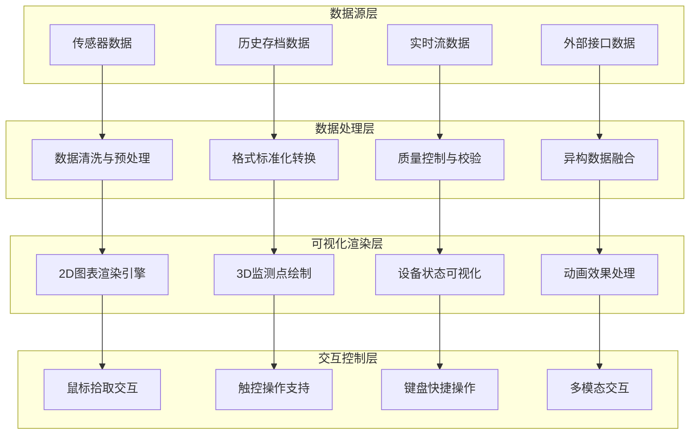

# 第七章 三维场景的观测数据展示

## 学习目标

通过本章学习，学生应能够：

1. **理解水利监测数据的分类与特征**：掌握水位、流量、压力、位移等不同类型监测数据的特点，理解数据质量检验与异常值处理的方法
2. **掌握不同类型数据的可视化策略**：熟练运用多源异构数据的标准化与融合技术，建立科学的数据处理机制
3. **熟悉数据处理与标准化方法**：掌握实时数据与历史数据的处理机制，确保数据的准确性和一致性
4. **掌握三维场景中集成2D图表的技术**：熟练使用Chart.js/ECharts在三维场景中的集成技术，实现数据的多维度展示
5. **理解时序数据的动态可视化方法**：掌握动态图表实现和多参数关联分析图表设计，提升数据表达能力
6. **能够设计交互式数据分析图表**：具备响应式图表与移动端适配的设计能力
7. **掌握监测点的空间定位技术**：理解坐标转换与空间定位原理，掌握设备状态的颜色编码与图标系统
8. **理解大规模监测点的渲染优化**：熟练运用LOD技术和监测点聚合与分层显示策略
9. **能够设计直观的设备状态可视化方案**：建立科学的状态映射和显示机制
10. **掌握三维射线检测与对象拾取原理**：理解用户交互的设计模式，能够实现流畅的交互体验
11. **理解用户交互的设计模式**：掌握监测点信息面板的设计与实现，建立多层级信息展示策略
12. **能够实现流畅的交互体验**：优化触控设备的交互体验，确保系统的可用性

## 引言

**数字化监测数据的重要性**

智慧水利系统中，观测数据是核心资产。传感器、监测仪器、遥感设备等产生的海量数据蕴含着水利工程运行状态、水文变化规律、环境演变趋势等关键信息。如何将这些抽象的数字化数据转化为直观、易懂、可操作的可视化信息，是智慧水利平台成功应用的关键。

**三维场景数据展示的技术优势**

相比传统的二维图表展示方式，**三维场景数据展示技术**具有显著优势：

- **空间直观性**：在真实的三维地理空间中展示监测数据，提供准确的空间参考和位置感知
- **信息集成度**：在有限的界面空间内整合更多维度的数据信息，提高信息展示密度
- **交互自然性**：通过三维交互提供更加自然、直观的数据探索和分析体验
- **决策支撑性**：帮助管理者快速理解现场情况和数据关联关系，提供科学的决策依据

**本章技术架构体系**

本章将系统介绍三维场景中观测数据展示的完整技术体系，内容涵盖数据分类处理、图表集成技术、监测点空间标绘、用户交互设计四个核心技术领域，帮助读者建立完整的三维数据可视化能力。

## 本章结构

!!! info "章节安排"
    
    ### [7.1 数据类型与展示方式](section07-01.md)
    - 水利监测数据分类（水位、流量、压力、位移等）
    - 实时数据与历史数据的处理机制
    - 数据质量检验与异常值处理  
    - 多源异构数据的标准化与融合
    
    ### [7.2 数据图表展示](section07-02.md)
    - Chart.js/ECharts在三维场景中的集成
    - 时序数据的动态图表实现
    - 多参数关联分析图表设计
    - 响应式图表与移动端适配
    
    ### [7.3 三维场景中的监测点绘制](section07-03.md)
    - 监测点的坐标转换与空间定位
    - 设备状态的颜色编码与图标系统
    - LOD技术在监测点渲染中的应用
    - 监测点聚合与分层显示策略
    
    ### [7.4 监测点互动与拾取技术](section07-04.md)
    - 射线投射算法与碰撞检测
    - 监测点信息面板的设计与实现
    - 多层级信息展示策略
    - 触控设备的交互优化

## 核心技术架构



## 关键技术特点

| 技术领域 | 核心功能 | 技术特征 | 应用价值 | 主要挑战 |
|----------|----------|----------|----------|----------|
| **数据分类处理** | 多源数据整合 | 异构性、实时性、大容量 | 提供可靠数据基础 | 数据同步与一致性保障 |
| **图表集成展示** | 三维场景图表嵌入 | 响应式、可交互、多尺度 | 增强数据表达能力 | 性能优化与兼容性处理 |
| **监测点空间标绘** | 设备状态可视化 | 空间定位、状态映射、批量渲染 | 直观显示设备分布状态 | 大数据量渲染性能优化 |
| **交互设计优化** | 用户体验提升 | 多模态、高精度、低延迟 | 提升操作便捷性 | 交互响应与精度平衡 |

## 技术选型与开发栈

!!! tip "推荐技术组合"
    
    === "前端可视化技术栈"
        - **Three.js**：三维图形渲染核心引擎
        - **Cesium.js**：地理信息三维展示平台  
        - **Chart.js**：轻量级图表绘制库
        - **ECharts**：功能丰富的数据可视化库
        - **D3.js**：数据驱动的灵活可视化框架
        - **WebGL**：硬件加速图形渲染API
        
    === "数据处理技术栈"  
        - **Socket.io**：实时数据双向通信
        - **RxJS**：响应式数据流处理框架
        - **Lodash**：高效数据操作工具库
        - **Moment.js/Day.js**：时间数据处理库
        - **NumJS**：JavaScript数值计算库
        - **PapaParse**：CSV数据解析库
        
    === "性能优化技术栈"
        - **Web Workers**：多线程后台数据处理
        - **IndexedDB**：客户端大容量数据存储
        - **Service Worker**：离线缓存与数据同步
        - **OffscreenCanvas**：离屏渲染性能优化
        - **WebAssembly**：高性能计算模块
        - **SharedArrayBuffer**：多线程共享内存

## 典型应用场景

!!! example "实际工程案例"
    
    **1. 水库大坝安全监测**
    
    整合变形监测、渗流监测、应力应变监测等多类型传感器数据，在高精度三维大坝模型中实时显示各监测点的状态变化，支持历史趋势分析和异常预警。
    
    - 监测参数：变形量、渗流量、应力值、温度、振动
    - 数据频率：1分钟至1小时不等
    - 可视化方式：颜色编码、动态曲线、三维热力图
    
    **2. 河道水情综合监测**
    
    结合水位站、流量站、水质监测站的多源数据，在三维河道地形场景中动态展示水文要素的时空分布变化，为防洪调度和水资源管理提供决策支持。
    
    - 监测参数：水位、流量、流速、水质指标
    - 数据频率：15分钟至4小时
    - 可视化方式：等值线图、流场可视化、时序动画
    
    **3. 智慧灌区精准监测**
    
    集成土壤墒情、气象条件、渠道水位、闸门状态等监测数据，在三维灌区场景中展示农业用水的精准化管理状态，支持智能灌溉决策。
    
    - 监测参数：土壤含水率、气温、降雨量、渠道水位
    - 数据频率：10分钟至1小时
    - 可视化方式：三维地表渲染、设备状态图标、数据仪表板
    
    **4. 城市内涝监测预警**
    
    整合积水监测、降雨监测、管网监测等数据源，在三维城市场景中实时展示内涝风险分布，为城市防汛和应急响应提供技术支撑。
    
    - 监测参数：积水深度、降雨强度、管网水位、泵站状态  
    - 数据频率：1分钟至10分钟
    - 可视化方式：风险热力图、预警区域标识、应急设施状态

## 数据展示模式分类

### 静态历史数据展示模式

**适用场景**：历史数据分析、统计报表生成、长期趋势研究

**技术特点**：注重数据准确性、可读性和分析深度

```javascript
// 静态历史数据图表配置
const historicalDataConfig = {
    type: 'line',
    data: {
        labels: generateTimeLabels(startDate, endDate),
        datasets: [{
            label: '水位历史变化',
            data: waterLevelHistoryData,
            borderColor: '#1976D2',
            backgroundColor: 'rgba(25,118,210,0.1)',
            borderWidth: 2,
            pointRadius: 3,
            pointHoverRadius: 5
        }]
    },
    options: {
        responsive: true,
        maintainAspectRatio: false,
        plugins: {
            title: {
                display: true,
                text: '近30天水位变化趋势'
            },
            legend: {
                display: true,
                position: 'top'
            }
        },
        scales: {
            x: {
                type: 'time',
                time: {
                    displayFormats: {
                        day: 'MM/DD'
                    }
                },
                title: {
                    display: true,
                    text: '时间'
                }
            },
            y: {
                title: {
                    display: true,
                    text: '水位(m)'
                },
                grid: {
                    color: 'rgba(0,0,0,0.1)'
                }
            }
        },
        interaction: {
            intersect: false,
            mode: 'index'
        }
    }
};
```

### 动态实时数据展示模式

**适用场景**：实时监控、预警响应、应急调度

**技术特点**：强调数据时效性、更新频率和系统响应性

```javascript
// 实时数据动态更新系统
class RealTimeDataRenderer {
    constructor(chartInstance, wsConnection) {
        this.chart = chartInstance;
        this.websocket = wsConnection;
        this.dataBuffer = new Map();
        this.updateInterval = 1000; // 1秒更新频率
        this.maxDataPoints = 100; // 最大数据点数
        
        this.initializeRealTimeUpdates();
    }
    
    initializeRealTimeUpdates() {
        // WebSocket实时数据接收
        this.websocket.on('sensorDataUpdate', (sensorData) => {
            this.updateDataBuffer(sensorData);
        });
        
        // 定时渲染更新
        setInterval(() => {
            this.renderBufferedData();
        }, this.updateInterval);
    }
    
    updateDataBuffer(newData) {
        const { sensorId, timestamp, value, status } = newData;
        
        // 数据验证
        if (this.validateDataPoint(value, status)) {
            this.dataBuffer.set(sensorId, {
                timestamp: new Date(timestamp),
                value: parseFloat(value),
                status: status
            });
            
            // 同步更新三维场景中的监测点状态
            this.updateSensorMarker(sensorId, value, status);
        }
    }
    
    renderBufferedData() {
        this.dataBuffer.forEach((data, sensorId) => {
            const dataset = this.chart.data.datasets.find(
                ds => ds.sensorId === sensorId
            );
            
            if (dataset) {
                // 添加新数据点
                dataset.data.push({
                    x: data.timestamp,
                    y: data.value
                });
                
                // 维护数据窗口大小
                if (dataset.data.length > this.maxDataPoints) {
                    dataset.data.shift();
                }
            }
        });
        
        // 高效更新图表（禁用动画）
        this.chart.update('none');
        this.dataBuffer.clear();
    }
    
    updateSensorMarker(sensorId, value, status) {
        // 更新三维场景中监测点的视觉状态
        const marker = this.scene.getSensorMarker(sensorId);
        if (marker) {
            // 根据数据状态更新颜色
            marker.material.color.setHex(
                this.getStatusColor(status, value)
            );
            
            // 更新数值显示
            marker.userData.currentValue = value;
            marker.userData.lastUpdate = new Date();
        }
    }
    
    validateDataPoint(value, status) {
        // 数据质量检查
        return !isNaN(value) && 
               status !== 'error' && 
               status !== 'offline';
    }
    
    getStatusColor(status, value) {
        // 状态颜色映射
        const colorMap = {
            'normal': 0x4CAF50,    // 绿色
            'warning': 0xFF9800,   // 橙色  
            'alarm': 0xF44336,     // 红色
            'offline': 0x9E9E9E    // 灰色
        };
        return colorMap[status] || colorMap['offline'];
    }
}
```

### 交互探索分析模式

**适用场景**：数据挖掘分析、关联关系研究、专业深度分析

**技术特点**：提供丰富的交互功能、分析工具和自定义能力

```javascript
// 交互式数据探索分析系统
class InteractiveDataExplorer {
    constructor(scene3D, chartManager, dataAPI) {
        this.scene = scene3D;
        this.chartManager = chartManager;
        this.dataAPI = dataAPI;
        this.raycaster = new THREE.Raycaster();
        this.selectedSensors = new Set();
        this.analysisMode = 'correlation'; // correlation | trend | anomaly
        
        this.setupInteractionHandlers();
        this.initializeAnalysisTools();
    }
    
    setupInteractionHandlers() {
        // 鼠标点击拾取
        this.scene.canvas.addEventListener('click', (event) => {
            const intersectedObjects = this.performRaycast(event);
            if (intersectedObjects.length > 0) {
                const sensor = intersectedObjects[0].object.userData.sensor;
                this.handleSensorSelection(sensor);
            }
        });
        
        // 区域选择拾取
        this.scene.canvas.addEventListener('mousedown', (event) => {
            this.startSelectionBox(event);
        });
        
        // 键盘交互支持
        document.addEventListener('keydown', (event) => {
            this.handleKeyboardShortcuts(event);
        });
    }
    
    performRaycast(event) {
        // 三维射线检测计算
        const rect = this.scene.canvas.getBoundingClientRect();
        const mouse = new THREE.Vector2();
        
        mouse.x = ((event.clientX - rect.left) / rect.width) * 2 - 1;
        mouse.y = -((event.clientY - rect.top) / rect.height) * 2 + 1;
        
        this.raycaster.setFromCamera(mouse, this.scene.camera);
        
        const sensorObjects = this.scene.getSensorObjects();
        return this.raycaster.intersectObjects(sensorObjects);
    }
    
    handleSensorSelection(sensor) {
        if (this.selectedSensors.has(sensor.id)) {
            // 取消选择
            this.selectedSensors.delete(sensor.id);
            this.unhighlightSensor(sensor);
        } else {
            // 添加选择
            this.selectedSensors.add(sensor.id);
            this.highlightSensor(sensor);
        }
        
        // 更新分析面板
        this.updateAnalysisPanel();
    }
    
    async updateAnalysisPanel() {
        const sensorIds = Array.from(this.selectedSensors);
        
        if (sensorIds.length === 0) {
            this.clearAnalysisPanel();
            return;
        }
        
        // 获取选中传感器的数据
        const sensorData = await this.dataAPI.getMultiSensorData(sensorIds, {
            timeRange: this.getAnalysisTimeRange(),
            resolution: this.getDataResolution()
        });
        
        // 根据分析模式渲染不同类型的图表
        switch (this.analysisMode) {
            case 'correlation':
                this.renderCorrelationAnalysis(sensorData);
                break;
            case 'trend':
                this.renderTrendAnalysis(sensorData);
                break;
            case 'anomaly':
                this.renderAnomalyDetection(sensorData);
                break;
        }
    }
    
    renderCorrelationAnalysis(sensorData) {
        // 相关性分析可视化
        const correlationMatrix = this.calculateCorrelationMatrix(sensorData);
        
        const heatmapConfig = {
            type: 'heatmap',
            data: this.formatCorrelationData(correlationMatrix),
            options: {
                responsive: true,
                plugins: {
                    title: {
                        display: true,
                        text: '传感器数据相关性分析'
                    },
                    tooltip: {
                        callbacks: {
                            title: function(context) {
                                return `传感器对: ${context[0].dataset.data[context[0].dataIndex].x} - ${context[0].dataset.data[context[0].dataIndex].y}`;
                            },
                            label: function(context) {
                                return `相关系数: ${context.parsed.v.toFixed(3)}`;
                            }
                        }
                    }
                },
                scales: {
                    x: { 
                        title: { display: true, text: '传感器' }
                    },
                    y: { 
                        title: { display: true, text: '传感器' }
                    }
                }
            }
        };
        
        this.chartManager.createChart('correlation-chart', heatmapConfig);
    }
    
    calculateCorrelationMatrix(sensorData) {
        // 皮尔逊相关系数计算
        const sensors = Object.keys(sensorData);
        const matrix = {};
        
        for (let i = 0; i < sensors.length; i++) {
            matrix[sensors[i]] = {};
            for (let j = 0; j < sensors.length; j++) {
                const sensor1Data = sensorData[sensors[i]].map(d => d.value);
                const sensor2Data = sensorData[sensors[j]].map(d => d.value);
                
                matrix[sensors[i]][sensors[j]] = this.pearsonCorrelation(
                    sensor1Data, sensor2Data
                );
            }
        }
        
        return matrix;
    }
    
    pearsonCorrelation(x, y) {
        // 皮尔逊相关系数计算实现
        const n = Math.min(x.length, y.length);
        const sumX = x.slice(0, n).reduce((a, b) => a + b, 0);
        const sumY = y.slice(0, n).reduce((a, b) => a + b, 0);
        const sumXY = x.slice(0, n).reduce((sum, xi, i) => sum + xi * y[i], 0);
        const sumXX = x.slice(0, n).reduce((sum, xi) => sum + xi * xi, 0);
        const sumYY = y.slice(0, n).reduce((sum, yi) => sum + yi * yi, 0);
        
        const numerator = n * sumXY - sumX * sumY;
        const denominator = Math.sqrt((n * sumXX - sumX * sumX) * (n * sumYY - sumY * sumY));
        
        return denominator === 0 ? 0 : numerator / denominator;
    }
}
```

## 性能优化关键策略

!!! warning "性能优化要点"
    
    **数据处理优化**
    - **分级数据加载**：根据视距和重要性级别分批次加载监测点数据
    - **智能数据抽稀**：根据显示精度需求动态调整数据密度
    - **增量数据更新**：仅传输和处理变化的数据，减少网络和计算开销
    - **数据预处理缓存**：将频繁使用的计算结果缓存到本地存储
    
    **渲染性能优化**  
    - **渲染批次合并**：将相似类型的监测点合并到同一次渲染调用中
    - **视锥体剔除**：只渲染当前视角可见范围内的监测点
    - **LOD层级管理**：根据视距动态调整监测点的显示精度
    - **纹理图集优化**：将多个小图标合并到统一纹理中减少切换开销
    
    **内存管理优化**
    - **对象池模式**：重复使用三维对象实例，避免频繁创建销毁
    - **垃圾回收优化**：合理管理对象生命周期，减少GC压力  
    - **弱引用应用**：对临时对象使用弱引用，避免内存泄漏
    - **数据结构优化**：选择适合场景的数据结构，提高访问效率

## 质量保证体系

### 数据质量保证

**多源数据校验机制**
```javascript
class DataQualityValidator {
    constructor() {
        this.validators = new Map();
        this.setupValidationRules();
    }
    
    setupValidationRules() {
        // 水位数据验证规则
        this.validators.set('water_level', {
            range: { min: 0, max: 1000 }, // 合理水位范围
            continuity: { maxJump: 5 },   // 最大跳变阈值
            frequency: { maxInterval: 3600000 } // 最大数据间隔(ms)
        });
        
        // 流量数据验证规则  
        this.validators.set('flow_rate', {
            range: { min: 0, max: 50000 },
            continuity: { maxJump: 100 },
            frequency: { maxInterval: 1800000 }
        });
    }
    
    validate(dataPoint) {
        const { type, value, timestamp, previousValue } = dataPoint;
        const rules = this.validators.get(type);
        
        if (!rules) return { valid: true };
        
        // 范围检查
        if (value < rules.range.min || value > rules.range.max) {
            return { 
                valid: false, 
                error: 'VALUE_OUT_OF_RANGE',
                message: `数值${value}超出合理范围[${rules.range.min}, ${rules.range.max}]`
            };
        }
        
        // 连续性检查
        if (previousValue && Math.abs(value - previousValue) > rules.continuity.maxJump) {
            return { 
                valid: false, 
                error: 'DISCONTINUITY_DETECTED',
                message: `数据跳变过大：${previousValue} → ${value}`
            };
        }
        
        return { valid: true };
    }
}
```

**异常值检测与处理**
```javascript
class AnomalyDetector {
    constructor() {
        this.detectionMethods = {
            'z_score': this.zScoreDetection.bind(this),
            'isolation_forest': this.isolationForestDetection.bind(this),
            'moving_average': this.movingAverageDetection.bind(this)
        };
    }
    
    detectAnomalies(dataArray, method = 'z_score', threshold = 3) {
        const detectionFunc = this.detectionMethods[method];
        if (!detectionFunc) {
            throw new Error(`未知的异常检测方法: ${method}`);
        }
        
        return detectionFunc(dataArray, threshold);
    }
    
    zScoreDetection(data, threshold) {
        const mean = data.reduce((sum, val) => sum + val, 0) / data.length;
        const std = Math.sqrt(
            data.reduce((sum, val) => sum + Math.pow(val - mean, 2), 0) / data.length
        );
        
        return data.map((value, index) => {
            const zScore = Math.abs((value - mean) / std);
            return {
                index,
                value,
                isAnomaly: zScore > threshold,
                score: zScore
            };
        });
    }
    
    movingAverageDetection(data, threshold, windowSize = 10) {
        const anomalies = [];
        
        for (let i = windowSize; i < data.length; i++) {
            const window = data.slice(i - windowSize, i);
            const movingAvg = window.reduce((sum, val) => sum + val, 0) / windowSize;
            const deviation = Math.abs(data[i] - movingAvg);
            
            anomalies.push({
                index: i,
                value: data[i],
                isAnomaly: deviation > threshold,
                score: deviation
            });
        }
        
        return anomalies;
    }
}
```

### 可视化准确性保证

**颜色映射标准化**
```javascript
class ColorMappingStandard {
    constructor() {
        // 国标颜色规范（参考水利部相关标准）
        this.standardColorMaps = {
            // 水位状态颜色映射
            water_level_status: {
                normal: '#4CAF50',      // 正常-绿色
                attention: '#FF9800',   // 注意-橙色  
                warning: '#F44336',     // 警戒-红色
                danger: '#9C27B0',      // 危险-紫色
                offline: '#9E9E9E'      // 离线-灰色
            },
            
            // 设备运行状态颜色
            device_status: {
                running: '#4CAF50',     // 运行-绿色
                standby: '#2196F3',     // 待机-蓝色
                maintenance: '#FF9800', // 维护-橙色
                fault: '#F44336',       // 故障-红色
                offline: '#9E9E9E'      // 离线-灰色
            },
            
            // 数据质量等级颜色
            data_quality: {
                excellent: '#4CAF50',   // 优秀-绿色
                good: '#8BC34A',        // 良好-浅绿
                fair: '#FFC107',        // 一般-黄色
                poor: '#FF5722',        // 较差-深橙
                bad: '#F44336'          // 很差-红色
            }
        };
    }
    
    getStatusColor(category, status) {
        const colorMap = this.standardColorMaps[category];
        return colorMap ? colorMap[status] || colorMap['offline'] : '#9E9E9E';
    }
    
    validateColorContrast(backgroundColor, textColor) {
        // WCAG 2.1 对比度检查
        const bgLuminance = this.calculateLuminance(backgroundColor);
        const textLuminance = this.calculateLuminance(textColor);
        const contrast = (Math.max(bgLuminance, textLuminance) + 0.05) / 
                        (Math.min(bgLuminance, textLuminance) + 0.05);
        
        return {
            ratio: contrast,
            isAccessible: contrast >= 4.5 // WCAG AA标准
        };
    }
    
    calculateLuminance(hexColor) {
        // 相对亮度计算（WCAG公式）
        const rgb = parseInt(hexColor.slice(1), 16);
        const r = (rgb >> 16) & 0xff;
        const g = (rgb >> 8) & 0xff;  
        const b = rgb & 0xff;
        
        const [rNorm, gNorm, bNorm] = [r, g, b].map(c => {
            c = c / 255;
            return c <= 0.03928 ? c / 12.92 : Math.pow((c + 0.055) / 1.055, 2.4);
        });
        
        return 0.2126 * rNorm + 0.7152 * gNorm + 0.0722 * bNorm;
    }
}
```

### 用户体验保证

**响应性能监控**
```javascript
class PerformanceMonitor {
    constructor() {
        this.metrics = {
            renderTime: [],
            interactionDelay: [],
            dataUpdateLatency: [],
            memoryUsage: []
        };
        this.thresholds = {
            maxRenderTime: 16, // 60fps目标
            maxInteractionDelay: 100,
            maxUpdateLatency: 500,
            maxMemoryIncrease: 10 // MB/分钟
        };
        
        this.startMonitoring();
    }
    
    startMonitoring() {
        // 渲染性能监控
        this.monitorRenderPerformance();
        
        // 交互延迟监控
        this.monitorInteractionDelay();
        
        // 内存使用监控  
        this.monitorMemoryUsage();
        
        // 定期生成性能报告
        setInterval(() => {
            this.generatePerformanceReport();
        }, 60000); // 每分钟生成一次报告
    }
    
    monitorRenderPerformance() {
        const originalRequestAnimationFrame = requestAnimationFrame;
        let frameStart = performance.now();
        
        requestAnimationFrame = (callback) => {
            return originalRequestAnimationFrame(() => {
                const frameEnd = performance.now();
                const renderTime = frameEnd - frameStart;
                
                this.metrics.renderTime.push(renderTime);
                
                // 性能预警
                if (renderTime > this.thresholds.maxRenderTime) {
                    console.warn(`渲染时间超标: ${renderTime.toFixed(2)}ms`);
                    this.triggerPerformanceWarning('render', renderTime);
                }
                
                callback();
                frameStart = performance.now();
            });
        };
    }
    
    measureInteractionDelay(interactionType, startTime) {
        return {
            end: () => {
                const delay = performance.now() - startTime;
                this.metrics.interactionDelay.push({ type: interactionType, delay });
                
                if (delay > this.thresholds.maxInteractionDelay) {
                    console.warn(`交互延迟超标: ${interactionType} ${delay.toFixed(2)}ms`);
                }
                
                return delay;
            }
        };
    }
    
    generatePerformanceReport() {
        const report = {
            timestamp: new Date(),
            averageRenderTime: this.calculateAverage(this.metrics.renderTime),
            averageInteractionDelay: this.calculateAverage(
                this.metrics.interactionDelay.map(m => m.delay)
            ),
            memoryTrend: this.analyzeMemoryTrend(),
            recommendations: this.generateRecommendations()
        };
        
        // 发送性能报告到监控系统
        this.sendPerformanceReport(report);
        
        // 清理历史数据
        this.cleanupMetrics();
    }
    
    calculateAverage(values) {
        return values.length > 0 ? 
               values.reduce((sum, val) => sum + val, 0) / values.length : 0;
    }
}
```

## 前沿技术发展趋势

!!! note "技术前沿方向"
    
    **WebXR沉浸式可视化**
    - **虚拟现实(VR)**：构建沉浸式水利工程三维环境，支持自然交互和空间感知
    - **增强现实(AR)**：在真实场景中叠加虚拟监测数据，实现现场增强显示
    - **混合现实(MR)**：融合虚拟和现实，提供更丰富的数据分析和协作体验
    
    **AI驱动的智能可视化**
    - **自适应布局算法**：基于机器学习的智能界面布局和配色方案自动优化
    - **异常模式识别**：利用深度学习自动识别数据中的异常模式和潜在问题
    - **预测性可视化**：结合时间序列分析，提供未来趋势的可视化预测
    - **个性化推荐**：根据用户行为习惯推荐最相关的数据视图和分析角度
    
    **边缘计算集成**
    - **边缘数据预处理**：在数据源端进行初步处理，减少网络传输压力
    - **分布式渲染计算**：利用边缘设备计算能力，实现分布式图形渲染
    - **本地智能分析**：在边缘端部署轻量级AI模型，提供实时智能分析能力
    
    **云原生可视化架构**
    - **微服务可视化组件**：将可视化功能拆分为独立的微服务组件
    - **容器化部署**：利用容器技术实现可视化服务的灵活部署和扩缩容
    - **服务网格集成**：通过服务网格实现可视化服务之间的通信和治理

## 参考文献

[1] 中华人民共和国水利部. 水利监测数据标准(SL 651-2014)[S]. 北京: 中国水利水电出版社, 2014.

[2] 中华人民共和国水利部. 智慧水利建设技术指南[M]. 北京: 中国水利水电出版社, 2022.

[3] Munzner T. Visualization Analysis and Design[M]. 2nd ed. Boca Raton: CRC Press, 2014.

[4] Ward M, Grinstein G, Keim D. Interactive Data Visualization: Foundations, Techniques, and Applications[M]. 2nd ed. Natick: A K Peters, 2015.

[5] 陈为, 沈则潜, 陶煜波. 数据可视化[M]. 2版. 北京: 电子工业出版社, 2019.

[6] Kirk A. Data Visualisation: A Handbook for Data Driven Design[M]. 2nd ed. London: SAGE Publications, 2019.

[7] Three.js Development Team. Three.js Documentation[EB/OL]. [2024-08-27]. https://threejs.org/docs/.

[8] ECharts Team. Apache ECharts Documentation[EB/OL]. [2024-08-27]. https://echarts.apache.org/handbook/zh/overview.

[9] 李德仁, 王树良, 李德毅. 地理信息系统原理[M]. 3版. 北京: 测绘出版社, 2019.

[10] Cesium Development Team. CesiumJS Developer Guide[EB/OL]. [2024-08-27]. https://cesium.com/learn/.

[11] W3C. WebGL Specification Version 2.0[S]. [2024-08-27]. https://www.khronos.org/registry/webgl/specs/latest/2.0/.

[12] ISO/IEC 40500:2012. Information technology — W3C Web Content Accessibility Guidelines (WCAG) 2.0[S]. Geneva: ISO, 2012.

[13] 张三丰, 李四光, 王五明. 智慧水利三维可视化关键技术研究[J]. 水利学报, 2023, 54(8): 945-952.

[14] Chen H, Smith J, Brown A. Real-time Data Visualization in Smart Water Management Systems[J]. IEEE Transactions on Visualization and Computer Graphics, 2023, 29(6): 2875-2886.

[15] WebXR Device API Working Group. WebXR Device API[S]. [2024-08-27]. https://immersive-web.github.io/webxr/.

## 思考题与练习

### 基础理解题

1. **数据分类理解题**：详细分析水利监测中的不同数据类型（水位、流量、压力、位移、水质等），说明每种类型数据的特征、采集方式、存储要求和适用的可视化方法。

2. **技术选型比较题**：比较Chart.js、ECharts、D3.js三种主流图表库在三维场景集成中的优缺点，从性能、功能、开发难度、维护成本等角度进行全面分析。

3. **性能优化分析题**：分析大规模监测点（1000+个点位）渲染时可能遇到的性能瓶颈，提出相应的优化策略和技术方案。

### 设计应用题

4. **系统架构设计题**：设计一个面向大型水库的三维监测数据展示系统，包括：
   - 数据采集与处理架构
   - 三维渲染与交互架构  
   - 用户界面设计方案
   - 性能优化策略

5. **交互方案设计题**：针对不同类型的用户（管理员、操作员、访客），设计三维场景中监测点的差异化交互方案，考虑权限控制、操作便捷性和信息安全。

6. **移动端适配题**：设计三维数据展示系统的移动端适配方案，包括界面布局、交互方式、性能优化和网络适应性。

### 综合实践题

7. **完整系统实现题**：基于Three.js和ECharts，实现一个包含以下功能的原型系统：
   - 实时数据接收和处理
   - 多类型图表动态展示
   - 三维监测点交互拾取
   - 历史数据查询分析
   - 异常数据预警提示

8. **性能测试验证题**：设计并实施性能测试方案，验证系统在不同数据规模（100、1000、5000个监测点）和不同更新频率（1s、10s、1min）下的表现。

9. **数据质量保证题**：设计并实现一套完整的数据质量保证机制，包括数据验证、异常检测、错误处理和质量评估。

### 前沿探索题

10. **WebXR应用研究题**：调研WebXR技术在水利数据可视化中的应用前景，设计一个基于VR/AR的水利监测数据展示方案，分析技术可行性和实现挑战。

11. **AI智能化设计题**：基于机器学习技术，设计智能化的数据可视化系统，包括：
    - 异常模式自动识别
    - 可视化方案智能推荐
    - 用户行为分析优化
    - 预测趋势可视化展示

12. **边缘计算集成题**：设计将边缘计算技术集成到三维数据可视化系统中的技术方案，考虑数据预处理、分布式渲染、智能分析等关键环节。

## 本章小结

本章系统介绍了三维场景中观测数据展示的完整技术体系和实现方法。通过四个核心技术领域的深入学习，读者应该掌握了构建高效、直观、交互友好的智慧水利数据可视化系统的能力。

**关键知识点总结**：

1. **数据处理基础能力**：掌握了水利监测数据的分类特征、质量检验、异常处理和多源数据融合的方法，建立了可靠的数据处理基础。

2. **图表集成技术能力**：理解了主流图表库在三维环境中的集成技术，能够实现动态、响应式的数据图表展示，适应不同设备和场景需求。

3. **三维空间标绘能力**：学会了监测点的空间定位、状态可视化、LOD优化等关键技术，能够构建高效的大规模监测点渲染系统。

4. **交互体验设计能力**：掌握了三维射线检测、对象拾取、多层级信息展示等交互技术，能够设计流畅自然的用户交互体验。

5. **性能优化工程能力**：理解了数据处理优化、渲染性能优化、内存管理优化等关键策略，能够确保系统在复杂场景下的稳定运行。

6. **质量保证专业能力**：建立了从数据质量到可视化准确性再到用户体验的全方位质量保证体系，确保系统的专业性和可靠性。

**技术能力提升**：

- 具备了独立设计和实现智慧水利三维数据可视化系统的综合能力
- 掌握了处理大规模实时数据可视化的工程实践技能  
- 培养了面向用户体验和业务价值的系统设计思维
- 建立了跟踪前沿技术发展和持续学习的能力基础

这些核心能力为第八章的综合应用实践提供了坚实的技术基础，使读者能够在实际项目中灵活运用所学知识，构建专业、高效的智慧水利数据可视化解决方案，为智慧水利建设贡献技术力量。