# 第7章 三维场景的观测数据展示

**学习目标**

通过本章学习，学生应能够：

1.  指出一条观测记录里决定画法的字段（单位、观测时间、质量码），并据此处理缺测与可疑值；

2.  使用Apache ECharts画出真实观测曲线，追加新观测，并实现曲线与三维测点的双向联动；

3.  按CGCS2000、高斯–克吕格平面坐标和场景局部坐标的链路定位监测点；

4.  实现射线拾取，说明像素与世界单位的换算，了解触控长按、LOD与聚合的做法；

5.  说明时间窗口与LTTB降采样的原理，以及哪些计算必须回到原始观测；

6.  围绕一个水库监测案例形成可复现的三维观测数据展示方案。

**引言**

第6章在三维场景里挂上了28个测点小球，每个球都带着自己的`assetId`。本章把观测数据接进来：点一个球，右侧出现它的观测曲线；点曲线上的一个数据点，对应的球变色。后端按第5章的方法完成数据接入和持久化，前端要做的是读懂每条观测的单位、时间和质量码，选对图形，再把图表和三维场景连起来。

案例水库为虚构工程，参数见表8.1：坝高52 m，正常蓄水位168.0 m；平台接入12个渗压测点、8个位移测点、3个库水位测点和5个雨量测点，共28个观测点，另展示6个采集网关的在线状态。

各节都把基础内容放在前面。第一遍可以只读这条主线：7.1.1、7.1.2节认识观测记录和质量码，7.2.1节画出第一条真实观测曲线，7.2.4节完成曲线与三维测点的联动，7.4.1节弄清点击是怎样找到测点的。时间窗口与降采样、实时流与回放、多源融合、渲染性能、LOD、专题地图和色彩体系排在各节后部，曲线和联动跑通之后再读。

!!! tip "提示"

    **工程版本线：v3（三维场景接入） $\rightarrow$ v4（观测展示与联动）**

    本章从 v3 的三维底座出发，交付 **v4**：缺测断线、可疑点提示、曲线与三维测点双向联动。代码起点是配套工程的 `frontend/src/utils/readings.js`（测试见 `frontend/tests/readings.test.js`），阶段页是 `lesson74.html`。

## 7.1 面向可视化的数据准备

**本节层次**

核心：7.1.1、7.1.2；指导实践：7.1.3；拓展：7.1.4、7.1.5。

**进入本节所需知识**

会用4.5节的`fetch`取回 JSON；读过表8.3中观测查询接口一行。

画曲线之前先看数据。7.1.1节看一条观测记录有哪些字段，7.1.2节看质量码怎样决定“画不画、怎么画”，读完这两小节就可以去7.2节动手。7.1.3节以后讲展示前的质量检验、多种采样周期的时间对齐和多来源数据的标准化，对应配套工程`frontend/src/lesson71/`下的几个模块，适合在曲线与联动完成之后回来做。

### 7.1.1 一条观测记录长什么样

向教学接口请求库水位测点 WL-01 在2026年7月1日凌晨的观测，即`GET /api/assets/``DAM-A-WL-01/readings`并带上`from`、`to`两个参数，应答是一个数组。清单7.1截取其中相邻的三条。

**清单 7.1  观测查询接口应答中相邻的三条记录（配套数据集）**

```json
[
  {"assetId": "DAM-A-WL-01", "occurredAt": "2026-07-01T03:00:00+08:00",
   "value": 165.504, "unit": "m", "quality": "valid",
   "eventId": "evt-wl-0036-0", "version": 1},
  {"assetId": "DAM-A-WL-01", "occurredAt": "2026-07-01T03:05:00+08:00",
   "value": null, "unit": "m", "quality": "missing",
   "eventId": "evt-wl-0037-0", "version": 1},
  {"assetId": "DAM-A-WL-01", "occurredAt": "2026-07-01T03:10:00+08:00",
   "value": 165.521, "unit": "m", "quality": "valid",
   "eventId": "evt-wl-0038-0", "version": 1}
]
```

三条记录间隔5 min。中间一条的`value`是`null`，`quality`是`missing`：03:05这个时刻本该有一次观测，但通信中断，没有采到。记录仍然存在，它占着这个时间位置，告诉下游“这里缺了一次”。如果后端干脆不返回这一条，前端就无从知道03:00与03:10之间少了什么。

表7.1逐个说明这些字段在画图时的用途。字段名与取值以表8.3为准。

**表 7.1  观测记录的字段及其在展示中的用途**

| 字段           | 示例                   | 用途                                 |
|:---------------|:-----------------------|:-------------------------------------|
| `assetId`      | `DAM-A-PZ-07`          | 找到三维场景里的同一个测点，联动靠它 |
| `occurredAt`   | 带时区的 ISO 8601 时间 | 横轴位置、排序和时间窗判断           |
| `value`/`unit` | 185.091 / kPa          | 纵轴位置；单位写进轴名和标题         |
| `quality`      | valid/suspect/missing  | 决定连线、断线还是提示复核           |
| `eventId`      | `evt-pz-0287-6`        | 识别重复到达的同一次上报             |
| `version`      | 1                      | 人工订正一次加1，原值保留            |

其中三项直接决定怎么画。

**单位**

`value`必须和`unit`一起读。185.091 kPa的渗压和165.504 m的水位不能共用一根纵轴，纵轴名称要从记录里的`unit`取，而不是在代码里写死“水位/m”。换一个测点，单位可能就变了。

**观测时间**

`occurredAt`是仪器采样的时刻，带着时区偏移`+08:00`。横轴用它定位，排序也用它。它不是服务器收到数据的时刻：网关缓存后补传的观测，到达时间可能晚几个小时，画图时仍要落在采样时刻上。

**质量码**

`quality`只有三个取值。`valid`是通过检验的观测；`suspect`是采到了数值但不可信，例如超出量程或突然跳变，需要人复核；`missing`是没有采到。7.1.2节专门讲这三种取值各自怎么画。

不同监测项适合的图形也不同。表7.2把案例水库的四类观测与网关状态列开。渗压和水位是连续变化的量，适合过程线；雨量是一个时段内的累计量，适合柱状图；设备状态只有在线、离线、维护几种取值，只能用离散符号。

**表 7.2  案例水库观测数据与展示方式**

| 数据类型 | 案例规模      | 主要视觉变量     | 典型展示               |
|:---------|:--------------|:-----------------|:-----------------------|
| 渗压     | 12个测点，kPa | 位置、颜色、趋势 | 坝体测点着色与时序曲线 |
| 位移     | 8个测点，mm   | 方向、幅值、轨迹 | 箭头、位移曲线与累计值 |
| 库水位   | 3个测点，m    | 高程、阈值带     | 水位过程线与场景水面   |
| 降雨量   | 5个测点，mm   | 强度、累计量     | 柱状图、雨量站符号     |
| 网关状态 | 6台设备       | 颜色、形状、闪烁 | 在线/离线/维护状态标记 |

图7.1把从观测记录到屏幕的各个环节连成一条链。质量检查排在视觉映射之前：先确定一条记录能不能用，再决定给它什么颜色。顺序反过来，可疑值就可能被涂成“正常”的颜色显示出去。图中“时间对齐、降采样”一环在数据量小、只画一个测点时可以跳过，7.1.4节和7.2.6节分别讲它。

<figure markdown>
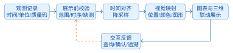
<figcaption>图 7.1  观测数据到交互展示的处理链</figcaption>
</figure>

### 7.1.2 质量码与缺测：先判断能不能画

质量码回答“这条数据能不能信”，它和预警等级是两件事。预警等级（无预警、蓝、黄、橙、红）回答“业务风险有多大”，由第8章的规则计算，而且只采用`valid`的观测。一条`suspect`观测的数值再大，也不能直接触发预警；一条`valid`观测可以对应任何预警等级。界面上这两个维度分开表达：颜色留给预警等级，质量用断线、点的形状和文字表达。

三种质量码的画法如下。

- `valid`：正常连线。

- `suspect`：保留原值并画出来，但换一种点形（例如菱形）提示复核，提示框里写明“可疑”。不删除，也不修改数值。配套数据集里，WL-02 在7月1日17:35有一条173.2 m的观测，超过了校核洪水位，被标为`suspect`；把它删掉，值班员就看不到传感器出过问题。

- `missing`：该时刻的值写成`null`，曲线在这里断开。不写成0，也不跳过这条记录。

缺测的两种错误画法后果不同。把缺测写成0，水位曲线会出现一次从165 m跌到0再弹回的陡降，看上去像溃坝。把缺测记录直接丢掉，图表库会把前后两个有效点用直线连起来，图7.2右半边就是这种情况：$t_1$与$t_4$之间那段线没有任何观测支持，读图的人却会以为这段时间一直有数据。左半边保留了两个空值，曲线在缺测处断开，灰色阴影标出缺测时段。最右端的菱形是一个可疑点，保留原值，提示复核。

<figure markdown>
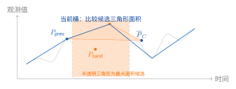
<figcaption>图 7.2  缺测断线与跨缺测连线的比较（数值为示意）</figcaption>
</figure>

图7.2左半边的画法实现起来并不费事。ECharts 的折线系列有一个`connectNulls`选项，设为`false`（也是默认值）时遇到`null`就断线。所以前端要做的事情很少：把`missing`记录的值换成`null`，保留它的时间，其余交给图表库。配套工程的`utils/readings.js`里，`toChartPoints`函数做的就是这一件事，7.2.1节会用到它。如果产品要求在缺测段显示估算趋势，另建一条虚线的推算序列，原始序列里的空值保持不动，这样用户始终能分清哪些是观测、哪些是推算。

设备故障、人工修订是另外两类信息。设备在线状态来自网关，不是质量码的第四个取值；人工修订通过`version`加1体现，原始观测只读。本书前端只用`valid`、`suspect`、`missing`三个值，是教学上的简化。实际工程要把它们映射到行业标准规定的质量标识、检验方法和审核状态，并在数据字典里记录映射版本，可参照SL/T 247-2020《水文资料整编规范》中的整编、审核与定级要求<sup>[[55]](../../references.md#ref55)</sup>。

**自测**

某测点一天应有288条观测，其中24条是`missing`。用余下264个值求日平均水位，报表上的“数据完整率”应写多少？答案要点：264/288，约91.7%。平均值可以只用有效值计算，但完整率的分母是应测次数，不是实测次数。

### 7.1.3 展示前的质量检验

7.1.2节假定后端已经给出了质量码。实际数据链路上，前端或网关还会收到上游没有检验过的记录，这时要自己先做一轮检查。检查分四类：格式检查确认时间、数值和单位可解析；范围检查使用测点台账里的量程上下限；时序检查识别时间倒退和重复；一致性检查比较相邻记录与关联测项。一条记录同时有单位错误和超范围两个问题时，两个问题都要记下来，后一次检查的结论不能覆盖前一次的证据。

**清单 7.2  展示前的质量检验与优先级合并**

```javascript
import {parseInstantMs} from '../../../shared/time.mjs';

export function inspectReading(r, rules, previous) {
  if (!rules.unit || (rules.min !== undefined && !Number.isFinite(rules.min))
      || (rules.max !== undefined && !Number.isFinite(rules.max))
      || rules.min > rules.max) throw new Error('质量规则配置非法');
  const issues = [];
  let quality = r.quality, rejected = false;
  const reject = issue => {
    issues.push(issue); rejected = true;
    if (quality !== 'missing') quality = 'suspect';
  };
  if (!['valid', 'suspect', 'missing'].includes(quality)) reject('quality');
  if (r.value == null) quality = 'missing';
  else if (!Number.isFinite(r.value)) reject('value');
  if (r.unit !== rules.unit) reject('unit');
  if (quality !== 'missing' && Number.isFinite(r.value)
      && (r.value < rules.min || r.value > rules.max)) reject('range');
  const ms = parseInstantMs(r.occurredAt);
  if (!Number.isFinite(ms)) reject('time');
  if (previous) {
    const previousMs = parseInstantMs(previous.occurredAt);
    if (!Number.isFinite(previousMs)) reject('previous-time');
    else if (Number.isFinite(ms) && ms <= previousMs) reject('time-order');
  }
  return {...r, quality, issues, rejected,
    participates: quality === 'valid' && !rejected};
}
```

清单7.2保存为`frontend/src/lesson71/quality.js`。它保留上游给出的`suspect`和`missing`，不会把可疑升级成有效；未知质量码、非有限数、单位不符、时间不可解析或时间倒退，都会在`issues`里留下问题码并把`rejected`置为真。`rules`由测点台账提供单位和可选量程。返回值里的`participates`只有在`valid`且未被拒收时为真，后续的评分和统计只读这个标志。质量码在前端只读，正式订正由后端完成并留痕。运行方法和失败例见7.1.5节的清单7.6。

异常值的处理要保守。相邻差值、局部中位数或物理变化速率都可以用来筛出突跳候选，但候选异常先标`suspect`、保留原值、通知复核，而不是直接删除。专家确认是设备故障后，由质量服务记录拒收原因；确认是洪峰、地震或闸门操作造成的真实突变，则保持`valid`并关联事件。图表同时显示原始点和修订点时用不同的形状或线型区分，避免用“更鲜艳的颜色”暗示哪个值更正确。

质量结果也影响统计口径。日均值、最大值和超阈次数默认只使用`valid`；`suspect`值可以显示在趋势图里，但不进入风险评分。报表上的有效率、缺测率、可疑率要写清分母。跨测项比较时先统一时间格网和过滤条件，否则采样周期不同的两个测项画在一起，看似可比，分母却不同：按7.1.4节的设定，水位每5 min采一次，一天288个点，渗压每1 h采一次，一天只有24个点。

### 7.1.4 实时流、历史回放与时间对齐

实时展示和历史分析读的是同一批观测，要求不同。实时流关心最近一段时间有没有变化，数据到了就要尽快更新；历史回放关心某次过程能不能复核，必须保留原始时间戳、质量码、修订记录和当时使用的规则版本。把实时缓存直接当历史库用，迟到的消息会改写已经发布的图形；把多年原始序列整个交给浏览器，渲染线程会被大量点位阻塞。因此服务端同时提供原始查询、按时间桶聚合和带版本的回放接口，前端只处理当前窗口内的数据。

**不同采样周期的对齐**

本节设定案例水库的渗压每1 h采一次，水位和雨量每5 min采一次，用来讨论周期不同的测项怎样对齐；配套数据集中三类测项都按5 min生成，每个测点每天288条。把它们画在同一张图上时，先选定一个展示用的时间格网，再把每个测项映射到格网上，而不是按数组下标拼接。5 min格网保留水位和雨量的短时响应，渗压在没有观测的格子里留空；1 h格网适合比较趋势，这时雨量按小时求和，水位取末值或平均值并注明规则，渗压取小时末值。表7.3列出各测项的默认做法和禁止的操作。

**表 7.3  案例水库测项的采样周期与时间对齐规则**

| 测项 | 原始周期 | 5 min格网              | 1 h格网与禁用操作                        |
|:-----|:---------|:-----------------------|:-----------------------------------------|
| 渗压 | 1 h      | 最近观测并保留年龄标记 | 取末值或均值；禁止线性插值伪造峰值       |
| 水位 | 5 min    | 原值                   | 末值、均值或极值，必须写入聚合规则       |
| 雨量 | 5 min    | 时段量                 | 求和形成小时累计；禁止对累计量做线性插值 |

重采样前要分清三种量。水位和渗压是瞬时量，缺一两个点就标缺测，只有业务规则允许时才插值。雨量记录的是一个时段内的增量，重采样时求和；如果来源给的已经是累计值，就不能再求和一次。网关在线状态是离散状态，只能保持前值并记录持续时间。任何插值结果都带上`derived=true`、原始点范围和算法版本，历史回放时才能分清观测与推算。

**清单 7.3  按采样周期对齐水位、渗压与雨量记录**

```javascript
import {parseInstantMs} from '../../../shared/time.mjs';

export function alignReadings(readings, gridMs, kind, sampleMs) {
  if (!Number.isSafeInteger(gridMs) || gridMs <= 0) throw new Error('格网须为正整数毫秒');
  if (!['level', 'porePressure', 'rainfall'].includes(kind)) throw new Error('未知测项');
  const isRain = kind === 'rainfall';
  if (isRain && (!Number.isSafeInteger(sampleMs) || sampleMs <= 0
      || gridMs % sampleMs !== 0)) throw new Error('雨量采样周期须整除格网');
  const buckets = new Map(), times = new Set();
  const first = readings[0];
  for (const r of readings) {
    if (!r.assetId || !r.unit || !Number.isInteger(r.version) || r.version < 1
        || r.assetId !== first.assetId || r.unit !== first.unit
        || r.version !== first.version) throw new Error('须为同一对象、单位和版本');
    if (!['valid', 'suspect', 'missing'].includes(r.quality)) throw new Error('未知质量码');
    const ms = parseInstantMs(r.occurredAt);
    if (!Number.isFinite(ms)) throw new Error('观测时间须为带时区的有效时间');
    if (times.has(ms)) throw new Error('重复观测时间，请先解决重复记录');
    times.add(ms);
    if (isRain && ms % sampleMs !== 0) throw new Error('雨量时间须位于采样格网上');
    const start = Math.floor(ms / gridMs) * gridMs;
    const rows = buckets.get(start) ?? [];
    rows.push({...r, ms});
    buckets.set(start, rows);
  }
  return [...buckets].sort(([a], [b]) => a - b).map(([start, rows]) => {
    rows.sort((a, b) => a.ms - b.ms);
    const usable = rows.filter(r => r.quality !== 'missing'
      && Number.isFinite(r.value) && !r.rejected);
    const expectedSamples = isRain ? gridMs / sampleMs : null;
    const complete = !isRain || usable.length === expectedSamples;
    const clean = rows.every(r => r.quality === 'valid'
      && Number.isFinite(r.value) && !r.rejected);
    const value = usable.length === 0 ? null : isRain
      ? usable.reduce((sum, r) => sum + r.value, 0) : usable.at(-1).value;
    if (value !== null && !Number.isFinite(value)) throw new Error('聚合结果溢出');
    return {assetId: first.assetId, unit: first.unit, version: first.version,
      time: new Date(start).toISOString(), value, gridMs, expectedSamples,
      sampleCount: usable.length, aggregated: true,
      quality: !usable.length ? 'missing' : complete && clean ? 'valid' : 'suspect'};
  });
}
```

清单7.3保存为`frontend/src/lesson71/resample.js`。它只处理同一对象、同一单位、同一观测版本的记录，只为已有输入的时间桶生成结果，不会凭空补出缺桶。桶内先按实际时刻排序；缺测、非有限数和被拒收的记录不参与取值，同一时刻出现重复记录直接报错。瞬时量取桶内最后一个可用值；雨量以时段起点标时，`sampleMs`给出原始周期，桶内缺任何一个时段，累计值就标为`suspect`。

**事件时间与迟到数据**

`occurredAt`是传感器实际观测的时间，称为事件时间；平台收到消息的时间称为处理时间，示例中记作`ingestTime`。网络抖动、网关缓存和重试会让两者相差几分钟甚至更久。排序和绘图用事件时间，监控处理延迟才用处理时间。

迟到多久算“太迟”，需要一个判据。常用的做法是维护一个水印（watermark）：用已经见过的最大事件时间减去一个乱序容忍度，得到的时刻之前的数据被认为已经到齐。新记录的事件时间早于水印，就进入修订队列，不直接改动当前窗口，更不覆盖已经确认的预警。修订后的图形标出“迟到修订”并保留前后版本，值班员才不会误以为系统当时就看到了后来补传的数据。

**清单 7.4  按事件时间维护带水印的滑动窗口**

```javascript
import {parseInstantMs} from '../../../shared/time.mjs';

export function createEventWindow(windowMs, allowedLatenessMs) {
  if (!Number.isFinite(windowMs) || windowMs <= 0
      || !Number.isFinite(allowedLatenessMs) || allowedLatenessMs < 0)
    throw new Error('窗口长度须为正数，乱序容忍度须为非负数');
  return {windowMs, allowedLatenessMs, maxEventMs: -Infinity,
    watermark: -Infinity, events: [], revisions: []};
}

export function acceptEvent(state, reading) {
  const eventMs = parseInstantMs(reading.occurredAt);
  const ingestMs = parseInstantMs(reading.ingestTime);
  if (!Number.isFinite(eventMs) || !Number.isFinite(ingestMs))
    throw new Error('观测与接收时间必须有效且带时区');
  // 用此前的水印判断迟到；处理时间只用于测量延迟。
  const item = {...reading, eventMs, ingestMs, late: eventMs < state.watermark};
  if (item.late) state.revisions.push(item);
  else state.events.push(item);
  state.maxEventMs = Math.max(state.maxEventMs, eventMs);
  state.watermark = state.maxEventMs - state.allowedLatenessMs;
  const start = state.maxEventMs - state.windowMs;
  state.events = state.events.filter(e => e.eventMs >= start)
    .sort((a, b) => a.eventMs - b.eventMs);
  return {events: state.events, revisions: state.revisions,
    watermark: state.watermark};
}

export function windowExample() {
  const state = createEventWindow(25 * 60 * 60 * 1000, 10 * 60 * 1000);
  const reading = {assetId: 'DAM-A-PZ-07', occurredAt: '2026-07-01T00:20:00Z',
    ingestTime: '2026-09-12T00:00:00Z', value: 185.091, quality: 'valid'};
  acceptEvent(state, reading);
  return acceptEvent(state, {...reading, occurredAt: '2026-07-01T00:05:00Z'});
}
console.log(windowExample().revisions.length); // 输出 1：历史回放中一次过迟事件
```

清单7.4对应配套`src/lesson71/event-window.js`。在`frontend/`目录执行`node src/lesson71/event-window.js`，输出1：第二条事件的时间比水印早，进入了修订队列。注意示例里的接收时间是9月，观测时间是7月，历史数据回放时就是这种情形。水印由事件时间推进，所以回放仍按原来的时间顺序进行；如果改用接收时的墙钟时间作水印，整批历史数据都会被判为迟到。这个演示只有一个事件流，修订队列放在内存里；工程实现还需要持久化、去重、对异常的未来时间做检查，并处理多个流中某一个长期没有数据的情况。

清单中的25 h窗口来自“300个水位点×5 min”。按点数定的窗口，时长随采样周期变化：渗压每1 h采样时，300点约等于12.5天。需求若是“最近24小时”，就要按时间戳裁剪，只写7.2.2节的`slice(-300)`得到的是另一个时长。

**时区与日界**

平台内部统一使用带时区的 ISO 8601 时间，存储和比较用 UTC 毫秒；界面按工程所在时区显示，并把时区写在坐标轴或导出文件头里。做日统计时，先按当地日历的零点切桶，再把桶边界换算成 UTC 去查询。直接按 UTC 零点切桶，得到的是北京时间早8点到次日早8点，不是当地的一天。设备时钟回拨时，保留原始时间字符串和解析状态，用单调递增的接收序号辅助排序，重复的本地时间不要静默丢弃。

### 7.1.5 多源数据的标准化

同一个测点的数据可能来自串口网关、HTTP 适配器和人工录入，字段名、单位和编号写法各不相同。同一台渗压计，在一个系统里叫“PZ07”，在另一个系统里叫“pore-07”，厂商平台里又是一串序列号；一个来源报 Pa，另一个报 kPa。把几个来源的数组按位置拼在一起，得到的曲线没有意义。做法是给每个来源写一个适配器，先转换成统一的展示记录，再谈合并。

统一记录至少包含`assetId`、`occurredAt`、`value`、`unit`、`quality`，以及说明出处的`source`、`sourceId`和`schemaVersion`。设备编号通过一张受控的映射表换成稳定的`assetId`；单位转换写明换算因子并随记录保存，日后可以反算。

**清单 7.5  多源测点记录标准化与单位转换**

```javascript
import {parseInstantMs} from '../../../shared/time.mjs';

const pore07 = {assetId: 'DAM-A-PZ-07', kind: 'pore', unit: 'kPa'};
const assetMap = new Map([['PZ07', pore07], ['pore-07', pore07]]);
const factors = {kPa: {kPa: 1}, Pa: {kPa: 0.001},
  m: {m: 1}, cm: {m: 0.01}, mm: {mm: 1}};

export function standardize(raw, source, schemaVersion,
    ingestTime = new Date().toISOString()) {
  const asset = assetMap.get(raw.sensorId);
  if (!asset) throw new Error('设备编码尚未映射');
  if (raw.kind !== asset.kind) throw new Error('测项与设备台账不一致');
  const {assetId, unit} = asset, factor = factors[raw.unit]?.[unit];
  if (!Number.isFinite(factor)) throw new Error('未知测项或不支持的单位转换');
  if (!['valid', 'suspect', 'missing'].includes(raw.quality)) throw new Error('未知质量码');
  if (!Number.isInteger(raw.version) || raw.version < 1) throw new Error('观测版本须为正整数');
  const ms = parseInstantMs(raw.time), received = parseInstantMs(ingestTime);
  if (!Number.isFinite(ms) || !Number.isFinite(received)) throw new Error('时间须有效且带时区');
  const empty = raw.value == null
    || (typeof raw.value === 'string' && raw.value.trim() === '');
  if (!empty && !Number.isFinite(raw.value)) throw new Error('数值须为有限数字');
  const quality = empty || raw.quality === 'missing' ? 'missing' : raw.quality;
  const value = quality === 'missing' ? null : raw.value * factor;
  if (value !== null && !Number.isFinite(value)) throw new Error('换算结果溢出');
  return {assetId, occurredAt: new Date(ms).toISOString(),
    ingestTime: new Date(received).toISOString(), value, unit, quality,
    version: raw.version, source, schemaVersion, sourceId: raw.sensorId,
    conversion: {from: raw.unit, to: unit, factor}};
}
```

清单7.5保存为`frontend/src/lesson71/standardize.js`。未映射的设备、不支持的单位和非法时间都直接报错；空值与空字符串归为`missing`；数字字符串不做隐式转换，由来源适配器明确解析后再传入。上游标为`suspect`的记录，转换后仍是`suspect`。

两条记录落进同一个时间桶时，按来源优先级、质量码和时间距离选一个代表值，同时保留被合并记录的数量和来源列表。不同测项的合并规则不同：雨量求和前先确认各来源给的是时段量还是累计量；水位取质量较高、时间更近的那一个，两个传感器的读数不能相加。

标准化、质量检验、重采样三个模块的串联调用见清单7.6，保存为同目录的`examples.js`，在`frontend/`执行`node src/lesson71/examples.js`运行。输入的185091 Pa由 PZ-07 的教学观测185.091 kPa换算而来。预期输出中，数值被换算回185.091，质量码保持`suspect`，`participates`为假；后面三段分别触发未知设备、重复时间和无限值三个失败分支。三个模块都用配套的`shared/time.mjs`解析带时区时间，回归测试见`tests/lesson71.test.js`。

**清单 7.6  标准化、质量检验与重采样的完整调用及失败例**

```javascript
import {alignReadings} from './resample.js';
import {inspectReading} from './quality.js';
import {standardize} from './standardize.js';

const raw = {sensorId: 'PZ07', kind: 'pore', unit: 'Pa', value: 185091,
  time: '2026-07-01T08:00:00+08:00', quality: 'suspect', version: 1};
const normalized = standardize(raw, 'gateway-02', 'v3', '2026-07-01T00:00:01Z');
const checked = inspectReading(normalized, {unit: 'kPa'});
const buckets = alignReadings([checked], 60 * 60 * 1000, 'porePressure');
console.log(JSON.stringify({value: normalized.value, quality: checked.quality,
  participates: checked.participates, bucketQuality: buckets[0].quality}));
// 预期：185.091、suspect、false、suspect；上游可疑标记不会被升级。
try { standardize({...raw, sensorId: 'unknown'}, 'gateway-02', 'v3'); }
catch (error) { console.log(error.message); } // 设备编码尚未映射
try { alignReadings([checked, checked], 3600000, 'porePressure'); }
catch (error) { console.log(error.message); } // 重复观测时间
console.log(inspectReading({...normalized, value: Infinity}, {unit: 'kPa'}).issues);
// 预期包含 value，记录被拒收，不参与评分。
```

图7.3把这几个模块的分工画在一起：来源适配负责字段和单位，时间服务负责格网与水印，质量服务负责码值和问题记录，窗口服务保留原始与聚合序列，展示层最后才决定颜色、断线和交互。原始观测在任何一层都只读，展示上的方便不构成改写它的理由。

<figure markdown>
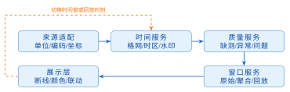
<figcaption>图 7.3  实时流与历史回放共用的数据质量边界</figcaption>
</figure>

## 7.2 图表与实时联动

**本节层次**

核心：7.2.1、7.2.3、7.2.4、7.2.5；指导实践：7.2.2；拓展：7.2.6、7.2.7、7.2.8、7.2.9。

**进入本节所需知识**

7.1.1、7.1.2节；4.5节的`fetch`与4.5.4节的竞态处理；联动部分使用6.1.5节绑好测点的 S4 场景。

**业务问题**

值班员在三维场景里点中渗压计 PZ-07，想看它今天的渗压过程；看到曲线上有一个异常点，又想知道它在坝体的什么位置。本节先把一个测点一天的观测画成曲线（7.2.1节），再让曲线能接收新观测（7.2.2节），认识几种常用图形（7.2.3节），然后把曲线和三维测点连起来（7.2.4节），最后处理页面尺寸变化和各种异常状态（7.2.5节）。7.2.6节以后是数据量变大、图层变多之后才会遇到的问题。

### 7.2.1 第一条真实观测曲线

本书用 Apache ECharts 画图表。它是一个 JavaScript 图表库：给它一个页面上的容器元素和一个描述图表的配置对象（option），它负责画出坐标轴、曲线和提示框。ECharts 最初由百度团队开源，2018年捐赠给 Apache 软件基金会，2021年成为顶级项目<sup>[[56]](../../references.md#ref56)</sup>；配置项随版本演进，写法以官方手册为准<sup>[[57]](../../references.md#ref57)</sup>。示例沿用第4章的 Vite 工程，用`npm install echarts`安装，用`import * as echarts from 'echarts'`引入；Three.js 沿用第6章的安装与导入方式。

**先运行**

在配套工程根目录执行`node teaching-api/server.mjs`启动教学接口，在`frontend/`执行`npm run dev`，浏览器打开`/lesson74.html`。页面左边是第6章的三维场景，右上角的面板里有一条曲线，下方状态文字是“DAM-A-PZ-07：288 条观测”。这一小节只看右边这条曲线是怎么来的，三维部分留到7.2.4节。

**从记录到数据点**

ECharts 的时间轴折线接受形如`[时间, 数值]`的数据点。清单7.7是配套工程`frontend/src/utils/readings.js`里的转换函数，它落实7.1.2节的规则：缺测记录保留时间、数值写成`null`；同时把质量码带在数据点上，后面区分可疑点时要用。

**清单 7.7  toChartPoints：观测记录转为图表数据点**

```javascript
/** 缺测点以 null 保留时间位置，曲线在此断开（connectNulls 必须为 false）。 */
export function toChartPoints(readings) {
  return readings.map(item => ({
    value: [item.occurredAt, item.quality === 'missing' ? null : item.value],
    quality: item.quality,
  }));
}
```

**取数与绘图**

清单7.8把“取一个测点一天的观测并画出来”写成一个函数。它由阶段页的`src/lesson74/main.js`和`series-controller.js`节选合并而来，省去了登录和快速切换测点时的竞态处理，后者在7.2.4节补上。

**清单 7.8  取回一个测点一天的观测并画成曲线**

```javascript
import * as echarts from 'echarts';
import {toChartPoints, readingQuery} from '../utils/readings.js';

// 容器必须有明确的宽高，否则图表画不出来
const chart = echarts.init(document.querySelector('#chart'));
// 左闭右开的时间窗；readingQuery 校验时区与先后顺序
const range = readingQuery({from: '2026-07-01T00:00:00+08:00',
                            to:   '2026-07-02T00:00:00+08:00'});

async function showCurve(assetId, headers) {
  const query = new URLSearchParams(range).toString();
  const res = await fetch(`/api/assets/${assetId}/readings?${query}`, {headers});
  // 按 8.1 节契约，/readings 没有观测时返回 []，204 只用于 /readings/latest；
  // 这一行是防御性处理，便于两个接口共用同一段取数代码
  if (res.status === 204) { chart.clear(); return; }
  if (!res.ok) throw new Error(`读取观测失败（${res.status}）`);
  const readings = await res.json();
  if (readings.length === 0) { chart.clear(); return; }
  chart.setOption({
    title: {text: `${assetId}（${readings[0].unit}）`},
    tooltip: {trigger: 'axis'},
    xAxis: {type: 'time'},
    yAxis: {type: 'value', scale: true, name: readings[0].unit},
    series: [{id: 'level', type: 'line', showSymbol: true,
      connectNulls: false, data: toChartPoints(readings)}]
  }, true);
}
```

配置对象里有几处与水利数据的语义直接相关。

- `xAxis.type`取`'time'`：横轴按`occurredAt`的真实时刻定位。若用`'category'`，各点等距排开，两次观测相隔5 min还是5 h在图上看不出区别。

- `yAxis.name`取自记录里的`unit`：换成水位测点，轴名自动变成 m。标题同样写出对象和单位，只写“监测曲线”的图离开页面就读不懂了。

- `scale:true`让纵轴不必从0开始。PZ-07 这一天的渗压在176 kPa到186 kPa之间，纵轴从0起画，整条线会被压成一条贴着顶部的直线。代价是曲线的起伏在视觉上被放大，读图时要看刻度，不能只看形状。

- `connectNulls:false`与`toChartPoints`配合，实现缺测断线。

- `setOption`的第二个参数`true`表示整个替换旧配置。切换测点时用它，上一个测点的标题和单位不会残留下来。

**看缺测断线**

页面在控制台暴露了`sceneBus`（7.2.4节的场景封装）。执行`sceneBus.select(``{userData:{assetId:'DAM-A-WL-01'}})`，效果等同于在场景里点中 WL-01：曲线切换为库水位，状态文字变成“288 条观测，其中 1 条非有效”。把鼠标移到03:00附近，可以看到曲线在03:05处断开。图7.4用同一套曲线模块画出01:30到05:00这一段，并在右侧列出清单7.1中的三条记录：03:05仍占着横轴上的位置，值是`null`，曲线在它两侧断开。

<figure markdown>
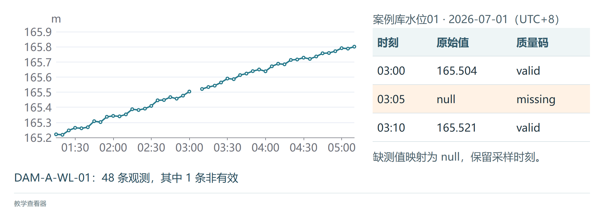
<figcaption>图 7.4  缺测记录与曲线断线逐项核对（教学查看器，调用S5曲线模块）</figcaption>
</figure>

**故障练习**

把`toChartPoints`里的`null`临时改成`0`，刷新后再选 WL-01。纵轴被迫从0画起，03:05处出现一根直插到底的尖刺，其余时段一米多的涨幅被压成一条几乎水平的线。一个缺测点就足以毁掉整张图的可读性。改回`null`，再试另一种错误：在`map`之前加上`.filter(item => item.quality !== 'missing')`，曲线变成连续的一条，03:00与03:10被直接连上，缺测从图上消失了。两种写法都不会报错，只能靠对照原始记录发现。

**给可疑点换个形状**

选中 WL-02（把上面命令里的编码改成`DAM-A-WL-02`），17:35处有一个173.2 m的尖峰，状态文字提示有1条非有效观测，但图上这个点与其他点长得一样。`toChartPoints`已经把质量码放在每个数据点上，只需在系列配置里加两项：

**清单 7.9  可疑点改用菱形并放大（加在 series 配置中）**

```javascript
symbol: (value, params) =>
  params.data.quality === 'suspect' ? 'diamond' : 'circle',
symbolSize: (value, params) =>
  params.data.quality === 'suspect' ? 12 : 4,
```

清单7.9加在`series-controller.js`中`setOption`的系列配置里，与`showSymbol`并列。刷新后17:35的点变成一个较大的菱形，数值和位置不变。这里用形状而不用红色，是因为红色已经留给了预警等级。可疑点没有被删除：这个173.2 m会把纵轴撑高，这正是值班员需要看到的现象。

**给缺测段加阴影**

只有一个点缺测时，断口很窄，容易看漏。清单7.10在生成数据点的同时找出连续的缺测区间，用`markArea`画成灰色阴影，对应图7.2中的灰色块。`gridTimes`是按采样周期生成的完整时间轴，`readingByTime`是按时间索引的观测；在时间轴上找不到记录的时刻同样按缺测处理，这样后端漏发记录时也能看到缺口。

**清单 7.10  质量码驱动的缺测断线与阴影区间**

```javascript
function toSeriesPoint(reading, time) {
  const value = reading?.value;
  const quality = reading?.quality ?? 'missing';
  return quality === 'missing' ? [time, null] : [time, value];
}

function buildSeries(times, byTime) {
  const data = times.map(t => toSeriesPoint(byTime.get(t), t));
  const gaps = [];
  let start = null;
  for (let i = 0; i < times.length; i += 1) {
    if (data[i][1] === null && start === null) start = times[i];
    if (data[i][1] !== null && start !== null) {
      gaps.push([{xAxis: start}, {xAxis: times[i - 1]}]);
      start = null;
    }
  }
  if (start !== null) gaps.push([{xAxis: start}, {xAxis: times.at(-1)}]);
  return {data, gaps};
}

const {data, gaps} = buildSeries(gridTimes, readingByTime);
chart.setOption({series: [{id: 'level', data, connectNulls: false,
  markArea: {itemStyle: {color: 'rgba(120,120,120,.12)'}, data: gaps}}]});
```

**自测**

水位曲线的纵轴为什么通常不从0开始？渗压曲线呢？答案要点：库水位是相对高程基准的高程值，0 m没有物理意义，变化幅度相对绝对值很小，从0起画看不出变化。渗压同理。雨量柱状图则必须从0开始，因为柱的长度就是雨量。

### 7.2.2 追加新观测与切换序列

曲线画出来以后，新观测还会不断到达。最直接的做法是每来一条就重新调用一次`setOption`。ECharts 默认会把新配置与旧配置合并：`series`按`id`匹配，只更新你提供的字段，坐标轴、标题等没提到的部分保持原样。所以追加一条观测时，只需要提交带`id`的新数据数组。合并也有副作用：想删掉一条已经不存在的序列，只提交剩下的序列是删不掉的，旧序列会继续留在图例和提示框里，这时要用`replaceMerge:['series']`明确要求替换整个序列集合。表7.4对照三种更新方式。

**表 7.4  ECharts三种更新方式与适用边界**

| 方式     | 关键调用            | 适用场景与注意事项                                                                |
|:---------|:--------------------|:----------------------------------------------------------------------------------|
| 局部合并 | `setOption(option)` | 默认按`id`合并；保留未提供的配置，适合更新已有序列数据                            |
| 替换集合 | `replaceMerge`      | 删除或重排序列时使用；必须重新提供完整序列集合                                    |
| 流式追加 | `appendData(...)`   | 限支持的系列且不用`dataset`；水位折线用局部合并，排序、去重和窗口裁剪由应用层处理 |

表中的`appendData`是 ECharts 的增量渲染接口，只有部分系列支持，例如`scatter`和`lines`，并且不能与`dataset`一起用；`lines`是线段系列，与本章画过程线用的`line`不是一回事<sup>[[56]](../../references.md#ref56)</sup>。水位折线的更新走局部合并。

清单7.11是配套工程的`frontend/src/lesson74/window-chart.js`。调用方传入一个已经初始化的图表，得到两个函数：`appendTail`在收到一条新观测时调用，`replaceWithTwoSeries`在需要同时显示水位和雨量时调用。

**清单 7.11  水位折线的尾部更新与序列切换**

```javascript
export function createWindowChart(chart) {
  let points = [];
  function replaceWithTwoSeries(level, rain) {
    points = level.slice(-300);
    chart.setOption({
      legend: {data: ['库水位', '时段雨量']},
      xAxis: {type: 'time'},
      yAxis: [{type: 'value', name: '水位/m'},
              {type: 'value', name: '雨量/mm'}],
      series: [
        {id: 'level', name: '库水位', type: 'line',
         yAxisIndex: 0, connectNulls: false, data: points},
        {id: 'rain', name: '时段雨量', type: 'bar',
         yAxisIndex: 1, data: rain.slice(-300)}
      ]
    }, {replaceMerge: ['series'], lazyUpdate: true});
  }
  function appendTail(reading) {
    const value = reading.quality === 'missing' ? null : reading.value;
    points = [...points, [reading.occurredAt, value]].slice(-300);
    chart.setOption({series: [{id: 'level', data: points}]});
  }
  replaceWithTwoSeries([], []);
  return {appendTail, replaceWithTwoSeries};
}
// 页面调用：const live = createWindowChart(chart);
// 收到下一条观测时调用 live.appendTail(reading)。
```

这段代码有三处值得注意。第一，数据缓冲`points`放在模块自己的变量里，图表只负责显示。要加阈值线、要重新排序，改的都是这份缓冲，不必去读图表内部的状态。第二，`slice(-300)`让缓冲最多保留300个点，超出的旧点被丢弃。对5 min采样的水位，300点约为25 h；需求若是“固定显示最近24小时”，要按时间戳裁剪。第三，`appendTail`假定观测按时间递增到达。迟到的观测不能直接追加到尾部，要先在缓冲里按`occurredAt`排序、去掉重复的`eventId`，再整体提交。

`replaceWithTwoSeries`给水位和雨量各配一根纵轴，单位分别写在轴名里，并用`replaceMerge`替换序列集合。在`frontend/`执行`npx vitest run tests/window-chart.test.js`可以看到两个检查：追加超过300条后缓冲只剩末尾300点，其中的`missing`点仍是空值；切换为双序列后两根轴的单位不同，之后的追加不会破坏新窗口。

### 7.2.3 图表选型与双轴图

折线之外还有很多图形可选。选图的依据是读者要完成的任务：比较、看趋势、看分布，还是定位。表7.5按任务列出优先选用的图形，并各举一个案例水库的例子。

**表 7.5  业务任务与图型选择决策表**

| 任务 | 读者要回答的问题         | 优先图型与视觉变量                     | 案例水库示例           |
|:-----|:-------------------------|:---------------------------------------|:-----------------------|
| 比较 | 哪个测点更高或变化更大？ | 排序条形图、点图；位置、长度           | 12个渗压测点当前值排序 |
| 趋势 | 数值如何随时间变化？     | 折线图、面积图；位置、线型             | PZ-07渗压与库水位过程  |
| 分布 | 数据集中还是离散？       | 直方图、箱线图、蜂群图；位置、面积     | 位移测点日变化分布     |
| 构成 | 总量由哪些部分组成？     | 堆叠条形图、面积图；长度、明度         | 分时段降雨量与累计量   |
| 相关 | 两个量是否同步变化？     | 散点图、热力图；位置、大小             | 水位与渗压的相关关系   |
| 定位 | 异常发生在哪里？         | 专题地图、符号图、三维标注；位置、形状 | 坝段测点和影响范围     |

表中“视觉变量”一栏来自 Bertin 对图形符号的分类：位置、长度、角度、面积、明度、色相、纹理、形状和方向。它们表达数量的准确程度不同。人眼比较位置和长度最准，角度其次，面积和明度要靠估计，色相适合区分类别，不适合表达大小。粗略记为“位置 $>$ 长度 $>$ 角度 $>$ 面积 $>$ 颜色”。把水位差异画在纵轴位置上，比用一组深浅相近的颜色更容易读准。一个视觉变量只承担一种含义：如果颜色既表示预警等级又表示数据质量，可疑数据看上去就像高风险数据。7.1.2节把质量交给形状和断线、把颜色留给预警等级，依据就在这里。

设计一张图可以按五个问题依次回答：读者要做什么判断；需要哪些字段、单位、时间窗和质量码；用哪种图形和视觉变量；提供哪些交互，它们改变的是视图还是查询条件；图例、数据版本和生成时间怎样让读者能复核。一个页面可以同时有趋势图和定位图，它们共享对象编码和过滤条件：用户在图表里选中 PZ-07，三维场景里显示的就是同一个测点、同一个时间窗。

**雨量与水位的双轴图**

分析降雨与库水位的关系时，常把雨量柱和水位线画在一张图上。图7.5是水文上惯用的画法：雨量柱从上方的零基线向下画，读左轴；水位线读右轴；两者共用横轴的观测时刻。雨量倒挂可以避免柱子遮挡水位线，向下的柱形表示的仍是非负的雨量。

<figure markdown>
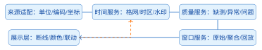
<figcaption>图 7.5  雨量倒挂柱与水位过程线的双轴组合示意</figcaption>
</figure>

清单7.12给出与图7.5数据一致的配置，在任何一个已初始化的图表上调用即可。与7.2.2节`replaceWithTwoSeries`的双轴相比，变化在于雨量轴的`inverse:true`和轴标签上的单位；水位轴设了`min`，是因为五个水位值都在164 m以上。

**清单 7.12  雨量倒挂柱与水位过程线的配置**

```javascript
const times = ['08:00', '10:00', '12:00', '14:00', '16:00'];
const rain = [0, 8.4, 16.2, 4.8, 0];
const level = [164.2, 164.3, 164.7, 165.1, 165.0];

chart.setOption({
  legend: {data: ['时段雨量', '库水位']},
  tooltip: {trigger: 'axis'},
  xAxis: {type: 'category', data: times, name: '观测时刻'},
  yAxis: [
    {type: 'value', name: '雨量/mm', inverse: true,
      min: 0, axisLabel: {formatter: '{value} mm'}},
    {type: 'value', name: '水位/m', min: 163.5,
      axisLabel: {formatter: '{value} m'}}
  ],
  series: [
    {name: '时段雨量', type: 'bar', yAxisIndex: 0,
      data: rain, barMaxWidth: 28},
    {name: '库水位', type: 'line', yAxisIndex: 1,
      data: level, showSymbol: true, smooth: false}
  ]
}, true);
```

双轴图容易造成误读，三个反例值得动手试一遍。第一，把水位轴的最小值从163.5 m改成164 m，曲线看起来波动大了很多，实际变化量没有变，所以轴范围要写在图上。第二，雨量按小时聚合而水位按5 min采样时，两者的峰值会错位；要么在服务端统一时间桶，要么在图例里分别标出采样周期。第三，两条曲线在图上“同步”可能只是两根轴的比例凑巧，图形本身不说明因果关系。若目的是比较不同测点的绝对值，改用上下排列的分面图或同一根轴，比双轴更稳妥。

### 7.2.4 图表与三维对象的双向联动

联动要解决的问题是：图表库只认识数据点的下标，三维引擎只认识网格对象，两边都不知道“测点”是什么。把两者连起来的是`assetId`。第6章绑定测点时把它写进了每个小球的`userData.assetId`，观测记录里也带着同名字段。图7.6画出三者的分工：ECharts 负责二维曲线，Three.js 负责三维场景，两者之间不直接调用，选中了哪个对象、关注哪个时刻，都经过一个联动控制器转发。联动逻辑如果写进图表一侧或场景一侧，两个库就互相依赖了，日后替换其中之一时要同时改动两边。

<figure markdown>
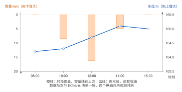
<figcaption>图 7.6  图表、三维场景与联动控制器的职责</figcaption>
</figure>

两个方向各用到一个库接口。从图表到场景：ECharts 的点击事件参数`params`里，`params.data`是被点中的数据点，`params.dataIndex`是它在序列中的下标，控制器据此找到观测记录，取出`assetId`和`occurredAt`，调用场景的高亮接口。从场景到图表：拾取到的三维对象带着`userData.assetId`，控制器查到它对应的数据下标，用`dispatchAction`让图表高亮该点并显示提示框。清单7.13是配套工程的`frontend/src/lesson74/link.js`。

**清单 7.13  ECharts与Three.js对象的双向联动控制器**

```javascript
function createLinkController(chart, scene, readings) {
  const byAsset = new Map(readings.map((r, i) => [r.assetId, {i, r}]));
  const onChartClick = params => {
    const point = params.data?.assetId
      ? params.data : readings[params.dataIndex];
    if (!point) return;
    scene.focusAsset(point.assetId, point.occurredAt);
  };
  const onSceneSelect = object => {
    const assetId = object.userData.assetId;
    const hit = byAsset.get(assetId);
    if (!hit) return;
    chart.dispatchAction({type: 'highlight', seriesId: 'level', dataIndex: hit.i});
    chart.dispatchAction({type: 'showTip', seriesId: 'level', dataIndex: hit.i});
  };
  chart.on('click', onChartClick);
  // scene 是应用层的场景封装对象（带事件总线），
  // 不是 THREE.Scene 本身——后者没有 on/off 接口
  scene.on('select', onSceneSelect);
  return () => {
    chart.off('click', onChartClick);
    scene.off('select', onSceneSelect);
  };
}
```

读这段代码时注意四点。

- `onChartClick`先看数据点自己有没有`assetId`，没有就用下标到`readings`里取。阶段页的数据点由`toChartPoints`生成，不带`assetId`，走的是后一条路；下标越界时`point`为空，函数直接返回。

- `byAsset`按`assetId`建索引。阶段页一次只显示一个测点的观测，所有记录的`assetId`相同，`Map`里留下的是最后一条，所以点球以后图表高亮的是该测点最新的一次观测。

- `scene`参数不是`THREE.Scene`。Three.js 的场景对象没有`on`、`off`这样的事件接口，这里传入的是应用层的一个封装，由`src/lesson74/scene-bus.js`提供：它维护事件订阅，实现`focusAsset`（把指定测点的球改成橙色、把上一个改回蓝色），并在用户点中三维对象时广播`select`事件。

- 函数返回一个解绑函数。切换测点或离开页面时必须调用它，否则每切换一次就多一组点击处理器，点一下曲线会触发多次高亮。

**S5 阶段页的装配**

`lesson74.html`的入口`src/lesson74/main.js`把几个模块装在一起：复用 S4 的场景和测点绑定，创建`sceneBus`，用7.4.1节的拾取器把画布点击变成`select`事件，再由`series-controller.js`在每次选中时取数、画曲线、建立联动。数据来自教学接口，也可以换成 S3 的完整后端。运行后点一个蓝色小球，右侧曲线切到该测点，球变橙色；点曲线上任意一个数据点，对应的球保持高亮；点坝体或空白处，状态文字提示“未选中测点”。图7.7是点中 PZ-07 后的画面，右侧是它在2026年7月1日的288条渗压观测。核对联动是否正确，看三样东西：对象编码、时间范围和单位（kPa）是否都属于被点中的测点。

<figure markdown>
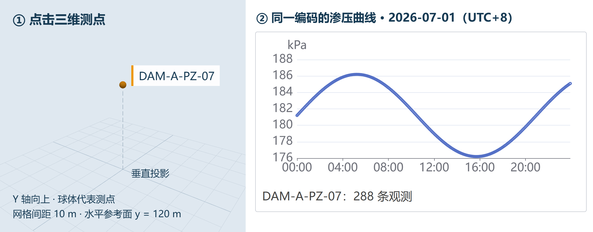
<figcaption>图 7.7  三维测点与渗压曲线联动（配套程序运行图，添加坐标识读标记）</figcaption>
</figure>

**快速切换时的竞态**

用户连点两个测点时，先发出的请求可能后返回。`series-controller.js`复用4.5.4节的做法：每次切换先让序号加1、取消上一个请求、解除旧联动并清空曲线，请求返回后核对序号，只有序号仍是最新的结果才允许更新曲线、单位和状态文字，并建立新的联动。解绑放在切换一开始，而不是放在请求成功之后，这样即使新请求失败或返回空结果，旧曲线也已经无法响应点击。

**故障验证与自测**

在浏览器开发者工具里把网络调成慢速，先点一个渗压测点，立即再点一个库水位测点，最终的曲线、单位和状态文字应全部属于后点的那个。接着选一个位移测点（教学数据里位移没有观测），应显示“暂无观测”，此时点击图表区域不会有任何高亮。断开网络再选测点，应显示失败原因；恢复网络后重新选择可以重试。如果旧曲线又冒出来，或旧的点击处理器还在响应，检查序号核对和解绑是否写在了所有返回分支之前。`tests/series-controller.test.js`覆盖这些异常路径及页面卸载后才到达的响应，`tests/lesson74.test.js`验证对象映射、下标越界和拾取。自测：请求已经取消了，为什么还要核对序号？答案要点：取消只能中止尚未完成的网络请求，已经拿到应答、正在执行的后续代码撤不回来；只有当前选择对应的结果才有权更新界面。

**多张图共用时间轴**

水位、雨量和渗压分成上下几张图时，希望拖动其中一张的时间轴，另外几张跟着动。清单7.14给两个图表实例设置相同的`group`，再调用`echarts.connect`，缩放和提示框就会同步。

**清单 7.14  多图表缩放联动与组标识**

```javascript
const levelChart = echarts.init(document.querySelector('#level'));
const rainChart = echarts.init(document.querySelector('#rain'));
levelChart.group = 'case-reservoir-time';
rainChart.group = 'case-reservoir-time';
echarts.connect('case-reservoir-time');

function focusTime(chart, occurredAt) {
  chart.dispatchAction({type: 'dataZoom',
    startValue: occurredAt, endValue: Date.parse(occurredAt) + 6 * 3600 * 1000});
}
```

`connect`只同步视图范围。它不知道`assetId`，对象定位仍由联动控制器完成；它也不会替你对齐采样周期，雨量和水位共用时间轴以后，图例里仍要各自标明采样周期和聚合方法。

### 7.2.5 响应式与异常状态

**尺寸变化与销毁**

图表实例要占用画布、事件监听器和内存，用完要还。清单7.15在7.2.1节初始化的基础上补上尺寸监听与销毁，把这两件事收进一个`mountChart`函数；`subscribe`是调用方传入的数据订阅函数，接收一个“新观测到达时怎么办”的回调并返回退订函数，7.2.2节的`appendTail`可以直接作为这个回调。容器尺寸变化用`ResizeObserver`监听。只监听`window`的`resize`事件是不够的：侧栏收起时窗口大小没变，图表容器却变宽了。函数返回的清理函数依次解除数据订阅、停止尺寸监听、移除点击处理器、销毁实例，在 Vue 3 组件里由`onUnmounted`调用。漏掉销毁不会立刻出错，切换测点几百次之后页面才开始变卡，这类问题从单次截图里发现不了。

**清单 7.15  响应式尺寸与ECharts实例销毁**

```javascript
// subscribe(onReading) 由调用方提供：注册新观测到达时的回调，返回退订函数；
// onReading(reading) 可以直接用 7.2.2 节的 appendTail
function mountChart(container, option, subscribe, onReading) {
  const chart = echarts.init(container, null, {renderer: 'canvas'});
  const observer = new ResizeObserver(() => chart.resize());
  observer.observe(container);
  chart.setOption(option);
  const unsubscribe = subscribe(onReading);
  return () => {
    unsubscribe();
    observer.disconnect();
    chart.off('click');
    chart.dispose();
  };
}
```

图7.8把这个过程画成状态图：数据变化触发配置合并，容器变化只触发尺寸重算，组件卸载时先解除外部订阅再销毁图表。

<figure markdown>

<figcaption>图 7.8  ECharts实例的创建、更新、响应式与销毁生命周期</figcaption>
</figure>

**五种不同的“没有曲线”**

图表区域一片空白时，用户需要知道原因。加载中、对象没有观测、时间窗内无数据、权限不足、接口失败，是五种不同的状态，各自对应不同的下一步动作：等待、换一个测点、调整时间范围、申请权限、重试。阶段页用状态文字区分了其中三种（“正在读取”“暂无观测”“读取失败”）。数据质量可疑不属于“没有曲线”，它在曲线上用点形表达，在状态文字里给出条数。

**不同屏幕**

值班室大屏同时呈现工程总览、关键曲线和预警列表，首屏先放需要处置的事项和数据新鲜度，技术指标放到展开之后。桌面端以查询和研判为主。移动端保留待办、定位和确认，复杂的多图比较留给桌面端。屏幕变小时调整的是信息的优先级，不是把所有组件等比缩小。

### 7.2.6 时间窗口与LTTB降采样

前面的曲线一天288个点，直接画没有问题。查看一年的5 min水位时，点数超过十万，而图表的宽度只有一千多个像素，一列像素里挤着上百个点，多数点画了也看不见。这一小节讲两件事：时间窗口怎样控制取多少数据，点数仍然太多时怎样在不丢掉峰值的前提下减点。

**时间窗口**

实时曲线用滑动窗口，只保留最近一段时间，7.2.2节的300点缓冲就是一种。历史查询由后端按时间跨度和屏幕宽度选择聚合粒度：表8.3的观测查询接口有可选参数`agg`，浏览器拿到的应该是已经聚合好的序列，而不是把多年原始数据下载到前端再压缩。窗口可以按点数定，也可以按时长定，两者含义不同（7.1.4节），图的标题里要写明是“300点（约25小时）”还是“最近24小时”。

**为什么不能等间隔抽点**

最省事的减点办法是每隔$k$个点取一个。它的问题是取哪个点只看位置不看数值：洪峰恰好落在两个被取点之间，就从图上消失了。按桶取平均值也不行，平均会把尖峰削平，而且画出来的数值不是任何一次真实观测。监测曲线最需要保留的恰恰是峰值、谷值和突变。

**LTTB的做法**

Largest-Triangle-Three-Buckets（LTTB）算法<sup>[[58]](../../references.md#ref58)</sup>的思路是：在每一小段里，留下那个“最突出”的点。设原始序列有$N$个点，要减到$m$个点（$m\ge3$）。首点和尾点直接保留，中间的$N-2$个点按顺序均分为$m-2$个桶，每个桶留一个点。处理第$k$个桶时，上一个桶已经选定的点记为$P_{\mathrm{prev}}$，下一个桶里所有点的横、纵坐标平均值构成一个虚拟点$\overline{P}_{C}$（最后一个桶没有下一桶，用尾点代替）。对当前桶里的每个候选点$P_{\mathrm{cand}}$，计算它与$P_{\mathrm{prev}}$、$\overline{P}_{C}$围成的三角形面积，留下面积最大的那个，它成为下一轮的$P_{\mathrm{prev}}$。

面积用两个向量的叉积计算。从$P_{\mathrm{prev}}$分别指向$P_{\mathrm{cand}}$和$\overline{P}_{C}$的向量为 $\boldsymbol a=(x_{\mathrm{cand}}-x_{\mathrm{prev}},\,y_{\mathrm{cand}}-y_{\mathrm{prev}})$和 $\boldsymbol b=(\bar{x}_{C}-x_{\mathrm{prev}},\,\bar{y}_{C}-y_{\mathrm{prev}})$， 三角形面积是它们张成的平行四边形面积的一半，$S=\frac12|a_xb_y-a_yb_x|$，展开并整理符号得

$$S=\frac{1}{2}\left|
 (x_{\mathrm{prev}}-\bar{x}_{C})(y_{\mathrm{cand}}-y_{\mathrm{prev}})
 -(x_{\mathrm{prev}}-x_{\mathrm{cand}})(\bar{y}_{C}-y_{\mathrm{prev}})
 \right|.$$

$P_{\mathrm{prev}}$与$\overline{P}_{C}$的连线代表曲线在这一段的大致走向，面积大意味着候选点离这条连线远，也就是偏离走向最多的点。平缓段里各候选点面积都小，留哪个差别不大；有尖峰的桶里，峰顶的面积最大，会被留下。图7.9画出一个桶的情形：两个候选点中，$P_{\mathrm{cand},2}$对应的橙色三角形面积更大，被选中。横轴是时间（毫秒）、纵轴是观测值，两者量纲不同，面积本身没有物理意义；但同一个桶内所有候选点共用一条底边，改变任一坐标轴的比例只是给所有面积乘上同一个系数，不影响谁最大。

<figure markdown>
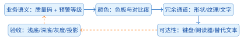
<figcaption>图 7.9  LTTB降采样的几何直觉</figcaption>
</figure>

清单7.16是这个过程的数组实现，输入是`[x, y]`数组，`threshold`即$m$。外层循环每轮处理一个桶：先求下一桶的平均点`avg`，再在当前桶的下标范围内逐个算面积，记下最大者。

**清单 7.16  LTTB分桶与最大三角形选择**

```javascript
function lttb(points, threshold) {
  if (threshold >= points.length || threshold === 0) return points;
  const sampled = [points[0]];
  const every = (points.length - 2) / (threshold - 2);
  let a = 0;
  for (let i = 0; i < threshold - 2; i += 1) {
    const avgStart = Math.floor((i + 1) * every) + 1;
    const avgEnd = Math.min(Math.floor((i + 2) * every) + 1, points.length);
    const next = points.slice(avgStart, avgEnd);
    const avg = next.length ? next.reduce((s, p) => [s[0] + p[0], s[1] + p[1]], [0, 0])
      .map(v => v / next.length) : points[points.length - 1];
    const rangeStart = Math.floor(i * every) + 1;
    const rangeEnd = Math.floor((i + 1) * every) + 1;
    let best = rangeStart; let maxArea = -1;
    for (let j = rangeStart; j < rangeEnd; j += 1) {
      const area = Math.abs((points[a][0] - avg[0]) * (points[j][1] - points[a][1])
        - (points[a][0] - points[j][0]) * (avg[1] - points[a][1])) / 2;
      if (area > maxArea) { maxArea = area; best = j; }
    }
    sampled.push(points[best]); a = best;
  }
  sampled.push(points.at(-1)); return sampled;
}
```

**为什么适合监测曲线，什么时候不能用**

LTTB 有两个性质对监测数据有用。它留下的每个点都是一次真实观测，时间和数值都没有被改动，鼠标悬停时读到的是实测值。它优先保留峰、谷和转折，曲线的形态与原始曲线接近，值班员据此判断“有没有异常过程”不会被误导。

它的适用范围限于给人看的曲线。下面几种情况要回到原始观测。

- 预警判定和超限统计。一个超过阈值的点如果与一个更突出的点落在同一个桶里，就会被舍弃，用降采样后的序列做判定会漏报。最大值、平均值、超阈次数等统计同理，都从原始数据计算。

- 审计取证和报表。降采样的结果与目标点数$m$有关，换一个屏幕宽度，留下的点就不同，不能作为可复现的依据。

- 含缺测的序列。清单7.16假定每个点都有数值，`null`参与运算会被当作0。做法是先在缺测处把序列切成几段，各段分别降采样，段与段之间保留空值，断线因此不会丢失。

- 雨量等时段累计量。柱的高度是时段总量，减点的正确做法是按更长的时段求和（7.1.4节），而不是挑几根柱子留下。

用户放大到某一小段时，可见点数减少，应当重新请求该时间段的原始或更细粒度的数据，而不是把降采样后的稀疏点放大了看。

**ECharts内置的降采样**

ECharts 的折线系列可以直接声明`sampling:'lttb'`，库在点数超过像素宽度时自动按上述方法减点，不必自己调用清单7.16。手写一遍的意义在于知道它做了什么、丢了什么。清单7.17是历史曲线的系列配置，在7.2.1节的配置基础上增加了四样东西：`sampling`声明降采样；`dataZoom`提供滚轮缩放和底部滑块，改变可见时间范围；`markLine`在168.0 m处画出正常蓄水位，`markArea`标出165.0 m至168.0 m的区间；`visualMap.pieces`按数值区间给曲线分段着色。`progressive`一组参数让点数很多的序列分批绘制。

**清单 7.17  历史曲线的降采样、缩放与阈值带**

```javascript
const historyOption = {
  animation: false,
  dataZoom: [
    {type: 'inside', xAxisIndex: 0, filterMode: 'none'},
    {type: 'slider', xAxisIndex: 0, height: 18}
  ],
  visualMap: {show: false, dimension: 1, pieces: [
    {lte: 165.0, color: '#1976D2'},
    {gt: 165.0, lte: 168.0, color: '#F9A825'},
    {gt: 168.0, color: '#C62828'}
  ]},
  series: [{id: 'level', type: 'line', sampling: 'lttb',
    showSymbol: false, progressive: 5000, progressiveThreshold: 10000,
    data: historyPoints,
    markLine: {data: [{yAxis: 168.0, name: '正常蓄水位'}]},
    markArea: {data: [[{yAxis: 165.0}, {yAxis: 168.0}]]}}]
};
chart.setOption(historyOption);
```

图上的参考线和分段颜色只帮助读图。某个水位是否触发预警，由第8章的规则读取原始数值、质量码和当前工况来判定；图上的线要注明它是什么水位、来自哪个版本的参数，一条没有出处的红线容易被当成预警阈值。

### 7.2.7 渲染器、性能预算与更新节奏

**Canvas还是SVG**

`echarts.init`的第三个参数可以选渲染器。Canvas 把整张图画在一个位图上，节点数不随数据点增长，适合连续折线、数千个点和频繁刷新。SVG 为每个图形生成一个 DOM 节点，适合图形少、需要逐个获得键盘焦点或高质量打印的页面，节点过多时布局和事件开销会明显上升。本章的曲线都用 Canvas。

**大数据量开关的代价**

散点或柱形数量很大时，`large:true`和`largeThreshold`让 ECharts 批量绘制，代价是逐点样式和鼠标事件减少，需要点击单个测点的图不适合打开它，应先在服务端聚合或按缩放级别分层。`progressive`与`progressiveThreshold`把绘制拆成若干批，先保证页面能响应；分批期间坐标轴、阈值带和缺测阴影要先画出来，避免用户先看到一条没有质量提示的曲线。这些开关都不改变数据，也都不能代替服务端聚合。

**更新节奏**

5 min采样的数据没有必要来一条重绘一次。同一测点在100–200 ms内到达的多条补传可以合并后只提交一次`setOption`；同一时刻到达的多个测项，先按`assetId`分组、排序、去重，再一次提交。坐标轴、图例和事件监听器在初始化时声明一次，每条消息里只更新数据数组，不要反复创建格式化函数和样式对象。用户正在拖动时间轴时，后台到达的更新先放进缓冲，松手后再合并，避免更新与交互争用主线程。需要立即呈现的红色预警走单独的通知通道，不排在普通曲线更新后面。

判断“卡在哪里”要分段测量：消息到达到通过校验的时间、`setOption`的耗时、浏览器绘制的耗时。页面上同时记录最后一次有效观测时间、最后一次收到消息的时间和最后一次成功绘制的时间，就能区分是传感器没有数据、网络没有消息，还是浏览器没有画出来。缩放时的查询缓存、断线后的状态恢复和成套的回归数据，见附录C的C.11节。

### 7.2.8 专题地图的表达方式

专题地图把数值、类别和空间关系叠加到同一张底图上，回答“哪里”的问题。常用的有四种图层。等值线表达连续场的等值边界，例如水位面、降雨量或淹没深度。色斑图把栅格或分区的数值映射为连续色带，适合观察空间梯度，要标明分级方法、单位和缺测区域。流向箭头用方向和长度表达水流或输水路径，箭头密度随屏幕尺度调整。站点符号用位置、形状和边框表达测点、闸门、雨量站或网关的状态，适合点击查询和联动。图7.10把四种图层画在一张图上；实际使用时每一层有独立的图例和开关，避免底图颜色与专题色带互相干扰。

<figure markdown>
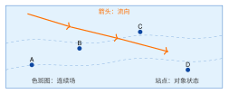
<figcaption>图 7.10  等值线、色斑图、流向箭头与站点符号的组合表达</figcaption>
</figure>

色带的分级固定在服务端或配置文件里，图例显示最小值、最大值、单位和时间窗。用户缩放时可以改变符号大小和标签密度，数值分级保持不变，否则同一个颜色在两次缩放之间代表不同的数值。缺测区域用独立的纹理或灰色遮罩，不用低值的颜色代替“没有数据”。

清单7.18用 ECharts 的`geo`组件画站点符号图。质量与预警仍然分开表达：可疑点改变形状，预警等级决定颜色，缺测点不进入数值散点。`warningLevelColor`由预警服务返回的等级经7.2.9节的色板换算而来，展示层自己不判定等级。

**清单 7.18  专题地图图层与站点符号配置**

```javascript
const stationLayer = readings
  .filter((item) => item.quality !== 'missing')
  .map((item) => ({
    name: item.assetId,
    value: [item.lon, item.lat, item.value],
    symbol: item.quality === 'suspect' ? 'diamond' : 'circle',
    itemStyle: {color: item.warningLevelColor},
    label: {show: item.selected === true, formatter: item.assetId}
  }));

const thematicOption = {
  tooltip: {trigger: 'item'},
  // geo 组件是 coordinateSystem:'geo' 的前提：需先用
  // echarts.registerMap('case-reservoir', geoJson) 注册库区边界
  geo: {map: 'case-reservoir', roam: true,
    itemStyle: {areaColor: '#f4f6f8', borderColor: '#9aa5b1'}},
  visualMap: {min: 0, max: 100, dimension: 2,
    text: ['高', '低'], calculable: true},
  series: [{type: 'scatter', coordinateSystem: 'geo',
    data: stationLayer, symbolSize: 10}]
};
```

发布地图前核对两件事。位置是否正确：底图、专题图层和测点要使用同一坐标参考系；站点位置正确而色斑图整体偏移时，先查栅格范围、轴序和瓦片矩阵，不要在前端给点位加一个固定偏移。数值是否正确：抽样读取栅格或要素的属性，与生成地图时的时间窗、单位和版本对照。底图若来自只返回图片的 WMS 服务，专题数值仍要从可查询的要素服务或覆盖服务取得，不能从图片像素反推监测值。站点符号的点击事件回传`assetId`，显示用的标签不能当主键用。

### 7.2.9 色彩体系与可读性

**三类色板**

色板的类型取决于数据表示的是数量、偏差还是类别。顺序型色板用于从低到高的单调量，例如雨量、淹没深度，明度或饱和度沿一个方向变化。发散型色板用于有明确中心的偏差，例如渗压相对基线的升降，中心用中性色，两端用对比色。定性色板用于没有顺序的类别，例如渗压、位移、水位、雨量四类测项，颜色之间不暗示高低。混用的后果是读者把类别颜色读成数值大小，或者把接近中心的偏差看成“没有数据”。

彩虹色阶在水利看板里很常见，问题也最多。它的明度不是单调变化的，黄色和绿色区域在相同的数值差下显得更亮，蓝紫交界处又会形成原本不存在的边界；部分色相对色觉障碍用户难以区分。连续变量优先选感知均匀的单调色带。工程上必须沿用已有彩虹色带时，同时提供数值标签或等值线，让读者不依赖色相也能读出结论。表7.6汇总各类色板的适用场景，并把质量状态和预警等级单列两行。

**表 7.6  色板类型与水利展示场景**

| 色板类型 | 数据语义                    | 推荐编码                         | 案例水库示例               |
|:---------|:----------------------------|:---------------------------------|:---------------------------|
| 顺序型   | 数值从低到高，方向单调      | 单调明度/饱和度，图例给出边界    | 雨量、淹没深度、残差绝对值 |
| 发散型   | 以中心值为界的正负偏差      | 中心中性色，两端对比色，标注零点 | 渗压相对基线偏差           |
| 定性型   | 无顺序的类别集合            | 互相可区分的色相，并配形状或文字 | 渗压、位移、水位、雨量     |
| 质量状态 | valid/suspect/missing       | 边框、纹理、线型和文字优先       | 可疑点菱形、缺测断线       |
| 预警等级 | NONE/BLUE/YELLOW/ORANGE/RED | 业务颜色+等级文字+图标           | 蓝黄橙红预警与处置入口     |

质量状态和预警等级在表中分成两行，对应7.1.2节的两个维度。清单7.19把它们实现为两套互不覆盖的配置：预警等级提供颜色、图标和文字，质量状态提供边框、纹理和文字，`styleReading`把两者合成一个标签，例如“橙色预警/可疑”。颜色加载失败时，图标和文字仍然能表达状态。未知的质量码按`missing`处理，而不是退回“无预警”：证据不足与没有风险是两回事。

**清单 7.19  预警等级与质量状态的双维度色彩配置**

```javascript
const warningPalette = {
  NONE:   {color: '#607D8B', icon: 'check', text: '无预警'},
  BLUE:   {color: '#1976D2', icon: 'info', text: '蓝色预警'},
  YELLOW: {color: '#F9A825', icon: 'triangle', text: '黄色预警'},
  ORANGE: {color: '#EF6C00', icon: 'diamond', text: '橙色预警'},
  RED:    {color: '#C62828', icon: 'alert', text: '红色预警'}
};
const qualityStyle = {
  valid:   {border: 'solid', texture: 'none', text: '有效'},
  suspect: {border: 'dashed', texture: 'hatch', text: '可疑'},
  missing: {border: 'dotted', texture: 'empty', text: '缺测'}
};

function styleReading(reading) {
  const warning = warningPalette[reading.warningLevel] ?? warningPalette.NONE;
  const quality = qualityStyle[reading.quality] ?? qualityStyle.missing;
  return {...warning, ...quality, label: `${warning.text}/${quality.text}`};
}
```

页面上常见的“正常、关注、告警、离线”四种展示状态，与全书的预警等级这样对应：正常即无预警（NONE），关注即蓝色预警，告警覆盖黄、橙、红三级并在详情里显示具体等级。离线来自网关或设备状态，与预警等级、质量码并列，是第三个维度。选中态用加粗边框或焦点环表示，不借用预警颜色，以免“当前选中”被读成“风险升高”。

**对比度与冗余通道**

对比度和非颜色冗余的要求依据 WCAG 2.2<sup>[[31]](../../references.md#ref31)</sup>：正文文字与背景的对比度不低于4.5:1，大号文字和图形元素不低于3:1。对比度由前景与背景的相对亮度$L$计算： $$C=\frac{L_{\mathrm{bright}}+0.05}{L_{\mathrm{dark}}+0.05}.$$ 白底（$L=1$）上的纯黑文字（$L=0$）对比度为21:1，是上限。同一个色值在不同环境下的表现差别很大：蓝色预警在深色大屏上需要提高明度，红色文字在浅色背景上要用更深的色值，浅灰网格线在投影仪上可能完全消失。所以要在浅底、深底、灰度打印和投影四种条件下各检查一次。

颜色之外要有第二条通道。预警等级配文字和图标，质量状态配边框、虚实线和点形，地图色斑配等值线和数值标注。图7.11把这个过程画成一个回路：先定业务语义，再选色板和对比度，然后补充形状、纹理、文字和替代文本，最后在不同显示条件下检查；检查发现红绿差异在灰度打印中消失，回到冗余通道一步补图标或线型，继续调换色相解决不了这个问题。

<figure markdown>

<figcaption>图 7.11  色彩、冗余编码与可达性验收闭环</figcaption>
</figure>

**替代文本与键盘操作**

读屏用户和键盘用户需要同样能取到数据。清单7.20打开 ECharts 的`aria`支持，给图表写一句包含对象、指标、时间范围和缺测情况的描述，并用贴花图案（`decal`）在颜色之外区分序列；最后三行让图表容器可以获得键盘焦点，并把描述交给读屏软件。

**清单 7.20  ECharts图表的无障碍与替代文本配置**

```javascript
const option = {
  aria: {
    enabled: true,
    decal: {show: true},
    description: '案例水库PZ-07最近24小时渗压趋势；缺测断线，可疑点虚线'
  },
  title: {text: 'PZ-07渗压（kPa）—最近24小时'},
  legend: {data: ['有效', '可疑', '缺测']},
  series: [{type: 'line', name: '有效', data: validPoints},
    {type: 'line', name: '可疑', data: suspectPoints,
      lineStyle: {type: 'dashed'} }]
};
chart.setOption(option);
chart.getDom().setAttribute('tabindex', '0');
chart.getDom().setAttribute('role', 'img');
chart.getDom().setAttribute('aria-label', option.aria.description);
```

图表旁边另外提供一张数据表，列出时间、数值、单位、质量码和预警等级，键盘用户可以逐行读取。焦点顺序从筛选条件到图例，再到图表摘要和详情按钮；弹出详情后焦点移入对话框，关闭后回到原处。鼠标悬停的提示框不能是某项信息的唯一出口。颜色令牌的管理、逐格验收矩阵和色板版本的审计，见附录C的C.12节。

## 7.3 三维场景中的监测点绘制

**本节层次**

核心：7.3.2；指导实践：7.3.1；拓展：7.3.3。

**进入本节所需知识**

6.1.5节的测点绑定；6.2节的坐标系、分带与高程基准；7.1.2节的质量码。

第6章的 S4 场景用近似位置把28个小球挂在坝体附近，足够完成联动。本节做两件事：把测点放到按测量坐标算出的准确位置上（7.3.1节），让球的外观随观测状态变化（7.3.2节）。测点数量增加到成百上千以后的 LOD 与聚合放在7.3.3节。

### 7.3.1 坐标转换与局部原点

国内水利工程的测量成果以 CGCS2000 地理坐标或其高斯–克吕格投影坐标给出，CGCS2000 地理二维坐标系的代码是 EPSG:4490<sup>[[41]](../../references.md#ref41)</sup>。沿用第6章的分带、中央经线和高程基准，可以把工程平面坐标换算为三维场景的局部坐标。表7.7把途中经过的几种坐标并列：地理坐标的单位是度，投影坐标和场景坐标的单位是米，屏幕坐标的单位是像素。定位错误大多出在跨栏混用上，例如把度当作米直接相减，或者拿像素半径去做世界空间的距离判断。

**表 7.7  监测点定位涉及的坐标及单位**

| 坐标阶段            | 典型量         | 单位/精度             | 用途               |
|:--------------------|:---------------|:----------------------|:-------------------|
| CGCS2000地理坐标    | 经度、纬度     | 度                    | 数据交换与服务发布 |
| 高斯–克吕格平面坐标 | 东坐标、北坐标 | m                     | 工程测量与平面定位 |
| 正常高              | 高程           | m                     | 工程竖向定位       |
| 场景局部坐标        | $x,y,z$        | 取决于场景单位，通常m | GPU渲染与对象交互  |
| 屏幕坐标            | 像素行列       | px                    | 点击、框选与触控   |

高斯平面坐标的数值有几十万到几百万米。GPU 的顶点坐标是单精度浮点数，有效数字约7位，直接用这样的大数，毫米级的细节会被舍入掉，画面出现抖动。做法是选一个经测量确认的局部原点$(E_0,N_0,H_0)$，场景里只用相对它的偏移：

$$x=E-E_0,\qquad y=H-H_0,\qquad z=-(N-N_0).$$

$z$前面的负号来自 Three.js 的坐标约定：$y$向上，$x$向东时，右手系的$z$轴指向南，北坐标增大对应$z$减小。项目也可以采用别的轴向，但数据、模型和交互要统一。清单7.21用 proj4 库（`npm install proj4`，`import proj4 from 'proj4'`）完成经纬度到高斯平面坐标的投影，再按上式减去原点。局部原点作为参数传入，换工程时只改调用处。

**清单 7.21  坐标与单位转换**

```javascript
const cgcs2000 = '+proj=longlat +ellps=GRS80 +no_defs +type=crs';
const gauss = '+proj=tmerc +lat_0=0 +lon_0=117 '
  + '+k_0=1 +x_0=500000 +y_0=0 +ellps=GRS80 '
  + '+units=m +no_defs +type=crs';

const [east, north] = proj4(
  cgcs2000, gauss, [longitude, latitude]);
const world = {
  x: east - origin.east,
  y: normalHeight - origin.height,
  z: -(north - origin.north)
};
```

中央经线`lon_0`按工程所在的投影带确定，示例中的117只是一个例子。UTM 同属横轴墨卡托投影，但比例因子和分带方式不同；输入若为 UTM 坐标，先核对带号、半球和基准，再转换到项目统一的坐标系。

**带号前缀**

国内测绘成果常把带号拼在东坐标左边。3度带第39带的成果可能写成`39500000.00`，前两位是带号，真正的东坐标是`500000.00`。带着带号直接减原点，局部坐标会多出三千九百万米，相机裁剪和顶点精度全部失效。清单7.22按元数据给出的带号剥离前缀，带号对不上或剥离后的数值超出合理范围时直接抛错，避免返回一个看起来正常的错误坐标。

**清单 7.22  剥离国内测绘成果的带号前缀**

```javascript
function stripZonePrefix(easting, zoneWidth, zoneNumber) {
  const text = String(easting);
  const prefix = String(zoneNumber);
  if (!text.startsWith(prefix)) throw new Error('带号与坐标不一致');
  const local = Number(text.slice(prefix.length));
  if (!Number.isFinite(local) || local < 0 || local > 1000000) {
    throw new Error('东坐标范围异常');
  }
  return {zoneWidth, zoneNumber, easting: local};
}
const east = stripZonePrefix('39500000.00', 3, 39);
```

**位移箭头的方向**

位移测点除了位置还有方向。工程上方位角从正北起算、顺时针增加。位移量为$d$、方位角为$\alpha$时，在$x$向东、$z$向南的约定下，场景向量为 $$\boldsymbol v=(d\sin\alpha,\;0,\;-d\cos\alpha).$$ 向北的位移$z$分量为负，向东的位移$x$分量为正。清单7.23实现这个换算，角度先由度转为弧度。12 mm的位移按真实比例画在52 m高的坝上是看不见的，所以箭头要放大；放大倍数作为单独的参数，并写进图例，读图的人才能把箭头长度换算回真实位移。

**清单 7.23  按北起顺时针方位角生成位移箭头向量**

```javascript
function displacementVector(distance, azimuthDeg, displayScale = 1) {
  const alpha = azimuthDeg * Math.PI / 180;
  return new THREE.Vector3(
    distance * Math.sin(alpha) * displayScale,
    0,
    -distance * Math.cos(alpha) * displayScale
  );
}
const arrow = displacementVector(0.012, 35, 1000);
```

**怎样检查坐标链路**

只看一个点“落在坝上”不够。选三个控制点和一个工程边界点，逐一比较经纬度、投影东北坐标、局部坐标和屏幕位置。所有点整体平移，先查局部原点或带号；误差随东向或北向距离增大，查中央经线和单位；只有高程方向不对，查高程基准。分项记录这些诊断量，比在渲染层加一个说不清来历的固定偏移更容易复核。工程扩建或分区加载需要更换原点时，给原点编版本号（`originVersion`），所有对象先换算回工程坐标，再统一迁移到新原点；对象的`assetId`不随原点变化。

### 7.3.2 状态变化与渲染更新

球的外观表达两个维度，延续7.1.2节的分工：颜色表示业务状态（无预警、蓝、黄、橙、红，以及来自设备维度的离线），描边或角标表示数据可疑、人工修订。状态变化时只改材质颜色、标签和详情数据，模型不重新加载；`scene-bus.js`里的`focusAsset`就是只改`material.color`的例子。

批量更新时，先用第6章绑定时得到的`assetId`索引找到对象，在同一帧里合并修改。观测值每5 min来一次，但球的颜色不必每次都动：只有状态跨过了等级边界，或者用户正在查看这个对象，才更新三维外观。

### 7.3.3 状态编码、LOD与聚合

案例水库只有28个观测点，逐个画出来没有问题。流域级的场景可能有成千上万个对象，全部画出标签，屏幕上只剩一片重叠的文字。LOD（level of detail，细节层次）按对象在屏幕上的大小决定画多细；聚合把靠得太近的对象合成一个符号。图7.12给出三档：近景逐点显示图标、数值和标签，中景只留状态符号，远景按空间网格聚合，显示数量和组内最高预警等级；用户放大或点击聚合符号时再下钻。

<figure markdown>
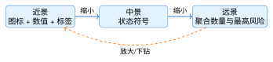
<figcaption>图 7.12  监测点LOD与聚合表达</figcaption>
</figure>

每一档对应用户在那个距离上要回答的问题。近景用于定位和读数，保留测点名称、质量码、当前值和可点击区域。中景用于判断一个坝段或一组设备的状态。远景用于导航，只给聚合数量、缺测比例和风险摘要。

切换阈值用屏幕占用来定，不用固定的米数：圆点直径小于3像素时增加几何细节没有意义，标签小于8像素时隐藏文字，聚合符号达到20像素以上且重叠严重时显示数量。这样就需要把“多少像素”换算成当前距离上的世界长度。透视相机垂直视场角为$\theta$、对象到相机距离为$d$、画布高度为$H_{\mathrm{px}}$像素时，距离$d$处画面的可见高度是$2d\tan(\theta/2)$，它对应$H_{\mathrm{px}}$个像素，所以$r_{\mathrm{px}}$个像素对应的世界长度为

$$r_{\mathrm{world}}=\frac{2d\tan(\theta/2)}{H_{\mathrm{px}}}\,r_{\mathrm{px}}.$$

Three.js 相机的`fov`就是垂直视场角，单位是度；`camera.zoom`不为1时，结果还要除以缩放因子。$d$取对象到相机的世界空间距离。清单7.24实现这个换算，聚合网格的边长和7.4.3节的拾取半径都用它。相机移动或窗口尺寸变化后要重新计算。

**清单 7.24  按相机距离换算聚合与拾取世界半径**

```javascript
function distanceToPoint(camera, point) {
  return camera.position.distanceTo(point);
}
function pixelsToWorld(px, distance, fovRad, heightPx, zoom = 1) {
  return 2 * distance * Math.tan(fovRad / 2) * px / heightPx / zoom;
}
function radiusForObject(camera, point, px, canvasHeight) {
  const distance = distanceToPoint(camera, point);
  const fovRad = THREE.MathUtils.degToRad(camera.fov);
  return pixelsToWorld(px, distance, fovRad, canvasHeight, camera.zoom);
}
```

聚合符号同样要把质量和预警分开。簇的预警等级取成员中的最高者，按 NONE、BLUE、YELLOW、ORANGE、RED 排序；`missing`的成员不参与排序，但计入缺测数量；`suspect`成员数值再大也不抬高簇的等级。簇内全部缺测时显示灰色缺测符号，而不是“无预警”。簇详情列出成员总数、有效数、可疑数、缺测数和最近更新时间，值班员下钻之前就能判断这个符号值不值得点开。代表点的位置用固定规则确定（例如网格中心），相机在阈值附近轻微移动时，用一段迟滞区间防止对象反复创建和销毁。

## 7.4 监测点互动与拾取技术

**本节层次**

核心：7.4.1、7.4.2；指导实践：7.4.4；拓展：7.4.3。

**进入本节所需知识**

6.1节的相机与场景；4.4节的事件监听；已绑定测点的 S4 场景。

### 7.4.1 射线拾取：从一次点击找到测点

鼠标点在画布上的一个像素，程序要知道点中了哪个测点。办法是从相机出发，穿过这个像素向场景里发一条射线，看它先碰到哪个对象，这称为射线拾取。图7.13画出这个过程：点击位置先换算成归一化设备坐标（NDC），再与相机一起确定一条世界空间中的射线，与场景对象求交，离相机最近的交点就是拾取结果。

<figure markdown>
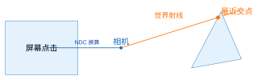
<figcaption>图 7.13  从屏幕坐标到场景交点的拾取过程</figcaption>
</figure>

归一化设备坐标的原点在画布中心，$x$向右、$y$向上，范围都是$-1$到$1$。浏览器事件的坐标原点在左上角、$y$向下，所以$y$方向的换算是$1-2(y-y_0)/H$，多一个负号。画布可能被 CSS 缩放，旁边可能有侧栏，换算时用`getBoundingClientRect()`取画布当前的位置和尺寸，不能直接用窗口宽高。清单7.25是配套工程的`frontend/src/lesson74/picker.js`中的拾取器类：构造时保存相机、场景和画布，`pick`只接收事件里的客户端坐标，求交由 Three.js 的`Raycaster`完成，返回按距离由近到远排序的交点数组。

**清单 7.25  PointPicker：射线拾取器**

```javascript
class PointPicker {
  constructor(camera, scene, canvas) {
    this.camera = camera;
    this.scene = scene;
    this.canvas = canvas;
    this.raycaster = new THREE.Raycaster();
  }
  pick(clientX, clientY) {
    const rect = this.canvas.getBoundingClientRect();
    const ndc = new THREE.Vector2(
      2 * (clientX - rect.left) / rect.width - 1,
      1 - 2 * (clientY - rect.top) / rect.height);
    this.raycaster.setFromCamera(ndc, this.camera);
    return this.raycaster.intersectObjects(
      this.scene.children, true);
  }
}
```

求交得到的是网格，不是业务对象。从网格找回测点，靠的是第6章清单6.6写进`userData.assetId`的标识。交点数组的第一个元素常常是坝体而不是测点小球，配套文件里另有一个`firstAsset`函数，沿数组找到第一个带`assetId`且不是坝体本身的对象；都找不到时，阶段页显示“未选中测点”。业务层还要过滤不可见和无权限的对象。

**验证**

打开`/lesson74.html`，分别点击小球、坝体和空白处，观察状态文字。把浏览器窗口缩窄或用开发者工具把设备像素比设为2，再点同一个球，应当仍然命中；如果窗口变化后点不中，多半是换算时用了窗口尺寸。`tests/lesson74.test.js`里的“拾取回指”一组用例不经过浏览器和相机，直接构造几种交点数组喂给`firstAsset`：坝体排在小球前面时应跳过坝体取到`DAM-A-PZ-07`，标识写在祖先节点上也能找回，只点到坝体或空白时返回`null`。坐标换算本身没有自动化测试，要靠上面的手工验证。

**射线与三角形怎样求交**

`Raycaster`内部对网格的每个三角形做求交测试，常用的是 Möller–Trumbore 算法。清单7.26是一份手写实现，用来看清`Raycaster`替我们做了什么。它把交点写成三角形两条边的线性组合，系数$u$、$v$满足$u\ge0$、$v\ge0$、$u+v\le1$时交点在三角形内；`det`接近0说明射线与三角形平行。代码里每次运算前都先`clone`，因为 Three.js 的向量方法会原地修改调用者，不复制就会改坏传入的顶点。函数返回交点的世界坐标。参数$t$只有在`direction`是单位向量时才等于距离，按远近排序时用`origin.distanceTo(point)`更稳妥。判断平行用的容差$10^{-8}$适合米级场景，模型缩放到毫米或数十公里时要随尺度调整。

**清单 7.26  M\"oller--Trumbore 三角形求交**

```javascript
function intersectTriangle(origin, direction, a, b, c) {
  const edge1 = b.clone().sub(a);
  const edge2 = c.clone().sub(a);
  const p = direction.clone().cross(edge2);
  const det = edge1.dot(p);
  if (Math.abs(det) < 1e-8) return null;
  const inv = 1 / det;
  const tvec = origin.clone().sub(a);
  const u = tvec.dot(p) * inv;
  if (u < 0 || u > 1) return null;
  const q = tvec.clone().cross(edge1);
  const v = direction.dot(q) * inv;
  if (v < 0 || u + v > 1) return null;
  const t = edge2.dot(q) * inv;
  return t >= 0
    ? origin.clone().add(direction.clone().multiplyScalar(t))
    : null;
}
```

### 7.4.2 信息面板与渐进披露

点中测点以后显示什么，按“先少后多”安排。第一次点击只显示测点名称、当前值、单位、质量码、状态和更新时间；展开详情后显示短期曲线、阈值版本和相邻测点；进入专题页才加载多年历史、模型结果和处置记录。这样面板不会遮住场景，移动端也留得出足够大的触控区域。

面板与曲线使用同一组字段和同一顺序：对象名称、`assetId`、指标与单位、观测时间、质量码、预警等级、数据来源。质量为`missing`时显示最后一次有效观测的时间，质量为`suspect`时显示问题说明和复核入口，用户就不会把“没有数值”理解成“没有这个测点”。各层内容分别加载，各自有加载中、空数据、权限不足和失败四种状态，某一层失败时可以单独重试，已经显示的摘要不受影响；面板关闭时取消尚未完成的请求，处理方式与7.2.4节的序号核对相同。

拾取到多个重叠对象时，按交点距离排序后列出候选项让用户选，程序不替用户决定业务对象。无权限的属性不应进入浏览器：后端按权限裁剪应答，前端拿到以后再隐藏是不够的，开发者工具里仍然看得到。聚合簇只返回允许展示的数量和风险摘要，下钻时重新向服务端请求成员列表。

### 7.4.3 触控、长按与世界单位

**拾取半径**

测点如果用点对象（`THREE.Points`）绘制，拾取靠`raycaster.params.Points.threshold`设定命中半径，它的单位是世界单位，不是像素。希望手指有20像素左右的可点范围时，用7.3.3节清单7.24的`radiusForObject`换算，见清单7.27。相机拉远以后同样20像素对应的世界长度变大，阈值要跟着变；写成常数，远处的测点就点不中了。

**清单 7.27  按20像素设定点对象的拾取半径**

```javascript
// 每次拾取前按当前相机位置重算
raycaster.params.Points.threshold = radiusForObject(
  camera, pointWorld, 20, canvas.clientHeight);
```

各测点深度相差很大时，按每个候选对象自己的距离计算，或者改在屏幕空间做命中测试。测点很密时不能一味放大半径，否则一次触控命中多个对象；先按世界半径取候选集合，再按屏幕距离排序，列出名称、数值和更新时间让用户确认。

**长按**

移动端没有鼠标悬停，常用短按打开概要、长按打开操作菜单。长按用定时器实现，关键在清理：手指抬起、手势被系统打断、手指滑出画布，三种情况都要取消定时器。清单7.28用 Pointer 事件统一处理鼠标和触控，`pointerup`、`pointercancel`、`pointerleave`都接到同一个取消函数上。只处理`pointerup`的话，来电话或系统手势打断触控时，600 ms后菜单仍会弹出来。

**清单 7.28  触控长按的定时器与取消**

```javascript
let longPressTimer = null;
const delayMs = 600;

canvas.addEventListener('pointerdown', event => {
  cancelLongPress();   // 多指按下时先清理前一个定时器
  longPressTimer = setTimeout(
    () => openPointMenu(event), delayMs);
});

function cancelLongPress() {
  if (longPressTimer !== null) clearTimeout(longPressTimer);
  longPressTimer = null;
}
['pointerup', 'pointercancel', 'pointerleave']
  .forEach(type => canvas.addEventListener(type, cancelLongPress));
```

短按时`pointerup`先于定时器触发，菜单不会弹出。`pointerdown`入口处先清理一次，第二根手指按下时前一个定时器不会遗留。长按菜单的位置要避开手指遮挡，并提供键盘上的等价操作。指针移动这类高频事件可以节流，预警确认这类操作不能节流，一次都不能丢。

### 7.4.4 案例联调与验收

案例水库按以下路径逐条验证，第1、2条用 S5 阶段页即可完成；第5条需要先把清单7.9加进曲线配置并实现7.4.2节的信息面板；第3、4条需要先做7.3.3节和7.4.3节的内容：

1.  点击渗压曲线上的一个数据点，场景高亮`DAM-A-PZ-07`并记录同一观测时间；

2.  点击雨量站，图表切换到该站当日雨量，时间窗保持不变；

3.  缩小场景后28个观测点按坝区聚合，聚合符号显示数量和最高预警等级；

4.  移动端短按只打开概要，长按600 ms打开操作菜单，中途取消的手势不触发长按；

5.  缺测、可疑和离线分别显示，详情中可追溯质量码与来源。

每条记录写明输入数据版本、浏览器与设备、操作步骤、预期结果、实际结果和截图编号。再加一条组合路径：选中一个测点并打开详情，然后切换远近景，回到原处后仍应定位到同一个`assetId`、显示同一个质量码。只检查“点出现在屏幕上”，发现不了对象索引或时间窗已经对错的问题；渲染正确和业务正确要分别验证。

## 7.5 小结

一条观测记录里，单位决定纵轴，观测时间决定横轴位置，质量码决定画法：有效值连线，可疑值保留原值并换点形，缺测用空值占住时间位置、曲线断开。把缺测填成0或直接丢掉，程序不会报错，图却会说谎。

曲线与三维测点靠`assetId`联动。图表库和三维引擎互不调用，由联动控制器转发选中对象和时刻；切换测点时先解绑旧联动，再用序号核对挡住迟到的应答。点击靠射线拾取找到网格，再由`userData.assetId`回到业务对象。

数据量变大以后才需要时间窗口和降采样。LTTB 在每个桶里留下与前后走向围成三角形面积最大的点，留下的都是真实观测，峰谷形态得以保留；它只服务于看图，预警判定、统计和报表仍读取原始观测。空间上有一组类似的换算：工程坐标减去局部原点得到场景坐标，像素长度按相机距离换算成世界长度，用于拾取半径和聚合网格。

颜色留给预警等级，质量用形状、线型和文字表达，两者都配有颜色之外的第二条通道。可以在课堂上做两个对照：把通信中断产生的缺测填成0，观察曲线上的虚假陡降；把可疑值只用颜色区分，调低投影对比度后看还能不能辨认，再补上形状和文字。

## 7.6 章末交付物

提交“案例水库观测数据三维展示”最小成果：

- 一份含水位、雨量、渗压、位移和设备状态的展示数据样例及字段说明；

- 一张可追加新观测的监测曲线，正确显示缺测断线和可疑点；

- 曲线与三维测点的双向联动，以及一条快速切换或无观测的失败场景记录；

- 28个观测点从工程坐标到场景局部坐标的映射表；

- 选做：LOD/聚合、触控长按和信息面板；

- 五条案例验收记录及失败场景说明。

## 7.7 思考题与练习题

**客观题**

1.  场景局部坐标的常用单位是像素。（判断：对／错）

2.  CGCS2000地理二维坐标系代码是（）。A. 3857B. 4326C. 4490D. 32650

3.  `Raycaster.params.Points.threshold`的量纲与（）一致。A. 屏幕像素B. 场景世界单位C. 时间戳D. 颜色值

4.  LTTB降采样结果可以替代原始数据计算统计报表。（判断：对／错）

5.  实时ECharts序列在增量更新前应先建立初始配置。（判断：对／错）

**简答与设计题**

6.  说明质量码如何影响曲线连线、测点颜色和风险判定。

7.  解释“地理坐标—高斯–克吕格平面坐标—局部场景坐标—屏幕坐标”的转换链。

8.  比较折线图、柱状图、散点图和三维测点在水库监测中的适用任务。

9.  说明为什么聚合半径和触控半径必须进行像素到世界长度的换算。

10. 设计正常、关注、告警、离线和可疑数据的颜色、形状与文字组合。

**实践题**

11. 使用配套仓库`companion/datasets/`提供的水位数据中截取1000条连续记录生成一张曲线，并在一课时内实现300点滑动窗口和缺测断线。

12. 为案例水库28个观测点建立局部坐标映射，抽查5点并记录定位误差。

13. 实现“点击曲线异常点—定位三维测点—打开同一时刻详情”的联动，并完成一条失败场景测试。

14. 实现 LTTB 降采样，将同一组水位序列分别用等间隔抽样和 LTTB 抽样绘制，比较两种方法对峰值、谷值和突变点的保留率，并说明何时必须回看原始数据。

15. 为值班室大屏和键盘用户设计一次无障碍验收：检查颜色之外的文字/形状编码、焦点顺序、触控长按、屏幕阅读器提示和窄屏降级，提交至少一条失败用例及修复证据。
