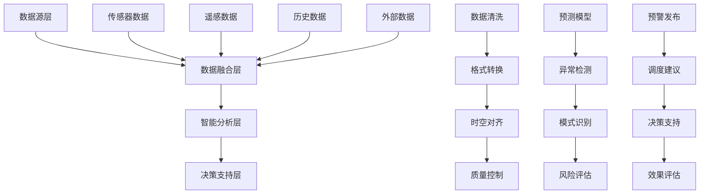

# 第七章 数据融合与智能分析

## 学习目标

通过本章学习，学生应能够：

1. **掌握多源数据处理**：深入理解水利行业多源异构数据的特征，熟练掌握数据采集、预处理和质量控制技术
2. **精通数据融合技术**：掌握时空数据融合理论和方法，能够处理不同来源、不同格式的水利数据整合问题
3. **具备智能分析能力**：熟练运用机器学习、深度学习等AI技术进行水文预测、异常检测和决策支持
4. **理解实时处理架构**：掌握流式数据处理技术，能够设计高性能的实时数据分析系统
5. **具备系统优化能力**：了解边缘计算、分布式处理等前沿技术，能够优化大规模数据处理性能
6. **建立分析思维模式**：培养数据驱动的决策思维，能够从复杂数据中提取有价值的业务洞察

## 引言

在前面章节中，我们已经掌握了数据库设计、前后端开发、三维可视化等基础技术。本章将重点讲解如何将这些技术有机结合，构建智能化的数据分析体系。

现代智慧水利系统面临着前所未有的数据挑战：

**数据来源多样化**：传感器数据、遥感影像、气象数据、历史档案、社交媒体信息等多种数据源需要统一处理。

**数据规模急剧增长**：物联网设备的大规模部署产生了海量的实时数据流，传统的批处理方法已无法满足实时分析需求。

**分析需求复杂化**：从简单的阈值报警发展到复杂的预测建模、风险评估、智能决策，对算法的准确性和实时性提出更高要求。

**业务价值期望提高**：管理决策者期望从数据中获得更深层次的业务洞察，推动精细化管理和智能化运营。

本章将系统介绍数据融合与智能分析的核心技术，帮助读者构建完整的智慧水利数据分析能力。

## 本章小节

!!! info "章节结构"
    
    ### [第一节 多源数据采集与预处理](section07-01.md)
    - 水利数据类型与特征分析
    - 传感器数据采集系统设计
    - 遥感数据获取与处理方法
    - 数据质量控制与清洗技术
    
    ### [第二节 数据融合技术](section07-02.md) 
    - 多源数据融合理论基础
    - 时空数据融合算法实现
    - 异构数据格式转换技术
    - 数据一致性处理方法
    
    ### [第三节 智能分析算法](section07-03.md)
    - 水文预测算法设计与实现
    - 异常检测与智能预警系统
    - 趋势分析与模式识别技术
    - 决策支持算法与专家系统
    
    ### [第四节 实时数据处理架构](section07-04.md)
    - 流式数据处理技术原理
    - 边缘计算在水利中的应用
    - 分布式处理框架设计
    - 系统性能优化策略

## 核心技术架构

## 技术特点

| 技术领域 | 关键特征 | 应用价值 |
|----------|----------|----------|
| 数据融合 | 多源异构、时空统一 | 提高数据质量和完整性 |
| 智能算法 | 机器学习、深度学习 | 提升分析准确性和效率 |
| 实时处理 | 流计算、边缘计算 | 支持实时决策和响应 |
| 分布式架构 | 弹性扩展、高可用 | 保证系统稳定性和性能 |

## 开发工具与框架

!!! tip "推荐技术栈"
    
    === "数据处理"
        - **Apache Kafka**：分布式流处理平台
        - **Apache Flink**：实时流计算引擎
        - **Apache Spark**：大数据处理框架
        - **Pandas/NumPy**：Python数据分析库
        
    === "机器学习"
        - **TensorFlow**：深度学习框架
        - **PyTorch**：灵活的ML框架
        - **Scikit-learn**：经典机器学习库
        - **XGBoost**：梯度提升算法
        
    === "数据库"
        - **InfluxDB**：时序数据库
        - **MongoDB**：文档数据库
        - **Redis**：内存数据库
        - **Elasticsearch**：搜索引擎

## 实际应用案例

!!! example "典型应用场景"
    
    1. **洪水预警系统**：融合气象、水文、遥感数据，提前6-12小时预警
    2. **水质监测分析**：结合物联网传感器和卫星遥感，全面监控水质变化
    3. **水库智能调度**：基于多目标优化算法，实现防洪、发电、供水统筹调度
    4. **农业精准灌溉**：利用土壤传感器和气象数据，智能控制灌溉时间和水量
    5. **工程安全监测**：通过变形、渗流数据分析，及时发现工程安全隐患

## 技术发展趋势

!!! note "发展方向"
    
    - **联邦学习**：在保护数据隐私的前提下，实现多方协作建模
    - **图神经网络**：处理复杂的空间关系和网络结构数据
    - **数字孪生**：构建物理世界的数字化镜像，支持仿真分析
    - **自动机器学习**：降低AI技术门槛，实现模型自动化构建
    - **量子计算**：解决超大规模优化和复杂系统仿真问题

## 参考文献

[1] 李德仁, 王树良, 李德毅. 地理空间数据挖掘与知识发现[M]. 北京: 测绘出版社, 2019.

[2] Chen C, Zhang J. Data-intensive applications, challenges, techniques and technologies: A survey on Big Data[J]. Information Sciences, 2014, 275: 314-347.

[3] 国家发展改革委. "十四五"数字经济发展规划[R]. 北京: 国家发展改革委, 2022.

[4] Zhang Y, Liu K, Qin X, et al. A deep learning approach for real-time water level prediction in smart city water management[J]. Journal of Hydrology, 2023, 617: 129087.

[5] Wang L, Chen X, Li S. Multi-source data fusion for flood forecasting using machine learning techniques[J]. Water Resources Management, 2023, 37(8): 2891-2908.

[6] Apache Software Foundation. Apache Flink: Stateful Computations over Data Streams[EB/OL]. https://flink.apache.org/, 2023.

## 思考题与练习

### 基础理解题

1. 分析智慧水利系统中多源数据的特点和融合挑战。
2. 比较批处理和流处理在水利数据分析中的适用场景。
3. 解释机器学习在水文预测中的应用原理和优势。

### 应用分析题

4. 设计一个洪水预警系统的数据融合方案，包括数据源识别、融合算法选择和质量控制措施。
5. 分析边缘计算在偏远地区水利监测中的应用价值和实现方法。
6. 讨论实时数据处理系统的性能瓶颈和优化策略。

### 综合设计题

7. 设计一个面向特定流域的智能分析系统架构，包含数据采集、处理、分析、决策的完整流程。
8. 针对水库智能调度场景，设计多目标优化算法和决策支持系统。

### 前沿探索题

9. 调研联邦学习在跨流域水文预测中的应用前景。
10. 分析数字孪生技术在智慧水利中的实现路径和技术挑战。

## 本章小结

本章系统介绍了智慧水利数据融合与智能分析的核心技术。通过多源数据采集预处理、数据融合技术、智能分析算法、实时处理架构四个方面的学习，学生应掌握从数据到智慧的完整技术路径，具备构建智能化水利分析系统的能力，为第八章的综合应用实践奠定坚实基础。
