# 第8章 智慧水利平台典型应用

**学习目标**

通过本章学习，学生应能够：

1.  沿着渗压计PZ-07的一次异常观测，说清查询、质量检查、预警定级、人工确认和工单处置各由哪个模块完成、彼此通过哪些接口连接；

2.  解释质量码怎样决定一条观测能否参与定级，区分“未评估”与“无预警”；

3.  读懂预警与工单的状态流转，用条件更新和幂等写入处理重复提交与并发操作；

4.  用配套工程的S6阶段包运行并检查这条业务链，为一次失败写出“现象—原因—处理—验证”；

5.  说明监测平台向数字孪生平台扩展时，预报、预警、预演、预案各自需要哪些数据与模型支撑（选读）；

6.  在指导下完成一次容器化启动与冒烟验证（指导实践）。

**引言**

前面各章分别做出了页面（第4章）、后端接口（第5章）、三维场景（第6章）和曲线联动（第7章）。本章用这些已经能运行的模块完成一件值班室里每天都会发生的事：连续降雨之后，渗压计PZ-07的读数出现异常，平台要判断这条数据可不可信、够不够得上预警、由谁确认、派给谁处理，最后还能回头查清当时的依据。

案例水库是教学虚构工程，参数见8.1节的表8.1，与前面各章一致。8.1节给出案例参数、角色和接口契约；8.2节说明这条业务链经过哪些已学模块；8.3节讲数据模型、质量检查以及确认与工单的实现；8.4节讲预警定级，并在教学接口上把整条链走一遍。8.5节的数字孪生案例和8.6节的部署实践放在最后，前四节不依赖它们。

!!! note "说明"

    **学习安排**

    8.1–8.4是本章主线，每节的“本节层次”标出核心小节；只读核心小节也能把PZ-07业务链走通。标为“指导实践”的小节在实验课上完成，需要第5章的完整后端与数据库。标为“拓展”的内容（缓存与消息一致性、模型可信度与闸门计算）以及8.5节供课程设计和学有余力的读者选读；8.6节是部署指导实践。

!!! tip "提示"

    **配套工程入口：S6 阶段包**

    本章主线只需要Node和浏览器，不需要数据库、Kafka或容器。三个入口都在`companion/water-platform-demo`下：`frontend/src/lesson84/classify.js`（质量码门禁与四级定级）、教学接口`teaching-api/server.mjs`里的确认与工单端点、`teaching-api/closeloop-check.mjs`（把整条链写成20项检查）。版本线上，本章把v4（观测展示与联动）推进到v5：加入质量检查、四级预警和工单处置；数据库脚本`db/001_init.sql`、消息消费者`ReadingConsumer`、`docker-compose.yml`与`smoke.sh`属于指导实践部分。

## 8.1 需求分析与业务闭环

**本节层次**

核心：8.1.1、8.1.2、8.1.3。

**进入本节所需知识**

读过第2章的需求条目和第3章的模块图即可；前面各章引用的案例参数和接口契约都在本节。

### 8.1.1 案例边界与工程参数

安全监测平台服务于观测、分析、预警和处置四件事。它给值班员和专业分析员提供依据，工程怎样运行仍由运行规程和有权限的人决定。教学案例只模拟信息流程，不连接任何真实控制设备。测点怎样布设、数据怎样使用，实际工程依据相应的设计与监测规范<sup>[[59]](../../references.md#ref59)[[60]](../../references.md#ref60)</sup>。

表8.1给出本案例的全部教学参数。坝高、特征水位、测点数量和网关数量都由这张表确定，需求说明、数据库、三维场景和测试数据共用这一组数。

**表 8.1  案例水库教学案例设定**

| 项目         | 教学设定                                                        | 使用位置                       |
|:-------------|:----------------------------------------------------------------|:-------------------------------|
| 工程对象     | 52 m混凝土坝；坝基高程120.0 m，坝顶高程172.0 m，防浪墙顶173.2 m | 三维场景、对象编码与空间定位   |
| 观测点       | 渗压12、位移8、水位3、雨量5（共28个）                           | 数据模型、图表、预警与质量检查 |
| 流域与库容   | 流域面积320 km$^2$；总库容0.85亿 m$^3$                          | 降雨情景、水位包络与容量估算   |
| 特征水位     | 死水位148.0 m；汛限水位165.5 m；正常蓄水位168.0 m               | 水位越限、预警分级与调度约束   |
| 洪水控制水位 | 设计洪水位170.2 m（P=1%）；校核洪水位171.6 m（P=0.1%）          | 洪水情景与安全校核             |
| 泄洪设施     | 3孔弧形闸门，单孔净宽8.0 m，闸底高程152.0 m，最大开度6.0 m      | 闸门正算、反算与方案编码       |
| 接入设备     | 6台采集网关                                                     | 在线状态、断网缓存与补传       |
| 用户角色     | 值班员、专业分析员、运维员、审批人、审计员                      | 权限、工单和职责分离           |
| 教学事件     | 连续降雨后PZ-07渗压变化异常                                     | 预警、会商、处置和复盘         |

对象编码也属于参数。数据库里写的是`DAM-A-PZ-07`，三维模型的`userData.assetId`、预警事件的`assetId`和工单里引用的也是同一个字符串。哪一处换了写法，曲线、场景和预警就对不到同一个测点上。

### 8.1.2 角色、用例与权限边界

值班员查看实时状态、确认预警并创建工单；专业分析员检查数据质量、模型结果和相邻测点；运维员处理设备与通信故障；审批人确认高风险处置或调度建议。前几章一直使用这四种角色。本章增加第五个角色审计员：只读，可以查询关键操作和证据，不参与任何处置，因此不改变前四种角色的职责。表8.2把五类角色能做和不能做的事并列出来。

**表 8.2  角色与关键权限**

| 角色       | 允许操作                     | 受限操作             |
|:-----------|:-----------------------------|:---------------------|
| 值班员     | 查看、确认告警、发起工单     | 不修改模型与全局阈值 |
| 专业分析员 | 复核数据、运行分析、提出建议 | 不直接执行控制命令   |
| 运维员     | 设备维护、网关配置、补传检查 | 不关闭业务告警证据   |
| 审批人     | 审批高风险处置、确认有效期   | 不绕过设备状态校验   |
| 审计员     | 查询事件、审批、配置和回执   | 全部只读             |

表8.3是案例平台的接口契约，与表8.1一样是全书唯一来源：第4章的页面、第5章的后端、第7章的联动和本章的业务链使用同一组路径、字段与错误约定。“来源”列说明每个端点由配套工程骨架提供、由教学接口模拟，还是由对应章节实现。表中最后四行（预警列表、确认、建工单、完成工单）是本章要用到的端点。表8.4约定教学接口的故障注入方式，第4章用它在没有后端时练习加载、空数据、非法参数和未认证四种状态。

**表 8.3  案例水库监测平台接口契约（全书唯一来源）**

| 方法与路径                                                                                                                                                                                                                                                                                                        | 请求                                                              | 成功响应                                                                                                  | 角色与约束                                   | 来源                |
|:------------------------------------------------------------------------------------------------------------------------------------------------------------------------------------------------------------------------------------------------------------------------------------------------------------------|:------------------------------------------------------------------|:----------------------------------------------------------------------------------------------------------|:---------------------------------------------|:--------------------|
| `POST /api/auth/login`                                                                                                                                                                                                                                                                                            | `username, password`                                              | `accessToken, expiresInSeconds, authorities`                                                              | 匿名；失败一律 401 固定文案                  | 骨架                |
| `GET /api/assets`                                                                                                                                                                                                                                                                                                 | `assetType, after, limit`                                         | `assetId, displayName, assetType, unit`（数组）                                                           | 值班员、分析员；只返回 active                | 骨架                |
| `GET /api/assets/{id}/readings`                                                                                                                                                                                                                                                                                   | `from, to`（ISO-8601 带时区），可选 `agg`                         | `assetId, occurredAt, value, unit, quality, eventId, version`（数组）；`quality` 取 valid/suspect/missing | 值班员、分析员；时间窗左闭右开；400 参数非法 | 骨架                |
| `GET /api/assets/{id}/readings/latest`                                                                                                                                                                                                                                                                            | 无                                                                | 单个观测（字段同上，含 `assetId`）；尚无观测时 204                                                        | 值班员、分析员；404 对象不存在               | 教学接口；第5章实现 |
| `POST /api/readings`                                                                                                                                                                                                                                                                                              | `assetId, occurredAt, value, unit, quality`；头 `Idempotency-Key` | 201 与新记录；重复键返回同一记录                                                                          | 分析员；人工补录或订正                       | 第5章               |
| `GET/PUT /api/readings/{id}`                                                                                                                                                                                                                                                                                      | PUT 带版本号                                                      | 单条记录 / 订正后的记录（版本 +1）                                                                        | 分析员；观测不删除，只增版本                 | 第5章               |
| `GET /api/warnings`                                                                                                                                                                                                                                                                                               | `level, status, assetId, page`                                    | 预警证据摘要；`level` 取 NONE、BLUE、YELLOW、ORANGE、RED 之一                                             | 值班员、分析员；未评估单独显示               | 第8章               |
| `POST /api/warnings/{id}/ack`                                                                                                                                                                                                                                                                                     | 请求追踪号、版本                                                  | 最新预警状态                                                                                              | 值班员；open 条件更新，重复可重试            | 第8章               |
| `POST /api/work-orders`                                                                                                                                                                                                                                                                                           | `warningId, ownerRole,` `dueAt, action`                           | 工单编号与状态                                                                                            | 值班员、审批人；预警必须存在                 | 第8章               |
| `POST /api/work-orders/{id}/complete`                                                                                                                                                                                                                                                                             | `result`、版本                                                    | 回执与完成时间                                                                                            | 值班员；状态须为 in_progress                 | 第8章               |
| **通用约定**：错误体统一为 `{code, message, field?}`；400 参数非法、401 未登录或令牌失效、403 角色无权、404 对象不存在、5xx 服务端故障。对象编码按表8.1（如 `DAM-A-PZ-07`），角色见表8.2。“骨架”指 companion/water-platform-demo 已实现并有测试；“教学接口”指第4章使用的本地模拟服务；“第 N 章”指由该章清单实现。 |                                                                   |                                                                                                           |                                              |                     |

**表 8.4  教学接口的故障注入约定（仅教学接口识别，真实后端忽略）**

| 查询参数 `teach=` | 教学接口行为                                                                           | 页面应当出现的表现                       |
|:------------------|:---------------------------------------------------------------------------------------|:-----------------------------------------|
| `delay:3000`      | 延迟 3000 ms 后再正常返回                                                              | 加载态可见；期间切换对象不得被旧响应覆盖 |
| `empty`           | 返回 `[]` 或 204                                                                       | 显示“暂无数据”，不是空白也不是报错       |
| `invalid`         | 返回 400 与 `{code:"INVALID_RANGE", field:"from"}` | 提示到具体字段，保留用户已输入的值       |
| `unauthorized`    | 返回 401                                                                               | 清除令牌并跳转登录，登录后回到原页面     |
| `error`           | 返回 503                                                                               | 显示“稍后重试”，提供重试按钮，不清除令牌 |

权限要在三处检查：前端路由决定页面能不能进，后端方法决定操作能不能做，数据查询决定能看到哪些对象。前端隐藏按钮只是让界面清爽，挡不住直接调用接口的请求，真正起作用的是后端授权。敏感字段也一样，后端不发给浏览器，比发过去再用CSS藏起来可靠。

### 8.1.3 端到端业务闭环

一条观测从现场设备出发，先经过接入（校时、去重），再做质量检查，合格的数据才进入规则或模型分析；分析结果形成预警事件，值班员确认后派出工单，处置结果写回并归档，复盘结论再用来改进规则和模型。图8.1画的就是这条闭环。图中没有从现场设备直接指向预警的箭头：绕过接入和质量检查的预警，说不清自己依据的数据是否可信。

<figure markdown>
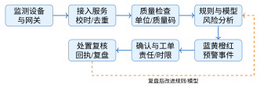
<figcaption>图 8.1  水利工程安全监测业务闭环</figcaption>
</figure>

本章用一个具体事件把这条闭环走一遍。连续降雨后，`DAM-A-PZ-07`的渗压读数持续上升，平台要依次回答六个问题：

1.  这条观测查得到吗？（查询，8.2节）

2.  它的质量码是什么，能不能参与定级？（质量检查，8.3.2节）

3.  如果能，属于哪一级预警；如果不能，界面怎样显示“未评估”？（定级，8.4.1节）

4.  谁来确认这条预警，两个人同时点确认会怎样？（确认，8.4.2节）

5.  工单派给谁、何时到期、凭什么算完成？（工单，8.4.2节）

6.  事后怎样从一条预警查回当时的观测、规则版本和处置回执？（证据，8.3.4节与8.4.2节）

除了这条正常路径，还要看几条失败路径：可疑数据被挡在定级之外，未确认就派单被拒绝，重复确认和重复完成被拒绝，没有权限的操作被拒绝。8.4.2节逐条演示。

## 8.2 总体架构与三维场景设计

**本节层次**

核心：8.2.1；指导实践：8.2.3；拓展：8.2.2。

**进入本节所需知识**

3.2节的分层与模块划分；第4–7章各自的阶段页至少运行过一次。

### 8.2.1 统一技术栈与分层架构

案例平台的技术栈与前面各章相同。浏览器端是Vue组件、Router路由、Pinia状态和Three.js场景；后端是Spring Boot接口、领域服务以及质量与预警服务；PostgreSQL保存业务数据，PostGIS保存空间对象，TimescaleDB扩展管理时序观测；Kafka在服务之间传递事件，Redis存放可以重建的短期缓存。图8.2按层画出这套技术栈和各层之间的调用方向。读本章的代码清单时，先在图上找到它属于哪一层，再看细节。

<figure markdown>
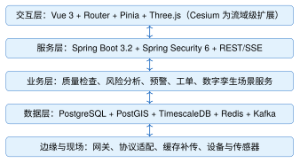
<figcaption>图 8.2  案例水库平台统一技术架构</figcaption>
</figure>

本章的重点是这些模块怎样接成一条业务链。表8.5按PZ-07事件的六个步骤列出：每一步用到前面哪一章的成果，本章在它上面加了什么，在配套工程的哪个入口能看到结果。表中“本章新增”一列就是8.3节和8.4节要讲的内容，其余部分请回到对应章节和配套文件。

**表 8.5  PZ-07业务链各步用到的已学模块与本章新增内容**

| 步骤     | 已学模块                                                            | 本章新增                               | 配套入口               |
|:---------|:--------------------------------------------------------------------|:---------------------------------------|:-----------------------|
| 查询观测 | 第4章请求封装与四种页面状态；第5章`readings`与`readings/latest`接口 | 无，直接使用                           | 教学接口或S3后端       |
| 质量检查 | 第7章三值质量码与展示前检验                                         | 后端五项检查与质量码合并规则           | 清单8.2                |
| 预警定级 | 第7章预警色与质量状态的双维度配色                                   | `evaluable`与`level`两个维度、四级分界 | `lesson84/classify.js` |
| 人工确认 | 第5章方法级权限、409冲突                                            | 条件更新；未评估事件不可确认           | 教学接口`ack`端点      |
| 工单处置 | 第5章幂等请求与事务                                                 | 状态流转；完成必须带处置结果           | 教学接口工单端点       |
| 回查证据 | 第5章`eventId`幂等键                                                | 证据快照与按事件追溯的查询             | `closeloop-check.mjs`  |

现场一侧的采集设备可以结合图8.3认识。柜内下部是电源与蓄电池，中部是采集设备，右侧带天线和网口的模块负责通信，上部端子排连接现场电缆。平台上某个测点长时间没有新数据时，按供电、采集、通信三条路径排查，可以分清是设备没上电、没取到读数，还是读数没传出来，然后再去查对应的日志和接口状态。

<figure markdown>

<figcaption>图 8.3  按供电、采集与通信识读采集柜（AI生成的教学渲染，非接线设计图）</figcaption>
</figure>

### 8.2.2 Three.js主线与Cesium扩展

坝体、廊道、测点和设备这一级的三维交互沿用第6、7章的Three.js主线。如果案例扩展到流域或跨区域水网，需要地球、全球地形和大范围3D Tiles，可以在门户层引入Cesium。两种引擎共用对象编码、坐标基准和事件契约，业务状态只有一份。表8.6给出两者的适用边界，判断依据是场景尺度：单个工程的精细交互用Three.js，跨流域的大范围地形用Cesium。

**表 8.6  三维引擎选型边界**

| 引擎     | 优先场景                           | 设计注意                                 |
|:---------|:-----------------------------------|:-----------------------------------------|
| Three.js | 单工程精细模型、设备交互、定制材质 | 局部原点、GLB/3D Tiles加载、对象索引     |
| Cesium   | 流域/水网、地球与大范围地形浏览    | 坐标基准、瓦片服务、异步加载与令牌配置   |
| 组合方案 | 门户在流域级定位后进入工程级场景   | 统一对象ID、时间窗与权限，不复制业务数据 |

### 8.2.3 场景组织、材质与交互

三维对象按“工程—坝段—构件—测点”组织，业务编码写在`userData.assetId`里，这是6.1节清单6.6已经做好的绑定。模型文件只管几何和材质，测点状态由接口数据驱动：数据更新时改颜色、标签和详情，不重新加载坝体。

在业务链里，三维场景和曲线负责一件事：让值班员看到PZ-07在坝体的什么位置、最近的过程线是什么样。这部分直接使用第7章S5阶段页`lesson74.html`，其中清单7.13的联动控制器和清单7.25的射线拾取已经实现了“点曲线定位测点、点测点切换曲线”。Vue工程里对应的组件是`frontend/src/components/MonitoringDashboard.vue`和`src/stores/monitoring.js`：组件画曲线，`missing`的点取`null`使过程线断开；store在切换测点时只接受最后一次请求的响应，这是4.5节处理竞态的写法。

本章在这个页面上增加的是预警状态的显示。测点标记的颜色由定级结果决定，取值只有六种：无预警、未评估、蓝、黄、橙、红。“未评估”必须有自己的样式（例如灰色加问号图标和原因文字），绝不能与“无预警”共用绿色。这一约定沿用7.2节清单7.19的双维度配色，定级函数见8.4.1节。

**选读：水面的颜色动画**

水体材质可以用一个时间变量`u_time`驱动。清单8.1是片元着色器，它只改变每个像素的颜色：绿色分量随横向纹理坐标和时间做正弦变化，水面上出现缓慢移动的明暗条纹。网格顶点没有移动，水面在几何上仍是一个平面；这种效果与水动力计算无关，条纹的疏密和速度同波高、流速没有对应关系。要让水面真正起伏，需要在顶点着色器里改顶点位置（6.1节清单6.8）；要表现真实流态，颜色应由水动力模型的计算结果映射而来。每帧只更新`u_time`这一个uniform，材质不重建。

**清单 8.1  水面颜色动画的片元着色器**

```glsl
uniform float u_time;
uniform float speed;
varying vec2 vUv;

void main() {
    float t = u_time * speed;
    float wave = sin(vUv.x * 20.0 + t) * 0.03;
    gl_FragColor = vec4(0.10, 0.48 + wave, 0.72, 0.78);
}
```

渲染性能的处理办法见6.1节和7.2节：先测帧时间、绘制调用次数和显存，再决定是否使用实例化、LOD和按需加载。

## 8.3 数据模型、前端展示与后端处理

**本节层次**

核心：8.3.1、8.3.2；指导实践：8.3.3、8.3.4、8.3.5、8.3.6；拓展：8.3.7、8.3.8。

**进入本节所需知识**

8.1节的接口契约；5.4节的实体、Repository与三层结构；7.1节的三值质量码。指导实践部分需要第5章S3终点的完整后端和数据库。

### 8.3.1 数据模型与事件契约

PZ-07业务链上有四类记录在流动：测点、观测、预警和工单；模型运行是第五类，供8.4.3节和8.5节使用。表8.7列出这五类实体的关键字段和约束。其中“原始值不可覆盖”一条直接决定了表结构：人工订正一条观测时，平台追加一个新版本并写明原因和责任人，原来那一行保留。所以观测表有版本号和修订原因两个字段，一个测点在同一时刻可以有多行。

**表 8.7  核心数据实体**

| 实体     | 关键字段                             | 约束                         |
|:---------|:-------------------------------------|:-----------------------------|
| 测点     | assetId、类型、单位、空间位置        | 编码唯一，单位与监测项匹配   |
| 观测     | occurredAt、value、quality、source   | 事件时间排序，原始值不可覆盖 |
| 预警     | level、ruleVersion、evidence、status | 蓝黄橙红四级，证据可追溯     |
| 工单     | owner、deadline、action、result      | 与预警关联，完成需回执       |
| 模型运行 | modelVersion、inputSnapshot、result  | 适用范围与输入快照完整       |

表8.8是这些实体落到数据库后的字段字典，第5章的实体类、接口返回的JSON和本章的SQL都以它为准。有三处需要留意。第一，`quality`、`level`和`status`是枚举，接口、数据库约束和页面文案使用完全相同的拼写和大小写。第二，预警有`evaluable`和`level`两个字段：`evaluable=false`表示数据质量不足、没有做出判定，这时`level`固定为`NONE`；`evaluable=true`且`level=NONE`才是“算过了，没有触发”。第三，`evidence`保存做出判定时的指标、阈值和规则版本，叫作证据快照。规则以后会调整，有了快照，半年后仍能说清当时为什么定为黄色。

**表 8.8  第8章核心数据库字段字典**

| 字段                     | 类型                  | 约束                        | 单位         | 说明                               |
|:-------------------------|:----------------------|:----------------------------|:-------------|:-----------------------------------|
| asset.asset_id           | text                  | 主键、唯一                  | 无           | 工程对象和测点的稳定业务编码       |
| asset.asset_type         | text                  | 非空                        | 无           | 测点、闸门、坝段等项目分类         |
| asset.geometry           | geometry(PointZ,4490) | 非空、GiST 索引             | 度、米       | 测点经纬度与高程位置               |
| asset.metadata           | jsonb                 | 可为空                      | 无           | 厂商标识、量程和扩展属性           |
| reading.event_id         | text                  | 非空、唯一                  | 无           | 消息幂等键，跨服务保持不变         |
| reading.occurred_at      | timestamptz           | 主键组成                    | UTC          | 观测发生时间，不得晚于当前时间     |
| reading.value            | numeric               | 缺测时为空                  | 由监测项定义 | 原始数值，数据库不覆盖历史版本     |
| reading.quality          | text                  | valid/suspect/missing       | 无           | 第7章统一的三值质量码              |
| reading.version          | integer               | 非空、正数                  | 无           | 同一事件的修订版本序号             |
| warning.level            | text                  | NONE/BLUE/YELLOW/ORANGE/RED | 无           | 规则评估得到的预警等级             |
| warning.evaluable        | boolean               | 非空                        | 无           | false 表示“未评估”而非无预警       |
| warning.evidence         | jsonb                 | 非空                        | 无           | 指标、阈值、规则版本组成的证据快照 |
| work_order.warning_id    | bigint                | 外键、非空                  | 无           | 对应的预警事件                     |
| work_order.due_at        | timestamptz           | 非空                        | UTC          | 处置时限，供到期查询               |
| model_run.input_snapshot | jsonb                 | 非空                        | 无           | 可复现的输入范围与版本摘要         |
| model_run.status         | text                  | 状态检查                    | 无           | queued/running/succeeded/failed    |

图8.4画出五张表的关系。实线从主对象指向关联记录，都是一对多：一个测点有多条观测和多条预警，一条预警可以派出多张工单。虚线表示追溯关系：预警通过`source_event_id`记住是哪一条观测触发了它，模型运行通过输入快照记住读了哪些数据。

<figure markdown>
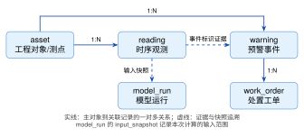
<figcaption>图 8.4  第8章核心实体关系与追溯路径</figcaption>
</figure>

字典里的编号类型是数据库的`bigint`。教学接口没有数据库，它用`w-0002`、`wo-0001`这样的字符串作编号。契约只要求编号稳定、可以放进路径，两种写法都满足。

### 8.3.2 质量检查：一条观测能不能参与定级

观测进入平台后先过质量检查，再谈预警。7.1节在前端做过展示前的检验，目的是让曲线如实画出缺测和可疑点；后端的检查发生在数据入库和定级之前，决定这条观测能不能作为预警依据。检查有五项：

- 格式：数值存在，并且是有限数；

- 单位：与该监测项登记的单位一致，例如渗压用kPa；

- 范围：落在该测点的量程之内；

- 时序：`occurredAt`不晚于当前时间，也不早于同一测点的上一条记录；

- 重复：同一个`eventId`没有出现过。

清单8.2是完整实现。`inspect`逐项检查，把发现的问题记入`issues`，同时更新质量状态；原始值始终不动。多个问题同时出现时，质量状态按`missing > invalid > suspect > valid`的优先级取最严重的一个，`issues`里保留全部原因。`invalid`是服务内部使用的结论，表示数值明显无效；对外仍然只有三种质量码，`invalid`输出为`suspect`，与第7章的口径一致。`qualityFlagAdjusted`标出平台是否改动了设备上送的质量码，页面据此同时显示原质量码、调整后的质量码和原因，运维员可以分清问题出在传感器一侧还是平台校验一侧。

清单后半部分的`classify`是定级函数，8.4.1节再讲。这里先记住它的第一个分支：质量码不是`valid`，直接返回“未评估”，分数再高也不看。

**清单 8.2  质量检查服务实现**

```java
import java.time.Clock;
import java.time.Instant;
import java.util.ArrayList;
import java.util.List;
import java.util.Objects;
import java.util.Set;
import java.util.concurrent.ConcurrentHashMap;

record Reading(String eventId, String item, Double value, String unit,
               Instant occurredAt, String quality) {
    Reading withQuality(String nextQuality) {
        return new Reading(eventId, item, value, unit, occurredAt, nextQuality);
    }
}

record QualityResult(Reading reading, List<String> issues,
                     boolean qualityFlagAdjusted) {}

interface UnitRegistry {
    boolean matches(String item, String unit);
}

interface RangePolicy {
    boolean isInvalid(Reading reading);
}

public final class QualityService {
    public enum WarningLevel { NONE, BLUE, YELLOW, ORANGE, RED }

    public record Classification(boolean evaluable,
                                 WarningLevel level,
                                 String reason) {}

    private final UnitRegistry unitRegistry;
    private final RangePolicy range;
    private final Clock clock;
    private final Set<String> seenEventIds =
        ConcurrentHashMap.newKeySet();

    public QualityService(UnitRegistry unitRegistry,
                          RangePolicy range, Clock clock) {
        this.unitRegistry = Objects.requireNonNull(unitRegistry);
        this.range = Objects.requireNonNull(range);
        this.clock = Objects.requireNonNull(clock);
    }

    public QualityResult inspect(Reading r, Reading previous) {
        Objects.requireNonNull(r, "reading");
        List<String> issues = new ArrayList<>();
        String qualityState = normalizeQuality(r.quality());

        if (r.value() == null) {
            issues.add("missing_value");
            qualityState = mergeQuality(qualityState, "missing");
        } else if (!Double.isFinite(r.value())) {
            issues.add("invalid_format");
            qualityState = mergeQuality(qualityState, "invalid");
        }

        if (!unitRegistry.matches(r.item(), r.unit())) {
            issues.add("unit_mismatch");
            qualityState = mergeQuality(qualityState, "suspect");
        }

        if (r.value() != null && Double.isFinite(r.value())
                && range.isInvalid(r)) {
            issues.add("invalid_range");
            qualityState = mergeQuality(qualityState, "invalid");
        }

        Instant now = clock.instant();
        boolean timeError = r.occurredAt() == null
                || r.occurredAt().isAfter(now)
                || (previous != null && previous.occurredAt() != null
                    && r.occurredAt().isBefore(previous.occurredAt()));
        if (timeError) {
            issues.add("occurredAt_order");
            qualityState = mergeQuality(qualityState, "suspect");
        }

        if (r.eventId() == null) {
            issues.add("missing_eventId");
            qualityState = mergeQuality(qualityState, "suspect");
        } else if (!seenEventIds.add(r.eventId())) {
            issues.add("duplicate_eventId");
            qualityState = mergeQuality(qualityState, "suspect");
        }

        // 对外质量码仍保持valid/suspect/missing三值口径；
        // invalid作为内部校验结果，最终进入未评估分支。
        String outputQuality = "invalid".equals(qualityState)
                ? "suspect" : qualityState;
        boolean qualityFlagAdjusted =
                !Objects.equals(outputQuality, r.quality());
        Reading output = r.withQuality(outputQuality);
        return new QualityResult(output, List.copyOf(issues),
                qualityFlagAdjusted);
    }

    public Classification classify(double score, String quality) {
        if (!"valid".equals(quality)) {
            return new Classification(false, WarningLevel.NONE,
                    "未评估：质量码=" + quality);
        }
        if (!Double.isFinite(score)) {
            return new Classification(false, WarningLevel.NONE,
                    "未评估：评分不是有限值");
        }
        if (score >= 0.85) {
            return new Classification(true, WarningLevel.RED, "达到红色阈值");
        }
        if (score >= 0.70) {
            return new Classification(true, WarningLevel.ORANGE, "达到橙色阈值");
        }
        if (score >= 0.50) {
            return new Classification(true, WarningLevel.YELLOW, "达到黄色阈值");
        }
        if (score >= 0.30) {
            return new Classification(true, WarningLevel.BLUE, "达到蓝色关注阈值");
        }
        return new Classification(true, WarningLevel.NONE, "无预警");
    }

    private static String normalizeQuality(String quality) {
        if (quality == null || quality.isBlank()) return "missing";
        return switch (quality) {
            case "valid", "suspect", "missing" -> quality;
            default -> "suspect";
        };
    }

    private static String mergeQuality(String current, String candidate) {
        return priority(candidate) > priority(current) ? candidate : current;
    }

    private static int priority(String quality) {
        return switch (quality) {
            case "missing" -> 3;
            case "invalid" -> 2;
            case "suspect" -> 1;
            default -> 0;
        };
    }
}
```

**运行与观察**

这个类不依赖Spring，把它和8.4.1节的测试清单8.21放进`backend/src/test/java`下即可用`mvn -q test`运行。再自己补两个用例：一条`value`为`null`、单位也不对的观测，结果的质量码应为`missing`，`issues`同时含有`missing_value`和`unit_mismatch`；同一个`eventId`检查两次，第二次应含有`duplicate_eventId`且质量码为`suspect`。

**一个会遇到的问题**

`seenEventIds`是内存里的集合，服务一重启就清空，重启之后同一事件的重投会被当成新事件。它在这里只用来演示去重的含义。配套后端的做法见5.7节清单5.48：由数据库的唯一索引裁决重复，消费者在事务之外捕获冲突并确认消息。8.3.4节给出对应的SQL。

### 8.3.3 关系模型与建表

这一小节把字段字典写成建表语句。全部语句都在配套工程的`db/001_init.sql`里：前半部分是第5章已经用到的`asset`、`reading`和`warning`三张表，后半部分是本章补上的约束、索引以及`work_order`和`model_run`两张表。补充部分写成可以重复执行的形式（`IF NOT EXISTS`，约束用`DO`块先查`pg_constraint`再添加），数据库容器第一次启动时整份脚本执行一遍，之后对着已有的库再执行也不会报错。组合方式是：关系表保存事实，PostGIS保存空间位置，TimescaleDB按时间管理观测表，JSONB字段保存结构会变化的证据。参与约束和连接的稳定字段用普通列，这样SQL能做类型检查；JSONB只放扩展属性和快照。

`asset`是测点和工程对象的主表。主键`asset_id`用业务编码，不用自增号，因为网关、三维模型、工单和报表都靠这个编码对上同一个对象。`geometry`是带高程的`PointZ`，坐标系固定为EPSG:4490（CGCS2000，见6.2节）。GiST索引是PostGIS的空间索引，“某个范围内有哪些测点”这类查询靠它先缩小候选集。清单8.3是建表语句和本章补上的编码格式约束与两个索引。

**清单 8.3  空间对象表、编码约束与索引（摘自 db/001_init.sql）**

```sql
CREATE EXTENSION IF NOT EXISTS postgis;
CREATE EXTENSION IF NOT EXISTS timescaledb;
CREATE TABLE IF NOT EXISTS asset (
  asset_id text PRIMARY KEY, asset_type text NOT NULL, display_name text NOT NULL,
  unit text, geometry geometry(PointZ,4490) NOT NULL, elevation_m numeric,
  active boolean NOT NULL DEFAULT true, metadata jsonb NOT NULL DEFAULT '{}'::jsonb,
  created_at timestamptz NOT NULL DEFAULT now(), updated_at timestamptz NOT NULL DEFAULT now()
);
-- asset：编码格式约束、空间索引与“有效测点”列表索引
DO $$ BEGIN
  IF NOT EXISTS (SELECT 1 FROM pg_constraint WHERE conname = 'asset_id_format') THEN
    ALTER TABLE asset ADD CONSTRAINT asset_id_format CHECK (asset_id ~ '^[A-Z0-9-]+$');
  END IF;
END $$;
CREATE INDEX IF NOT EXISTS asset_geometry_gist_idx ON asset USING GIST (geometry);
CREATE INDEX IF NOT EXISTS asset_type_active_idx ON asset(asset_type, active);
```

`asset_type`与`active`的组合索引服务于“当前有效的某类测点”列表，`GET /api/assets`走的就是这个条件，退役测点不会出现在页面上。

`reading`是追加写入的高频表，建表语句已在5.4节的清单5.26印出。主键由测点、发生时间和版本号组成，同一测点同一时刻的订正版本可以并存。两条`CHECK`约束把质量码的语义交给数据库把关：质量码只能取三个值；`value`为空时质量码必须是`missing`。`create_hypertable`把它转成TimescaleDB的超表，也就是按时间自动切成若干块的表，查最近一小时只扫描最近的块。超表上的唯一索引必须包含时间列，所以幂等键写成`(occurred_at, event_id)`的复合唯一索引。本章在它上面只补两样东西，见清单8.4：版本号必须是正数的约束，以及8.3.4节质量码分布统计要用的`(quality, occurred_at)`索引。

**清单 8.4  reading 表的补充约束与索引（摘自 db/001_init.sql）**

```sql
-- reading：版本号为正数，质量码分布统计的索引
DO $$ BEGIN
  IF NOT EXISTS (SELECT 1 FROM pg_constraint WHERE conname = 'reading_version_positive') THEN
    ALTER TABLE reading ADD CONSTRAINT reading_version_positive CHECK (version > 0);
  END IF;
END $$;
CREATE INDEX IF NOT EXISTS reading_quality_time_idx ON reading(quality, occurred_at DESC);
```

预警、工单和模型运行三张表见清单8.5。`warning`表第5章已建好，本章给它加上`source_event_id`列（记住是哪一条观测触发了它，8.3.4节的追溯查询靠它连接）、状态取值的`CHECK`约束和待处理队列索引。业务过程各有自己的表和状态字段，测点行上不记录“当前是否预警”。预警的状态依次是`open`（待确认）、`acknowledged`（已确认）、`assigned`（已派单）、`closed`（已关闭）；工单一创建就是`in_progress`，结束于`completed`或`cancelled`。数据库的`CHECK`只负责拒绝拼错的状态值，某个状态能不能转到另一个状态由8.3.5节的服务代码控制。

**清单 8.5  预警、工单与模型运行表（摘自 db/001_init.sql）**

```sql
CREATE TABLE IF NOT EXISTS warning (
  warning_id bigserial PRIMARY KEY, asset_id text NOT NULL REFERENCES asset(asset_id),
  level text NOT NULL CHECK (level IN ('NONE','BLUE','YELLOW','ORANGE','RED')),
  evaluable boolean NOT NULL, score numeric, reason text NOT NULL,
  rule_version text NOT NULL, evidence jsonb NOT NULL, status text NOT NULL DEFAULT 'open',
  created_at timestamptz NOT NULL DEFAULT now()
);
-- warning：追溯字段、状态约束与待处理队列索引
ALTER TABLE warning ADD COLUMN IF NOT EXISTS source_event_id text NOT NULL;
DO $$ BEGIN
  IF NOT EXISTS (SELECT 1 FROM pg_constraint WHERE conname = 'warning_status_check') THEN
    ALTER TABLE warning ADD CONSTRAINT warning_status_check
      CHECK (status IN ('open','acknowledged','assigned','closed'));
  END IF;
END $$;
CREATE INDEX IF NOT EXISTS warning_open_queue_idx ON warning(status, level, created_at DESC);
-- work_order：一创建就是 in_progress，结束于 completed 或 cancelled
CREATE TABLE IF NOT EXISTS work_order (
  work_order_id bigserial PRIMARY KEY,
  warning_id bigint NOT NULL REFERENCES warning(warning_id),
  owner_role text NOT NULL,
  due_at timestamptz NOT NULL,
  action text NOT NULL,
  result text,
  status text NOT NULL DEFAULT 'in_progress',
  created_at timestamptz NOT NULL DEFAULT now(),
  completed_at timestamptz,
  CONSTRAINT work_order_status_check
    CHECK (status IN ('in_progress','completed','cancelled'))
);
CREATE INDEX IF NOT EXISTS work_order_due_idx ON work_order(status, due_at);
-- model_run：模型运行记录，input_snapshot 保存可复现的输入范围
CREATE TABLE IF NOT EXISTS model_run (
  run_id uuid PRIMARY KEY,
  model_name text NOT NULL,
  model_version text NOT NULL,
  input_snapshot jsonb NOT NULL,
  started_at timestamptz NOT NULL,
  finished_at timestamptz,
  status text NOT NULL,
  result jsonb,
  error_message text,
  requested_by text NOT NULL,
  CONSTRAINT model_run_status_check
    CHECK (status IN ('queued','running','succeeded','failed')),
  CONSTRAINT model_run_finish_check
    CHECK (finished_at IS NULL OR finished_at >= started_at)
);
CREATE INDEX IF NOT EXISTS model_run_status_time_idx ON model_run(status, started_at DESC);
```

三个索引各对应一个页面：值班员按状态和等级看待处理的预警，运维员按到期时间看未完成的工单，专业分析员按状态和时间看模型运行记录。每个索引都会增加写入和备份的开销，先有查询，再建索引。

建表顺序由外键决定：先装扩展，再建`asset`，然后是引用它的`reading`和`warning`，最后是`work_order`和`model_run`。验证方法：执行完脚本后，在psql里输入`\d warning`，应能看到`source_event_id`列、两条`CHECK`约束（`warning_level_check`由列上的`CHECK`自动命名，`warning_status_check`由`DO`块添加）和一条指向`asset`的外键；试着插入一行`level='GREEN'`的预警，数据库应当拒绝。连续聚合、压缩和保留策略等时序库的运维内容见附录C的C.13节。

### 8.3.4 业务链上的查询、幂等写入与条件更新

这一小节的七段SQL按业务链的顺序排列。它们都是参数化语句，`:asset_id`这样的占位符由Repository填入；练习时在psql里把占位符换成具体值执行。

**读取观测**

清单8.6按测点和时间窗读取有效观测。时间窗左闭右开，理由见5.4.1节。它只返回`valid`的行；页面要显示可疑点和缺测，需要另查一次并带上质量码，否则“没有合格数据”会被画成一条看上去连续的曲线。

**清单 8.6  按时间窗读取有效观测**

```sql
SELECT occurred_at, value, unit, quality, event_id, version
FROM reading
WHERE asset_id = :asset_id
  AND occurred_at >= :start_at
  AND occurred_at < :end_at
  AND quality = 'valid'
ORDER BY occurred_at, version;
```

**质量码分布**

清单8.7用条件聚合统计一个时间窗内三种质量码各有多少条。值班交接时看这张表，可以很快发现哪个测点的可疑或缺测比例突然升高。这条查询只读数据，质量码的订正要走新版本。

**清单 8.7  质量码分布统计查询**

```sql
SELECT asset_id,
       count(*) AS total_count,
       count(*) FILTER (WHERE quality = 'valid') AS valid_count,
       count(*) FILTER (WHERE quality = 'suspect') AS suspect_count,
       count(*) FILTER (WHERE quality = 'missing') AS missing_count
FROM reading
WHERE occurred_at >= :start_at AND occurred_at < :end_at
GROUP BY asset_id
ORDER BY asset_id;
```

**幂等写入**

设备重传、消息重投都会让同一条观测到达两次。清单8.8的做法是先插入，遇到唯一索引冲突就什么都不做。应用看到影响行数为0，就知道这是重复事件：记一条日志，确认消息即可，不必重试。订正数据要用新的版本号另写一行，这条语句不能拿来覆盖旧值。

**清单 8.8  基于事件 ID 的幂等写入**

```sql
INSERT INTO reading(asset_id, occurred_at, event_id, value,
                    unit, quality, source, version)
VALUES (:asset_id, :occurred_at, :event_id, :value,
        :unit, :quality, :source, 1)
ON CONFLICT (occurred_at, event_id) DO NOTHING;
```

**待处理预警**

清单8.9列出还没有关闭的预警，红色排最前，同级按时间先后。`evaluable`作为一列返回，页面因此能把“蓝色”“无预警”和“未评估”分开显示。

**清单 8.9  待处理预警队列查询**

```sql
SELECT warning_id, asset_id, level, evaluable, score,
       reason, rule_version, created_at
FROM warning
WHERE status IN ('open', 'acknowledged', 'assigned')
ORDER BY CASE level
           WHEN 'RED' THEN 1 WHEN 'ORANGE' THEN 2
           WHEN 'YELLOW' THEN 3 WHEN 'BLUE' THEN 4 ELSE 5
         END,
         created_at;
```

**条件更新：确认预警**

两个值班员可能同时对同一条预警点“确认”。清单8.10的`WHERE`里多带了一个条件`status = 'open'`：第一个请求改动1行；第二个请求到达时状态已经变了，条件不成立，改动0行。服务看到0行，就知道有人先处理了，于是读出最新状态告诉第二个人，不会把已确认的记录再写一遍。这种把“期望的旧状态”写进更新条件的做法叫条件更新。契约表中`ack`一行的“重复可重试”指的就是它带来的性质：请求因为超时重发多少次，预警都只被确认一次，重发的请求得到409和当前状态，客户端据此刷新页面即可。

**清单 8.10  带状态条件的预警确认**

```sql
UPDATE warning
SET status = 'acknowledged'
WHERE warning_id = :warning_id
  AND status = 'open'
RETURNING warning_id, status, created_at;
```

**完成工单**

清单8.11用同样的办法完成工单：只有状态仍是`in_progress`的工单才能写入结果和完成时间，已经完成或取消的工单改动0行。处置结果`result`不能为空，这一点由接口层检查；随后的`SELECT`取出关联的预警编号，供服务在同一个事务里把预警关闭。

**清单 8.11  工单完成与回执写入**

```sql
BEGIN;
UPDATE work_order
SET status = 'completed', completed_at = now(), result = :result
WHERE work_order_id = :work_order_id
  AND status = 'in_progress';
SELECT warning_id FROM work_order WHERE work_order_id = :work_order_id;
COMMIT;
```

**回查证据**

清单8.12从一个`event_id`出发，把观测、预警、工单和模型运行连在一起查出来。用的是`LEFT JOIN`，链条断在哪里，哪一列就是空值：有观测没有预警，说明没有触发或者还没评估；有预警没有工单，说明还没派单。复盘时用这条查询回答“这张工单当初是因为哪条数据派出去的”。

**清单 8.12  按事件标识追溯业务闭环**

```sql
SELECT r.event_id, r.asset_id, r.occurred_at, r.quality,
       w.warning_id, w.level, w.evaluable,
       o.work_order_id, o.status AS work_status,
       m.run_id, m.model_version, m.status AS run_status
FROM reading AS r
LEFT JOIN warning AS w ON w.source_event_id = r.event_id
LEFT JOIN work_order AS o ON o.warning_id = w.warning_id
LEFT JOIN model_run AS m
  ON m.input_snapshot ->> 'eventId' = r.event_id
WHERE r.event_id = :event_id;
```

### 8.3.5 确认与工单的后端实现

配套后端（`backend/`下的`edu.example.qingyuan`包）已经有登录、测点与观测查询和消息消费，这些是第5章的内容：实体与复合主键见清单5.14，三层结构见5.4.2节，统一错误体见`ApiExceptionHandler.java`，Kafka幂等消费见清单5.48。预警确认和工单它还没有，这一小节在同一个包里补上四样东西：两个实体、两个带条件更新的Repository、一个负责状态流转的服务、一个控制器。先做完8.4.2节在教学接口上的练习，再回来读这些代码，会容易得多。

实体只做字段映射，见清单8.13。类里没有修改`status`的方法。状态只能通过Repository的条件更新来改，这样“读出来、判断、再写回去”之间不会被另一个请求插进来。

**清单 8.13  WarningEntity 与 WorkOrderEntity：只做字段映射**

```java
// WarningEntity.java 与 WorkOrderEntity.java，包 edu.example.qingyuan
// 两个文件都需要 import jakarta.persistence.*; 与 java.time.Instant;
// WarningEntity 另需 java.math.BigDecimal（numeric 列在 validate 模式下不接受 Double）
@Entity
@Table(name = "warning")
public class WarningEntity {
    @Id @GeneratedValue(strategy = GenerationType.IDENTITY)
    @Column(name = "warning_id") private Long warningId;
    @Column(name = "asset_id", nullable = false) private String assetId;
    @Column(name = "source_event_id", nullable = false) private String sourceEventId;
    @Column(nullable = false) private String level;
    @Column(nullable = false) private boolean evaluable;
    private BigDecimal score;
    @Column(nullable = false) private String reason;
    @Column(name = "rule_version", nullable = false) private String ruleVersion;
    @JdbcTypeCode(SqlTypes.JSON)
    @Column(nullable = false, columnDefinition = "jsonb") private String evidence;
    @Column(nullable = false) private String status = "open";
    @Column(name = "created_at", nullable = false) private Instant createdAt = Instant.now();

    protected WarningEntity() { }
    public WarningEntity(String assetId, String sourceEventId, String level,
                         boolean evaluable, BigDecimal score, String reason,
                         String ruleVersion, String evidence) {
        this.assetId = assetId; this.sourceEventId = sourceEventId;
        this.level = level; this.evaluable = evaluable; this.score = score;
        this.reason = reason; this.ruleVersion = ruleVersion;
        this.evidence = evidence;
    }
    public Long getWarningId() { return warningId; }
    public String getAssetId() { return assetId; }
    public String getLevel() { return level; }
    public boolean isEvaluable() { return evaluable; }
    public BigDecimal getScore() { return score; }
    public String getReason() { return reason; }
    public String getStatus() { return status; }
}

@Entity
@Table(name = "work_order")
public class WorkOrderEntity {
    @Id @GeneratedValue(strategy = GenerationType.IDENTITY)
    @Column(name = "work_order_id") private Long workOrderId;
    @Column(name = "warning_id", nullable = false) private Long warningId;
    @Column(name = "owner_role", nullable = false) private String ownerRole;
    @Column(name = "due_at", nullable = false) private Instant dueAt;
    @Column(nullable = false) private String action;
    private String result;
    @Column(nullable = false) private String status = "in_progress";
    @Column(name = "created_at", nullable = false) private Instant createdAt = Instant.now();
    @Column(name = "completed_at") private Instant completedAt;

    protected WorkOrderEntity() { }
    public WorkOrderEntity(Long warningId, String ownerRole,
                           Instant dueAt, String action) {
        this.warningId = warningId; this.ownerRole = ownerRole;
        this.dueAt = dueAt; this.action = action;
    }
    public Long getWorkOrderId() { return workOrderId; }
    public Long getWarningId() { return warningId; }
    public String getOwnerRole() { return ownerRole; }
    public Instant getDueAt() { return dueAt; }
    public String getAction() { return action; }
    public String getResult() { return result; }
    public String getStatus() { return status; }
    public Instant getCompletedAt() { return completedAt; }
}
```

`evidence`列是JSONB，Hibernate 6用`@JdbcTypeCode(SqlTypes.JSON)`映射（需要导入`org.hibernate.annotations.JdbcTypeCode`和`org.hibernate.type.SqlTypes`），这里按字符串保存整段快照。`model_run`表的实体写法相同，留作练习。

清单8.14是两个Repository。`transit`就是8.3.4节那条条件更新的通用写法：只有当前状态等于`expected`、并且事件可评估时才改成`next`，返回改动的行数。`@Modifying`告诉Spring Data这是一条更新语句；`clearAutomatically = true`让更新之后再读到的实体是数据库里的新值。

**清单 8.14  带条件更新的预警与工单 Repository**

```java
// 两个文件都需要 import org.springframework.data.jpa.repository.*;
// import org.springframework.data.repository.query.Param; import java.util.List; import java.time.Instant;
// WarningRepository.java
public interface WarningRepository extends JpaRepository<WarningEntity, Long> {
    List<WarningEntity> findByAssetIdOrderByCreatedAtDesc(String assetId);

    /** 条件更新：只有当前状态等于 expected 且事件可评估时才改，返回改动的行数。 */
    @Modifying(clearAutomatically = true)
    @Query("""
        update WarningEntity w set w.status = :next
        where w.warningId = :id and w.status = :expected
          and w.evaluable = true
        """)
    int transit(@Param("id") long id, @Param("expected") String expected,
                @Param("next") String next);
}

// WorkOrderRepository.java
public interface WorkOrderRepository extends JpaRepository<WorkOrderEntity, Long> {
    @Modifying(clearAutomatically = true)
    @Query("""
        update WorkOrderEntity o
        set o.status = 'completed', o.result = :result, o.completedAt = :now
        where o.workOrderId = :id and o.status = 'in_progress'
        """)
    int completeIfInProgress(@Param("id") long id,
                             @Param("result") String result,
                             @Param("now") Instant now);
}
```

服务层把三次状态流转各写成一个事务方法，见清单8.15。三个方法的结构相同：先做条件更新，再看改动了几行。改动1行表示成功；改动0行时读出当前记录，判断原因，抛出带错误码的异常。错误码与教学接口一致：未评估的事件不能确认是`NOT_EVALUABLE`，其余不允许的流转是`ILLEGAL_TRANSITION`，记录不存在是`WARNING_NOT_FOUND`或`WORK_ORDER_NOT_FOUND`。

**清单 8.15  WarningWorkflowService：确认、派单与完成**

```java
// import org.springframework.stereotype.Service;
// import org.springframework.transaction.annotation.Transactional; import java.time.Instant;
@Service
public class WarningWorkflowService {
    /** 状态不允许：由统一异常处理器转成 409 与契约错误体。 */
    public static class Conflict extends RuntimeException {
        public final String code;
        public Conflict(String code, String message) { super(message); this.code = code; }
    }
    /** 预警或工单不存在：转成 404。 */
    public static class Missing extends RuntimeException {
        public final String code;
        public Missing(String code, String message) { super(message); this.code = code; }
    }

    private final WarningRepository warnings;
    private final WorkOrderRepository orders;
    public WarningWorkflowService(WarningRepository warnings,
                                  WorkOrderRepository orders) {
        this.warnings = warnings; this.orders = orders;
    }

    @Transactional
    public WarningEntity acknowledge(long warningId) {
        int changed = warnings.transit(warningId, "open", "acknowledged");
        WarningEntity current = load(warningId);
        if (changed == 1) return current;
        if (!current.isEvaluable())
            throw new Conflict("NOT_EVALUABLE", "未评估的事件不能确认，先处理数据质量");
        throw new Conflict("ILLEGAL_TRANSITION",
                "状态 " + current.getStatus() + " 不允许确认");
    }

    @Transactional
    public WorkOrderEntity dispatch(long warningId, String ownerRole,
                                    Instant dueAt, String action) {
        load(warningId);
        if (warnings.transit(warningId, "acknowledged", "assigned") == 0)
            throw new Conflict("ILLEGAL_TRANSITION", "必须先确认预警才能派单");
        return orders.save(
                new WorkOrderEntity(warningId, ownerRole, dueAt, action));
    }

    @Transactional
    public WorkOrderEntity complete(long orderId, String result) {
        int changed = orders.completeIfInProgress(orderId, result, Instant.now());
        WorkOrderEntity order = orders.findById(orderId).orElseThrow(() ->
                new Missing("WORK_ORDER_NOT_FOUND", "工单 " + orderId + " 不存在"));
        if (changed == 0)
            throw new Conflict("ILLEGAL_TRANSITION",
                    "状态 " + order.getStatus() + " 不允许完成");
        warnings.transit(order.getWarningId(), "assigned", "closed");
        return order;
    }

    private WarningEntity load(long warningId) {
        return warnings.findById(warningId).orElseThrow(() ->
                new Missing("WARNING_NOT_FOUND", "预警 " + warningId + " 不存在"));
    }
}
```

`complete`在同一个事务里做了两件事：完成工单，再把预警从`assigned`改为`closed`。两步要么都成功，要么都不生效，“工单已完成而预警还挂着”的中间状态不会留在数据库里。短信通知、三维场景刷新这类外部动作不放进这个事务，它们失败了可以重试，预警状态不受影响；做法见5.7节的事务发件箱。

控制器见清单8.16。它只做三件事：用`@PreAuthorize`按契约表的“角色与约束”列限定调用者，用`@Valid`检查请求体，把实体转换成DTO返回。DTO里的编号输出为字符串，与教学接口的形状一致。第一个端点`GET /api/warnings`是契约表里的预警列表：`level`、`status`、`assetId`三个查询参数都可省略，给了`assetId`就走Repository的派生查询，否则取全部并按创建时间倒序；教学规模的数据在内存里按等级和状态过滤即可，数据量大了再换成带条件的查询方法。`hasAuthority('DUTY')`中的权限名与配套后端`SecurityConfig`里教学账号的权限一致；`SecurityConfig`只登记了`DUTY`、`ANALYST`、`OPS`三个教学账号，派单端点写的`APPROVER`账号留作练习，读者按同样的写法加一行即可。

**清单 8.16  WarningController：预警列表、确认、派单与完成四个端点**

```java
// import org.springframework.web.bind.annotation.*; import org.springframework.http.ResponseEntity;
// import org.springframework.security.access.prepost.PreAuthorize; import jakarta.validation.*;
// import jakarta.validation.constraints.*; import java.math.BigDecimal; import java.net.URI;
// import java.time.Instant; import java.util.List; import org.springframework.data.domain.Sort;
@RestController
@RequestMapping("/api")
public class WarningController {
    public record WarningDto(String warningId, String assetId, String level,
                             boolean evaluable, BigDecimal score,
                             String reason, String status) {
        static WarningDto from(WarningEntity w) {
            return new WarningDto(String.valueOf(w.getWarningId()), w.getAssetId(),
                    w.getLevel(), w.isEvaluable(), w.getScore(),
                    w.getReason(), w.getStatus());
        }
    }
    public record WorkOrderDto(String workOrderId, String warningId,
                               String ownerRole, Instant dueAt, String action,
                               String status, String result, Instant completedAt) {
        static WorkOrderDto from(WorkOrderEntity o) {
            return new WorkOrderDto(String.valueOf(o.getWorkOrderId()),
                    String.valueOf(o.getWarningId()), o.getOwnerRole(),
                    o.getDueAt(), o.getAction(), o.getStatus(),
                    o.getResult(), o.getCompletedAt());
        }
    }
    public record CreateWorkOrder(@NotNull Long warningId,
                                  @NotBlank String ownerRole,
                                  @NotNull Instant dueAt,
                                  @NotBlank String action) { }
    public record CompleteWorkOrder(@NotBlank String result) { }

    private final WarningWorkflowService workflow;
    private final WarningRepository warnings;
    public WarningController(WarningWorkflowService workflow,
                             WarningRepository warnings) {
        this.workflow = workflow; this.warnings = warnings;
    }

    /** 预警列表：三个过滤条件都可省略，省略即不过滤；未评估事件照常返回，由页面区分。 */
    @GetMapping("/warnings")
    @PreAuthorize("hasAnyAuthority('DUTY','ANALYST')")
    public List<WarningDto> list(@RequestParam(required = false) String level,
                                 @RequestParam(required = false) String status,
                                 @RequestParam(required = false) String assetId) {
        List<WarningEntity> rows = assetId == null
                ? warnings.findAll(Sort.by(Sort.Direction.DESC, "createdAt"))
                : warnings.findByAssetIdOrderByCreatedAtDesc(assetId);
        return rows.stream()
                .filter(w -> level == null || level.equals(w.getLevel()))
                .filter(w -> status == null || status.equals(w.getStatus()))
                .map(WarningDto::from)
                .toList();
    }

    @PostMapping("/warnings/{id}/ack")
    @PreAuthorize("hasAuthority('DUTY')")
    public WarningDto acknowledge(@PathVariable long id) {
        return WarningDto.from(workflow.acknowledge(id));
    }

    @PostMapping("/work-orders")
    @PreAuthorize("hasAnyAuthority('DUTY','APPROVER')")
    public ResponseEntity<WorkOrderDto> dispatch(
            @Valid @RequestBody CreateWorkOrder body) {
        WorkOrderDto dto = WorkOrderDto.from(workflow.dispatch(
                body.warningId(), body.ownerRole(), body.dueAt(), body.action()));
        return ResponseEntity
                .created(URI.create("/api/work-orders/" + dto.workOrderId()))
                .body(dto);
    }

    @PostMapping("/work-orders/{id}/complete")
    @PreAuthorize("hasAuthority('DUTY')")
    public WorkOrderDto complete(@PathVariable long id,
                                 @Valid @RequestBody CompleteWorkOrder body) {
        return WorkOrderDto.from(workflow.complete(id, body.result()));
    }
}
```

最后在`ApiExceptionHandler`里加两个方法，把服务层的两种异常转成契约错误体，见清单8.17。

**清单 8.17  把状态冲突与记录不存在转成 409 和 404**

```java
// ApiExceptionHandler.java 中新增
@ExceptionHandler(WarningWorkflowService.Conflict.class)
ResponseEntity<Map<String, String>> conflict(WarningWorkflowService.Conflict e) {
    return body(HttpStatus.CONFLICT, e.code, e.getMessage(), null);
}

@ExceptionHandler(WarningWorkflowService.Missing.class)
ResponseEntity<Map<String, String>> missingResource(WarningWorkflowService.Missing e) {
    return body(HttpStatus.NOT_FOUND, e.code, e.getMessage(), null);
}
```

**运行与观察**

按STAGES.md的S3终点启动完整后端和数据库，向`warning`表插入三行测试数据（`source_event_id`、`reason`、`rule_version`、`evidence`都非空，随便填一个值即可）：一条`open`且可评估，一条`acknowledged`，一条`evaluable=false`、`level='NONE'`。然后把S6的核对脚本指向自己的后端，命令与8.4.2节相同：`node teaching-api/closeloop-check.mjs http://localhost:8080`。脚本先登录，再调用`GET /api/warnings`取预警列表，后面十几项检查都从这个列表里挑出待确认和未评估的事件；列表端点没有实现或返回403，脚本从第4项起会整片失败，所以先确认清单8.16的`list`方法已经就位。脚本输出20行检查结果。逐行对照教学接口的输出（8.4.2节），不一致的那一行就是实现与契约有出入的地方。

**一个会遇到的失败**

“派单缺字段返回400且指出字段”这一项多半不通过。脚本期望错误码是`FIELD_REQUIRED`；而`@Valid`校验失败抛出的是`MethodArgumentNotValidException`，5.5节的统一处理器把它转成了`VALIDATION_ERROR`。状态码和`field`都对，只有`code`不同。处理办法有两种：在处理器里对`@NotNull`、`@NotBlank`两类失败改用`FIELD_REQUIRED`；或者与前端约定两种错误码都按“缺字段”显示。选一种，写明理由，再跑一次脚本确认。

**自测**

（1）把`transit`查询里的`and w.status = :expected`删掉，重新运行脚本，哪几项会从通过变成失败？（2）为什么`complete`里关闭预警也用`transit`，而不是直接`setStatus("closed")`？答案要点：（1）“未确认就派单被拒”和“重复确认被拒”；（2）预警可能已被别的操作改动，条件更新只在状态仍是`assigned`时才关闭。

### 8.3.6 前端：预警状态与处置操作

页面一侧沿用第4章的请求封装`src/utils/request.js`：它已经处理了令牌、401跳转，并把失败应答的错误体放在`error.payload`里。本章新增一个很小的API模块，见清单8.18，建议保存为`src/api/warnings.js`。

**清单 8.18  api/warnings.js：预警与工单的请求函数**

```javascript
// src/api/warnings.js
import request from '../utils/request';
import {LEVEL_TEXT} from '../lesson84/classify.js';

const id = encodeURIComponent;
export const listWarnings = (params = {}) => request.get('/api/warnings', params);
export const acknowledge = warningId => request.post(`/api/warnings/${id(warningId)}/ack`);
export const dispatch = order => request.post('/api/work-orders', order);
export const complete = (workOrderId, result) =>
  request.post(`/api/work-orders/${id(workOrderId)}/complete`, {result});

/** 页面显示的状态文字：先看能不能评估，再看等级。 */
export const statusText = w => (w.evaluable ? LEVEL_TEXT[w.level] : '未评估');

/** 执行一次写操作，随后总是重新读取服务器状态；409 交给页面提示。 */
export async function runThenRefresh(action, refresh) {
  let outcome = {ok: true};
  try { await action(); }
  catch (e) {
    if (e.status !== 409) throw e;
    outcome = {ok: false, code: e.payload.code, message: e.payload.message};
  }
  await refresh();
  return outcome;
}
```

这段代码里有三个约定。

第一，状态文字由`statusText`统一给出，先判断`evaluable`，再查等级。页面任何地方都不直接拿`level`去换颜色，否则`evaluable=false, level=NONE`的事件会被显示成“无预警”。遇到表里没有的等级，`LEVEL_TEXT`返回`undefined`，页面显示“未知状态”并记日志，不能默认当作正常。

第二，写操作之后总是重新读取。确认、派单、完成成功后，页面显示服务器返回的新状态；本地不提前把按钮改成“已确认”。两个值班员同时操作时，后到的一个得到409，`runThenRefresh`把错误体里的`message`交给页面提示，并刷新列表，他看到的就是同事处理后的结果。

第三，只有读请求可以自动重试。网络恢复后，`GET`可以由程序重发；确认、派单这样的`POST`要由人再点一次。服务端的条件更新保证了重复的确认不会生效两次，但派单每成功一次就多一张工单，所以按钮在请求返回之前要禁用。

**运行与观察**

启动教学接口和`npm run dev`，登录后在浏览器控制台执行清单8.19的两行：

**清单 8.19  在浏览器控制台检查预警状态文字**

```javascript
const api = await import('/src/api/warnings.js');
(await api.listWarnings()).map(w => [w.warningId, api.statusText(w), w.status]);
```

应得到五行，其中`w-0005`显示“未评估”，`w-0002`显示“黄色”、状态为`acknowledged`。再执行`await api.runThenRefresh(() => api.acknowledge('w-0002'), async () => {})`，返回值应为`ok: false`、`code: 'ILLEGAL_TRANSITION'`。

### 8.3.7 从业务约束到物理设计的推导

前面的表结构是怎样得出来的？做法是先列业务事实，再决定字段和约束。测点编码是各系统共用的事实，页面换了目录树也不能改它。观测时间是设备一侧发生的事实，服务器的接收时间代替不了它。质量码是检查的结论，与原始数值分列保存。预警等级是规则的输出，所以要带上规则版本和证据。工单是处置过程，要有责任角色、时限和回执。模型运行是一次可以复现的计算，要有输入快照和版本。把这些事实逐条写成字段，得到的就是8.3.3节的五张表。

**三个时间**

设备时钟会漂移，网关会缓存，消息会重投，所以到达顺序和发生顺序经常不一致。`reading`表同时保存发生时间`occurred_at`和接收时间`received_at`，再加上事件编号，平台就能分别回答“数据什么时候发生、什么时候到达”。曲线按发生时间排序；迟到很久的补传数据进入人工复核，不直接插进实时曲线。

**追加式版本**

订正观测时追加新版本，多占一点存储，换来清楚的审计边界：设备重传由唯一索引挡住，人工订正留下新版本和原因。查询最新值要明确按版本排序；报表要重现过去某一天的状态，就读取当时的版本。

**外键还是快照**

`warning.asset_id`和`work_order.warning_id`用外键，保证预警一定指向一个存在的测点，工单一定挂在一条预警下面。模型运行则保存输入快照，没有逐条用外键指向观测，因为一次运行可能读取聚合结果、多个测点和一组规则参数，外键表达不了这些。快照里写明事件范围、质量过滤条件和查询版本。

**证据字段里放什么**

预警的`evidence`要让专业分析员能够复算当时的判定，至少包括归一化指标、权重、阈值、规则版本、参与计算的时间窗和质量统计。只存一个分数，事后无法复核。

**单位与数值**

`value`允许为空，条件是质量码为`missing`。单位保存在每一行观测里，因为换设备或重新率定可能改变单位，历史数据要保留当时的解释。各测点的合理范围由测点类型和项目规则给出，由质量服务的`RangePolicy`读取，通用表结构里不写某个工程的阈值。

**空间精度**

测点用带高程的`PointZ`，平面地图和剖面分析都够用。需要线或面时另建扩展表并登记几何类型和坐标系。三维模型的局部坐标与工程坐标之间的转换参数要保留下来（见6.2节），否则同一个测点在两个软件里会差出一段不易察觉的距离。

**课堂演练：四个观察窗口**

把一次数据异常拆到四个窗口里看。第一个窗口看接入消息，事件编号、测点编码和发生时间是否齐全；第二个窗口看质量检查，缺测、单位错误、超范围、时间倒序和重复是否各自留下了原因；第三个窗口看数据库，原始观测是否只追加，预警证据里有没有规则版本，工单有没有责任角色和时限；第四个窗口看页面，“无预警”“蓝色”和“未评估”是否用了不同的文字和颜色。四个窗口的记录要能用同一个事件编号互相找到。

连续聚合、压缩与保留、备份恢复、数据库角色和容量估算属于运行维护，连同相应的SQL练习放在附录C的C.13节。

### 8.3.8 存储、缓存与一致性

图8.5把数据从网关到页面的路径画成一条流水线：网关缓存并补传，Kafka传递观测事件，质量服务检查并标记，合格与不合格的记录都写入PostgreSQL，风险服务只取合格数据做分析，结果经REST或SSE推到页面；历史观测由页面直接向数据库一侧的查询接口读取。沿着这条线可以回答一个常见问题：页面上的某个数是原始观测、聚合结果，还是模型输出。

<figure markdown>
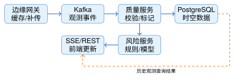
<figcaption>图 8.5  监测数据接入、质量检查与展示流水线</figcaption>
</figure>

业务、权限和工单数据存在PostgreSQL里，PostGIS保存空间点、工程范围和影响区，TimescaleDB扩展管理时序分块。三类数据在同一个数据库里，共用一套事务和备份，按测点追溯证据时不需要跨库。Redis只放可以从数据库重建的缓存，丢了不影响数据完整。

Kafka事件至少包含`eventId`、`assetId`、`occurredAt`和版本号，`traceId`放在消息头里；配套工程的`ReadingEvent.java`就是这样定义的。消费者按`eventId`去重，写库成功后再提交消费位置。数据库事务管不到消息系统：写库和发消息之间靠事务发件箱衔接（5.7节），一次本地事务覆盖不了所有服务。

本章核心路线用的是教学接口，不经过Kafka和Redis。这一小节是为读完整后端代码准备的背景。

## 8.4 智能分析、预警与业务闭环

**本节层次**

核心：8.4.1、8.4.2；拓展：8.4.3。

**进入本节所需知识**

8.1节的接口契约和8.3.2节的质量检查；能在终端里运行`node`和`npm`命令。

### 8.4.1 蓝黄橙红四级预警

预警分蓝、黄、橙、红四级，另用`NONE`表示当前规则下没有触发预警。表8.9列出各级的含义、最小处置要求和页面上的表达方式。表里“无预警”和“未评估”是两行：前者表示规则算过、没有触发；后者表示数据质量不够，没有做出判定。缺测的测点如果显示成“无预警”，值班员会以为它一切正常，所以两者在页面上必须分得开。

**表 8.9  统一预警等级与处置要求**

| 等级   | 含义                   | 最小处置                     | 系统表达                 |
|:-------|:-----------------------|:-----------------------------|:-------------------------|
| 无预警 | 当前规则下未触发预警   | 保持监测，保留质量与规则版本 | `NONE`+正常状态 /文字    |
| 未评估 | 数据质量不足以支撑判定 | 复核质量，补齐证据后重算     | `evaluable=``false`+原因 |
| 蓝色   | 指标出现需关注变化     | 值班员确认，检查数据质量     | 蓝色+信息图标+文字       |
| 黄色   | 多指标或趋势提示异常   | 专业复核，创建工单           | 黄色+三角形+时限         |
| 橙色   | 风险增大，需要会商     | 启动会商，评估预案           | 橙色+高亮+责任人         |
| 红色   | 高风险或紧急状态       | 按批准规程处置并持续跟踪     | 红色+警示+审批链         |

定级的依据是一个综合评分 $$S=\sum_{i=1}^{n} w_i f_i,\qquad
w_i\ge 0,\quad \sum_{i=1}^{n}w_i=1,$$ 其中$f_i$是归一化到0至1之间的指标，例如渗压相对于历史同水位值的偏离程度、近三天的上升速率；$w_i$是经过批准的权重。评分是风险证据，它不会自己变成控制命令：定到哪一级、采取什么措施，还要结合工况、数据质量和专业判断。

本案例的四个分界是0.30、0.50、0.70和0.85，下界闭、上界开：$0.30\le S<0.50$为蓝色，$0.50\le S<0.70$为黄色，$0.70\le S<0.85$为橙色，$S\ge0.85$为红色，$S<0.30$为无预警。配套数据集`warnings.json`中四条样例的评分0.36、0.58、0.74、0.92各落在一级之内，其中PZ-07是0.58，黄色。这组分界是教学用值。实际工程的阈值依据工程规程、监测设计和批准的模型确定，并且要版本化，记录适用工程、工况、审批人和生效时间。

定级函数在配套工程的`frontend/src/lesson84/classify.js`里，清单8.20摘出其中的`classify`。函数返回三个值：`evaluable`（能不能评估）、`level`（等级）和`reason`（给人看的原因）。判断顺序是先看质量码，再看评分是不是有限数，最后才比较分界。`suspect`和`missing`在第一步就返回“未评估”，评分是0.90也一样。

**清单 8.20  classify.js 中的定级函数（节选）**

```javascript
export const THRESHOLDS = [
  [0.85, WarningLevel.RED],
  [0.70, WarningLevel.ORANGE],
  [0.50, WarningLevel.YELLOW],
  [0.30, WarningLevel.BLUE],
];
export const SCORABLE = { valid: true, suspect: false, missing: false };

export function classify(scoreValue, quality) {
  if (!Object.hasOwn(SCORABLE, quality)) {
    return { evaluable: false, level: WarningLevel.NONE, reason: `未评估：未知质量码 ${quality}` };
  }
  if (!SCORABLE[quality]) {
    const why = quality === 'missing' ? '记录缺测' : '数值存疑，仅供复核';
    return { evaluable: false, level: WarningLevel.NONE, reason: `未评估：${why}` };
  }
  if (!Number.isFinite(scoreValue)) {
    return { evaluable: false, level: WarningLevel.NONE, reason: '未评估：没有可用的综合评分' };
  }
  for (const [bound, level] of THRESHOLDS) {
    if (scoreValue >= bound) {
      return { evaluable: true, level, reason: `${LEVEL_TEXT[level]}：综合评分 ${scoreValue.toFixed(2)}` };
    }
  }
  return { evaluable: true, level: WarningLevel.NONE, reason: '无预警' };
}
```

同一文件里的`score`函数计算$S$。权重个数不对、出现负数或者和不等于1时，它抛出错误，不会悄悄把权重归一化。理由是：错误的权重会让评分整体偏移，而偏移之后的数看上去仍然像一个正常的分数，很难被发现。

**运行与观察**

在`frontend/`下执行`npm test`，其中`tests/lesson84.test.js`的28个用例应全部通过。它们检查四件事：四条样例评分各自落在正确的等级；边界值0.2999为无预警，0.30为蓝色，0.85为红色；`suspect`、`missing`和未知质量码一律未评估；非法权重被拒绝。

**故障练习**

把`SCORABLE`里的`suspect`改成`true`再运行测试。“高分但可疑 → 未评估”这个用例会失败，失败信息显示`evaluable`得到`true`。这正是要避免的情形：一支接触不良的渗压计不断送来跳变的读数，系统连续发出预警，值班员很快学会忽略这个测点；等它真的出现趋势性变化，也没有人再看了。记录失败输出，然后改回。

后端要遵守同一口径。清单8.21是Java一侧的三个单元测试，测的是清单8.2里的`classify`；`lesson84.test.js`的前三个用例与它们一一对应。低分且有效是“无预警”，0.30且有效是蓝色，高分但可疑是“未评估”。

**清单 8.21  质量码分类测试**

```java
import static org.junit.jupiter.api.Assertions.assertEquals;
import static org.junit.jupiter.api.Assertions.assertFalse;
import static org.junit.jupiter.api.Assertions.assertTrue;

import java.time.Clock;
import org.junit.jupiter.api.Test;

public final class QualityClassificationTest {
    private final QualityService service = new QualityService(
        (item, unit) -> true,
        reading -> false,
        Clock.systemUTC());

    @Test
    void validLowScoreMeansNoWarning() {
        QualityService.Classification result =
            service.classify(0.01, "valid");

        assertTrue(result.evaluable());
        assertEquals(QualityService.WarningLevel.NONE, result.level());
        assertEquals("无预警", result.reason());
    }

    @Test
    void validAttentionScoreMeansBlue() {
        QualityService.Classification result =
            service.classify(0.30, "valid");

        assertTrue(result.evaluable());
        assertEquals(QualityService.WarningLevel.BLUE, result.level());
        assertTrue(result.reason().contains("蓝色"));
    }

    @Test
    void SuspectHighScoreMeansNotEvaluated() {
        QualityService.Classification result =
            service.classify(0.90, "suspect");

        assertFalse(result.evaluable());
        assertEquals(QualityService.WarningLevel.NONE, result.level());
        assertTrue(result.reason().startsWith("未评估"));
    }
}
```

质量码怎样影响下游，统一按表8.10处理。可疑记录保留原值供追溯和复核，不进入评分；缺测记录让过程线断开，进入补测或数据修复流程。

**表 8.10  质量码到下游处理的统一口径**

| 质量码    | 含义                                         | 是否参与打分 | 界面表现                                 | 是否计入统计     |
|:----------|:---------------------------------------------|:-------------|:-----------------------------------------|:-----------------|
| `valid`   | 格式、单位、范围、时序和重复检查通过         | 是           | 正常颜色映射，可显示`NONE`或蓝黄橙红预警 | 是               |
| `suspect` | 存在单位、范围、时序或重复问题，数值仅供复核 | 否           | 保留原值并加“可疑”标记，提示复核         | 否，单列质量统计 |
| `missing` | 测点缺测或记录没有可用值                     | 否           | 过程线断点、灰色缺测标记，提示补测       | 否，计入缺测率   |

### 8.4.2 从预警到工单与复盘

这一小节在教学接口上把PZ-07的处置走一遍。预警和工单各有自己的状态，图8.6画出正常路径：值班员确认预警，随后派单；运维员处理完提交处置结果；服务检查关联工单已经完成，再关闭预警。图上没有从“待确认”直接到工单的箭头，也没有从“已确认”直接到“已关闭”的箭头。教学接口在派单之后、工单完成之前把预警标为`assigned`，对应图中“已确认”到“已关闭”之间工单在办的阶段。

<figure markdown>
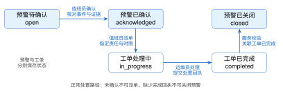
<figcaption>图 8.6  预警与工单的受控状态流转</figcaption>
</figure>

**第一步：启动并登录**

从`companion/water-platform-demo`目录运行教学接口`node teaching-api/server.mjs`，另开一个终端，按清单8.22的顺序发请求。第一条命令登录，应答里的`accessToken`在后面每个请求里都要用到；把它存进变量`H`，后面的命令用`-H "$H"`带上。Windows上可以改用第4章的浏览器控制台`fetch`写法，请求内容相同。

**清单 8.22  PZ-07 处置七步的请求命令**

```bash
# 第一步：登录，把应答中的 accessToken 填到下一行
curl -s -X POST localhost:8080/api/auth/login \
  -H 'Content-Type: application/json' \
  -d '{"username":"duty01","password":"duty123"}'
H="Authorization: Bearer <accessToken>"
J='Content-Type: application/json'

# 第二步：查 PZ-07 的最新观测
curl -s -H "$H" localhost:8080/api/assets/DAM-A-PZ-07/readings/latest
# 第三步：看这个测点的预警
curl -s -H "$H" 'localhost:8080/api/warnings?assetId=DAM-A-PZ-07'
# 第四步：重复确认；再对未评估事件 w-0005 试一次
curl -s -i -X POST -H "$H" localhost:8080/api/warnings/w-0002/ack
curl -s -i -X POST -H "$H" localhost:8080/api/warnings/w-0005/ack
# 第五步：派单
curl -s -i -X POST -H "$H" -H "$J" localhost:8080/api/work-orders \
  -d '{"warningId":"w-0002","ownerRole":"运维员",
       "dueAt":"2026-07-06T12:00:00+08:00",
       "action":"现场核查渗压计PZ-07"}'
# 第六步：先不带处置结果，再带上结果
curl -s -i -X POST -H "$H" -H "$J" \
  localhost:8080/api/work-orders/wo-0001/complete -d '{}'
curl -s -i -X POST -H "$H" -H "$J" \
  localhost:8080/api/work-orders/wo-0001/complete \
  -d '{"result":"现场检查未见渗漏，传感器重新标定"}'
# 第七步：回查，命令同第三步
```

**第二步：查观测，看质量码**

得到`value`为185.091、`unit`为kPa、`quality`为`valid`、`eventId`为`evt-pz-0287-6`的一条观测。质量码是`valid`，这条数据可以参与定级。

**第三步：看预警**

返回一条预警`w-0002`：`level`为`YELLOW`，`evaluable`为`true`，`score`为0.58，`reason`是“渗压趋势超过黄色阈值”，`status`是`acknowledged`。也就是说，上一班的值班员已经确认过它，还没有派单。按表8.9，黄色预警的最小处置是专业复核并创建工单。

**第四步：重复确认会怎样**

你接班后不知道同事已经确认，又点了一次。应答是`409 Conflict`，错误体为`{"code":"ILLEGAL_TRANSITION","message":"状态 acknowledged 不允许确认"}`。预警没有被确认第二次，页面据此刷新，显示当前状态。对缺测产生的事件`w-0005`确认，得到409和`NOT_EVALUABLE`：未评估的事件要先解决数据质量问题，谈不上确认。

**第五步：派单**

应答`201 Created`，`Location`头是`/api/work-orders/wo-0001`，应答体里`status`为`in_progress`。此时再查预警，`w-0002`的状态是`assigned`。四个字段缺任何一个都得到400，错误体的`field`指出缺的是哪一个。如果对一条还是`open`的预警派单，得到409：必须先确认。

**第六步：完成工单**

不带处置结果的请求得到400，`code`为`FIELD_REQUIRED`，`field`为`result`。“已处理”三个字算不上处置结果；结果要写明看到了什么、做了什么。带上结果再提交，得到200，`status`为`completed`，并带有`completedAt`。同样的请求再发一次，得到409：工单状态已经不是`in_progress`，不能重复完成。

**第七步：回查**

重复第三步的查询，`w-0002`的`status`已经是`closed`。从这条预警出发，能找到测点`DAM-A-PZ-07`、触发时的评分和原因，再经工单`wo-0001`找到责任角色、时限、处置结果和完成时间。接了数据库的完整后端用8.3.4节清单8.12做同样的回查。

**用脚本核对整条链**

重启教学接口（它的状态保存在内存里，重启即恢复初始数据），然后运行`node teaching-api/closeloop-check.mjs http://localhost:8080`。脚本打印20行以`OK`开头的检查项，最后一行是“第8章闭环 @ http://localhost:8080：通过 20，失败 0”。它选第一条待确认的可评估预警`w-0001`走完确认、派单、完成和归档，并检查几条受控约束：未评估的事件不能确认，没确认不能派单，重复确认被拒绝，缺字段被拒绝，已完成的工单不能重复完成。图8.7是这一过程四个关键应答的记录。

<figure markdown>
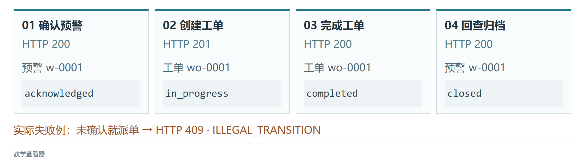
<figcaption>图 8.7  预警与工单状态的实际响应（教学查看器，配套教学接口）</figcaption>
</figure>

**谁能做什么**

上面用的是值班员账号。按表8.2，值班员确认预警、发起工单；专业分析员复核数据和模型结果，提出建议；运维员处理设备并提交处置结果；高风险处置由审批人确认。预警被合并或抑制时，同样要留下操作者和理由。平台给出的评分和等级是依据，确认、派单和关闭每一步都由有权限的人来做；案例止于信息流程，不向任何闸门或设备下发控制指令。

**复盘**

事件关闭后，把“预警发出的时刻、确认的时刻、派单的时刻、完成的时刻”排成时间线，可以算出确认时延和处置时延；再看处置结果：这一次是传感器需要重新标定。如果同一测点反复因为传感器问题触发预警，该改进的是质量检查规则或设备维护计划，不是预警阈值。复盘结论回到图8.1的虚线上，用来改进规则和模型。

**自测**

（1）`w-0005`的`level`是`NONE`，页面应当显示什么？（2）第五步如果因为网络超时没有收到应答，能不能让程序自动重发？答案要点：（1）“未评估”及原因“缺测导致未评估”，不能显示“无预警”；（2）不能，派单每成功一次就多一张工单，应先查询该预警的状态是否已变为`assigned`，再决定是否重发。

### 8.4.3 模型可信度与人在回路

模型卡记录身份、适用范围、输入输出、校准数据、误差、不确定性、负责人、版本和回滚方法。模型输入超出适用范围或数据质量不足时，平台降低可信等级或停止计算，并把原因显示出来；这时给出一个小数位很多的结果，比不给结果更危险。 表8.11给出本章模型卡的最小模板。九个字段共同说明计算的复现条件和审批所需依据。模型名称和版本用于定位实现，适用范围与输入单位用于阻止越界调用，校准数据与误差指标用于说明可信度，不确定性和负责人用于安排人工复核，回滚方法用于在新版本异常时恢复上一版本。练习时填写一张完整的模型卡，并为每个字段注明来源。闸门泄流和水量平衡的两道计算题放在8.5.5节和8.5.11节的公式之后。

**表 8.11  案例水库模型卡模板**

| 字段       | 必填内容                       | 验收证据           |
|:-----------|:-------------------------------|:-------------------|
| 身份与版本 | 模型名称、版本号、代码提交号   | 可追溯构建产物     |
| 适用范围   | 水位、降雨、流量、时间步长边界 | 输入契约与越界测试 |
| 输入输出   | 字段、单位、坐标、时间基准     | 数据字典与样例     |
| 校准数据   | 时段、样本来源、清洗规则       | 数据快照与质量报告 |
| 误差指标   | 指标定义、统计区间、基准值     | 复核脚本与结果     |
| 不确定性   | 参数敏感性、置信区间、缺测影响 | 风险说明与情景结果 |
| 责任与审批 | 负责人、复核人、审批有效期     | 操作记录与电子签名 |
| 发布与回滚 | 发布条件、兼容性、回退版本     | 发布单与回滚演练   |
| 证据链接   | 日志、输入快照、输出清单位置   | 校验和与对象版本   |

模型卡与场景版本、输入快照和人工审批绑定。只要改变初始水位、降雨情景、闸门约束或模型版本，就创建新的运行记录；只改变镜头和图层透明度，不产生新的计算版本。页面显示结果时同时显示“模拟”标签、模型版本和计算时刻，避免把预演动画误认为已经发生的观测。

#### 8.4.3.1 水位包络、预警分级与参数一致性

特征水位把降雨情景和预警处置连接起来。正常蓄水位168.0 m是日常运行参照，汛限水位165.5 m用于汛期调度，设计洪水位170.2 m对应P=1%，校核洪水位171.6 m对应P=0.1%。水位达到设计洪水位时，定哪一级预警还要结合变化速率、闸门状态、下游影响和数据质量来判断；超过校核洪水位时，平台触发人工会商，处置按工程规程进行。

坝基120.0 m到坝顶172.0 m的高差为52.0 m，与案例的坝高自洽；防浪墙顶173.2 m提供坝顶以上1.2 m的防护余高。死水位148.0 m与闸底高程152.0 m不冲突：闸门用于泄洪时仍需依据上游水位和下游边界判断，不能把死水位直接当作闸前水头。数据库、三维标注、图表和习题里的水位都取自表8.1。

#### 8.4.3.2 参数版本与边界测试

特征水位和闸门参数进入程序时，要变成带版本的参数集：接口返回参数集的版本和生效时间，每次计算把用到的参数连同输入一起存进快照。这样审批人看到一个方案时，能确认它用的是哪一组水位和闸门参数；以后换了水力模型，审计人员仍能按旧版本重现当时的计算。

测试数据取在边界附近。水位取死水位、汛限水位、正常蓄水位、设计洪水位和校核洪水位各自“略低、相等、略高”三个点；闸门开度取最小、最大以及超过上限的值；再加上设备离线和下游淹没两种工况。失败的用例要写明原因属于哪一类：水位越界、公式不适用、设备状态不允许，还是权限不足。接口拒绝越界参数时，返回字段名、参数版本和建议动作，页面把它显示给专业人员。

降雨情景同理。三种降雨情景共用同一组初始水位和闸门参数，只改变降雨过程；输出的水位包络线标注情景名、时间步长和模型版本。流域面积320 km$^2$用来判断输入范围和解释结果是否合理，不能直接当作瞬时来水量。情景结果超过校核洪水位时，平台先生成会商任务，再由专业人员比较提前泄洪、维持水位和分时调度等方案。

**人在回路**

专业人员参与目标设定、边界条件检查、方案比选、审批和效果复核。模型和规则的输出一律先经人工确认，再进入下一步；红色预警和高风险调度建议由授权角色按工程规程处置。本书案例的口径到“模拟建议”为止，不驱动真实闸门。

## 8.5 数字孪生水利平台案例

**本节层次**

拓展：8.5.1、8.5.2、8.5.3、8.5.4、8.5.5、8.5.6、8.5.7、8.5.8、8.5.9、8.5.10、8.5.11、8.5.12、8.5.13、8.5.14、8.5.15。

**进入本节所需知识**

8.1节的案例参数和8.4节的预警与工单；6.4节的数字孪生架构概览。水文、水动力模型的机理不在本节范围内，由相应专业课程讲授。

!!! note "说明"

    **数字孪生拓展篇（选读）**

    本节是独立的选读内容，前四节不依赖它。它建立在已经运行的监测平台之上：对象编码、质量码、四级预警和工单处置在这里继续使用。选做本节的小组交付一个带模型卡、输入快照和人工审批记录的预演场景。课时有限时，读8.5.1和8.5.2两小节了解概念边界，其余在课程设计时查阅。

### 8.5.1 案例来源、边界与建设目标

本节参考北京五一视界数字孪生科技股份有限公司提供的《51WIM数字孪生水利平台V1.0（DEMO）使用说明手册》[^1]，对其流域、水网和水利工程功能进行教学化重组<sup>[[61]](../../references.md#ref61)</sup>。本节示意图均按功能链路重新绘制；另经该公司书面授权，选用六幅平台界面截图（图8.8至图8.22），供读者对照真实产品的界面组织方式。手册中的水位、流量和场景名称属于演示环境，不作为真实工程结论。

水利部关于智慧水利建设的指导文件把预报、预警、预演、预案（简称“四预”）作为面向业务闭环的能力组合，要求建设围绕数据、模型、知识和业务协同展开<sup>[[2]](../../references.md#ref2)[[6]](../../references.md#ref6)</sup>。面向水库、水闸和蓄滞洪区的数字孪生运行管理指导意见进一步强调对象底账、运行场景、模型服务和过程留痕的衔接<sup>[[4]](../../references.md#ref4)</sup>。看一个产品时，就按这四条检查：对象底账全不全，模型输入能不能追溯，方案有没有经过审批，执行回执能不能对到批准的那个版本。

前四节的安全监测平台回答“现在是否异常、谁来处置”；数字孪生平台还要回答“接下来可能怎样、不同方案后果如何、准备什么预案”。多出来的这部分由数据底板、模型平台、场景服务，以及预报、会商、审批和执行流程共同支撑。

表8.12把流域、水网、工程三类入口的关注对象与典型任务并列。三者共享同一套底板与编码，区别在于聚合粒度：同一座水库在工程入口是完整的坝体与测点集合，在流域入口只是节点上的一组进出库流量。

图8.8是平台一体化门户的实际界面。三个入口卡片与表8.12的三类业务视角一一对应；从任一入口进去看到的都是同一套数据底板，只是聚合粒度和默认视图不同。入口按流域、水网和工程组织，用户从自己管的业务对象进入相应的分析视图。

<figure markdown>
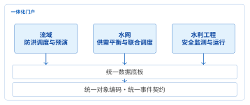
<figcaption>图 8.8  51WIM数字孪生水利平台一体化门户：流域、水网、水利工程三类业务入口（教学示意图，界面布局据51WIM产品重绘；产品截图经授权仅刊于纸质版）</figcaption>
</figure>

**表 8.12  数字孪生水利平台的三类业务入口**

| 入口     | 核心对象                             | 典型任务                           |
|:---------|:-------------------------------------|:-----------------------------------|
| 流域     | 河网、降雨、洪水过程、受影响对象     | 洪水预报、淹没预演、风险空间分析   |
| 水网     | 水源、输配水工程、需水单元、调度规则 | 供需平衡、联合调度、应急供水       |
| 水利工程 | 水库、闸门、泵站、堤防、监测点       | 工程安全、闸门推演、预案与运行复盘 |

图8.9把这种共享关系画了出来：三类入口各有界面，但底板、对象编码和事件契约只有一套。如果三个入口各自维护一份工程台账，同一座水库的名称、编码和特征水位很快就会出现三个版本。

<figure markdown>
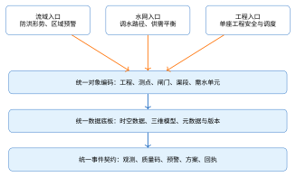
<figcaption>图 8.9  流域、水网、工程三类入口共享同一套编码、底板与事件契约</figcaption>
</figure>

平台建设目标写成可以验收的句子，例如“给定降雨情景后生成带版本的洪水过程与淹没结果”“给定目标泄流量后返回可解释的闸门方案并经人工确认”，每一句配上输入条件、交付形式和验收方法。

### 8.5.2 防台防洪预演的输入与输出

防台防洪预演从场景定义开始。用户选择历史台风或自定义降雨，设置累计降雨、持续时间、雨型和初始水位；模型平台生成流域产汇流与洪水过程，水动力模型计算淹没范围和时序，空间分析服务统计受影响建筑、道路和重点对象。

图8.10是预演所依托的数字孪生流域总览界面：三维地形场景常驻页面底层，雨水情、水库蓄水和预警信息以浮层面板覆盖在两侧，布局与第7章的监测页面同理。预演的输入与输出先在总览视图里按工程对象定位，再从相应面板看数值、方案和计算结果。

<figure markdown>
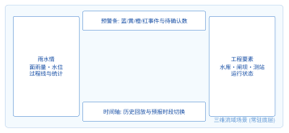
<figcaption>图 8.10  数字孪生流域总览：三维场景常驻底层，雨水情与工程要素以浮层面板覆盖（教学示意图，界面布局据51WIM产品重绘；产品截图经授权仅刊于纸质版）</figcaption>
</figure>

表8.13把这些输入固化为场景契约。契约化的意义在于可复现：只要契约字段完全相同，两次预演就应当得到相同结果；结果不同时，先查契约里哪一项被改动过，而不是先怀疑模型。

**表 8.13  防台防洪预演场景契约**

| 字段组   | 主要内容                          | 校验要求                 |
|:---------|:----------------------------------|:-------------------------|
| 场景身份 | scenarioId、名称、创建人、版本    | 不可用显示名称代替稳定ID |
| 气象输入 | 累计降雨、时长、雨型、空间分布    | 单位、时间基准与来源完整 |
| 水文初值 | 前期雨量、土壤状态、河道/水库水位 | 对应同一事件时间快照     |
| 模型配置 | 模型版本、参数集、网格与时间步长  | 在模型卡适用范围内       |
| 输出     | 洪水过程、淹没深度/时刻、风险对象 | 带质量与不确定性说明     |

图8.11给出从降雨输入到预案比选的计算与反馈链。降雨误差、模型参数和地形分辨率会共同影响淹没结果；不同模型还可能放大或削弱某些误差，需要用敏感性分析或集合情景评估。

<figure markdown>
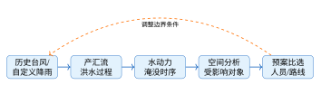
<figcaption>图 8.11  防台防洪预演的计算与反馈链</figcaption>
</figure>

手册里的历史台风和自定义降雨两项功能，一个是场景复用，一个是参数试验。课程不要求复现某场台风的结论，要求的是说清楚：哪些输入来自观测，哪些是人设定的，哪些由模型推算，结果在什么条件下有效。

预演时间轴从$T+0$推进到$T+24\,h$，每个时刻保存水位、流量、淹没深度和影响对象的快照。播放只是浏览结果的方式，模型版本和计算日志另存。用户改了雨型，系统新建一个场景版本，上一轮结果保留。

### 8.5.3 淹没影响、疏散路线与证据链

空间分析把淹没栅格与建筑、道路、学校、医院和避险点叠加。判定哪些对象受影响时，记下空间数据版本、阈值和分析时间。疏散路线除了短，还要避开预计淹没的路段、容量不够的道路和已封闭的区域。

图8.12展示淹没仿真的空间结果与时间轴，右侧面板是情景选择和淹没分析入口，左侧保留水资源调度信息。看颜色分布时对照图例、所选情景和预演时刻；要复核计算，还得有对应的输入快照、模型版本与空间数据版本。

<figure markdown>
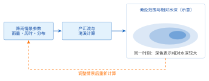
<figcaption>图 8.12  淹没仿真预演的空间结果、情景选择与时间轴（教学示意图，界面布局据51WIM产品重绘；产品截图经授权仅刊于纸质版）</figcaption>
</figure>

表8.14列出淹没影响分析要留存的证据项。少了“空间数据版本”这一项，同一场预演半年后重跑可能得到不同的受影响对象清单，因为底图里的建筑和道路更新了。

**表 8.14  淹没影响分析的证据项**

| 证据     | 内容                           | 复核问题                   |
|:---------|:-------------------------------|:---------------------------|
| 输入快照 | 降雨、水位、边界条件、地形版本 | 是否来自同一场景与时间基准 |
| 模型证据 | 模型卡、参数集、计算日志、残差 | 是否超出适用范围           |
| 空间证据 | 淹没深度、到达时间、对象清单   | 坐标与数据版本是否一致     |
| 路线证据 | 起终点、禁行区、容量、备选路线 | 约束变化后是否重新计算     |
| 人工结论 | 采纳方案、责任人、理由、有效期 | 是否按权限审批             |

结果界面同时提供三维淹没播放、二维专题图、对象列表和表格导出。三维场景便于理解空间关系，表格便于核对数量和属性；其中一种坏了，其余几种还能支撑基本研判。

图8.13把从情景输入到执行归档的证据串成一条链。这张图主要用于排查：会商结论受到质疑时沿链逐段回放，可以定位分歧究竟出在输入设定、模型版本、空间叠加还是人工判断上。

<figure markdown>
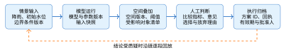
<figcaption>图 8.13  从情景输入到执行归档的证据链及其回放方向</figcaption>
</figure>

### 8.5.4 数字孪生水库矩阵与“四预”

水库矩阵把多个水库的实时水位、入库流量、出库流量、库容、闸门状态和预警放在统一视图中，支持按流域、行政区和风险等级筛选。矩阵里的每一行都能进入该水库的三维场景、模型运行记录、预演方案和预案。

图8.14展示了从矩阵下钻到单座水库后的工程安全视图：左上角给出安全性态综合评分，坝体以网格高亮标出评估范围，左侧同屏呈现预报预警面板。评分只是入口，点开每一项都能追到测点数据、模型版本和评估依据。

<figure markdown>
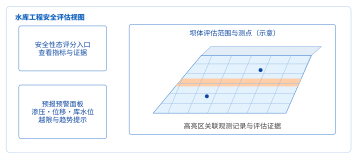
<figcaption>图 8.14  水库工程安全评估视图：安全性态评分、坝体评估范围与预报预警面板同屏（教学示意图，界面布局据51WIM产品重绘；产品截图经授权仅刊于纸质版）</figcaption>
</figure>

表8.15把安全监测平台与“四预”能力逐项对照。差别在时间方向上：监测回答已经发生了什么，四预回答接下来可能发生什么、不同处置各有什么后果。后者需要模型、场景版本和预案库，给监测页面加一个三维视图得不到它。

**表 8.15  安全监测与“四预”能力的差异**

| 能力 | 安全监测平台             | 数字孪生“四预”扩展                   |
|:-----|:-------------------------|:-------------------------------------|
| 预报 | 当前值与趋势外推         | 多源输入、模型运行与不确定性         |
| 预警 | 阈值/规则触发告警        | 结合预报结果和影响范围分级           |
| 预演 | 通常不具备或只看历史回放 | 改变边界条件，比较多套方案后果       |
| 预案 | 文档查询与工单处置       | 把责任、资源、路线和控制条件绑定场景 |

“四预”不是四个孤立菜单。预报产生未来状态，预警识别需要关注的风险，预演比较方案后果，预案把选择转化为责任、资源和动作；处置效果再反馈到数据与模型。公开的数字孪生黄河建设实践显示，跨流域平台需要把基础数据、模型计算、场景服务和治理流程组织成可持续运行的体系<sup>[[62]](../../references.md#ref62)</sup>。本节的水库矩阵沿用这一思路，编码、接口和阈值使用8.1节的参数表。

**不同技术路线对比**

数字孪生平台的建设大致有四种起点。产品集成路线以厂商平台为基础，先把流域、水网和工程入口组织成统一门户，再接入模型运行、预演任务和工单；业务人员容易按场景进入系统，但产品里的对象编码、质量规则和模型适用范围要由项目团队重新核验，手册中的演示数据不能当作工程数据。标准与数据底板路线先确定对象目录、时空基准、交换协议和版本规则，再把不同厂商、不同专业的模型作为可替换的服务接入；它有利于长期积累和跨系统交换，前期在目录治理和接口设计上的投入也更大。流域治理路线强调跨工程的联合预报、影响分析和调度协同，要解决数据范围大、模型链条长、多部门协作的问题，验收时检查的是情景输入、模型版本、结果证据和处置回执能否连成一条链。项目定制路线围绕某一类水库、水闸或河段的规程来构建，贴合现场，但要留出清楚的扩展点，避免把一次性的约定固化下来。

四种路线可以组合：厂商方案提供一种实现参考，公开政策和行业样本给出业务边界，标准化底板提供交换约束，项目规则把模型结果变成可审批、可追溯的行动。这里比较路线，是为了练习方案选择和证据核验，不是评价某个产品。

图8.15把预报、预警、预演、预案连成闭环，并标出四者之间的触发关系：预报驱动预警，预警触发预演，预演结果落到预案，预案执行后的实况又回到预报作为校正输入。

<figure markdown>
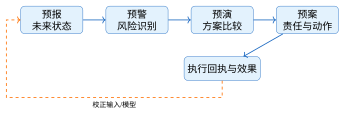
<figcaption>图 8.15  预报、预警、预演、预案的业务闭环</figcaption>
</figure>

### 8.5.5 闸门调度正算、反算与方案约束

闸门正算回答“给定开度会产生多大泄流”，反算回答“给定目标泄流应采用怎样的闸门组合”。下面用简化的孔流关系说明接口的输入和输出；真实工程的泄流计算使用经过批准的水力曲线，简化式只用于教学：

$$Q=C_d\,b\,a\sqrt{2gH},$$

其中$C_d$为流量系数，弧形闸门教学取值范围为$0.55\le C_d\le0.75$；$b$为单孔宽度，$a$为开度，$H$为自闸底板起算的闸前总水头，包含行近流速水头。这个简化式只在闸孔出流（水流从闸门下方孔口射出）且$a/H<0.65$时成立；开度再大，水流已经接近漫过堰顶，要改用堰流公式或经批准的工程曲线。下游水位抬高、影响出流时叫淹没出流，公式里再乘一个淹没系数$\sigma$：$Q=\sigma C_dba\sqrt{2gH}$。真实计算还要考虑闸孔数量、启闭约束、下游水位和设备状态。

图8.16展示闸门设施、溢洪道水流和预演面板。看一帧画面判断不了开度与泄量是否匹配，也看不出产品用的是哪种水力算法。自己实现教学预演时，把开度、泄量、方案版本和时刻绑到同一份计算结果上，再检查数值与动画是否一致。

<figure markdown>
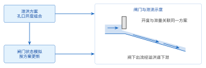
<figcaption>图 8.16  泄洪方案预演界面：闸门设施、溢洪道水流与业务面板（教学示意图，界面布局据51WIM产品重绘；产品截图经授权仅刊于纸质版）</figcaption>
</figure>

表8.16把闸门调度算法的输入、输出与约束写成接口契约。约束写进契约而不是只写在文档里，越界调用就在接口层被拒绝：开度超过设备上限，或者目标泄流对应的水头已经不在公式适用范围内，请求根本进不了计算。

**表 8.16  闸门调度算法接口的最小契约**

| 字段组   | 内容                             | 验证要求                 |
|:---------|:---------------------------------|:-------------------------|
| 工程参数 | 闸孔数、宽度、底高程、开度上下限 | 来自版本化工程档案       |
| 水力参数 | 上下游水位、流量系数、约束曲线   | 单位与适用范围明确       |
| 目标     | 目标泄流、允许偏差、计算时段     | 与调度任务和有效期关联   |
| 输出     | 每孔推荐开度、预测流量、约束余量 | 提供可解释依据和备选方案 |
| 控制边界 | 审批、设备状态、变化速率、回滚   | 算法无权绕过工程规程     |

反算可能有多组可行解，平台按安全约束、均衡启闭、设备可用性和操作次数排序后全部列出，不只给一个“最优值”。专业分析员可以锁定某几扇闸门或改目标，系统新建一个方案版本重新计算。

图8.17把闸门方案从反算、排序、人工调整到模拟回执的过程画成受控链路。图中每一次人工修改都会分出新的方案版本而原方案保留，这样会商时才能把几组方案并排比较，而不是只剩最后一次修改的结果。

<figure markdown>
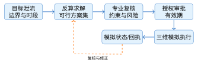
<figcaption>图 8.17  闸门方案从反算到模拟回执的受控流程</figcaption>
</figure>

三维联动展示闸门开度、水流演进和水位变化，动画标上“模拟”。模型没算完或结果已失效时，界面停止播放上一方案，否则用户会把旧动画当成当前计算。

#### 8.5.5.1 闸门公式的代入与反算边界

案例水库的三孔弧形闸门参数来自表8.1。以单孔净宽$b=8.0\,m$、开度$a=3.0\,m$、闸底高程152.0 m为例，若闸前水位168.0 m且行近流速水头暂取0.2 m，则$H=16.2\,m$。取教学系数$C_d=0.65$（弧形闸门常用范围约0.6～0.7）。$a/H=0.185<0.65$满足闸孔出流（孔流）判别条件；题设下游水位低于闸底板，属自由出流。单孔估算流量为$Q_1=0.65\times8.0\times3.0\times\sqrt{2\times9.81\times16.2}\approx278\,m^3/s$，三孔同步开度的估算总量约为$834\,m^3/s$。该数值只用于接口和量纲教学，真实工程必须由批准的水力曲线、上下游水位和淹没系数复核。

下游水位抬高、可能出现淹没出流时，平台先按下游水位与收缩断面水深的关系判断自由出流是否失效，再用带$\sigma$的公式或转交工程曲线服务。$C_d$不能为了凑出目标流量而调到范围之外。反算接口返回每孔开度、预测流量、约束余量、采用的公式版本和适用性结论；多个组合都满足偏差时，按均衡启闭、设备可用性和操作次数排序，由专业分析员选。

#### 8.5.5.2 计算题：目标泄流的开度组合

给定表8.1中的3孔闸门，闸前水位168.0 m、闸底152.0 m，下游水位低于闸底板，满足本题自由出流条件，$C_d=0.65$，目标总泄流量为$1200\,\mathrm{m^3/s}$。先用$a/H<0.65$确认属于闸孔出流，再由题设下游水位条件确认自由出流，然后求三孔相同开度$a$，并说明若求得的开度超过6.0 m应如何处理。答案包括公式、单位换算、近似开度、每孔余量和“需要工程曲线复核”的边界说明。若三孔不同步开启，还要列出至少两组满足目标偏差的组合并比较启闭次数。

按教学简化式，三孔相同开度的反算为$a=Q/(3C_db\sqrt{2gH})$。代入$H=16.0\,m$得到的开度约为4.34 m，低于6.0 m上限，且$a/H\approx0.27<0.65$仍属闸孔出流，可以作为接口层候选；淹没系数、设备死区和下游回水都还没有考虑，所以候选标为“待工程复核”。流域面积320 km$^2$和总库容0.85亿 m$^3$是情景合理性的约束，1200 m$^3$/s是泄洪工况，不是日常运行流量。

### 8.5.6 预警方案预演与角色协同

预警等级沿用8.4.1节的蓝、黄、橙、红四级。预演可选黄色、橙色或红色场景，加载相应的责任人、资源和操作清单；蓝色以值守关注和数据复核为主，一般不演。每次预演记录发起人、场景版本、参与角色、操作时间线和发现的问题。

表8.17按预警等级列出预演的关注点。等级越高，预演越要逐项核对：责任人在不在岗，资源到没到位，操作清单能不能执行。

**表 8.17  不同预警等级的预演关注点**

| 等级 | 预演目标                 | 关键角色                 | 证据                   |
|:-----|:-------------------------|:-------------------------|:-----------------------|
| 黄色 | 验证数据复核和工单响应   | 值班员、专业分析员       | 复核记录、工单时限     |
| 橙色 | 验证会商、资源与方案比选 | 分析员、审批人、运维员   | 多方案、审批与资源清单 |
| 红色 | 验证应急流程与职责衔接   | 指挥、工程、应急协同角色 | 时间线、回执、复盘报告 |

预演可以播放“预警标签—闸门方案—泄洪过程—水位变化—风险对象”的完整动画。课程看的是数据与责任链，不是动画长度：没有输入快照、模型版本和审批记录的动画，当不了决策证据。

### 8.5.7 AI助手驱动的调度会商

AI 助手把自然语言转成查询、页面导航和候选任务，例如“打开防洪预演页面”“查询目标泄流1200 m$^3$/s的闸门方案”“播放某场景的$T+6\,h$淹没结果”。它负责解析意图和编排工具调用，自己没有调度权限。

表8.18划出助手能做和不能做的事。分界线是有没有外部效果：查询、导航、生成候选方案在界内；会改变设备状态或形成正式结论的动作，一律转成待审批命令。

**表 8.18  AI会商助手的请求与控制边界**

| 阶段     | 系统动作                     | 安全控制                         |
|:---------|:-----------------------------|:---------------------------------|
| 意图解析 | 提取工程、场景、时段和目标   | 向用户回显歧义字段               |
| 工具选择 | 查询数据、运行模型、切换镜头 | 只调用白名单接口并校验参数       |
| 结果组织 | 汇总方案、风险和证据链接     | 标注数据龄期、模型版本和不确定性 |
| 建议确认 | 生成候选方案与比较说明       | 必须由专业人员复核               |
| 执行申请 | 创建待审批命令               | 权限、有效期、设备状态与双人审批 |

图8.18把助手放回会商流程中：它位于人与工具之间，负责解析意图并编排调用，但每一条通向执行的路径都要穿过人工审批节点。

<figure markdown>
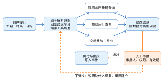
<figcaption>图 8.18  AI会商助手位于人与工具之间，通向执行的每条路径都穿过人工审批</figcaption>
</figure>

AI 的每一条输出都引用数据和模型证据。工具失败、数据过期或权限不足时，助手直说，不用语言模型猜一个填上。语音交互配文本回显，关键数字提交前再确认一次。

### 8.5.8 底板与算法解耦、权限与模拟标注

数据底板、算法服务和模拟结果分别设置访问与操作权限，原则见6.4.14节。高风险动作由授权角色确认，记录执行版本与回滚结果。

能复制到别的工程去的平台，一定是把空间底板、业务数据、模型算法和应用编排分开了的。换洪水模型时，工程模型和用户体系不用重做；新增一座工程时，靠元数据和适配器接入，不是再复制一套源码。

图8.19把四者的解耦关系画了出来。检验解耦是否成立有个简单办法：设想更换洪水模型，数一数需要改动的模块——如果空间底板和用户体系也要跟着改，说明分层只停留在文档里。

<figure markdown>
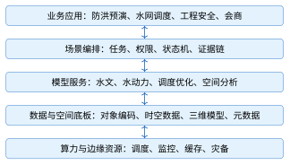
<figcaption>图 8.19  数字孪生水利平台的解耦分层</figcaption>
</figure>

水位、流量和由它们导出的图表都标明数据来源，看的人才分得清哪些是观测记录、哪些是设定的情景、哪些是模型算的。情景输入标明来自观测、设定还是插值，以及时间；模型结果标“模拟”、版本和运行时间；推荐方案标目标、约束、有效期和审批状态；演示数据注明单位并声明不是工程结论；AI 输出附工具证据、生成时间和复核状态。

权限按对象、操作和场景状态三项一起判断：专业分析员能运行模型，不能批准控制；审批人能批准已复核的方案，不能改模型参数；演示账号碰不到真实工程数据。

### 8.5.9 对象编码、时空基线与孪生状态

孪生状态快照把对象编码、观测时刻和质量判定关联起来。按6.4.7节的处理顺序，质量不合格的数据进入隔离或降级流程。

数字孪生先要回答“现实中的对象、业务记录里的对象和三维场景里的对象是不是同一个”。案例水库给大坝、闸门、测点、摄像机、道路和避险点各分配一个稳定编码，业务表、时序数据、空间要素和三维模型都存这个编码。对象改名，编码不变；对象拆分、合并或退役，形成新的版本关系。

孪生状态由两个时刻共同确定：有效时刻是状态在现实中发生的时间，知识时刻是平台知道这个状态的时间。迟到的数据到了以后，系统可以重建过去某一刻的状态，但已经审批过的预演结论不能被悄悄改掉。

表8.19给出孪生对象的最小身份与状态字段，有效时刻和知识时刻同时保存。只存一个时间戳的系统答不出“三小时前我们当时以为水位是多少”，也就解释不了当时为什么那样决定。

**表 8.19  数字孪生对象的最小身份与状态字段**

| 字段组   | 示例字段                             | 设计目的                       |
|:---------|:-------------------------------------|:-------------------------------|
| 稳定身份 | objectId、objectType、parentId       | 贯通业务、时序、空间和三维对象 |
| 空间基线 | crs、geometryVersion、elevationDatum | 防止坐标系和高程基准混用       |
| 状态时间 | validTime、ingestTime、knowledgeTime | 识别实时、迟到和回补数据       |
| 质量证据 | qualityCode、sourceId、calibrationId | 说明状态是否适合进入模型       |
| 版本关系 | version、effectiveFrom、effectiveTo  | 支持工程变更和历史重现         |
| 显示映射 | sceneNodeId、symbolId、lodPolicy     | 将对象状态稳定映射到场景       |

实时视图显示观测状态，预演视图显示场景状态，两者用不同的颜色或边框区分，都显示时间戳。用户从实时视图进入预演时，平台复制一份输入快照；之后的实测数据继续更新实时视图，正在比较的方案不受影响。

图8.20把观测状态、场景快照和推演状态三者分开画出，并标明各自的更新来源。三者混用是预演类平台最常见的错误：实测数据悄悄流进正在比较的方案，会让两个方案失去可比性。

<figure markdown>
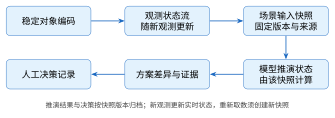
<figcaption>图 8.20  观测状态、场景快照与推演状态的分离</figcaption>
</figure>

课堂上可以故意造一条迟到的水位数据来核验：实时曲线补入这个点并标为回补，已经完成的场景仍引用原输入版本；用户复制场景并明确更新输入以后，新方案才用上回补值。这一个用例同时检验了时间语义、版本管理和审计链。

### 8.5.10 模型任务编排与运行生命周期

模型任务从提交输入到返回结果经历多个状态。任务事件与控制命令按6.4.10节的契约记录幂等键、审批和审计字段，输入快照随任务保存。

模型平台不只是一个“运行”按钮。一次模型任务经历草稿、校验、排队、运行、完成或失败、复核、发布和归档几个状态。每次运行绑定场景版本、输入快照、模型镜像、参数集、算力规格和发起人，所以能复现，两次结果不同时也能解释差在哪。

模型任务的状态机列出各个状态及该状态下允许的动作。状态机的价值恰恰在于禁止某些动作：运行中的任务不允许修改参数，已发布的结果不允许原地覆盖，这些限制正是结果可复现的前提。草稿可编辑和删除，已校验状态检查单位、范围与适用性，排队或运行状态只允许查看日志或授权取消，完成状态核对产物清单与校验和，失败状态记录错误类别与重试次数，已发布状态绑定复核意见、审批人和有效期，归档状态只读查询和复现。

图8.21把这些状态连成受控生命周期，并标出失败与复核两条回路。失败任务保留输入与错误记录，修正原因后再从校验环节发起运行。

<figure markdown>
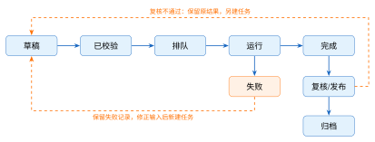
<figcaption>图 8.21  模型任务的受控生命周期</figcaption>
</figure>

运行失败分输入错误、模型错误、资源不足、超时和人工取消五种。只有任务幂等、重试不会造成重复业务影响时，平台才自动重试；参数越界或模型数值不稳定要回到专业分析员手里。成功也不等于可信，完成之后还要检查水量平衡、边界连续性、残差和异常输出。

模型产物用清单管理，包括过程线、栅格、矢量、统计表、日志和预览文件。清单记每个文件的校验和与对象存储版本，页面只读已完成且校验通过的产物。某个栅格上传失败，这次运行就不能标为可发布。

### 8.5.11 数字孪生水网的供需平衡与联合调度

数字孪生水网把水库、取水口、泵站、输水线路、调蓄池和需水单元组织为有方向的网络。节点表达供水、用水和调蓄，边表达输水能力、损耗、能耗和运行状态。平台先计算基准方案，再对枯水、设备停运或需求增加等情景进行方案比较。

图8.22是联合调度的网络拓扑视图：节点表示水库、泵站、水厂与需水单元，连线表达输水链路及其当前流量与能力。这张图与下文的平衡式逐项对应——每个节点就是式中的一项$S_i$、$D_j$或$\Delta V_k$，每条边的损耗计入$L$。拓扑视图的价值在于让平衡核算有了空间落点：缺口出现时能立即回答“缺在哪个节点、卡在哪条边”。

<figure markdown>
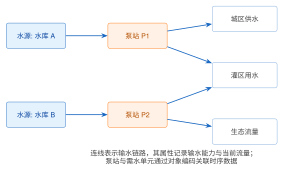
<figcaption>图 8.22  水网联合调度拓扑视图：节点为水源、泵站与需水单元，连线表达输水链路（教学示意图，界面布局据51WIM产品重绘；产品截图经授权仅刊于纸质版）</figcaption>
</figure>

对一个调度时段，可用简化平衡式检查结果： $$\sum_i S_i + \sum_k \Delta V_k
=\sum_j D_j + L + R - U + \varepsilon,$$ 其中$S_i$为各水源供水量，$D_j$为各需水单元申请量，$\Delta V_k$为调蓄补水量（放水为正、蓄水为负），$L$为输水损失，$R$为未分配水量（供大于需时的盈余），$U$为未满足需求量（缺水时的缺口），$\varepsilon$为闭合残差。$R$与$U$至多一项为正，盈余与缺口不会同时出现。缺口$U$是业务事实，残差$\varepsilon$是核算质量，两者分开写：枯水方案允许$U>0$，审批门槛只看$|\varepsilon|$，残差超过阈值的方案说明核算本身有错，进不了审批。式中每一项用同一时段和同一体积单位。

表8.20把水网联合调度的输入、约束与输出整理成清单。约束一列尤其要留意量纲与时段：供水量、需水量与调蓄量落在同一时段、同一体积单位上，否则平衡式看起来成立，实际比的是不同口径的数字。

**表 8.20  水网联合调度的输入、约束与输出**

| 类别     | 内容                                   | 检查重点             |
|:---------|:---------------------------------------|:---------------------|
| 供水能力 | 可供水量、水质、取水许可、设备状态     | 有效期与可用率       |
| 需水预测 | 生活、生产、生态等分时需求             | 预测版本与优先级     |
| 工程约束 | 管渠能力、泵站曲线、最小水位、检修     | 软硬约束是否区分     |
| 调度目标 | 缺水最小、能耗较低、生态满足、平稳运行 | 目标权重和适用场景   |
| 方案输出 | 节点分配、线路流量、设备计划、风险余量 | 水量平衡与可执行性   |
| 人工调整 | 锁定设备、修改需求、设置应急水源       | 记录理由并生成新版本 |

图8.23把供水、输配水、调蓄和需水单元表达成一张网络：节点是水源、调蓄工程与需水单元，边是输水通道并携带能力上限与损失率。调度问题因此转化为在这张网络上寻找满足全部约束的分配方案。

<figure markdown>
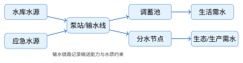
<figcaption>图 8.23  供水、输配水、调蓄与需水单元的网络表达</figcaption>
</figure>

假设主泵站停运，平台首先冻结故障设备，再计算应急水源和调蓄池能够维持的供水时长。方案对每类用户给出供水量、缺口、恢复时间和约束余量，并列出未被满足的需求。课程练习的重点是网络建模、平衡校验、约束解释和方案留痕，优化算法可以用最简单的贪心分配代替。

方案发布后，执行回执持续进入平台。实际流量与计划偏差超过容限时，系统发出“方案偏离”事件提示重新评估，不自己反复求解、自动改控制指令。新方案经重新审批后才替换正在执行的计划。

#### 8.5.11.1 计算题：水量平衡闭合差

某调度时段输入供水$S_1=2.40$百万 m$^3$、$S_2=0.60$百万 m$^3$，需水分配$D_1=1.20$百万 m$^3$、$D_2=1.00$百万 m$^3$、$D_3=0.30$百万 m$^3$，输水损失$L=0.10$百万 m$^3$，调蓄放水$\Delta V=0.20$百万 m$^3$。请按“放水为正、蓄水为负”的约定计算未分配水量$R$（或未满足需求$U$）和闭合残差$\varepsilon$，并说明如果把调蓄量误写成库容末值减初值会出现什么符号错误。提交计算表、单位、舍入规则和审批判断。

核对步骤：供给侧$2.40+0.60+0.20=3.20$，需求与损失$1.20+1.00+0.30+0.10=2.60$，差额$0.60$记入未分配水量$R$，不是平衡误差$\varepsilon$。调度目标把这部分差额安排为生态补水，就新增一个需水单元；有未满足的需求，就把$U$写进枯水结果。$\varepsilon$用原始精度计算，只因显示舍入产生的微小差异不是缺水量。

### 8.5.12 场景版本、方案比较与不确定性表达

比较案例水库的预演方案时，需要同时读取场景版本、模型卡与运行记录。模型卡字段按6.4.6节组织，用于解释方案差异和计算的不确定性。

一个场景由输入版本、模型版本、参数集和评价指标共同标识。修改降雨、初始水位或闸门约束都会产生新版本；只改变镜头、图层透明度等显示设置不会产生计算版本。平台用父子关系保存分支，允许从同一基线形成“现状延续”“提前泄洪”“局地强降雨”等方案。

表8.21说明方案比较为什么不能只给一个排名。不同方案在防洪安全、供水保证和下游影响之间各有取舍，压成一个总分就看不见这些取舍了；平台把各维度指标并列呈现，由审批人做最终选择。

**表 8.21  方案比较不能只给一个排名**

| 指标       | 表达方式                       | 解释要求                   |
|:-----------|:-------------------------------|:---------------------------|
| 工程风险   | 最高水位、超限时长、约束余量   | 给出位置、时刻和阈值来源   |
| 影响范围   | 淹没面积、对象数量、到达时间   | 说明空间数据和模型分辨率   |
| 调度代价   | 弃水、缺水、能耗、启闭次数     | 说明权重和不能量化的因素   |
| 模型可信度 | 校准期误差、输入范围、运行状态 | 不得用单一百分数代替模型卡 |
| 执行条件   | 设备可用、人员资源、审批时限   | 列出阻止执行的硬约束       |
| 差异来源   | 输入、模型、参数或人工调整     | 支持逐项追溯而非只看结果差 |

不确定性可以用情景区间、分位数、集合成员或可信等级表达。案例水库可以用三种降雨情景形成水位包络线，中位过程与上下界同时显示。只有一次确定性计算时，也写明它的边界条件和敏感参数；输出的小数位多，不等于精度高。

模型校准与业务验收是两件事。校准看模型能不能合理复现历史过程；业务验收看在当前平台里输入对不对、运行稳不稳、结果能不能解释、失败能不能降级、各角色是否按权限完成任务。历史拟合再好，超出校准范围的极端情景仍标为低可信。

图8.24把场景的分支关系与比较过程画了出来：多个方案从同一基线分出，在统一指标下并排比较，最终由人工选定并留下选择理由。

<figure markdown>
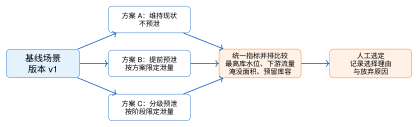
<figcaption>图 8.24  方案分支从同一基线分出、并排比较到人工选定的过程</figcaption>
</figure>

会商报告引用方案 ID，不引用截图里的方案名称。报告记录选择理由、放弃其他方案的原因、关键不确定性、有效期和触发重新会商的条件。降雨实况明显偏离情景、工程状态变化或模型失效时，原结论自动变为“需复核”，历史记录保留。

### 8.5.13 端到端实现切片与验收脚本

按6.4.17节的迭代安排，先做通一条从创建场景到结果复核的流程，再逐步加模型和业务对象，每轮提交数据、代码和验收记录。

课程实现选“自定义降雨—洪水预报—淹没影响—橙色预演—会商归档”作端到端切片。切片不是整个平台，但它跨越数据、模型、空间分析、权限、前端和审计，只做页面或只写算法时看不到的接口问题在这里都会露出来。

表8.22把这条切片涉及的接口与证据逐段列出。每一段都有明确的输入输出契约，小组分工时前端不用等后端、后端不用等模型。

**表 8.22  端到端切片的接口与证据**

| 步骤     | 最小接口                       | 必须保存的证据                   |
|:---------|:-------------------------------|:---------------------------------|
| 创建场景 | POST /scenarios                | 场景ID、父版本、创建人和边界条件 |
| 校验输入 | POST /scenarios/{id}/validate  | 单位、时间、范围和质量问题清单   |
| 运行模型 | POST /model-runs               | 任务ID、模型与参数版本、状态日志 |
| 查询结果 | GET /model-runs/{id}/artifacts | 产物清单、校验和、质量摘要       |
| 影响分析 | POST /impact-analyses          | 空间版本、阈值、对象清单         |
| 方案会商 | POST /reviews                  | 比较指标、意见、选择理由与权限   |
| 归档报告 | POST /reports                  | 引用ID、生成版本、批准人与有效期 |

验收脚本先走正常路径，再注入错误。正常路径验证同一个场景 ID 能贯通页面、日志和报告；错误路径依次注入无单位降雨、过期初始水位、模型超时、损坏栅格、无权限审批和结果过期，每一种都看状态码、用户提示、审计记录和降级页面。要断言的有：缺少单位时不创建任务并定位到字段；初始状态过期时显示数据龄期并绑定确认记录；模型超时时没有旧模拟结果冒充新结果；产物校验失败时不能发布；无权限审批时状态不变且不产生控制命令；实况偏离情景时原结论标为需复核，历史仍可查询。

清单8.23给出验收脚本的关键断言。断言不止看返回值，还看用户提示、审计记录和降级页面：只验证正常路径返回 200 的脚本，证明不了系统在异常情况下还能用。

**清单 8.23  端到端切片的验收断言**

```java
@SpringBootTest(webEnvironment = WebEnvironment.RANDOM_PORT)
@AutoConfigureMockMvc
class ScenarioSliceAcceptanceTest {

    @Autowired MockMvc mvc;
    @Autowired AuditLogRepository auditLogs;

    /** 正常路径：同一 scenarioId 必须贯通场景、模型任务与报告。 */
    @Test
    @WithMockUser(username = "analyst01", roles = {"ANALYST"})
    void normalPathKeepsOneScenarioIdAcrossTheWholeSlice() throws Exception {
        String scenarioId = JsonPath.read(
            mvc.perform(post("/api/scenarios")
                    .contentType(MediaType.APPLICATION_JSON)
                    .content(payload("rain-200mm-24h.json")))
               .andExpect(status().isCreated())
               .andReturn().getResponse().getContentAsString(), "$.scenarioId");

        String runId = JsonPath.read(
            mvc.perform(post("/api/model-runs")
                    .contentType(MediaType.APPLICATION_JSON)
                    .content("{\"scenarioId\":\"" + scenarioId + "\"}"))
               .andExpect(status().isAccepted())
               .andReturn().getResponse().getContentAsString(), "$.runId");

        // 产物必须带模型版本与校验和，否则结果无法追溯
        mvc.perform(get("/api/model-runs/{id}/artifacts", runId))
           .andExpect(status().isOk())
           .andExpect(jsonPath("$.modelVersion").isNotEmpty())
           .andExpect(jsonPath("$.checksum").isNotEmpty())
           .andExpect(jsonPath("$.scenarioId").value(scenarioId));

        // 报告引用方案ID而不是方案名称
        mvc.perform(post("/api/reports")
                .contentType(MediaType.APPLICATION_JSON)
                .content("{\"scenarioId\":\"" + scenarioId + "\"}"))
           .andExpect(status().isCreated())
           .andExpect(jsonPath("$.references[0].scenarioId").value(scenarioId));

        // 断言三：审计记录必须落库，且能按 scenarioId 检索
        assertThat(auditLogs.findByBusinessKey(scenarioId))
            .as("端到端切片的每一步都要留下审计记录")
            .hasSizeGreaterThanOrEqualTo(4);
    }

    /** 错误路径：缺单位的降雨必须被拒绝，并给出可读提示而不是 500。 */
    @Test
    @WithMockUser(username = "analyst01", roles = {"ANALYST"})
    void rainfallWithoutUnitIsRejectedWithReadableMessage() throws Exception {
        mvc.perform(post("/api/scenarios")
                .contentType(MediaType.APPLICATION_JSON)
                .content(payload("rain-missing-unit.json")))
           .andExpect(status().isBadRequest())
           .andExpect(jsonPath("$.code").value("INPUT_UNIT_MISSING"))
           .andExpect(jsonPath("$.message").value(containsString("降雨量缺少单位")))
           .andExpect(jsonPath("$.field").value("rainfall.unit"));
    }

    /** 错误路径：模型超时后页面必须降级为“未评估”，不得给出颜色结论。 */
    @Test
    @WithMockUser(username = "duty01", roles = {"DUTY_OFFICER"})
    void modelTimeoutDegradesToNotAssessedInsteadOfAColor() throws Exception {
        mvc.perform(get("/api/scenarios/{id}/summary", timedOutScenarioId()))
           .andExpect(status().isOk())
           .andExpect(jsonPath("$.classification").value("NOT_ASSESSED"))
           .andExpect(jsonPath("$.warningLevel").doesNotExist())
           .andExpect(jsonPath("$.degradedReason").value("MODEL_RUN_TIMEOUT"));
    }

    /** 错误路径：值班员无权发布方案，拒绝后仍要留审计。 */
    @Test
    @WithMockUser(username = "duty01", roles = {"DUTY_OFFICER"})
    void dutyOfficerCannotPublishPlanButTheAttemptIsAudited() throws Exception {
        mvc.perform(post("/api/reviews/{id}/publish", pendingReviewId()))
           .andExpect(status().isForbidden())
           .andExpect(jsonPath("$.code").value("ROLE_NOT_ALLOWED"));

        assertThat(auditLogs.findByActionAndResult("REVIEW_PUBLISH", "DENIED"))
            .as("被拒绝的高风险操作同样要留下审计")
            .isNotEmpty();
    }
}
```

最终由不同角色一起演示：专业分析员先准备输入，再启动计算并比较结果；审批人确认方案；值班员查看执行回执。从改参数到下发控制的整条链，任何一个人都不能独自走完。评分看接口契约、失败证据和审计记录。

### 8.5.14 会商时间线、值守交接与复盘

数字孪生的结果进了值守流程才有业务价值。平台用一条事件时间线串起“数据异常、预报更新、预警升级、方案提交、会商意见、审批、执行回执和效果复核”，每个节点链接到原始证据。时间线里的人工意见不会被后来的自动计算覆盖，撤回或修订都保留前一版本。

表8.23是一次橙色预警会商的时间线示例。每个节点对应责任角色、操作时间和记录内容，平台据此跟踪方案从提交到执行、复核的全过程。

**表 8.23  一次橙色预警会商的时间线示例**

| 相对时刻   | 事件                   | 责任角色         | 形成证据             |
|:-----------|:-----------------------|:-----------------|:---------------------|
| $T-60$ min | 降雨预报更新，创建情景 | 值班员           | 输入来源与场景版本   |
| $T-45$ min | 洪水和淹没模型完成     | 专业分析员       | 运行日志与产物清单   |
| $T-30$ min | 比较闸门与疏散方案     | 专业分析员       | 指标、风险与推荐理由 |
| $T-20$ min | 召开会商并补充约束     | 多专业角色       | 意见、异议与修订版本 |
| $T-10$ min | 批准有有效期的方案     | 审批人           | 电子签名与控制边界   |
| $T+0$      | 执行并持续回传状态     | 值班员、现场人员 | 命令、回执与实际过程 |
| $T+60$ min | 比较预测与实况并复核   | 专业分析员       | 偏差、结论和后续动作 |

交接班不能只说一句“系统正常”。交班人逐项确认当前预警、未闭环工单、正在运行的模型任务、已批准方案及其有效期、失效服务、数据龄期和待复核结论，接班人逐项确认并签署。方案将在下一班次到期时，交接页面突出提示。

图8.25把交接班要覆盖的四类内容画在一起：当前态势、未闭环任务、已批准方案及其有效期、失效服务与数据龄期。其中方案有效期最容易漏：一份昨夜批准、今晨已经过期的调度建议，交接页面上不突出提示，接班人很可能继续按它执行。

<figure markdown>
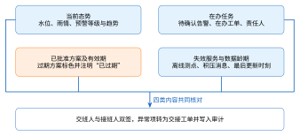
<figcaption>图 8.25  值守交接班必须覆盖的四类内容与双签确认</figcaption>
</figure>

事件结束后，复盘把预报与实况、建议与执行、计划与回执逐项对齐。偏差可能来自输入、模型、参数、工程状态、操作延迟或组织协同，不全是算法的问题。复盘产出模型校准任务、数据治理工单、预案修订和培训改进，各自指定责任人和完成时限。

### 8.5.15 失效降级、验收与课程实现

案例验收按6.4.16节的六类检查组织，重点看服务失效后的降级行为。运行流程与验收脚本用同一组输入快照和追踪号，预期与实际结果才好比较。

数字孪生平台出故障时，基本监测能力要还在：模型服务不可用，照常展示经质检的实时数据；三维场景失败，降到二维地图和表格；AI 助手不可用，手工查询和会商照常；网络中断，边缘缓存并标记数据龄期。

表8.24把失效场景与验收要求配对。验收时真的把故障造出来，不是看设计文档：把模型服务停掉，看实时监测还在不在；把三维资源删掉，看二维地图和表格能不能顶上。

**表 8.24  数字孪生案例的失效与降级验收**

| 失效场景         | 预期降级                         | 验收证据                         |
|:-----------------|:---------------------------------|:---------------------------------|
| 水文模型超时     | 保留实时监测，结果标记不可用     | 超时日志、界面状态、无旧结果冒充 |
| 三维瓦片加载失败 | 二维地图、图表和对象列表可用     | 降级截图与操作记录               |
| Kafka重复消息    | 预警和工单不重复创建             | eventId去重记录                  |
| 现场网络中断     | 边缘缓存、数据龄期提示、恢复补传 | 缓存数量与补传顺序               |
| AI工具调用失败   | 明确失败并回到手工流程           | 错误信息与人工操作记录           |

课程项目分六次迭代：需求与对象编码、数据契约、三维底座、监测预警、数字孪生预演、部署验收，每次提交可执行的用例。表8.25列出每次的交付物和用例。这样安排是把联调风险往前挪：第三次迭代结束时三维底座就要能加载真实测点，坐标对不上在期中就能发现，不用等到期末。

**表 8.25  课程项目六次迭代的交付物与可执行用例**

| 迭代  | 交付物                 | 必须通过的可执行用例                                      |
|:------|:-----------------------|:----------------------------------------------------------|
| 第1次 | 需求说明与对象编码规则 | 同一工程在三个界面上的名称、编码与特征水位完全一致        |
| 第2次 | 数据契约与事件契约     | 一条观测带单位、时间、质量码入库，并产生一条可订阅事件    |
| 第3次 | 三维场景与状态联动     | 加载真实测点坐标，点击曲线异常点后相机定位到同一`assetId` |
| 第4次 | 预警评估与工单闭环     | 黄色预警生成工单，值班员确认后回执可追溯到原始读数        |
| 第5次 | 预演或闸门方案         | 模型运行留下模型卡、输入快照与人工确认记录                |
| 第6次 | 部署、降级与验收       | 模型超时时页面显示“未评估”，无权限操作被拒绝且留审计      |

最终演示包含正常监测、质量异常、黄色预警、橙色预演、模型失败和无权限操作六类场景。评价看三点：链路能不能追溯，失败有没有如实显示，角色有没有越权。

## 8.6 系统部署、运维与验收

**本节层次**

指导实践：8.6.1、8.6.2、8.6.3。

**进入本节所需知识**

8.4.2节的练习做完了；机器上装有 Docker。8.1–8.4节不需要先读本节。

### 8.6.1 部署架构与环境一致性

教学接口只是一个Node进程。完整平台要同时运行五类服务：提供前端静态文件的Nginx、Spring Boot后端、带PostGIS与TimescaleDB扩展的PostgreSQL、Redis和Kafka；模型、纹理和报告这类大文件放在对象存储里。图8.26按部署单元画出它们和对外的入口。图8.2关心的是职责怎样划分；这张图关心进程、端口和数据存放在哪里，运维交接时看的是这一张。

<figure markdown>
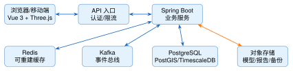
<figcaption>图 8.26  案例水库平台部署架构</figcaption>
</figure>

开发、测试和生产三套环境使用相同的配置结构，差别只在外部注入的参数和密钥。JWT密钥、数据库口令和地图令牌不写进镜像，也不写进代码仓库。发布流程和配置项分别按持续交付和配置管理的做法管理<sup>[[63]](../../references.md#ref63)[[64]](../../references.md#ref64)</sup>。

#### 8.6.1.1 从部署图到可执行编排

Docker Compose用一个YAML文件描述这些服务怎样一起启动：各用哪个镜像，数据放在哪个卷里，谁依赖谁，怎样才算启动好了。清单8.24是编排的基线写法；配套工程根目录的`docker-compose.yml`是可以直接运行的版本，多了网络隔离和前端构建。数据库的数据卷和Kafka的日志卷独立于容器，删掉容器重建，观测、预警和工单都还在。

**清单 8.24  案例水库平台 Docker Compose 编排基线**

```yaml
services:
  web: {image: registry.example.com/qingyuan-web:APP_VERSION, ports: ["8080:80"], depends_on: {api: {condition: service_healthy}}}
  api:
    image: registry.example.com/qingyuan-api:APP_VERSION
    environment: {SPRING_PROFILES_ACTIVE: production, DB_URL: jdbc:postgresql://postgres:5432/qingyuan, DB_PASSWORD_FILE: /run/secrets/db_password, KAFKA_BOOTSTRAP_SERVERS: kafka:9092, REDIS_URL: redis://redis:6379}
    secrets: [db_password, kafka_password]
    depends_on: {postgres: {condition: service_healthy}, kafka: {condition: service_healthy}, redis: {condition: service_healthy}}
    healthcheck: {test: ["CMD-SHELL", "wget -qO- http://localhost:8080/actuator/health/readiness | grep -q UP"], interval: 10s, timeout: 3s, retries: 12}
  postgres: {image: timescale/timescaledb-ha:pg16, volumes: [pg-data:/var/lib/postgresql/data], healthcheck: {test: ["CMD-SHELL", "pg_isready -U qingyuan_app -d qingyuan"]}}
  redis: {image: redis:7.2-alpine, command: ["redis-server", "--appendonly", "yes"], volumes: [redis-data:/data], healthcheck: {test: ["CMD", "redis-cli", "ping"], interval: 10s, timeout: 3s, retries: 5}}
  kafka: {image: apache/kafka:3.7.2, volumes: [kafka-data:/var/lib/kafka/data], healthcheck: {test: ["CMD-SHELL", "/opt/kafka/bin/kafka-topics.sh --bootstrap-server localhost:9092 --list >/dev/null 2>&1"], interval: 15s, timeout: 10s, retries: 8}}
secrets: {db_password: {file: ./secrets/db_password.txt}, kafka_password: {file: ./secrets/kafka_password.txt}}
volumes: {pg-data: {}, redis-data: {}, kafka-data: {}}
```

清单里的`depends_on`只规定启动顺序，服务是否就绪由`healthcheck`判断：后端要等数据库和Kafka的健康检查通过才启动，Nginx要等后端就绪才接流量。数据库和Kafka没有映射端口，浏览器访问不到它们，外部流量只进Nginx。

**运行与观察**

在`companion/water-platform-demo`目录执行清单8.25的四条命令：

**清单 8.25  一条命令启动与冒烟验证**

```bash
cp secrets/db_password.txt.example secrets/db_password.txt
cp secrets/kafka_password.txt.example secrets/kafka_password.txt
docker compose up -d --build
./smoke.sh
```

`smoke.sh`分五步：等待`/readyz`返回UP；不带令牌访问`/api/assets`应得401；用`duty01`登录取得令牌；带令牌查到`DAM-A-PZ-07`和它的种子观测；错误口令应得401。全部通过时最后一行是“冒烟测试全部通过”。Windows上在Git Bash里执行。教学接口上的S6练习通过，只说明业务规则正确；数据能否持久保存、容器重启后能否恢复，要靠这里的验证。

**一个会遇到的失败**

改了`secrets/db_password.txt`之后后端报`password authentication failed`。原因是数据库口令只在数据卷第一次创建时写入，之后改文件不起作用。处理办法是`docker compose down -v`删除数据卷后重建，这会清空数据；然后再运行`smoke.sh`验证。

#### 8.6.1.2 环境变量、密钥与版本回滚

配置分三层：写在仓库里的非敏感默认值，部署时注入的环境变量，以文件形式挂进容器的secret。清单8.26列出变量名和校验规则，仓库里只有`*.example`模板。配套后端用`FileSecretsEnvironmentPostProcessor.java`读取`DB_PASSWORD_FILE`这类以`_FILE`结尾的变量所指向的文件。

**清单 8.26  环境变量与密钥示例**

```yaml
APP_VERSION: "2026.08.07-rc1"
SPRING_PROFILE: "production"
DB_USER: "qingyuan_app"
DB_NAME: "qingyuan"
KAFKA_TOPIC_READING: "qingyuan.reading.v1"
SECRETS: {DB_PASSWORD_FILE: "/run/secrets/db_password", JWT_SIGNING_KEY: "injected-by-secret-manager"}
ROTATION: {password_days: 90, signing_key_overlap_hours: 24}
VALIDATION: {require_non_empty: [DB_USER, DB_NAME], reject_default_password: true}
```

换数据库口令时，先建新凭据并验证能连上，再撤销旧的。换 JWT 密钥时留一段新旧密钥同时有效的重叠期，处理中的请求才能正常结束（5.6.2节）。变量缺失、还在用示例口令、镜像用`latest`标签，这三种情况发布流水线直接失败。回滚之前先看数据库迁移是否向后兼容，能兼容才回退无状态的服务。

#### 8.6.1.3 Nginx 反向代理与静态资源

Nginx负责三件事：提供Vue构建出的静态文件，把`/api/`开头的请求转发给后端，对外暴露健康检查路径。清单8.27中，`try_files ... /index.html`是为Vue Router的history模式准备的：用户刷新`/monitoring`这样的地址时，Nginx找不到同名文件，就返回入口页，再由前端路由接管。第4章开发时靠Vite的代理转发`/api`，生产环境里这件事由Nginx来做。权限判断仍在Spring Security里，Nginx只是转发，并加上请求号`X-Request-Id`供日志关联。

**清单 8.27  前端静态资源与 Spring Boot API 的 Nginx 配置**

```nginx
worker_processes auto;
events { worker_connections 1024; }
http {
  upstream qingyuan_api { server api:8080; keepalive 32; }
  server {
    listen 80; server_name water.example.edu; root /usr/share/nginx/html;
    client_max_body_size 20m;
    location /assets/ { try_files $uri =404; }
    # Vue Router history 模式：非资源路径回退到入口页
    location / { try_files $uri $uri/ /index.html; }
    location /api/ { proxy_pass http://qingyuan_api; proxy_set_header Host $host; proxy_set_header X-Request-Id $request_id; proxy_set_header X-Forwarded-For $proxy_add_x_forwarded_for; proxy_read_timeout 30s; }
    location /healthz { proxy_pass http://qingyuan_api/actuator/health/liveness; access_log off; }
    location /readyz { proxy_pass http://qingyuan_api/actuator/health/readiness; access_log off; }
  }
}
```

#### 8.6.1.4 健康检查的三个层次

“进程活着”“依赖可用”和“业务正确”是三件事。存活探针`/healthz`只回答进程有没有响应，失败了就重启容器。就绪探针`/readyz`还要检查数据库连接和Kafka，失败时把实例从流量里摘掉，但不重启。业务冒烟就是`smoke.sh`那样的只读请求，检查登录、查询和质量码字段。三者如果共用一个永远返回200的接口，数据库连接池耗尽时，平台仍会显示“一切正常”。

告警规则、容量评估和备份恢复演练的配置样例与操作要点见附录C的C.13节。28个测点的教学规模单机就能运行，由此推不出生产环境的容量，生产容量要用接近真实分布的数据压测。

### 8.6.2 可观测性、备份与恢复

平台恢复之后要核对四样东西：服务、数据、模型和在办业务。6.4.15节的监控指标和血缘记录可以用来查明恢复到了哪个时刻、漏了哪些事件、哪些任务需要重做。监控分四类：服务监控看可用率、延迟、错误率和队列积压；数据监控看到达延迟、完整率、质量码分布和时钟漂移；模型监控看运行成功率、残差和输入越界；业务监控看预警确认时延和工单关闭情况。

备份是否有效，要靠恢复演练来验证。图8.27给出一次演练的阶段顺序：冻结变更并记下恢复点，恢复数据库，以只读方式核对对象关系和审计记录，重放恢复点之后的消息（靠`eventId`去重，见8.3.4节），最后放开写入并运行业务冒烟。

<figure markdown>

<figcaption>图 8.27  备份恢复演练的阶段时间轴</figcaption>
</figure>

数据库备份、对象存储的版本和配置清单对应同一个恢复点。只恢复数据库而没有模型卡和报告，8.5节的预演复现不了；只恢复文件而缺工单状态，证明不了处置链完整。测试既要证明正常功能，也要主动找失败路径<sup>[[65]](../../references.md#ref65)</sup>。自动恢复只做预先批准的动作，例如重启无状态实例或切到健康副本；修数据库和任何控制类操作都经人工确认。

### 8.6.3 阶段验收

案例做到什么程度算完成，动手之前就要写清楚。表8.26按需求、架构、数据、三维、预警、孪生和运维七个阶段列出要回答的问题和要交的证据。“证据”列里的需求编号指第3章登记的REQ-MON系列，编号规则来自第2章的追踪矩阵，这样从需求到验收可以逐项回查。只学本章核心路线的读者完成需求、数据和预警三行；孪生和运维两行分别对应8.5节和本节的实践。

**表 8.26  第8章案例的阶段验收**

| 阶段 | 验收问题                             | 证据                                                     |
|:-----|:-------------------------------------|:---------------------------------------------------------|
| 需求 | 角色、边界、业务闭环是否一致         | 用例、权限表、异常流；对应REQ-MON-01～04                 |
| 架构 | 技术栈、模块和部署是否一致           | 架构图、决策记录（含ADR-003回指REQ-MON-03/04）、接口清单 |
| 数据 | 时间、单位、质量和对象编码是否可追溯 | 样例、字典、质量日志；验证REQ-MON-01                     |
| 三维 | 坐标、状态、交互和降级是否正确       | 映射表、页面与失败场景                                   |
| 预警 | 四级口径、证据和工单是否闭环         | 事件、审批、回执与复盘；验证REQ-MON-02/04                |
| 孪生 | 场景、模型、方案和人工确认是否受控   | 模型卡、输入快照、证据链                                 |
| 运维 | 监控、备份、恢复和权限是否有效       | 演练、监控截图与审计记录                                 |

最小可运行版本是一条能实际操作的链：PZ-07的观测进入平台，经质量检查后定为黄色预警，值班员确认并创建工单，三维场景定位到测点，处置结果回写，预警归档。选做数字孪生扩展的小组，另外完成一个带模型卡、场景版本和人工确认的预演任务。

## 8.7 小结

本章用前面各章做好的页面、接口、场景和曲线，完成了PZ-07一次异常观测的处置。链上每一步各有一条规则。质量检查决定观测能否参与定级，`suspect`和`missing`不参与。定级结果有两个维度，`evaluable=false`是“未评估”，`evaluable=true`且`level=NONE`才是“无预警”。确认和完成都用条件更新，重复提交和并发操作得到409，不会生效两次。工单必须带处置结果才能完成，完成后预警才关闭。证据快照和事件编号让事后能从工单查回当初的观测。

评分、等级和模型结果都是给人用的依据。确认、派单、审批和关闭由有权限的人完成，案例不向真实设备下发控制指令。数字孪生在这条链上增加了预报、预演和预案，模型结果同样先经人工确认，见8.5节。

工程参数、接口契约和分界值在正文、配套工程和习题里是同一组。对某个数字有疑问时，以8.1节的表和`case-params.tex`为准。

## 8.8 章末交付物

核心路线提交一份《PZ-07异常观测处置记录》，包含：

- 8.4.2节七个步骤的请求与应答，其中409和400的应答各附一句原因说明；

- `closeloop-check.mjs`和`lesson84.test.js`的运行输出；

- 8.4.1节故障练习的“现象—原因—处理—验证”记录；

- 一张自己画的PZ-07事件链图，标出每一步的责任角色和所用接口。

选做指导实践的小组另外提交：8.3.5节后端实现在核对脚本下的输出及对不通过项的处理说明；`smoke.sh`的运行输出和一次容器重启后的复验记录。选做8.5节的小组提交一个预演或闸门方案场景，含模型卡、输入快照和人工确认记录。

## 8.9 思考题与练习题

**客观题**

1.  本章后端主线是（）。A. Node.jsB. Spring BootC. DjangoD. PHP

2.  本章关系与空间数据主线是（）。A. MySQLB. MongoDBC. PostgreSQL/PostGISD. SQLite

3.  红色预警可以由模型直接转换为控制命令，无需审批。（判断：对／错）

4.  工程级精细交互通常优先采用 Three.js；跨流域大范围地形浏览可采用 Cesium，具体选择取决于场景尺度、数据组织和交互任务。（判断：对／错）

5.  数字孪生预演结果应明确标记模型版本和“模拟”状态。（判断：对／错）

**简答与设计题**

6.  说明案例水库中值班员、专业分析员、运维员和审批人的权限边界。

7.  绘制PZ-07从观测、质量检查到黄色预警、工单和复盘的事件链。

8.  比较安全监测平台与数字孪生“四预”平台的能力边界。

9.  为某水库设计“四预”页面信息架构与算法接口清单。

10. 说明闸门反算为什么可能产生多组可行方案，以及系统应如何支持人工比选。

11. 设计AI会商助手的白名单工具、参数确认、专业复核和审批边界。

**实践题**

12. 在第7章S5阶段页的基础上，用两课时增量实现对28个测点的筛选、曲线和三维定位联动，并用8.3.6节的`statusText`在测点旁显示预警状态，“未评估”与“无预警”使用不同样式。

13. 实现一条Spring Boot质量检查接口，验证格式、单位、范围、时序和重复五项，并提交缺测、可疑值与质量标记调整记录。

14. 为自定义降雨场景编写输入契约、模型卡和$T+0$至$T+24\,h$结果元数据，不要求实现水动力算法。

15. 用容器编排或等价环境部署前端、Spring Boot、PostgreSQL、Redis和Kafka，并提交健康检查与配置说明。

16. 设计一次模型服务超时和一次三维场景失败的降级演练，证明二维地图、图表和工单仍可使用。

[^1]: 51WIM 及 51WORLD 为北京五一视界数字孪生科技股份有限公司的商标或注册商标，本书仅作技术说明性使用。
