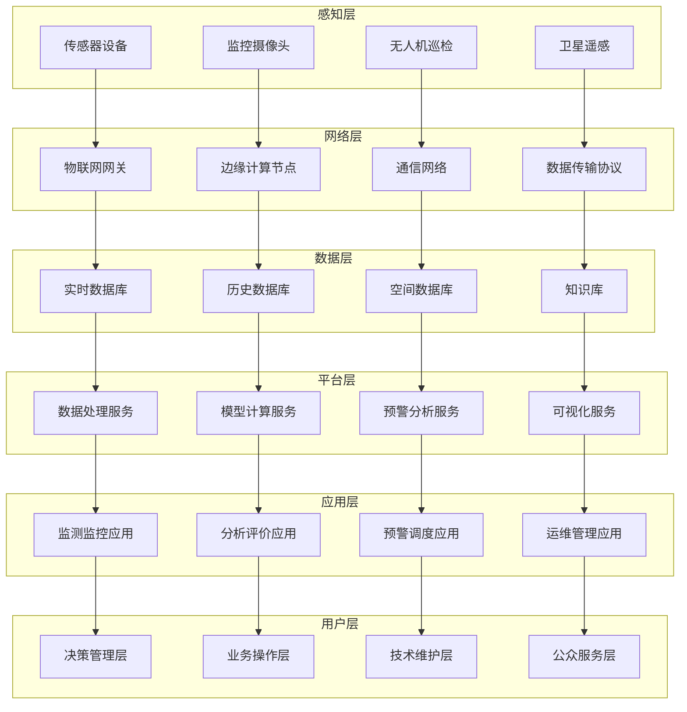
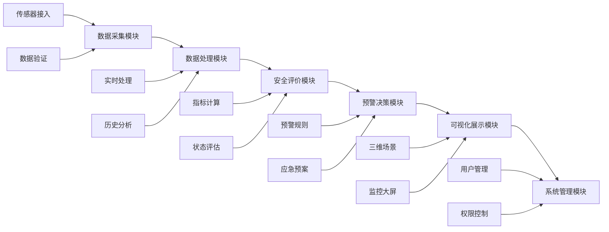
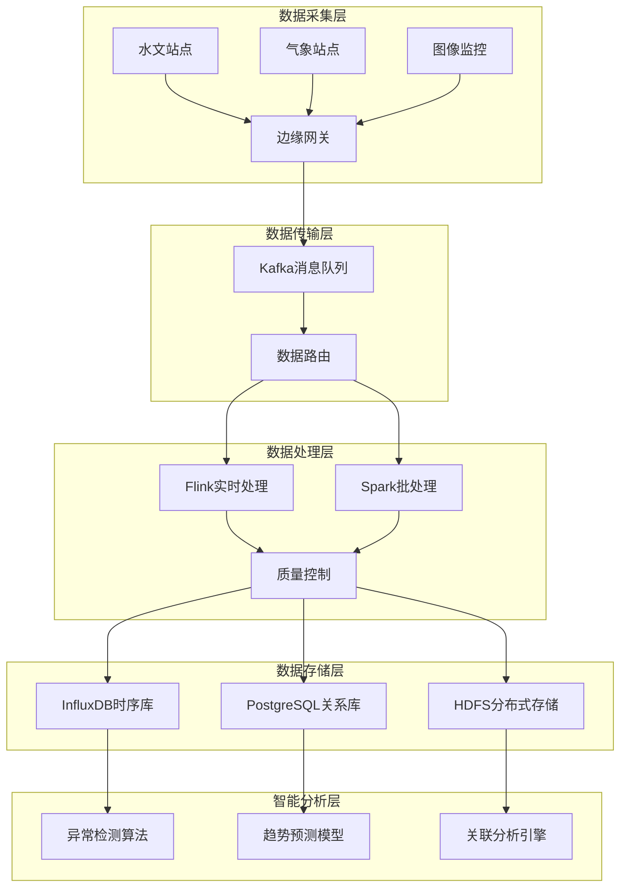

# 第八章 典型应用

## 学习目标

通过本章学习，学生应能够：

1. **理解水利工程安全监测的业务需求**：深入了解水利工程安全监测的重要性与技术挑战，掌握平台整体架构设计思路
2. **掌握平台整体架构设计思路**：熟练运用前七章所学知识，设计可扩展、高可用的智慧水利平台架构
3. **了解系统集成的技术要点**：理解用户角色与权限管理设计、数据流与业务流的整体设计方法
4. **掌握具体工程项目的场景建模流程**：熟练掌握典型水利工程（大坝/水闸）的建模实践方法
5. **理解模型制作的技术要点**：从CAD图纸到三维模型的完整流程，包括模型细节优化与LOD分级
6. **能够进行场景优化与性能调优**：掌握多尺度场景切换的技术实现，确保系统运行效率
7. **掌握实时数据处理的完整技术方案**：构建实时数据采集与预处理系统，实现数据质量控制与异常检测
8. **理解数据可视化的最佳实践**：多维数据的可视化展示技术，设计个性化仪表板
9. **能够设计个性化的数据展示界面**：根据不同用户需求定制界面和功能
10. **理解安全评价指标体系的构建方法**：建立科学的水利工程安全评价指标体系
11. **掌握预警算法的设计与实现**：多参数融合的预警算法设计，实现风险等级评估与决策支持
12. **能够建立综合风险评估模型**：安全态势的可视化表达和智能预警系统
13. **通过完整的功能演示掌握系统集成技术**：完整的业务流程操作演示和关键功能的核心代码解析
14. **理解企业级应用的部署与运维**：用户界面设计的技术实现，系统部署、运维与扩展策略
15. **总结项目开发的经验与最佳实践**：形成可复制的项目开发方法论和工程实践经验

## 引言

**智慧水利应用的发展现状**

当前，智慧水利建设已成为水利现代化的重要组成部分。随着物联网、大数据、人工智能、数字孪生等前沿技术的日趋成熟，智慧水利平台正从概念验证向大规模工程应用转变。本章通过五个典型的综合应用案例，展示智慧水利技术在不同业务场景中的系统性应用。

**典型应用的技术特征**

现代智慧水利应用呈现出以下技术发展特点：

- **业务融合度不断提升**：从单一功能向多业务协同发展，统筹防洪、供水、发电、生态等多重目标
- **技术集成度日益加深**：需要集成传感感知、数据处理、智能分析、可视化展示、决策支持等多项技术
- **用户体验要求提高**：既要满足专业人员的深度分析需求，又要为管理层提供直观的决策支持界面
- **标准化程度逐步完善**：遵循水利行业标准和技术规范，确保系统的互操作性和可维护性
- **可靠性安全性要求严格**：作为关键基础设施，对系统的稳定性、安全性提出极高要求

**本章案例选择原则**

本章选择的五个应用案例具有以下特点：

1. **典型性**：覆盖水利行业主要业务领域和应用场景
2. **完整性**：包含需求分析、架构设计、核心实现、部署运维等完整环节  
3. **实用性**：来源于真实工程项目，具有较强的实践指导价值
4. **先进性**：体现当前智慧水利技术发展的主流方向和最佳实践
5. **可复制性**：提供标准化的开发流程和技术方案，便于推广应用

## 本章结构

!!! info "章节安排"
    
    ### [8.1 水利工程安全监测平台概述](section08-01.md)
    - 水利工程安全监测的重要性与技术挑战
    - 平台功能模块划分与技术架构
    - 用户角色与权限管理设计
    - 数据流与业务流的整体设计
    
    ### [8.2 场景设置与模型制作](section08-02.md)
    - 典型水利工程（大坝/水闸）的建模实践
    - 从CAD图纸到三维模型的完整流程
    - 模型细节优化与LOD分级
    - 多尺度场景切换的技术实现
    
    ### [8.3 数据处理与展示模块](section08-03.md)
    - 实时数据采集与预处理系统
    - 数据质量控制与异常检测算法
    - 多维数据的可视化展示技术
    - 个性化仪表板的设计与实现
    
    ### [8.4 监控模型与综合评价模块](section08-04.md)
    - 水利工程安全评价指标体系
    - 多参数融合的预警算法设计
    - 风险等级评估与决策支持
    - 安全态势的可视化表达
    
    ### [8.5 功能模块演示](section08-05.md)
    - 完整的业务流程操作演示
    - 关键功能的核心代码解析
    - 用户界面设计的技术实现
    - 系统部署、运维与扩展策略

## 核心技术架构



## 关键技术特点

| 应用领域 | 核心功能 | 技术特色 | 业务价值 | 实施难点 |
|----------|----------|----------|----------|----------|
| **安全监测** | 实时监测、状态评估、预警响应 | 高可靠性、实时性、智能化 | 保障工程安全运行 | 多源数据融合、预警准确性 |
| **场景建模** | 三维建模、可视化展示、交互操作 | 高精度、沉浸感、多尺度 | 提升管理直观性 | 模型精度与性能平衡 |
| **数据处理** | 数据采集、清洗、分析、展示 | 高性能、可扩展、智能化 | 支撑科学决策 | 大数据处理、实时性要求 |
| **预警评价** | 风险分析、预警发布、应急响应 | 智能化、自动化、精准化 | 降低安全风险 | 预警模型准确性、响应时效 |
| **系统集成** | 平台集成、运维管理、服务保障 | 模块化、标准化、可维护 | 提高系统价值 | 异构系统集成、运维复杂度 |

## 技术选型与实施策略

!!! tip "推荐技术栈"
    
    === "后端技术栈"
        - **Spring Boot**：微服务开发框架
        - **Spring Cloud**：分布式系统解决方案
        - **MyBatis Plus**：数据持久层框架
        - **Redis**：缓存和会话管理
        - **RabbitMQ/Kafka**：消息队列中间件
        - **PostgreSQL/MySQL**：关系型数据库
        - **InfluxDB**：时序数据库
        - **Elasticsearch**：全文搜索引擎
        
    === "前端技术栈"
        - **Vue.js 3**：前端开发框架
        - **Element Plus**：UI组件库
        - **ECharts**：数据可视化库
        - **Three.js**：三维图形渲染
        - **Cesium**：地理信息可视化
        - **WebSocket**：实时通信
        - **PWA**：渐进式Web应用
        
    === "基础设施"
        - **Docker**：容器化部署
        - **Kubernetes**：容器编排
        - **Nginx**：反向代理和负载均衡
        - **Jenkins**：持续集成/持续部署
        - **Prometheus + Grafana**：监控告警
        - **ELK Stack**：日志分析
        - **MinIO**：对象存储

## 典型应用案例概览

### 案例一：大型水库安全监测平台

**项目背景**：某省重点水库大坝安全监测平台建设项目，水库总库容15亿立方米，保护下游人口150万，年发电量8亿千瓦时。

**技术挑战**：
- 多类型监测设备集成（变形、渗流、应力、温度等500余个测点）
- 海量历史数据管理（20年监测历史数据，约2TB存储）
- 实时预警响应（数据更新频率1分钟，预警响应时间<30秒）
- 多用户协同操作（管理层、技术层、操作层差异化需求）

**核心功能模块**：


### 案例二：流域三维可视化管理系统

**项目背景**：某流域水利工程数字孪生平台，覆盖流域面积8000平方公里，包含5座大型水库、15座中小型水库、50座泵站闸坝。

**技术特点**：
- **大范围地形处理**：基于1:10000地形数据构建流域三维地形
- **多尺度模型管理**：从流域宏观到工程微观的多层级LOD模型
- **实时数据融合**：整合水文、气象、工程运行等多源实时数据
- **沉浸式交互体验**：支持VR/AR设备的沉浸式操作体验

**关键技术指标**：
- 地形数据规模：500GB原始数据
- 三维模型精度：工程主体结构精度达到厘米级
- 渲染性能目标：60fps@1080p分辨率
- 并发用户支持：100+用户同时在线操作

### 案例三：智能化数据处理分析系统

**项目背景**：某省水文监测网络智能化升级项目，涉及200个自动监测站点，日数据量超过500万条记录。

**技术架构**：


### 案例四：多维预警分析系统

**项目背景**：某流域防洪预警系统，覆盖流域面积12000平方公里，涉及30个县市，保护人口300万。

**预警模型架构**：
- **基础数据层**：降雨、水位、流量、土壤含水率等多源数据
- **特征提取层**：时序特征、空间特征、统计特征、工程特征
- **模型计算层**：机器学习模型、物理模型、经验模型融合
- **决策输出层**：风险等级、预警类型、响应建议、影响范围

**核心算法实现**：
```javascript
// 多参数融合预警算法核心逻辑
class MultiParameterWarningSystem {
    constructor() {
        this.models = {
            rainfall: new RainfallForecastModel(),
            waterLevel: new WaterLevelPredictionModel(),
            flow: new FlowAnalysisModel(),
            composite: new CompositeRiskModel()
        };
        
        this.warningLevels = {
            NORMAL: { level: 0, color: '#4CAF50', desc: '正常' },
            ATTENTION: { level: 1, color: '#FF9800', desc: '关注' },
            WARNING: { level: 2, color: '#F44336', desc: '预警' },
            EMERGENCY: { level: 3, color: '#9C27B0', desc: '紧急' }
        };
    }
    
    async evaluateRiskLevel(stationData, forecastData) {
        // 单因子风险评估
        const rainfallRisk = await this.models.rainfall.evaluate(
            stationData.rainfall, forecastData.rainfall
        );
        const waterLevelRisk = await this.models.waterLevel.evaluate(
            stationData.waterLevel, forecastData.waterLevel
        );
        const flowRisk = await this.models.flow.evaluate(
            stationData.flow, forecastData.flow
        );
        
        // 多因子综合评估
        const compositeRisk = await this.models.composite.evaluate({
            rainfall: rainfallRisk,
            waterLevel: waterLevelRisk,
            flow: flowRisk,
            historical: stationData.historical,
            engineering: stationData.engineering
        });
        
        // 确定预警等级
        return this.determineWarningLevel(compositeRisk);
    }
    
    determineWarningLevel(compositeRisk) {
        const { probability, severity, uncertainty } = compositeRisk;
        
        // 基于概率-影响矩阵的预警等级判定
        const riskScore = probability * severity * (1 - uncertainty);
        
        if (riskScore >= 0.8) return this.warningLevels.EMERGENCY;
        if (riskScore >= 0.6) return this.warningLevels.WARNING;
        if (riskScore >= 0.3) return this.warningLevels.ATTENTION;
        return this.warningLevels.NORMAL;
    }
}
```

### 案例五：企业级平台集成系统

**项目背景**：某省级水利厅智慧水利综合平台，整合全省100+个业务系统，服务用户5000+人。

**集成架构设计**：
- **接入层**：API网关、认证鉴权、协议转换、负载均衡
- **服务层**：业务服务、数据服务、算法服务、基础服务
- **数据层**：主数据管理、数据仓库、数据湖、知识图谱
- **基础层**：容器平台、监控告警、日志审计、备份恢复

**技术实现要点**：

```yaml
# 微服务部署配置示例
apiVersion: apps/v1
kind: Deployment
metadata:
  name: water-monitoring-service
spec:
  replicas: 3
  selector:
    matchLabels:
      app: water-monitoring
  template:
    metadata:
      labels:
        app: water-monitoring
    spec:
      containers:
      - name: monitoring-service
        image: water-platform/monitoring:v2.0
        ports:
        - containerPort: 8080
        env:
        - name: SPRING_PROFILES_ACTIVE
          value: "prod"
        - name: DATABASE_URL
          valueFrom:
            secretKeyRef:
              name: db-secret
              key: url
        resources:
          requests:
            memory: "512Mi"
            cpu: "500m"
          limits:
            memory: "1Gi"
            cpu: "1000m"
        readinessProbe:
          httpGet:
            path: /health
            port: 8080
          initialDelaySeconds: 30
          periodSeconds: 10
        livenessProbe:
          httpGet:
            path: /health
            port: 8080
          initialDelaySeconds: 60
          periodSeconds: 30
```

## 应用案例技术对比

| 技术特征 | 案例一 | 案例二 | 案例三 | 案例四 | 案例五 |
|----------|--------|--------|--------|--------|--------|
| **复杂度等级** | 中高 | 高 | 高 | 高 | 极高 |
| **主要技术栈** | Spring Boot + Vue | Cesium + Node.js | Kafka + Spark | TensorFlow + FastAPI | Kubernetes + 微服务 |
| **数据规模** | 500个测点 | 500GB地形数据 | 日500万条记录 | 30个县市数据 | 省级全量数据 |
| **用户规模** | 50-100人 | 100+人 | 200+专业用户 | 1000+应急用户 | 5000+全类型用户 |
| **开发周期** | 8-12个月 | 12-18个月 | 18-24个月 | 15-20个月 | 24-36个月 |
| **运维复杂度** | 中等 | 中高 | 高 | 高 | 极高 |
| **技术创新点** | 实时预警算法 | 多尺度三维建模 | 流式大数据处理 | AI预测模型 | 云原生架构 |

## 实施方法论

!!! tip "项目实施流程"
    
    === "需求分析阶段"
        1. **业务需求调研**
           - 深入了解用户业务场景和工作流程
           - 识别关键业务痛点和改进机会
           - 明确功能需求和性能指标要求
           
        2. **技术需求分析**
           - 评估现有系统和技术基础
           - 分析技术可行性和风险点
           - 制定技术选型和架构方案
           
        3. **需求文档编制**
           - 业务需求规格说明书
           - 技术需求规格说明书
           - 系统接口需求说明书
           
    === "设计开发阶段"
        4. **系统架构设计**
           - 总体架构设计和技术选型
           - 详细模块设计和接口定义
           - 数据库设计和数据流设计
           
        5. **开发环境搭建**
           - 开发环境和测试环境建设
           - 代码管理和构建流水线
           - 开发规范和质量标准制定
           
        6. **迭代开发实施**
           - 按模块进行敏捷开发
           - 持续集成和自动化测试
           - 定期版本发布和功能验证
           
    === "测试部署阶段"
        7. **系统测试验证**
           - 单元测试和集成测试
           - 性能测试和压力测试
           - 用户接受测试和安全测试
           
        8. **生产环境部署**
           - 生产环境准备和配置
           - 应用部署和数据迁移
           - 系统调优和性能优化
           
        9. **运维保障建设**
           - 监控告警系统建设
           - 运维流程和应急预案
           - 用户培训和技术支持

## 质量保证体系

### 开发质量保证

**代码质量标准**
```javascript
// 代码质量检查配置示例(.eslintrc.js)
module.exports = {
    extends: [
        'eslint:recommended',
        '@vue/typescript/recommended'
    ],
    rules: {
        // 代码复杂度控制
        'complexity': ['error', { max: 10 }],
        'max-depth': ['error', { max: 4 }],
        'max-lines-per-function': ['error', { max: 50 }],
        
        // 代码规范要求
        'indent': ['error', 2],
        'quotes': ['error', 'single'],
        'semi': ['error', 'always'],
        
        // TypeScript特定规则
        '@typescript-eslint/no-unused-vars': 'error',
        '@typescript-eslint/explicit-function-return-type': 'warn',
        '@typescript-eslint/no-explicit-any': 'error'
    },
    overrides: [
        {
            files: ['**/*.test.ts', '**/*.test.js'],
            env: {
                jest: true
            }
        }
    ]
};
```

**测试覆盖率要求**
- 单元测试覆盖率：>80%
- 集成测试覆盖率：>70%
- 核心业务逻辑：100%覆盖
- 关键API接口：100%覆盖

### 性能质量保证

**性能监控指标**
```javascript
// 性能监控配置
class PerformanceMetrics {
    constructor() {
        this.metrics = {
            // 响应时间指标
            responseTime: {
                p95: 200,    // 95%请求响应时间<200ms
                p99: 500,    // 99%请求响应时间<500ms
                timeout: 5000 // 最大超时时间5s
            },
            
            // 吞吐量指标
            throughput: {
                minQPS: 100,     // 最小每秒查询数
                maxQPS: 1000,    // 最大每秒查询数
                concurrency: 200  // 最大并发用户数
            },
            
            // 资源使用指标
            resources: {
                cpu: { max: 80 },      // CPU使用率<80%
                memory: { max: 85 },   // 内存使用率<85%
                disk: { max: 90 }      // 磁盘使用率<90%
            },
            
            // 可用性指标
            availability: {
                uptime: 99.9,          // 可用性>99.9%
                mtbf: 720,            // 平均故障间隔>30天
                mttr: 60              // 平均恢复时间<1小时
            }
        };
    }
    
    checkPerformanceThresholds(currentMetrics) {
        const violations = [];
        
        // 检查响应时间
        if (currentMetrics.responseTime.p95 > this.metrics.responseTime.p95) {
            violations.push({
                type: 'RESPONSE_TIME',
                metric: 'p95',
                current: currentMetrics.responseTime.p95,
                threshold: this.metrics.responseTime.p95,
                severity: 'HIGH'
            });
        }
        
        // 检查资源使用率
        Object.entries(this.metrics.resources).forEach(([resource, limit]) => {
            if (currentMetrics.resources[resource] > limit.max) {
                violations.push({
                    type: 'RESOURCE_USAGE',
                    metric: resource,
                    current: currentMetrics.resources[resource],
                    threshold: limit.max,
                    severity: 'MEDIUM'
                });
            }
        });
        
        return violations;
    }
}
```

### 安全质量保证

**安全防护措施**
```java
// 安全配置示例
@Configuration
@EnableWebSecurity
public class SecurityConfig {
    
    @Bean
    public PasswordEncoder passwordEncoder() {
        return new BCryptPasswordEncoder(12);
    }
    
    @Bean
    public SecurityFilterChain filterChain(HttpSecurity http) throws Exception {
        http
            // CSRF保护
            .csrf(csrf -> csrf
                .csrfTokenRepository(CookieCsrfTokenRepository.withHttpOnlyFalse())
                .ignoringRequestMatchers("/api/public/**")
            )
            
            // 会话管理
            .sessionManagement(session -> session
                .sessionCreationPolicy(SessionCreationPolicy.STATELESS)
                .maximumSessions(1)
                .maxSessionsPreventsLogin(false)
            )
            
            // 权限控制
            .authorizeHttpRequests(authz -> authz
                .requestMatchers("/api/admin/**").hasRole("ADMIN")
                .requestMatchers("/api/operator/**").hasAnyRole("ADMIN", "OPERATOR")
                .requestMatchers("/api/viewer/**").hasAnyRole("ADMIN", "OPERATOR", "VIEWER")
                .requestMatchers("/api/public/**").permitAll()
                .anyRequest().authenticated()
            )
            
            // 安全头
            .headers(headers -> headers
                .frameOptions().deny()
                .contentTypeOptions().and()
                .httpStrictTransportSecurity(hstsConfig -> hstsConfig
                    .maxAgeInSeconds(31536000)
                    .includeSubdomains(true)
                )
            );
            
        return http.build();
    }
}
```

## 运维管理策略

!!! warning "运维关键要点"
    
    **监控告警体系**
    - **系统监控**：服务器资源、应用性能、网络状态实时监控
    - **业务监控**：关键业务指标、用户操作行为、数据质量监控
    - **安全监控**：安全事件、异常访问、权限变更实时告警
    - **智能告警**：基于机器学习的异常检测和预测性告警
    
    **备份恢复机制**
    - **数据备份**：实时增量备份、定期全量备份、异地灾备
    - **配置备份**：系统配置、应用配置、环境配置版本化管理
    - **应用恢复**：自动故障转移、快速回滚、灾难恢复演练
    
    **性能优化持续改进**
    - **性能调优**：数据库优化、缓存策略、代码重构
    - **容量规划**：基于历史数据的容量预测和扩容计划
    - **架构演进**：技术栈升级、架构重构、新技术引入

## 技术发展趋势

!!! note "未来发展方向"
    
    **云原生技术深化应用**
    - **容器化部署**：全面采用Docker容器化部署，提高资源利用率
    - **微服务架构**：服务拆分粒度细化，提升系统灵活性
    - **服务网格**：Istio等服务网格技术，增强服务治理能力
    - **Serverless计算**：函数计算服务，实现真正的按需使用
    
    **人工智能技术融合**
    - **智能预测**：基于深度学习的水文预测和风险预警
    - **智能运维**：AIOps技术实现运维自动化和智能化
    - **智能决策**：决策支持系统的智能化升级
    - **智能交互**：自然语言处理和智能助手技术
    
    **边缘计算技术应用**
    - **边缘智能**：在数据源头部署AI算法，实现边缘智能分析
    - **边云协同**：边缘计算与云计算的深度融合
    - **5G+边缘**：5G网络与边缘计算结合，提升数据传输效率
    
    **数字孪生技术发展**
    - **高保真模型**：物理模型与数字模型的高度一致性
    - **实时同步**：物理世界与数字世界的实时同步
    - **预测仿真**：基于数字孪生的预测和仿真分析
    - **决策优化**：数字孪生驱动的智能决策优化

## 参考文献

[1] 中华人民共和国水利部. 智慧水利建设技术指南[M]. 北京: 中国水利水电出版社, 2022.

[2] 中华人民共和国水利部. 水利部关于推进智慧水利建设的指导意见[S]. 水规计〔2022〕226号, 2022.

[3] 国家发展改革委, 水利部. 国家智慧水利建设规划(2021-2025年)[S]. 2021.

[4] 李国英. 推进智慧水利建设 提升数字化网络化智能化水平[J]. 中国水利, 2021, (21): 1-3.

[5] Newman S. Building Microservices: Designing Fine-Grained Systems[M]. 2nd ed. Sebastopol: O'Reilly Media, 2021.

[6] Richardson C. Microservices Patterns: With Examples in Java[M]. Shelter Island: Manning Publications, 2018.

[7] Burns B, Beda J, Hightower K. Kubernetes: Up and Running[M]. 3rd ed. Sebastopol: O'Reilly Media, 2022.

[8] Fowler M. Patterns of Enterprise Application Architecture[M]. Boston: Addison-Wesley, 2002.

[9] Evans E. Domain-Driven Design: Tackling Complexity in the Heart of Software[M]. Boston: Addison-Wesley, 2003.

[10] 阿里云计算有限公司. 云原生架构白皮书[R]. 杭州: 阿里云, 2021.

[11] Apache Software Foundation. Apache Kafka Documentation[EB/OL]. [2024-08-27]. https://kafka.apache.org/documentation/.

[12] The Spring Team. Spring Boot Reference Documentation[EB/OL]. [2024-08-27]. https://spring.io/projects/spring-boot.

[13] Vue.js Team. Vue.js Guide[EB/OL]. [2024-08-27]. https://vuejs.org/guide/.

[14] 张明华, 李建设, 王国强. 智慧水利关键技术及工程应用[J]. 水利学报, 2023, 54(3): 298-308.

[15] 金菊良, 魏加华, 董增川. 智慧水利的内涵特征与发展路径[J]. 水科学进展, 2022, 33(2): 161-171.

[16] ISO/IEC 25010:2011. Systems and software engineering — Systems and software Quality Requirements and Evaluation (SQuaRE)[S]. International Organization for Standardization, 2011.

[17] 国家标准化管理委员会. 信息技术 软件工程 软件生存周期过程 GB/T 8566-2007[S]. 北京: 中国标准出版社, 2007.

[18] IEEE Computer Society. IEEE Std 1471-2000. IEEE Recommended Practice for Architectural Description of Software-Intensive Systems[S]. 2000.

[19] Kim G, Humble J, Debois P, et al. The DevOps Handbook: How to Create World-Class Agility, Reliability, and Security in Technology Organizations[M]. 2nd ed. Portland: IT Revolution Press, 2021.

[20] Kleppmann M. Designing Data-Intensive Applications: The Big Ideas Behind Reliable, Scalable, and Maintainable Systems[M]. Sebastopol: O'Reilly Media, 2017.

## 思考题与练习

### 基础理解题

1. **平台架构理解题**：分析智慧水利平台六层架构（感知层、网络层、数据层、平台层、应用层、用户层）的功能定位和相互关系，说明每层的核心技术组件和实现要点。

2. **案例对比分析题**：对比分析本章五个典型应用案例的技术特点、实施难点和应用价值，总结不同类型智慧水利应用的技术选型规律。

3. **质量保证体系题**：设计一套完整的智慧水利平台质量保证体系，包括开发质量、性能质量、安全质量和运维质量四个方面的具体措施。

### 设计应用题

4. **综合平台设计题**：假设要为某地级市设计一套智慧水利综合管理平台，涵盖防洪、供水、水资源管理三大业务领域，请设计：
   - 总体技术架构方案
   - 核心功能模块划分
   - 数据集成与共享策略
   - 用户角色与权限设计

5. **预警系统设计题**：设计一个面向山洪灾害的智能预警系统，要求具备多源数据融合、智能预测分析、分级预警发布、应急响应联动等功能，请制定：
   - 预警算法模型设计
   - 数据采集与处理流程
   - 预警发布与响应机制
   - 系统性能与可靠性保障

6. **运维管理方案题**：为大型智慧水利平台设计运维管理方案，包括：
   - 监控告警体系设计
   - 自动化运维流程
   - 故障预防与处理机制
   - 性能优化与容量规划

### 综合实践题

7. **项目实施方案题**：制定一个完整的智慧水利平台项目实施方案，包括：
   - 项目分阶段实施计划
   - 技术风险识别与应对策略
   - 质量保证与测试验收方案
   - 人员配备与能力建设计划

8. **技术选型决策题**：针对不同规模的智慧水利项目（小型、中型、大型），进行技术栈选型决策，考虑：
   - 业务需求与技术匹配度
   - 技术成熟度与风险评估
   - 开发成本与维护成本
   - 团队技术能力与学习成本

9. **集成方案设计题**：设计异构系统集成方案，将传统水利业务系统（SCADA、GIS、OA等）与新建智慧水利平台进行集成，解决：
   - 数据格式转换与同步
   - 接口标准化与协议统一
   - 用户身份统一认证
   - 业务流程协调优化

### 前沿探索题

10. **数字孪生应用题**：基于数字孪生技术，设计水利工程的数字孪生应用方案，实现：
    - 物理实体与数字模型的实时同步
    - 基于数字孪生的预测性维护
    - 虚拟仿真与优化决策
    - 沉浸式可视化与协作

11. **AI技术融合题**：探索人工智能技术在智慧水利中的深度应用，设计AI驱动的智慧水利解决方案：
    - 基于深度学习的洪水预测模型
    - 计算机视觉在水利工程巡检中的应用
    - 自然语言处理在智能客服中的应用
    - 知识图谱在决策支持中的应用

12. **云原生架构设计题**：基于云原生理念，重新设计智慧水利平台架构：
    - 微服务拆分与服务治理
    - 容器化部署与编排管理
    - DevOps流水线与自动化运维
    - 多云环境下的高可用架构

## 本章小结

本章通过五个典型的智慧水利应用案例，全面展示了前七章理论知识在实际工程项目中的综合应用。读者通过学习这些案例，应该掌握了从需求分析到系统上线的完整项目开发流程，建立了系统性的工程实践能力。

**核心能力总结**：

1. **需求分析能力**：能够深入理解水利业务需求，准确把握用户痛点，制定合理的解决方案。

2. **架构设计能力**：掌握了大型复杂系统的架构设计方法，能够进行合理的技术选型和模块划分。

3. **技术集成能力**：具备了多种技术的综合集成应用能力，能够构建完整的技术解决方案。

4. **工程实践能力**：掌握了项目管理、质量控制、测试部署、运维管理等工程实践技能。

5. **创新发展能力**：了解了技术发展趋势，具备了持续学习和技术创新的能力基础。

**实践价值体现**：

- 提供了可复制的项目开发方法论和最佳实践
- 建立了完整的智慧水利技术应用知识体系  
- 培养了面向实际问题的系统性解决能力
- 为从事智慧水利建设工作奠定了坚实基础

通过本章学习，读者已经具备了独立承担智慧水利平台建设项目的综合能力，能够在水利信息化建设中发挥重要的技术支撑作用，为推进智慧水利建设贡献专业力量。