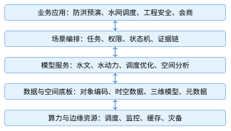

# 线上拓展专题

本页内容不印入纸质教材，是正文拓展层的延伸阅读，供课程设计、毕业设计和自学使用。各节开头注明对应的正文位置；先完成正文相应小节，再阅读这里的展开内容。

## 数字孪生平台的工程化细节

**对应正文**

第6章6.4节（数字孪生水利平台架构概览）与第8章8.5节（数字孪生水利平台案例）。正文保留概念、分层、数据与模型、闭环与契约、典型场景和运行值守的主线；本节收录跨层契约的完整论述、验收检查项、课程项目迭代和发展方向。

### 跨层契约与架构演进

每层的接口文档都应写明输入、输出、失败响应与责任主体。物理对象层提供资产目录、设备状态和工程边界；感知连接层提供带事件时间的原始消息与接入证据；数据底板层提供经过质量码标记的可查询数据产品；模型与知识层提供带适用范围和不确定性的计算结果；服务层提供查询、预警、预演和调度建议；交互应用层提供证据浏览、人工确认和操作回执。任一层缺少版本或责任字段，上一层的正确性都无法传递到下一层。

契约应同时覆盖正常流和失败流。正常流中，网关接收带有对象编码和事件标识的观测，质量服务完成单位、时间和范围校验，数据底板写入不可变原始记录，模型服务读取符合条件的数据快照，业务服务生成带证据的预警或方案，应用层显示并等待授权操作。失败流中，缺少对象编码的消息进入隔离队列，单位错误被标记为可疑，关键测点缺测使模型降级或停算，模型超时返回可解释的不可用状态，权限不足只返回允许范围内的数据。每一种失败都要有稳定错误码、责任角色和恢复动作，不能把异常堆栈直接当作业务提示。

架构评审可采用“数据向上、指令向下、证据贯穿”的三条线。数据向上检查采集、质检、存储和模型输入是否保持同一对象编码、时间基准和质量语义；指令向下检查建议、审批、执行和回执是否经过权限、有效期和设备状态校验；证据线横向关联原始观测、模型运行、规则版本、界面操作和工单结果。三条线交汇处就是平台的审计边界：例如某次闸门调度建议既要能追到降雨情景和预报运行，也要能追到审批人、设备回执和执行后的水位变化。

平台演进应优先扩展契约，再替换实现。把单工程场景扩展到流域时，新增的是河网拓扑、断面、预报模型和影响对象目录，原有测点、质量码、事件时间和权限语义仍然有效；把本地三维场景扩展到地球级浏览时，增加的是大范围坐标、瓦片服务和LOD策略，业务对象编码和时间窗不能因切换引擎而改变。若某个新模块要求修改既有字段含义，应发布新的契约版本，同时保留一段兼容期并记录迁移规则；直接复用旧字段承载新语义，会让历史数据和新结果无法比较。

模型、数据和前端的发布节奏也应解耦。模型服务可以先影子运行，使用真实输入生成不影响生产的结果；数据底板可以先扩展字段，旧客户端继续读取兼容视图；前端可以先增加“模拟”标签和版本显示，等待后端接口正式开放。发布单要列出依赖关系、回滚条件和观测指标，运维员依据指标逐步放量。发生异常时，先停止新版本进入决策链，再保留已经产生的预警和工单，最后按输入快照和版本号重放，判断异常来自数据、模型还是界面。

跨层契约还决定课程项目的分工方式。负责三维场景的学生提交对象编码、坐标转换和加载错误证据；负责数据服务的学生提交质量检查、时序查询和幂等写入证据；负责模型的学生提交输入快照、模型卡和不确定性说明；负责业务闭环的学生提交预警、工单、审批和回执证据。各组以同一组样例数据和同一追踪号联调，任何一组都不能用手工复制的“演示数字”替代接口调用。接口检查通过后，各组再组合运行；出现失败时，按追踪号核对相关层的输入与输出，确定需要修改的模块。

架构设计还要明确哪些状态可以自动推进，哪些状态必须等待人工确认。数据接入和质量标记属于可自动化的机械步骤，但“是否进入风险评分”应由质量规则和模型契约共同决定；模型运行可以自动排队和重试，但模型结果进入预警或调度建议前要检查适用范围和输入快照；预警事件可以自动生成，但高风险处置、闸门命令和预案启用必须由授权角色审批。把自动步骤和人工步骤写成状态机后，系统才能在界面上给出“待复核、已批准、执行中、待回执”等明确状态，而不是用一个“完成”字段掩盖责任交接。

跨层接口的时间语义尤其容易被忽略。采集设备的事件时间用于重建现场事实，网关接收时间用于衡量链路延迟，模型开始和结束时间用于衡量计算资源，人工确认时间用于衡量处置时效。四类时间都要保留，不能把接收时间覆盖事件时间，也不能把页面刷新时间当成模型结果时刻。发生迟到数据时，系统按事件时间判断是否需要重算；发生模型超时时，系统按处理时间触发降级；发生审批超时时，系统按业务有效期升级值守任务。时间字段的分工一旦写入契约，跨服务日志才具有可比较性。

空间语义也应沿层传递。物理对象层保存工程坐标和对象关系，数据底板同时保存水平CRS、高程基准和转换版本，模型输入输出保留计算网格或断面坐标，服务层返回对象编码与空间范围，应用层才把它们转换成局部原点、地图瓦片或三维屏幕位置。任何一层改变坐标，都必须在结果中写出转换记录；如果只在前端拖动模型使其“看起来对齐”，后端查询、剖面分析和监测点回放仍会使用错误位置。架构验收应选择至少一个测点和一个工程构件，依次核对原始坐标、标准坐标、局部坐标、三维拾取及反向查询的结果。

当平台需要接入新模型或新数据源时，先做契约评审，再做适配器开发。评审清单包括对象编码映射、时间基准、单位和质量码、输入输出版本、错误与超时、权限和审计、性能预算以及回滚方案。适配器负责把外部格式转换为平台规范，不把外部字段直接泄露到业务页面；对于无法映射的字段，进入扩展属性并在数据字典登记。这样，模型可以替换、数据源可以增加、三维引擎可以升级，而既有预警、工单和审计记录仍能按原语义读取。

最终的架构验收以业务证据为中心组织。抽取一条观测事件，验证它能从接入日志追到质量结论、状态版本、模型输入、风险结果、人工确认、指令回执和复盘记录；再制造一条重复消息、一个单位错误、一次模型超时和一次无权限命令，验证系统分别给出幂等忽略、可疑标记、降级结果和拒绝审计。正常用例检查输出是否符合预期，失败用例检查处理停止的位置、恢复步骤及对应责任人。第8章的案例实现沿用这套证据链，读者可在8.5.14节看到端到端脚本和阶段门禁的具体写法。

可以用一次“连续降雨后渗压变化”的演算检查双向闭环：雨量事件上行后，质量服务标记时间窗和数据完整性，模型服务根据水位与渗压快照计算趋势，预警服务给出带可信状态的结果；值班员确认后生成工单，若需要调度则由审批人选择方案并下发命令，设备回执和新的水位、流量又沿数据链上行。每一步都保留追踪号和版本，才能在复盘时回答“当时看到了什么、依据哪一版模型、谁作了决定、执行后发生了什么”。这组记录对应连接维的数据与反馈过程，可用于检查模型建议、人工决策和设备执行是否一致。 联调时还应验证这一路径的失败分支：人为制造迟到观测、模型超时和审批拒绝，检查状态是否停在正确节点，并核对恢复后是否补齐证据。通过同一追踪号比较正常与失败两条路径，学生能够把抽象的五维关系落实为可观察的系统行为。 验收报告应附状态转移、输入输出快照和责任签名，便于跨角色复核；复核记录写出模型版本、数据窗口、异常处置人、复核时间与责任角色。责任角色未签名时，验收状态保持“待复核”，不进入正式发布；状态变更、签名和发布动作使用同一追踪号关联，并由审计角色独立复核。证据链完整，系统结果才可进入正式业务处置。

### 各小节的补充要求

**模型变更流程**

模型变更遵循“开发—离线验证—影子运行—评审—发布—监控—回滚”流程。影子运行让新模型接收真实输入但不影响生产决策，可比较新旧结果并发现边界工况。模型审批记录与软件发布记录共同构成审计证据。

**单位与时区**

单位转换在数据标准层集中完成。例如水位统一为米、流量统一为立方米每秒；接口仍携带单位字段。阈值和模型参数必须声明所用单位，禁止依赖开发者记忆。时区统一存储为带偏移的时间或UTC，界面按用户时区显示。

**三维交互的补充要求**

三维界面应帮助用户定位对象、理解状态和获取证据。对象选择后显示稳定业务名称、编码、数据时刻和质量状态；颜色表达必须配合图例、文字或图标，不能只用红绿色区分风险。对键盘操作、字号和对比度也应进行基本无障碍检查。

时间轴允许回看任一历史状态，但必须区分“当时已知的数据”和“后来补录后重算的状态”。若回放使用了后来数据，界面应标注为修订视图，防止把事后计算结果误认为当时决策依据。

空间查询同样需要证据边界。淹没范围、影响人口或工程数量由特定模型和数据版本计算，界面点击统计数字时应能打开其空间范围、过滤条件和生成时间。截图只能作为沟通材料，正式结果应保留可查询数据和生成记录。

三维性能下降时优先保证业务信息可达。模型可降级LOD或切换二维地图，告警列表、数据表和处置入口仍应可用。通过这种渐进增强，三维场景不会成为整个业务系统的单点故障。

**契约测试**

接口契约需通过自动化测试验证，包括必填字段、单位、时区、枚举、重复事件和乱序事件。契约文档与代码同步版本化，避免不同团队凭口头约定解释同一字段。

**方案比选的展示要求**

方案比选至少展示目标、约束、模型版本、边界条件、关键断面过程和风险指标。任何调度建议都要保留输入快照；预报更新后重新计算时，新旧方案不能混用同一编号。

表中“反馈”环节将调度执行后的实测水位和流量送入状态更新，并保留原预报结果供误差比较；若执行回执缺失，系统只能把方案标记为“已批准、待回执”，不能假设闸门已经按计划动作。预报模型的误差评价关注洪峰、峰现时间和过程拟合，调度模型的评价则关注约束满足、供水缺口、生态下泄和下游风险，两类指标分开统计后才能判断是预报误差还是方案执行偏差。

**部署设计要点**

部署设计需明确网络分区、离线时长、数据补传顺序、模型降级和灾备目标。例如模型服务不可用时，平台仍应展示经质检的实时数据和已批准阈值规则；不能把整个监控能力绑定在单一模型上。

**安全测试**

高风险控制采用职责分离：分析人员提出建议，授权人员审批，执行系统校验有效期和设备状态。系统不得因“自动化”跳过工程运行规程。紧急手动操作也要在恢复后补录原因和结果。

安全测试包括越权访问、令牌失效、重放、消息篡改、接口限流和审计完整性。三维前端同样属于攻击面，模型文件、纹理和属性数据要进行来源校验，避免把不可信脚本或敏感属性直接交付浏览器。

**可观测性与值守的补充要求**

平台上线后，运行团队必须回答三个问题：当前服务是否可用，当前数据是否可信，当前模型结果能否用于业务。仅监控CPU和内存无法回答后两个问题，因此需要把服务、数据、模型和业务闭环统一纳入可观测体系。表6.15从服务、数据、模型、业务和安全五方面列出指标，分别检查服务可用性、数据新鲜度与完整性、模型适用范围、预警处置进度，以及权限与审计异常。CPU和内存正常时，仍可能发生断报、模型越界或工单积压，需要逐类观察。每条关键链路应配置服务级目标（Service Level Objective，SLO），并明确统计窗口、允许失败比例、告警责任人和处置时限。

数据血缘记录数据集从来源到结果的变换关系。每个血缘节点应包含来源标识、时间范围、处理规则版本、输入与输出校验摘要、执行状态和责任主体；模型结果还要关联模型卡、参数集和运行环境。采集、计算和发布流程应自动将血缘记录写入元数据存储，并能从三维对象或告警详情反向查询。

值守界面应按影响范围和紧迫程度合并告警，避免同一根因产生大量重复提示。告警必须包含对象、发生时间、当前值、质量码、触发规则、推荐动作和确认入口；抑制、合并或关闭告警也要保留操作者与理由。交接班记录尚未恢复的数据源、降级中的模型、未闭环工单和临时权限，防止信息只停留在即时通信中。

当数据质量或模型表现持续低于阈值时，系统应自动降低结果可信等级，必要时退出自动推荐，但仍保留原始数据、二维地图和人工规程。恢复正常不能只看服务重新启动，还应完成积压补传、时间顺序校验、状态重算、告警去重和责任人确认。值守人员核对这些恢复记录后，才能确认数据、模型与业务处置已恢复到可用状态。

### 验证、验收与持续改进

验收需要将数据、空间、模型、服务、反馈过程和运维指标对应到具体输入、版本、责任人与复核结果。案例水库的失效降级步骤、验收脚本和阶段门禁见8.5.14节，可用于检查各项结果是否能够重复获得。

数字孪生验收既包含软件质量，也包含数据和模型可信度。建议分为数据、空间、模型、服务、闭环和运维六类指标。表D.1列出这六类的具体检查项。每项结果都应附可复查的记录。例如模型精度检查需列出检查数据、适用工况、误差指标及其与验收限值的比较。

**表 D.1  数字孪生平台验收检查项**

| 类别 | 检查项                           | 证据                   |
|:-----|:---------------------------------|:-----------------------|
| 数据 | 完整率、时效、单位、质量码、血缘 | 抽样记录与异常处置日志 |
| 空间 | CRS、高程基准、控制点、模型对齐  | 校核报告与同名点误差   |
| 模型 | 适用范围、参数、校准、回放结果   | 模型卡、版本和测试数据 |
| 服务 | 可用性、延迟、错误处理、权限     | 压测、安全测试和监控   |
| 闭环 | 告警到工单、指令到回执、责任追踪 | 演练记录与审计链       |
| 运维 | 备份、降级、灾备、变更和回滚     | 运维手册与恢复演练     |

上线前使用历史典型洪水、设备故障和缺测场景回放；上线后持续统计模型残差、告警准确性、处置时长和数据质量。改进必须经过版本化、测试、审批和回滚准备。

### 课程项目实施路线

课程项目按对象与坐标、场景绑定、模型服务、业务处置的顺序推进，每轮提交代码、数据样例与运行记录。案例水库的端到端实现、验收脚本和分阶段交付见8.5.12节，可用于核对各轮成果的接口和验证步骤。

课程项目不要求一次实现完整流域数字孪生，可分四次迭代，每次形成可验收成果。表D.2把四轮的任务、交付物和验收重点逐行列开。各轮成果依次提供后续实现的输入：对象编码和数据字典支撑三维定位，空间与观测状态为模型提供输入，模型事件再进入处置流程。选用经验公式时也需记录其适用条件，并验证输入与结果。第一轮建立对象编码、空间基准和数据样例；第二轮完成三维场景与状态绑定；第三轮接入一个模型或规则并形成事件；第四轮完成处置闭环、测试和演示。

**表 D.2  数字孪生课程项目的四次迭代**

| 迭代 | 主要任务                          | 交付物             | 验收重点               |
|:-----|:----------------------------------|:-------------------|:-----------------------|
| 一   | 场景选择、对象编码、CRS与数据字典 | 范围说明、数据样例 | 边界和元数据完整       |
| 二   | 加载GIS/三维模型、绑定对象状态    | 可交互页面、映射表 | 定位正确、异常可见     |
| 三   | 实现质检、规则或简化模型          | 模型卡、结果事件   | 输入契约、版本可追踪   |
| 四   | 告警处置、审计、测试和降级        | 演示系统、验收报告 | 闭环可复现、失败可降级 |

团队角色可分为数据/空间、前端场景、后端服务和测试集成，但接口与对象编码必须共同评审。每次迭代使用同一组场景用例，避免各成员分别制作无法拼接的演示。

最终演示应包含正常流、数据质量异常、模型不可用和无权限操作四类场景。验收报告记录输入文件、运行版本、操作步骤、预期和实际结果，使其他小组能够复现，而不仅是录制一段成功视频。

### 发展重点

数字孪生的持续改进可从模型可信度、语义互操作、云边协同、事件处理、人工决策支持和安全六方面展开，并分别设置验证指标。

模型可信度与不确定性表达，衡量的是模型卡是否记录了适用范围与已知失效条件，以及预报结果能否给出区间而不只是一个数；验证方式是用历史场景回放，统计实测值落在给出区间内的比例。跨系统语义互操作，衡量的是同一座水库在不同系统里的编码、名称和特征水位是否一致；验证方式是抽取若干工程做跨库比对，冲突数应当趋近于零。云边协同，衡量的是断网期间边缘侧能否继续采集与本地判断、恢复后数据是否按事件时间正确回补；验证方式是拉断网络若干分钟再接上，检查有无缺测空洞和重复入库。

面向事件的实时数据处理，衡量的是从观测到达到预警生成的端到端时延，以及消息积压在汛期峰值下的恢复速度。人在回路的决策支持，衡量的是每一条进入执行的指令是否都能回溯到审批人、依据的模型版本和输入快照。网络与数据安全，衡量的是权限越界尝试能否被拒绝并留痕、密钥能否在不停机的情况下轮换。

将上述方向列入建设方案时，还应给出指标的统计窗口、测试数据和失败条件，以便比较实施前后的效果。

### 底板与算法解耦

可复制的平台把空间底板、业务数据、模型算法和应用编排分开。更换洪水模型时，不应重新制作工程模型和用户体系；新增工程时，通过元数据和适配器接入，而不是复制一套源码。

图D.1把四者的解耦关系画了出来。检验解耦是否成立有个简单办法：设想更换洪水模型，数一数需要改动的模块——如果空间底板和用户体系也要跟着改，说明分层只停留在文档里。

<figure markdown>

<figcaption>图 D.1  数字孪生水利平台的解耦分层</figcaption>
</figure>

### 数字孪生平台的技术路线对比

**对应正文**

第8章8.5.4节（数字孪生水库矩阵与“四预”）。

数字孪生平台可以从不同的工程起点形成技术路线。以厂商手册为参考的产品集成路线，通常先把流域、水网和工程入口组织成统一门户，再把模型运行、预演任务和工单闭环接到同一套权限与审计机制中。这种路线的优点是业务人员容易按照场景进入系统，适合在已有平台上快速建立可演示、可操作的流程；它的边界是产品中的对象编码、数据质量规则和模型适用范围仍需项目团队重新核验，手册中的示例数据也不能直接替代真实工程数据。

以公开标准和数据底板为中心的路线，则先确定对象目录、时空基准、数据交换协议、元数据和版本规则，再把不同厂商或不同专业模型作为可替换服务接入。它有利于长期积累和跨系统交换，但前期需要投入更多的目录治理、接口设计和质量校验工作。

以数字孪生流域或区域治理为牵引的路线，强调跨工程的联合预报、影响分析和调度协同，重点解决数据范围大、模型链条长和多部门协作的问题；其验收不能只看单个三维页面，而要检查情景输入、模型版本、结果证据和处置回执是否能够闭环。

项目定制路线则围绕某一类水库、水闸或河段的规程和业务动作构建，能够精确贴合现场，但需要用清晰的扩展点避免把一次性约定固化为全行业标准。

四类路线可以组合使用：厂商方案是其中一种实现的参考，公开政策和行业样本提供业务边界，标准化底板提供交换约束，项目规则负责把模型结果转成可审批、可追溯的行动。教学案例采用这种分层比较方式，目的在于训练方案选择和证据核验能力，而不是评价某个产品的优劣。

## 生产环境的认证与安全细节

**对应正文**

第5章5.6节（Spring Security 6与JWT）。正文保留威胁模型、账户与浏览器安全要点和代码审查清单；本节收录密钥生命周期、撤销与重放、认证可观测与演练、令牌失效与会话迁移的完整论述，以及账户、浏览器存储和权限建模的原文。

### 密钥生命周期与配置管理

HMAC 密钥必须来自受控密钥管理器或部署平台的机密变量，应用配置只保存变量名和密钥版本。启动时校验 Base64 可解码、长度满足算法要求、issuer 非空且当前版本处于有效窗口；校验失败立即阻止实例接收流量。日志只能输出密钥版本和摘要，不能输出密钥本身、完整 JWT 或配置对象的`toString`。

密钥轮换分为准备、双读、切换和退役四步。准备阶段生成新密钥并登记版本；双读阶段验证器按令牌头部的`kid`选择旧或新密钥，但签发只使用新密钥；切换阶段撤销异常版本并观察认证失败率；退役阶段等待最长刷新令牌寿命加时钟容差后删除旧密钥。若令牌没有`kid`，轮换时只能按时间窗口尝试有限的候选密钥，并应在下一次签发中补上版本标识。

### 密码、账户与登录防护

密码存储使用 Spring Security 的`PasswordEncoder`，例如 BCrypt 或 Argon2，并由安全基线规定成本因子。数据库只保存哈希、算法版本、修改时间和失败计数，不保存明文或可逆加密后的密码。登录成功后清零失败计数并记录设备和追踪 ID；连续失败触发指数退避或临时锁定，解锁由风险策略决定。管理员重置密码时应递增账户令牌版本，使旧访问和刷新令牌全部失效。

认证异常的外部表现要统一。用户名不存在、密码错误、账户停用和二次认证失败都返回相同的401描述，详细原因只写入受控审计；资源存在性检查在权限判断之后执行，避免未授权用户通过404/403差异推测测站编号。审计事件记录主体、客户端、时间、结果码和关联的`jti`，但不记录密码、Authorization 头或完整刷新令牌。

### CSRF、CORS 与浏览器存储

本章过滤链关闭 CSRF 的前提是 API 只从 Authorization 头读取 Bearer 令牌，且访问令牌不由浏览器自动附带。如果改用 HttpOnly Cookie 保存凭据，浏览器会自动发送 Cookie，必须启用 CSRF 令牌或采用双重提交方案；把 Cookie 标记为 HttpOnly 只能降低脚本读取风险，不能阻止跨站请求本身。SameSite、Secure、过期时间和域路径应与部署拓扑一起评审。

CORS 预检请求只是在浏览器侧询问“是否允许这个源访问”，服务端仍要执行身份认证和方法授权。生产环境把来源列入白名单，明确允许的方法、请求头、暴露头和缓存时长；不能因为预检失败就放开`*`，也不能把 CORS 当作防火墙。非浏览器设备、Kafka 消费者和内部任务不受 CORS 保护，仍需使用服务身份和网络策略。

前端存储策略要根据威胁模型选择。内存存储能缩短刷新后的暴露时间但页面刷新会丢失；`sessionStorage`限定标签页生命周期，却仍可能被同源脚本读取；`localStorage`便于持久登录但一旦发生 XSS 会长期暴露。更高要求的系统可以把刷新凭据放入受保护 Cookie，将短期访问令牌保存在内存，并配合 CSP、依赖审计和严格的 DOM 写入规则。无论选择哪种方案，网络日志、错误监控和浏览器历史都不应包含令牌。

### 权限建模与最小授权

权限代码要表达稳定能力而不是界面按钮。例如`STATION_READ`允许读取测站，`READING_WRITE`允许写入读数，`ALERT_ACKNOWLEDGE`允许确认预警；“值班员”“专业分析员”“审批人”和“运维员”是角色，角色到权限的映射由服务端配置管理。资源范围还要单独检查：拥有读数写入权限不代表可以修改所有工程或归档记录。

方法级注解适合表达粗粒度能力，细粒度的测站归属、时间窗口和状态迁移放在应用服务。授权判断失败应保持无副作用，不能先保存实体再检查权限；批量接口要逐条验证资源范围，避免一条请求越权覆盖其他测站。权限增加采用向后兼容策略，权限删除或含义改变则发布版本化变更，并在审计中记录授权策略版本。

### 撤销、重放与故障降级

撤销服务不可达时，系统必须事先确定“安全失败”还是“可用优先”。对写入、密码修改和预警处置等高风险操作应拒绝请求并返回503，读取公开状态可以使用短时间缓存但要标记缓存时间。Redis 黑名单记录应带 TTL，TTL 至少覆盖令牌剩余寿命；用户版本号变更要通过事务更新并在缓存失效后最终一致。撤销接口本身需要认证、幂等和审计，不能让任意客户端提交 jti 即可封禁其他用户。

重放检测不仅适用于刷新令牌，也适用于一次性登录链接、密码重置链接和设备注册码。服务端保存随机值的哈希、主体、用途、首次使用时间和过期时间；第一次消费后原子地标记已用，重复消费返回统一错误。消息或 HTTP 重试必须携带请求 ID，不能通过比较请求到达时间猜测是否重复。检测到同一刷新会话族的异常重放时，可撤销该用户全部会话并通知运维复核。

### 认证链路的可观测性与演练

安全指标包括401/403比率、签名失败、issuer/type 不匹配、刷新成功率、撤销查询延迟、Redis 错误、密钥版本分布和账户锁定次数。指标标签不能使用完整用户名、令牌或高基数的原始 URL，避免监控系统本身泄露隐私。日志采用结构化字段记录`traceId`、主体哈希、jti 哈希、权限结果和策略版本；审计日志单独存储并设置保留和访问权限。

演练应覆盖密钥误配、Redis 故障、旧密钥退役过早、时钟漂移、刷新令牌重放和网关错误转码。每次演练记录检测时间、拒绝比例、恢复步骤和未覆盖的请求类型；恢复后检查旧令牌是否仍能访问、黑名单是否增长异常、缓存是否持有过期权限。演练结果应能说明每种故障影响了哪些请求、哪些操作被拒绝，以及恢复后如何重新验证权限。

接口契约中还应明确 Authorization 头的大小上限、令牌格式、401/403/429/503 的响应结构和重试建议。网关负责基础限流，应用服务负责账户和 jti 级别的风控，数据库负责审计唯一性；三层职责不能互相假定。发布前使用自动化扫描检查依赖漏洞、弱密钥、调试端点和错误日志，人工复核权限矩阵与数据范围。这样，学生可以把安全实现从一段过滤器代码扩展为可部署、可轮换、可审计的系统能力。

### 令牌失效与会话迁移

退出登录需要同步处理浏览器保存的令牌和服务端会话。客户端应清除内存中的访问令牌、撤销当前 refresh jti，并在下一次请求收到401时停止自动重试，避免失败请求形成循环。服务端注销接口验证当前 refresh 会话的主体和设备范围，再写入撤销记录；管理员强制下线则递增账户版本并记录原因。多个终端同时在线时，注销一个设备不应误伤其他设备，除非操作明确选择“退出全部会话”。

会话迁移要考虑密钥轮换和权限变更。权限从“可写入”降为“只读”后，已签发的短期 access token 仍可能在剩余寿命内携带旧权限；高风险权限可以采用更短的 access 有效期、实时版本检查或敏感接口再次查询账户状态。普通读取允许短暂使用令牌声明以降低延迟，但预警确认、规则发布和测站配置修改应在服务层执行最新权限检查。

令牌解析失败的错误分类只用于内部指标，不直接返回给客户端。签名失败、过期、issuer 不匹配、type 错误和撤销状态分别计数，响应统一为401；权限不足返回403；触发账户或 IP 限流返回429并给出重试时间；密钥服务或撤销存储不可用返回503。这样既不给攻击者提供试错反馈，又让运维能从指标判断是密钥配置错误、时钟漂移还是恶意重放。

刷新端点要限制调用频率和来源，不能接受跨域任意站点的请求体。客户端只在访问令牌临近过期或收到明确的401时刷新一次，使用互斥锁合并并发刷新，避免多个请求同时消费同一个旧 refresh jti。服务端轮换成功后返回新令牌对和过期时间，客户端只保留最新一对；如果轮换失败，清除本地凭据并要求重新登录，不能继续使用已经被撤销的旧令牌。

审计数据要区分“认证事件”和“业务操作”。登录成功、登录失败、刷新、撤销、密钥切换属于认证事件；创建读数、确认预警、修改配置属于业务操作。两类事件共享 traceId 和主体，但保留不同的保留期限、访问角色和脱敏规则。审计表设置事件 ID 唯一约束，写入失败时按照 5.4 节确立的事务边界决定回滚主操作、写入发件箱或进入人工补偿，不能静默丢失。

安全配置应在启动检查和运行检查中分别验证。启动检查确认 issuer、密钥版本、撤销存储地址和 CORS 白名单存在；运行检查周期性验证密钥即将过期、Redis 延迟、刷新失败率和时间同步偏差。健康端点可以报告“认证依赖不可用”，但不能在响应中泄露密钥版本之外的敏感配置。发布流水线在切换流量前先调用认证探针，验证合法令牌、非法签名和撤销令牌的三条路径。

在多服务部署中，不同服务是否共享 JWT 签名密钥要有明确决策。共享密钥便于验证但扩大泄露影响，任一服务都能伪造其他服务信任的令牌；公钥验证和集中签发可以缩小签名权限，服务只持有验证公钥，签发服务通过安全通道保护私钥。无论采用 HMAC 还是非对称算法，issuer、audience、算法白名单和密钥版本都写入契约，禁止根据令牌头部的算法字段动态信任未知算法。

最后，教材示例中的安全代码必须配套“不能做什么”的检查清单：不手工 Base64 解码后信任 Claims，不使用未验签的解析 API，不把 refresh 当 access，不把密钥放在前端变量或 Git，不在异常中回显完整令牌，不用 CORS 放宽替代权限，不在过滤器里执行数据库写事务。代码审查、自动化测试和部署演练共同覆盖这些边界，学生才不会把一个能运行的 Demo 误当作生产级认证系统。

## 前端认证联调的测试与故障复盘

**对应正文**

第4章4.5.7节（登录与受保护接口的前后端联调）。正文保留错误状态的前端处理矩阵（表4.7）；本节收录状态机测试设计、字段兼容、代理与存储、故障注入式验收和联调记录归档等展开内容。

认证联调的难点往往不在“能否登录”，而在多个请求同时发生、页面刷新和网络抖动时是否仍然保持同一套状态语义。测试设计应先画出状态机：匿名、已登录、令牌即将过期、令牌已过期、权限不足和服务不可达是六种不同状态；每种状态都要规定界面文案、是否保留原路径、是否允许重试以及日志中应出现的事件。比如匿名用户访问测站详情，守卫保存`redirect=/assets/DAM-A-PZ-07`并跳转登录；登录成功后只恢复一次导航；如果后端返回 403，则停留在业务页面并显示权限说明，而不是再次跳到登录页。

请求并发时的“竞态覆盖”已在 4.5.4 节用清单4.31处理；自动化测试可以让第一个模拟请求延迟 200 毫秒、第二个只延迟 20 毫秒，再快速调用两次`showAsset`，断言页面最终文字属于第二个对象、第一个请求收到取消信号。

前后端对字段的兼容要采用“先增加、后切换、再清理”的节奏。后端新增`qualityFlag`时，可以在一段时间同时返回旧字段和新字段，前端先读取新字段、缺失时回退旧字段，并在日志中统计回退次数；确认所有客户端已经升级后再删除旧字段。删除字段前要检查缓存、导出任务和消息消费者，不能只在 Swagger 页面中看到接口变更就直接发布。日期时间统一使用带时区的 ISO 8601 字符串，数值单位写进字段说明，枚举值变化则由版本化接口或兼容映射处理。

本章的联调案例以水利工程安全监测平台为背景，但验收方法可以迁移到其他水利业务。无论是测站读数、告警处置还是工程巡检，均可沿“输入契约—认证上下文—业务状态—持久化结果—界面反馈”五个问题追踪。发生故障时先用`traceId`把浏览器 Network、网关访问日志、应用日志和数据库审计串起来，再判断属于前端状态、网络转发、认证授权还是领域规则；不要一看到页面空白就修改 CSS，也不要一看到 401 就延长令牌有效期。保存请求标识与定位结果，修复后再执行同一操作，核对故障是否消失及其他状态是否正常。

开发代理与生产环境的跨域配置需要分别检查。浏览器向开发服务器发送同源请求，再由代理转发到后端；生产环境的允许来源、允许方法、允许请求头和是否允许凭据必须由网关与后端共同约定。带 Authorization 头的请求会触发预检，服务端应正确响应`OPTIONS`，但不能因为预检通过就跳过真正请求的认证。`Access-Control-Allow-Origin:*`与带凭据请求不能同时使用，允许来源也应是配置白名单而不是反射任意`Origin`。发现“浏览器报跨域、curl 正常”时，应分别检查预检响应、实际响应和网关是否丢失认证头。

令牌存储还要与页面威胁模型匹配。`sessionStorage`便于教学演示和标签页隔离，但同源脚本可以读取它；HttpOnly Cookie 能阻止脚本直接读取令牌，却要求服务端设置 SameSite、Secure 和 CSRF 防护。无论采用哪种方式，都不能把访问令牌放在 URL、页面标题或埋点参数中。浏览器控制台只输出状态码、错误码和追踪 ID，服务端日志对令牌做哈希或只记录 jti。前端构建产物中也不能出现 JWT 签名密钥、数据库连接串和内部网段。

认证性能要从令牌解析、撤销查询和业务查询三个阶段测量。每次请求都访问远程撤销存储会增加延迟，完全不查撤销又无法快速吊销泄露令牌；可按风险把访问令牌设为短期，把 jti 撤销集合缓存到 Redis 并设置与令牌 exp 对齐的过期时间。权限代码应使用稳定枚举，角色展开在服务端完成，前端只用于隐藏不应操作的控件，不能以“按钮不可见”代替后端授权。批量读取测站时，后端还要限制单次资源数量和查询时间窗口，避免一个合法令牌成为高负载接口的放大器。

发布前可以进行一次“故障注入式”验收：把响应状态依次改为 401、403、404、409、429 和 503；把响应延迟设置为 100 毫秒、超时阈值和超时阈值的两倍；将令牌的 exp 调整到过去、将 issuer 改成错误值、删掉 permissions 字段；再让代理返回无效 JSON。每个场景都要记录页面是否可操作、是否产生重复请求、是否保存了原路径、是否有泄露敏感信息和是否生成唯一 traceId。每次注入故障后，页面都应保留可用操作、说明失败原因并提供恢复入口，同时将故障与正常水位、空告警结果明确区分。

当后端接口需要升级时，先在契约测试中锁定字段类型和枚举取值，再在前端适配层集中处理兼容逻辑。组件不要直接拼接 URL、读取 token 或解释状态码；它们调用经过封装的 API 函数，由适配层把后端错误转换为稳定的领域错误。这样，即使网关把路径从`/api`迁移到版本化前缀，或后端把分页字段从`total`扩展为`totalElements`，页面仍然只需替换一处适配代码。对案例水库这种值班系统，接口的可观测性和可回退性与视觉效果同样重要。

为了让联调结果可复现，还应固定测试数据和时间窗口。每个测站至少准备一条 valid 读数、一条 suspect 读数和一条 missing 读数，分别验证正常展示、可信等级降低和停止打分；告警处置单准备“待确认—已确认—已关闭”三种状态，检查不同角色能执行的动作。测试请求携带固定的`X-Request-Id`，响应日志保留该值、测站 ID、质量码和耗时，数据库审计记录再补充操作者和事务结果。将页面截图、接口报文、日志与持久化状态按请求标识关联，即可复查同一次操作在各层的结果。

联调完成后要删除调试开关和临时账号，复查构建产物中是否残留测试地址、令牌样本或密码字段。代码评审重点看三处：所有受保护请求是否统一经过请求封装，所有失败分支是否保持稳定错误码，所有涉及权限的后端方法是否有独立测试。验收时核对前端、网关、Spring Security 和数据库审计记录，确认同一用户的请求、权限判定与最终读写结果一致。

最后应把联调证据归档到版本化测试记录：记录前端构建版本、后端 Git 提交、数据库迁移版本、代理目标和测试账号角色，附上脱敏请求样例及关键日志的 traceId。下一次升级依照同一记录重放，就能判断问题是新代码引入还是环境漂移；对于值班系统，这种可追溯性比临时把页面“调到能显示”更重要。

在课堂练习中，学生可以先用浏览器开发者工具完成状态码和请求头观察，再用后端测试替身注入过期令牌、缺失字段和延迟响应，最后把结果写入联调表。练习评价不只看页面是否出现数据，还要检查是否正确区分认证、授权、网络和业务错误，是否保留了测站上下文，是否遵守令牌和个人信息的脱敏要求。

练习报告还应说明一次失败请求如何从页面回溯到服务端：先记录用户动作和路由，再记录请求方法、路径、状态码、响应错误码和 traceId，最后核对过滤器日志、业务日志与审计表是否指向同一操作者和测站。若链路中任何一段缺失，系统就难以在值班交接时复原现场。

定位联调故障时，可先用状态码判断请求结果，再用错误码查找业务原因；按 traceId 检索跨服务时间线，最后核对审计记录中的写入结果。值班员提交的测站编号、发生时间和页面提示，应能对应到这些记录。

在案例水库演练中，值班员先从测站列表打开详情，专业分析员随后提交处置意见，审批人确认后才允许关闭事件。三个角色看到的按钮、请求权限和审计结果必须一致；若任何一个角色在页面上看到可点击操作却收到 403，应回到路由元数据、后端方法授权和角色映射逐层核对。通过这种真实工作流走查，学生能把前端组件、JWT 权限和水利业务责任联系起来。

## 从业务约束到物理设计的完整推导

**对应正文**

第8章8.3.4节（从业务约束到物理设计的推导）。正文保留业务事实到字段、事务边界和索引推导三段；本节收录外键、枚举与数值约束、时序分区、连续聚合、备份、权限、模式演进、测试与文档的完整论述。

外键是数据库层最直接的业务保证。`warning.asset_id`要求预警必须指向仍可识别的工程对象； `work_order.warning_id`要求工单不能脱离预警凭空出现；模型运行不直接外键到每一条观测， 而是保存输入快照，因为一次运行可能读取聚合结果、多个测点和一组规则参数。若把模型输入硬编码成 若干外键，后续版本的输入范围难以重现。快照中的事件范围、质量过滤条件和查询版本必须写入可审计字段， 并在模型日志中登记哈希摘要。

枚举约束的价值在于让错误尽早暴露。质量码只允许 valid、suspect、missing，预警等级只允许 NONE、 BLUE、YELLOW、ORANGE、RED，工单和模型运行也各自拥有有限状态集合。前端可以提供友好文案，但不能 向数据库写入“正常”“蓝色预警中”等自由文本。新增状态先扩展接口契约、迁移脚本和统计口径，再修改 显示层；如果只改显示层，历史报表会出现同义词，统计无法按状态合并。

数值约束必须与测量物理意义相符。观测值允许为空只在质量码为 missing 时成立；温度、位移、渗压等 监测项的合理范围由测点类型和项目规则提供，通用表只负责保留数值和质量结论，不把某个工程的阈值 硬编码到所有测点。单位字段保留在观测行中，是因为设备更换或校准可能改变单位；单位注册表负责检查 一致性，历史数据不能因为后来修改注册表就失去原来的解释。修订时新增版本并携带原因，审计可以看出 从何值改到何值、谁批准、何时生效。

时序分区的核心是把时间局部性转化为物理局部性。查询最近一小时的测点，不应触碰数年前的块；归档 两年前的数据，不应锁住实时写入块。切块大小需要用代表性写入压测确定：块太小会让规划器管理大量 对象，块太大则使压缩和备份粒度变粗。哈希分区解决的是热点测点写入集中问题，不能代替时间维度；两者 同时使用时，要观察单测点查询是否因为跨分区而退化。生产配置和压测结果必须写入部署文档，不把例题 中的四个分区误当作全书固定参数。

连续聚合适合重复读取的统计结果，但不适合替换证据。预警计算可以读取十五分钟平均值以降低延迟， 但触发处置前要保留对应的原始窗口、样本数和质量分布。聚合刷新存在迟到数据，因此策略需要保留一段 回看窗口；通信链路补传超过窗口时，运维员应运行一次受控重算，并在`model_run`或变更日志中 注明时间范围。任何人都不能直接编辑聚合表来“修正报表”，修正应回到原始观测或重新运行聚合策略。

备份策略要同时覆盖结构、数据、权限和扩展。PostGIS 的空间列、TimescaleDB 的超表元数据、连续 聚合策略和角色授权缺一项都可能导致恢复后查询失败。全量备份之外还要保留增量或归档日志，并定期在 隔离环境恢复。恢复后按事件标识查询测点、原始观测、质量结论、预警记录、工单回执和模型输入， 再检查角色授权是否正确、新的时间块能否继续写入；任一项失败，都应记录恢复缺口。

权限设计遵循最小必要原则。采集角色只写观测和发件箱，质量角色可更新质量标记但不能修改原始值， 预警角色可创建和关闭预警，值班员可确认工单并提交回执，分析员可读取脱敏的历史数据，运维员才可 执行分区、压缩和恢复操作。数据库角色与应用角色一一对应，凭据存放在密钥服务中，代码和教材示例不 出现真实口令。审计日志至少保留角色、对象、操作、时间、请求追踪号和结果摘要，便于把数据库行为与 Kafka 消息、HTTP 请求和前端操作对应起来。

模式演进要优先考虑兼容。增加可空列通常可以向后兼容，删除列和改变枚举则必须经过观察期；大表添加 非空约束应先回填并验证，再分阶段切换。实体类和 DTO 不应复制一套互不相同的字段名，数据库字典是 唯一来源，代码生成或手工实现都应在代码审查中逐列核对。若后端需要把`asset`映射为 Java 实体，应保留`asset_id`、`geometry`和`metadata`的原语义，并对空间类型 明确转换策略；若 S3 生成示例数据，应按照同一编码规则和质量码集合生成，不能为方便而使用随机中文键。

测试要覆盖约束、查询计划和故障恢复三个层次。单元测试验证质量优先级和分类结果，集成测试验证外键、 唯一键、空间坐标系、超表写入和连续聚合，端到端测试验证从事件接入到工单回执的链路。性能测试使用 与目标测点规模相近的数据分布，分别记录高峰写入、最近查询、空间查询、预警队列和聚合刷新延迟。 故障测试包括消息重复、乱序、数据库短暂不可用、超表块压缩失败和恢复后重放；每个故障都要说明预期 质量码、状态转移和用户可见提示。

最后，数据库文档必须让不在场的同学也能复现。字段字典说明类型、单位、约束和示例值，迁移脚本说明 版本顺序和回滚边界，ER 图说明关系方向，查询练习说明输入参数和结果含义，运维手册说明备份、恢复、 压缩、保留和监控。课程项目验收时，学生提交一份从`event_id`出发的追溯报告，附执行计划、 质量统计、预警证据、工单回执和模型运行快照。报告中若出现“数据库里有记录但无法解释来源”，就说明 数据契约尚未闭合；若出现“界面显示正常但质量码为 missing”，就说明展示层没有尊重数据库语义。

实体映射与接口实现应沿用这组数据定义：对象表提供稳定编码，观测表保留时间与质量，预警和工单表 记录评估与处置，模型运行表保存输入快照和版本。实现时逐列核对Java类型、JSON字段和数据库约束， 再用查询练习检查相同输入是否得到一致结果。

在课堂演练中，可以把一次数据异常拆成四个观察窗口。第一窗口查看接入消息，确认事件 ID、测点编码 和发生时间是否完整；第二窗口查看质量服务，确认缺测、单位错误、范围异常、时序倒置和重复事件是否 分别留下原因；第三窗口查看数据库，确认原始观测只追加、预警证据包含规则版本、工单具有责任角色和 时限；第四窗口查看前端，确认“无预警”“蓝色关注”和“未评估”使用不同文案和颜色。四个窗口的记录 必须能够用追踪号互相定位，单独看某一层的截图不能代替链路证据。

数据库容量规划也应从测点数量、采样周期和保留期限推导。估算时先计算每天的事件行数，再加入索引、 JSONB 证据、备份副本和压缩后的增长系数；写入峰值还要考虑设备同时上线、补传和消息重投。估算结果 只用于容量初始值，最终仍要用接近生产分布的回放数据压测。压测不仅看平均吞吐，还要记录第九十五和 第九十九百分位延迟、锁等待、超表块数量、连续聚合刷新滞后以及故障重试后的积压恢复时间。

当项目需要接入新的监测项时，先在数据字典登记名称、单位、精度、采样周期和质量规则，再创建或复用 测点类型；不要直接在 JSONB 中写一个未经登记的键。新增字段若会参与预警、统计或模型输入，必须同步 更新接口契约、索引评估、备份清单和验收查询。这样做虽然增加了前期沟通，却能避免后期出现“报表有一 列、接口没有一列、模型又按另一列计算”的隐性分叉。

数据库契约还应服务于教学复盘。学生可以从事件追溯查询出发，逐个删除或改变查询条件，观察外键、质量 码、状态和索引如何影响结果；也可以故意发送重复事件、未来时间戳和缺少单位的记录，验证系统是否在 正确的位置拒绝或标记。实验报告要写清“哪一层发现问题、哪一层保存证据、哪一层向用户解释”，而不 只是贴出一条 SQL 的执行结果。将观察结果对应到外键、状态约束和查询条件，说明各项约束的作用。

工程交付时还要把数据库契约交给不同角色共同评审：业务人员检查字段是否能表达处置流程，测量人员 检查单位和精度，开发人员检查实体与 DTO 映射，运维人员检查分区、备份和恢复，安全人员检查角色与 审计范围。评审结论写入版本记录，后续修改沿用同一流程。进入实际项目时， 字段类型、关系与约束可作为设计起点；工程阈值、角色授权、分区规模和保留期限应按项目规程、审批结果 与压测数据重新核定。

因此，数据库评审记录应成为发布包的一部分，与代码、配置和数据样例共同归档，并在每次迁移后更新。 归档内容还应包含执行计划、失败重试记录和恢复演练的校验结果，保证后来接手系统的人员能够复现设计 依据并核对变更后的查询结果与性能。这些材料同时构成课程答辩的证据链：学生在报告中引用对应的 迁移版本和查询清单，并注明每条证据的生成时间，评审者即可逐项复核。

数据库设计还要考虑数据进入系统之前的契约校验。网关收到消息时先检查事件标识、测点编码、发生时间、 单位和载荷格式；缺少任一必填项就进入拒收或隔离队列，并保留原始报文摘要。通过校验的消息再进入质量 服务，质量服务依据测点类型读取量程和单位注册表，生成 valid、suspect 或 missing 质量码。这个顺序 可以把“消息格式错误”和“数值虽然可解析但不可信”区分开，后续统计和预警才不会把两类问题混为一谈。

观测写入采用追加式版本模型，会牺牲少量存储空间，却换来清晰的审计边界。设备重传同一事件时，唯一 事件键保证幂等；人工确认量程或修复时间戳时，新增版本并在修订原因中说明依据。查询最新值必须明确 按版本和事件时间排序，报表若要重现过去状态，则读取指定版本快照。这样既能支持现场快速纠错，也不会 让“修正后的数字”覆盖掉审计人员需要的原始事实。

空间数据的精度需要与业务用途匹配。点位用于测点定位和影响区筛选时，使用带高程的 PointZ 能够同时 满足平面地图和剖面分析；如果某个业务需要线或面，应在项目扩展表中登记几何类型、坐标系和精度要求， 不要把线面强行塞进点字段。三维模型中的局部坐标、工程坐标与经纬度之间要保留转换参数，并在模型 运行输入快照中登记版本，避免相同测点在不同软件中出现肉眼难以发现的偏移。

时间数据的准确性也不能只看时间戳格式。设备时钟漂移、网关缓存和消息重投都会造成到达顺序与发生顺序 不一致。数据库同时保存 `occurred_at`、`received_at` 和事件 ID，质量服务依据当前时间与上一条观测检查 未来时间、倒序和重复；流式消费者按发生时间排序时必须设置允许迟到窗口。窗口外的补传进入人工复核， 而不是静默插入实时曲线。通过把三个时间概念分别保存，系统可以解释“数据什么时候发生、什么时候到达、 什么时候被平台处理”。

预警表的证据字段应能让专业分析员复算当时的判定。证据至少包括归一化指标、权重、阈值、规则版本、 参与计算的数据窗口和质量统计；只保存一个分数会使处置过程无法复核。无预警意味着规则已经成功计算 且没有触发阈值，未评估意味着质量条件不足，蓝色则表示指标出现需要关注的变化。三者在数据库中分别 由等级、evaluable 和 reason 表达，前端不得把空 reason 当作正常状态。

工单记录预警发生后的处置过程。预警可能被多次确认、转派和补充回执，工单需要记录责任角色、 截止时间、动作、结果和完成时间。状态更新必须使用当前状态条件和追踪号，若并发更新失败则返回最新状态 供用户刷新。处置结果应包含测点、时间、操作前后状态和依据，不能只写“已处理”。这些字段支持事后 统计处置时延和重复工单，也能帮助模型评估哪些预警经常被人工驳回。

模型运行记录把算法版本和输入快照固定下来，解决“同样的代码为什么结果不同”的问题。输入快照包括 测点集合、时间范围、质量过滤条件、特征版本和规则参数；结果字段存储摘要，完整输出可存入版本化对象 存储并在表中保存地址和校验和。运行失败时记录错误类别和重试次数，成功后才能被预警或报表引用。模型 升级必须创建新版本并进行对照运行，旧版本结果继续保留，直到审批人确认迁移完成。

最后，数据库指标应反映用户关心的业务体验。除了写入吞吐和查询延迟，还要观察最近数据滞后、合格数据 比例、未评估预警数量、待处理工单时长、连续聚合刷新延迟和恢复演练成功率。监控看板把这些指标按测点、 工程和时间窗分组，运维员可以区分“设备没有上报”“数据到达但质量不合格”“规则未运行”和“工单没有 及时关闭”。不同状态对应不同处置入口：检查设备、复核数据、恢复规则任务或催办工单。

## 第1章补充阅读：平台形态与架构评审

**对应正文**

第1章1.2.4节（典型子系统与业务实例）、1.2.5节（架构设计原则）和1.3.2节（生命周期与核心活动）。正文保留子系统划分、一条完整业务链、五项设计原则及其正例与反例；本节收录多尺度平台的扩展讨论、架构评审方法和生命周期证据要求。

### 多尺度平台的扩展讨论

在区域级灌区场景中，同一底座可以复用对象目录、质量码和权限体系，但业务链路会改为“用水户申报—管理站复核—渠道能力校核—配水计划审批—执行回执—偏差复盘”。流域级平台则可能消费区域级汇总数据，运行联合调度模型并向多个区域发布建议。三个尺度之间通过版本化接口交换最小必要数据，交换记录包含来源、时间、质量和责任域；任一跨域接口失败，都应给出数据龄期和降级提示，不能让下游把旧数据误当成实时状态。

业务实例还应明确非功能约束。汛期高峰时，查询、模型计算、预警推送和控制审批会同时竞争资源，平台需要区分读写路径和优先级；网络中断时，边缘侧可以暂存观测，但必须标记采集时间和补传顺序；权限变更时，已经批准的任务要保留原审批证据，新任务按新权限校验；模型换版时，旧版本结果必须仍可回放。把这些约束写入架构和验收用例，平台形态才真正转化为可运行的系统。

平台形态的选型还应考虑演进顺序。新建工程通常先从工程级闭环开始：把测点、对象、质量规则和岗位流程做实，再把经过脱敏和汇总的数据交给区域级或流域级服务；已有区域平台则应先盘点接口、对象编码和历史数据质量，再决定哪些能力下沉到工程现场，哪些能力上收为统一服务。迁移过程中要保留旧接口的兼容期和数据回放能力，不能因为换了平台形态就丢失历史告警、审批记录或模型输入快照。对外共享的数据还要经过分级和脱敏，控制域中的设备状态、联锁条件和指令日志不能随公共报表一起发布。

形态选型可以用一张“问题—尺度—证据”卡片完成。问题栏写清需要解决的业务动作，尺度栏写清涉及的工程、管理站、区域或流域范围，证据栏写清需要看到的字段、时延、权限和回执。例如“管理站是否能在网络波动时完成配水计划复核”属于区域与工程交界问题，既要有本地缓存和数据龄期标记，也要有计划版本、审批人和恢复后补传记录；“多工程联合调度是否采用同一来水过程”属于流域协同问题，重点则是统一时空基准、模型版本和跨域交换协议。卡片让选型讨论围绕可验证行为展开，而不是围绕“平台大不大”争论。

当一个平台同时服务三种形态时，租户隔离、数据域和角色权限要在架构初期确定。流域分析员可以读取多个区域的汇总序列，工程值班员只能访问所属工程的原始状态，审批人可以查看影响范围和回退条件但不一定拥有设备操作权限。跨域调用要带调用方、用途、数据版本和有效期，服务端再次校验而不是信任前端传来的角色名。这样才能在共享代码和基础设施的同时，保持每个形态的责任边界清晰。

验收时还要按平台形态分别抽取样本。流域级抽查跨区域汇总和模型回放，区域级抽查计划、配水和统计口径，工程级抽查测点质量、值班确认和设备回执；三类样本都要能沿对象编码、时间基准和审计事件反向定位到原始记录。若同一水位在三个尺度显示不同，先检查聚合窗口、质量过滤和版本，而不是简单修改页面数字。抽查结果记录样本范围、观察时间和责任人，便于下一轮版本比较。

每次形态调整都应同步更新接口目录、权限矩阵、运行手册和回滚预案。这些交付物共同构成平台形态选择的可审计依据，也为后续容量、性能和安全评估提供共同输入；评估结论随版本和责任边界一并归档，归档包至少包含形态选择依据、数据域说明、接口版本、权限矩阵、样本结果和回滚负责人——这些材料同时是后续扩展到更大空间尺度时判断兼容性的基线。

### 把设计原则变成评审任务

架构评审还可以采用“正例—反例—证据”三栏法。正例描述系统应当如何工作，反例描述一个看似方便但会造成责任或数据风险的实现，证据栏则指定测试数据、日志字段、权限记录或演练步骤。以“高风险操作受控”为例，正例是专业分析员提交调度建议、审批人批准、值班员按设备回执执行；反例是任何能打开页面的人都能调用控制接口；证据应包括角色令牌、审批事件、指令有效期、设备回执和回滚记录。以“全过程可观测”为例，正例是一次预警可以追溯到输入快照和模型版本，反例是只保存最终颜色，证据则是追踪ID、规则版本和复核结论。三栏法让原则变成可执行的评审任务。

每次架构决策都应形成简短记录：先写业务问题和受影响对象，再列出候选方案及其取舍，随后说明选择依据、风险、观察指标、回滚条件和责任人。记录不能只写“采用高可用架构”或“加强安全”，而要写成可检查的句子，例如“网络中断超过心跳窗口后，边缘节点继续保存原始观测并标记数据龄期；模型服务拒绝使用超过时效的输入；恢复后按事件ID去重并补写审计记录”。这样的决策记录既能指导实现，也能在维护阶段解释为什么某个看似保守的限制是必要的。

原则落地还需要跨角色复核。业务代表检查对象、岗位和处置流程，专业分析员检查单位、时间、质量码和模型边界，开发人员检查接口、异常和依赖，测试人员检查可复现判据，运维人员检查监控、备份和回退，安全人员检查身份、最小权限和审计留存。小团队可以由同一人兼任多个角色，但评审记录仍应分栏写明每个视角的结论。若某一条原则暂时不能验证，应标记为待补证据并给出关闭条件，不应以“后续再看”结束评审。

评审结论应绑定版本号和复核日期，避免同一条原则在后续迭代中失去上下文；每次复核保留参与角色和未关闭风险的清单，随发布包一并保存。

### 生命周期各阶段的证据

生命周期的每一阶段都应留下能被下一阶段复用的证据。需求阶段产出范围、角色、场景、约束和验收条件；架构阶段产出组件边界、数据流、部署视图、权限和关键决策；实现与集成阶段产出可构建的版本、迁移脚本和接口契约；验证阶段覆盖正常、异常、降级、回滚和安全边界；部署运行阶段维护指标、日志、备份、值守和演练记录；维护演化阶段评估变更影响并更新追踪矩阵；退役阶段则明确数据归档、访问关闭、设备拆除和凭证回收。缺少任一类证据，团队就无法判断问题发生在需求、设计、代码、环境还是运行操作。

生命周期评审可设置三个问题。第一，当前版本能否从一个业务目标找到需求、设计、测试和运行证据；第二，发生网络、数据、模型或权限故障时，是否有明确的降级和回退责任；第三，变更完成后，旧数据、旧客户端和历史审计是否仍可解释。若任一问题回答不清，就应把它登记为下一周期的工程任务，而不是用“系统已上线”代替验收。

## 第2章补充阅读：生命周期模型的选型评审

**对应正文**

第2章2.2.9节（模型选择）。正文保留两张选型表、两个选型案例和“不选什么以及为什么”；本节收录选型评审的输出要求、“先排除、再组合、后试验”的评审顺序、评审记录要素，以及与合同、招采和安全审查节奏的对齐。

选型评审的输出至少包括：项目特征证据、模型组合、每个模型的前置条件、第一轮可验证交付物、主要风险、审批人和模型切换触发条件。项目进行中如果用户参与频率下降、接口风险暴露或合规范围扩大，应重新评估活动顺序、参与方式与验证条件，并更新模型选择记录。评审时可对照前后两版记录，说明调整依据及其对交付计划的影响。

实际评审可以采用“先排除、再组合、后试验”的顺序。先排除无法满足合规、现场条件或团队能力的模型；再把全局基线、局部原型、增量交付和风险轮次组合起来；最后用一个两周左右可观察的试验验证假设。试验不以代码行数为完成标准，而以是否获得关键证据为标准，例如接口是否能在断网后安全恢复、审批人能否独立完成退回与再提交、数据质量问题能否被追溯。试验结束后将结果写入选型记录，明确继续、调整或停止的决定，下一次评审直接引用这些证据。

评审记录还应标出参与者、评审日期和所依据的基线版本，下一轮评审先核对这些字段，确认各方比较的是同一范围，再讨论模型是否需要调整。记录中还要写明模型选择后的第一个可验证交付物、风险负责人、预期证据、观察窗口和停止条件；若证据不足，就延长验证或退回组合设计，不能用“进度已完成”替代模型有效性。人员、设备或试点范围变化后，可据此比较前后条件，核查原先的风险判断和验证结果是否仍然适用。

在水利项目中，过程模型还要和合同、招采及安全审查节奏对齐。涉及闸门控制或防洪调度的需求，即使采用短周期迭代，也应把设计审查、联调试验和上线审批列为不可跳过的里程碑；普通报表功能则可在同一基线下快速迭代。项目负责人据此安排不同节奏的工作流，并在每次评审时检查证据是否覆盖业务、技术和安全三类目标。

### 需求规格说明的评审与变更管理细节

**对应正文**

第2章2.6.1节（需求评审检查单）与2.6.2节（需求变更控制流程）。正文保留检查单、变更控制闭环图、批量调整与实现选择两个例子、追踪矩阵演练和课堂练习。

评审角色的关注点不同。业务代表核对流程是否符合规程和岗位责任，审批人核对状态和授权边界，专业分析员核对模型输入、单位和版本，开发人员核对接口、数据结构和异常处理，测试人员核对判据与测试数据，安全与运维人员核对审计、备份、监控和回滚。会议主持人应按检查单逐项点名，不能只由最熟悉系统的人代替所有角色发言。对于有争议的条目，先记录双方的事实和假设，再安排最小验证动作；未验证项保持“待补证据”状态，不进入已批准基线。

追踪矩阵的粒度应与变更影响相匹配。一个需求若同时关联多个接口和测试用例，变更时不能只勾掉其中一格；应先标记受影响的设计决策、数据迁移、权限、监控和培训，再决定是否需要回归整条业务链。反向追踪同样重要：如果测试发现“重复提交生成两个任务”，测试人员应能回到唯一需求编号，确认是接口幂等约束、数据库唯一索引还是状态转换规则缺失。

矩阵可以放在版本库中由构建检查，或由项目管理工具维护，但字段含义必须固定。需求ID、版本、来源、责任人、设计对象、接口路径、测试用例、验收结果和变更号共同关联需求来源、实现与验收结果；删除一条需求时保留废止原因和替代需求，不能让历史测试失去解释。发布前由需求负责人抽样反向追踪，确保“已完成”至少有一项可复现证据，未完成项明确进入下一版本。

变更申请可按影响分为一般、重要和紧急三类。一般变更只影响页面文案或查询排序，产品负责人评审后更新故事和测试；重要变更影响数据结构、权限、接口兼容性或质量阈值，需要架构、安全、测试和运维共同签字，并安排迁移和回滚演练；紧急变更用于正在发生的安全或运行事故，允许先采取受控缓解措施，但必须在事后补齐影响分析、批准记录和回归测试。分类依据是影响范围与失败后果，不是提出人的职位或声音大小。每类变更都要有观察窗口和关闭条件，观察结束后把实际结果写回变更记录。

实施变更时要维护“旧版本可读、新版本可验证、失败可回退”三条边界。数据库字段增加可以先向后兼容，再在新版本使用；字段含义改变时应新建版本或迁移脚本，保留旧字段读取期；接口响应新增字段要确认旧客户端忽略它不会破坏流程。涉及代理键和个人信息时，迁移脚本只搬运业务标识，不把身份证号等敏感字段复制到新主键；回滚时要检查审计记录和外部消息是否已经发出，不能只恢复数据库快照而留下无法解释的任务状态。

追踪矩阵还可以支持发布说明和缺陷复盘。发布前按版本筛选所有“已批准且未关闭”的需求，核对每条都有测试结果、迁移记录和运行指标；发布后若出现偏差事件重复、计划时段错位或权限越界，先从告警或测试编号反查到需求，再判断是实现缺陷、需求遗漏还是现场假设失效。若属于需求遗漏，新增需求必须关联原缺陷和变更号，避免只修代码而让基线继续描述错误行为。矩阵因此既是文档，也是团队共同维护的质量索引。

接口需求应同时写出请求、响应、错误和幂等语义。以提交用水计划为例，SRS要说明必填字段、时间格式、代理键、重复请求的判定、权限不足的状态码、校核失败的业务错误码以及审计事件的字段；仅写一条URL和“返回成功”无法支撑前后端联调。数据字典的字段编号、接口契约的字段名和数据库迁移脚本应互相引用，任何一个字段改名都要先评估客户端、报表和历史数据的影响。接口版本可以通过路径或媒体类型演进，但兼容期、下线日期和通知对象必须写进变更记录。

质量属性需求应配套测量方案。性能条目要写负载模型、数据规模、缓存状态和统计分位数；可用性条目要区分计划维护、网络中断和服务进程故障；可靠性条目要指定重试、幂等和最大恢复时间；安全条目要说明授权边界、审计留存和敏感字段处理。评审人看到阈值时，还要追问谁采集指标、在哪里保存原始数据、失败后谁负责响应。若阈值来自试点假设，应标注“待验证”，并在观察窗口结束后决定升级、放宽或撤销，避免把未经测量的口号写进验收合同。

基线发布需要一个可复现的版本包。除了SRS正文，还应冻结引用的模型文件、数据字典、接口示例、测试数据、评审纪要和待确认问题；版本包生成校验摘要，发布人和审批人签名。开发、测试和运维使用同一摘要确认自己拿到的是同一份需求，遇到争议时先核对版本再讨论实现。修订时保留差异说明，指出新增、修改、废止和迁移字段，不能用“全文更新”四个字替代影响分析。

变更委员会的职责可以按四类角色分工：业务代表确认价值和范围，安全与合规人员确认硬约束，技术负责人确认实现和迁移风险，测试与运维负责人确认验证、观察和回退条件。小团队可以由同一人兼任多个角色，但每个角色的决策记录仍要单独填写。涉及闸门控制或防洪调度的变更，即使只是调整默认参数，也应至少经过审批人和专业分析员复核；普通报表排序可以采用轻量流程，但仍要留下版本号和回归用例。

一份合格的SRS还应在交付时附上阅读说明：先读范围和角色，再读功能用例与数据契约，最后对照质量指标、追踪矩阵和变更历史。读者按照同一路径检查，能在不依赖作者口头解释的情况下复现关键决策和验收步骤。

需求基线发布后还要安排一次“基线复核”，确认文档、模型、接口示例和测试数据来自同一版本摘要。复核时随机抽取几条需求，从业务目标追到验收证据，再从测试失败反查责任人和变更号；如果任一方向出现断点，就把断点登记为发布风险并规定关闭条件。对案例灌区这类持续接收设备数据的系统，复核还应覆盖跨日时段、重复提交、权限变化和网络恢复等边界场景，确保文字规则在真实运行节奏下仍然可执行。只有通过基线复核，版本包才适合作为开发、测试、培训和运维共同引用的唯一依据。

## 第3章补充阅读：需求复述与原型方法

**对应正文**

第3章3.1.4节（需求分析和用例建模）与3.2.3节（原型定义与细化）。正文保留 REQ-MON 需求登记和三个核心用例、架构原型的定义；本节收录多终端、可靠性、安全与易用性需求的复述，以及原型构建、反馈收集与细化的通用方法。

### 平台的非功能需求复述

平台还应具备多终端协同能力。值班员希望通过监控大屏实时掌握水库运行态势，通过 Web 端查看分测点趋势曲线和告警记录，通过移动端在巡检现场快速核对设备状态和处理结果。专业分析员需要对预警阈值、分析模型和应急流程进行研判，运维员则要完成设备注册、通信链路维护、账号权限控制以及与上级监管平台的数据交换。

系统的可靠性和实时性是水利业务场景中的首要非功能需求。监测平台需要在汛期、强降雨、突发险情等高压工况下保持持续运行，即使出现局部断电、边缘站点离线或通信网络抖动，也要通过断点续传、缓存补报、双链路通信和主备切换等机制保证重要数据不丢失、预警链路不中断。例如，前置采集网关可在通信恢复后自动补传数据，平台中心可对关键告警采用短信、应用消息和声光告警等多通道并发推送。

平台承载工程安全数据和调度决策信息，泄露、篡改或越权操作可能直接影响研判与处置，因此需要在采集链路、平台服务、用户访问和审计追踪等层面建立防护机制。数据传输过程中应采用 TLS、VPN 或专网加密，重要操作应保留审计日志，重要告警应支持签名和确认回执，用户认证应结合统一身份认证和分级授权策略，确保监测数据、预警结论和处置指令不会被篡改或误用。

平台的易用性与可扩展性也需要一并考虑。监测界面应突出重点测点、重要告警和风险趋势，避免在紧急场景下出现信息淹没；系统架构则应支持后续接入新的监测设备、新增分析模型或扩展到河道、泵站、灌区等更多水利场景。

### 原型的构建与细化

**原型的定义与作用**

原型是软件系统的初步版本，它具有真实系统的部分功能和特性，但通常在完整性和性能上不如最终产品。对于水利工程安全监测平台而言，原型可以是一个简化版本，具备基本的监测数据接入、简单的预警功能以及基础的用户交互界面。其主要作用在于：

**直观呈现设计理念**

通过原型，项目团队能够将抽象的架构设计转化为具体可操作的实体，让利益相关者（如业务部门、开发团队成员、管理层等）直观地感受到系统的功能和使用方式。这有助于各方更好地理解架构设计，发现潜在的需求不一致或设计缺陷。例如，值班员可以通过操作原型，提前发现某些功能不符合实际使用习惯，及时提出修改意见，避免在开发后期进行大规模返工。

**验证架构的可行性**

在水利工程安全监测平台的开发中，通过构建原型，可以验证系统架构在技术上是否可行。比如，测试在模拟多个监测点同时工作的情况下，系统的数据处理和传输是否能够满足实时性要求；验证系统各模块之间的通信和协作是否顺畅，是否存在接口不兼容或交互异常的问题。如果在原型阶段发现问题，可以及时调整架构设计，降低后期开发风险和成本。

**促进沟通与协作**

原型为项目团队成员、业务部门以及其他利益相关者提供了一个共同的沟通平台。在讨论和评估原型的过程中，各方可以充分交流意见和想法，明确项目的目标和需求。开发团队可以根据业务反馈，进一步细化和优化架构设计，提高项目成功率。

**快速原型的构建方法**

快速原型的构建需要采用一些高效的方法和工具，以快速实现原型并进行验证。

**选择合适的技术栈**

根据项目需求和团队能力，选择能够快速开发的技术框架和工具。例如，对于水利工程安全监测平台的前端原型，可以使用 HTML、CSS 和 JavaScript，结合 Vue.js 等框架快速搭建监测总览界面；后端可以选择轻量级框架快速实现数据处理和接口功能。利用模拟数据生成工具为原型提供监测数据和业务数据，以便进行功能测试。

**采用迭代式开发**

快速原型通常采用迭代式的开发方式。在每个迭代周期中，逐步增加原型的功能和完善其细节。例如，在第一个迭代中，实现基本的传感器数据显示功能；在第二个迭代中，添加预警功能的初步实现；在后续迭代中，不断优化用户界面和系统性能。通过迭代式开发，可以及时根据反馈调整原型，使其逐渐接近最终产品的要求。

**注重核心功能的实现**

在构建原型时，应重点关注系统的核心功能和业务流程。对于水利工程安全监测平台来说，监测数据接入、异常预警和用户查询等是核心功能。优先实现这些功能可以快速验证架构的可行性。对于一些辅助功能和细节，可以在后续优化阶段完善，避免在原型阶段花费过多时间和精力。

**原型的细化与优化**

在完成初步的原型构建后，需要根据反馈对原型进行细化和优化。

**收集反馈意见**

通过组织利益相关者对原型进行试用和评估，收集各方的反馈意见。这些意见可能包括功能需求的调整、用户界面的改进建议、性能优化的要求等。例如，用户可能认为原型的操作流程不够便捷，需要简化；开发团队可能发现某些功能在技术实现上存在困难，需要调整架构设计。

在收集反馈时，应采用多样化的方法，如用户测试、问卷调查、小组讨论等，以确保获取全面且有价值的信息。对于水利工程安全监测平台，可以组织值班员和专业分析员使用原型，观察他们在监测查询、告警确认和图表分析过程中的操作行为和遇到的问题。向利益相关者发放详细问卷，涵盖功能完整性、易用性和性能表现等多个方面，并组织开发团队、产品负责人和业务代表进行讨论，共同分析问题产生的原因和可能的解决方案。

**功能细化与扩展**

根据反馈意见，对原型的功能进行细化和扩展。比如，在水利工程安全监测平台原型中，最初的预警功能可能只是简单弹窗提示，在细化阶段，可以增加告警推送功能，将预警信息及时发送到值班员的终端，并提供监测点位置、指标类型和趋势变化等信息。

进一步扩展水利工程安全监测平台的预警功能，除了向值班员终端推送预警信息外，还可以与调度平台或应急值守系统进行联动。当检测到渗流异常或位移超限时，通知值班员，也能自动将相关信息发送到调度中心，包括工程位置、异常指标、发生时间等详细信息，以便快速响应。为预警功能增加智能分类能力，根据监测数据和预设规则，区分渗流异常、变形异常、水位异常等不同类型，针对不同类型的预警提供差异化处置提示。

**性能优化**

对原型的性能进行优化，确保在实际使用场景下能够满足性能要求。例如，优化传感器数据的处理算法，提高数据处理的速度和准确性；优化系统的网络通信机制，减少数据传输的延迟。

性能优化应从测量结果出发。处理耗时较高时，先比较过滤与分析算法；若试用机器学习识别异常趋势，应在同一组标注样本上测量漏报、误报和推理耗时。网络受限时，可测试压缩与异步传输，并检查压缩开销和队列等待是否抵消收益；存储受限时，先检查查询与索引，再评估时序存储的扩展方案；并发请求增加时，可评估负载均衡。每次调整使用相同输入与负载，记录时延和资源占用，发现性能退化时恢复上一配置。
