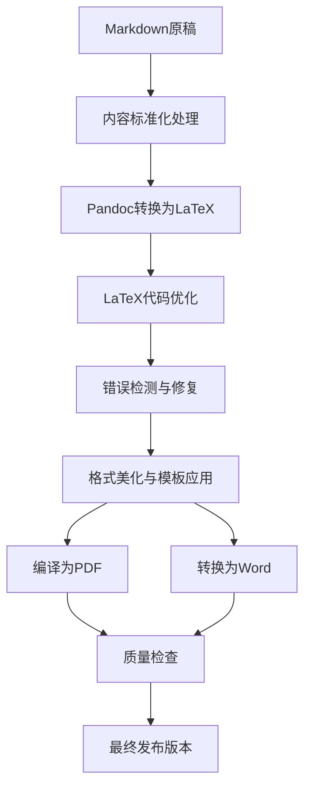

# 教材制作工作流程经验总结

## 📚 工作区宝贵经验整理

基于《三维协同设计与BIM技术》教材制作过程中积累的经验，本文档总结了从Markdown到LaTeX再到Word的完整工作流程，以及教材模板系统。

---

## 🎯 一、核心工作流程概述

### 1.1 工作流程架构



### 1.2 关键技术栈

- **内容创作**: Markdown
- **格式转换**: Pandoc
- **排版系统**: LaTeX (XeLaTeX)
- **代码高亮**: listings包
- **美化框架**: tcolorbox包
- **字体系统**: ctex中文支持
- **版本控制**: Git + 批处理脚本
- **输出格式**: PDF、Word (DOCX)

---

## 🔧 二、Markdown到LaTeX转换经验

### 2.1 内容标准化规范

#### 文档结构标准
```markdown
# 教材编写标准

## 章节层次结构
- ## 大标题（如：一、二、三、四）
- ### 子标题（如：1.1、1.2等）
- #### 细分标题（如：1.1.1、1.1.2等）
- **加粗段落标题**（用于进一步细分）

## 逻辑组织模式
每个主要部分遵循：理论背景 → 原理分析 → 技术实现 → 实践应用

## 内容比例分配
- 理论阐述：40%
- 技术实现：35% 
- 实践应用：20%
- 总结反思：5%
```

#### 代码块标准化
```markdown
<!-- 标准代码块格式 -->
```csharp
// C# 代码示例
using System;
namespace Example
{
    public class Program
    {
        static void Main()
        {
            Console.WriteLine("Hello World!");
        }
    }
}
```

<!-- 配置文件格式 -->
```xml
<!-- XML配置示例 -->
<configuration>
    <appSettings>
        <add key="setting" value="value" />
    </appSettings>
</configuration>
```

<!-- JavaScript代码 -->
```javascript
// JavaScript示例
function initThree() {
    const scene = new THREE.Scene();
    const camera = new THREE.PerspectiveCamera(75, window.innerWidth / window.innerHeight, 0.1, 1000);
    const renderer = new THREE.WebGLRenderer();
}
```
```

### 2.2 转换脚本系统

#### 基础转换脚本 (`转换为LaTeX.bat`)
```batch
@echo off
chcp 65001 >nul

echo 转换markdown文件为LaTeX...
echo 检查pandoc是否安装...
pandoc --version >nul 2>&1
if %errorlevel% neq 0 (
    echo 错误：未找到pandoc，请先安装pandoc
    pause
    exit /b 1
)

echo 生成基础版本LaTeX...
pandoc "第七章\前言.md" "第七章\7.1.md" "第七章\7.2.md" "第七章\7.3.md" "第八章\前言.md" "第八章\8.1.md" "第八章\8.2.md" "第八章\8.3.md" "术语表与参考文献.md" ^
-o "合并内容.tex" ^
--pdf-engine=xelatex ^
--toc ^
--listings ^
--standalone ^
--variable=documentclass:ctexbook ^
--variable=geometry:margin=2.5cm ^
--variable=fontsize:12pt ^
--variable=linestretch:1.5
```

#### 优化处理脚本 (`优化LaTeX.bat`)
```batch
@echo off
chcp 65001 >nul

set inputfile=listings版本_合并内容.tex
set outputfile=优化版_合并内容.tex

echo 正在优化 LaTeX 文件...

REM 1. 添加优化的 listings 配置
powershell -Command "(Get-Content '%outputfile%') -replace '\\usepackage\{listings\}', '\\usepackage{listings}^n\\input{listings_config.tex}' | Set-Content '%outputfile%'"

REM 2. 为代码块添加语言标识
powershell -Command "(Get-Content '%outputfile%') -replace '\\begin\{lstlisting\}^n(.*?using.*?;)', '\\begin{lstlisting}[style=csharp]^n$1' | Set-Content '%outputfile%'"

REM 3. 优化表格显示
powershell -Command "(Get-Content '%outputfile%') -replace '\\begin\{longtabu\}', '\\begin{longtable}' | Set-Content '%outputfile%'"

REM 4. 添加中文字体配置
powershell -Command "(Get-Content '%outputfile%') -replace '\\documentclass\[(.*?)\]\{ctexbook\}', '\\documentclass[$1]{ctexbook}^n\\setCJKmainfont{SimSun}^n\\setCJKsansfont{SimHei}^n\\setCJKmonofont{FangSong}' | Set-Content '%outputfile%'"
```

### 2.3 错误处理与异常处理经验

#### 常见问题及解决方案

1. **编码问题**
   - 确保所有文件使用UTF-8编码
   - 批处理脚本开头添加 `chcp 65001 >nul`

2. **中文支持问题**
   - 使用 `ctexbook` 文档类
   - 配置中文字体：SimSun、SimHei、FangSong

3. **代码块显示问题**
   - 使用 `listings` 包替代 `minted`
   - 为不同语言配置专门的样式

4. **表格转换问题**
   - `longtabu` 环境改为 `longtable`
   - 复杂表格手动调整

5. **图片路径问题**
   - 使用相对路径
   - SVG图片转换为JPG/PNG

#### 自动化错误检测脚本
```python
import re
import os

def check_latex_errors(tex_file):
    """检测LaTeX文件中的常见错误"""
    with open(tex_file, 'r', encoding='utf-8') as f:
        content = f.read()
    
    errors = []
    
    # 检查未闭合的环境
    envs = re.findall(r'\\begin\{([^}]+)\}', content)
    end_envs = re.findall(r'\\end\{([^}]+)\}', content)
    
    for env in envs:
        if envs.count(env) != end_envs.count(env):
            errors.append(f"环境 {env} 未正确闭合")
    
    # 检查特殊字符
    if '&' in content and '\\&' not in content:
        errors.append("发现未转义的 & 字符")
    
    return errors
```

---

## 🎨 三、教材模板系统

### 3.1 LaTeX模板架构

#### 核心模板文件结构
```
教材模板系统/
├── 基础配置/
│   ├── 现代化格式配置.tex       # 基础排版配置
│   ├── listings_config.tex      # 代码高亮配置
│   └── 中文字体配置.tex         # 中文字体设置
├── 美化组件/
│   ├── 教材章节开头美化模板.tex  # 章节开头组件
│   ├── 小节思考题美化模板.tex    # 思考题组件
│   └── 信息框组件.tex           # 提示框组件
├── 转换脚本/
│   ├── 转换为LaTeX.bat          # 基础转换
│   ├── 优化LaTeX.bat            # 后处理优化
│   └── latex转word.bat          # Word转换
└── 质量控制/
    ├── 错误检测.py              # 自动错误检测
    └── 格式标准化.py            # 格式统一化
```

### 3.2 美化组件库

#### 学习目标组件
```latex
% 学习目标框
\newtcolorbox{learningobjectives}[1][]{
    enhanced,
    title={\faLightbulb\ 学习目标},
    attach boxed title to top left={yshift=-2mm, xshift=5mm},
    boxed title style={
        size=small,
        colback=primaryblue,
        colframe=primaryblue,
        sharp corners=all,
        font=\bfseries\color{white}
    },
    colback=lightblue!20,
    colframe=primaryblue,
    sharp corners=northwest,
    arc=3mm,
    boxrule=0.8pt,
    left=8pt,
    right=8pt,
    top=8pt,
    bottom=8pt,
    fonttitle=\bfseries\color{white},
    #1
}
```

#### 代码配置组件
```latex
% C# 语言特定设置
\lstdefinestyle{csharp}{
    language=[Sharp]C,
    morekeywords={var, async, await, yield, partial, get, set, value, 
                  public, private, protected, internal, static, virtual, 
                  override, abstract, sealed, readonly, const},
    morecomment=[l]{//},
    morecomment=[s]{/*}{*/},
    morestring=[b]",
    showstringspaces=false,
    keywordstyle=\color{codeblue}\bfseries,
    commentstyle=\color{codegreen}\itshape,
    stringstyle=\color{codered},
    basicstyle=\ttfamily\footnotesize
}
```

### 3.3 配色方案系统

#### 现代化配色
```latex
% 定义现代化配色方案
\definecolor{primaryblue}{RGB}{52, 152, 219}
\definecolor{lightblue}{RGB}{174, 214, 241}
\definecolor{darkblue}{RGB}{40, 116, 166}
\definecolor{accentorange}{RGB}{230, 126, 34}
\definecolor{lightgray}{RGB}{247, 247, 247}
\definecolor{darkgray}{RGB}{85, 85, 85}
\definecolor{successgreen}{RGB}{39, 174, 96}
\definecolor{warningyellow}{RGB}{241, 196, 15}
```

---

## 🔄 四、LaTeX到Word转换经验

### 4.1 转换工具链

#### 主要转换方法对比

| 工具 | 优势 | 劣势 | 适用场景 |
|------|------|------|----------|
| Pandoc | 转换质量高，支持丰富选项 | 复杂格式可能有问题 | 标准文档转换 |
| latex2rtf | 专门针对LaTeX | 输出RTF格式 | 需要RTF中间格式 |
| tex4ht | 支持复杂数学公式 | 配置复杂 | 数学密集型文档 |

#### 推荐转换脚本
```python
def convert_with_pandoc(tex_file, output_file):
    """使用Pandoc进行转换"""
    cmd = [
        'pandoc',
        str(tex_file),
        '-o', str(output_file),
        '--from=latex',
        '--to=docx',
        '--standalone',
        '--toc',
        '--number-sections',
        '--highlight-style=tango'
    ]
    
    result = subprocess.run(cmd, capture_output=True, text=True)
    return result.returncode == 0
```

### 4.2 预处理优化

#### LaTeX文件预处理
```python
def preprocess_latex_file(input_file, temp_file):
    """预处理LaTeX文件以提高转换成功率"""
    with open(input_file, 'r', encoding='utf-8') as f:
        content = f.read()
    
    # 替换复杂的代码块
    content = re.sub(
        r'\\begin{lstlisting}.*?\\end{lstlisting}',
        r'\\begin{verbatim}\n[代码块]\n\\end{verbatim}',
        content,
        flags=re.DOTALL
    )
    
    # 替换图片引用
    content = re.sub(
        r'\\includegraphics(\[[^\]]*\])?\{[^}]*\}',
        r'\\texttt{[图片]}',
        content
    )
    
    with open(temp_file, 'w', encoding='utf-8') as f:
        f.write(content)
```

---

## 🛠️ 五、自动化工具集

### 5.1 批量处理脚本

#### Markdown汇总脚本
```python
def merge_markdown_files():
    """汇总多个Markdown文件"""
    files_to_merge = [
        '第一章/前言.md',
        '第一章/1.1.md',
        '第一章/1.2.md',
        # ... 更多文件
    ]
    
    merged_content = []
    for file_name in files_to_merge:
        if os.path.exists(file_name):
            with open(file_name, 'r', encoding='utf-8') as f:
                merged_content.append(f.read())
                merged_content.append('\n\n')
    
    output_file = '完整教材.md'
    with open(output_file, 'w', encoding='utf-8') as f:
        f.write(''.join(merged_content))
    
    return output_file
```

### 5.2 质量检查工具

#### 自动化检查脚本
```python
def quality_check(file_path):
    """教材质量自动检查"""
    checks = {
        'encoding': check_encoding(file_path),
        'structure': check_structure(file_path),
        'latex_syntax': check_latex_syntax(file_path),
        'chinese_fonts': check_chinese_fonts(file_path),
        'code_blocks': check_code_blocks(file_path)
    }
    
    return checks
```

---

## 📋 六、项目组织最佳实践

### 6.1 目录结构规范

```
教材项目/
├── 原稿/                    # Markdown原稿
│   ├── 第一章/
│   ├── 第二章/
│   └── ...
├── 模板/                    # LaTeX模板文件
│   ├── 基础配置/
│   ├── 美化组件/
│   └── 样式文件/
├── 脚本/                    # 自动化脚本
│   ├── 转换脚本/
│   ├── 优化脚本/
│   └── 质量检查/
├── 输出/                    # 生成文件
│   ├── latex/
│   ├── pdf/
│   └── word/
├── 资源/                    # 图片、代码等
│   ├── images/
│   ├── code/
│   └── assets/
└── 文档/                    # 项目文档
    ├── 编写规范.md
    ├── 使用说明.md
    └── 更新日志.md
```

### 6.2 版本控制策略

#### Git工作流程
```bash
# 初始化项目
git init
git add .gitignore

# 创建分支结构
git checkout -b develop
git checkout -b feature/chapter-1
git checkout -b feature/templates

# 提交策略
git add 第一章/
git commit -m "feat: 添加第一章内容"

git add 模板/
git commit -m "feat: 添加LaTeX模板系统"

# 发布版本
git tag -a v1.0.0 -m "第一版教材发布"
```

---

## 🎯 七、新教材应用指南

### 7.1 快速启动checklist

- [ ] 1. 创建项目目录结构
- [ ] 2. 复制模板文件系统
- [ ] 3. 配置转换脚本路径
- [ ] 4. 设置中文字体环境
- [ ] 5. 准备Markdown编写规范
- [ ] 6. 配置代码高亮语言
- [ ] 7. 测试完整转换流程
- [ ] 8. 建立质量检查机制

### 7.2 定制化配置要点

#### 学科特定配置
```latex
% 针对不同学科调整配色
% 工程类：蓝色系
% 管理类：绿色系  
% 艺术类：橙色系

% 针对不同代码语言配置高亮
% Java项目
% Python项目
% 前端项目
```

#### 内容结构适配
```markdown
# 根据学科特点调整章节结构
## 理论型教材：概念 → 原理 → 应用 → 案例
## 实践型教材：背景 → 操作 → 练习 → 项目
## 工具型教材：介绍 → 安装 → 使用 → 高级功能
```

---

## 🔮 八、未来优化方向

### 8.1 技术改进计划
- 引入CI/CD自动化构建
- 集成更多输出格式支持
- 开发可视化编辑界面
- 增强错误检测能力
- 优化转换效率

### 8.2 模板扩展规划
- 多学科模板库
- 交互式组件库
- 在线协作系统
- 版本管理集成
- 自动化发布流程

---

## 📚 九、参考资源

### 9.1 技术文档
- [Pandoc官方文档](https://pandoc.org/MANUAL.html)
- [LaTeX中文处理指南](https://github.com/CTeX-org/ctex-kit)
- [tcolorbox包文档](https://ctan.org/pkg/tcolorbox)
- [listings包配置](https://ctan.org/pkg/listings)

### 9.2 最佳实践
- 教材编写国家标准
- 学术出版规范要求
- 开源项目管理经验
- 自动化工具链设计

---

**文档版本**: v1.0.0  
**最后更新**: 2025年8月7日  
**适用范围**: 大学教材编写与制作  
**技术支持**: 基于实际项目经验总结
