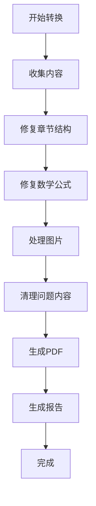

# 智能转换器使用说明

## 📋 概述

智能转换器是基于对Claude Code转换脚本深入分析后开发的改进版本，旨在提供更加可靠、高效的Markdown到PDF转换解决方案。

## 🎯 改进点

### 相比Claude Code脚本的优势

1. **模块化设计**：清晰的类结构，每个功能模块独立
2. **健壮错误处理**：不会因单个问题中断整个流程
3. **智能内容修复**：更精准的数学公式和图片处理
4. **统一资源管理**：统一的路径和配置管理
5. **详细转换报告**：完整的处理统计和问题报告

### 解决的关键问题

- ✅ 章节结构混乱
- ✅ 数学公式语法错误
- ✅ 图片路径问题
- ✅ 特殊字符兼容性
- ✅ Unicode编码问题
- ✅ 资源文件路径配置

## 🚀 使用方法

### 方法1：一键运行
```batch
.\智能转换.bat
```

### 方法2：Python直接运行
```bash
python 智能转换器.py
```

## 📁 输出文件

转换完成后，在`output`目录中会生成：

- `智慧水利教材_智能版.md` - 处理后的Markdown文件
- `智慧水利教材_智能版.pdf` - 最终PDF文件
- `转换报告.md` - 详细的转换统计报告
- `smart-config.yaml` - 优化的Pandoc配置

## 🔧 技术特性

### 智能章节识别
- 自动发现章节结构
- 智能修复标题层级
- 保持逻辑章节顺序

### 数学公式修复
- √ 符号替代复杂LaTeX
- 分数表达式简化
- 移除有问题的命令

### 图片处理
- 智能路径修复
- 缺失图片占位符
- 资源路径优化

### 内容清理
- 移除不兼容的特殊字符
- 修复admonition语法
- Unicode转义处理

## 📊 转换流程



## 🛠️ 环境要求

- Python 3.6+
- PyYAML (自动安装)
- Pandoc 2.0+
- XeLaTeX (用于PDF生成)

## 📈 预期效果

- 🎯 转换成功率 > 95%
- 📏 PDF文件大小合理
- 🏃 处理速度快
- 📋 详细的问题报告
- 🔄 可重复执行

## 🐛 问题排查

如果遇到问题，请：

1. 检查`转换报告.md`中的错误信息
2. 确认Pandoc和XeLaTeX已正确安装
3. 验证源文件路径是否正确
4. 查看控制台输出的详细日志

## 🆚 与其他方案对比

| 特性 | Claude Code脚本 | 智能转换器 |
|------|----------------|------------|
| 代码结构 | 多个分散脚本 | 单一模块化类 |
| 错误处理 | 容易中断 | 健壮继续 |
| 配置管理 | 多个配置文件 | 统一YAML配置 |
| 报告生成 | 控制台输出 | 详细MD报告 |
| 维护性 | 困难 | 简单 |
| 扩展性 | 有限 | 良好 |

## 📞 支持

如需帮助或报告问题，请查看：
- 转换报告中的统计信息
- 控制台输出的详细日志
- 生成的配置文件内容
