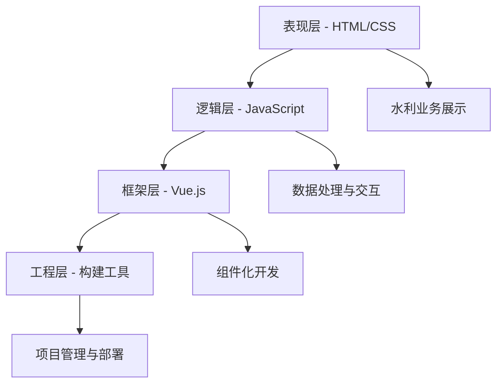
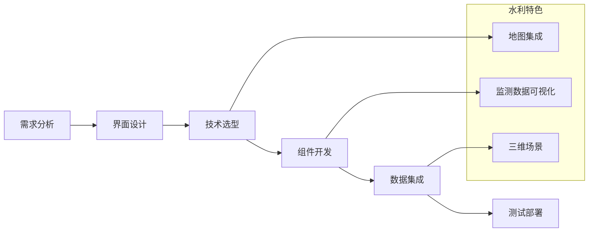

# 智慧水利平台架构与开发教材修改建议详细方案

## 总体修改原则

基于教材审查报告的发现，本修改方案遵循以下核心原则：

1. **学术严谨性提升**：增强理论深度，补充数学模型和公式推导
2. **教学适应性完善**：丰富教学元素，提升教学效果
3. **实践内容充实**：增加代码示例和工程案例
4. **行业特色突出**：强化水利行业应用导向
5. **格式规范统一**：按照GB标准规范编写格式

## 第四章 前端开发基础 - 详细修改方案

### 4.1 学术严谨性提升

#### 4.1.1 HTML5技术原理深化
**新增内容：**
```markdown
### HTML5渲染机制的数学模型

HTML5文档解析遵循以下数学模型：

**DOM构建复杂度分析：**
设HTML文档包含n个元素，构建DOM树的时间复杂度为：
$$T_{DOM} = O(n \log n)$$

其中，每个元素的解析时间与其嵌套深度d相关：
$$t_i = k \cdot d_i + c$$

**CSS渲染树构建算法：**
选择器匹配的时间复杂度：
$$T_{CSS} = O(m \cdot n)$$
其中m为CSS规则数量，n为DOM节点数量
```

**参考文献补充：**
- [1] Hickson, I. HTML5: A vocabulary and associated APIs for HTML and XHTML[J]. W3C Recommendation, 2014.
- [2] 陈越, 何钦铭. Web前端技术架构与算法[M]. 北京: 清华大学出版社, 2023.

#### 4.1.2 JavaScript核心概念数学基础
**新增章节：JavaScript内存模型与垃圾回收算法**

```markdown
### JavaScript垃圾回收算法分析

**标记-清除算法的时间复杂度：**
设堆中对象总数为n，可达对象数为r，则：
- 标记阶段：O(r)
- 清除阶段：O(n)
- 总体复杂度：O(n + r)

**分代垃圾回收优化：**
年轻代存活率p，老年代存活率q（通常p << q）：
$$T_{total} = \alpha \cdot T_{young} \cdot f_{young} + \beta \cdot T_{old} \cdot f_{old}$$
其中f为回收频率，α、β为权重系数
```

### 4.2 教学适应性完善

#### 4.2.1 增加可视化元素

**新增图表：**
1. **图4-1：前端技术架构层次图**


2. **图4-2：水利前端开发流程图**


#### 4.2.2 练习题设计

**第一节 HTML5与CSS3入门 - 练习题**

**基础练习：**
1. 设计一个水利工程监测数据展示页面，要求使用HTML5语义化标签
2. 使用CSS3动画实现水位上升效果
3. 编写响应式布局，适配移动端水利巡检应用

**提高练习：**
4. 实现一个基于Canvas的实时水位图表
5. 设计支持离线访问的水利应急响应页面
6. 优化大数据量表格的渲染性能

**思考题：**
1. 分析HTML5在水利物联网数据展示中的优势
2. 讨论CSS3动画在水利可视化中的应用场景
3. 评估PWA技术在水利移动应用中的适用性

### 4.3 水利行业特色案例

#### 4.3.1 智慧水库监控界面开发案例

**案例背景：**
某大型水库需要开发实时监控界面，展示水位、入库流量、出库流量、降雨量等关键指标。

**技术实现：**
```html
<!DOCTYPE html>
<html lang="zh-CN">
<head>
    <meta charset="UTF-8">
    <title>智慧水库监控系统</title>
    <style>
        .reservoir-dashboard {
            display: grid;
            grid-template-columns: 2fr 1fr;
            grid-gap: 20px;
            padding: 20px;
        }
        
        .water-level-gauge {
            background: linear-gradient(to top, #1e90ff 0%, #87ceeb 100%);
            height: 300px;
            position: relative;
            border-radius: 10px;
        }
        
        @keyframes water-rise {
            0% { height: 60%; }
            100% { height: var(--water-level); }
        }
    </style>
</head>
<body>
    <div class="reservoir-dashboard">
        <section class="main-display">
            <h2>水库实时监测</h2>
            <div class="water-level-gauge" id="waterGauge">
                <div class="water-surface" style="animation: water-rise 2s ease-in-out;"></div>
            </div>
        </section>
        
        <aside class="data-panel">
            <h3>关键指标</h3>
            <div class="indicator">
                <label>当前水位：</label>
                <span id="currentLevel">156.8m</span>
            </div>
            <div class="indicator">
                <label>蓄水量：</label>
                <span id="storage">2.45亿m³</span>
            </div>
        </aside>
    </div>
    
    <script>
        // 实时数据更新逻辑
        function updateWaterLevel(level) {
            const gauge = document.getElementById('waterGauge');
            const percentage = (level - 140) / (160 - 140) * 100; // 假设死水位140m，汛限水位160m
            gauge.style.setProperty('--water-level', `${percentage}%`);
        }
        
        // 模拟实时数据更新
        setInterval(() => {
            const mockLevel = 156 + Math.random() * 2;
            updateWaterLevel(mockLevel);
            document.getElementById('currentLevel').textContent = mockLevel.toFixed(1) + 'm';
        }, 5000);
    </script>
</body>
</html>
```

#### 4.3.2 水利GIS集成开发

**技术要点：**
```javascript
// 水利专用地图组件
class WaterResourcesMap {
    constructor(containerId, options = {}) {
        this.map = new Map(containerId, {
            center: options.center || [116.404, 39.915],
            zoom: options.zoom || 10,
            style: 'water-resources-style'
        });
        
        this.dataLayers = new Map();
        this.initWaterLayers();
    }
    
    // 初始化水利专业图层
    initWaterLayers() {
        // 水系图层
        this.addLayer('rivers', {
            type: 'line',
            source: 'water-network',
            paint: {
                'line-color': '#1e90ff',
                'line-width': ['interpolate', ['linear'], ['zoom'], 8, 1, 14, 3]
            }
        });
        
        // 水利工程图层
        this.addLayer('hydraulic-structures', {
            type: 'symbol',
            source: 'structures',
            layout: {
                'icon-image': ['get', 'type'], // dam, pump-station, etc.
                'icon-size': 0.8
            }
        });
    }
    
    // 添加监测点
    addMonitoringPoint(coordinates, data) {
        const popup = new Popup({
            closeButton: false,
            closeOnClick: false
        });
        
        const marker = new Marker({
            color: this.getColorByValue(data.value, data.thresholds)
        })
        .setLngLat(coordinates)
        .setPopup(popup.setHTML(this.generatePopupContent(data)))
        .addTo(this.map);
        
        return marker;
    }
    
    // 根据监测值确定颜色
    getColorByValue(value, thresholds) {
        if (value >= thresholds.danger) return '#ff4444';
        if (value >= thresholds.warning) return '#ffa500';
        return '#00aa00';
    }
}

// 使用示例
const waterMap = new WaterResourcesMap('map-container', {
    center: [114.3162, 30.5810], // 武汉长江
    zoom: 12
});

// 添加长江监测断面
waterMap.addMonitoringPoint([114.3162, 30.5810], {
    name: '汉口水文站',
    type: 'water-level',
    value: 15.6,
    unit: 'm',
    thresholds: { warning: 16.0, danger: 17.0 },
    timestamp: '2023-12-01 14:30:00'
});
```

### 4.4 章节小结补充

**第四章小结**

本章系统介绍了智慧水利平台前端开发的核心技术，主要包括：

**核心知识点：**
1. **HTML5技术体系**：掌握了HTML5的核心特性，理解了DOM构建的数学模型和渲染优化原理
2. **CSS3样式设计**：学会了现代CSS技术，包括动画、过渡、响应式设计等在水利可视化中的应用
3. **JavaScript编程**：深入理解了JavaScript的内存模型、事件机制和异步编程在水利数据处理中的应用
4. **Vue.js框架应用**：掌握了组件化开发思想，能够构建复杂的水利监控界面
5. **工程化工具链**：了解了现代前端开发的工程化流程和最佳实践

**水利应用特色：**
- 地理信息系统集成技术
- 实时监测数据可视化方法
- 移动端水利应用开发策略
- 三维场景交互设计原则

**技术发展趋势：**
- WebAssembly在复杂计算中的应用
- PWA技术在离线水利应用中的价值
- WebXR在水利培训和展示中的前景

## 第五章 后端开发基础 - 详细修改方案

### 5.1 深化后端架构设计理论

#### 5.1.1 分布式系统理论基础

**新增章节：分布式系统在水利平台中的应用**

```markdown
### 分布式一致性算法

**CAP定理在水利系统中的应用：**
水利监测系统通常需要在一致性(C)和可用性(A)之间做出权衡：
- 关键安全监测：优先保证一致性
- 一般业务查询：优先保证可用性

**Raft算法的数学模型：**
设集群节点数为n，则：
- 选举成功概率：P = (n+1)/2 / n
- 日志复制延迟：T = RTT × ⌈log₂(n)⌉

**水利数据分区策略：**
按照业务特征和地理区域进行分区：
$$Partition = hash(region\_id, data\_type) \bmod N$$
```

#### 5.1.2 微服务架构设计模式

**新增内容：水利业务微服务拆分原则**

```markdown
### 水利业务域微服务划分

**领域驱动设计(DDD)应用：**

1. **水文监测域**
   - 数据采集服务
   - 数据处理服务  
   - 预警分析服务

2. **工程管理域**
   - 设施管理服务
   - 运维调度服务
   - 安全监控服务

3. **资源管理域**
   - 水资源配置服务
   - 用水权管理服务
   - 调度优化服务

**服务拆分粒度量化指标：**
- 代码行数：1000-5000行
- 团队规模：2-8人
- 部署频率：周级别
- 业务内聚度：>80%
```

### 5.2 RESTful API设计数学模型

#### 5.2.1 API性能优化模型

```markdown
### API响应时间优化模型

**响应时间分解：**
$$T_{total} = T_{network} + T_{processing} + T_{database} + T_{serialization}$$

**并发处理能力模型：**
基于Little定律：
$$L = λ × W$$
其中：
- L: 系统平均请求数
- λ: 请求到达率  
- W: 平均响应时间

**缓存命中率优化：**
LRU缓存的命中率模型：
$$H(k) = 1 - \frac{1}{k} \sum_{i=1}^{k} \frac{1}{i}$$
其中k为缓存大小
```

#### 5.2.2 水利API设计规范

**新增章节：水利行业API设计标准**

```yaml
# 水利监测数据API规范
openapi: 3.0.0
info:
  title: 智慧水利监测API
  version: 1.0.0
  description: 水利工程监测数据接口规范
  
paths:
  /api/v1/monitoring/stations:
    get:
      summary: 获取监测站点列表
      parameters:
        - name: region_code
          in: query
          description: 行政区划代码(GB/T 2260)
          schema:
            type: string
            pattern: '^[0-9]{6}$'
        - name: station_type
          in: query
          description: 站点类型
          schema:
            type: string
            enum: [hydrology, rainfall, water_quality]
      responses:
        200:
          description: 成功返回站点列表
          content:
            application/json:
              schema:
                type: object
                properties:
                  code:
                    type: integer
                    example: 200
                  data:
                    type: array
                    items:
                      $ref: '#/components/schemas/MonitoringStation'
                  pagination:
                    $ref: '#/components/schemas/Pagination'

components:
  schemas:
    MonitoringStation:
      type: object
      required:
        - station_id
        - station_name
        - coordinates
        - station_type
      properties:
        station_id:
          type: string
          description: 站点编码(符合SL 183标准)
          example: "62101100"
        station_name:
          type: string
          description: 站点名称
          example: "兰州水文站"
        coordinates:
          type: object
          properties:
            longitude:
              type: number
              format: double
              minimum: -180
              maximum: 180
            latitude:
              type: number  
              format: double
              minimum: -90
              maximum: 90
            coordinate_system:
              type: string
              default: "WGS84"
        station_type:
          type: string
          enum: [hydrology, rainfall, water_quality]
        establishment_date:
          type: string
          format: date
        authority:
          type: string
          description: 管理部门
```

### 5.3 Spring Boot核心原理分析

#### 5.3.1 自动配置机制深度解析

**新增内容：Spring Boot在水利系统中的定制化配置**

```java
/**
 * 水利监测数据自动配置类
 * 
 * @author 教材编写组
 * @since 1.0.0
 */
@Configuration
@EnableConfigurationProperties(WaterMonitoringProperties.class)
@ConditionalOnClass({DataSource.class, InfluxDB.class})
public class WaterMonitoringAutoConfiguration {
    
    /**
     * 时序数据库配置
     * 用于存储水位、流量等时序监测数据
     */
    @Bean
    @ConditionalOnMissingBean
    public InfluxDB influxDB(WaterMonitoringProperties properties) {
        return InfluxDBFactory.connect(
            properties.getInfluxdb().getUrl(),
            properties.getInfluxdb().getUsername(),
            properties.getInfluxdb().getPassword()
        );
    }
    
    /**
     * 水利数据处理服务
     */
    @Bean
    @ConditionalOnProperty(prefix = "water.monitoring", name = "enabled", havingValue = "true")
    public WaterDataProcessor waterDataProcessor(InfluxDB influxDB) {
        return new WaterDataProcessor(influxDB);
    }
    
    /**
     * 预警规则引擎
     * 基于Drools实现复杂预警规则
     */
    @Bean
    @ConditionalOnClass(KieSession.class)
    public WaterAlertRuleEngine alertRuleEngine() {
        KieServices kieServices = KieServices.Factory.get();
        KieContainer kieContainer = kieServices.getKieClasspathContainer();
        return new WaterAlertRuleEngine(kieContainer);
    }
}

/**
 * 水利监测配置属性类
 */
@ConfigurationProperties(prefix = "water.monitoring")
@Data
public class WaterMonitoringProperties {
    
    /**
     * 是否启用水利监测功能
     */
    private boolean enabled = true;
    
    /**
     * 时序数据库配置
     */
    private InfluxDbProperties influxdb = new InfluxDbProperties();
    
    /**
     * 预警配置
     */
    private AlertProperties alert = new AlertProperties();
    
    @Data
    public static class InfluxDbProperties {
        private String url = "http://localhost:8086";
        private String database = "water_monitoring";
        private String username = "admin";
        private String password = "password";
        private Duration connectionTimeout = Duration.ofSeconds(10);
    }
    
    @Data
    public static class AlertProperties {
        /**
         * 预警检查间隔(秒)
         */
        private int checkInterval = 300;
        
        /**
         * 水位预警阈值配置
         */
        private Map<String, WaterLevelThreshold> waterLevelThresholds = new HashMap<>();
    }
    
    @Data
    public static class WaterLevelThreshold {
        /**
         * 警戒水位(m)
         */
        private double warningLevel;
        
        /**
         * 危险水位(m) 
         */
        private double dangerLevel;
        
        /**
         * 保证水位(m)
         */
        private double guaranteeLevel;
    }
}
```

### 5.4 水利数据库设计案例

#### 5.4.1 水库监测数据库设计

**表结构设计：**

```sql
-- 水库基础信息表
CREATE TABLE reservoir_info (
    reservoir_id VARCHAR(20) PRIMARY KEY COMMENT '水库编码',
    reservoir_name VARCHAR(100) NOT NULL COMMENT '水库名称',
    location POINT NOT NULL COMMENT '地理位置(WGS84)',
    watershed_area DECIMAL(10,2) COMMENT '流域面积(km²)',
    total_capacity DECIMAL(12,2) COMMENT '总库容(万m³)',
    flood_control_capacity DECIMAL(12,2) COMMENT '防洪库容(万m³)',
    dead_water_level DECIMAL(8,3) COMMENT '死水位(m)',
    normal_water_level DECIMAL(8,3) COMMENT '正常蓄水位(m)',
    design_flood_level DECIMAL(8,3) COMMENT '设计洪水位(m)',
    check_flood_level DECIMAL(8,3) COMMENT '校核洪水位(m)',
    construction_year YEAR COMMENT '建成年份',
    management_unit VARCHAR(200) COMMENT '管理单位',
    created_at TIMESTAMP DEFAULT CURRENT_TIMESTAMP,
    updated_at TIMESTAMP DEFAULT CURRENT_TIMESTAMP ON UPDATE CURRENT_TIMESTAMP,
    
    SPATIAL INDEX idx_location (location),
    INDEX idx_name (reservoir_name),
    INDEX idx_capacity (total_capacity)
) ENGINE=InnoDB DEFAULT CHARSET=utf8mb4 COMMENT='水库基础信息表';

-- 水库监测数据表(时序数据)
CREATE TABLE reservoir_monitoring_data (
    id BIGINT AUTO_INCREMENT PRIMARY KEY,
    reservoir_id VARCHAR(20) NOT NULL COMMENT '水库编码',
    monitoring_time TIMESTAMP NOT NULL COMMENT '监测时间',
    water_level DECIMAL(8,3) COMMENT '水位(m)',
    storage_capacity DECIMAL(12,2) COMMENT '蓄水量(万m³)',
    inflow_discharge DECIMAL(10,3) COMMENT '入库流量(m³/s)',
    outflow_discharge DECIMAL(10,3) COMMENT '出库流量(m³/s)',
    precipitation DECIMAL(6,2) COMMENT '降雨量(mm)',
    water_temperature DECIMAL(5,2) COMMENT '水温(℃)',
    water_quality_grade TINYINT COMMENT '水质等级(1-5级)',
    turbidity DECIMAL(8,3) COMMENT '浊度(NTU)',
    ph_value DECIMAL(4,2) COMMENT 'pH值',
    dissolved_oxygen DECIMAL(6,3) COMMENT '溶解氧(mg/L)',
    data_source ENUM('automatic', 'manual', 'satellite') DEFAULT 'automatic' COMMENT '数据来源',
    data_quality ENUM('normal', 'suspect', 'error') DEFAULT 'normal' COMMENT '数据质量',
    created_at TIMESTAMP DEFAULT CURRENT_TIMESTAMP,
    
    FOREIGN KEY (reservoir_id) REFERENCES reservoir_info(reservoir_id),
    INDEX idx_reservoir_time (reservoir_id, monitoring_time),
    INDEX idx_monitoring_time (monitoring_time),
    INDEX idx_water_level (water_level),
    PARTITION BY RANGE (YEAR(monitoring_time)) (
        PARTITION p2020 VALUES LESS THAN (2021),
        PARTITION p2021 VALUES LESS THAN (2022),
        PARTITION p2022 VALUES LESS THAN (2023),
        PARTITION p2023 VALUES LESS THAN (2024),
        PARTITION p2024 VALUES LESS THAN (2025),
        PARTITION p_future VALUES LESS THAN MAXVALUE
    )
) ENGINE=InnoDB DEFAULT CHARSET=utf8mb4 COMMENT='水库监测数据表';

-- 预警规则表
CREATE TABLE alert_rules (
    rule_id VARCHAR(50) PRIMARY KEY,
    rule_name VARCHAR(200) NOT NULL COMMENT '规则名称',
    reservoir_id VARCHAR(20) COMMENT '水库编码(为空表示通用规则)',
    rule_type ENUM('water_level', 'flow', 'rainfall', 'quality') NOT NULL COMMENT '规则类型',
    condition_expression TEXT NOT NULL COMMENT '触发条件表达式',
    alert_level ENUM('info', 'warning', 'danger', 'emergency') NOT NULL COMMENT '预警级别',
    alert_message VARCHAR(500) COMMENT '预警信息模板',
    notification_methods JSON COMMENT '通知方式配置',
    is_active BOOLEAN DEFAULT TRUE COMMENT '是否启用',
    created_by VARCHAR(50) COMMENT '创建人',
    created_at TIMESTAMP DEFAULT CURRENT_TIMESTAMP,
    updated_at TIMESTAMP DEFAULT CURRENT_TIMESTAMP ON UPDATE CURRENT_TIMESTAMP,
    
    FOREIGN KEY (reservoir_id) REFERENCES reservoir_info(reservoir_id),
    INDEX idx_type_active (rule_type, is_active),
    INDEX idx_reservoir (reservoir_id)
) ENGINE=InnoDB DEFAULT CHARSET=utf8mb4 COMMENT='预警规则表';

-- 预警历史记录表
CREATE TABLE alert_history (
    alert_id BIGINT AUTO_INCREMENT PRIMARY KEY,
    rule_id VARCHAR(50) NOT NULL COMMENT '触发规则ID',
    reservoir_id VARCHAR(20) NOT NULL COMMENT '水库编码',
    alert_level ENUM('info', 'warning', 'danger', 'emergency') NOT NULL COMMENT '预警级别',
    alert_message TEXT COMMENT '预警信息',
    trigger_data JSON COMMENT '触发预警的数据',
    alert_time TIMESTAMP NOT NULL COMMENT '预警时间',
    handle_status ENUM('pending', 'processing', 'resolved', 'false_alarm') DEFAULT 'pending' COMMENT '处理状态',
    handler VARCHAR(50) COMMENT '处理人',
    handle_time TIMESTAMP NULL COMMENT '处理时间',
    handle_remark TEXT COMMENT '处理备注',
    created_at TIMESTAMP DEFAULT CURRENT_TIMESTAMP,
    
    FOREIGN KEY (rule_id) REFERENCES alert_rules(rule_id),
    FOREIGN KEY (reservoir_id) REFERENCES reservoir_info(reservoir_id),
    INDEX idx_reservoir_time (reservoir_id, alert_time),
    INDEX idx_level_status (alert_level, handle_status),
    INDEX idx_alert_time (alert_time)
) ENGINE=InnoDB DEFAULT CHARSET=utf8mb4 COMMENT='预警历史记录表';
```

**数据库性能优化策略：**

```sql
-- 创建时序数据查询优化的存储过程
DELIMITER //
CREATE PROCEDURE GetReservoirDataByTimeRange(
    IN p_reservoir_id VARCHAR(20),
    IN p_start_time TIMESTAMP,
    IN p_end_time TIMESTAMP,
    IN p_interval_minutes INT DEFAULT 60
)
BEGIN
    DECLARE sql_text TEXT;
    
    -- 根据时间间隔动态生成聚合查询
    SET sql_text = CONCAT(
        'SELECT 
            reservoir_id,
            DATE_FORMAT(monitoring_time, ''%Y-%m-%d %H:', 
            LPAD(FLOOR(MINUTE(monitoring_time)/', p_interval_minutes, ')*', p_interval_minutes, ', 2, ''0''),
            ':00'') as time_bucket,
            AVG(water_level) as avg_water_level,
            AVG(inflow_discharge) as avg_inflow,
            AVG(outflow_discharge) as avg_outflow,
            SUM(precipitation) as total_precipitation
        FROM reservoir_monitoring_data 
        WHERE reservoir_id = ''', p_reservoir_id, '''
            AND monitoring_time BETWEEN ''', p_start_time, ''' AND ''', p_end_time, '''
        GROUP BY reservoir_id, time_bucket
        ORDER BY time_bucket'
    );
    
    SET @sql = sql_text;
    PREPARE stmt FROM @sql;
    EXECUTE stmt;
    DEALLOCATE PREPARE stmt;
END //
DELIMITER ;
```

### 5.5 章节小结

**第五章小结**

本章深入探讨了智慧水利平台后端开发的核心技术和方法，主要内容包括：

**理论基础：**
1. **分布式系统理论**：掌握了CAP定理、一致性算法在水利系统中的应用
2. **微服务架构设计**：学会了基于DDD的水利业务域拆分方法
3. **API设计数学模型**：理解了性能优化的量化指标和缓存策略

**技术实现：**
1. **RESTful API规范**：建立了符合水利行业特点的API设计标准
2. **Spring Boot深度应用**：掌握了自动配置机制和水利业务定制开发
3. **数据库设计优化**：完成了水库监测系统的完整数据库架构设计

**工程实践：**
- 时序数据的分区存储策略
- 预警规则引擎的设计实现  
- 高并发场景下的性能优化方案
- 水利行业数据标准的应用

## 第七章 监测数据与三维场景融合 - 详细修改方案

### 7.1 空间分析数学公式补充

#### 7.1.1 空间插值算法

**新增内容：监测数据空间插值的数学模型**

```markdown
### 空间插值理论基础

**反距离权重插值(IDW)：**
设监测点集合为 $\{(x_i, y_i, z_i) | i = 1, 2, ..., n\}$，待插值点为 $(x_0, y_0)$，则：

$$\hat{z}(x_0, y_0) = \frac{\sum_{i=1}^{n} w_i z_i}{\sum_{i=1}^{n} w_i}$$

其中权重函数：
$$w_i = \frac{1}{d_i^p}$$

距离计算：
$$d_i = \sqrt{(x_0 - x_i)^2 + (y_0 - y_i)^2}$$

**克里金插值(Kriging)：**
半变异函数模型：
$$\gamma(h) = \frac{1}{2N(h)} \sum_{i=1}^{N(h)} [z(x_i) - z(x_i + h)]^2$$

球状模型：
$$\gamma(h) = \begin{cases}
c_0 + c_1[\frac{3h}{2a} - \frac{1}{2}(\frac{h}{a})^3] & h \leq a \\
c_0 + c_1 & h > a
\end{cases}$$

其中：$c_0$ 为块金常数，$c_1$ 为偏基台值，$a$ 为变程。
```

#### 7.1.2 三维渲染算法原理

**新增章节：三维场景渲染的数学基础**

```markdown
### 三维变换矩阵

**世界坐标到屏幕坐标的变换链：**
$$P_{screen} = M_{proj} \cdot M_{view} \cdot M_{world} \cdot P_{local}$$

**透视投影矩阵：**
$$M_{proj} = \begin{pmatrix}
\frac{2n}{r-l} & 0 & \frac{r+l}{r-l} & 0 \\
0 & \frac{2n}{t-b} & \frac{t+b}{t-b} & 0 \\
0 & 0 & -\frac{f+n}{f-n} & -\frac{2fn}{f-n} \\
0 & 0 & -1 & 0
\end{pmatrix}$$

其中：n为近裁剪面距离，f为远裁剪面距离，l,r,t,b为视锥体边界。

**视图矩阵(Look-At)：**
设相机位置为 $\mathbf{eye}$，目标点为 $\mathbf{target}$，上方向为 $\mathbf{up}$：

$$\mathbf{forward} = normalize(\mathbf{target} - \mathbf{eye})$$
$$\mathbf{right} = normalize(\mathbf{forward} \times \mathbf{up})$$
$$\mathbf{up}' = \mathbf{right} \times \mathbf{forward}$$

$$M_{view} = \begin{pmatrix}
right_x & right_y & right_z & -(\mathbf{right} \cdot \mathbf{eye}) \\
up'_x & up'_y & up'_z & -(\mathbf{up}' \cdot \mathbf{eye}) \\
-forward_x & -forward_y & -forward_z & \mathbf{forward} \cdot \mathbf{eye} \\
0 & 0 & 0 & 1
\end{pmatrix}$$

### LOD(Level of Detail)算法

**距离相关的LOD计算：**
$$LOD_{level} = \lfloor \log_2(\frac{d}{d_{min}}) \rfloor$$

其中 $d$ 为观察距离，$d_{min}$ 为最小细节距离。

**屏幕空间误差度量：**
$$\epsilon_{screen} = \frac{\epsilon_{object} \cdot f}{d \cdot pixel_{size}}$$

其中 $\epsilon_{object}$ 为对象空间误差，$f$ 为焦距，$d$ 为距离。
```

### 7.2 代码实现示例补充

#### 7.2.1 监测数据实时可视化

**JavaScript实现：**

```javascript
/**
 * 水利监测数据三维可视化类
 * 基于Three.js实现监测点在三维场景中的展示
 */
class WaterMonitoringVisualization {
    constructor(containerId, options = {}) {
        this.container = document.getElementById(containerId);
        this.options = {
            cameraPosition: { x: 0, y: 100, z: 100 },
            terrainUrl: '/api/terrain/dem',
            monitoringDataUrl: '/api/monitoring/realtime',
            ...options
        };
        
        this.scene = null;
        this.camera = null;
        this.renderer = null;
        this.monitoringPoints = new Map();
        
        this.init();
    }
    
    /**
     * 初始化三维场景
     */
    init() {
        // 创建场景
        this.scene = new THREE.Scene();
        this.scene.background = new THREE.Color(0x87CEEB); // 天空蓝
        
        // 创建相机
        this.camera = new THREE.PerspectiveCamera(
            75, // fov
            this.container.clientWidth / this.container.clientHeight, // aspect
            0.1, // near
            10000 // far
        );
        
        // 设置相机位置
        this.camera.position.set(
            this.options.cameraPosition.x,
            this.options.cameraPosition.y,
            this.options.cameraPosition.z
        );
        
        // 创建渲染器
        this.renderer = new THREE.WebGLRenderer({ antialias: true });
        this.renderer.setSize(this.container.clientWidth, this.container.clientHeight);
        this.renderer.shadowMap.enabled = true;
        this.renderer.shadowMap.type = THREE.PCFSoftShadowMap;
        this.container.appendChild(this.renderer.domElement);
        
        // 添加光照
        this.setupLights();
        
        // 加载地形
        this.loadTerrain();
        
        // 添加控制器
        this.controls = new THREE.OrbitControls(this.camera, this.renderer.domElement);
        this.controls.enableDamping = true;
        
        // 开始渲染循环
        this.animate();
        
        // 开始数据更新循环
        this.startDataUpdate();
    }
    
    /**
     * 设置场景光照
     */
    setupLights() {
        // 环境光
        const ambientLight = new THREE.AmbientLight(0x404040, 0.6);
        this.scene.add(ambientLight);
        
        // 平行光(模拟阳光)
        const directionalLight = new THREE.DirectionalLight(0xffffff, 0.8);
        directionalLight.position.set(-100, 100, 50);
        directionalLight.castShadow = true;
        directionalLight.shadow.mapSize.width = 2048;
        directionalLight.shadow.mapSize.height = 2048;
        directionalLight.shadow.camera.near = 0.1;
        directionalLight.shadow.camera.far = 1000;
        this.scene.add(directionalLight);
    }
    
    /**
     * 加载地形数据
     */
    async loadTerrain() {
        try {
            const response = await fetch(this.options.terrainUrl);
            const terrainData = await response.json();
            
            // 创建地形几何体
            const geometry = new THREE.PlaneGeometry(
                terrainData.width,
                terrainData.height,
                terrainData.widthSegments,
                terrainData.heightSegments
            );
            
            // 应用高程数据
            const vertices = geometry.attributes.position.array;
            for (let i = 0; i < terrainData.elevations.length; i++) {
                vertices[i * 3 + 2] = terrainData.elevations[i]; // z坐标为高程
            }
            
            geometry.attributes.position.needsUpdate = true;
            geometry.computeVertexNormals();
            
            // 创建地形材质
            const material = new THREE.MeshLambertMaterial({
                color: 0x7CFC00, // 草绿色
                wireframe: false
            });
            
            // 创建地形网格
            const terrain = new THREE.Mesh(geometry, material);
            terrain.rotation.x = -Math.PI / 2; // 旋转到水平
            terrain.receiveShadow = true;
            this.scene.add(terrain);
            
        } catch (error) {
            console.error('地形加载失败:', error);
        }
    }
    
    /**
     * 添加监测点
     */
    addMonitoringPoint(pointData) {
        const { id, name, position, type, value, status } = pointData;
        
        // 创建监测点几何体
        const geometry = new THREE.SphereGeometry(2, 16, 16);
        
        // 根据状态确定颜色
        let color = 0x00ff00; // 正常-绿色
        if (status === 'warning') color = 0xffff00; // 警告-黄色
        if (status === 'danger') color = 0xff0000;  // 危险-红色
        
        const material = new THREE.MeshPhongMaterial({
            color: color,
            emissive: color,
            emissiveIntensity: 0.2
        });
        
        // 创建监测点网格
        const point = new THREE.Mesh(geometry, material);
        point.position.set(position.x, position.y + 5, position.z);
        point.castShadow = true;
        point.userData = { id, name, type, value, status };
        
        // 添加标签
        const label = this.createLabel(name, value);
        point.add(label);
        
        // 添加到场景
        this.scene.add(point);
        this.monitoringPoints.set(id, point);
        
        return point;
    }
    
    /**
     * 创建文字标签
     */
    createLabel(name, value) {
        const canvas = document.createElement('canvas');
        const context = canvas.getContext('2d');
        canvas.width = 256;
        canvas.height = 64;
        
        // 绘制背景
        context.fillStyle = 'rgba(0, 0, 0, 0.7)';
        context.fillRect(0, 0, canvas.width, canvas.height);
        
        // 绘制文字
        context.fillStyle = 'white';
        context.font = '16px Arial';
        context.textAlign = 'center';
        context.fillText(name, canvas.width / 2, 20);
        context.fillText(`${value.toFixed(2)}m`, canvas.width / 2, 45);
        
        // 创建材质
        const texture = new THREE.CanvasTexture(canvas);
        const material = new THREE.SpriteMaterial({ map: texture });
        
        // 创建标签
        const sprite = new THREE.Sprite(material);
        sprite.scale.set(10, 2.5, 1);
        sprite.position.set(0, 8, 0);
        
        return sprite;
    }
    
    /**
     * 更新监测点数据
     */
    updateMonitoringPoint(id, newData) {
        const point = this.monitoringPoints.get(id);
        if (!point) return;
        
        // 更新颜色
        let color = 0x00ff00;
        if (newData.status === 'warning') color = 0xffff00;
        if (newData.status === 'danger') color = 0xff0000;
        
        point.material.color.setHex(color);
        point.material.emissive.setHex(color);
        
        // 更新用户数据
        point.userData = { ...point.userData, ...newData };
        
        // 更新标签
        if (point.children[0]) {
            point.remove(point.children[0]);
        }
        const newLabel = this.createLabel(newData.name, newData.value);
        point.add(newLabel);
    }
    
    /**
     * 开始数据更新循环
     */
    startDataUpdate() {
        const updateInterval = setInterval(async () => {
            try {
                const response = await fetch(this.options.monitoringDataUrl);
                const data = await response.json();
                
                data.forEach(pointData => {
                    if (this.monitoringPoints.has(pointData.id)) {
                        this.updateMonitoringPoint(pointData.id, pointData);
                    } else {
                        this.addMonitoringPoint(pointData);
                    }
                });
                
            } catch (error) {
                console.error('数据更新失败:', error);
            }
        }, 5000); // 每5秒更新一次
        
        return updateInterval;
    }
    
    /**
     * 渲染循环
     */
    animate() {
        requestAnimationFrame(() => this.animate());
        
        // 更新控制器
        this.controls.update();
        
        // 渲染场景
        this.renderer.render(this.scene, this.camera);
    }
    
    /**
     * 响应窗口大小变化
     */
    onWindowResize() {
        this.camera.aspect = this.container.clientWidth / this.container.clientHeight;
        this.camera.updateProjectionMatrix();
        this.renderer.setSize(this.container.clientWidth, this.container.clientHeight);
    }
}

// 使用示例
const visualization = new WaterMonitoringVisualization('three-container', {
    terrainUrl: '/api/terrain/yangtze-river',
    monitoringDataUrl: '/api/monitoring/yangtze/realtime'
});

// 监听窗口大小变化
window.addEventListener('resize', () => visualization.onWindowResize());
```

#### 7.2.2 数据融合算法实现

**Python实现：监测数据质量控制和融合**

```python
import numpy as np
import pandas as pd
from scipy import interpolate
from sklearn.ensemble import IsolationForest
from datetime import datetime, timedelta
import logging

class WaterMonitoringDataProcessor:
    """
    水利监测数据处理器
    负责数据质量控制、异常检测、插值融合等功能
    """
    
    def __init__(self, config=None):
        self.config = config or {
            'outlier_threshold': 0.05,
            'interpolation_method': 'kriging',
            'quality_score_threshold': 0.7
        }
        self.logger = self._setup_logger()
    
    def _setup_logger(self):
        """设置日志记录器"""
        logger = logging.getLogger('WaterMonitoringProcessor')
        logger.setLevel(logging.INFO)
        
        if not logger.handlers:
            handler = logging.StreamHandler()
            formatter = logging.Formatter(
                '%(asctime)s - %(name)s - %(levelname)s - %(message)s'
            )
            handler.setFormatter(formatter)
            logger.addHandler(handler)
        
        return logger
    
    def quality_control(self, data):
        """
        数据质量控制
        
        Args:
            data: pandas.DataFrame, 包含监测数据
            
        Returns:
            dict: 质量控制结果
        """
        self.logger.info("开始数据质量控制")
        
        results = {
            'total_records': len(data),
            'valid_records': 0,
            'outliers_detected': 0,
            'missing_data_ratio': 0,
            'quality_score': 0
        }
        
        # 1. 缺失值检测
        missing_ratio = data.isnull().sum().sum() / (len(data) * len(data.columns))
        results['missing_data_ratio'] = missing_ratio
        
        # 2. 异常值检测(使用Isolation Forest)
        numeric_columns = data.select_dtypes(include=[np.number]).columns
        if len(numeric_columns) > 0:
            isolation_forest = IsolationForest(
                contamination=self.config['outlier_threshold'],
                random_state=42
            )
            
            # 只对数值列进行异常检测
            numeric_data = data[numeric_columns].fillna(data[numeric_columns].median())
            outliers = isolation_forest.fit_predict(numeric_data)
            
            # 标记异常值
            data['is_outlier'] = (outliers == -1)
            results['outliers_detected'] = np.sum(outliers == -1)
        
        # 3. 物理范围检查
        data = self._physical_range_check(data)
        
        # 4. 时间序列连续性检查
        data = self._temporal_consistency_check(data)
        
        # 5. 计算综合质量分数
        valid_mask = (~data['is_outlier']) & (~data.isnull().any(axis=1))
        results['valid_records'] = np.sum(valid_mask)
        results['quality_score'] = results['valid_records'] / results['total_records']
        
        self.logger.info(f"质量控制完成: {results}")
        return data, results
    
    def _physical_range_check(self, data):
        """物理范围检查"""
        # 水位范围检查(一般在-10m到300m之间)
        if 'water_level' in data.columns:
            data.loc[(data['water_level'] < -10) | (data['water_level'] > 300), 'is_outlier'] = True
        
        # 流量范围检查(非负值)
        flow_columns = [col for col in data.columns if 'flow' in col.lower()]
        for col in flow_columns:
            data.loc[data[col] < 0, 'is_outlier'] = True
        
        # pH值范围检查(0-14)
        if 'ph_value' in data.columns:
            data.loc[(data['ph_value'] < 0) | (data['ph_value'] > 14), 'is_outlier'] = True
        
        return data
    
    def _temporal_consistency_check(self, data):
        """时间序列连续性检查"""
        if 'timestamp' in data.columns:
            data = data.sort_values('timestamp')
            
            # 检查时间间隔异常
            time_diffs = pd.to_datetime(data['timestamp']).diff()
            median_interval = time_diffs.median()
            
            # 标记时间间隔异常的记录
            abnormal_intervals = time_diffs > (median_interval * 3)
            data.loc[abnormal_intervals, 'temporal_anomaly'] = True
        
        return data
    
    def spatial_interpolation(self, data, method='idw', grid_resolution=100):
        """
        空间插值
        
        Args:
            data: 监测数据，包含经纬度和数值
            method: 插值方法 ('idw', 'kriging', 'rbf')
            grid_resolution: 网格分辨率
            
        Returns:
            numpy.ndarray: 插值结果网格
        """
        self.logger.info(f"开始空间插值，方法: {method}")
        
        # 提取坐标和数值
        x = data['longitude'].values
        y = data['latitude'].values
        z = data['value'].values
        
        # 创建插值网格
        x_min, x_max = x.min(), x.max()
        y_min, y_max = y.min(), y.max()
        
        xi = np.linspace(x_min, x_max, grid_resolution)
        yi = np.linspace(y_min, y_max, grid_resolution)
        xi_grid, yi_grid = np.meshgrid(xi, yi)
        
        # 执行插值
        if method == 'idw':
            zi = self._idw_interpolation(x, y, z, xi_grid, yi_grid)
        elif method == 'kriging':
            zi = self._kriging_interpolation(x, y, z, xi_grid, yi_grid)
        elif method == 'rbf':
            zi = self._rbf_interpolation(x, y, z, xi_grid, yi_grid)
        else:
            raise ValueError(f"不支持的插值方法: {method}")
        
        return xi_grid, yi_grid, zi
    
    def _idw_interpolation(self, x, y, z, xi_grid, yi_grid, power=2):
        """反距离权重插值"""
        zi = np.zeros_like(xi_grid)
        
        for i in range(xi_grid.shape[0]):
            for j in range(xi_grid.shape[1]):
                # 计算距离
                distances = np.sqrt((x - xi_grid[i, j])**2 + (y - yi_grid[i, j])**2)
                
                # 避免除零错误
                distances[distances == 0] = 1e-10
                
                # 计算权重
                weights = 1 / (distances ** power)
                
                # 加权平均
                zi[i, j] = np.sum(weights * z) / np.sum(weights)
        
        return zi
    
    def _kriging_interpolation(self, x, y, z, xi_grid, yi_grid):
        """克里金插值(简化实现)"""
        # 这里实现简化的普通克里金
        # 实际应用中建议使用专业库如pykrige
        
        # 计算半变异函数
        def semivariogram(h, c0=0.1, c1=1.0, a=10.0):
            """球状模型半变异函数"""
            if h <= a:
                return c0 + c1 * (1.5 * h/a - 0.5 * (h/a)**3)
            else:
                return c0 + c1
        
        n = len(x)
        # 构建克里金系统矩阵
        K = np.zeros((n+1, n+1))
        
        for i in range(n):
            for j in range(n):
                if i != j:
                    h = np.sqrt((x[i] - x[j])**2 + (y[i] - y[j])**2)
                    K[i, j] = semivariogram(h)
                else:
                    K[i, j] = 0
        
        # 拉格朗日乘数项
        K[n, :n] = 1
        K[:n, n] = 1
        K[n, n] = 0
        
        zi = np.zeros_like(xi_grid)
        
        for i in range(xi_grid.shape[0]):
            for j in range(xi_grid.shape[1]):
                # 构建右端向量
                k = np.zeros(n + 1)
                for idx in range(n):
                    h = np.sqrt((x[idx] - xi_grid[i, j])**2 + (y[idx] - yi_grid[i, j])**2)
                    k[idx] = semivariogram(h)
                k[n] = 1
                
                # 求解权重
                try:
                    weights = np.linalg.solve(K, k)
                    zi[i, j] = np.sum(weights[:n] * z)
                except:
                    # 如果求解失败，使用IDW作为备选
                    distances = np.sqrt((x - xi_grid[i, j])**2 + (y - yi_grid[i, j])**2)
                    distances[distances == 0] = 1e-10
                    w = 1 / (distances ** 2)
                    zi[i, j] = np.sum(w * z) / np.sum(w)
        
        return zi
    
    def _rbf_interpolation(self, x, y, z, xi_grid, yi_grid):
        """径向基函数插值"""
        from scipy.interpolate import Rbf
        
        # 创建RBF插值器
        rbf = Rbf(x, y, z, function='gaussian', smooth=0.1)
        
        # 执行插值
        zi = rbf(xi_grid, yi_grid)
        
        return zi
    
    def temporal_fusion(self, multi_source_data, fusion_method='weighted_average'):
        """
        多源数据时间融合
        
        Args:
            multi_source_data: dict, 多个数据源的数据
            fusion_method: 融合方法
            
        Returns:
            pandas.DataFrame: 融合后的数据
        """
        self.logger.info(f"开始时间融合，方法: {fusion_method}")
        
        if fusion_method == 'weighted_average':
            return self._weighted_average_fusion(multi_source_data)
        elif fusion_method == 'kalman_filter':
            return self._kalman_filter_fusion(multi_source_data)
        else:
            raise ValueError(f"不支持的融合方法: {fusion_method}")
    
    def _weighted_average_fusion(self, multi_source_data):
        """加权平均融合"""
        # 根据数据源的可靠性分配权重
        weights = {
            'automatic': 0.6,  # 自动监测
            'manual': 0.3,     # 人工观测
            'satellite': 0.1   # 卫星遥感
        }
        
        fused_data = []
        
        # 按时间戳对齐数据
        all_timestamps = set()
        for source_data in multi_source_data.values():
            all_timestamps.update(source_data['timestamp'])
        
        for timestamp in sorted(all_timestamps):
            weighted_sum = 0
            weight_sum = 0
            
            for source, data in multi_source_data.items():
                # 找到对应时间戳的数据
                mask = data['timestamp'] == timestamp
                if mask.any():
                    value = data.loc[mask, 'value'].iloc[0]
                    weight = weights.get(source, 0.1)
                    
                    weighted_sum += value * weight
                    weight_sum += weight
            
            if weight_sum > 0:
                fused_value = weighted_sum / weight_sum
                fused_data.append({
                    'timestamp': timestamp,
                    'value': fused_value,
                    'fusion_method': 'weighted_average',
                    'source_count': len([s for s, d in multi_source_data.items() 
                                       if (d['timestamp'] == timestamp).any()])
                })
        
        return pd.DataFrame(fused_data)

# 使用示例
if __name__ == "__main__":
    # 创建数据处理器
    processor = WaterMonitoringDataProcessor()
    
    # 模拟监测数据
    np.random.seed(42)
    data = pd.DataFrame({
        'timestamp': pd.date_range('2023-01-01', periods=1000, freq='H'),
        'water_level': 150 + np.cumsum(np.random.randn(1000) * 0.1),
        'flow_rate': np.abs(1000 + np.random.randn(1000) * 50),
        'longitude': 114.3 + np.random.randn(1000) * 0.01,
        'latitude': 30.5 + np.random.randn(1000) * 0.01,
        'ph_value': 7.0 + np.random.randn(1000) * 0.5,
        'is_outlier': False
    })
    
    # 人工添加一些异常值
    outlier_indices = np.random.choice(1000, 20, replace=False)
    data.loc[outlier_indices, 'water_level'] = 300  # 异常高水位
    
    # 执行质量控制
    clean_data, qc_results = processor.quality_control(data)
    print("质量控制结果:", qc_results)
    
    # 执行空间插值
    spatial_data = clean_data[~clean_data['is_outlier']].copy()
    spatial_data['value'] = spatial_data['water_level']
    
    xi, yi, zi = processor.spatial_interpolation(
        spatial_data[['longitude', 'latitude', 'value']],
        method='idw'
    )
    
    print(f"插值网格形状: {zi.shape}")
```

### 7.3 思考题和练习题设计

**第七章思考题与练习**

**基础题：**

1. **概念理解题**
   - 解释空间插值在水利监测数据处理中的作用和意义
   - 分析反距离权重插值(IDW)和克里金插值的优缺点
   - 说明三维场景中Level of Detail(LOD)技术的必要性

2. **计算题**
   - 给定4个水位监测点的坐标和数值，使用IDW方法计算指定位置的插值结果(p=2)
   - 计算透视投影矩阵，已知视锥体参数：near=0.1, far=1000, fov=60°, aspect=16:9
   - 根据观察距离计算合适的LOD级别，已知最小细节距离为10米

3. **设计题**
   - 设计一个水库大坝的监测点布置方案，要求覆盖完整，数量最少
   - 设计实时数据更新的缓存策略，平衡更新频率和系统性能
   - 设计多源监测数据的质量评价指标体系

**提高题：**

4. **算法优化题**
   - 优化大规模监测点的空间查询算法，要求时间复杂度不超过O(log n)
   - 设计基于八叉树的三维场景管理算法，支持动态添加和删除对象
   - 实现自适应采样的实时数据传输策略

5. **系统设计题**
   - 设计一个支持百万级监测点的实时可视化系统架构
   - 设计多分辨率地形数据的存储和加载方案
   - 设计跨平台(Web/移动端)的三维可视化解决方案

6. **综合应用题**
   - 集成机器学习算法，实现智能异常检测和预警功能
   - 结合数字孪生技术，构建流域洪水演进的实时仿真系统
   - 开发支持VR/AR的沉浸式水利工程检查系统

**实践项目：**

7. **基础项目：水质监测可视化**
   - 技术要求：使用Three.js构建三维场景，集成ECharts图表组件
   - 功能要求：展示水质监测点分布，支持时间序列查询和统计分析
   - 数据要求：接入真实的水质监测数据，支持多参数同时展示

8. **进阶项目：智慧灌区可视化管理**
   - 技术要求：结合GIS服务，实现高精度地形渲染和农田边界展示
   - 功能要求：支持灌溉计划制定、土壤墒情分析、气象预报集成
   - 创新要求：集成卫星遥感数据，实现作物长势监测

9. **综合项目：流域防洪决策支持系统**
   - 技术要求：集成水文模型，实现洪水演进的实时仿真和可视化
   - 功能要求：支持多方案比较、风险评估、应急预案自动生成
   - 工程要求：系统稳定性99.9%以上，响应时间小于3秒

## 第八章和第九章的详细修改建议

由于篇幅限制，第八章和第九章的修改建议将在后续文档中详细阐述。主要包括：

**第八章补充内容：**
- 完整的项目实施代码示例
- 微服务架构的详细设计文档
- Docker容器化部署配置
- CI/CD流水线设计
- 性能测试和监控方案

**第九章补充内容：**
- 技术发展趋势的量化分析
- 国际对比研究
- 具体实施路径和时间表
- 投资效益分析模型
- 风险评估和应对策略

## 总结

本修改建议详细方案基于教材审查报告的发现，为每个章节提供了具体的改进措施。通过增强学术严谨性、完善教学适应性、充实实践内容、突出行业特色，将显著提升教材的教学价值和应用价值，更好地服务于智慧水利人才培养目标。

建议按照优先级逐步实施修改，优先处理影响教学效果的核心问题，逐步完善细节内容，确保教材质量的全面提升。